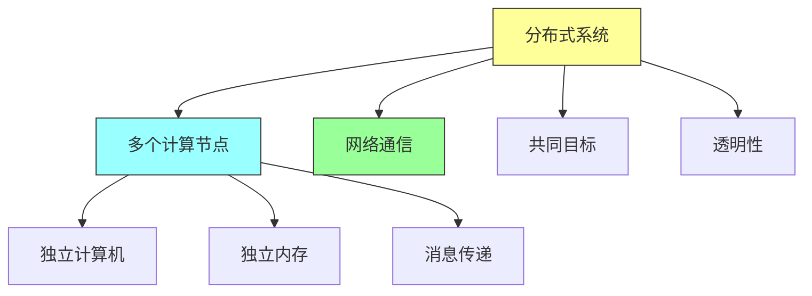
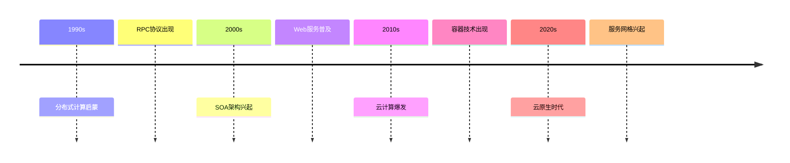
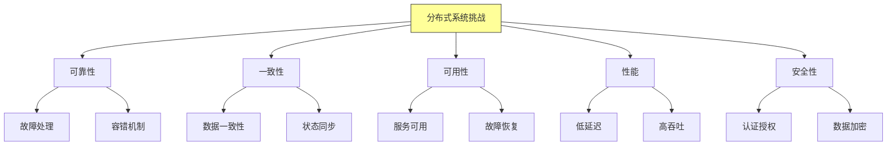
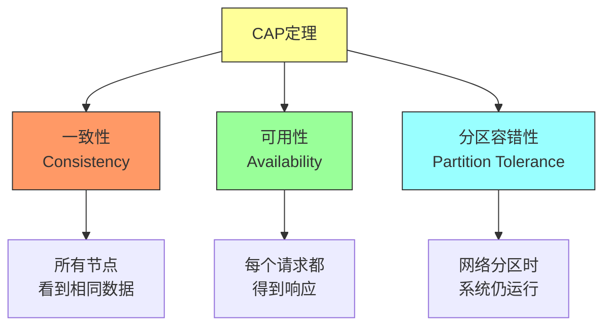
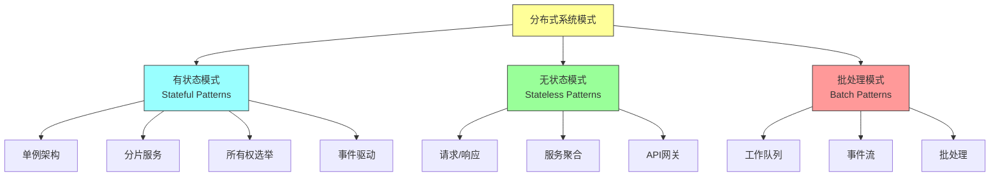
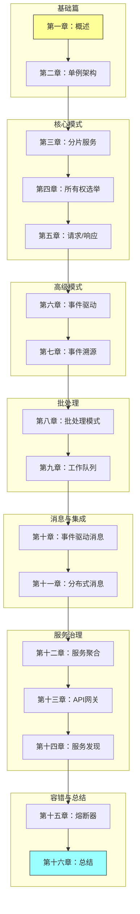
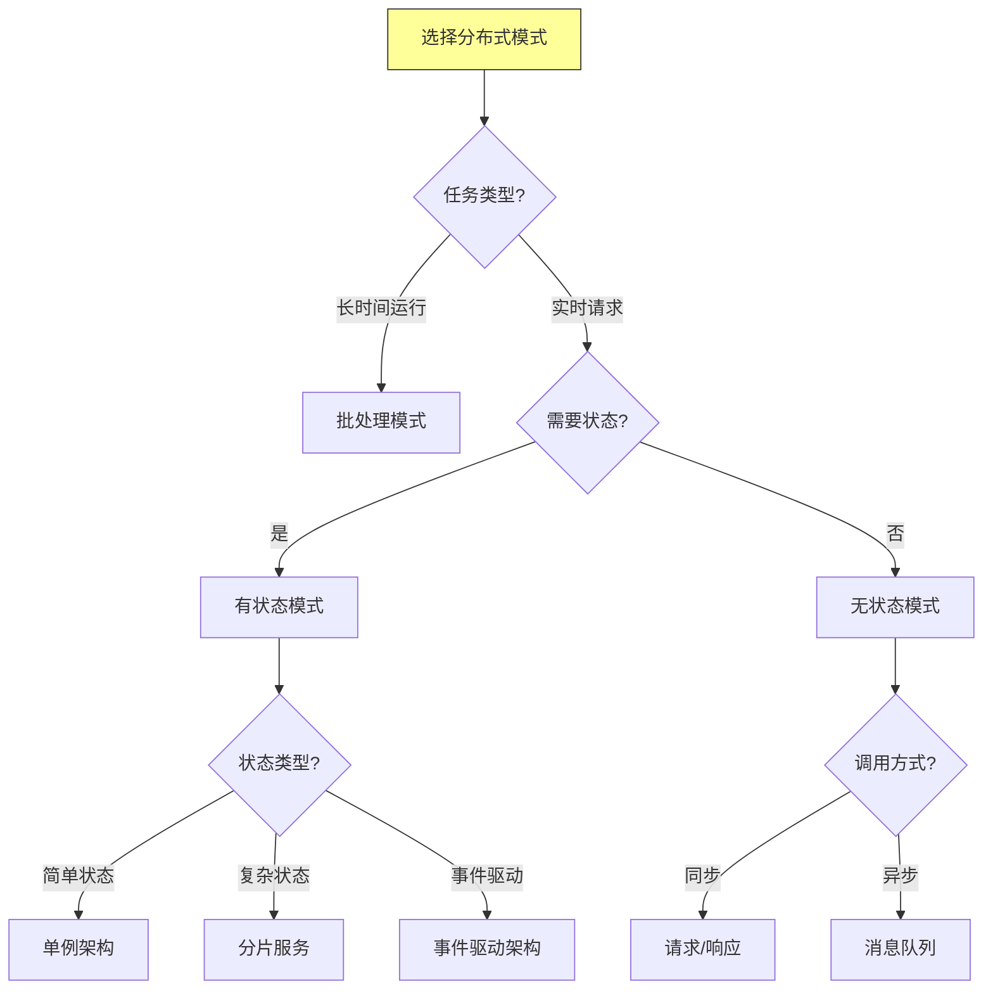
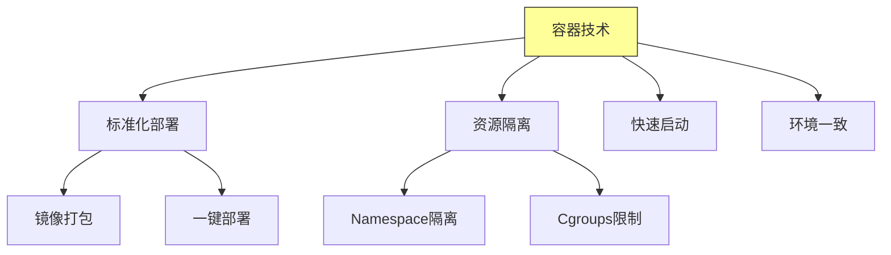
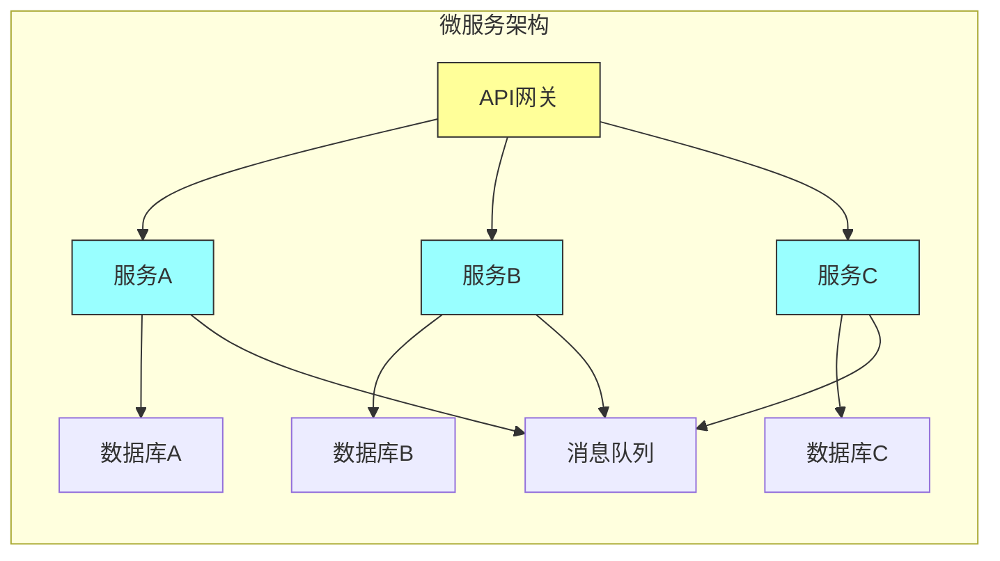

# 第一章：Introducing Distributed Systems

## 一、分布式系统概述

### 1.1 分布式系统的定义

分布式系统是由多个相互连接的独立计算机组成的系统，这些计算机协调完成共同的任务：

**核心特征**：
- **节点独立性**：每个节点都有自己的内存和处理器
- **网络通信**：节点间通过消息传递进行通信
- **共同目标**：所有节点协作完成特定任务
- **透明性**：对用户隐藏分布的复杂性

### 1.2 分布式系统的演进

分布式系统的发展历程：

**关键技术里程碑**：
- RPC（远程过程调用）：使分布式调用像本地调用一样简单
- 消息队列：实现异步通信和解耦
- 容器化：标准化应用部署
- Kubernetes：容器编排的事实标准

## 二、分布式系统的挑战

### 2.1 核心挑战分类

分布式系统面临的主要挑战：

### 2.2 CAP定理

CAP定理是分布式系统的基本定理：

**CAP权衡**：
- **CP系统**：优先保证一致性和分区容错性（如分布式数据库）
- **AP系统**：优先保证可用性和分区容错性（如DNS、缓存系统）
- **CA系统**：在无网络分区时才可能实现

### 2.3 故障模型

分布式系统中的故障类型：

| 故障类型 | 描述 | 处理策略 |
|---------|------|---------|
| 崩溃故障 | 节点突然停止工作 | 心跳检测、重启 |
| 遗漏故障 | 消息丢失 | 重试机制、确认机制 |
| 拜占庭故障 | 节点表现恶意 | 冗余验证、共识算法 |
| 网络分区 | 网络分裂成两部分 | 自动恢复、状态同步 |

## 三、本书的结构

### 3.1 模式分类

本书将分布式系统模式分为三大类：

### 3.2 学习路径

本书的学习路径设计：

### 3.3 模式选择指南

根据场景选择合适的分布式模式：

## 四、容器与微服务

### 4.1 容器技术

容器技术是现代分布式系统的基础：

**容器优势**：
- **轻量级**：相比虚拟机，容器共享宿主OS，开销更小
- **可移植**：一次构建，到处运行
- **快速启动**：秒级启动时间
- **版本管理**：支持镜像版本控制

### 4.2 微服务架构

微服务是分布式系统的具体实现方式：

**微服务原则**：
- **单一职责**：每个服务只做一件事
- **松耦合**：服务间通过API通信
- **高内聚**：相关功能集中在同一服务
- **独立部署**：可以独立部署和扩展

## 五、总结与启示

核心要点：
- 分布式系统由多个独立节点组成，通过网络通信协作
- CAP定理指导我们在一致性、可用性、分区容错之间做出权衡
- 容器和微服务是现代分布式系统的主流实现方式
- 本书提供三大类模式：有状态、无状态、批处理模式

---

*本章精读笔记完成*
