# 第二章：Singleton Architectures

## 一、单例架构概述

### 1.1 单例架构定义

单例架构（Singleton Architecture）是一种最简单的有状态分布式模式：

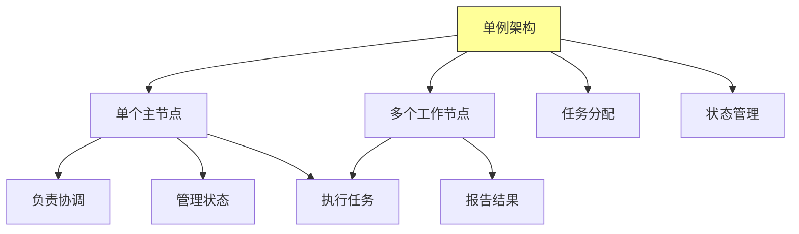

**核心特征**：
- **单一主节点**：系统中只有一个主节点负责任务分配和状态管理
- **多个工作节点**：工作节点并行执行任务
- **中心化协调**：主节点作为协调中心
- **状态集中**：状态信息集中在主节点

### 1.2 单例架构的适用场景

什么时候使用单例架构：

| 场景 | 描述 | 示例 |
|-----|------|-----|
| 协调服务 | 需要集中协调的服务 | 分布式锁管理器 |
| 配置管理 | 集中管理配置信息 | 配置中心 |
| 任务调度 | 任务需要串行或按序执行 | 任务调度器 |
| 状态存储 | 需要维护全局状态 | 分布式缓存主节点 |

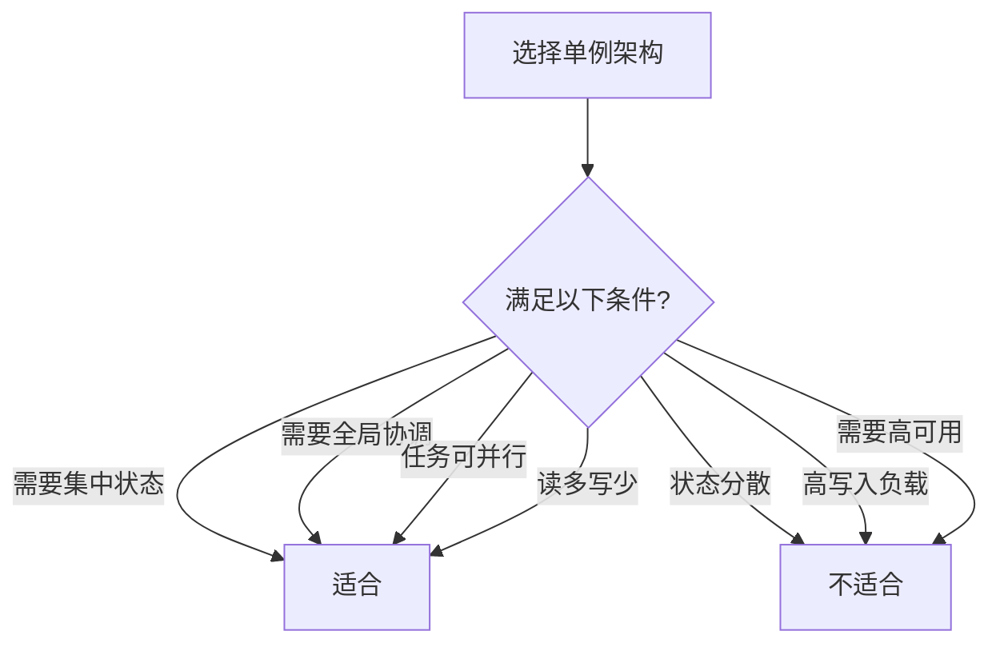

## 二、主-工作模式

### 2.1 模式结构

主-工作模式（Master-Worker Pattern）是最基本的单例架构：

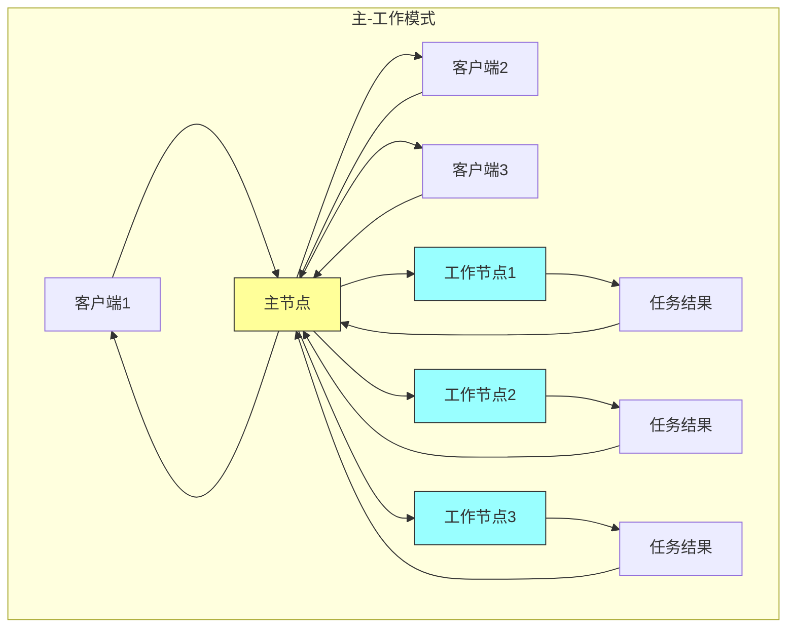

**工作流程**：
1. 客户端发送请求到主节点
2. 主节点将任务分配给工作节点
3. 工作节点执行任务并返回结果
4. 主节点汇总结果并返回给客户端

### 2.2 主节点职责

主节点的核心职责：

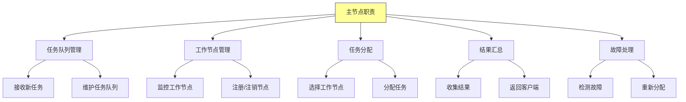

### 2.3 工作节点职责

工作节点的核心职责：

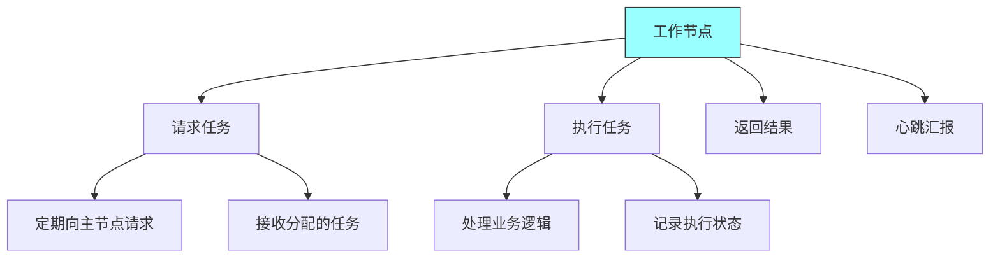

## 三、分布式键值存储示例

### 3.1 系统架构

使用主-工作模式实现分布式键值存储：

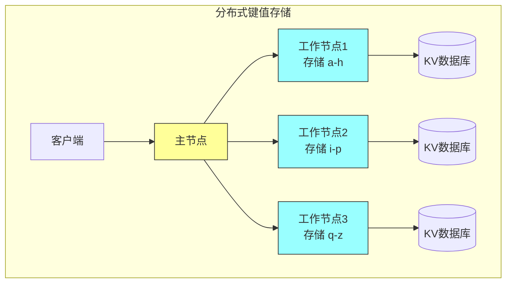

### 3.2 数据分片策略

键值存储的数据分片策略：

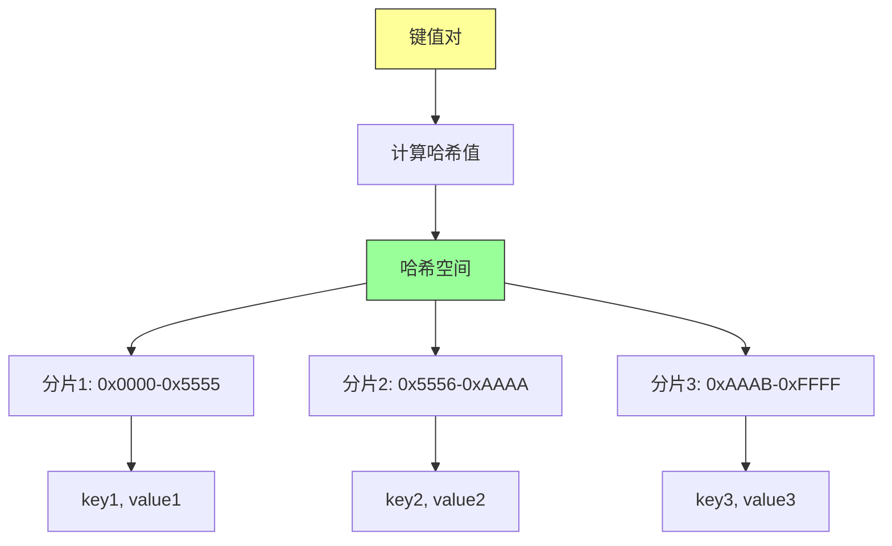

**分片算法**：
```python
def get_shard(key):
    hash_value = hash(key)
    shard_index = hash_value % num_shards
    return shard_index
```

### 3.3 请求处理流程

客户端请求的处理流程：

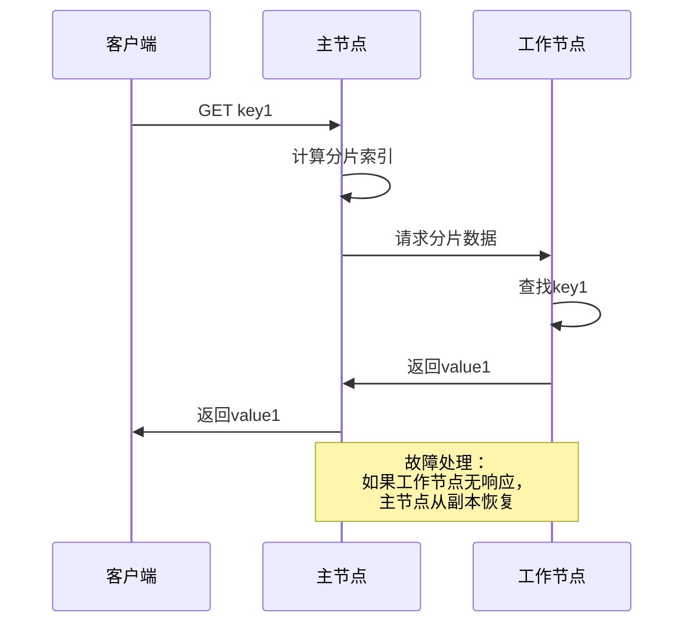

## 四、使用工作队列的单例架构

### 4.1 工作队列模式

使用消息队列实现解耦的主-工作架构：

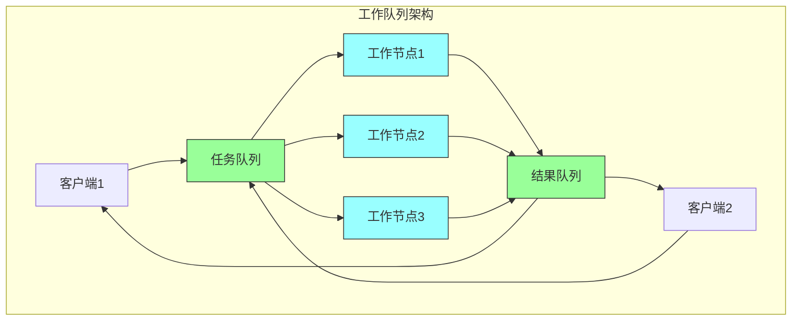

### 4.2 异步处理优势

工作队列模式的优势：

| 优势 | 描述 |
|-----|------|
| **解耦** | 生产者和消费者独立演进 |
| **削峰填谷** | 应对突发流量 |
| **负载均衡** | 自动分配任务到空闲节点 |
| **可靠性** | 消息持久化，故障不丢失 |
| **可扩展** | 动态增加工作节点 |

### 4.3 任务分配策略

主节点的多种任务分配策略：

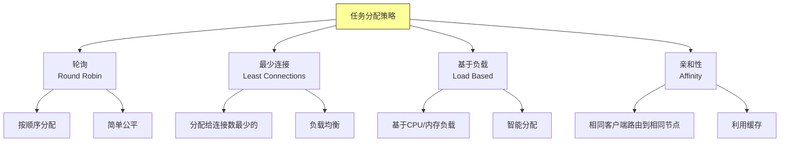

## 五、单例架构的优缺点

### 5.1 优点

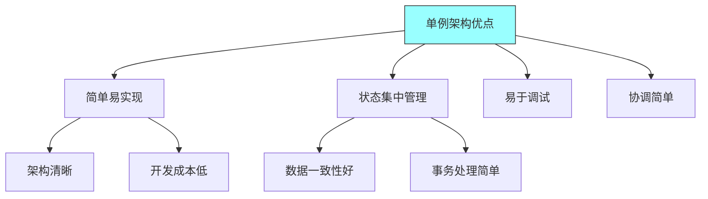

### 5.2 缺点与限制

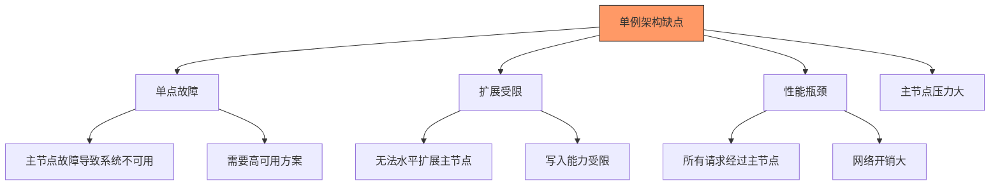

### 5.3 高可用方案

解决单点故障的方案：

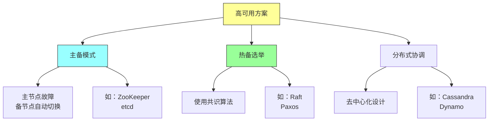

## 六、总结与启示

核心要点：
- 单例架构是最简单的有状态分布式模式，适合需要集中协调的场景
- 主-工作模式中，主节点负责任务分配和状态管理
- 工作队列实现解耦的生产者-消费者模式
- 单例架构的主要问题是单点故障和扩展受限

---

*本章精读笔记完成*
