# 第三章：Sharded Services

## 一、分片架构概述

### 1.1 分片定义

分片（Sharding）是将数据分散存储在多个节点上的技术：

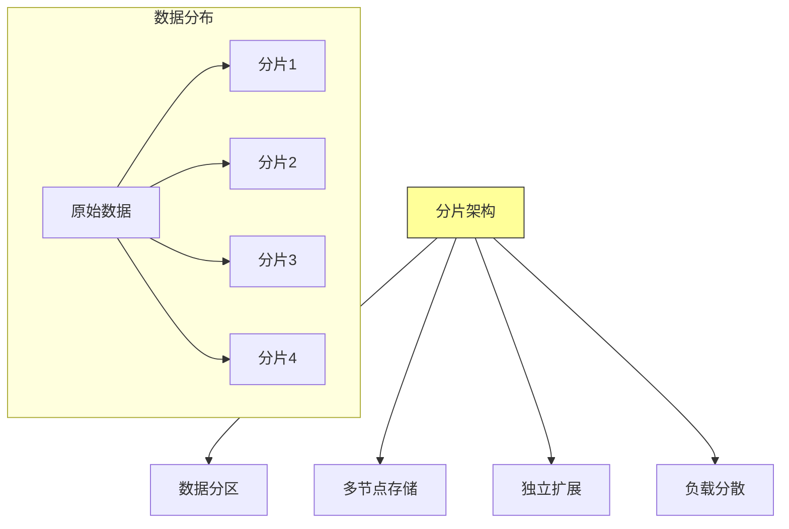

**核心思想**：将大型数据集分割成较小的、可管理的部分，每个分片存储在不同的服务器上。

### 1.2 分片 vs 复制

分片与复制是两种不同的数据分布策略：

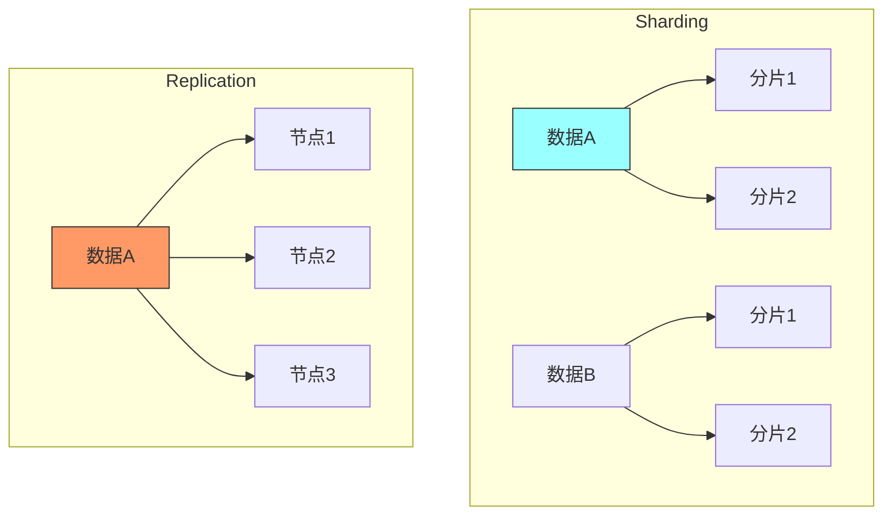

| 特性 | 分片 | 复制 |
|-----|------|-----|
| **目的** | 水平扩展存储能力 | 提高可用性和读取性能 |
| **数据分布** | 不同节点存储不同数据 | 所有节点存储相同数据 |
| **写入扩展** | 可以线性扩展写入 | 写入无法扩展 |
| **一致性** | 需要跨分片协调 | 副本同步 |

## 二、分片模式

### 2.1 水平分片

水平分片按行分割数据：

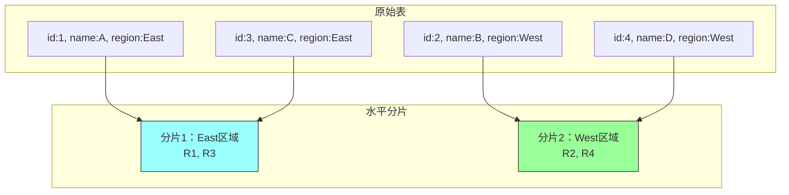

**水平分片特点**：
- 每个分片包含部分行
- 所有分片有相同的列结构
- 按行分割数据

### 2.2 垂直分片

垂直分片按列分割数据：

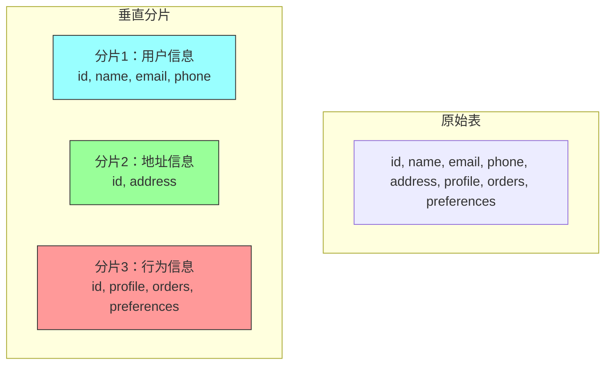

**垂直分片特点**：
- 每个分片包含部分列
- 每个分片可以独立优化
- 适合列访问模式不同的情况

### 2.3 混合分片

结合水平和垂直分片：

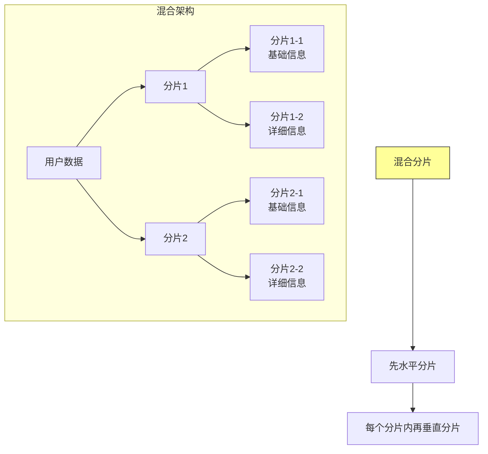

## 三、分片键选择

### 3.1 分片键的重要性

分片键是决定数据分配策略的关键字段：

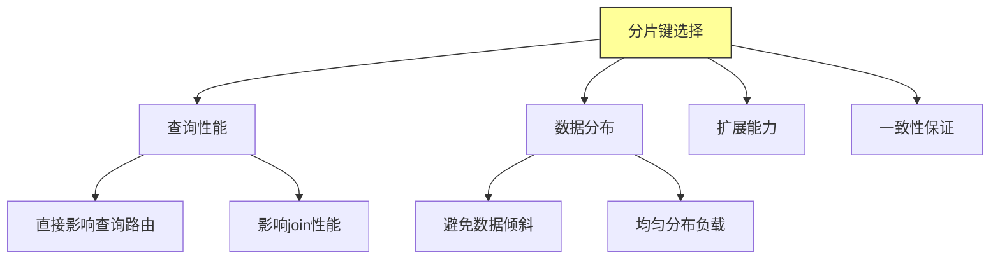

### 3.2 分片键类型

常见的分片键类型：

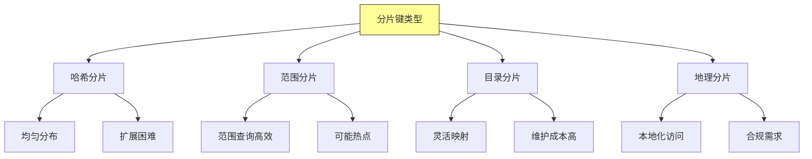

### 3.3 分片策略对比

| 策略 | 优点 | 缺点 | 适用场景 |
|-----|------|------|---------|
| **哈希分片** | 数据均匀 | 范围查询低效 | 随机访问 |
| **范围分片** | 范围查询快 | 可能热点 | 时间序列 |
| **目录分片** | 灵活 | 维护复杂 | 多租户 |
| **地理分片** | 低延迟 | 跨区域查询复杂 | 全球化应用 |

### 3.4 分片键选择最佳实践

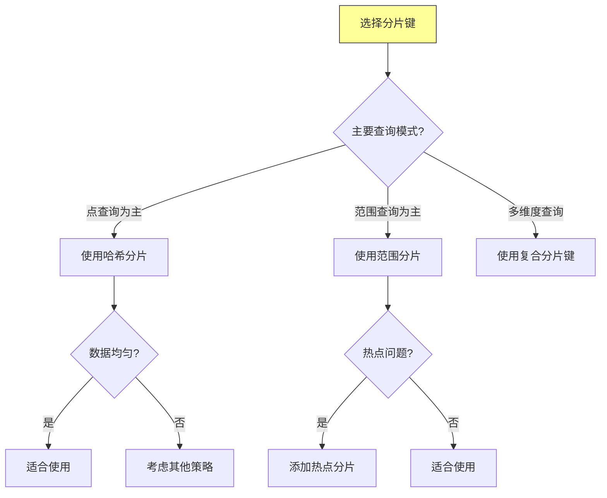

## 四、分片再平衡

### 4.1 何时需要再平衡

触发分片再平衡的场景：

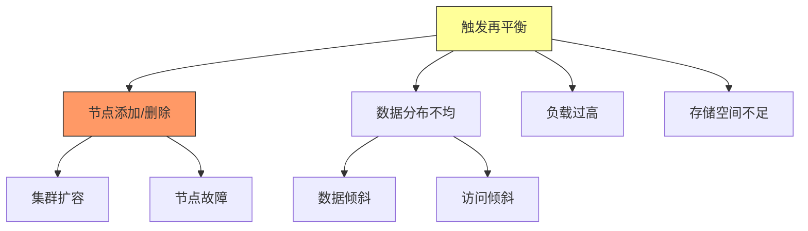

### 4.2 再平衡策略

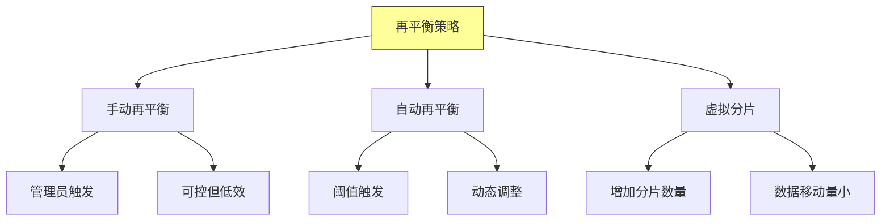

### 4.3 再平衡过程

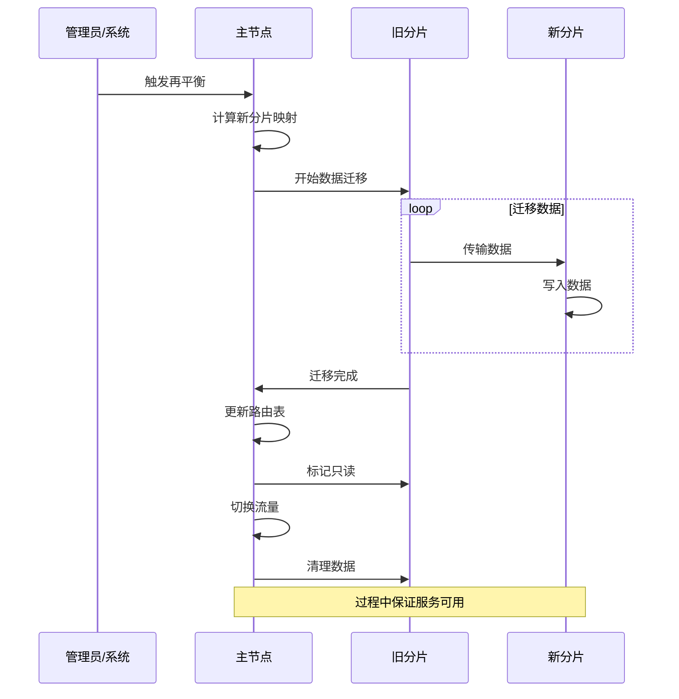

### 4.4 数据迁移策略

| 策略 | 描述 | 优点 | 缺点 |
|-----|------|------|------|
| **离线迁移** | 停止服务后迁移 | 简单 | 停机时间长 |
| **在线不中断迁移迁移** | 服务 | 用户无感知 | 复杂 |
| **双写策略** | 同时写入新旧节点 | 平滑过渡 | 写入延迟 |

## 五、分片与复制结合

### 5.1 分片+复制架构

分片和复制通常结合使用：

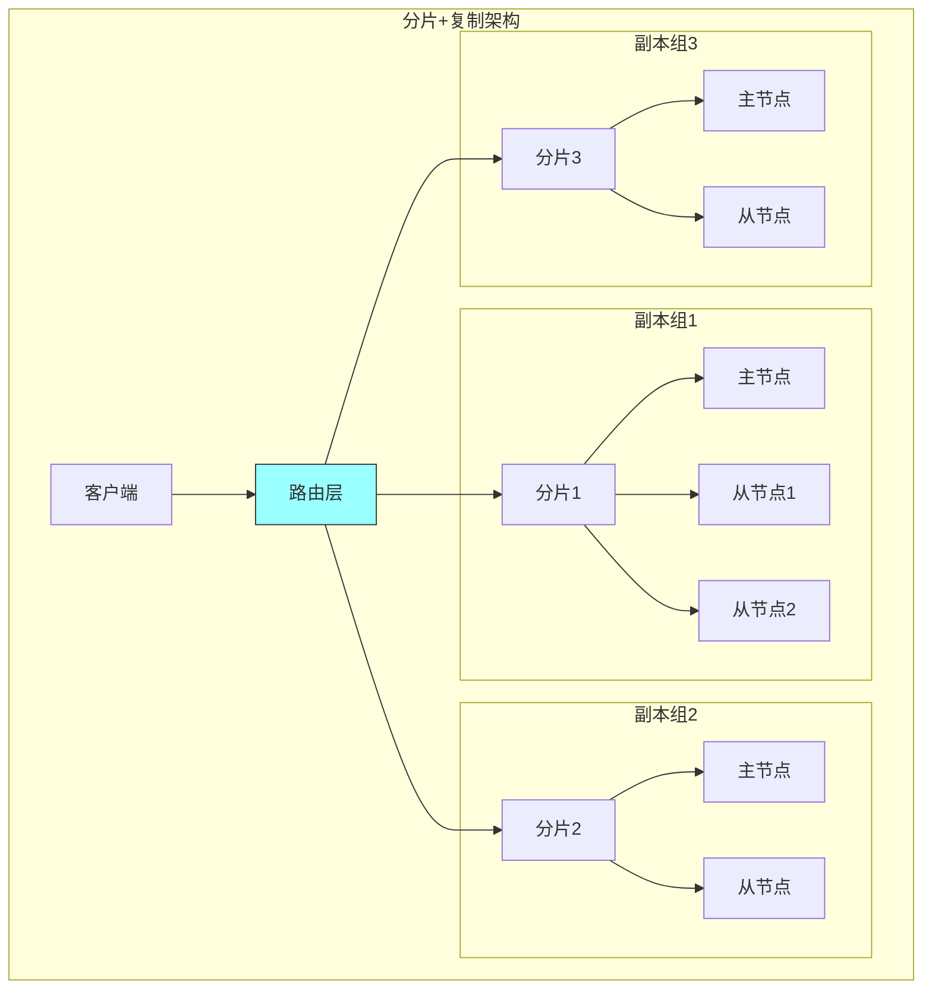

### 5.2 写入流程

结合复制后的写入流程：

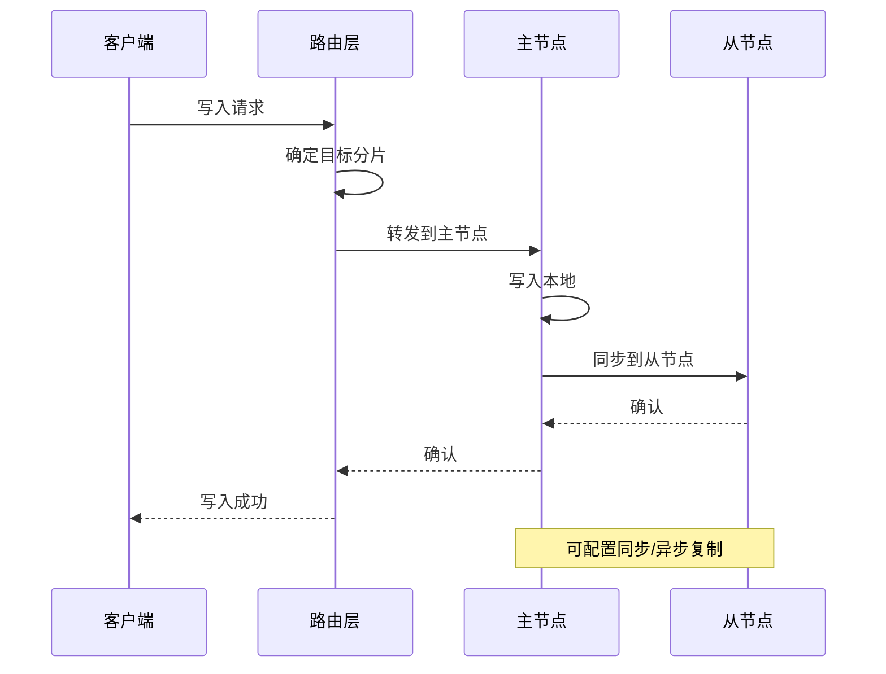

### 5.3 读请求优化

读请求可以根据一致性要求路由到不同节点：

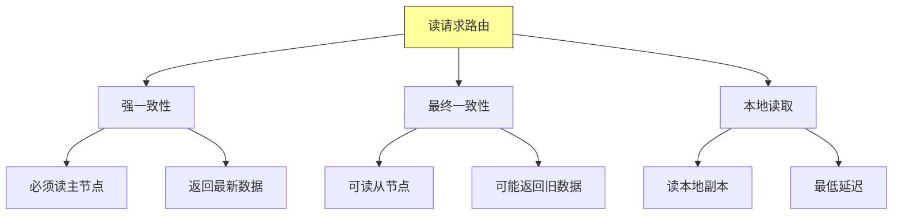

## 六、总结与启示

核心要点：
- 分片通过数据分区实现水平扩展
- 分片键选择直接影响系统性能和扩展能力
- 分片再平衡是保持系统均衡的关键机制
- 分片与复制结合可以同时获得扩展性和高可用性

---

*本章精读笔记完成*
