# 第四章：Ownership and Election

## 一、领导选举概述

### 1.1 领导选举定义

领导选举（Leader Election）是在分布式系统中选择协调者的过程：

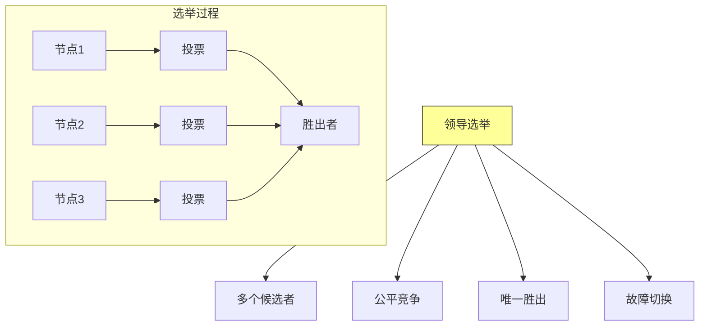

**核心目标**：从多个节点中选择一个作为主协调者，确保系统有且只有一个领导者。

### 1.2 领导选举的必要性

什么时候需要领导选举：

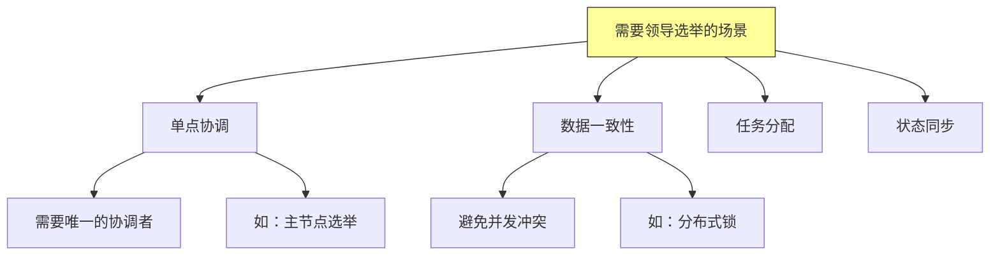

## 二、领导选举算法

### 2.1 Bully算法

Bully算法是最简单的领导选举算法：

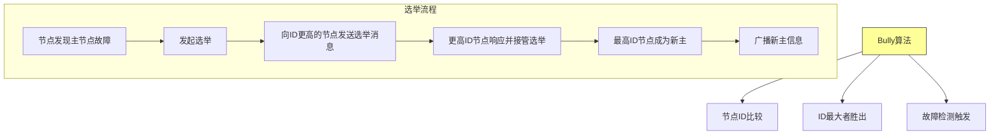

**Bully算法特点**：
- **简单**：实现简单，易于理解
- **快速**：收敛时间短
- **缺点**：ID最大的节点可能成为性能瓶颈

### 2.2 Ring算法

环算法将节点组织成环状结构：

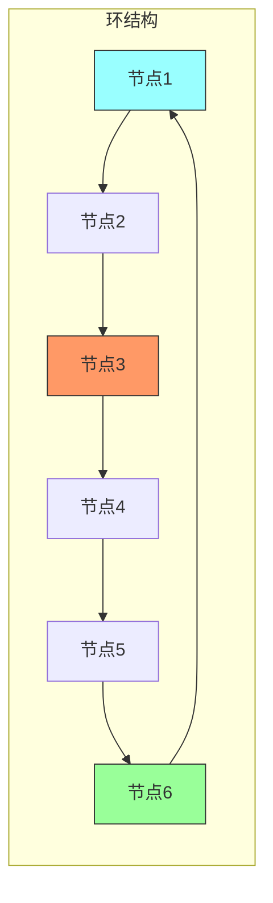

**环算法流程**：
1. 节点按ID排序形成环
2. 检测到故障的节点发起选举
3. 沿环传递选举消息
4. 包含最大ID的消息回到发起者
5. 发起者宣布新领导

### 2.3 Raft算法

Raft是一种现代的共识算法：

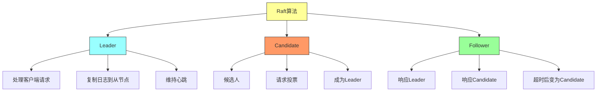

**Raft核心机制**：
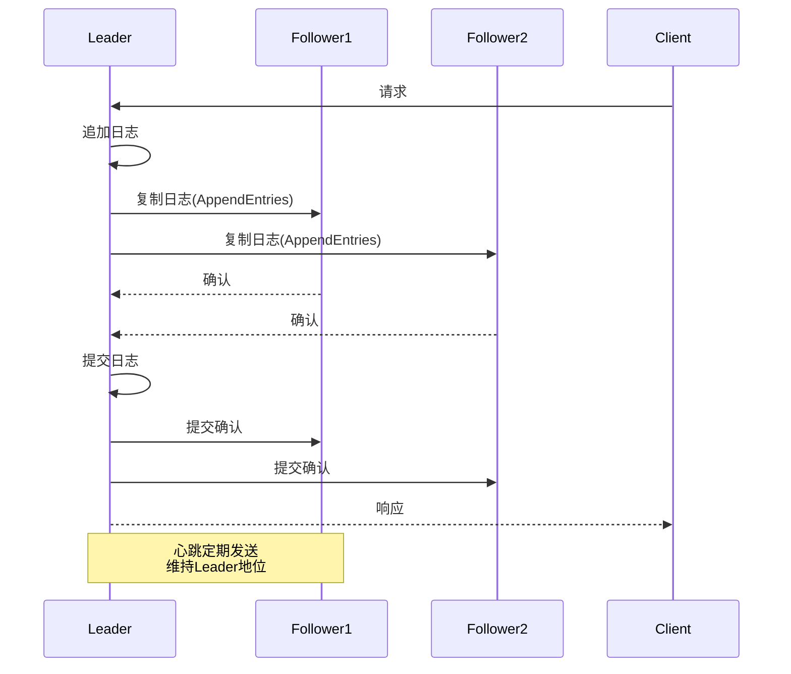

### 2.4 算法对比

| 算法 | 复杂度 | 容错能力 | 实现难度 | 适用场景 |
|-----|-------|---------|---------|---------|
| **Bully** | O(n) | f < n/2 | 低 | 小规模集群 |
| **Ring** | O(n) | f < n/2 | 低 | 环状网络 |
| **Raft** | O(n) | f < n/3 | 中 | 生产环境 |
| **Paxos** | O(n) | f < n/2 | 高 | 学术/复杂场景 |

## 三、分布式锁

### 3.1 分布式锁概念

分布式锁是跨节点的互斥机制：

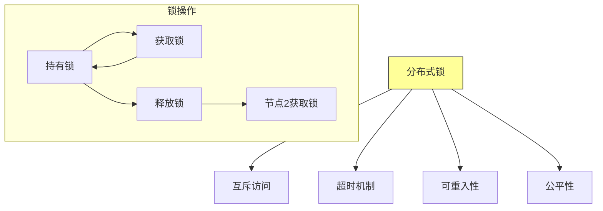

### 3.2 基于ZooKeeper的分布式锁

使用ZooKeeper实现分布式锁：

```mermaid
graph TD
    subgraph ZK锁实现
    Client1[客户端1] --> ZK[ZooKeeper]
    Client2[客户端2] --> ZK

    ZK --> LockNode[/locks/my_lock]
    LockNode --> Ephemeral1[临时节点1<br/>客户端1]
    LockNode --> Ephemeral2[临时节点2<br/>客户端2]
    LockNode --> Ephemeral3[临时节点3<br/>客户端3]

    Ephemeral1 --> Watcher1[Watcher监听]
    Ephemeral2 --> Watcher2
    Ephemeral3 --> Watcher3
    end

    style LockNode fill:#9ff,stroke:#333
```

**ZK锁获取流程**：
1. 在/locks下创建临时顺序节点
2. 获取所有子节点，判断是否最小
3. 如果是最小节点，获取锁成功
4. 否则监听前一个节点的删除事件
5. 收到通知后重新检查

### 3.3 基于etcd的分布式锁

使用etcd的lease和watch机制：

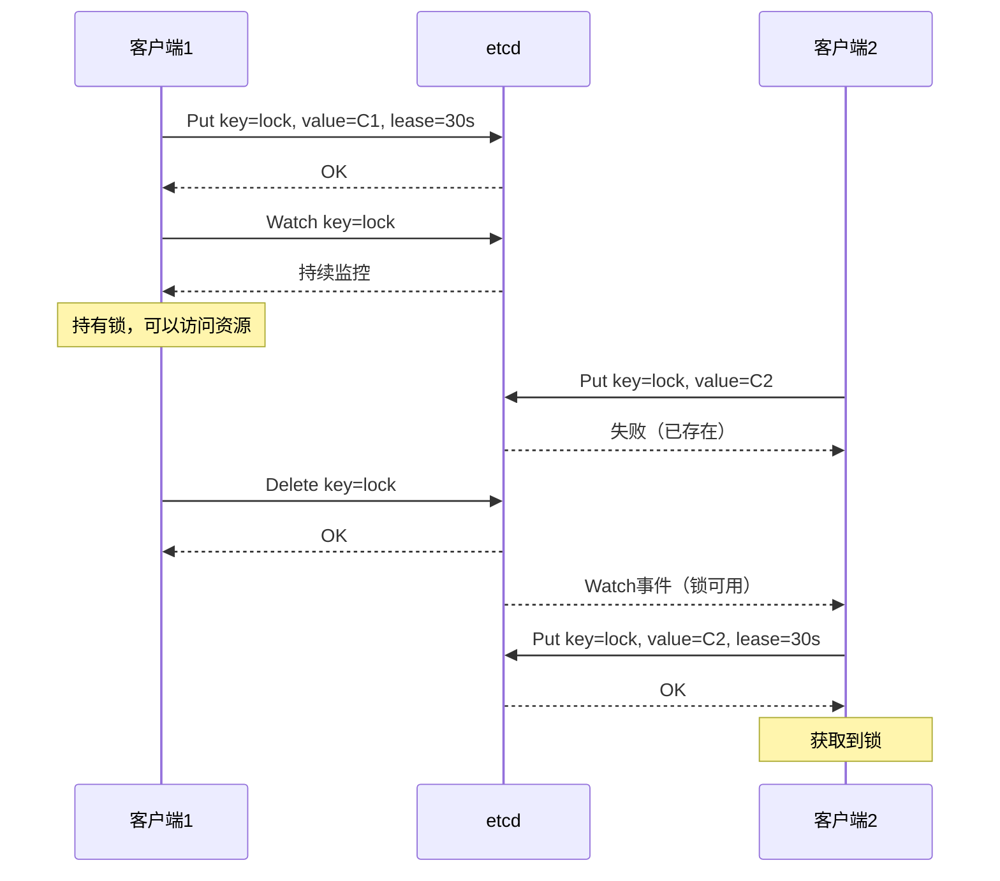

### 3.4 分布式锁使用场景

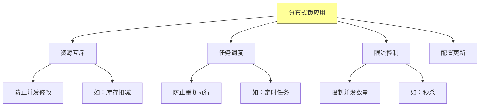

## 四、碎片的动态所有权

### 4.1 动态所有权概念

动态所有权（Dynamic Ownership）允许分片在不同节点间迁移：

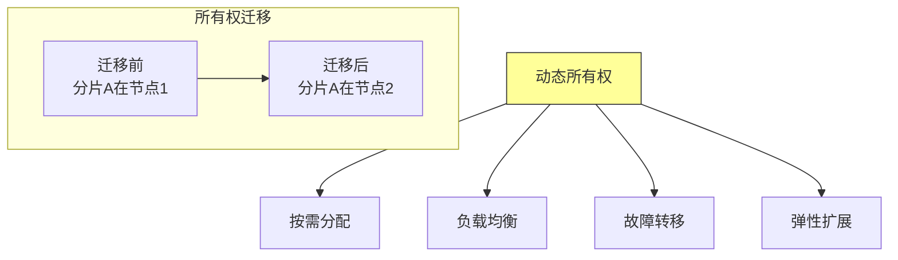

### 4.2 所有权迁移流程

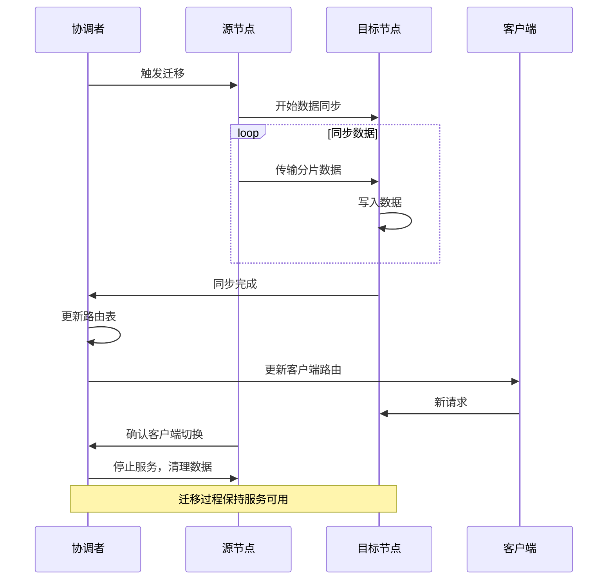

### 4.3 所有权管理策略

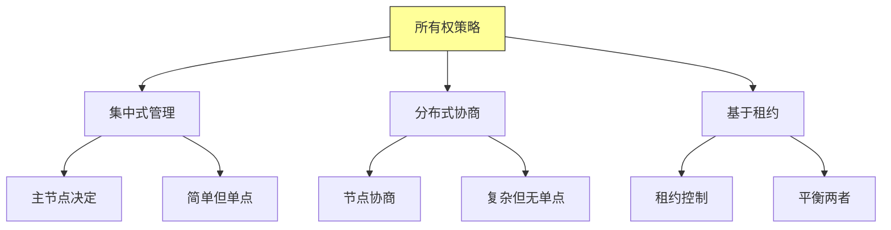

## 五、实现最佳实践

### 5.1 选举算法选择

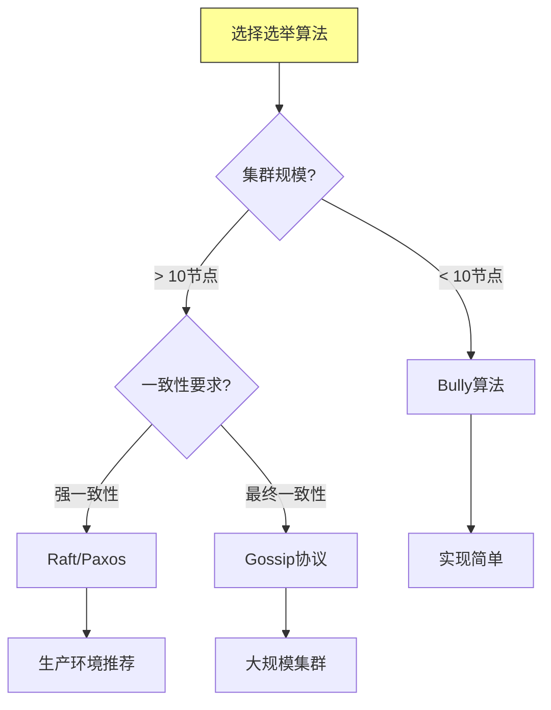

### 5.2 故障检测

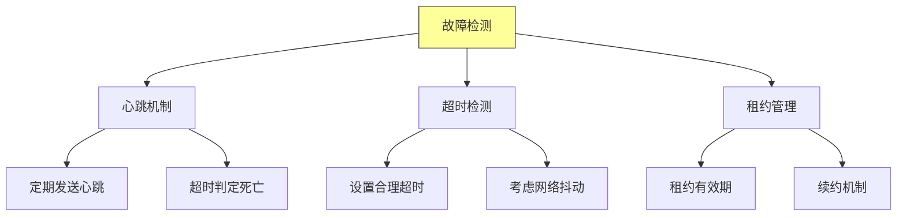

### 5.3 安全性考虑

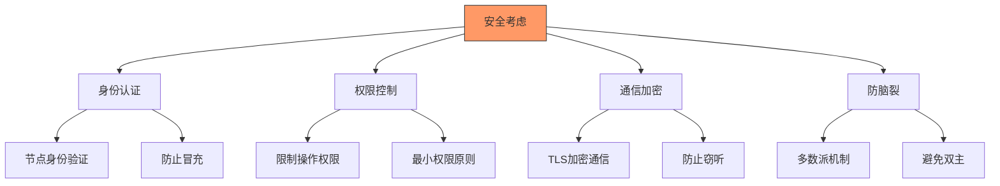

## 六、总结与启示

核心要点：
- 领导选举确保分布式系统中有唯一的协调者
- Bully、Ring算法适用于简单场景，Raft适用于生产环境
- 分布式锁实现资源互斥，支持多种应用场景
- 动态所有权支持分片迁移，实现负载均衡和故障转移

---

*本章精读笔记完成*
