# 第五章：Request/Response

## 一、请求响应模式概述

### 1.1 请求响应定义

请求-响应（Request/Response）是分布式系统中最基本的通信模式：

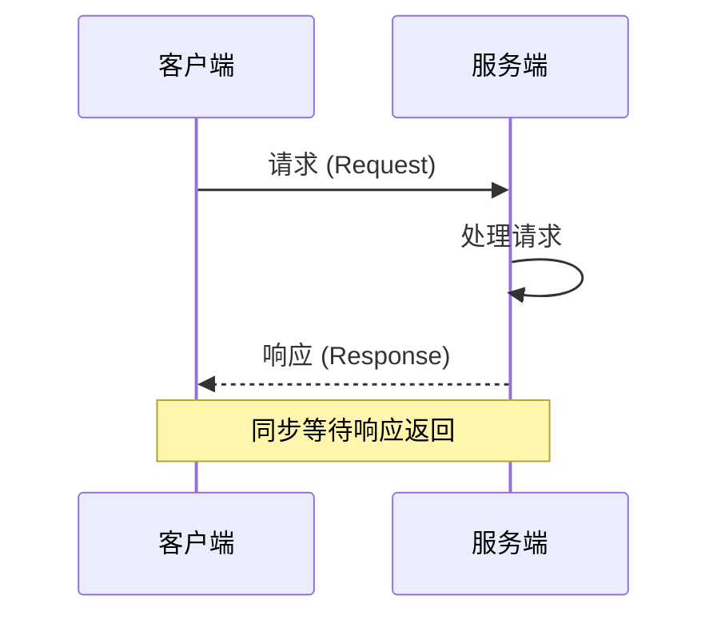

**核心特征**：
- **同步性**：客户端等待服务端响应
- **一对一**：一个请求对应一个响应
- **双向通信**：请求和响应都携带数据

### 1.2 请求响应模式分类

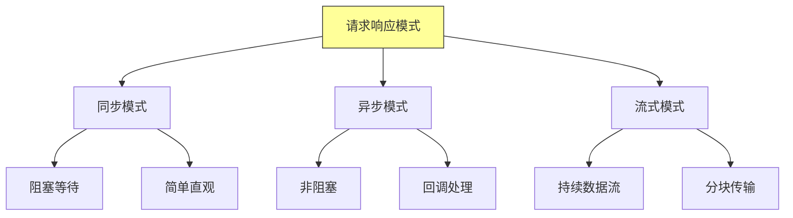

## 二、同步请求响应

### 2.1 同步模式架构

同步请求响应的基本架构：

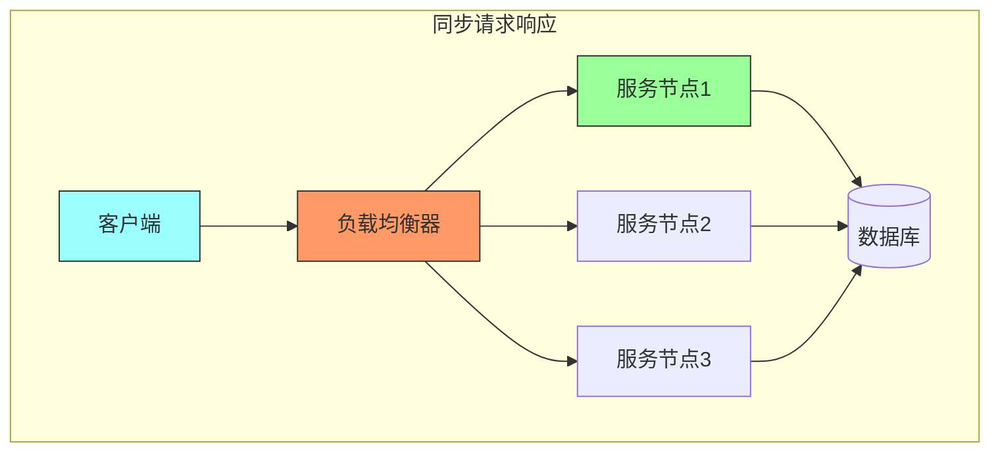

### 2.2 同步调用流程

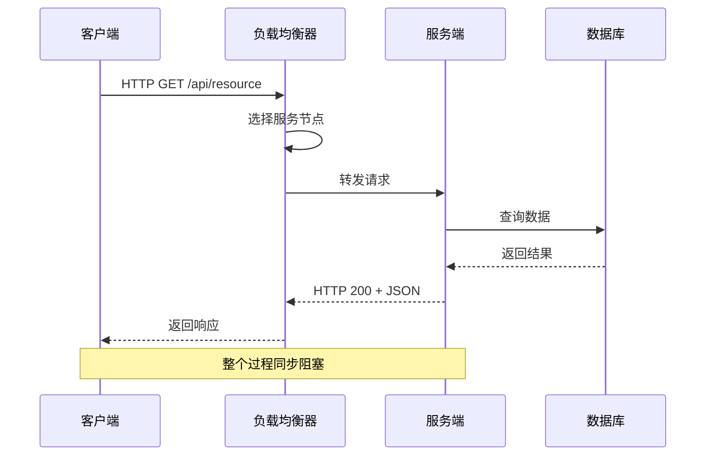

### 2.3 同步模式优缺点

| 优点 | 缺点 |
|-----|------|
| 简单直观，易于理解和调试 | 客户端阻塞等待，降低用户体验 |
| 请求-响应语义清晰 | 长连接消耗资源 |
| 适合短时间操作 | 服务器故障会立即暴露 |
| 易于实现重试逻辑 | 无法支持推送场景 |

## 三、异步请求响应

### 3.1 异步模式架构

异步请求响应通过回调或轮询处理响应：

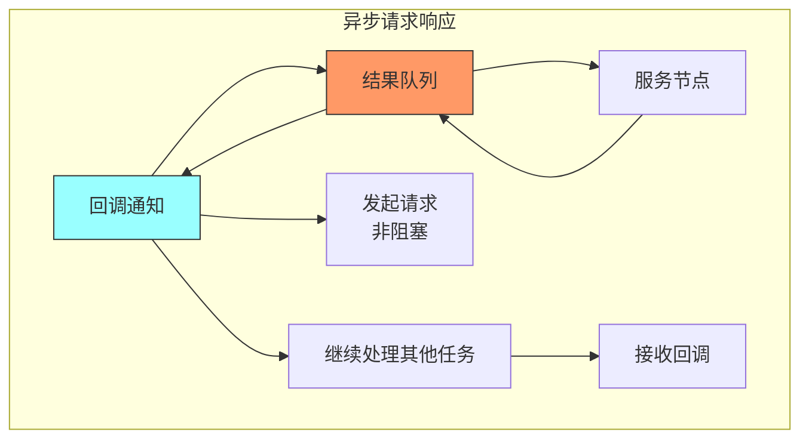

### 3.2 异步调用流程

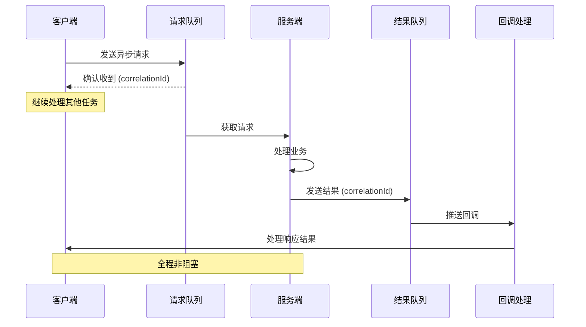

### 3.3 异步实现方式

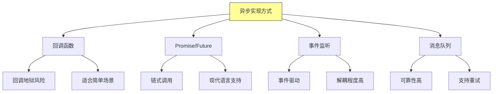

### 3.4 Future模式实现

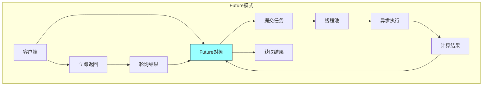

## 四、消息队列异步通信

### 4.1 消息队列架构

使用消息队列实现异步通信：

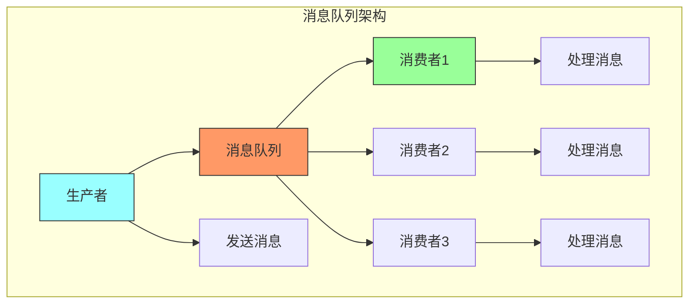

### 4.2 消息队列核心概念

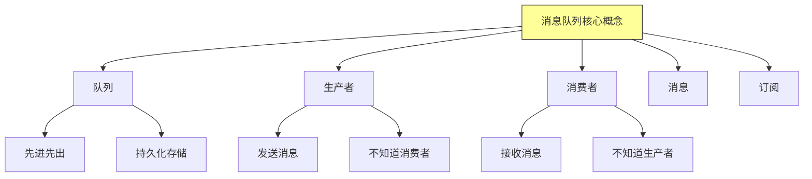

### 4.3 消息模式

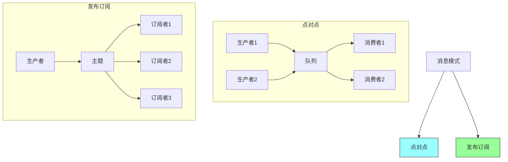

### 4.4 消息队列对比

| 特性 | RabbitMQ | Kafka | RocketMQ |
|-----|----------|-------|----------|
| **协议** | AMQP | 自定义 | 自定义 |
| **持久化** | 支持 | 高性能 | 支持 |
| **顺序消息** | 支持 | 支持 | 支持 |
| **吞吐量** | 中 | 高 | 高 |
| **适用场景** | 企业集成 | 日志/流处理 | 电商订单 |

## 五、负载均衡

### 5.1 负载均衡策略

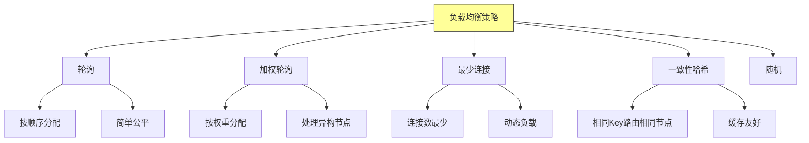

### 5.2 负载均衡架构

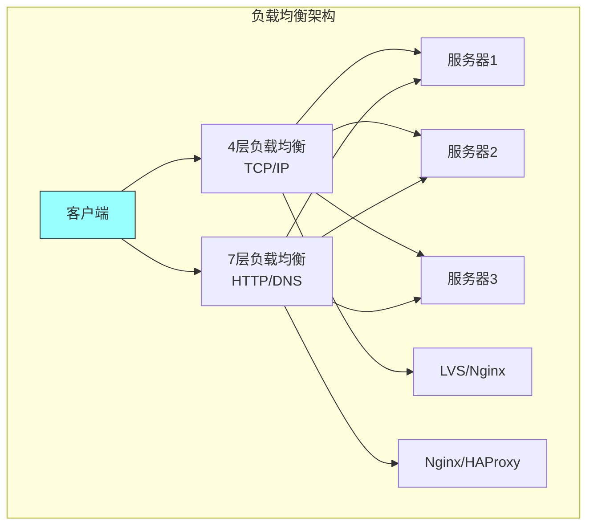

### 5.3 健康检查

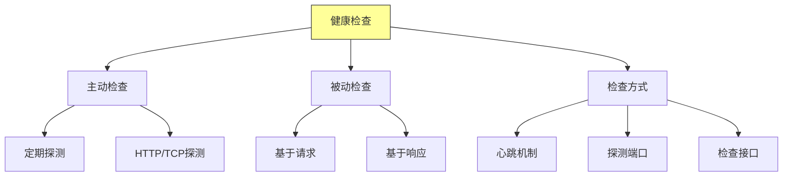

## 六、故障处理

### 6.1 重试机制

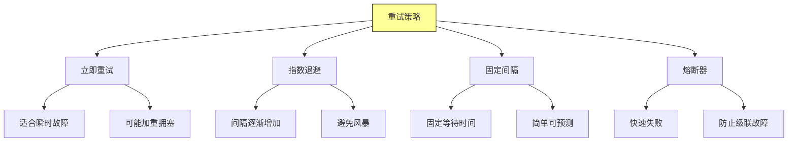

### 6.2 重试流程

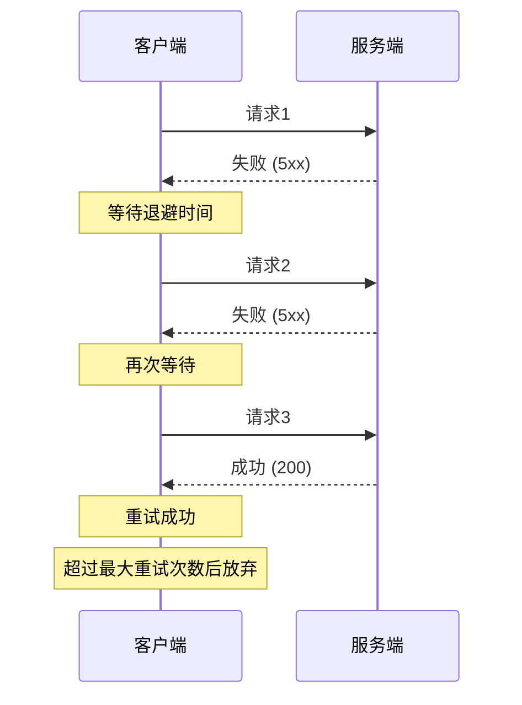

### 6.3 超时设置

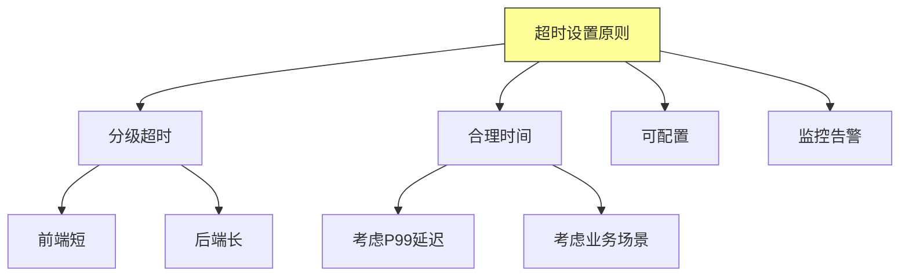

### 6.4 降级策略

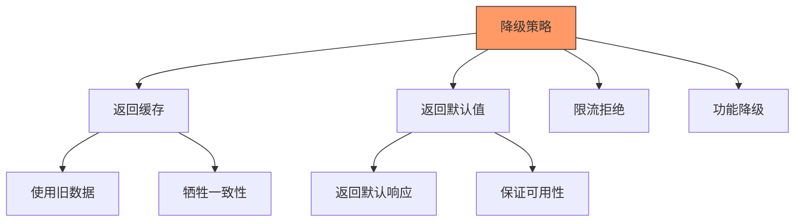

## 七、总结与启示

核心要点：
- 同步请求响应简单直观，但会阻塞客户端
- 异步请求响应提高系统吞吐量和用户体验
- 消息队列实现生产者和消费者的完全解耦
- 负载均衡和故障处理是保证系统可靠性的关键

---

*本章精读笔记完成*
