# 第六章：Event-Driven Architecture

## 一、事件驱动架构概述

### 1.1 事件驱动定义

事件驱动架构（Event-Driven Architecture，EDA）是一种以事件为核心的系统设计范式：

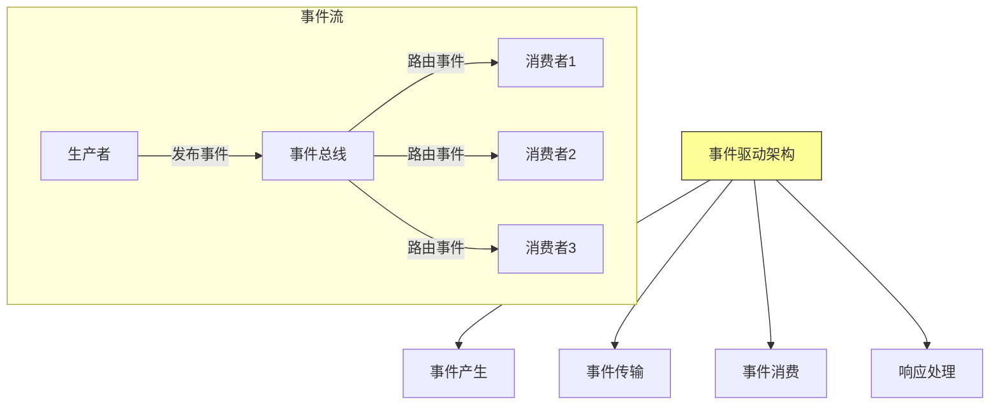

**核心概念**：
- **事件（Event）**：表示已发生事情的状态变化
- **生产者（Producer）**：产生事件的组件
- **消费者（Consumer）**：响应事件的组件
- **事件总线（Event Bus）**：事件传输的中间件

### 1.2 事件驱动特点

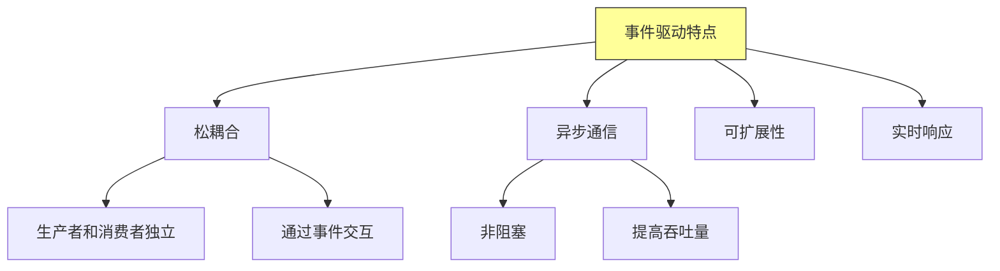

### 1.3 事件驱动 vs 请求驱动

| 特性 | 事件驱动 | 请求驱动 |
|-----|---------|---------|
| **通信模式** | 异步 | 同步 |
| **耦合度** | 松散 | 紧密 |
| **可扩展性** | 高 | 中 |
| **响应时间** | 可变 | 可预测 |
| **适用场景** | 复杂业务流程 | 简单CRUD操作 |

## 二、发布订阅模式

### 2.1 发布订阅架构

发布-订阅（Publish/Subscribe）模式是事件驱动架构的基础：

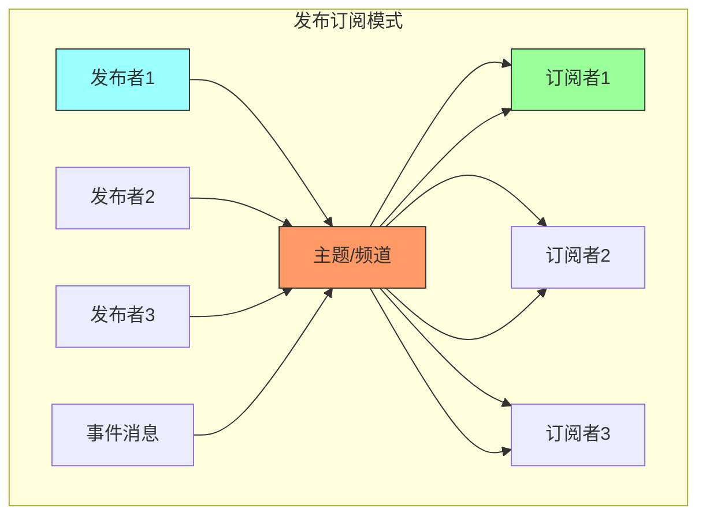

### 2.2 发布订阅流程

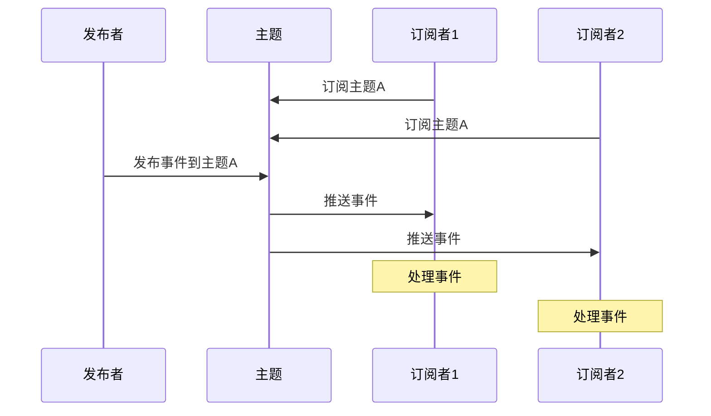

### 2.3 订阅类型

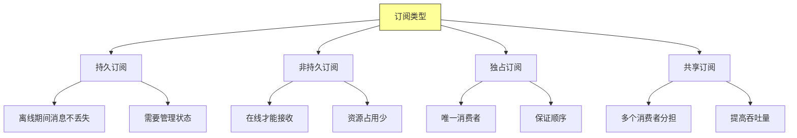

### 2.4 消息路由模式

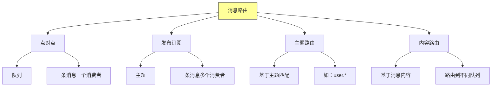

## 三、事件溯源

### 3.1 事件溯源概念

事件溯源（Event Sourcing）是一种通过记录事件来管理状态的方法：

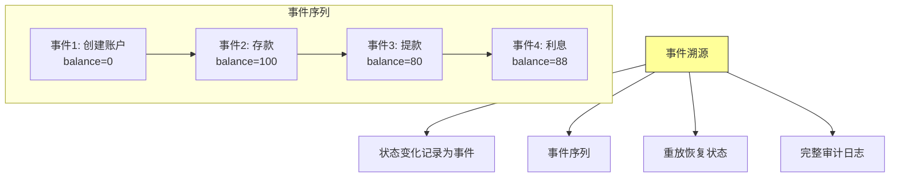

### 3.2 事件溯源架构

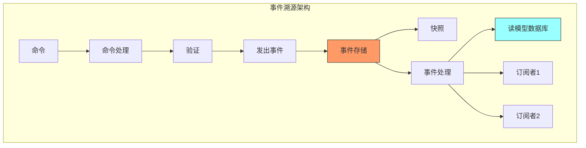

### 3.3 事件溯源优势

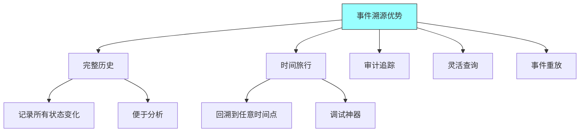

### 3.4 事件溯源挑战

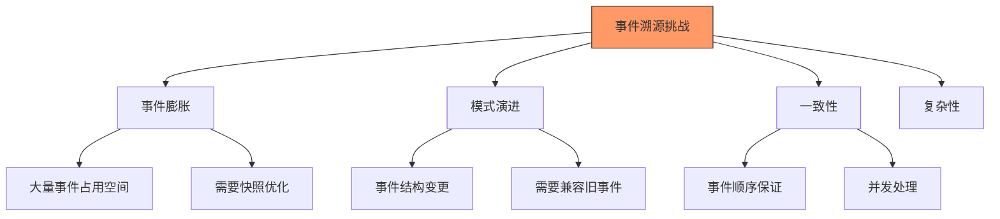

## 四、CQRS模式

### 4.1 CQRS定义

CQRS（Command Query Responsibility Segregation）将读写操作分离：

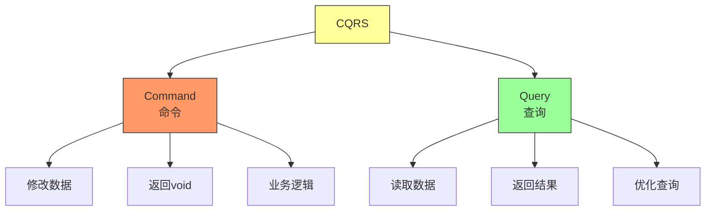

### 4.2 CQRS架构

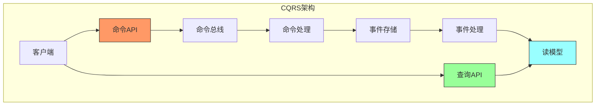

### 4.3 CQRS优势

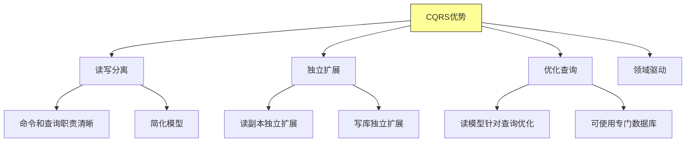

### 4.4 CQRS适用场景

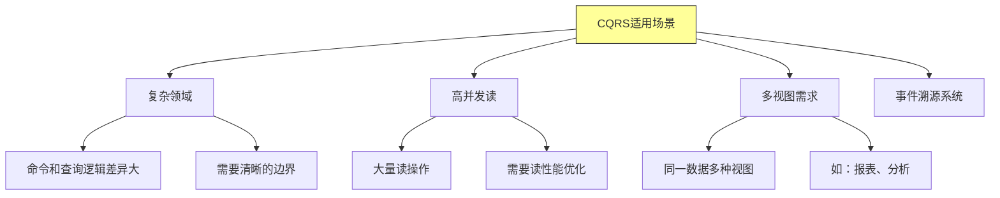

## 五、无状态服务处理事件

### 5.1 无状态事件处理

无状态服务可以水平扩展处理事件：

```mermaid
graph TD
    subgraph 无状态事件处理
    EventBus[事件总线] --> Worker1[Worker1]
    EventBus --> Worker2[Worker2]
    EventBus --> Worker3[Worker3]
    EventBus --> Worker4[Worker4]

    Worker1 --> DB[(数据库)]
    Worker2 --> DB
    Worker3 --> DB
    Worker4 --> DB

    Note over Worker1,Worker4: 所有Worker无状态<br/>可自由扩缩容
    end

    style EventBus fill:#f96,stroke:#333
    style Worker1 fill:#9ff,stroke:#333
```

### 5.2 事件处理保证

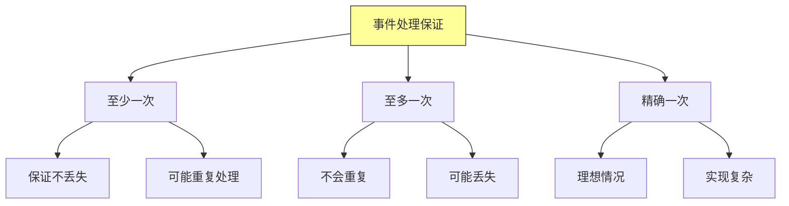

### 5.3 幂等处理

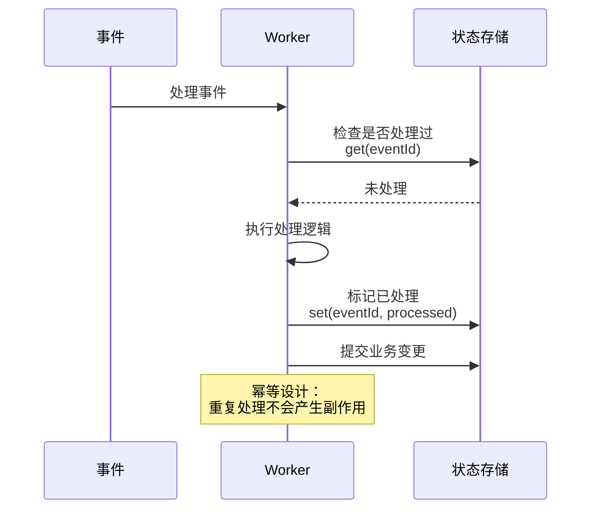

### 5.4 事件处理模式

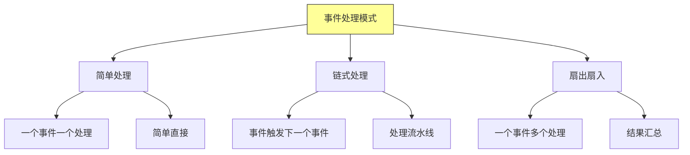

## 六、事件驱动架构实践

### 6.1 技术选型

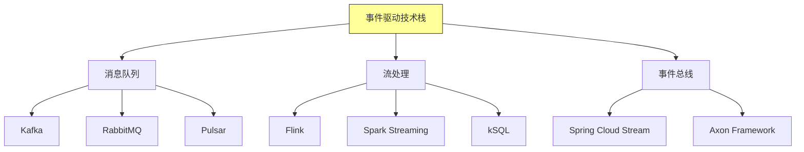

### 6.2 设计原则

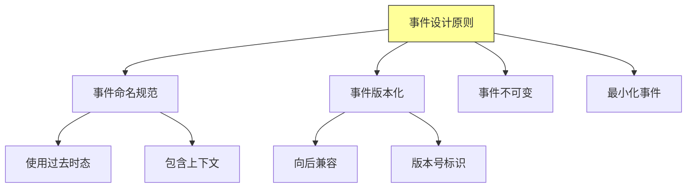

### 6.3 常见问题

```mermaid
graph TD
    A[常见问题] --> B[事件顺序]
    A --> C[事件丢失]
    A --> D[重复消费]
    A --> E[事务处理]

    B --> B1[分区保证顺序]
    B --> B2[全局顺序成本高]

    C --> C1[持久化保证]
    C --> C2[确认机制]

    D --> D1[幂等设计]
    D --> D2[去重表]

    style A fill:#f96,stroke:#333
```

## 七、总结与启示

核心要点：
- 事件驱动架构通过事件实现组件间的松耦合
- 发布订阅模式支持一对多的事件分发
- 事件溯源提供完整的状态变更历史
- CQRS分离读写操作，优化系统性能

---

*本章精读笔记完成*
