# 第七章：Stateful Services and Event Sourcing

## 一、有状态服务概述

### 1.1 有状态服务定义

有状态服务（Stateful Service）维护和管理应用状态：

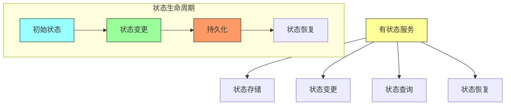

**核心特征**：
- **状态保持**：服务维护客户端会话信息
- **状态依赖**：处理请求需要访问状态
- **状态持久化**：状态需要持久化存储

### 1.2 有状态 vs 无状态

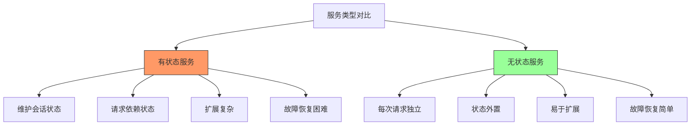

| 特性 | 有状态服务 | 无状态服务 |
|-----|-----------|-----------|
| **状态管理** | 服务内维护 | 外部存储 |
| **扩展性** | 受限 | 高 |
| **故障恢复** | 复杂 | 简单 |
| **性能** | 低延迟 | 需要状态获取 |
| **适用场景** | 会话、游戏 | Web API、批处理 |

## 二、状态管理策略

### 2.1 状态存储位置

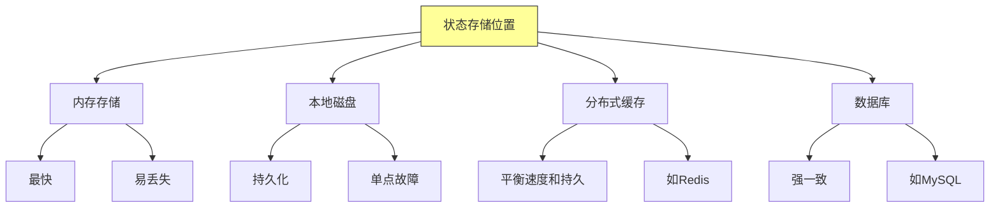

### 2.2 状态同步策略

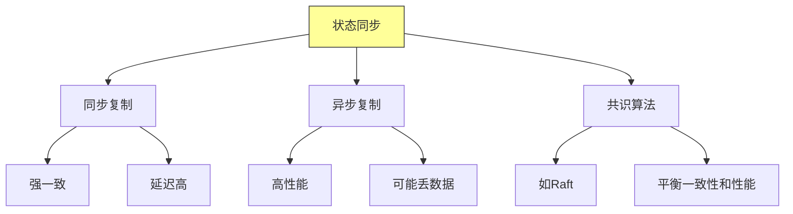

### 2.3 状态分区策略

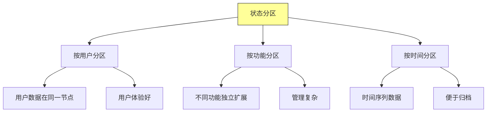

## 三、事件溯源深入

### 3.1 事件溯源架构

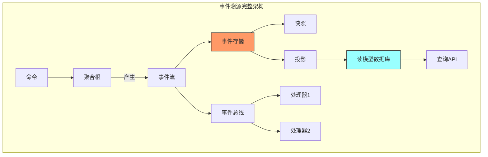

### 3.2 事件结构

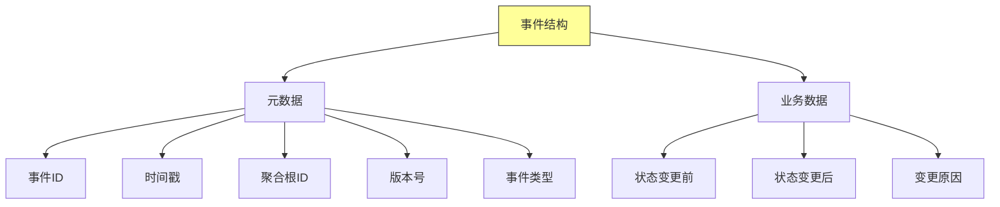

### 3.3 快照机制

```mermaid
sequenceDiagram
    participant S as 快照存储
    participant E as 事件存储
    participant P as 处理器

    Note over P: 事件数量达到阈值
    P->>P: 读取所有事件
    P->>P: 重放构建状态
    P->>S: 保存快照

    Note over P: 下次恢复时
    P->>S: 获取最新快照
    P->>E: 获取快照后事件
    P->>P: 重放增量事件
    P->>P: 恢复完整状态

    style S fill:#9ff,stroke:#333
    style E fill:#f96,stroke:#333
```

### 3.4 投影构建

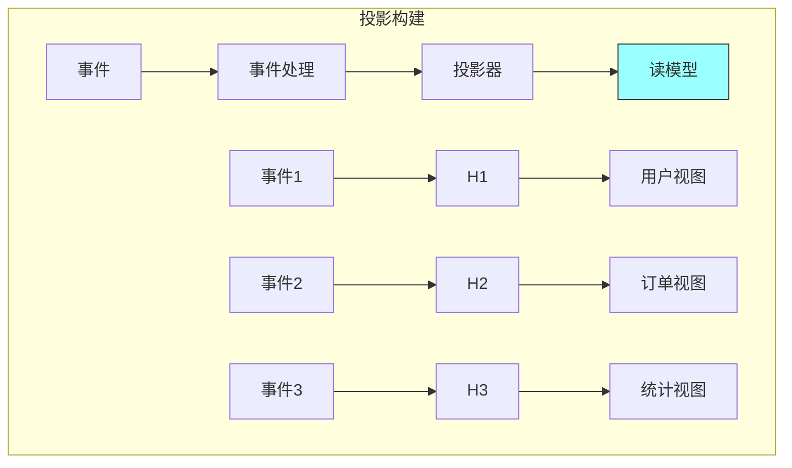

## 四、聚合根模式

### 4.1 聚合根概念

聚合根（Aggregate Root）是聚合的入口点：

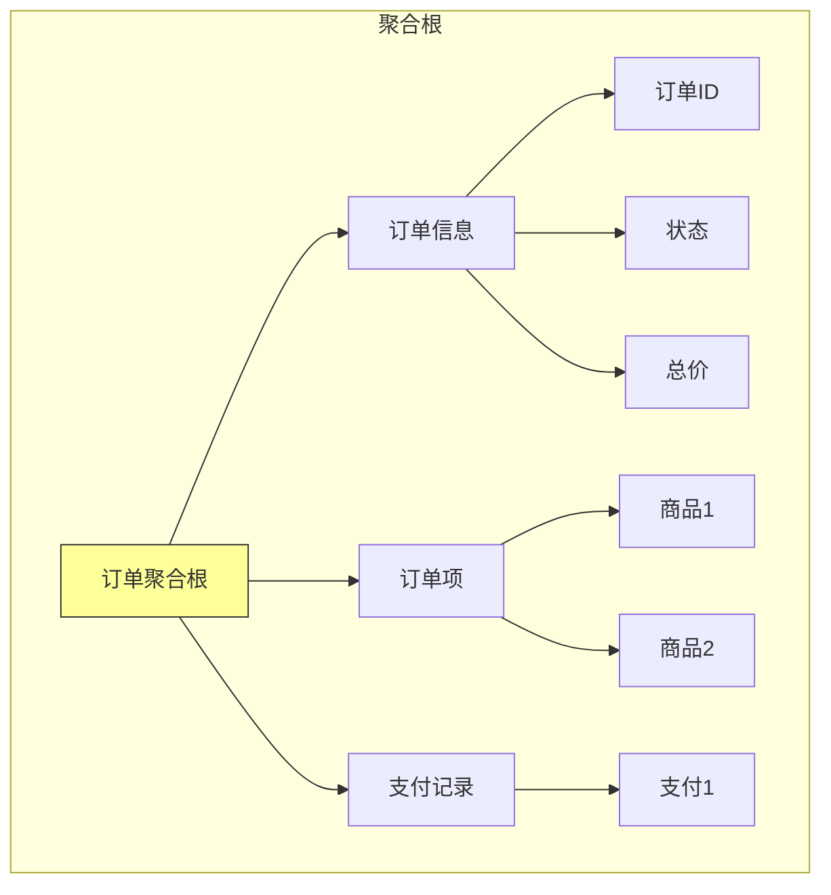

### 4.2 聚合边界

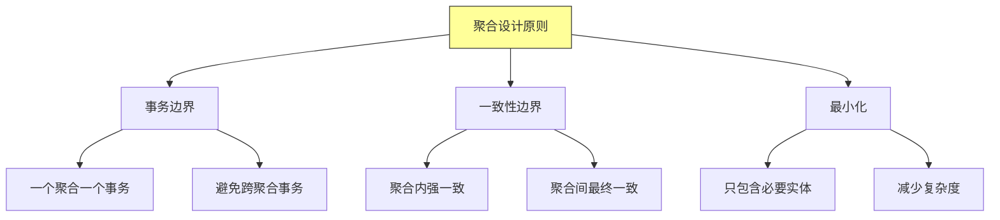

### 4.3 聚合间通信

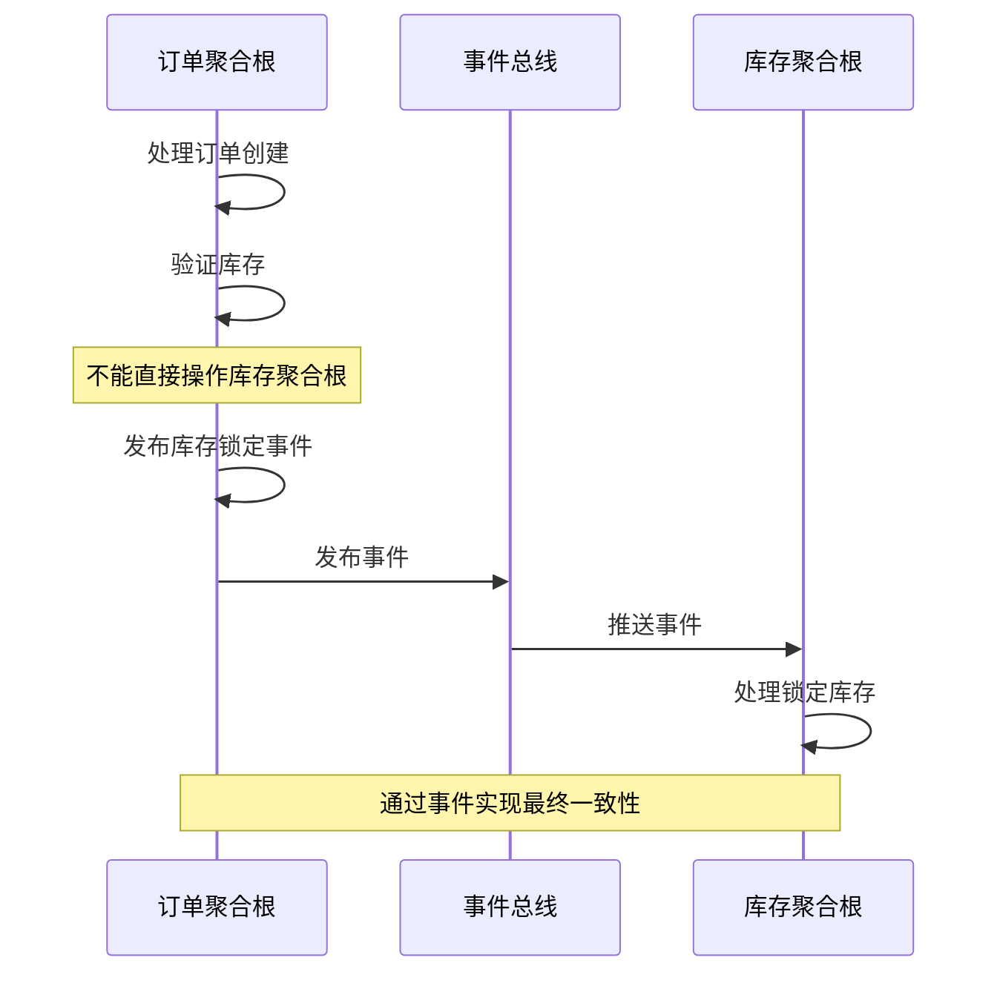

## 五、状态恢复与容错

### 5.1 状态恢复流程

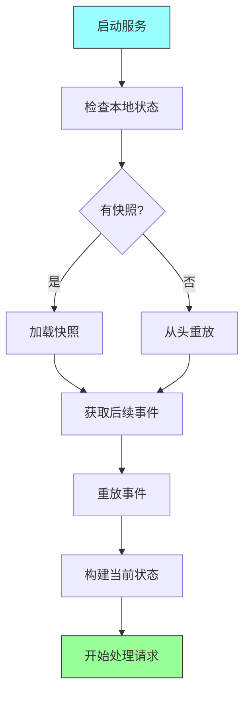

### 5.2 故障恢复策略

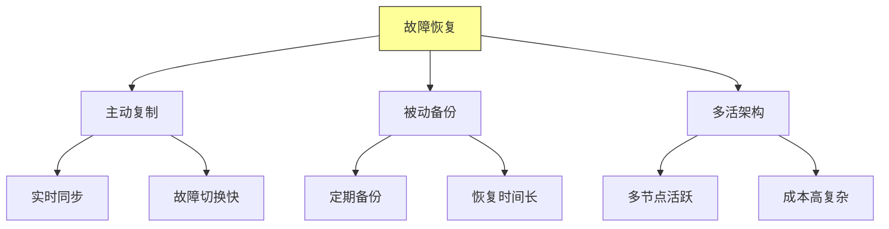

### 5.3 检查点机制

```mermaid
sequenceDiagram
    participant P as 处理进程
    participant E as 事件存储
    participant C as 检查点存储

    loop 处理事件
        P->>E: 读取事件
        E-->>P: 返回事件
        P->>P: 处理事件
        P->>P: 更新状态

        alt 达到检查点间隔
            P->>C: 保存检查点<br/>offset=10000
            Note over P: 故障后可从检查点恢复
        end
    end

    style C fill:#9ff,stroke:#333
```

## 六、实践最佳实践

### 6.1 事件设计指南

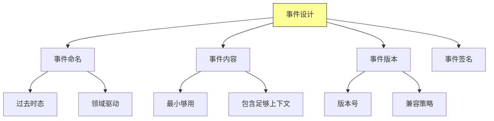

### 6.2 性能优化

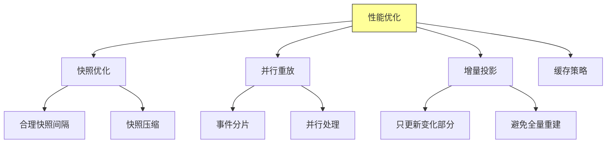

### 6.3 一致性保证

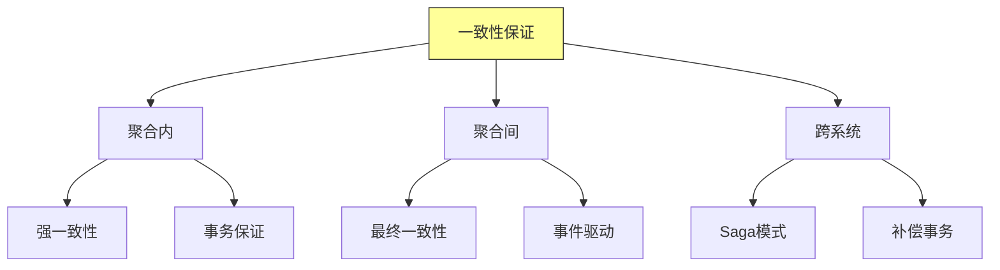

## 七、总结与启示

核心要点：
- 有状态服务需要仔细设计状态管理和持久化策略
- 事件溯源提供完整的状态变更历史，支持时间旅行
- 聚合根模式定义了一致性边界
- 快照机制优化状态恢复性能

---

*本章精读笔记完成*
