# 第八章：Batch Computational Patterns

## 一、批处理模式概述

### 1.1 批处理定义

批处理（Batch Processing）是处理大量数据的模式：

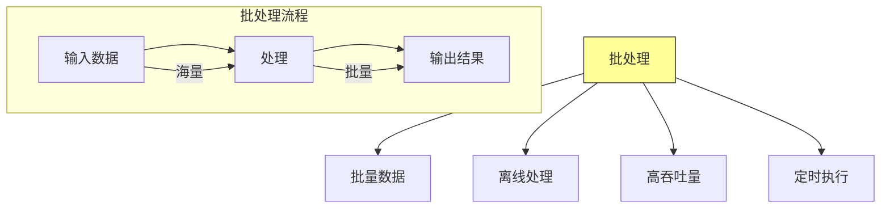

**核心特征**：
- **批量处理**：一次性处理大量数据
- **离线执行**：不要求实时响应
- **资源密集**：需要大量计算资源
- **容错性强**：需要处理故障和重试

### 1.2 批处理 vs 流处理

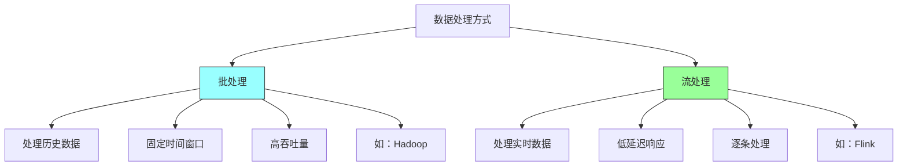

| 特性 | 批处理 | 流处理 |
|-----|-------|-------|
| **数据范围** | 历史数据 | 实时数据 |
| **延迟** | 高（分钟/小时） | 低（毫秒/秒） |
| **吞吐量** | 高 | 中 |
| **复杂度** | 中 | 高 |
| **适用场景** | 报表、分析 | 监控、告警 |

## 二、MapReduce模式

### 2.1 MapReduce架构

MapReduce是一种经典的分布式计算框架：

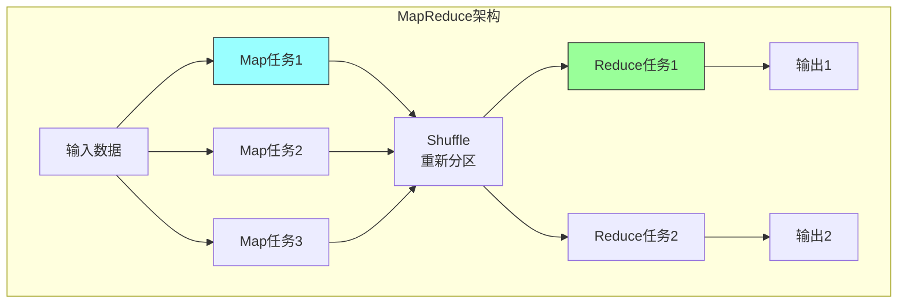

### 2.2 MapReduce流程

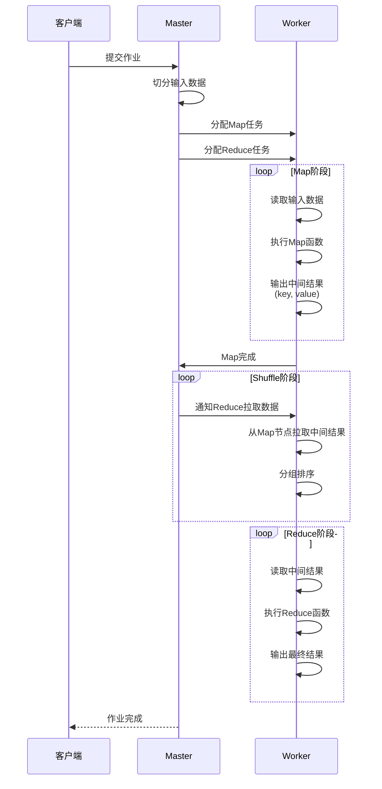

### 2.3 MapReduce示例

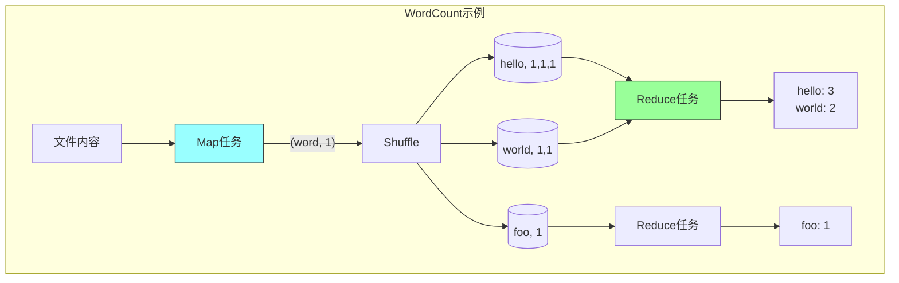

### 2.4 MapReduce变体

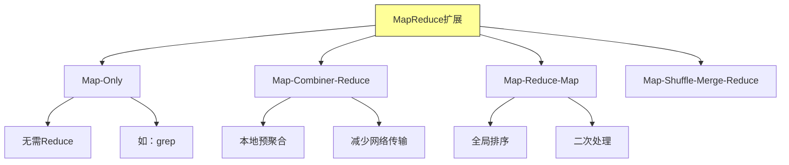

## 三、工作流模式

### 3.1 工作流定义

工作流（Workflow）定义任务的执行顺序和依赖：

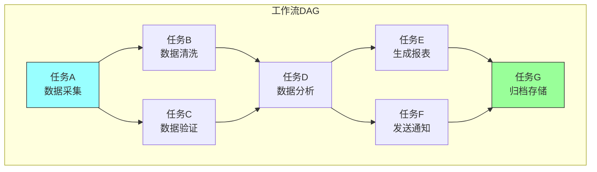

### 3.2 工作流调度

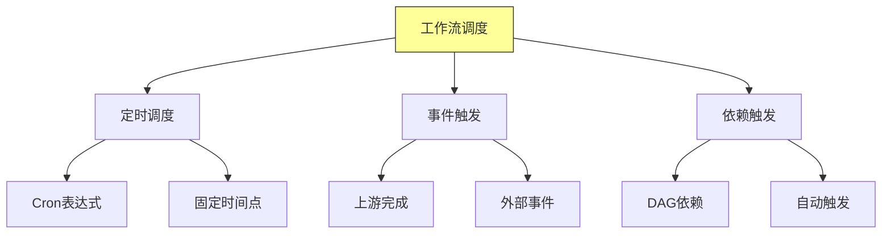

### 3.3 工作流执行策略

```mermaid
graph TD
    A[执行策略] --> B[顺序执行]
    A --> C[并行执行]
    A --> D[条件执行]
    A --> E[失败重试]

    B --> B1[任务按顺序执行]
    B --> B2[简单可靠]

    C --> C1[独立任务并行]
    C --> C2[提高效率]

    D --> D1[根据条件选择路径]
    D --> D2[动态路由]

    E --> E1[失败后重试]
    E --> E2[配置重试策略

    style A fill:#ff9,stroke:#333
```

## 四、数据管道模式

### 4.1 数据管道架构

数据管道（Data Pipeline）连接数据源和目标：

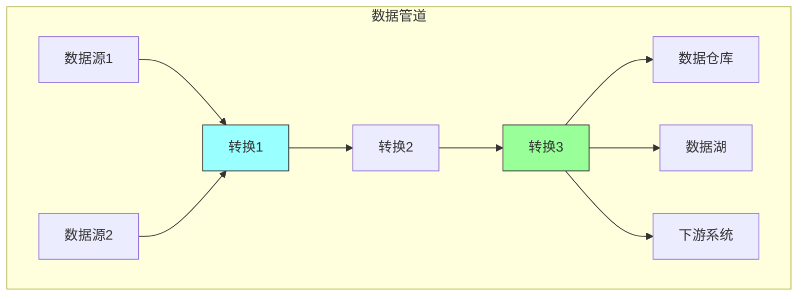

### 4.2 数据管道阶段

```mermaid
graph TD
    A[数据管道阶段] --> B[数据采集]
    A --> C[数据清洗]
    A --> D[数据转换]
    A --> E[数据加载]
    A --> F[数据验证]

    B --> B1[从源系统获取数据]
    B --> B2[CDC、API、文件]

    C --> C1[处理缺失值]
    C --> C2[格式标准化]

    D --> D1[业务逻辑转换]
    D --> D2[聚合计算]

    E --> E1[写入目标系统]
    E --> E2[批量/增量

    style A fill:#ff9,stroke:#333
```

### 4.3 增量处理

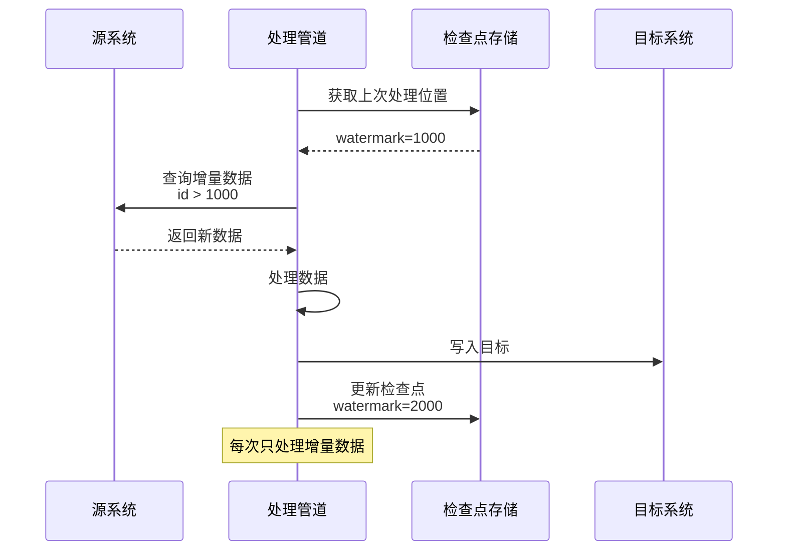

### 4.4 数据质量检查

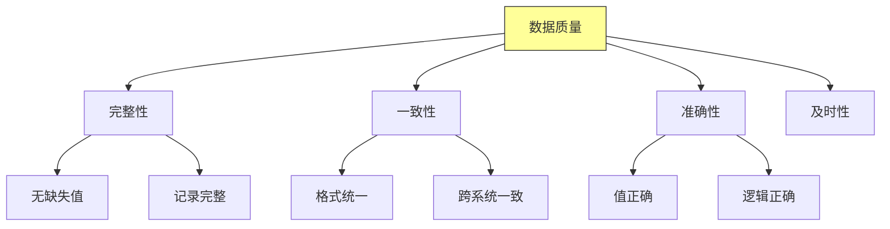

## 五、批处理框架

### 5.1 框架对比

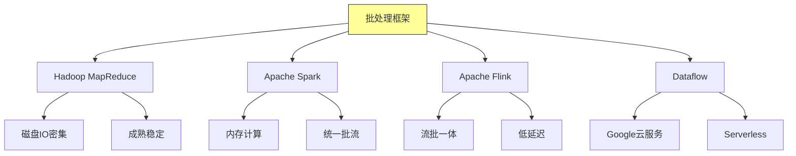

### 5.2 Spark架构

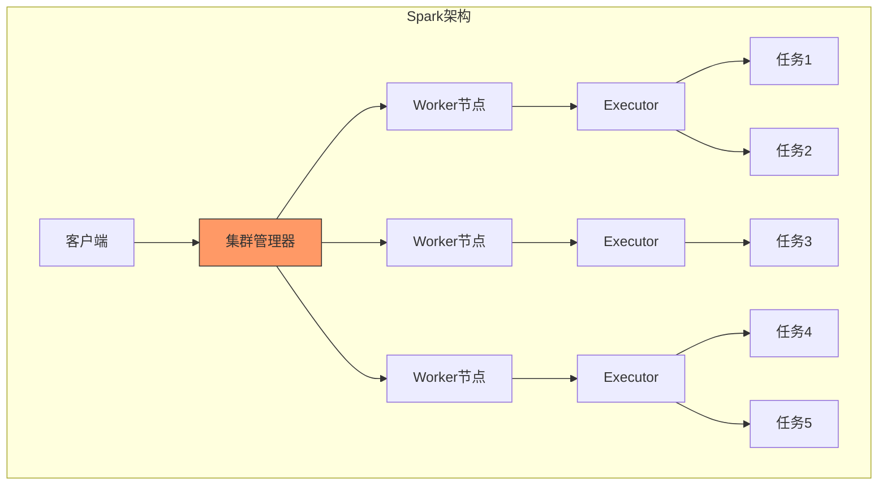

### 5.3 Spark核心概念

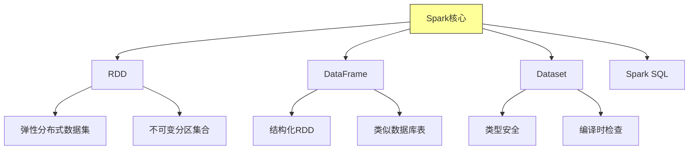

## 六、批处理最佳实践

### 6.1 性能优化

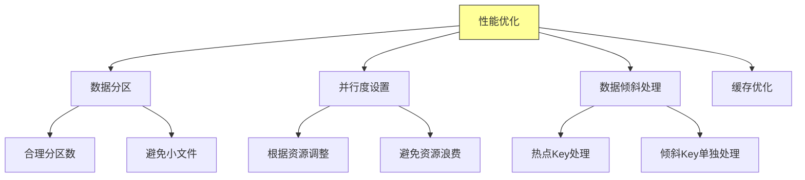

### 6.2 容错处理

```mermaid
graph TD
    A[容错机制] --> B[任务重试]
    A --> C[检查点]
    A --> D[数据备份]
    A --> E[失败告警]

    B --> B1[自动重试失败任务]
    B --> B2[最大重试次数]

    C --> C1[定期保存状态]
    C --> C2[从检查点恢复]

    D --> D1[数据多副本]
    D --> D2[防止数据丢失

    style A fill:#ff9,stroke:#333
```

### 6.3 调度优化

```mermaid
graph TD
    A[调度优化] --> B[资源分配]
    A --> C[任务排序]
    A --> D[依赖管理]
    A --> E[资源隔离]

    B --> B1[根据任务特性分配]
    B --> B2[动态调整]

    C --> C1[长任务优先]
    C --> C2[关键路径优先

    D --> D1[清晰依赖关系]
    D --> D2[避免循环依赖

    style A fill:#ff9,stroke:#333
```

## 七、总结与启示

核心要点：
- 批处理适合处理大量历史数据，追求高吞吐量
- MapReduce提供简洁的分布式计算模型
- 工作流模式定义任务的执行顺序和依赖
- 数据管道连接数据源和处理目标

---

*本章精读笔记完成*
