# 第九章：Work Queue Systems

## 一、工作队列概述

### 1.1 工作队列定义

工作队列（Work Queue）是一种异步任务处理模式：

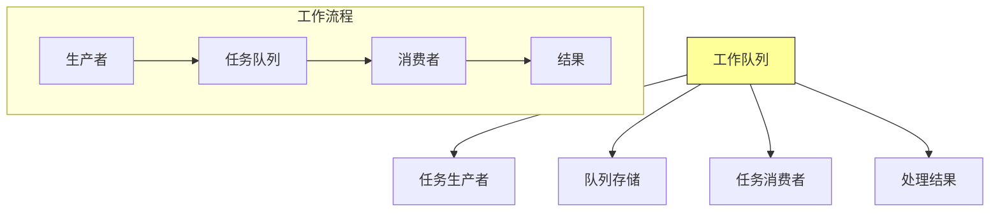

**核心特征**：
- **异步处理**：生产者不等待任务完成
- **解耦**：生产者和消费者独立运行
- **缓冲**：队列作为缓冲区平滑流量
- **负载均衡**：任务自动分配给消费者

### 1.2 工作队列优势

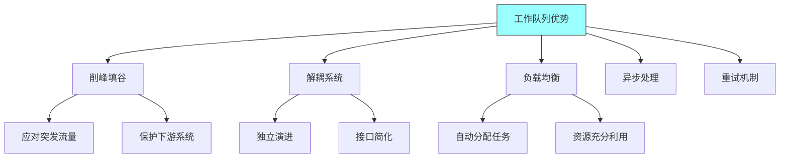

## 二、工作队列模式

### 2.1 基本工作队列

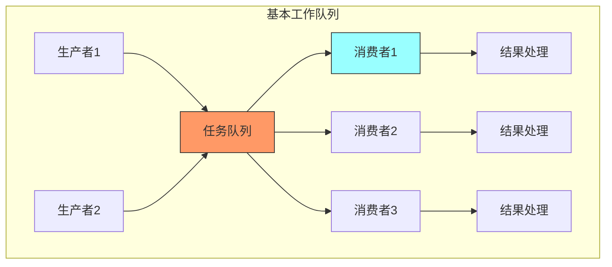

### 2.2 竞争消费者模式

竞争消费者（Competing Consumers）确保任务被快速处理：

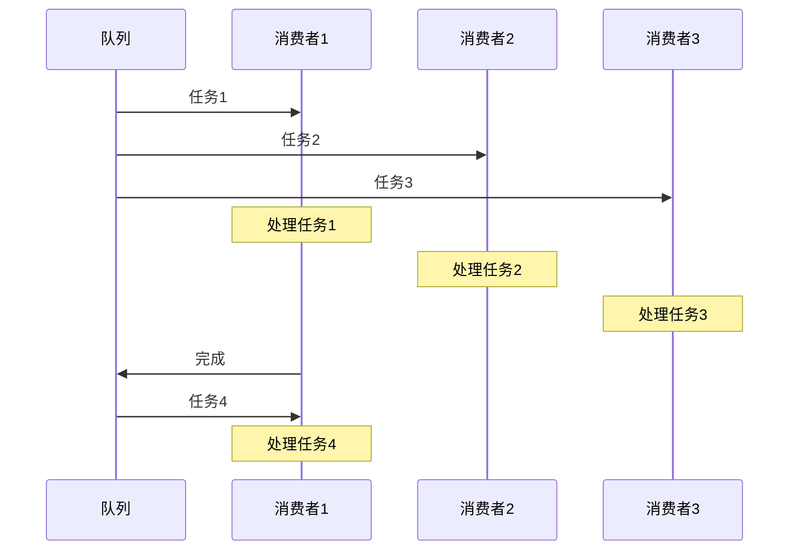

### 2.3 工作队列与请求响应对比

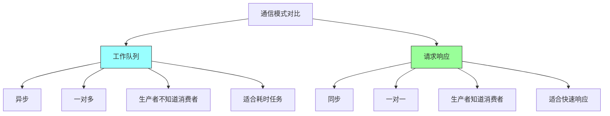

## 三、优先级队列

### 3.1 优先级队列概念

优先级队列（Priority Queue）按优先级处理任务：

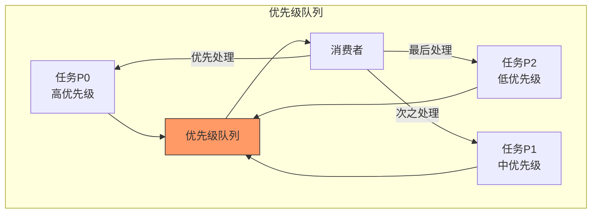

### 3.2 优先级实现方式

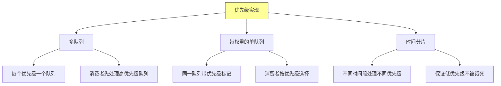

### 3.3 优先级反转问题

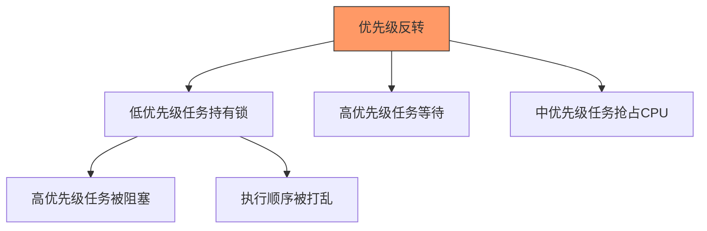

**解决方案**：
- 优先级继承
- 锁超时
- 无锁数据结构

## 四、死信队列

### 4.1 死信队列概念

死信队列（Dead Letter Queue）处理无法正常处理的消息：

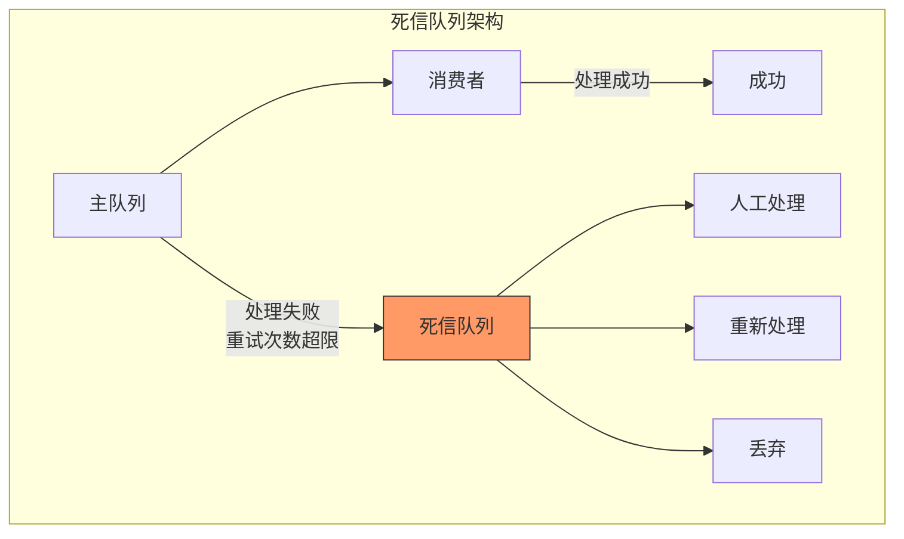

### 4.2 消息进入死信队列的条件

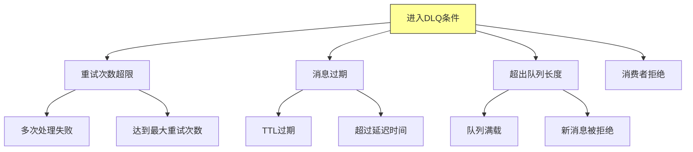

### 4.3 死信处理流程

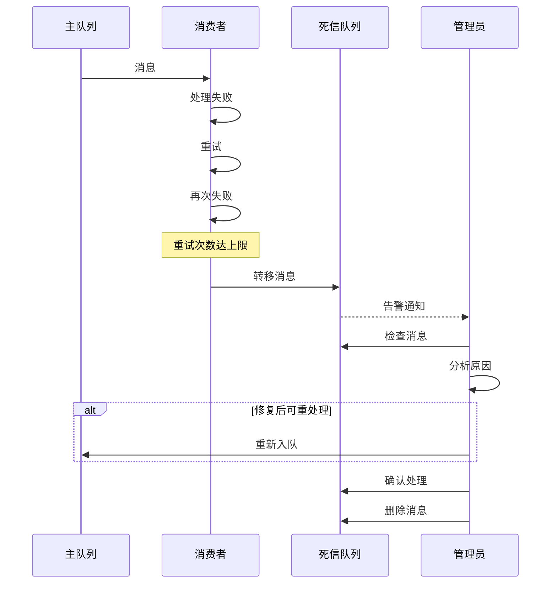

## 五、任务分发策略

### 5.1 分发策略类型

```mermaid
graph TD
    A[任务分发策略] --> B[轮询]
    A --> C[公平分发]
    A --> D[基于负载]
    A --> E[一致性哈希]

    B --> B1[按顺序分发]
    B --> B2[简单公平]

    C --> C1[考虑处理时间]
    C --> C2[避免忙闲不均]

    D --> D1[基于实时负载]
    D --> D2[动态调整

    E --> E1[相同任务路由相同消费者]
    E --> E2[利用本地缓存]

    style A fill:#ff9,stroke:#333
```

### 5.2 公平分发

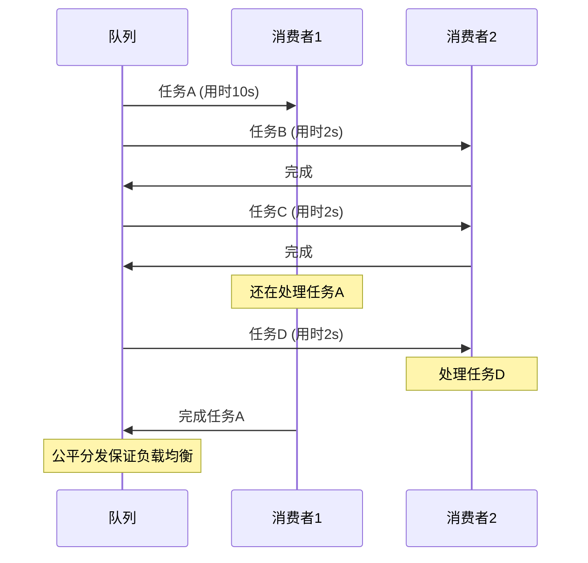

### 5.3 任务确认机制

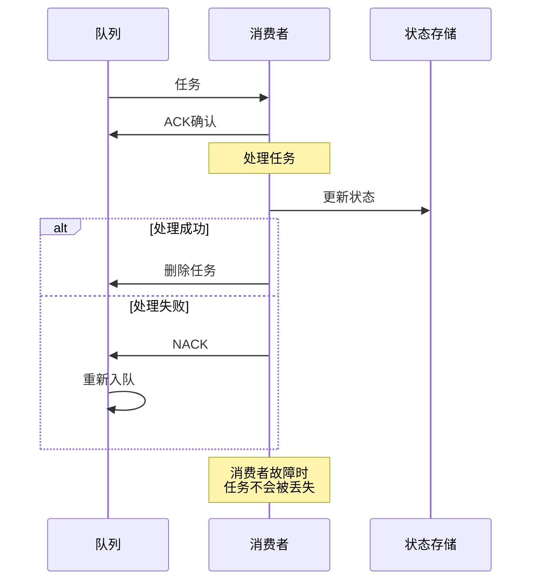

## 六、工作队列技术

### 6.1 技术选型

```mermaid
graph TD
    A[工作队列技术] --> B[RabbitMQ]
    A --> C[Redis Queue]
    A --> D[Kafka]
    A --> E[AWS SQS]

    B --> B1[功能丰富]
    B --> B2[AMQP协议]

    C --> C1[简单高效]
    C --> C2[适合中小规模]

    D --> D1[高吞吐]
    D --> D2[持久化

    E --> E1[完全托管]
    E --> E2[自动扩展]

    style A fill:#ff9,stroke:#333
```

### 6.2 消息可靠性保证

```mermaid
graph TD
    A[可靠性保证] --> B[持久化]
    A --> C[确认机制]
    A --> D[事务]
    A --> E[镜像]

    B --> B1[磁盘存储]
    B --> B2[重启不丢失]

    C --> C1[消费者确认]
    C --> C2[broker确认]

    D --> D1[消息事务]
    D --> D2[两阶段提交]

    E --> E1[队列镜像]
    E --> E2[高可用

    style A fill:#ff9,stroke:#333
```

## 七、总结与启示

核心要点：
- 工作队列实现生产者和消费者的异步解耦
- 优先级队列保证重要任务优先处理
- 死信队列处理异常消息，便于问题排查
- 任务确认机制保证消息不丢失

---

*本章精读笔记完成*
