# 第十章：Event-Driven Messaging

## 一、事件驱动消息概述

### 1.1 事件驱动消息定义

事件驱动消息（Event-Driven Messaging）是一种异步通信模式：

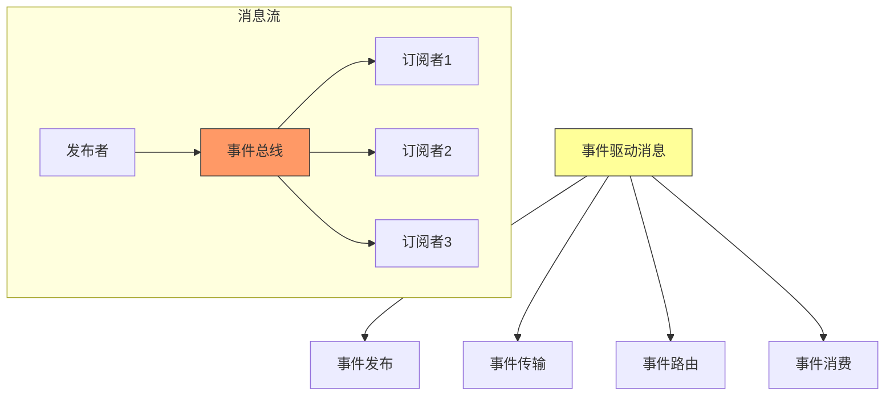

**核心特征**：
- **松耦合**：发布者和订阅者互不知晓
- **异步通信**：发送不等待处理完成
- **多播支持**：一个事件可被多个订阅者接收
- **事件驱动**：系统行为由事件触发

### 1.2 事件驱动 vs 传统消息

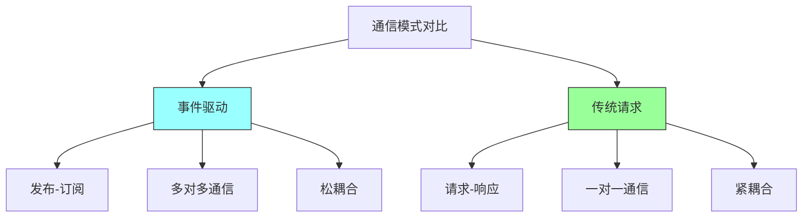

## 二、消息路由模式

### 2.1 路由模式分类

```mermaid
graph TD
    A[消息路由模式] --> B[点对点]
    A --> C[发布订阅]
    A --> D[主题路由]
    A --> E[内容路由]
    A --> F[头路由]

    B --> B1[一条消息一个消费者]
    B --> B2[队列模式]

    C --> C1[一条消息多个消费者]
    C --> C2[主题模式]

    D --> D1[基于主题匹配]
    D --> D2[如：user.*

    E --> E1[基于消息内容]
    E --> E2[路由到不同队列]

    style A fill:#ff9,stroke:#333
```

### 2.2 主题路由

```mermaid
graph TD
    subgraph 主题路由
    P[发布者] --> T[主题]

    T --> S1[订阅者1<br/>orders.*]
    T --> S2[订阅者2<br/>orders.created]
    T --> S3[订阅者3<br/>orders.*]

    Message1[orders.created] --> T
    T --> S1
    T --> S2
    T --> S3

    Message2[orders.shipped] --> T
    T --> S1
    T --> S3

    Note over S1: 接收所有orders事件
    Note over S2: 只接收created事件
    end

    style T fill:#f96,stroke:#333
```

### 2.3 内容路由

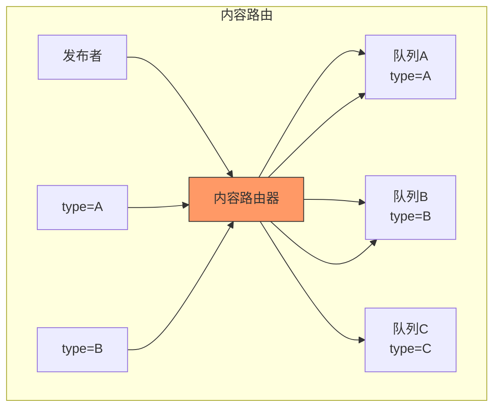

### 2.4 过滤器模式

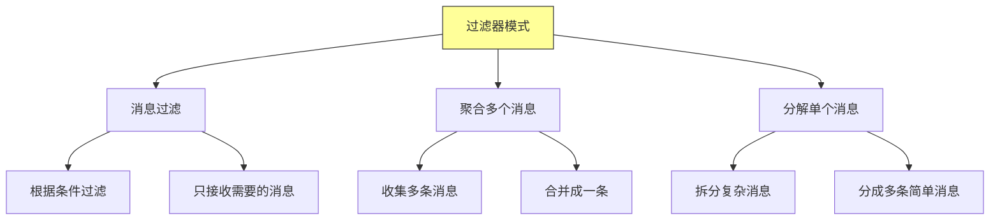

## 三、消息转换

### 3.1 消息转换类型

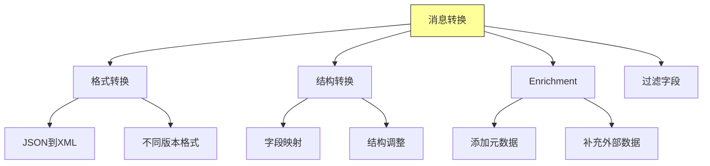

### 3.2 消息转换架构

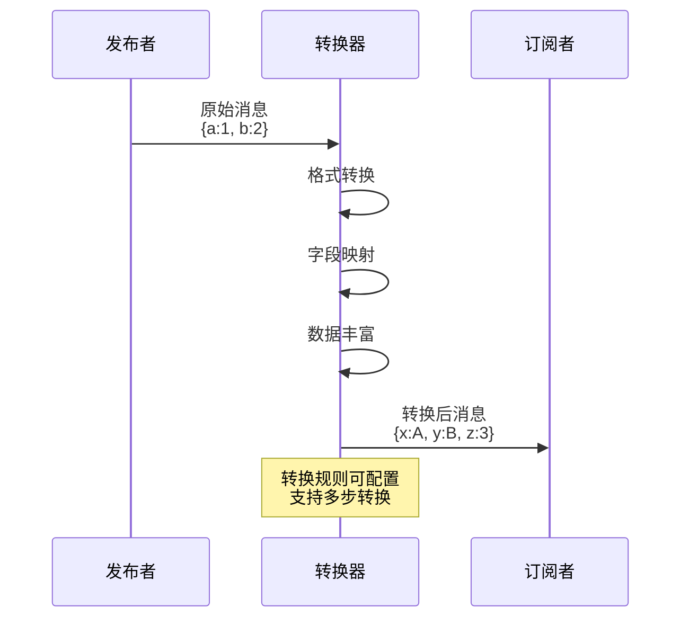

### 3.3 模式演进处理

```mermaid
graph TD
    A[模式演进] --> B[版本化消息]
    A --> C[适配器模式]
    A --> D[兼容策略]

    B --> B1[消息带版本号]
    B --> B2[支持多版本消费]

    C --> C1[适配器转换]
    C --> C2[旧格式转新格式]

    D --> D1[向后兼容]
    D --> D2[渐进式迁移

    style A fill:#ff9,stroke:#333
```

## 四、事件处理模式

### 4.1 简单事件处理

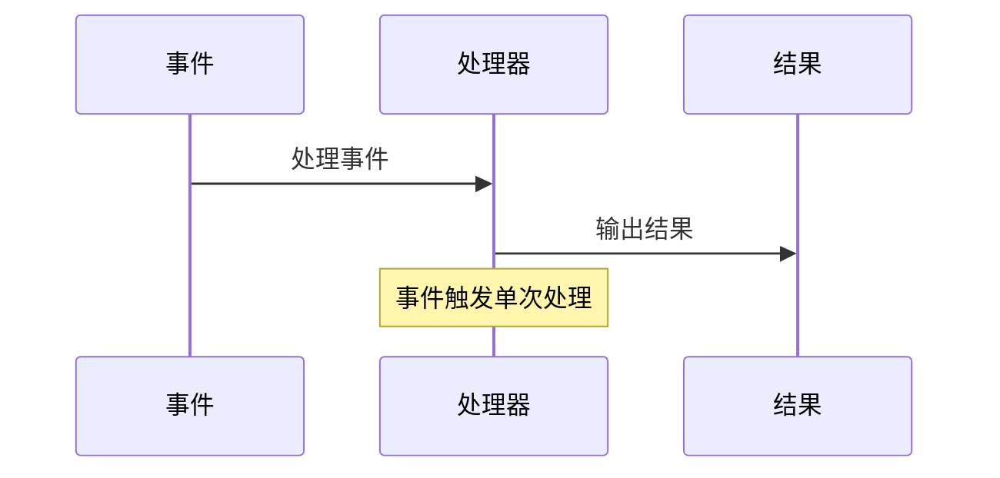

### 4.2 复杂事件处理

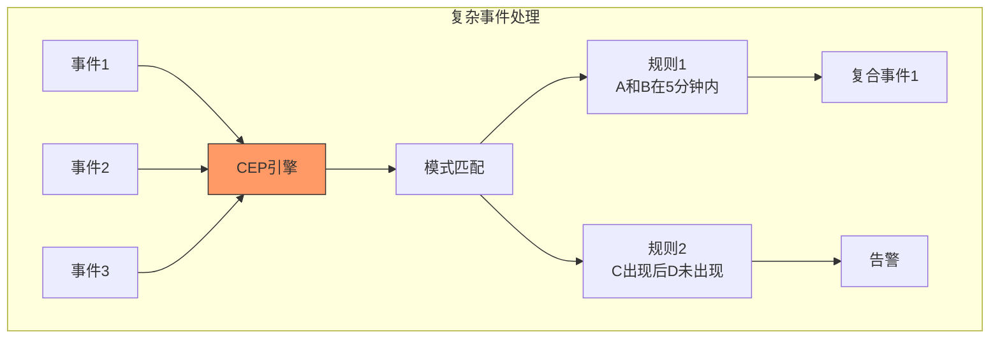

### 4.3 事件流处理

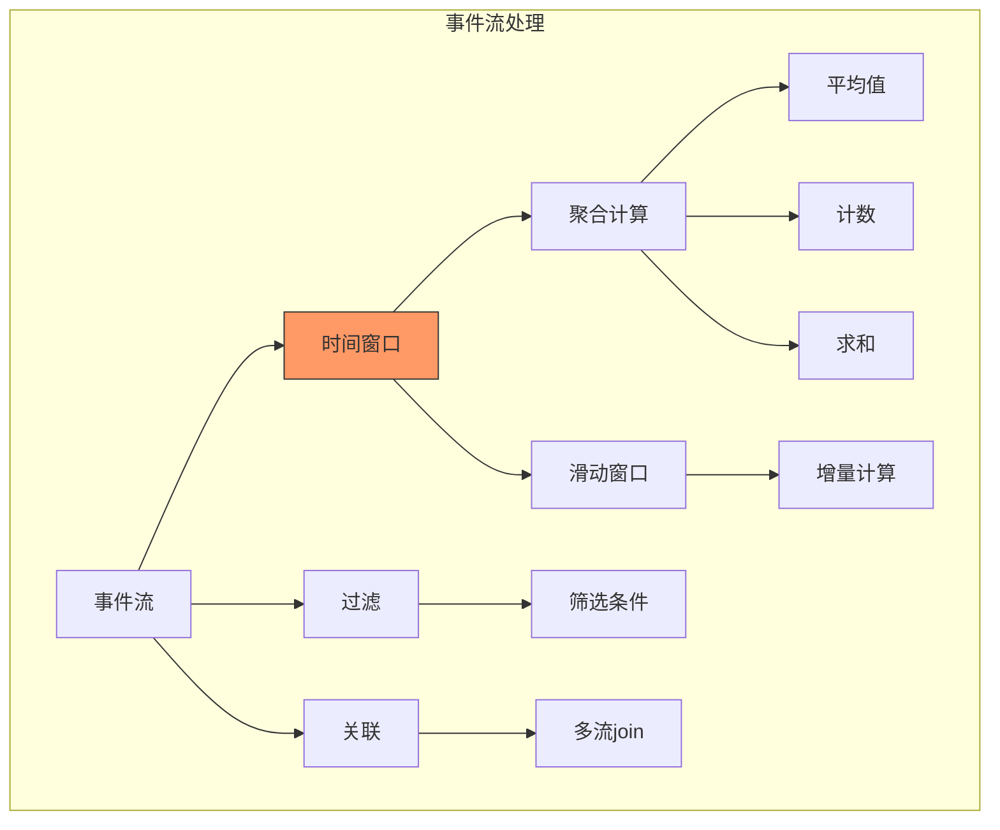

## 五、消息可靠性

### 5.1 消息传递保证

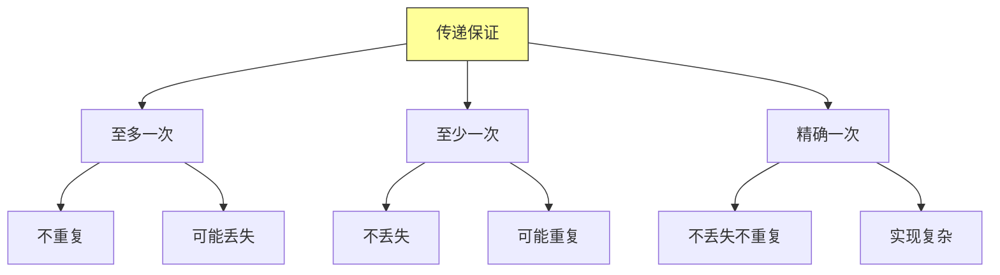

### 5.2 消息持久化

```mermaid
graph TD
    A[持久化策略] --> B[内存持久化]
    A --> C[磁盘持久化]
    A --> D[副本持久化]

    B --> B1[快速]
    B --> B2[易丢失]

    C --> C1[可靠]
    C --> C2[性能开销]

    D --> D1[高可靠]
    D --> D2[存储成本

    style A fill:#ff9,stroke:#333
```

### 5.3 消息确认机制

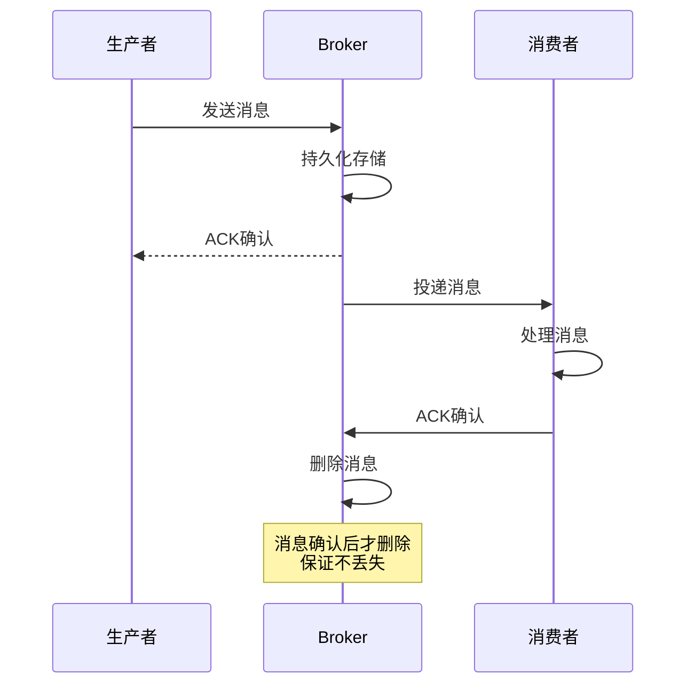

## 六、事件驱动架构实践

### 6.1 架构模式选择

```mermaid
graph TD
    A[选择事件架构] --> B[简单事件]
    A --> C[复杂事件处理]
    A --> D[事件溯源]

    B --> B1[单事件触发]
    B --> B2[如：通知系统]

    C --> C3[模式匹配]
    C --> C4[如：风控系统]

    D --> D1[完整历史]
    D --> D2[如：订单系统

    style A fill:#ff9,stroke:#333
```

### 6.2 事件设计原则

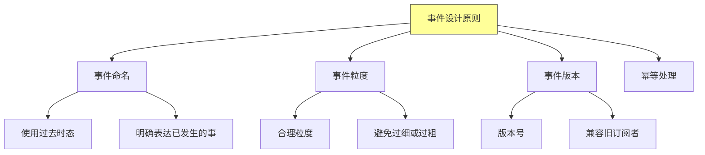

### 6.3 常见问题处理

```mermaid
graph TD
    A[常见问题] --> B[事件顺序]
    A --> C[事件丢失]
    A --> D[重复消费]
    A --> E[事务处理]

    B --> B1[分区保证顺序]
    B --> B2[全局顺序成本高]

    C --> C1[持久化保证]
    C --> C2[确认机制

    D --> D1[幂等设计]
    D --> D2[去重表

    style A fill:#f96,stroke:#333
```

## 七、总结与启示

核心要点：
- 事件驱动消息实现系统间的松耦合
- 多种路由模式满足不同场景需求
- 消息转换处理异构系统的集成
- 可靠性保证是事件驱动系统的关键

---

*本章精读笔记完成*
