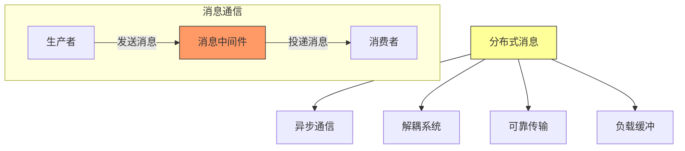
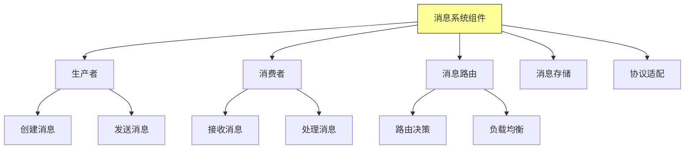
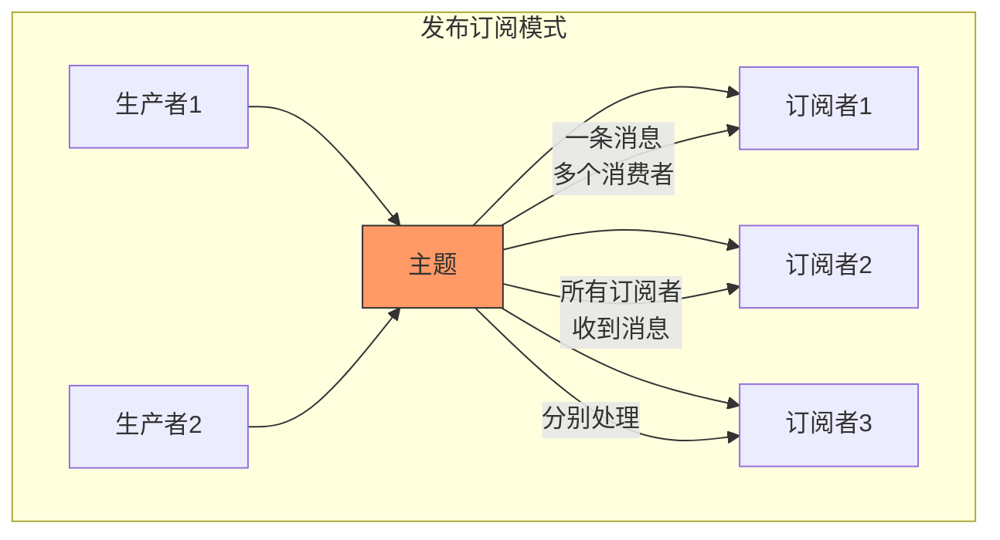
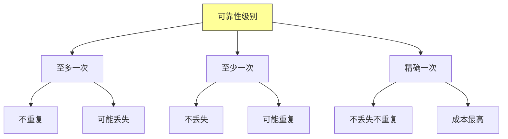
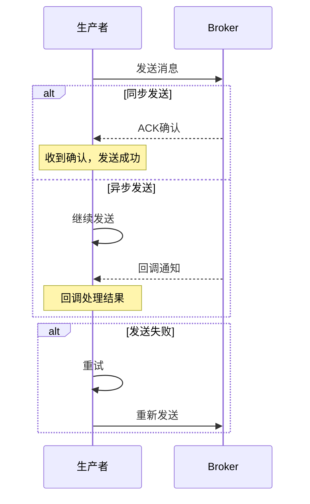
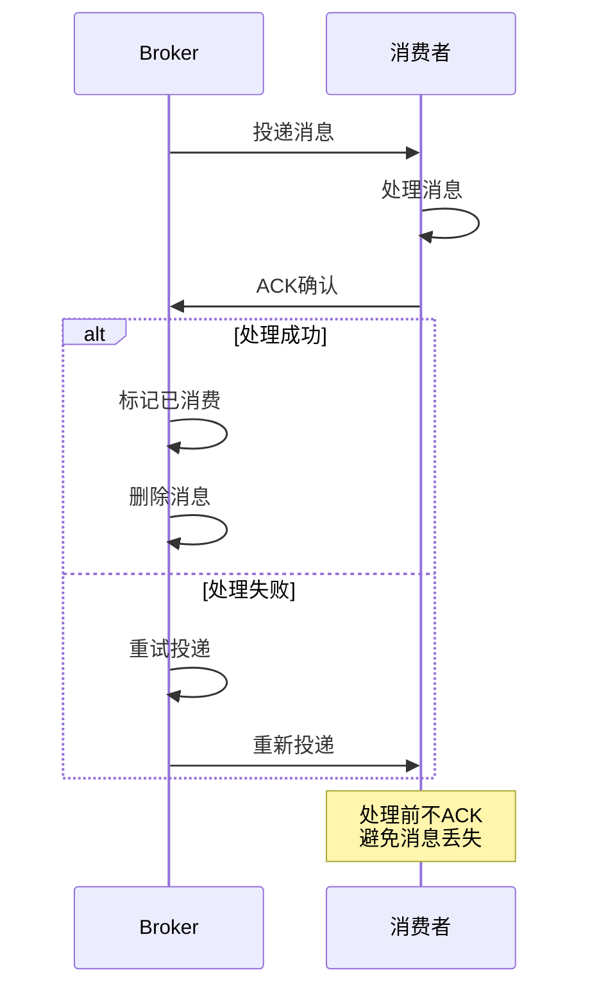
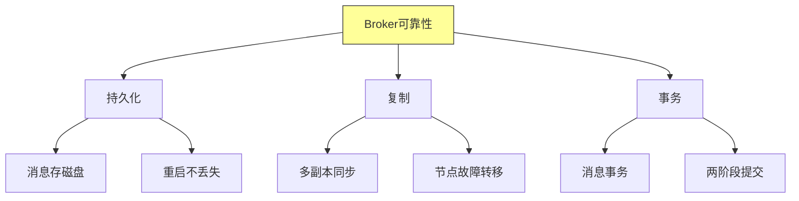
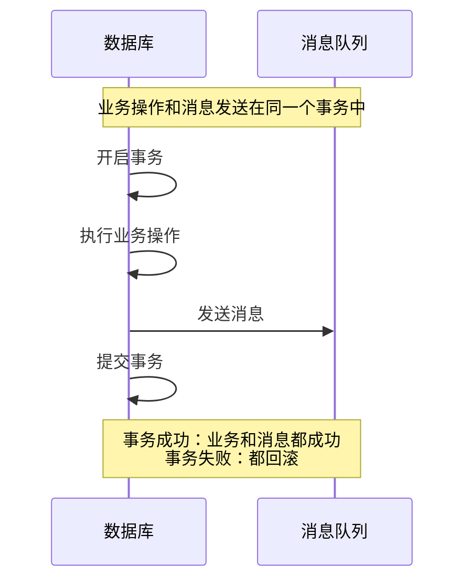
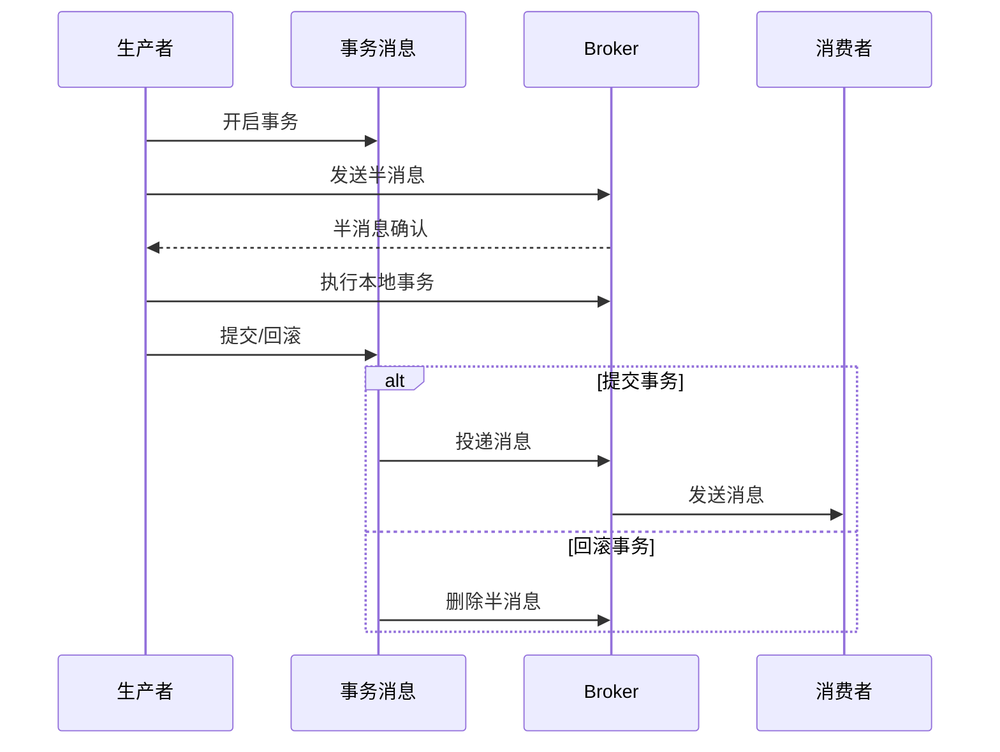
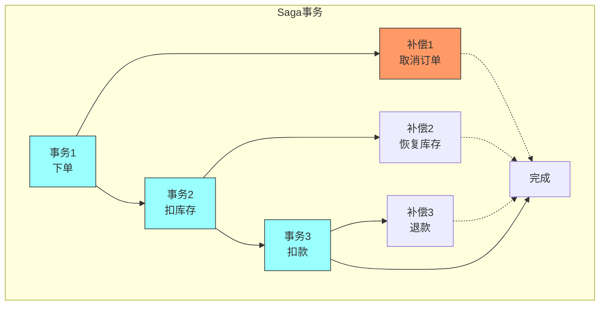

# 第十一章：Distributed Messaging Patterns

## 一、分布式消息概述

### 1.1 分布式消息定义

分布式消息（Distributed Messaging）是分布式系统的通信基础：



**核心价值**：
- **异步处理**：发送者不阻塞等待
- **系统解耦**：生产者和消费者独立演进
- **可靠性**：消息不丢失、可重试
- **削峰填谷**：应对流量波动

### 1.2 消息系统组件



## 二、消息传递模式

### 2.1 点对点模式

```mermaid
graph TD
    subgraph 点对点模式
    P[生产者] --> Q[队列]

    Q --> C1[消费者1]
    Q --> C2[消费者2]
    Q --> C3[消费者3]

    Q -->|竞争消费| C1
    Q -->|一条消息<br/>一个消费者| C2

    Note over Q,C1,C2,C3: 消息只能被一个消费者消费
    end

    style Q fill:#f96,stroke:#333
```

### 2.2 发布订阅模式



### 2.3 模式对比

| 特性 | 点对点 | 发布订阅 |
|-----|-------|---------|
| **消息分发** | 一对一 | 一对多 |
| **消费者** | 竞争消费 | 独立消费 |
| **消息状态** | 消费后删除 | 保留到所有订阅者 |
| **适用场景** | 任务分发 | 事件通知 |

## 三、消息可靠性

### 3.1 可靠性级别



### 3.2 生产者可靠性



### 3.3 消费者可靠性



### 3.4 Broker可靠性



## 四、消息顺序性

### 4.1 顺序保证级别

```mermaid
graph TD
    A[顺序保证] --> B[全局顺序]
    A --> C[分区顺序]
    A --> D[无顺序保证]

    B --> B1[所有消息有序]
    B --> B2[性能开销大]

    C --> C1[分区内有序]
    C --> C2[分区间无序]

    D --> D1[不保证顺序]
    D --> D2[性能最好

    style A fill:#ff9,stroke:#333
```

### 4.2 分区顺序保证

```mermaid
graph TD
    subgraph 分区顺序
    P[生产者] -->|key=A| P1[分区1]
    P -->|key=B| P2[分区2]

    P1 --> M1[消息1]
    P1 --> M2[消息2]
    P1 --> M3[消息3]

    P2 --> N1[消息4]
    P2 --> N2[消息5]

    Note over P1: M1 → M2 → M3 有序
    Note over P2: N1 → N2 有序
    Note over P1,P2: 分区间无序要求
    end

    style P1 fill:#9ff,stroke:#333
    style P2 fill:#9ff,stroke:#333
```

### 4.3 乱序处理策略

```mermaid
graph TD
    A[乱序处理] --> B[缓冲等待]
    A --> C[序列号检查]
    A --> D[窗口排序]

    B --> B1[等待缺失消息]
    B --> B2[超时处理]

    C --> C1[检查序列号]
    C --> C2[丢弃过期消息

    D --> D1[窗口内排序]
    D --> D2[输出有序流

    style A fill:#ff9,stroke:#333
```

## 五、消息事务

### 5.1 本地事务



### 5.2 事务消息



### 5.3 Saga模式



## 六、消息协议

### 6.1 协议对比

```mermaid
graph TD
    A[消息协议] --> B[AMQP]
    A --> C[MQTT]
    A --> D[STOMP]
    A --> E[HTTP/REST]

    B --> B1[企业级]
    B --> B2[功能丰富]

    C --> C1[物联网]
    C --> C2[轻量级]

    D --> D1[简单文本]
    D --> D2[WebSocket

    E --> E1[通用]
    E --> E2[易于调试]

    style A fill:#ff9,stroke:#333
```

### 6.2 协议选择指南

```mermaid
graph TD
    A[选择协议] --> B{场景?}
    B -->|企业集成| C[AMQP]
    B -->|物联网| D[MQTT]
    B -->|Web应用| E[STOMP/HTTP]
    B -->|云原生| F[gRPC]

    C --> C1[可靠消息]
    C --> C2[复杂路由]

    D --> D1[低带宽]
    D --> D2[不稳定网络]

    E --> E1[简单易用]
    E --> E2[广泛支持

    F --> F1[高性能RPC]
    F --> F2[强类型
```

## 七、消息最佳实践

### 7.1 消息设计

```mermaid
graph TD
    A[消息设计原则] --> B[消息格式]
    A --> C[消息大小]
    A --> D[消息ID]
    A --> E[时间戳]

    B --> B1[结构化数据]
    B --> B2[JSON/Protobuf]

    C --> C1[不宜过大]
    C --> C2[建议<1MB]

    D --> D1[唯一标识]
    D --> D2[支持追踪

    style A fill:#ff9,stroke:#333
```

### 7.2 性能优化

```mermaid
graph TD
    A[性能优化] --> B[批量处理]
    A --> C[压缩]
    A --> D[连接池]
    A --> E[异步发送]

    B --> B1[批量发送]
    B --> B2[减少网络开销]

    C --> C1[压缩消息]
    C --> C2[节省带宽]

    D --> D1[复用连接]
    D --> D2[减少建立开销

    style A fill:#ff9,stroke:#333
```

### 7.3 监控告警

```mermaid
graph TD
    A[监控指标] --> B[吞吐量]
    A --> C[延迟]
    A --> D[队列深度]
    A --> E[错误率]

    B --> B1[消息数/秒]
    B --> B2[字节数/秒]

    C --> C1[生产延迟]
    C --> C2[消费延迟]

    D --> D1[积压消息数]
    D --> D2[消费者追赶

    style A fill:#ff9,stroke:#333
```

## 八、总结与启示

核心要点：
- 消息传递实现系统间的异步解耦
- 可靠性保证需要生产者、Broker、消费者三方配合
- 消息顺序和事务是复杂场景的关键需求
- Saga模式是分布式事务的轻量级解决方案

---

*本章精读笔记完成*
