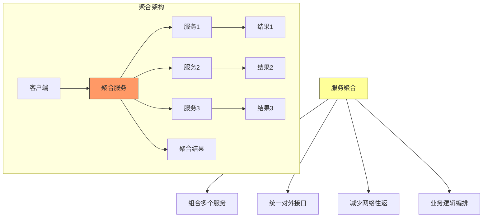
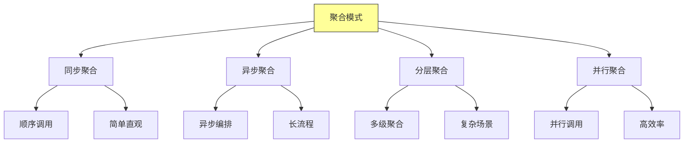
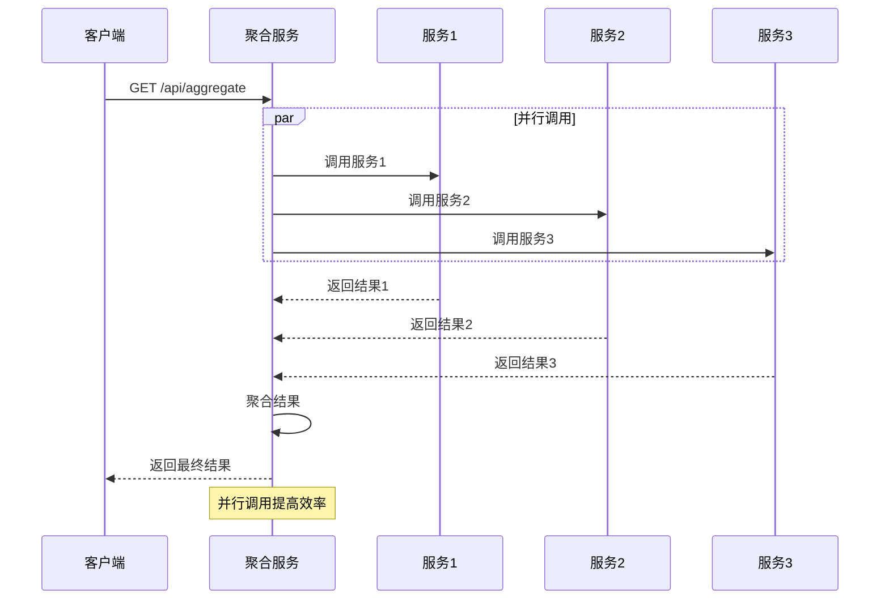
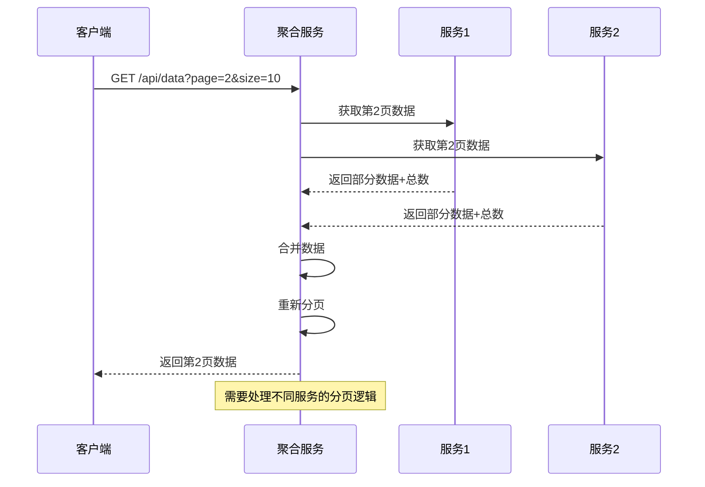
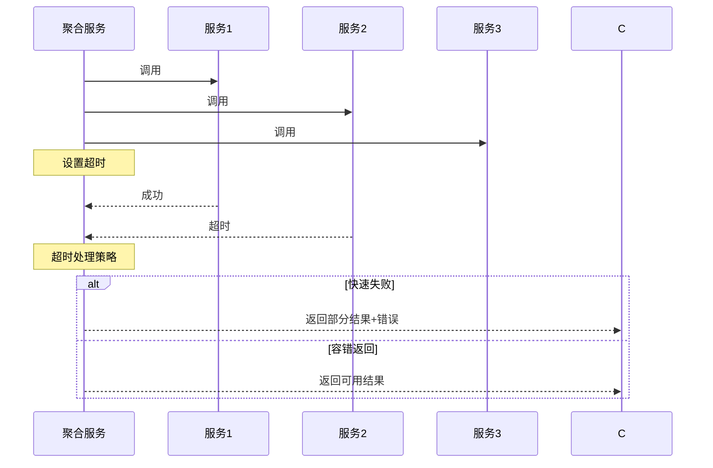
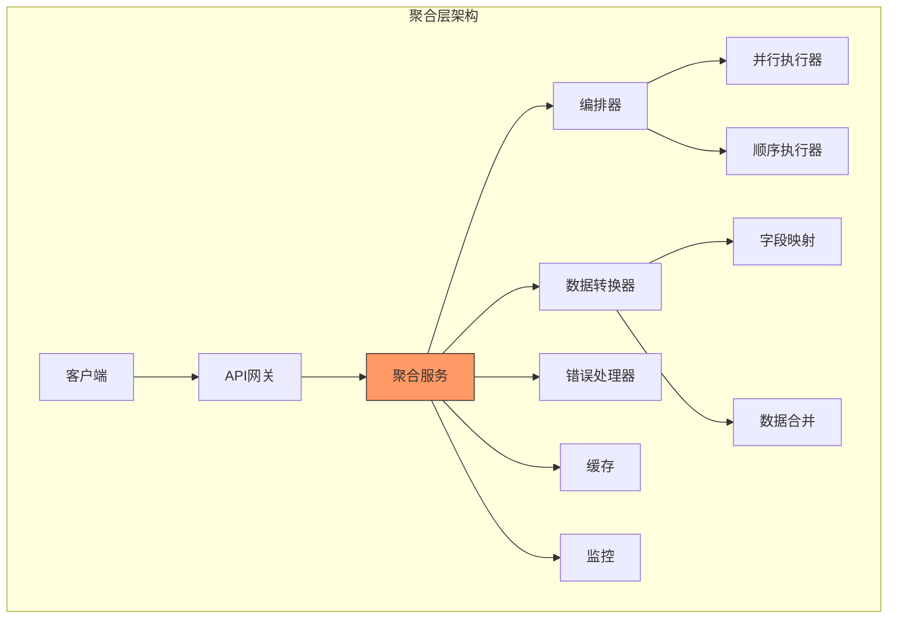
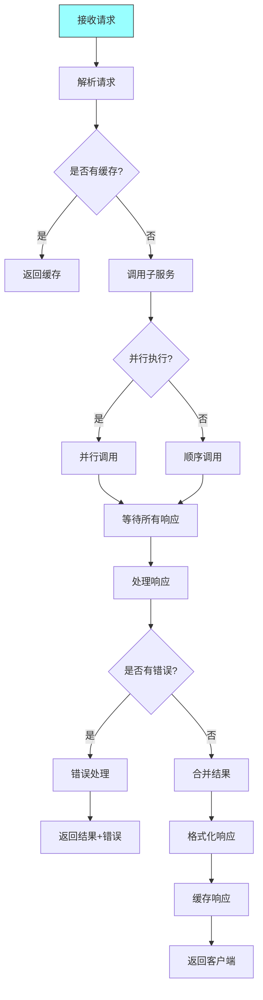
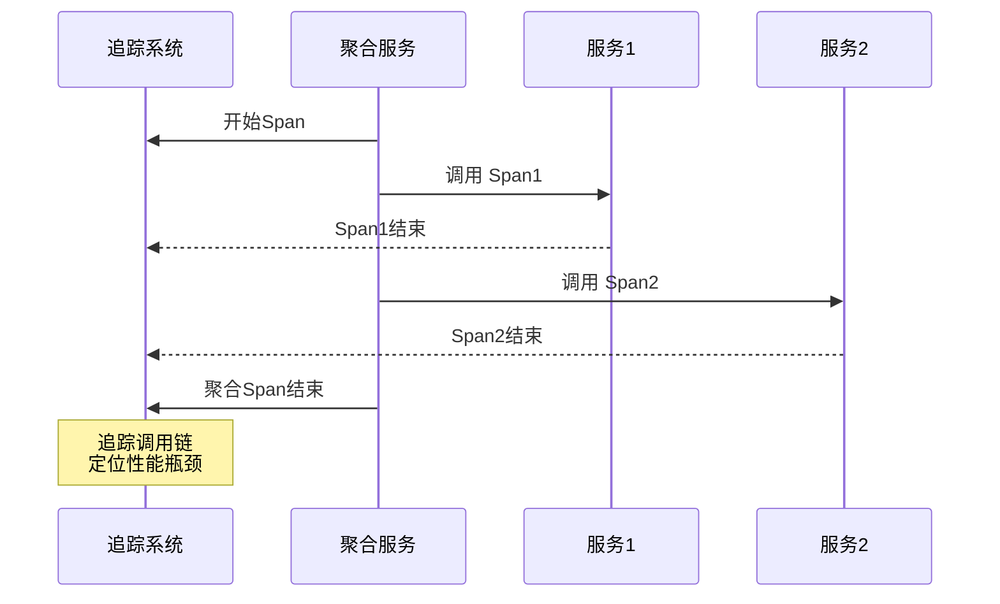

# 第十二章：Service Aggregation

## 一、服务聚合概述

### 1.1 服务聚合定义

服务聚合（Service Aggregation）将多个服务调用组合成单一操作：



**核心价值**：
- **减少调用次数**：多次调用合并为一次
- **简化客户端**：客户端只需调用聚合服务
- **统一接口**：对外提供一致的API
- **业务编排**：实现复杂业务流程

### 1.2 聚合模式分类



## 二、同步聚合模式

### 2.1 顺序聚合

```mermaid
sequenceDiagram
    participant C as 客户端
    participant A as 聚合服务
    participant S1 as 服务1
    participant S2 as 服务2
    participant S3 as 服务3

    C->>A: GET /api/aggregate
    A->>S1: 调用服务1
    S1-->>A: 返回结果1
    A->>S2: 调用服务2<br/>使用结果1
    S2-->>A: 返回结果2
    A->>S3: 调用服务3<br/>使用结果2
    S3-->>A: 返回结果3
    A-->>C: 返回聚合结果

    Note over A,S1,S2,S3: 顺序执行，依赖传递
```

### 2.2 并行聚合



### 2.3 聚合策略对比

| 策略 | 优点 | 缺点 | 适用场景 |
|-----|------|------|---------|
| **顺序** | 简单、依赖明确 | 延迟高 | 有数据依赖 |
| **并行** | 延迟低 | 复杂、资源消耗高 | 无依赖调用 |
| **混合** | 平衡优缺点 | 更复杂 | 复杂业务流程 |

## 三、数据聚合

### 3.1 数据聚合模式

```mermaid
graph TD
    subgraph 数据聚合
    A[聚合服务] --> B[查询多个数据源]
    A --> C[合并数据]
    A --> D[格式化输出]

    B --> S1[(数据库1)]
    B --> S2[(数据库2)]
    B --> S3[(缓存)]
    B --> S4[(搜索)]

    C --> Merge[数据合并]
    D --> Result[结果]

    Note over A: 从多个数据源获取数据<br/>合并成统一视图
    end

    style A fill:#ff9,stroke:#333
```

### 3.2 数据合并策略

```mermaid
graph TD
    A[数据合并策略] --> B[完全合并]
    A --> C[增量合并]
    A --> D[覆盖合并]
    A --> E[优先合并]

    B --> B1[所有数据合并]
    B --> B2[去重排序]

    C --> C1[只合并变更]
    C --> C2[减少数据量]

    D --> D1[后数据覆盖前]
    D --> D2[最新优先

    E --> E1[指定数据源优先]
    E --> E2[质量优先

    style A fill:#ff9,stroke:#333
```

### 3.3 分页聚合



## 四、响应聚合

### 4.1 响应合并

```mermaid
graph TD
    subgraph 响应合并
    Response1[响应1<br/>{data:[A,B]}] --> Merge[合并器]
    Response2[响应2<br/>{data:[C,D,E]}] --> Merge
    Response3[响应3<br/>{data:[F]}] --> Merge

    Merge --> Result[合并响应<br/>{data:[A,B,C,D,E,F], total:6}]
    end

    style Merge fill:#f96,stroke:#333
```

### 4.2 错误聚合

```mermaid
graph TD
    subgraph 错误处理
    A[聚合服务] --> S1[服务1]
    A --> S2[服务2]
    A --> S3[服务3]

    S1-->>A: 成功<br/>{result:A}
    S2-->>A: 失败<br/>{error:Timeout}
    S3-->>A: 失败<br/>{error:NotFound}

    A->>A: 聚合结果和错误
    A-->>C: {results:[A], errors:[Timeout,NotFound], partial:true}
    end

    style A fill:#9ff,stroke:#333
```

### 4.3 超时处理



## 五、聚合服务设计

### 5.1 聚合层架构



### 5.2 聚合流程



### 5.3 设计原则

```mermaid
graph TD
    A[聚合设计原则] --> B[最小化调用]
    A --> C[并行优先]
    A --> D[容错设计]
    A --> E[缓存策略]

    B --> B1[只调用必要的服务]
    B --> B2[避免冗余调用]

    C --> C1[无依赖的调用并行化]
    C --> C2[减少总延迟

    D --> D1[部分失败不影响整体]
    D --> D2[有意义的错误信息

    style A fill:#ff9,stroke:#333
```

## 六、性能优化

### 6.1 缓存策略

```mermaid
graph TD
    A[缓存策略] --> B[结果缓存]
    A --> C[依赖缓存]
    A --> D[预加载]

    B --> B1[聚合结果缓存]
    B --> B2[减少计算

    C --> C1[子服务结果缓存]
    C --> C2[减少子调用

    D --> D1[热点数据预加载]
    D --> D2[降低延迟

    style A fill:#ff9,stroke:#333
```

### 6.2 连接池管理

```mermaid
graph TD
    A[连接优化] --> B[连接池]
    A --> C[超时控制]
    A --> D[重试策略]

    B --> B1[复用连接]
    B --> B2[减少建立开销

    C --> C1[合理超时]
    C --> C2[快速失败

    D --> D1[指数退避]
    D --> D2[熔断保护

    style A fill:#ff9,stroke:#333
```

### 6.3 资源管理

```mermaid
graph TD
    A[资源管理] --> B[并发限制]
    A --> C[超时管理]
    A --> D[降级策略]

    B --> B1[限制并发调用数]
    B --> B2[防止过载

    C --> C1[设置调用超时]
    C --> C2[资源释放

    D --> D1[部分失败返回默认]
    D --> D2[保证可用性

    style A fill:#ff9,stroke:#333
```

## 七、监控与可观测性

### 7.1 监控指标

```mermaid
graph TD
    A[监控指标] --> B[性能指标]
    A --> C[错误指标]
    A --> D[依赖指标]

    B --> B1[延迟分布]
    B --> B2[吞吐量]

    C --> C1[错误率]
    C --> C2[失败原因

    D --> D1[子服务调用次数]
    D --> D2[子服务延迟

    style A fill:#ff9,stroke:#333
```

### 7.2 分布式追踪



## 八、总结与启示

核心要点：
- 服务聚合将多个服务调用组合成统一接口
- 并行调用可显著降低聚合延迟
- 容错设计保证部分失败不影响整体
- 缓存和监控是聚合服务的重要支撑

---

*本章精读笔记完成*
