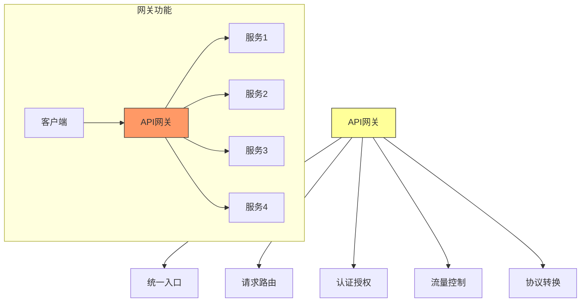
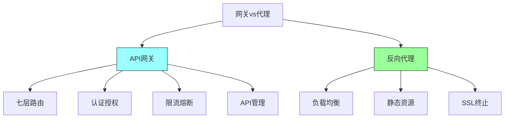
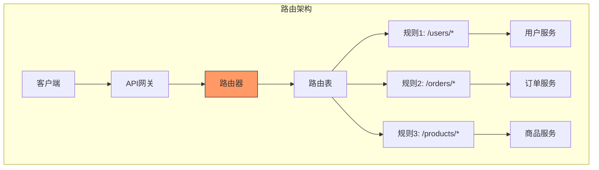
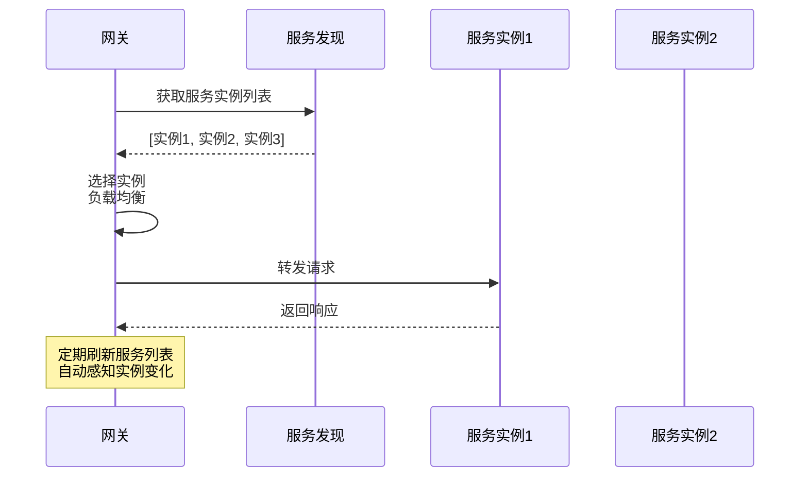
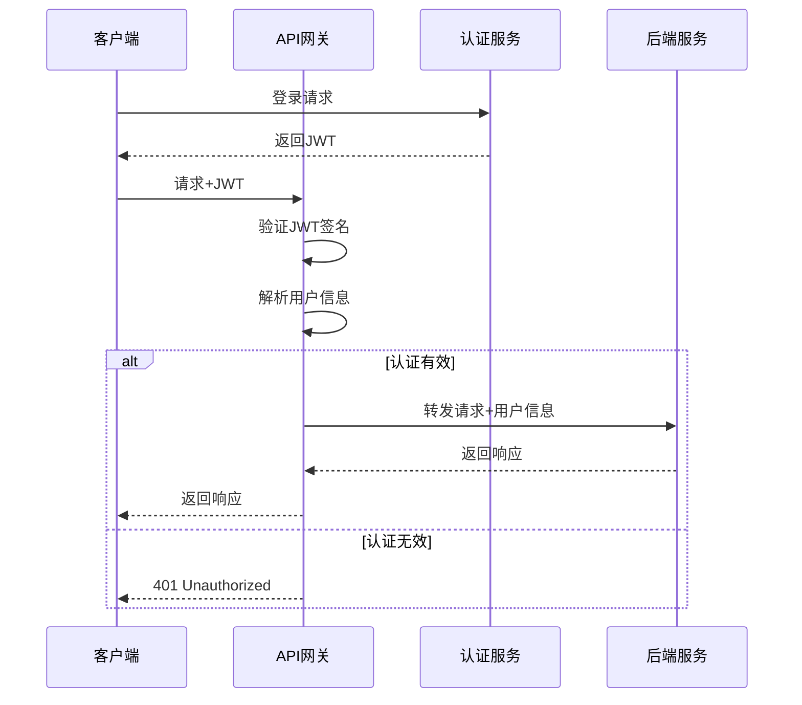
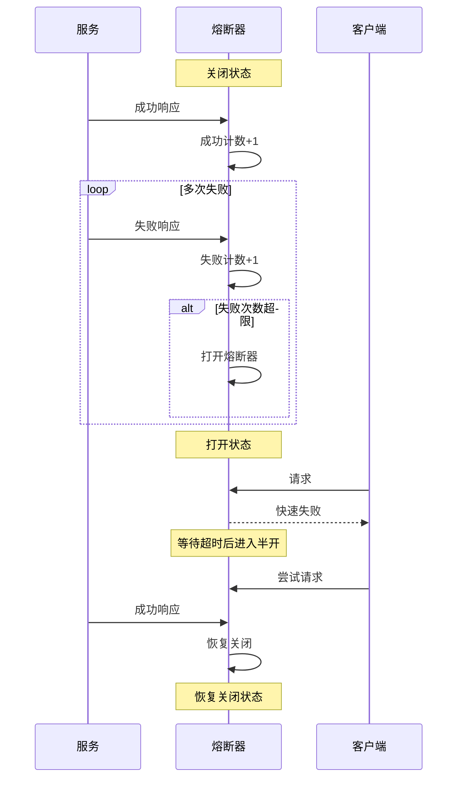
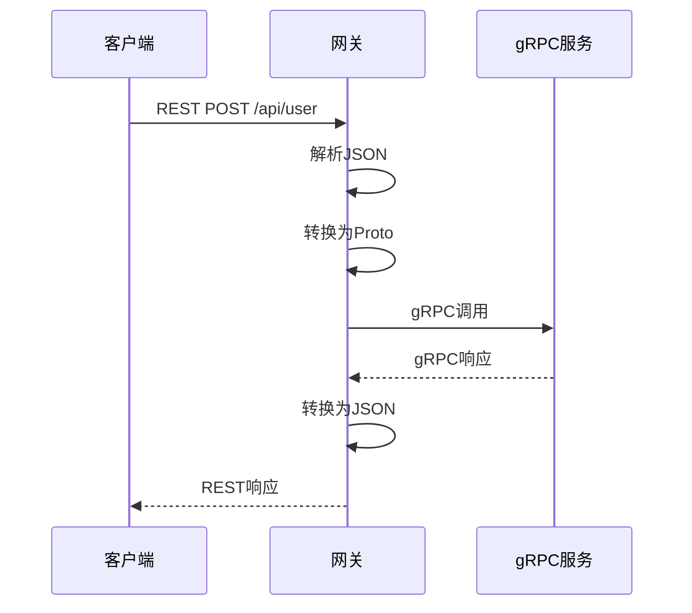
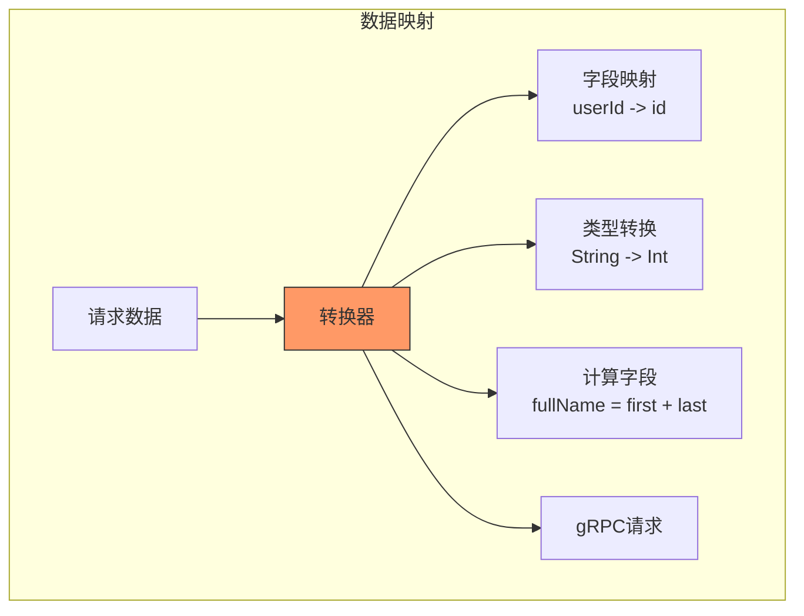

# 第十三章：API Gateway

## 一、API网关概述

### 1.1 API网关定义

API网关（API Gateway）是系统的统一入口：



**核心职责**：
- **统一入口**：所有请求的单一入口点
- **请求路由**：将请求转发到后端服务
- **认证授权**：验证请求身份和权限
- **限流熔断**：保护后端服务
- **协议转换**：支持多种协议

### 1.2 网关 vs 反向代理



| 特性 | API网关 | 反向代理 |
|-----|-------|---------|
| **功能** | 丰富的业务功能 | 基本转发功能 |
| **复杂度** | 高 | 低 |
| **适用** | 微服务架构 | 传统架构 |
| **扩展性** | 支持插件扩展 | 有限 |

## 二、请求路由

### 2.1 路由策略

```mermaid
graph TD
    A[路由策略] --> B[路径路由]
    A --> C[头路由]
    A --> D[参数路由]
    A --> E[权重路由]

    B --> B1[/api/users -> 用户服务]
    B --> B2[/api/orders -> 订单服务]

    C --> C1[根据Header路由]
    C --> C2[多版本支持]

    D --> D1[根据参数路由]
    D --> D2[A/B测试

    E --> E1[灰度发布]
    E --> E2[流量分配

    style A fill:#ff9,stroke:#333
```

### 2.2 路由架构



### 2.3 服务发现集成



## 三、认证授权

### 3.1 认证模式

```mermaid
graph TD
    A[认证模式] --> B[API Key]
    A --> C[JWT]
    A --> D[OAuth 2.0]
    A --> E[Mutual TLS]

    B --> B1[简单密钥]
    B --> B2[易于实现]

    C --> C1[令牌认证]
    C --> C2[自包含信息]

    D --> D1[授权框架]
    D --> D2[第三方登录

    E --> E1[双向认证]
    E --> E2[最高安全

    style A fill:#ff9,stroke:#333
```

### 3.2 JWT认证流程



### 3.3 授权模型

```mermaid
graph TD
    A[授权模型] --> B[RBAC]
    A --> C[ABAC]
    A --> D[OAuth Scope]

    B --> B1[基于角色]
    B --> B2[角色->权限]

    C --> C1[基于属性]
    C --> C2[动态策略]

    D --> D1[细粒度控制]
    D --> D2[API级别

    style A fill:#ff9,stroke:#333
```

## 四、限流与熔断

### 4.1 限流策略

```mermaid
graph TD
    A[限流策略] --> B[固定窗口]
    A --> C[滑动窗口]
    A --> D[令牌桶]
    A --> E[漏桶]

    B --> B1[简单计数]
    B --> B2[边界突刺

    C --> C1[平滑计数]
    C --> C2[无突刺

    D --> D1[允许突发]
    D --> D2[流量整形

    E --> E1[平滑输出]
    E --> E2[流量整形

    style A fill:#ff9,stroke:#333
```

### 4.2 限流实现

```mermaid
graph TD
    subgraph 限流架构
    Client[客户端] --> GW[API网关]

    GW --> RateLimiter[限流器]
    RateLimiter --> Counter[计数器]

    Counter --> Bucket[令牌桶]
    Bucket --> Allow{是否允许?}

    Allow -->|是| Forward[转发请求]
    Allow -->|否| Reject[返回429]

    Note over RateLimiter: 超过限制返回<br/>429 Too Many Requests
    end

    style RateLimiter fill:#f96,stroke:#333
```

### 4.3 熔断器模式

```mermaid
graph TD
    A[熔断器状态] --> B[关闭状态]
    A --> C[打开状态]
    A --> D[半开状态]

    B --> B1[正常转发]
    B --> B2[计数失败

    C --> C1[拒绝所有请求]
    C --> C2[快速失败

    D --> D1[尝试放行请求]
    D --> D2[恢复或回退

    style A fill:#ff9,stroke:#333
    style B fill:#9f9,stroke:#333
    style C fill:#f96,stroke:#333
```

### 4.4 熔断器状态转换



## 五、协议转换

### 5.1 协议转换类型

```mermaid
graph TD
    A[协议转换] --> B[HTTP到gRPC]
    A --> C[REST到GraphQL]
    A --> D[同步到异步]
    A --> E[格式转换]

    B --> B1[HTTP -> Protocol Buffer]
    B --> B2[高性能RPC]

    C --> C1[聚合多个API]
    C --> C2[按需获取

    D --> D1[HTTP -> 消息队列]
    D --> D2[异步处理

    E --> E1[JSON <-> XML]
    E --> E2[数据映射

    style A fill:#ff9,stroke:#333
```

### 5.2 REST到gRPC转换



### 5.3 数据映射



## 六、API网关技术

### 6.1 技术选型

```mermaid
graph TD
    A[网关技术] --> B[Kong]
    A --> C[Nginx Plus]
    A --> D[Envoy]
    A --> E[Zuul 2]
    A --> F[AWS API Gateway]

    B --> B1[基于Nginx]
    B --> B2[插件丰富]

    C --> C1[商业版]
    C --> C2[功能完善]

    D --> D1[云原生]
    D --> D2[高性能

    E --> E1[Netflix]
    E --> E2[Java

    style A fill:#ff9,stroke:#333
```

### 6.2 网关部署

```mermaid
graph TD
    subgraph 网关部署
    Client[客户端] --> LB[负载均衡器]

    LB --> GW1[网关实例1]
    LB --> GW2[网关实例2]
    LB --> GW3[网关实例3]

    GW1 --> S1[后端服务]
    GW2 --> S1
    GW3 --> S1

    Note over GW1,GW2,GW3: 多实例部署<br/>高可用
    end

    style LB fill:#9ff,stroke:#333
    style GW1 fill:#f96,stroke:#333
```

## 七、总结与启示

核心要点：
- API网关是微服务架构的统一入口
- 认证授权在网关层集中处理
- 限流熔断保护后端服务
- 协议转换支持异构系统集成

---

*本章精读笔记完成*
