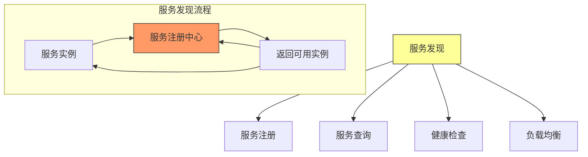
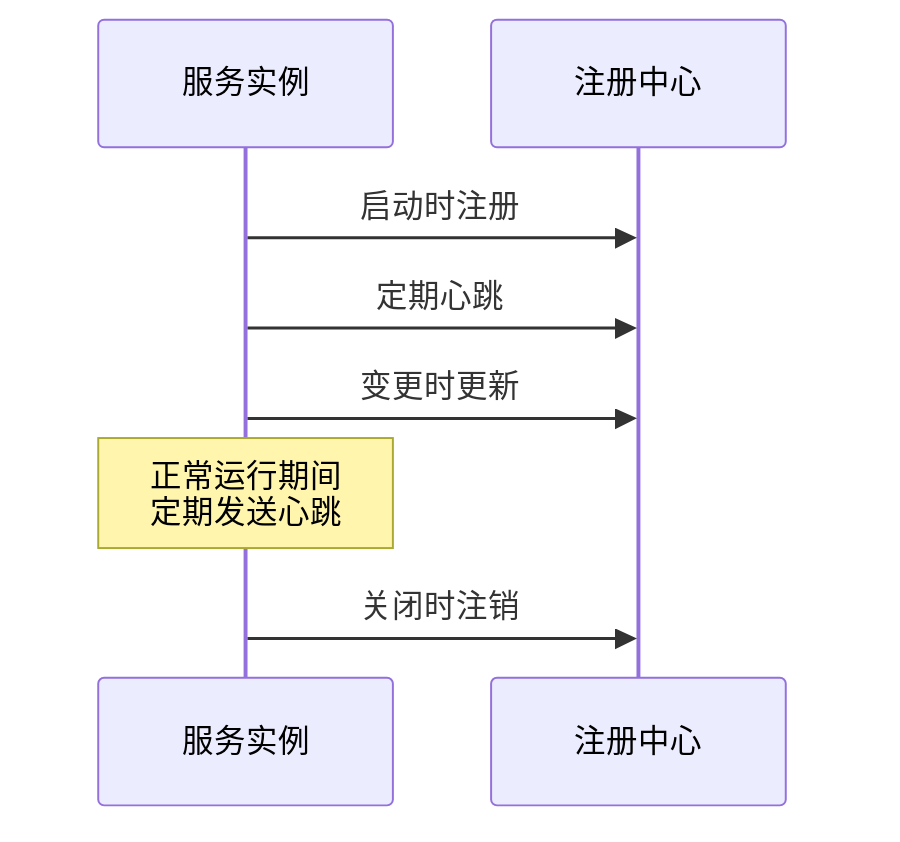
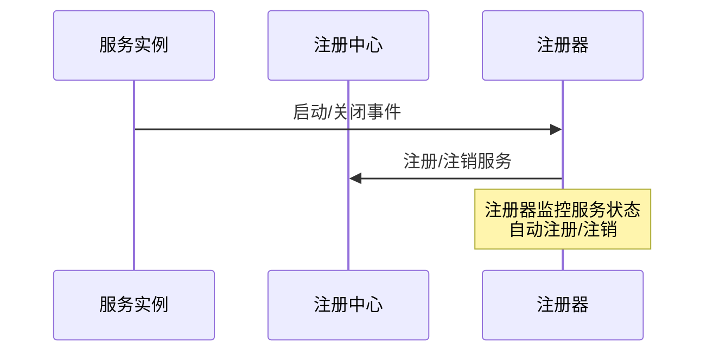
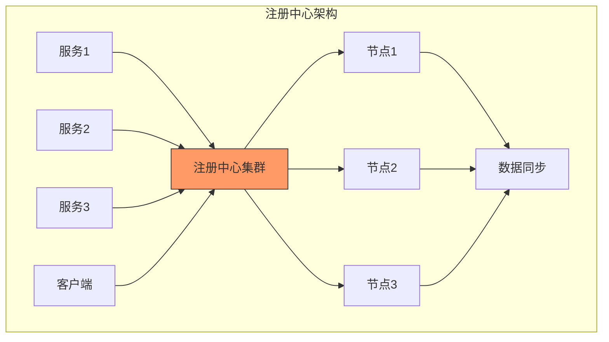
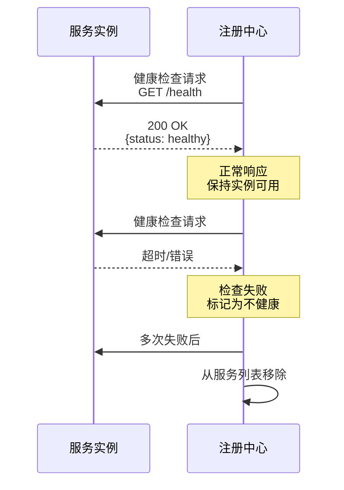
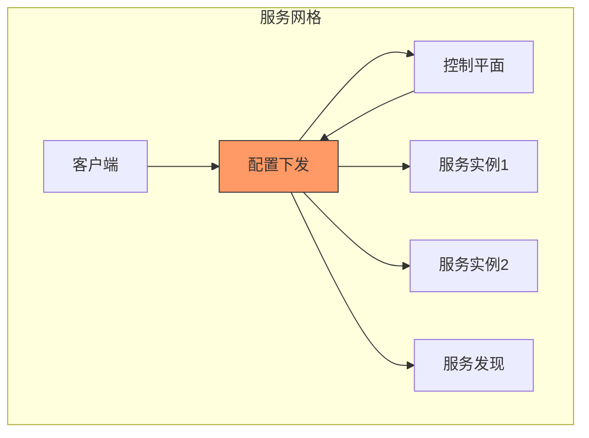

# 第十四章：Service Discovery

## 一、服务发现概述

### 1.1 服务发现问题

在分布式系统中，服务实例动态变化：

```mermaid
graph TD
    A[服务发现问题] --> B[实例动态变化]
    A --> C[位置不固定]
    A --> D[扩缩容频繁]

    subgraph 动态环境
    S1[服务实例1: 10.0.0.1:8080]
    S2[服务实例2: 10.0.0.2:8080]
    S3[服务实例3: 10.0.0.3:8080]

    Note over S1,S2,S3: 实例随时可能增加或减少
    end

    style A fill:#ff9,stroke:#333
```

**核心挑战**：
- 服务实例动态增减
- 实例IP和端口变化
- 需要实时感知服务状态

### 1.2 服务发现定义

服务发现（Service Discovery）自动定位服务实例：



## 二、服务注册模式

### 2.1 注册模式分类

```mermaid
graph TD
    A[注册模式] --> B[自注册模式]
    A --> C[第三方注册]
    A --> D[注册中心拉取]

    B --> B1[服务自己注册]
    B --> B2[简单直接]

    C --> C1[注册器代为注册]
    C --> C2[服务无需感知

    D --> D1[注册中心主动拉取]
    D --> D2[减轻服务负担

    style A fill:#ff9,stroke:#333
```

### 2.2 自注册模式



### 2.3 第三方注册模式



### 2.4 注册信息结构

```mermaid
graph TD
    A[注册信息] --> B[服务名称]
    A --> C[实例ID]
    A --> D[IP地址和端口]
    A --> E[健康检查URL]
    A --> F[元数据]

    B --> B1[唯一标识服务]
    B --> B2[如: user-service]

    C --> C1[区分同服务的不同实例]
    C --> C2[如: instance-001]

    D --> D1[网络位置]
    D --> D2[用于路由

    style A fill:#ff9,stroke:#333
```

## 三、服务注册中心

### 3.1 注册中心架构



### 3.2 常见注册中心

```mermaid
graph TD
    A[注册中心] --> B[Eureka]
    A --> C[Consul]
    A --> D[etcd]
    A --> E[ZooKeeper]
    A --> F[Nacos]

    B --> B1[Netflix开源]
    B --> B2[AP模型]

    C --> C1[HashiCorp]
    C --> C2[支持KV存储]

    D --> D1[CoreOS]
    D --> D2[CP模型

    E --> E1[Apache]
    E --> E2[强一致性

    F --> F1[阿里开源]
    F --> F2[国内流行

    style A fill:#ff9,stroke:#333
```

### 3.3 CAP选择

```mermaid
graph TD
    A[注册中心CAP] --> B[CP系统]
    A --> C[AP系统]

    B --> B1[ZooKeeper]
    B --> B2[强一致性
    B --> B3[网络分区不可用

    C --> C1[Eureka]
    C --> C2[高可用
    C --> C3[可能返回旧数据

    style A fill:#ff9,stroke:#333
    style B fill:#9ff,stroke:#333
    style C fill:#9f9,stroke:#333
```

## 四、健康检查

### 4.1 健康检查类型

```mermaid
graph TD
    A[健康检查] --> B[主动检查]
    A --> C[被动检查]
    A --> D[心跳检测]

    B --> B1[注册中心定期探测]
    B --> B2[HTTP/TCP探测]

    C --> C1[基于请求成功率]
    C --> C2[动态判断

    D --> D1[服务主动上报]
    D --> D2[超时判定

    style A fill:#ff9,stroke:#333
```

### 4.2 健康检查实现



### 4.3 检查策略

```mermaid
graph TD
    A[检查策略] --> B[检查间隔]
    A --> C[超时设置]
    A --> D[不健康阈值]
    A --> E[健康阈值]

    B --> B1[定期检查频率]
    B --> B2[如: 30秒一次]

    C --> C1[响应超时时间]
    C --> C2[如: 5秒

    D --> D1[连续失败次数]
    D --> D2[如: 3次

    E --> E1[连续成功次数]
    E --> E2[如: 2次

    style A fill:#ff9,stroke:#333
```

## 五、客户端负载均衡

### 5.1 负载均衡策略

```mermaid
graph TD
    A[负载均衡策略] --> B[轮询]
    A --> C[随机]
    A --> D[加权]
    A --> E[一致性哈希]

    B --> B1[按顺序选择]
    B --> B2[简单公平]

    C --> C1[随机选择]
    C --> C2[简单

    D --> D1[按权重分配]
    D --> D2[异构节点

    E --> E1[相同请求路由相同实例]
    E --> E2[会话保持

    style A fill:#ff9,stroke:#333
```

### 5.2 客户端负载均衡架构

```mermaid
graph TD
    subgraph 客户端负载均衡
    Client[客户端] --> LB[客户端负载均衡器]
    LB --> Cache[本地缓存]
    Cache --> Registry[注册中心]

    LB --> S1[服务实例1]
    LB --> S2[服务实例2]
    LB --> S3[服务实例3]

    Note over Client: 从注册中心获取实例列表<br/>本地缓存和负载均衡
    end

    style LB fill:#f96,stroke:#333
```

### 5.3 服务端负载均衡架构

```mermaid
graph TD
    subgraph 服务端负载均衡
    Client[客户端] --> LB[服务端负载均衡器]
    LB --> S1[服务实例1]
    LB --> S2[服务实例2]
    LB --> S3[服务实例3]

    Note over LB: 负载均衡器负责选择实例<br/>如: Nginx, HAProxy
    end

    style LB fill:#f96,stroke:#333
```

### 5.4 客户端vs服务端负载均衡

| 特性 | 客户端负载均衡 | 服务端负载均衡 |
|-----|--------------|--------------|
| **实现位置** | 客户端SDK | 独立组件 |
| **复杂度** | 客户端复杂 | 客户端简单 |
| **灵活性** | 高 | 中 |
| **适用场景** | 微服务 | 传统架构 |
| **例子** | Ribbon, Spring Cloud | Nginx, HAProxy |

## 六、服务发现实践

### 6.1 最佳实践

```mermaid
graph TD
    A[最佳实践] --> B[注册信息管理]
    A --> C[健康检查]
    A --> D[缓存策略]
    A --> E[故障处理]

    B --> B1[及时注册/注销]
    B --> B2[元数据完整

    C --> C1[合理的检查策略]
    C --> C2[避免误判

    D --> D1[本地缓存]
    D --> D2[定期刷新

    E --> E1[处理注册中心故障]
    E --> E2[优雅降级

    style A fill:#ff9,stroke:#333
```

### 6.2 高可用部署

```mermaid
graph TD
    subgraph 高可用部署
    Client1[客户端1] --> LB1[负载均衡器]
    Client2[客户端2] --> LB2[负载均衡器]

    LB1 --> R1[注册中心节点1]
    LB2 --> R2[注册中心节点2]
    LB1 --> R3[注册中心节点3]

    R1 --> Sync[数据同步]
    R2 --> Sync
    R3 --> Sync

    Note over R1,R2,R3: 集群部署<br/>数据同步
    end

    style LB1 fill:#9ff,stroke:#333
    style R1 fill:#f96,stroke:#333
```

### 6.3 服务网格集成



## 七、总结与启示

核心要点：
- 服务发现解决动态环境下的服务定位问题
- 自注册和第三方注册各有优缺点
- 健康检查保证只路由到健康实例
- 客户端负载均衡提供更好的灵活性和性能

---

*本章精读笔记完成*
