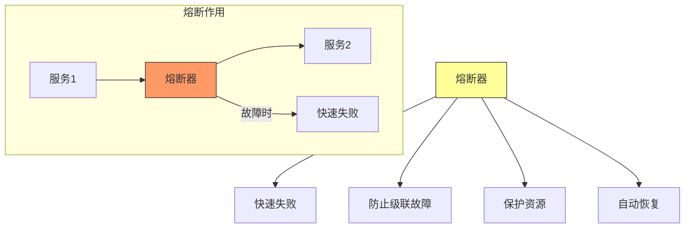
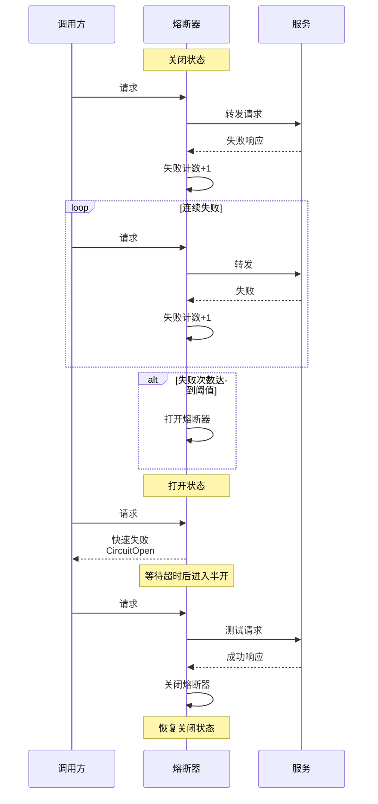
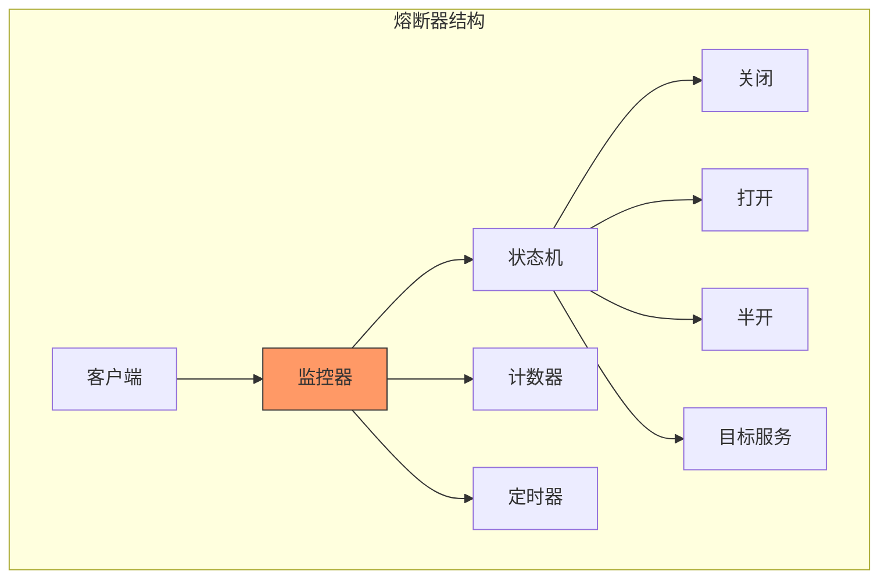
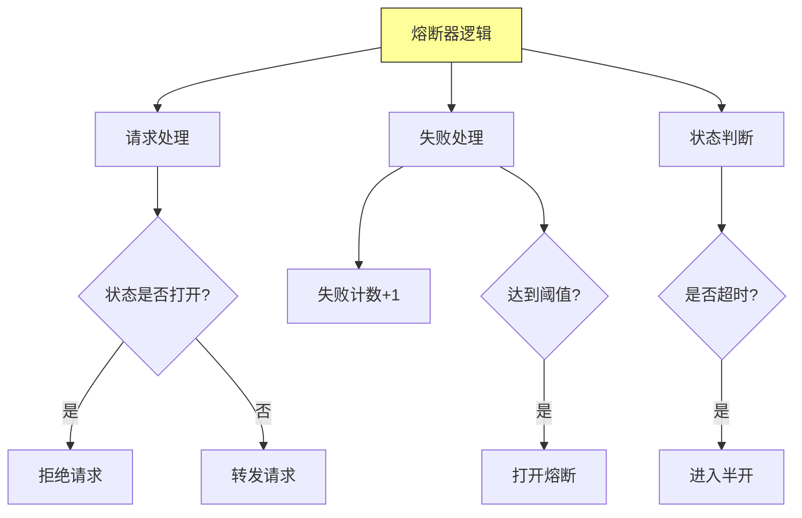
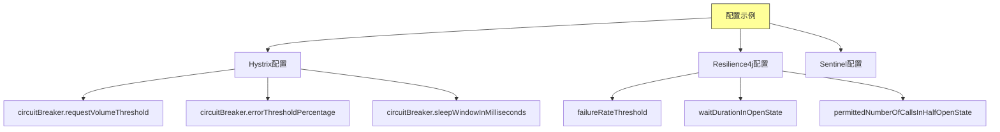
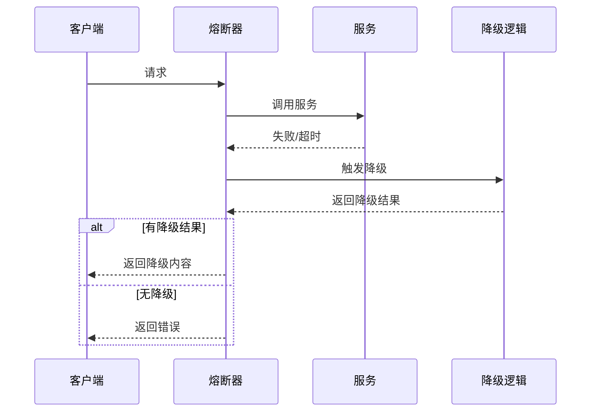
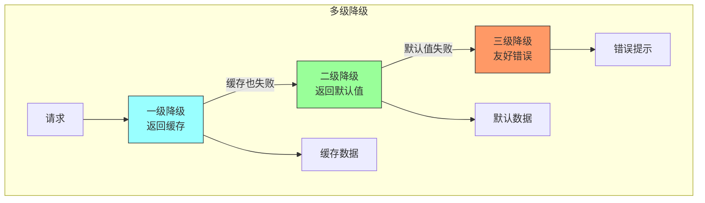
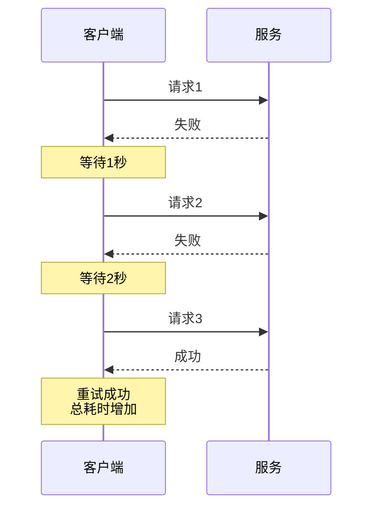
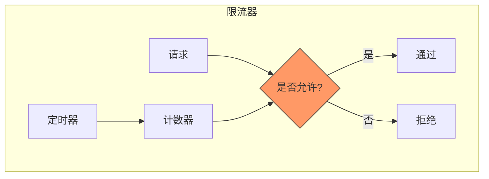

# 第十五章：Circuit Breakers

## 一、熔断器概述

### 1.1 熔断器定义

熔断器（Circuit Breaker）是一种保护系统的模式：



**核心目标**：
- 防止故障级联传播
- 减少系统资源消耗
- 提供优雅的降级能力
- 支持自动恢复

### 1.2 为什么需要熔断器

```mermaid
graph TD
    A[级联故障] --> B[服务A故障]
    A --> C[服务B超时]
    A --> D[服务C超时]
    A --> E[系统雪崩]

    B --> B1[请求积压]
    B --> B2[资源耗尽

    style A fill:#f96,stroke:#333
    style E fill:#f96,stroke:#333
```

**故障传播链**：
1. 服务A故障
2. 调用方重试加剧负载
3. 请求积压，线程池占满
4. 调用方也故障
5. 故障继续传播
6. 系统全面崩溃

## 二、熔断器原理

### 2.1 熔断器状态

```mermaid
graph TD
    A[熔断器状态] --> B[关闭状态]
    A --> C[打开状态]
    A --> D[半开状态]

    B --> B1[正常转发请求]
    B --> B2[统计失败次数]

    C --> C1[拒绝所有请求]
    C --> C2[快速失败

    D --> D1[允许测试请求通过]
    D --> D2[探测服务是否恢复]

    style A fill:#ff9,stroke:#333
    style B fill:#9f9,stroke:#333
    style C fill:#f96,stroke:#333
```

### 2.2 状态转换流程



### 2.3 熔断器参数

```mermaid
graph TD
    A[熔断器参数] --> B[失败阈值]
    A --> C[超时时间]
    A --> D[半开请求数]
    A --> E[成功阈值]

    B --> B1[打开熔断的失败次数]
    B --> B2[如: 10次失败]

    C --> C1[打开到半开的时间]
    C --> C2[如: 60秒]

    D --> D1[半开状态下允许的请求数]
    D --> D2[如: 3个请求]

    E --> E1[半开状态下成功次数]
    E --> E2[如: 2次成功

    style A fill:#ff9,stroke:#333
```

## 三、熔断器实现

### 3.1 熔断器模式结构



### 3.2 伪代码实现



### 3.3 熔断器配置示例



## 四、降级策略

### 4.1 降级类型

```mermaid
graph TD
    A[降级策略] --> B[返回默认值]
    A --> C[返回缓存]
    A --> D[返回静态内容]
    A --> E[排队等待]

    B --> B1[返回预设默认值]
    B --> B2[保证可用性]

    C --> C1[使用历史缓存]
    C --> C2[牺牲实时性

    D --> D1[返回静态页面]
    D --> D2[友好提示

    E --> E1[请求排队]
    E --> E2[延迟处理

    style A fill:#ff9,stroke:#333
```

### 4.2 降级实现



### 4.3 多级降级



## 五、重试模式

### 5.1 重试策略

```mermaid
graph TD
    A[重试策略] --> B[立即重试]
    A --> C[固定间隔]
    A --> D[指数退避]
    A --> E[抖动退避]

    B --> B1[适合瞬时故障]
    B --> B2[可能加剧拥塞

    C --> C1[固定等待时间]
    C --> C2[简单可预测

    D --> D1[间隔逐渐增加]
    D --> D2[避免风暴]

    E --> E1[退避+随机抖动]
    E --> E2[避免同步

    style A fill:#ff9,stroke:#333
```

### 5.2 重试流程



### 5.3 重试与熔断结合

```mermaid
graph TD
    A[重试+熔断] --> B[重试次数限制]
    A --> C[熔断保护]
    A --> D[指数退避]

    B --> B1[最大重试次数]
    B --> B2[避免无限重试

    C --> C1[连续失败后熔断]
    C --> C2[保护系统

    D --> D1[退避间隔]
    D --> D2[避免雪崩

    style A fill:#ff9,stroke:#333
```

## 六、隔离模式

### 6.1 线程池隔离

```mermaid
graph TD
    subgraph 线程池隔离
    ServiceA[服务A] --> Pool1[线程池1<br/>10线程]
    ServiceB[服务B] --> Pool2[线程池2<br/>10线程]
    ServiceC[服务C] --> Pool3[线程池3<br/>10线程]

    Pool1 --> Resp1[响应1]
    Pool2 --> Resp2[响应2]
    Pool3 --> Resp3[响应3]

    Note over Pool1: 服务A故障<br/>只影响线程池1
    end

    style Pool1 fill:#f96,stroke:#333
    style Pool2 fill:#9f9,stroke:#333
    style Pool3 fill:#9f9,stroke:#333
```

### 6.2 信号量隔离

```mermaid
graph TD
    subgraph 信号量隔离
    Client[客户端] --> Sem[信号量]
    Sem -->|获取许可| S[服务]
    S -->|释放许可| Sem

    Note over Sem: 并发请求数限制<br/>如: 最多10个并发请求
    end

    style Sem fill:#f96,stroke:#333
```

### 6.3 隔离策略对比

| 特性 | 线程池隔离 | 信号量隔离 |
|-----|----------|----------|
| **实现方式** | 独立线程池 | 计数器 |
| **资源消耗** | 较高 | 较低 |
| **超时处理** | 支持 | 需额外实现 |
| **适用场景** | 耗时操作 | 快速返回 |
| **隔离粒度** | 进程级 | 调用级 |

## 七、限流模式

### 7.1 限流算法

```mermaid
graph TD
    A[限流算法] --> B[计数器]
    A --> C[滑动窗口]
    A --> D[令牌桶]
    A --> E[漏桶]

    B --> B1[简单计数]
    B --> B2[边界突刺

    C --> C1[平滑计数]
    C --> C2[无突刺

    D --> D1[允许突发]
    D --> D2[流量整形

    E --> E1[平滑输出]
    E --> E2[流量整形

    style A fill:#ff9,stroke:#333
```

### 7.2 限流实现



### 7.3 限流策略

```mermaid
graph TD
    A[限流策略] --> B[单机限流]
    A --> C[分布式限流]
    A --> D[多维度限流]

    B --> B1[单节点限流]
    B --> B2[实现简单

    C --> C1[全局限流]
    C --> C2[需要协调

    D --> D1[按用户/接口限流]
    D --> D2[更精细

    style A fill:#ff9,stroke:#333
```

## 八、总结与启示

核心要点：
- 熔断器防止故障级联传播
- 降级策略提供优雅的失败体验
- 重试模式处理瞬时故障
- 隔离和限流保护系统资源

---

*本章精读笔记完成*
