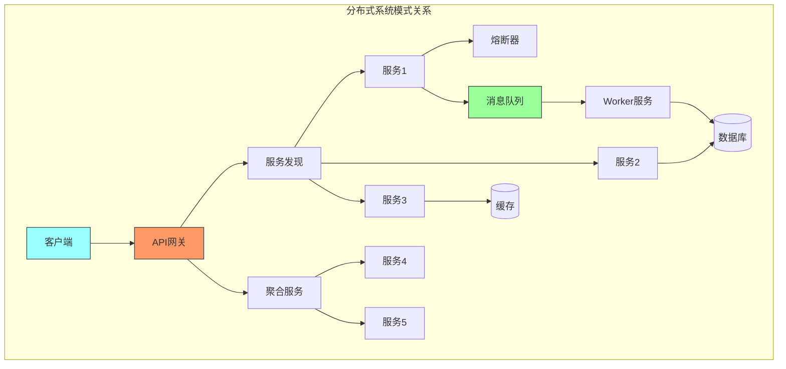
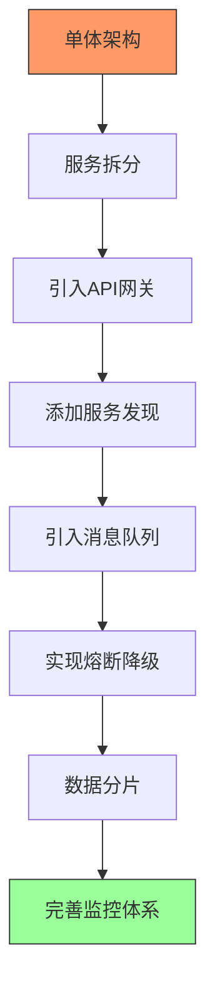
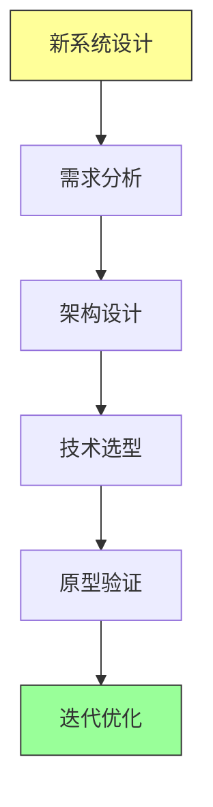
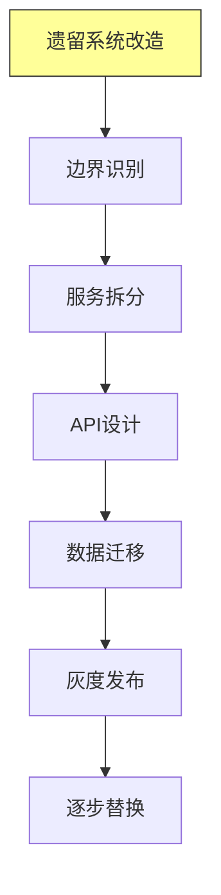
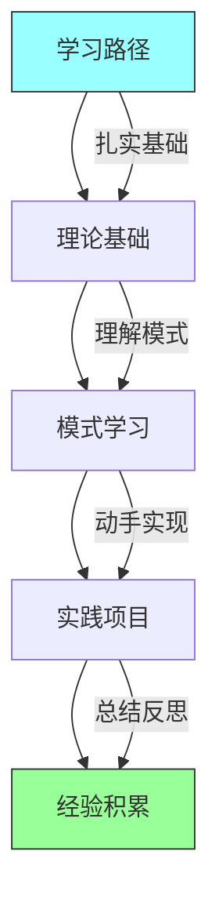

# 第十六章：Conclusion

## 一、分布式系统模式回顾

### 1.1 有状态模式

```mermaid
graph TD
    A[有状态模式] --> B[单例架构]
    A --> C[分片服务]
    A --> D[所有权与选举]
    A --> E[事件溯源]

    B --> B1[主-工作模式]
    B --> B2[简单协调]

    C --> C1[水平扩展数据]
    C --> C2[负载分散]

    D --> D1[领导选举]
    D --> D2[分布式锁]

    E --> E1[事件驱动状态]
    E --> E2[完整审计

    style A fill:#ff9,stroke:#333
```

### 1.2 无状态模式

```mermaid
graph TD
    A[无状态模式] --> B[请求/响应]
    A --> C[服务聚合]
    A --> D[API网关]
    A --> E[服务发现]

    B --> B1[同步通信]
    B --> B2[异步通信]

    C --> C1[组合多个服务]
    C --> C2[统一接口]

    D --> D1[统一入口]
    D --> D2[认证限流

    E --> E1[动态定位]
    E --> E2[健康检查

    style A fill:#9ff,stroke:#333
```

### 1.3 批处理模式

```mermaid
graph TD
    A[批处理模式] --> B[MapReduce]
    A --> C[工作队列]
    A --> D[事件驱动消息]
    A --> E[数据管道]

    B --> B1[分布式计算]
    B --> B2[高吞吐量]

    C --> C1[异步任务]
    C --> C2[任务分发]

    D --> D1[发布订阅]
    D --> D2[松耦合

    E --> E1[ETL流程]
    E --> E2[数据转换

    style A fill:#9f9,stroke:#333
```

## 二、核心模式关联

### 2.1 模式关系图



### 2.2 架构演进路径



## 三、设计原则

### 3.1 分布式设计原则

```mermaid
graph TD
    A[设计原则] --> B[单一职责]
    A --> C[松耦合]
    A --> D[高内聚]
    A --> E[容错设计]
    A --> F[可观测性]

    B --> B1[每个服务专注一件事]

    C --> C1[服务间最小依赖]

    D --> D1[相关功能集中]

    E --> E1[假设任何环节都可能失败]

    F --> F1[日志/指标/追踪

    style A fill:#ff9,stroke:#333
```

### 3.2 最佳实践清单

```mermaid
graph TD
    A[最佳实践] --> B[设计阶段]
    A --> C[开发阶段]
    A --> D[运维阶段]

    B --> B1[明确服务边界]
    B --> B2[设计容错机制]

    C --> C1[实现幂等操作]
    C --> C2[添加健康检查]

    D --> D1[监控告警]
    D --> D2[容量规划

    style A fill:#ff9,stroke:#333
```

## 四、技术选型指南

### 4.1 消息队列选型

```mermaid
graph TD
    A[消息队列选型] --> B[RabbitMQ]
    A --> C[Kafka]
    A --> D[Pulsar]

    B --> B1[功能丰富]
    B --> B2[复杂路由

    C --> C1[高吞吐]
    C --> C2[日志/流处理

    D --> D1[云原生]
    D --> D2[多租户

    style A fill:#ff9,stroke:#333
```

### 4.2 服务注册中心选型

| 注册中心 | 特点 | 适用场景 |
|---------|------|---------|
| **Eureka** | AP模型，高可用 | Spring Cloud |
| **Consul** | 多功能，支持KV | 多语言环境 |
| **etcd** | 强一致，高性能 | Kubernetes |
| **Nacos** | 国内流行，易用 | 国内项目 |
| **ZooKeeper** | 稳定可靠 | 大规模集群 |

### 4.3 网关选型

| 网关 | 特点 | 适用场景 |
|-----|------|---------|
| **Kong** | 插件丰富，性能好 | 通用场景 |
| **Nginx Plus** | 商业版，功能完善 | 企业级 |
| **Envoy** | 云原生，高性能 | Service Mesh |
| **Zuul** | Spring生态 | Spring Cloud |

## 五、未来趋势

### 5.1 云原生趋势

```mermaid
graph TD
    A[云原生趋势] --> B[容器化]
    A --> C[服务网格]
    A --> D[Serverless]
    A --> E[可观测性]

    B --> B1[标准化部署]
    B --> B2[资源隔离]

    C --> C1[透明代理]
    C --> C2[流量管理]

    D --> D1[按需计算]
    D --> D2[自动扩缩

    E --> E1[统一标准]
    E --> E2[智能告警

    style A fill:#ff9,stroke:#333
```

### 5.2 服务网格演进

```mermaid
graph TD
    subgraph 服务网格架构
    Client[客户端] --> Sidecar[Sidecar代理]
    Sidecar --> Control[控制平面]

    Sidecar --> S1[服务实例]
    Sidecar --> S2[服务实例]

    Control --> Sidecar[配置下发]
    Control --> Policy[策略执行]

    Note over Sidecar: 数据平面<br/>透明拦截流量
    Note over Control: 控制平面<br/>策略和配置
    end

    style Sidecar fill:#f96,stroke:#333
    style Control fill:#9ff,stroke:#333
```

### 5.3 自动化与智能化

```mermaid
graph TD
    A[智能化趋势] --> B[AIOps]
    A --> C[自动修复]
    A --> D[智能扩缩容]

    B --> B1[异常检测]
    B --> B2[根因分析]

    C --> C1[自动故障转移]
    C --> C2[自动扩容

    D --> D1[预测性扩容]
    D --> D2[成本优化

    style A fill:#9f9,stroke:#333
```

## 六、实践建议

### 6.1 新系统设计



### 6.2 遗留系统改造



### 6.3 常见陷阱

```mermaid
graph TD
    A[常见陷阱] --> B[过度设计]
    A --> C[分布式单体]
    A --> D[忽视故障]
    A --> E[监控不足]

    B --> B1[过早优化]
    B --> B2[增加复杂度

    C --> C1[服务拆分不当]
    C --> C2[耦合严重

    D --> D1[没有容错]
    D --> D2[单点故障

    E --> E1[问题难以定位]
    E --> E2[响应慢

    style A fill:#f96,stroke:#333
```

## 七、总结

### 7.1 核心要点

```mermaid
graph TD
    A[核心要点] --> B[模式选择]
    A --> C[容错设计]
    A --> D[监控运维]
    A --> E[持续优化]

    B --> B1[根据场景选择合适模式]
    B --> B2[平衡复杂度和需求]

    C --> C1[熔断/降级/重试]
    C --> C2[假设任何环节都会失败]

    D --> D1[可观测性是基础]
    D --> D2[告警和追踪

    E --> E1[持续演进]
    E --> E2[不追求一步到位

    style A fill:#ff9,stroke:#333
```

### 7.2 学习路径



### 7.3 最后的思考

分布式系统设计是一门平衡的艺术：

- **简单vs复杂**：选择最简单的方案
- **性能vs可靠性**：根据场景权衡
- **一致vs可用**：理解CAP定理
- **现在vs未来**：适度前瞻，避免过度设计

记住：**分布式系统的核心挑战是处理故障**，所有的模式都是为了更好地应对不确定性。

---

*本书精读笔记完成*
