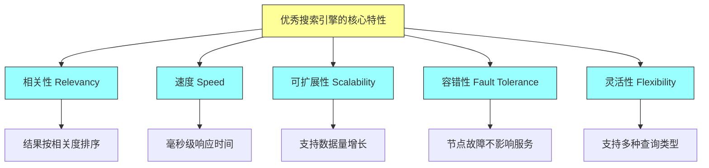
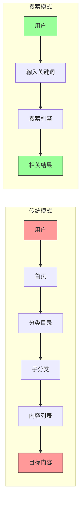
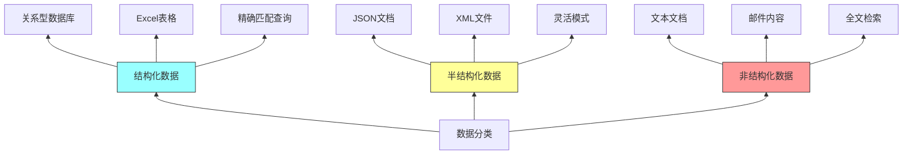
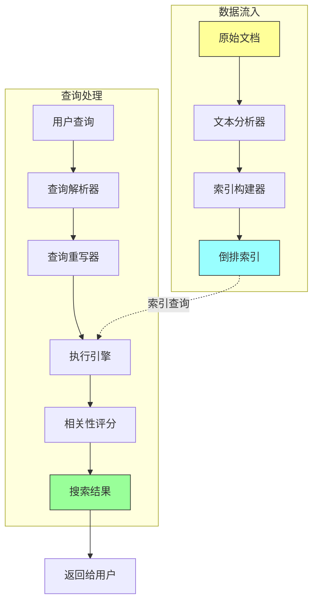
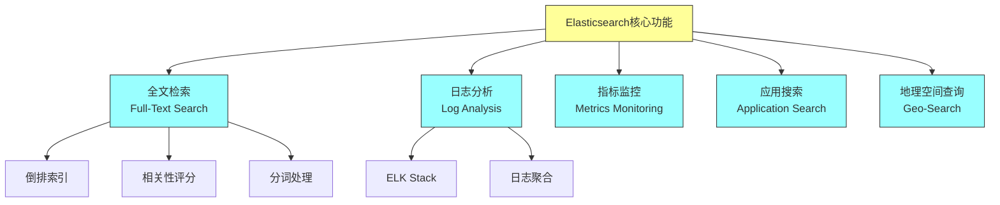
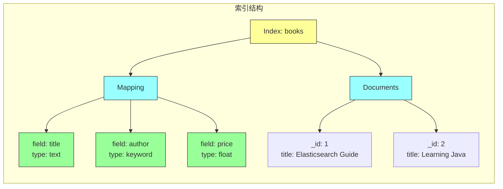
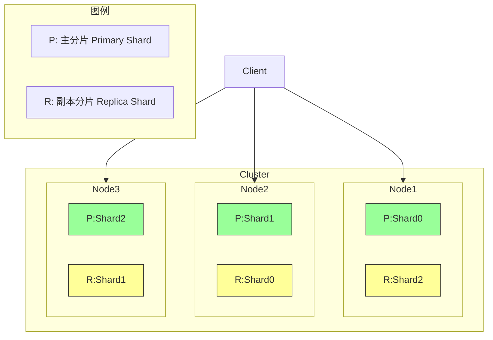
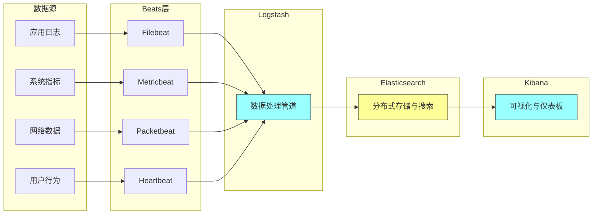
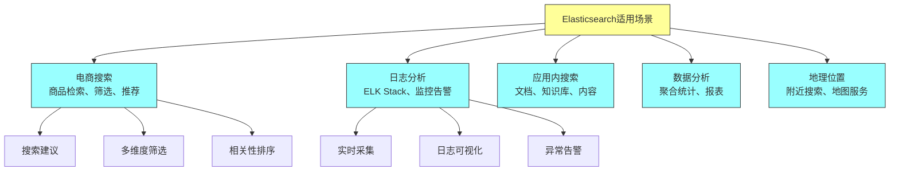
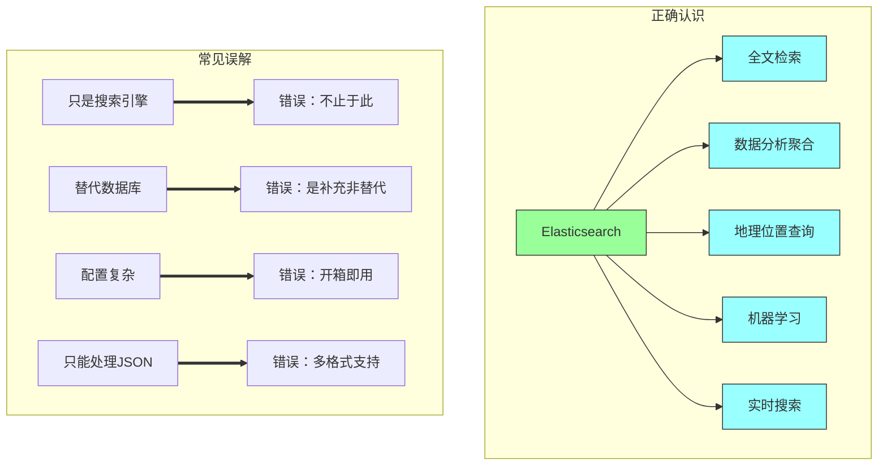

# 《Elasticsearch in Action》第一章：概述

## 一、本章概述

### 1.1 本章简介

本章是全书的开篇，主要介绍搜索引擎的基本概念、现代搜索引擎的架构特点，以及 Elasticsearch 在整个生态系统中的定位。通过阅读本章，你将理解：

- 什么是一个优秀的搜索引擎
- 结构化数据与非结构化数据的区别
- 为什么数据库搜索无法满足全文检索需求
- Elasticsearch 的核心功能和应用场景
- Elastic Stack 完整技术栈的组成

### 1.2 学习目标

完成本章学习后，你将能够：

- 清晰区分结构化数据与非结构化数据
- 理解全文检索的核心原理
- 描述 Elasticsearch 的核心优势和适用场景
- 了解 Elastic Stack 各组件的职责分工
- 判断何时应该使用 Elasticsearch 而非传统数据库

---

## 二、搜索引擎基础

### 2.1 什么是一个优秀的搜索引擎

一个优秀的搜索引擎应当具备以下核心特性，这些特性共同决定了用户体验的质量：

**相关性（Relevancy）** 是搜索引擎的核心指标。搜索结果应该按照与用户查询的相关程度进行排序，最相关的结果排在最前面。例如，当用户搜索「Java编程」时，关于 Java 编程语言入门教程的书籍应该排在关于咖啡豆品种介绍的前面。

**速度（Speed）** 决定了用户等待时间。现代搜索引擎要求毫秒级的响应时间，用户期望在输入搜索关键词后的几百毫秒内就能看到结果。这种实时性要求搜索引擎具备高效的索引结构和查询优化能力。

**可扩展性（Scalability）** 确保系统能够处理不断增长的数据量和并发请求。随着业务发展，索引的文档数量可能从几万增长到数十亿，搜索引擎必须能够通过横向扩展来应对这种增长，而不需要重构整个系统。

**容错性（Fault Tolerance）** 保证部分节点故障时系统仍能正常运行。分布式搜索引擎通过数据冗余和自动故障转移机制，确保服务的高可用性。

**灵活性（Flexibility）** 体现在支持多种查询方式和数据类型的处理能力。现代应用场景复杂多样，搜索引擎需要支持从简单的关键词匹配到复杂的地理位置查询、自然语言处理等多种需求。



### 2.2 搜索是新常态

在当今互联网时代，搜索功能已经成为几乎所有应用的标准配置。用户已经习惯于通过搜索来快速找到所需信息，而不是浏览整个网站或应用。这种用户行为的变化推动了搜索技术的普及和进化。

**从被动浏览到主动查找**：早期的网站导航主要依赖分类目录和层级菜单，用户需要逐级浏览才能找到目标内容。随着信息量的爆炸式增长，这种方式的效率越来越低。搜索功能让用户能够直接表达需求，系统快速定位相关内容，大幅提升了信息获取效率。

**搜索无处不在**：现代应用中的搜索功能已经超越了传统意义上的「搜索框」。推荐系统本质上是隐式搜索，根据用户历史行为预测其可能感兴趣的内容。电商平台的商品筛选、日志分析系统的条件查询、代码编辑器的智能补全，都可以看作是搜索技术的应用延伸。



### 2.3 结构化数据与非结构化数据

理解这两种数据类型的区别对于选择合适的存储和检索方案至关重要。

**结构化数据（Structured Data）** 具有预定义的模式和固定的数据类型，通常存储在关系型数据库中。每一行数据都有相同的列结构，数据类型在写入时就被严格验证。例如，用户表中的用户名必须是字符串、年龄必须是整数、注册日期必须是日期类型。结构化数据适合精确查询，可以进行精确的等值匹配、范围查询和聚合计算。

**非结构化数据（Unstructured Data）** 没有预定义的模式或结构，典型代表是文本内容。一篇新闻文章、一段用户评论、一封电子邮件，其内容和长度都无法预先确定。非结构化数据的核心挑战在于理解其语义内容，实现基于意义的搜索而非简单的字符匹配。

**半结构化数据（Semi-Structured Data）** 介于两者之间，具有一定的组织结构但不固定。JSON 文档、XML 文件、HTML 页面都属于这一类别。Elasticsearch 天然适合处理这类数据，它既可以利用字段结构进行精确查询，又能对文本内容进行全文检索。



**数据类型的对比分析**：

| 特性 | 结构化数据 | 半结构化数据 | 非结构化数据 |
|-----|-----------|-------------|-------------|
| 存储方式 | 关系型数据库 | NoSQL/文档数据库 | 文件系统/对象存储 |
| 查询方式 | SQL精确查询 | 模式匹配+全文检索 | 全文检索 |
| 灵活性 | 低 | 中 | 高 |
| 代表技术 | MySQL、PostgreSQL | MongoDB、Elasticsearch | Elasticsearch、Solr |
| 适用场景 | 事务处理、报表 | API响应、日志 | 搜索、内容分析 |

### 2.4 数据库搜索与专业搜索引擎

许多应用最初使用关系型数据库的 LIKE 语句进行搜索，但随着数据量增长和搜索需求复杂化，这种方式的局限性日益明显。

**数据库搜索的局限**：

1. **性能问题**：对于大表的全文本搜索，LIKE '%keyword%' 语法无法使用索引，导致全表扫描。十万级别的数据可能需要几秒甚至更长时间，而搜索引擎通常能在毫秒级别返回结果。

2. **相关性排序缺失**：数据库查询结果是严格的匹配结果，无法计算语义相关性。所有匹配的行在结果集中地位相同，无法将更相关的结果排在前面。

3. **分词支持不足**：中文等语言的文本需要分词处理，数据库不支持智能分词，只能按字符匹配。「Elasticsearch教程」作为一个整体查询时，数据库无法将其拆分为「Elasticsearch」和「教程」分别检索。

4. **高级查询功能有限**：无法轻松实现同义词扩展、模糊匹配、拼写纠正、相关性 boosting 等高级搜索功能。

```java
// Java中使用数据库LIKE查询的示例
public List<Book> searchBooksByTitle(String keyword) {
    String sql = "SELECT * FROM books WHERE title LIKE ?";
    // 这种方式存在性能问题，无法利用索引
    return jdbcTemplate.query(sql, new Object[]{"%" + keyword + "%"},
        new BookRowMapper());
}

// Elasticsearch的等效搜索
// POST /books/_search
// {
//   "query": {
//     "match": {
//       "title": "Elasticsearch"
//     }
//   }
// }
```

**搜索引擎的专长**：

1. **倒排索引（Inverted Index）**：这是全文检索的核心数据结构。它将文档中的每个词映射到包含该词的文档列表，实现高效的词到文档的查找。

2. **相关性计算**：TF-IDF、BM25 等算法能够评估每个文档与查询的相关程度，支持按相关性排序。

3. **分词和语言处理**：内置多种语言的分词器，支持词干提取、同义词处理、大小写转换等预处理。

4. **分布式架构**：原生的分布式设计，支持水平扩展，处理 PB 级数据。

---

## 三、现代搜索引擎架构

### 3.1 核心功能模块

现代搜索引擎通常包含以下核心功能模块，这些模块协同工作完成从文档到搜索结果的整个流程：

**索引模块（Indexing Module）** 负责将原始文档转换为可搜索的索引结构。这一过程包括文本分析（分词、过滤）、特征提取、索引写入等步骤。索引模块的设计直接影响搜索性能和存储效率。

**查询模块（Query Module）** 解析用户查询，执行搜索算法，返回排序后的结果。它需要支持多种查询类型（精确匹配、模糊匹配、范围查询等），并能与索引模块高效配合。

**分析模块（Analysis Module）** 处理文本的预处理工作，包括分词、词形还原、停用词去除、同义词扩展等。这个模块确保搜索能够理解文档和查询的语义。

**分布式模块（Distributed Module）** 管理数据的分布和副本，提供高可用性和可扩展性。包括数据分片、负载均衡、故障转移等功能。



### 3.2 主流搜索引擎对比

市场上存在多种搜索引擎解决方案，它们各有特点和适用场景：

**Elasticsearch** 是当前最流行的开源搜索引擎，基于 Apache Lucene 构建。它以强大的全文检索能力、分布式架构和丰富的生态系统著称。Elasticsearch 的优势在于开箱即用、文档完善、社区活跃，适合构建各类搜索应用和日志分析平台。

**Apache Solr** 是另一个基于 Lucene 的成熟项目，历史悠久，功能全面。Solr 在企业级应用中有广泛应用，特别是在需要复杂文本处理和高可用的场景。它的配置相对复杂，但功能更加精细可控。

**OpenSearch** 是 Elasticsearch 7.10 版本的分支，由 AWS 主导开发。它继承了 Elasticsearch 的核心功能，同时采用 Apache 2.0 许可证，对云原生场景有更好的支持。

**类型对比**：

| 特性 | Elasticsearch | Apache Solr | OpenSearch |
|-----|--------------|-------------|------------|
| 许可证 | Apache 2.0 | Apache 2.0 | Apache 2.0 |
| 分布式支持 | 原生 | 需要配置 | 原生 |
| 生态系统 | Elastic Stack | 相对独立 | AWS集成 |
| 学习曲线 | 较低 | 较高 | 中等 |
| 社区活跃度 | 非常活跃 | 活跃 | 较活跃 |
| 主要用户 | 创业公司、互联网企业 | 传统企业 | AWS用户 |

---

## 四、Elasticsearch 核心概念

### 4.1 核心功能领域

Elasticsearch 在多个领域展现出强大的能力，这些能力使其成为构建现代搜索和分析应用的首选：

**全文检索（Full-Text Search）** 是 Elasticsearch 的核心功能。它支持复杂的文本查询，包括精确匹配、短语搜索、模糊匹配、通配符搜索等。结合相关性评分，能够将最相关的结果排在前面。

**日志分析（Log Analysis）** 是 Elasticsearch 的第二大应用场景。通过与 Logstash、Beats 配合，构成完整的日志采集、存储、分析流水线。ELK Stack（现称 Elastic Stack）已成为业界标准的日志分析解决方案。

**指标监控（Metrics Monitoring）** 利用 Elasticsearch 的聚合功能进行时序数据分析。配合 Kibana 可以构建实时的监控仪表板，支持告警和异常检测。

**应用搜索（Application Search）** 为网站、移动应用提供搜索功能。Elastic App Search 和 Site Search 产品提供了开箱即用的搜索体验。

**地理空间查询（Geo-Search）** 支持基于地理位置的搜索和聚合，适用于地图应用、位置服务、附近的人/商家等场景。



### 4.2 核心数据概念

理解 Elasticsearch 的数据模型是掌握它的基础。以下是四个核心概念：

**索引（Index）** 是存储文档的逻辑容器，类似于关系型数据库中的表。每个索引有一个唯一的名称，可以包含多个文档。索引定义了文档的映射（mapping），描述了字段的类型和如何处理它们。

**文档（Document）** 是 Elasticsearch 中的基本数据单元，存储为 JSON 格式。每个文档都有一个唯一的 _id 作为主键。文档由多个字段（field）组成，每个字段有特定的数据类型。

**类型（Type）** 在 Elasticsearch 7.x 之前用于在索引中区分不同结构的文档。从 7.x 开始，每个索引只能有一个类型（_doc），简化了数据模型。

**映射（Mapping）** 定义了索引中文档的结构，类似于关系型数据库的表结构。它描述了每个字段的数据类型以及如何分析（analyze）文本字段。



**ES 请求示例：创建索引并插入文档**

```json
// 创建索引并定义映射
PUT /books
{
  "settings": {
    "number_of_shards": 1,
    "number_of_replicas": 0
  },
  "mappings": {
    "properties": {
      "title": { "type": "text" },
      "author": { "type": "keyword" },
      "price": { "type": "float" },
      "published_date": { "type": "date" }
    }
  }
}

// 插入单个文档
POST /books/_doc/1
{
  "title": "Elasticsearch in Action",
  "author": "Madhusudhan Konda",
  "price": 49.99,
  "published_date": "2023-01-15"
}

// 批量插入文档
POST /books/_bulk
{"index":{"_id":"2"}}
{"title":"Learning Java","author":"John Smith","price":39.99,"published_date":"2022-06-01"}
{"index":{"_id":"3"}}
{"title":"Mastering Elasticsearch","author":"Jane Doe","price":59.99,"published_date":"2023-03-20"}
```

**Java 客户端示例**

```java
import co.elastic.clients.elasticsearch.ElasticsearchClient;
import co.elastic.clients.elasticsearch.core.IndexRequest;
import co.elastic.clients.elasticsearch.indices.CreateIndexRequest;
import co.elastic.clients.json.jackson.JacksonJsonpMapper;
import co.elastic.clients.transport.ElasticsearchTransport;
import co.elastic.clients.transport.rest_client.RestClientTransport;
import org.apache.http.HttpHost;
import org.elasticsearch.client.RestClient;

import java.io.IOException;
import java.util.HashMap;
import java.util.Map;

public class ElasticsearchDemo {

    public static void main(String[] args) throws IOException {
        // 创建低级客户端
        RestClient restClient = RestClient.builder(
            new HttpHost("localhost", 9200, "http")
        ).build();

        // 创建传输层
        ElasticsearchTransport transport = new RestClientTransport(
            restClient, new JacksonJsonpMapper()
        );

        // 创建客户端
        ElasticsearchClient client = new ElasticsearchClient(transport);

        // 创建索引
        CreateIndexRequest createIndexRequest = CreateIndexRequest.of(builder -> builder
            .index("books")
            .settings(s -> s
                .numberOfShards("1")
                .numberOfReplicas("0")
            )
            .mappings(m -> m
                .properties("title", p -> p.text(t -> t))
                .properties("author", p -> p.keyword(k -> k))
                .properties("price", p -> p.float_(f -> f))
                .properties("published_date", p -> p.date(d -> d))
            )
        );

        client.indices().create(createIndexRequest);
        System.out.println("索引 books 创建成功");

        // 插入文档
        Map<String, Object> book = new HashMap<>();
        book.put("title", "Elasticsearch in Action");
        book.put("author", "Madhusudhan Konda");
        book.put("price", 49.99);
        book.put("published_date", "2023-01-15");

        IndexRequest<Map<String, Object>> indexRequest = IndexRequest.of(builder -> builder
            .index("books")
            .id("1")
            .document(book)
        );

        client.index(indexRequest);
        System.out.println("文档插入成功");
    }
}
```

### 4.3 分布式架构基础

Elasticsearch 从设计之初就是分布式的，这使其能够处理大规模数据和高并发请求。

**集群（Cluster）** 是一个或多个节点的集合，它们共同存储数据并提供联合的索引和搜索功能。集群通过一个唯一的名称来标识，默认名称为「elasticsearch」。

**节点（Node）** 是集群中的一台服务器，存储数据并参与集群的索引和搜索功能。每个节点有一个唯一的 ID，节点启动时会加入到指定名称的集群中。

**分片（Shard）** 是索引数据的子集，每个分片是一个独立的 Lucene 索引。分片允许水平分割/扩展数据量，也允许跨分片分布执行操作提高性能。

**副本（Replica）** 是分片的副本，用于提供高可用性和读取吞吐量。主分片丢失时，副本可以晋升为主分片。



**分片与副本的配置示例**：

```json
// 创建索引时指定分片数量
PUT /large_index
{
  "settings": {
    "number_of_shards": 3,        // 主分片数量
    "number_of_replicas": 1       // 每个主分片的副本数量
  },
  "mappings": {
    "properties": {
      "content": { "type": "text" }
    }
  }
}

// 结果：
// Node1: P0, R1, R2
// Node2: P1, R0, R2
// Node3: P2, R0, R1
```

---

## 五、Elastic Stack 生态系统

### 5.1 Elastic Stack 概述

Elastic Stack（以前称为 ELK Stack）是由 Elastic 公司开发的一套完整的数据处理和可视化解决方案。它包含四个核心组件，每个组件都有明确的职责定位：

**Elasticsearch** 是整个栈的核心，负责数据的存储、索引和搜索。它是一个分布式、RESTful 的搜索和分析引擎，能够处理PB级别的数据。

**Logstash** 是一个服务器端的数据处理管道，能够从多种来源采集数据，进行转换和增强，然后发送到 Elasticsearch。Logstash 支持丰富的插件，可以处理各种格式的日志和事件数据。

**Kibana** 是一个可视化和探索平台，为 Elasticsearch 提供数据可视化和仪表板功能。用户可以通过 Kibana 创建图表、地图、仪表板，实现数据的直观展示。

**Beats** 是一组轻量级的数据采集器，专门用于从各种来源收集数据并发送到 Logstash 或 Elasticsearch。Beats 资源占用小，适合在边缘设备上运行。



### 5.2 Beats 数据采集器详解

Beats 家族包含多个专门化的数据采集器：

**Filebeat** 是最常用的日志采集器。它监控指定的日志文件，追踪文件变化，采集新增的日志行并发送到目的地。Filebeat 内置了多种日志格式的解析模块，如 Nginx、Apache、MySQL 等。

**Metricbeat** 定期采集系统和服务的指标数据。它支持采集 CPU、内存、磁盘、网络等系统指标，也可以通过模块采集 Nginx、Redis、PostgreSQL 等中间件的指标。

**Heartbeat** 用于监控服务的可用性，通过 ICMP、TCP、HTTP 等协议探测目标服务的状态。它可以帮助你了解服务的响应时间和可用性百分比。

**Auditbeat** 采集 Linux 审计框架的数据，监控文件完整性、系统调用和用户活动，适用于安全审计场景。

**Packetbeat** 是网络包分析器，能够解析网络流量，提取应用层协议（如 HTTP、DNS、MySQL）的详细信息，适用于网络监控和故障排查。

```yaml
# Filebeat 配置文件示例：采集 Nginx 日志
filebeat.inputs:
  - type: log
    enabled: true
    paths:
      - /var/log/nginx/access.log
    fields:
      app: nginx
      environment: production

output.elasticsearch:
  hosts: ["localhost:9200"]
  index: "nginx-logs-%{[fields.environment]}-%{+yyyy.MM.dd}"

setup.template.name: "nginx"
setup.template.pattern: "nginx-logs-*"
```

```java
// Java中使用Heartbeat检查服务健康状态
// 通过REST API获取集群健康
GET /_cluster/health
// 返回示例
{
  "cluster_name": "elasticsearch",
  "status": "green",
  "timed_out": false,
  "number_of_nodes": 3,
  "number_of_data_nodes": 2,
  "active_primary_shards": 10,
  "active_shards": 20
}
```

### 5.3 Logstash 数据处理管道

Logstash 的数据处理管道分为三个阶段：

**输入（Input）** 阶段负责从各种来源采集数据。支持的数据源包括文件、Beats、Kafka、RabbitMQ、JDBC、HTTP 等。输入插件可以配置多种采集模式，如轮询、监听等。

**过滤（Filter）** 阶段对数据进行解析、转换和增强。这是 Logstash 最强大的能力所在。常用的过滤器包括：Grok（解析非结构化文本）、Mutate（修改字段）、Drop（删除不需要的事件）、GeoIP（添加地理位置信息）等。

**输出（Output）** 阶段将处理后的数据发送到目的地。主要输出目标是 Elasticsearch，但也可以发送到 Kafka、Redis、文件、邮件等。

```ruby
# Logstash 配置文件示例
input {
  beats {
    port => 5044
  }
  jdbc {
    jdbc_connection_string => "jdbc:mysql://localhost:3306/mydb"
    jdbc_user => "root"
    jdbc_password => "password"
    statement => "SELECT * FROM users WHERE updated_at > :sql_last_value"
    use_column_value => true
    tracking_column => "updated_at"
  }
}

filter {
  # 解析 Nginx 日志
  if [fields][app] == "nginx" {
    grok {
      match => { "message" => '%{IPORHOST:client_ip} - %{DATA:user} \[%{HTTPDATE:timestamp}\] "%{WORD:method} %{DATA:url} HTTP/%{NUMBER:http_version}" %{NUMBER:status:int} %{NUMBER:bytes:int}' }
    }

    # 转换时间戳
    date {
      match => [ "timestamp", "dd/MMM/yyyy:HH:mm:ss Z" ]
      target => "@timestamp"
    }

    # 添加地理位置
    geoip {
      source => "client_ip"
      target => "geoip"
    }

    # 添加用户代理信息
    useragent {
      source => "user_agent"
      target => "ua"
    }
  }
}

output {
  elasticsearch {
    hosts => ["localhost:9200"]
    index => "nginx-logs-%{+YYYY.MM.dd}"
  }
  stdout {
    codec => rubydebug
  }
}
```

### 5.4 Kibana 可视化能力

Kibana 提供了丰富的数据可视化功能，使非技术人员也能探索和分析 Elasticsearch 中的数据：

**Discover** 是数据探索的主要界面，用户可以在这里执行搜索查询、过滤结果、查看字段统计信息。它支持保存搜索查询和创建自定义的时间范围。

**Lens** 是新一代的可视化编辑器，提供了拖拽式的界面，让创建图表变得简单直观。Lens 能够根据选择的字段自动推荐合适的可视化类型。

**Canvas** 允许创建像素级的可视化报告，可以精确控制每个元素的位置和样式，适合创建品牌化的仪表板。

**Maps** 是专门的地理空间可视化工具，支持在地图上展示数据分布、热力图、轨迹等地理相关信息。

**Machine Learning** 提供了异常检测、时间序列预测等机器学习功能，可以自动发现数据中的异常模式。

**Dashboard** 将多个可视化组件组合在一起，形成综合的监控仪表板，支持实时刷新和交互式过滤。

```json
// Kibana Discover 查询示例
// 在 Discover 界面中搜索 Nginx 访问日志
// 查询：状态码为5xx的请求
{
  "query": {
    "bool": {
      "must": [
        { "match": { "fields.app": "nginx" } },
        { "range": { "status": { "gte": 500 } } }
      ]
    }
  },
  "sort": [
    { "@timestamp": "desc" }
  ],
  "fields": [
    "client_ip",
    "method",
    "url",
    "status",
    "geoip.country_name"
  ]
}
```

---

## 六、Elasticsearch 适用场景

### 6.1 典型应用案例

Elasticsearch 在众多场景中展现出卓越的性能和灵活性：

**电商搜索** 是 Elasticsearch 最经典的应用场景之一。电商平台通常拥有海量的商品数据，用户需要能够快速找到想要的商品。Elasticsearch 提供了强大的全文检索能力，支持按品牌、价格、分类等多维度过滤，支持搜索建议、拼写纠错、同义词扩展等功能，显著提升购物体验。

**日志分析** 是 Elasticsearch 的第二大应用场景。现代应用产生的日志量巨大，传统的关系型数据库难以高效处理。Elasticsearch 的分布式架构和倒排索引设计使其非常适合日志存储和分析。配合 Kibana，可以快速构建实时的日志监控和告警系统。

**应用内搜索** 为各类应用提供搜索功能，包括企业文档搜索、知识库搜索、内容平台搜索等。Elasticsearch 可以部署在应用内部，提供毫秒级的搜索响应，支持复杂的查询语法和高亮显示。

**数据分析与聚合** 利用 Elasticsearch 的聚合框架进行数据统计分析。从销售数据到用户行为，从系统指标到业务报表，Elasticsearch 都能提供高效的数据聚合能力，支持多种统计维度和复杂的嵌套聚合。



### 6.2 不适用场景

尽管 Elasticsearch 功能强大，但并非所有场景都适合使用：

**事务型应用** 需要严格的 ACID 事务支持。Elasticsearch 侧重于搜索和读取性能，不支持复杂的事务操作。如果应用需要频繁的更新操作和强一致性保证，关系型数据库是更好的选择。

**复杂关联查询** 涉及多表关联的复杂查询。虽然 Elasticsearch 支持父子关系和嵌套文档，但其关联查询能力和表达力不如关系型数据库。对于需要大量 JOIN 操作的场景，传统数据库或专用的图数据库可能更合适。

**数据存储作为主数据库** 将 Elasticsearch 作为主要的持久化存储。Elasticsearch 的设计目标是高效的搜索和检索，而非完整的数据管理。建议配合主数据库使用，将 Elasticsearch 作为搜索加速层。

**实时性要求极高的场景** 需要极低延迟的数据写入后立即可见。Elasticsearch 的 refresh 机制默认每秒刷新索引，可能导致最多一秒的写入延迟。对于需要严格实时性的场景，需要权衡性能和实时性的需求。

```java
// 不适合使用Elasticsearch的场景示例

// 场景1：银行转账事务
@Transactional
public void transferMoney(Long fromAccount, Long toAccount, BigDecimal amount) {
    // 需要ACID事务支持
    // 扣款和入账必须同时成功或同时失败
    // 这种情况应该使用关系型数据库
    accountRepository.debit(fromAccount, amount);
    accountRepository.credit(toAccount, amount);
}

// 场景2：复杂的多表关联查询
// 需要查询订单信息，同时关联用户信息、产品信息、地址信息
// 这种场景应该使用关系型数据库
SELECT o.*, u.name, p.product_name, a.address
FROM orders o
JOIN users u ON o.user_id = u.id
JOIN order_items oi ON o.id = oi.order_id
JOIN products p ON oi.product_id = p.id
JOIN addresses a ON o.address_id = a.id
WHERE o.status = 'pending';

// Elasticsearch处理复杂关联查询效率较低
```

### 6.3 常见误解

关于 Elasticsearch，存在一些常见的误解需要澄清：

**误解一：Elasticsearch 只是全文搜索引擎**

实际上，Elasticsearch 远不止于此。它提供了强大的聚合分析能力，可以进行复杂的数据统计和分析；它支持地理位置查询，可以处理基于位置的服务；它提供了近似实时搜索，数据更新后很快就能被搜索到；它还支持机器学习功能，可以进行异常检测和预测分析。

**误解二：Elasticsearch 可以完全替代数据库**

Elasticsearch 应该作为传统数据库的补充，而非替代品。它擅长搜索和分析，但缺乏事务支持和复杂的关系处理能力。最佳实践是将数据存储在主数据库（如 MySQL）中，同时将需要搜索的字段同步到 Elasticsearch，使用 Elasticsearch 处理搜索请求。

**误解三：Elasticsearch 安装配置很复杂**

Elasticsearch 的开箱即用性非常好。默认配置下，单节点的 Elasticsearch 可以在几分钟内启动并运行。虽然生产环境的配置需要更多考虑，但官方文档提供了详尽的指导。对于大多数应用场景，入门门槛并不高。

**误解四：Elasticsearch 只能处理 JSON 数据**

虽然 Elasticsearch 的 API 使用 JSON，但底层支持多种数据格式的摄入。Logstash 可以解析 CSV、XML、Apache 日志等多种格式；Ingest Pipeline 可以进行复杂的数据转换；Beats 可以采集各种来源的数据。



---

## 七、生成式AI与现代搜索

### 7.1 AI驱动的搜索变革

生成式人工智能（Generative AI）正在深刻改变搜索技术的面貌。传统的搜索引擎基于关键词匹配和相关性算法，而 AI 驱动的搜索则能够理解用户查询的语义，提供更智能的搜索体验。

**语义搜索（Semantic Search）** 利用自然语言处理技术理解查询的意图和上下文。它不再局限于字面匹配，而是寻找语义上相关的结果。例如，搜索「如何治疗头痛」时，结果不仅包含包含这个词组的页面，还包括讨论头痛原因、治疗方法、药物建议的相关内容。

**对话式搜索（Conversational Search）** 允许用户通过自然语言对话进行搜索，系统能够记住对话上下文，进行多轮交互。这与传统的「输入关键词-获取结果」模式有本质区别。

**个性化搜索（Personalized Search）** 利用用户的历史行为、偏好和上下文信息，提供个性化的搜索结果。同一个查询对不同用户可能返回不同的结果。

### 7.2 Elasticsearch与AI的结合

Elasticsearch 正在积极拥抱 AI 技术，为现代搜索应用提供强大的支持：

**Elasticsearch 8.x 版本引入了多项 AI 相关功能**：

- **向量搜索（Vector Search）**：支持存储和检索向量嵌入，适用于语义搜索和相似度匹配场景。结合 NLP 模型，可以实现基于意义的搜索而非关键词匹配。

- **ELasticsearch Relevance Engine（ESRE）**：提供开箱即用的语义搜索能力，集成了常见的 NLP 模型和相关性优化技术。

- **与外部 AI 服务集成**：支持与 OpenAI、HuggingFace 等 AI 服务集成，可以调用外部大语言模型进行查询理解和结果增强。

**应用场景**：

- **智能问答系统**：结合大语言模型，构建能够理解问题并生成答案的问答系统
- **语义搜索**：使用向量嵌入实现跨语言、跨模态的语义匹配
- **相似度搜索**：在图像、文本、用户特征等数据上进行相似度检索
- **推荐系统**：基于向量相似度的协同过滤和内容推荐

```json
// Elasticsearch 向量搜索示例
// 创建包含向量字段的索引
PUT /articles
{
  "mappings": {
    "properties": {
      "title": { "type": "text" },
      "content": { "type": "text" },
      "title_vector": {
        "type": "dense_vector",
        "dims": 384,
        "index": true,
        "similarity": "cosine"
      },
      "content_vector": {
        "type": "dense_vector",
        "dims": 384,
        "index": true,
        "similarity": "cosine"
      }
    }
  }
}

// 使用向量进行相似度搜索
POST /articles/_search
{
  "query": {
    "knn": {
      "field": "title_vector",
      "query_vector": [0.12, -0.34, 0.56, ...],
      "k": 10,
      "num_candidates": 100
    }
  }
}

// 结合关键词和向量搜索的混合查询
POST /articles/_search
{
  "query": {
    "hybrid": {
      "queries": [
        { "match": { "title": "Elasticsearch教程" } },
        {
          "knn": {
            "field": "title_vector",
            "query_vector": [0.12, -0.34, 0.56, ...],
            "k": 10
          }
        }
      ]
    }
  }
}
```

```java
// Java中使用OpenAI生成向量并进行搜索
import co.elastic.clients.elasticsearch.ElasticsearchClient;
import co.elastic.clients.elasticsearch.core.SearchRequest;
import co.elastic.clients.elasticsearch.core.SearchResponse;
import co.elastic.clients.elasticsearch.core.search.Hit;
import org.springframework.web.client.RestTemplate;

import java.util.List;
import java.util.Map;

public class SemanticSearchDemo {

    private RestTemplate restTemplate = new RestTemplate();
    private String openaiApiKey = "your-api-key";

    // 调用OpenAI生成文本向量
    public List<Float> generateEmbedding(String text) {
        String url = "https://api.openai.com/v1/embeddings";

        Map<String, Object> requestBody = Map.of(
            "model", "text-embedding-ada-002",
            "input", text
        );

        // 调用API获取嵌入向量
        // 返回结果中包含 embedding 数组
        return null; // 实际实现需要调用API并解析响应
    }

    // 执行向量搜索
    public void semanticSearch(String queryText) throws Exception {
        ElasticsearchClient client = getClient();

        // 生成查询文本的向量
        List<Float> queryVector = generateEmbedding(queryText);

        // 执行kNN搜索
        SearchRequest searchRequest = SearchRequest.of(s -> s
            .index("articles")
            .knn(k -> k
                .field("content_vector")
                .queryVector(queryVector)
                .k(10)
                .numCandidates(50)
            )
        );

        SearchResponse<Article> response = client.search(searchRequest, Article.class);

        for (Hit<Article> hit : response.hits().hits()) {
            System.out.println("得分: " + hit.score());
            System.out.println("标题: " + hit.source().getTitle());
        }
    }
}
```

---

## 八、快速上手示例

### 8.1 环境准备与安装

Elasticsearch 提供了多种安装方式，选择适合你的方式开始学习：

**Docker 方式安装（推荐）**：

```bash
# 使用Docker运行Elasticsearch
docker run -d \
  --name elasticsearch \
  -p 9200:9200 \
  -p 9300:9300 \
  -e "discovery.type=single-node" \
  -e "xpack.security.enabled=false" \
  docker.elastic.co/elasticsearch/elasticsearch:8.11.0

# 验证安装
curl http://localhost:9200
```

**下载安装包方式**：

```bash
# 下载Elasticsearch
wget https://artifacts.elastic.co/downloads/elasticsearch/elasticsearch-8.11.0-linux-x86_64.tar.gz

# 解压
tar -xzf elasticsearch-8.11.0-linux-x86_64.tar.gz

# 启动（需要创建非root用户）
useradd esuser
chown -R esuser:esuser elasticsearch-8.11.0
su - esuser
./elasticsearch-8.11.0/bin/elasticsearch

# 验证
curl http://localhost:9200
```

**使用 Homebrew 安装（macOS）**：

```bash
# 安装Elasticsearch
brew install elasticsearch

# 启动服务
brew services start elasticsearch

# 验证
curl http://localhost:9200
```

### 8.2 第一个搜索应用

让我们创建一个简单的搜索应用来体验 Elasticsearch：

```java
// Maven依赖（pom.xml）
<dependencies>
    <dependency>
        <groupId>co.elastic.clients</groupId>
        <artifactId>elasticsearch-java</artifactId>
        <version>8.11.0</version>
    </dependency>
    <dependency>
        <groupId>com.fasterxml.jackson.core</groupId>
        <artifactId>jackson-databind</artifactId>
        <version>2.15.3</version>
    </dependency>
</dependencies>
```

```java
import co.elastic.clients.elasticsearch.ElasticsearchClient;
import co.elastic.clients.elasticsearch._types.query_dsl.BoolQuery;
import co.elastic.clients.elasticsearch._types.query_dsl.Query;
import co.elastic.clients.elasticsearch._types.query_dsl.RangeQuery;
import co.elastic.clients.elasticsearch.core.SearchRequest;
import co.elastic.clients.elasticsearch.core.SearchResponse;
import co.elastic.clients.elasticsearch.core.search.Hit;
import co.elastic.clients.json.jackson.JacksonJsonpMapper;
import co.elastic.clients.transport.ElasticsearchTransport;
import co.elastic.clients.transport.rest_client.RestClientTransport;
import org.apache.http.HttpHost;
import org.elasticsearch.client.RestClient;

import java.io.IOException;
import java.util.ArrayList;
import java.util.List;
import java.util.Map;

public class FirstSearchApp {

    private final RestClient restClient;
    private final ElasticsearchTransport transport;
    private final ElasticsearchClient client;

    public FirstSearchApp() {
        // 创建低级REST客户端
        this.restClient = RestClient.builder(
            new HttpHost("localhost", 9200, "http")
        ).build();

        // 创建传输层
        this.transport = new RestClientTransport(
            restClient, new JacksonJsonpMapper()
        );

        // 创建客户端
        this.client = new ElasticsearchClient(transport);
    }

    /**
     * 创建示例数据
     */
    public void createSampleData() throws IOException {
        // 创建书籍索引
        client.indices().create(c -> c
            .index("books")
            .mappings(m -> m
                .properties("title", p -> p.text(t -> t))
                .properties("author", p -> p.keyword(k -> k))
                .properties("price", p -> p.double_(d -> d))
                .properties("category", p -> p.keyword(k -> k))
                .properties("rating", p -> p.double_(d -> d))
                .properties("description", p -> p.text(t -> t))
            )
        );

        // 插入示例书籍
        String[][] books = {
            {"Elasticsearch in Action", "Madhusudhan Konda", "49.99", "Technology", "4.8", "Learn Elasticsearch from the ground up"},
            {"Java Concurrency in Practice", "Brian Goetz", "42.99", "Technology", "4.7", "Deep dive into Java concurrency"},
            {"Clean Code", "Robert Martin", "38.99", "Technology", "4.9", "A handbook of agile software craftsmanship"},
            {"The Pragmatic Programmer", "Andrew Hunt", "36.99", "Technology", "4.8", "From journeyman to master"},
            {"Design Patterns", "Erich Gamma", "44.99", "Technology", "4.7", "Elements of reusable object-oriented software"}
        };

        for (int i = 0; i < books.length; i++) {
            client.index(idx -> idx
                .index("books")
                .id(String.valueOf(i + 1))
                .document(Map.of(
                    "title", books[i][0],
                    "author", books[i][1],
                    "price", Double.parseDouble(books[i][2]),
                    "category", books[i][3],
                    "rating", Double.parseDouble(books[i][4]),
                    "description", books[i][5]
                ))
            );
        }

        // 刷新索引使数据可搜索
        client.indices().refresh(r -> r.index("books"));

        System.out.println("示例数据创建完成！共插入 " + books.length + " 本书");
    }

    /**
     * 简单关键词搜索
     */
    public void simpleSearch(String keyword) throws IOException {
        System.out.println("\n=== 搜索关键词: " + keyword + " ===");

        SearchResponse<Map> response = client.search(s -> s
                .index("books")
                .query(q -> q
                    .match(m -> m
                        .field("title")
                        .query(keyword)
                    )
                )
                .size(5),
            Map.class
        );

        for (Hit<Map> hit : response.hits().hits()) {
            System.out.println("标题: " + hit.source().get("title"));
            System.out.println("作者: " + hit.source().get("author"));
            System.out.println("价格: $" + hit.source().get("price"));
            System.out.println("得分: " + hit.score());
            System.out.println("---");
        }
    }

    /**
     * 多字段搜索
     */
    public void multiFieldSearch(String keyword) throws IOException {
        System.out.println("\n=== 多字段搜索: " + keyword + " ===");

        SearchResponse<Map> response = client.search(s -> s
                .index("books")
                .query(q -> q
                    .multiMatch(mm -> mm
                        .query(keyword)
                        .fields("title", "description")
                        .fuzziness("AUTO")
                    )
                )
                .size(5),
            Map.class
        );

        for (Hit<Map> hit : response.hits().hits()) {
            System.out.println("标题: " + hit.source().get("title"));
            System.out.println("描述: " + hit.source().get("description"));
            System.out.println("得分: " + hit.score());
            System.out.println("---");
        }
    }

    /**
     * 复合查询：价格范围内的高评分书籍
     */
    public void complexSearch(double minPrice, double maxPrice, double minRating) throws IOException {
        System.out.println("\n=== 高级查询: 价格 $" + minPrice + " - $" + maxPrice + ", 评分 > " + minRating + " ===");

        SearchResponse<Map> response = client.search(s -> s
                .index("books")
                .query(q -> q
                    .bool(b -> b
                        .must(m -> m
                            .range(r -> r
                                .field("price")
                                .gte(co.elastic.clients.json.JsonData.of(minPrice))
                                .lte(co.elastic.clients.json.JsonData.of(maxPrice))
                            )
                        )
                        .must(m -> m
                            .range(r -> r
                                .field("rating")
                                .gte(co.elastic.clients.json.JsonData.of(minRating))
                            )
                        )
                    )
                )
                .sort(so -> so.field(f -> f.field("rating").order(co.elastic.clients._types.SortOrder.Desc))),
            Map.class
        );

        for (Hit<Map> hit : response.hits().hits()) {
            System.out.println("标题: " + hit.source().get("title"));
            System.out.println("作者: " + hit.source().get("author"));
            System.out.println("价格: $" + hit.source().get("price"));
            System.out.println("评分: " + hit.source().get("rating"));
            System.out.println("---");
        }
    }

    public static void main(String[] args) throws IOException {
        FirstSearchApp app = new FirstSearchApp();

        // 创建示例数据
        app.createSampleData();

        // 执行各种搜索
        app.simpleSearch("Java");
        app.simpleSearch("Elasticsearch");
        app.multiFieldSearch("code");
        app.complexSearch(30, 50, 4.5);
    }
}
```

### 8.3 cURL 命令行示例

除了 Java 客户端，你也可以直接使用 REST API 进行交互：

```bash
# 集群健康检查
curl -X GET "localhost:9200/_cluster/health?pretty"

# 创建索引
curl -X PUT "localhost:9200/products" \
  -H "Content-Type: application/json" \
  -d '{
    "mappings": {
      "properties": {
        "name": { "type": "text" },
        "price": { "type": "float" },
        "category": { "type": "keyword" }
      }
    }
  }'

# 插入文档
curl -X POST "localhost:9200/products/_doc/1" \
  -H "Content-Type: application/json" \
  -d '{
    "name": "Wireless Mouse",
    "price": 29.99,
    "category": "Electronics"
  }'

# 搜索文档
curl -X GET "localhost:9200/products/_search" \
  -H "Content-Type: application/json" \
  -d '{
    "query": {
      "match": {
        "name": "wireless mouse"
      }
    }
  }'

# 聚合统计
curl -X GET "localhost:9200/products/_search" \
  -H "Content-Type: application/json" \
  -d '{
    "size": 0,
    "aggs": {
      "categories": {
        "terms": { "field": "category" }
      },
      "avg_price": {
        "avg": { "field": "price" }
      }
    }
  }'

# 删除索引
curl -X DELETE "localhost:9200/products"
```

---

## 九、最佳实践

### 9.1 索引设计最佳实践

**选择合适的分片数量** 是索引设计的关键。分片过多会增加管理开销和资源消耗，分片过少则限制扩展能力。建议每个分片的大小在 10GB 到 50GB 之间，根据预期数据量计算分片数量。

**合理设置副本数量** 平衡可用性和资源消耗。对于需要高可用的生产环境，建议至少有一个副本。对于只读或开发环境，可以设置为零副本以节省资源。

**选择合适的数据类型** 能显著影响搜索效果。text 类型用于全文检索，keyword 类型用于精确匹配和聚合。避免将不需要全文检索的字段设置为 text 类型。

```json
// 索引设计最佳实践示例
PUT /production_logs
{
  "settings": {
    "number_of_shards": 3,
    "number_of_replicas": 1,
    "refresh_interval": "1s",
    "translog": {
      "sync_interval": "5s",
      "durability": "async"
    }
  },
  "mappings": {
    "properties": {
      "@timestamp": { "type": "date" },
      "level": { "type": "keyword" },
      "message": { "type": "text", "norms": false },
      "service": { "type": "keyword" },
      "trace_id": { "type": "keyword", "index": false },
      "metadata": {
        "type": "object",
        "enabled": false
      }
    }
  }
}
```

### 9.2 查询优化技巧

**使用 filter context 进行精确过滤**。filter 查询不计算相关性得分，可以被缓存，执行效率更高。对于需要精确匹配的查询（如时间范围、状态过滤），优先使用 filter。

**限制返回字段** 减少网络传输和内存消耗。使用 _source filtering 只返回需要的字段，特别是对于大文档场景效果明显。

**合理设置分页参数**。深度分页（如 from + size 超过 10000）是性能杀手，应该使用 search_after 或 pit（point in time）替代。

```json
// 查询优化示例

// 使用filter context
GET /orders/_search
{
  "query": {
    "bool": {
      "must": [
        { "match": { "product_name": "laptop" } }
      ],
      "filter": [
        { "term": { "status": "completed" } },
        { "range": { "order_date": { "gte": "2023-01-01" } } },
        { "range": { "amount": { "gte": 100 } } }
      ]
    }
  }
}

// 只返回需要的字段
GET /products/_search
{
  "_source": ["name", "price", "category"],
  "query": { "match_all": {} }
}

// 使用search_after进行深度分页
GET /products/_search
{
  "query": { "match_all": {} },
  "sort": [
    { "price": "asc" },
    { "_id": "asc" }
  ],
  "size": 10,
  "search_after": ["50", "doc_123"]
}
```

### 9.3 监控与维护

**定期监控集群健康状态**，关注以下关键指标：

- 集群状态（green/yellow/red）
- 节点数量和磁盘使用率
- 索引数量和分片分布
- 查询延迟和吞吐量
- JVM 堆内存使用率

```json
// 获取集群统计信息
GET /_cluster/stats
GET /_cat/nodes?v
GET /_cat/indices?v
```

---

## 十、常见问题

### Q1：Elasticsearch 和 Solr 应该如何选择？

两者都是基于 Lucene 的搜索引擎，选择取决于具体需求。Elasticsearch 的分布式支持更好，生态更完整（Elastic Stack），开箱即用性强，适合快速构建搜索应用。Solr 的功能更精细可控，在复杂文本处理和高可用配置方面更成熟，适合有专门运维团队的企业。简单来说，Elasticsearch 更容易上手，Solr 更适合深度定制。

### Q2：为什么搜索结果中没有包含我刚插入的文档？

Elasticsearch 使用近实时搜索机制。文档插入后需要经过 refresh 过程才能被搜索到，默认 refresh 间隔为 1 秒。可以调用 _refresh API 强制刷新，或在插入时设置 refresh 参数。如果启用了事务日志durability为 async，数据可能在事务日志中而未刷新到磁盘。

### Q3：如何处理中文分词？

Elasticsearch 默认的分词器对中文支持不佳。建议安装 IK Analysis 插件，它提供了智能切分和自定义词典功能。也可以使用 ICU 分词器或 HanLP 分词器。配置时需要同时设置 index analyzer 和 search analyzer，确保索引和查询使用相同的分词策略。

```json
// 安装IK分词器后的配置
PUT /chinese_docs
{
  "settings": {
    "analysis": {
      "analyzer": {
        "ik_smart": {
          "type": "custom",
          "tokenizer": "ik_smart"
        },
        "ik_max_word": {
          "type": "custom",
          "tokenizer": "ik_max_word"
        }
      }
    }
  },
  "mappings": {
    "properties": {
      "content": {
        "type": "text",
        "analyzer": "ik_max_word",
        "search_analyzer": "ik_smart"
      }
    }
  }
}
```

### Q4：集群变成 yellow 或 red 状态怎么办？

yellow 状态表示主分片正常但副本未分配，可能是因为节点不足或磁盘空间不足。red 状态表示主分片不可用，可能是因为分片丢失。首先检查集群日志，然后使用 _cat APIs 查看具体问题。可能需要增加节点、清理磁盘空间、或手动重新分配分片。

```bash
# 查看集群状态和问题
GET /_cluster/health?pretty
GET /_cat/shards?v
GET /_cat/allocation?v

# 查看未分配的分片
GET /_cat/shards?h=index,shard,prirep,state,unassigned.reason
```

### Q5：如何进行数据备份和恢复？

使用 Snapshot API 进行备份和恢复。首先需要注册一个共享文件系统或云存储仓库，然后创建快照。快照是增量备份，只存储变化的数据。

```bash
# 注册快照仓库
PUT /_snapshot/my_backup
{
  "type": "fs",
  "settings": {
    "location": "/path/to/backup"
  }
}

# 创建快照
PUT /_snapshot/my_backup/snapshot_1?wait_for_completion=true

# 恢复快照
POST /_snapshot/my_backup/snapshot_1/_restore
{
  "indices": "my_index",
  "ignore_unavailable": true
}
```

---

## 十一、本章小结

本章我们介绍了 Elasticsearch 的核心概念和生态系统：

1. **搜索引擎基础**：理解了优秀搜索引擎的核心特性，区分了结构化数据与非结构化数据，分析了数据库搜索的局限性。

2. **Elastic Stack 生态**：了解了 Elasticsearch、Logstash、Kibana、Beats 四个核心组件的职责和协作方式。

3. **核心概念**：掌握了索引、文档、映射、分片等核心概念，理解了 Elasticsearch 的分布式架构。

4. **应用场景**：明确了 Elasticsearch 的适用场景和不适用场景，澄清了常见的误解。

5. **AI 集成**：了解了生成式 AI 如何改变搜索技术，以及 Elasticsearch 在这一趋势中的角色。

6. **实践入门**：通过具体的代码示例，完成了环境的搭建和第一个搜索应用的开发。

下一章我们将深入学习 Elasticsearch 的架构细节，包括分布式机制、倒排索引、相关性计算等核心内容。

---

## 相关资源

- **官方文档**：https://www.elastic.co/guide/en/elasticsearch/reference/current/index.html
- **Elasticsearch Java 客户端**：https://www.elastic.co/guide/en/elasticsearch/client/java-api/current/index.html
- **Elastic Stack 官方教程**：https://www.elastic.co/guide/en/elastic-stack-get-started/current/index.html
- **IK Analysis 中文分词器**：https://github.com/medcl/elasticsearch-analysis-ik
