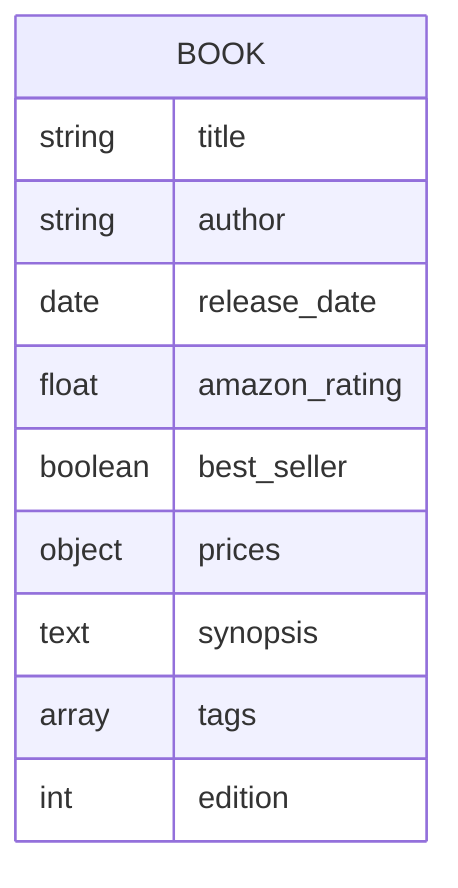
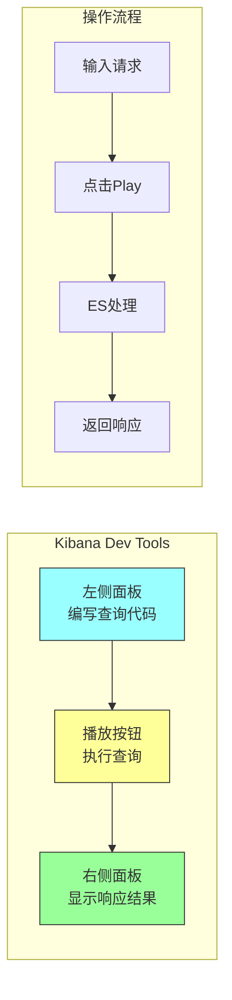
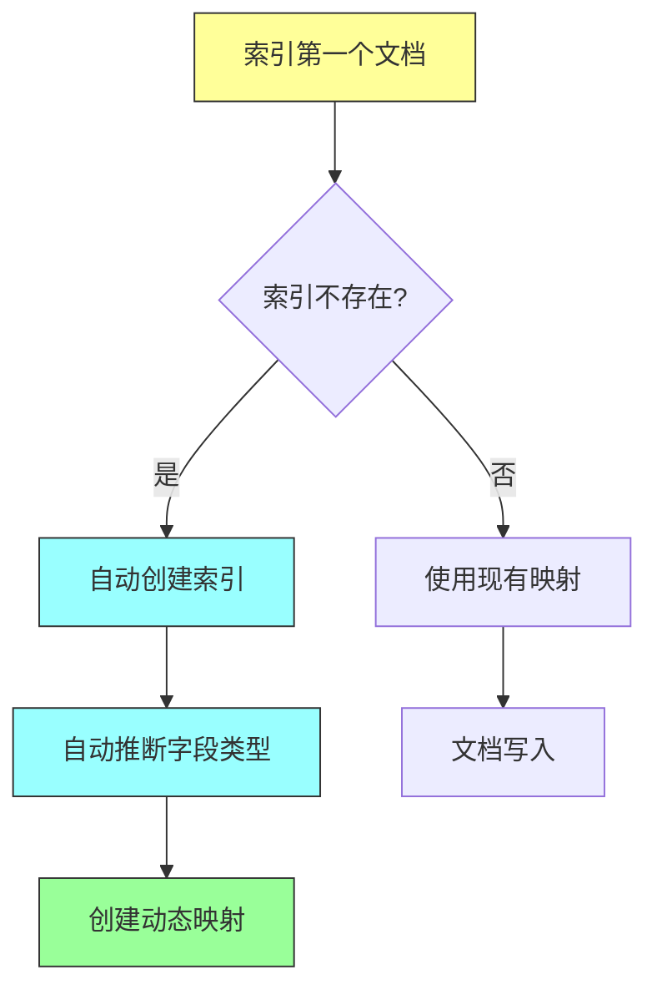
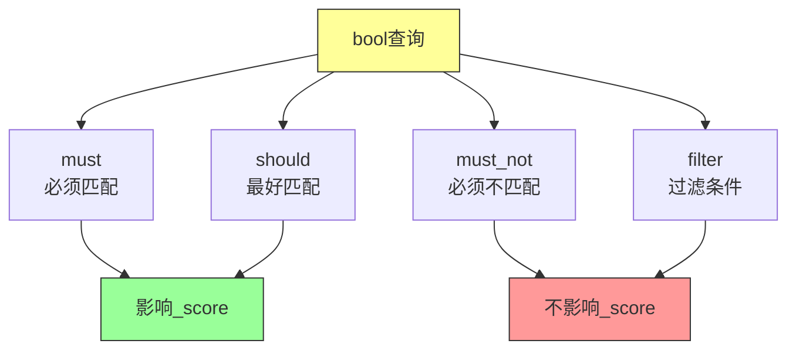
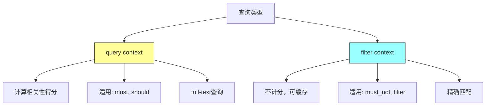
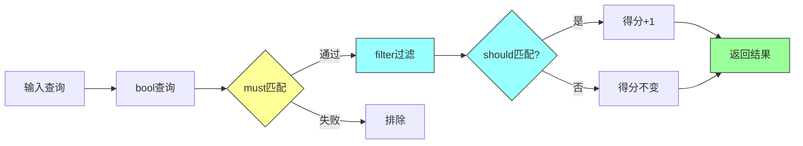
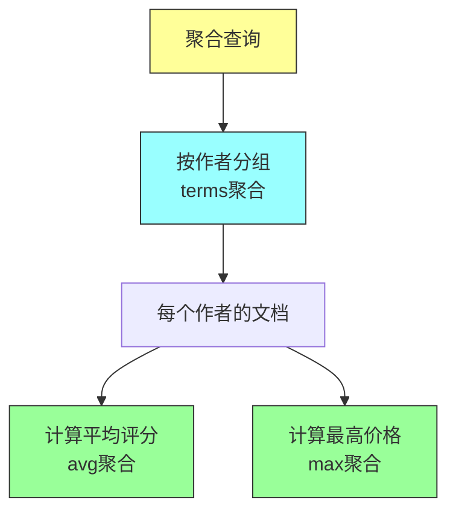

# 《Elasticsearch in Action》第二章：入门指南

## 一、本章概述

### 1.1 本章简介

本章是 Elasticsearch 的实践入门章节，通过构建一个在线书店的搜索功能，带领读者完成从环境准备到实际操作的完整流程。本章的核心目标是让读者在最短时间内体验 Elasticsearch 的核心功能，包括：

- **数据索引**（Indexing）：将文档数据写入 Elasticsearch
- **数据检索**（Retrieving）：根据 ID 或条件获取文档
- **全文搜索**（Full-Text Search）：对非结构化文本进行搜索
- **结构化查询**（Term-Level Query）：对数值、日期等结构化数据进行精确匹配
- **复合查询**（Compound Query）：组合多种查询条件构建复杂搜索逻辑
- **聚合分析**（Aggregations）：对数据进行统计分析和分组

通过本章的学习，你将能够使用 Kibana 的 Dev Tools 工具与 Elasticsearch 进行交互，并理解 RESTful API 的基本用法。

### 1.2 学习目标

完成本章学习后，你将能够：

1. 使用 Kibana Dev Tools 执行基本的 CRUD 操作
2. 理解 Elasticsearch 的文档结构和 JSON 表示方式
3. 掌握全文搜索查询（match、match_phrase、multi_match）
4. 掌握结构化查询（term、range）
5. 熟练使用 bool 查询组合多个条件
6. 理解评分机制（_score）和相关性排序
7. 执行基本的聚合分析（metric 和 bucket 聚合）

### 1.3 示例场景：在线书店

本章使用一个虚构的在线书店作为示例场景，包含以下实体数据模型：

| 字段 | 说明 | 示例值 |
|-----|------|-------|
| title | 书名 | "Effective Java" |
| author | 作者 | "Joshua Bloch" |
| release_date | 发布日期 | "2001-06-01" |
| amazon_rating | 亚马逊评分 | 4.7 |
| best_seller | 畅销书标识 | true |
| prices | 多币种价格 | {usd: 9.95, gbp: 7.95, eur: 8.95} |
| synopsis | 简介 | "A must-have book for Java programmers" |
| tags | 标签 | ["programming", "java"] |
| edition | 版次 | 3 |



---

## 二、数据索引入门

### 2.1 Elasticsearch 文档 API 基础

Elasticsearch 提供了一套基于 RESTful API 的文档操作接口，所有操作都通过 HTTP 请求完成，请求体使用 JSON 格式。

**API URL 结构**：

```
<HTTP_METHOD> <SERVER:PORT>/<INDEX_NAME>/_doc/<DOC_ID>
{
    # Request Body
}
```

**URL 各部分说明**：

| 组成部分 | 说明 | 示例 |
|---------|------|------|
| HTTP_METHOD | HTTP 方法（PUT/POST/GET/DELETE） | PUT |
| SERVER:PORT | Elasticsearch 服务器地址 | localhost:9200 |
| INDEX_NAME | 索引名称 | books |
| _doc | 文档 API 端点 | _doc |
| DOC_ID | 文档唯一标识 | 1 |

**与 cURL 的对比**：

```bash
# cURL 命令（完整格式）
curl -XPUT "http://localhost:9200/books/_doc/1" \
  -H 'Content-Type: application/json' \
  -d '{
    "title": "Effective Java",
    "author": "Joshua Bloch"
  }'

# Kibana Dev Tools（简化格式）
PUT books/_doc/1
{
  "title": "Effective Java",
  "author": "Joshua Bloch"
}
```

Kibana 自动处理服务器地址和 HTTP 头信息，使代码更加简洁。

### 2.2 索引第一个文档

使用 Kibana Dev Tools 索引第一本书籍文档：

```json
PUT books/_doc/1
{
  "title": "Effective Java",
  "author": "Joshua Bloch",
  "release_date": "2001-06-01",
  "amazon_rating": 4.7,
  "best_seller": true,
  "prices": {
    "usd": 9.95,
    "gbp": 7.95,
    "eur": 8.95
  }
}
```

**响应结果**：

```json
{
  "_index": "books",
  "_type": "_doc",
  "_id": "1",
  "_version": 1,
  "result": "created",
  "_shards": {
    "total": 2,
    "successful": 1,
    "failed": 0
  },
  "_seq_no": 0,
  "_primary_term": 1
}
```

**响应字段说明**：

| 字段 | 说明 |
|-----|------|
| _index | 文档所在的索引名称 |
| _id | 文档的唯一标识符 |
| _version | 文档版本号，每次更新递增 |
| result | 操作结果（created/updated/deleted） |
| _shards.total | 分片总数（主分片 + 副本） |
| _shards.successful | 成功操作的分片数 |
| _shards.failed | 失败的分片数 |

### 2.3 批量索引更多文档

```json
PUT books/_doc/2
{
  "title": "Core Java Volume I - Fundamentals",
  "author": "Cay S. Horstmann",
  "release_date": "2018-08-27",
  "amazon_rating": 4.8,
  "best_seller": true,
  "prices": {
    "usd": 19.95,
    "gbp": 17.95,
    "eur": 18.95
  }
}

PUT books/_doc/3
{
  "title": "Java: A Beginner's Guide",
  "author": "Herbert Schildt",
  "release_date": "2018-11-20",
  "amazon_rating": 4.2,
  "best_seller": true,
  "prices": {
    "usd": 19.99,
    "gbp": 19.99,
    "eur": 19.99
  }
}
```

### 2.4 Kibana Dev Tools 界面说明



### 2.5 动态映射特性

注意：我们在索引文档前**没有创建任何映射（Schema）**。Elasticsearch 会自动从第一篇文档中推断字段类型，这就是所谓的「Schema-less」特性。



**自动推断的字段类型**：

| JSON 数据类型 | Elasticsearch 推断类型 |
|--------------|----------------------|
| 字符串（文本） | text + keyword |
| 字符串（日期格式） | date |
| 数字（整数） | long |
| 数字（浮点） | float/double |
| 布尔值 | boolean |
| 对象 | object |

---

## 三、数据检索

### 3.1 统计文档数量

使用 `_count` API 统计索引中的文档数量：

```json
GET books/_count
```

**响应**：

```json
{
  "count": 3,
  "_shards": {
    "total": 1,
    "successful": 1,
    "skipped": 0,
    "failed": 0
  }
}
```

**多索引统计**：

```json
# 统计多个索引
GET books,other_index/_count

# 统计所有索引
GET _count
```

### 3.2 根据 ID 获取单个文档

使用 `_doc` 端点根据 ID 获取文档：

```json
GET books/_doc/1
```

**响应**：

```json
{
  "_index": "books",
  "_type": "_doc",
  "_id": "1",
  "_version": 1,
  "_seq_no": 0,
  "_primary_term": 1,
  "found": true,
  "_source": {
    "title": "Effective Java",
    "author": "Joshua Bloch",
    "release_date": "2001-06-01",
    "amazon_rating": 4.7,
    "best_seller": true,
    "prices": {
      "usd": 9.95,
      "gbp": 7.95,
      "eur": 8.95
    }
  }
}
```

**仅获取源文档**：

```json
GET books/_source/1
```

**文档不存在的情况**：

```json
GET books/_doc/999

# 响应
{
  "_index": "books",
  "_type": "_doc",
  "_id": "999",
  "found": false
}
```

### 3.3 批量获取多个文档

使用 `_mget` API 批量获取多个文档：

```json
GET _mget
{
  "docs": [
    {
      "_index": "books",
      "_id": "1"
    },
    {
      "_index": "books",
      "_id": "2"
    }
  ]
}
```

**简化写法（同一索引）**：

```json
GET books/_mget
{
  "ids": ["1", "2", "3"]
}
```

### 3.4 获取所有文档

使用 `_search` API 获取所有文档：

```json
GET books/_search
{
  "query": {
    "match_all": {}
  }
}
```

**简化写法**：

```json
GET books/_search
```

---

## 四、全文搜索

### 4.1 match 查询基础

`match` 查询用于对文本字段进行全文搜索，会对查询词进行分词处理：

```json
GET books/_search
{
  "query": {
    "match": {
      "author": "Joshua"
    }
  }
}
```

**响应示例**：

```json
{
  "hits": {
    "total": {"value": 2, "relation": "eq"},
    "max_score": 1.0417082,
    "hits": [
      {
        "_index": "books",
        "_id": "1",
        "_score": 1.0417082,
        "_source": {
          "title": "Effective Java",
          "author": "Joshua Bloch"
        }
      }
    ]
  }
}
```

**响应字段说明**：

| 字段 | 说明 |
|-----|------|
| hits.total | 匹配文档总数 |
| hits.max_score | 最高相关性得分 |
| hits.hits | 匹配的文档数组 |
| _score | 单个文档的相关性得分 |

### 4.2 使用 AND 运算符

默认 `match` 使用 OR 逻辑，搜索 "Effective Java" 会返回包含任一词的结果。使用 `operator` 参数改为 AND 逻辑：

```json
GET books/_search
{
  "query": {
    "match": {
      "title": {
        "query": "Effective Java",
        "operator": "and"
      }
    }
  }
}
```

**对比说明**：

```mermaid
graph LR
    subgraph OR 逻辑
        A[输入: "Effective Java"] --> B[分词: Effective, Java]
        B --> C[匹配: 包含Effective 或 包含Java]
    end

    subgraph AND 逻辑
        D[输入: "Effective Java"] --> E[分词: Effective, Java]
        E --> F[匹配: 包含Effective 且 包含Java]
    end

    style A fill:#ff9,stroke:#333
    style D fill:#9ff,stroke:#333
```

### 4.3 批量索引更多数据

为了进行更丰富的搜索测试，使用 `_bulk` API 批量索引更多文档：

```json
POST _bulk
{"index":{"_index":"books","_id":"4"}}
{"title":"Java: The Complete Reference","author":"Herbert Schildt","release_date":"2019-04-23","amazon_rating":4.3,"best_seller":false,"prices":{"usd":25.99,"gbp":22.99,"eur":23.99},"synopsis":"Comprehensive guide to Java programming","tags":["java","programming"],"edition":11}
{"index":{"_index":"books","_id":"5"}}
{"title":"Head First Design Patterns","author":"Eric Freeman","release_date":"2020-11-10","amazon_rating":4.6,"best_seller":true,"prices":{"usd":34.99,"gbp":29.99,"eur":31.99},"synopsis":"A brain-friendly guide to design patterns","tags":["java","design-patterns","oop"],"edition":2}
{"index":{"_index":"books","_id":"6"}}
{"title":"Clean Code","author":"Robert C. Martin","release_date":"2008-08-01","amazon_rating":4.9,"best_seller":true,"prices":{"usd":32.99,"gbp":27.99,"eur":29.99},"synopsis":"A handbook of agile software craftsmanship","tags":["programming","best-practices"],"edition":1}
{"index":{"_index":"books","_id":"7"}}
{"title":"The Pragmatic Programmer","author":"Andrew Hunt","release_date":"2019-01-01","amazon_rating":4.8,"best_seller":true,"prices":{"usd":36.99,"gbp":31.99,"eur":33.99},"synopsis":"From journeyman to master","tags":["programming","career"],"edition":2}
{"index":{"_index":"books","_id":"8"}}
{"title":"Introduction to Algorithms","author":"Thomas H. Cormen","release_date":"2009-07-31","amazon_rating":4.7,"best_seller":false,"prices":{"usd":82.99,"gbp":69.99,"eur":74.99},"synopsis":"The comprehensive bible of algorithms","tags":["algorithms","computer-science"],"edition":3}
```

### 4.4 多字段搜索

使用 `multi_match` 查询同时搜索多个字段：

```json
GET books/_search
{
  "query": {
    "multi_match": {
      "query": "Java",
      "fields": ["title", "synopsis"]
    }
  }
}
```

**字段权重提升**：

```json
GET books/_search
{
  "query": {
    "multi_match": {
      "query": "Java programming",
      "fields": ["title^3", "synopsis"]
    }
  }
}
```

- `title^3` 表示 title 字段的权重提升 3 倍
- 匹配的文档在 title 字段出现搜索词时得分更高

```mermaid
graph TD
    A[搜索: "Java programming"] --> B[多字段匹配]
    B --> C["title字段 × 3"]
    B --> D["synopsis字段 × 1"]
    C --> E[计算最终得分]
    D --> E

    style A fill:#ff9,stroke:#333
    style B fill:#9ff,stroke:#333
    style E fill:#9f9,stroke:#333
```

### 4.5 短语搜索

使用 `match_phrase` 查询精确匹配短语（词序和间距都重要）：

```json
GET books/_search
{
  "query": {
    "match_phrase": {
      "synopsis": "must-have book for every Java programmer"
    }
  }
}
```

**包含结果**：

```json
{
  "hits": {
    "hits": [
      {
        "_score": 7.300332,
        "_source": {
          "title": "Effective Java",
          "synopsis": "A must-have book for every Java programmer and Java aspirant"
        }
      }
    ]
  }
}
```

### 4.6 模糊匹配（处理拼写错误）

使用 `fuzziness` 参数处理拼写错误，基于 Levenshtein 编辑距离算法：

```json
GET books/_search
{
  "query": {
    "match": {
      "tags": {
        "query": "Komputer",
        "fuzziness": 1
      }
    }
  }
}
```

- `fuzziness: 1` 表示允许 1 个字符的编辑距离
- "Komputer" 会匹配 "Computer"（替换 K → C）

**fuzziness 取值**：

| 值 | 说明 |
|---|------|
| 0 | 不允许模糊匹配 |
| 1 | 允许 1 个字符差异 |
| 2 | 允许 2 个字符差异 |
| AUTO | 自动根据词长决定 |

### 4.7 高亮显示

使用 `highlight` 参数在搜索结果中高亮匹配的文本片段：

```json
GET books/_search
{
  "query": {
    "match_phrase": {
      "synopsis": "must-have book"
    }
  },
  "highlight": {
    "fields": {
      "synopsis": {}
    }
  }
}
```

**响应示例**：

```json
{
  "hits": {
    "hits": [
      {
        "_source": {
          "title": "Effective Java",
          "synopsis": "A must-have book for every Java programmer"
        },
        "highlight": {
          "synopsis": ["A <em>must-have</em> <em>book</em> for every Java programmer"]
        }
      }
    ]
  }
}
```

---

## 五、结构化查询

### 5.1 term 查询

`term` 查询用于精确匹配结构化数据（数值、日期、布尔值等），**不对查询词进行分词**：

```json
GET books/_search
{
  "query": {
    "term": {
      "best_seller": true
    }
  }
}
```

```json
GET books/_search
{
  "query": {
    "term": {
      "edition": 3
    }
  }
}
```

**注意**：对于 text 类型字段，term 查询可能无法匹配，因为文本被分析（分词）了。


### 5.2 range 查询

`range` 查询用于数值、日期的范围匹配：

```json
GET books/_search
{
  "query": {
    "range": {
      "amazon_rating": {
        "gte": 4.5,
        "lte": 5.0
      }
    }
  }
}
```

**操作符说明**：

| 操作符 | 说明 | 示例 |
|-------|------|------|
| gt | 大于 | {"gt": 4.5} |
| gte | 大于等于 | {"gte": 4.5} |
| lt | 小于 | {"lt": 5.0} |
| lte | 小于等于 | {"lte": 5.0} |

**日期范围查询**：

```json
GET books/_search
{
  "query": {
    "range": {
      "release_date": {
        "gte": "2018-01-01",
        "lte": "2020-12-31"
      }
    }
  }
}
```

### 5.3 terms 查询

`terms` 查询匹配多个精确值中的一个：

```json
GET books/_search
{
  "query": {
    "terms": {
      "author": ["Joshua Bloch", "Herbert Schildt"]
    }
  }
}
```

---

## 六、复合查询

### 6.1 bool 查询概述

`bool` 查询是 Elasticsearch 最强大的复合查询，通过组合多个子查询构建复杂的搜索逻辑。它包含四个核心子句：

| 子句 | 说明 | 是否影响得分 |
|-----|------|-------------|
| must | 必须匹配 | 是 |
| should | 最好匹配 | 是 |
| must_not | 必须不匹配 | 否（filter context） |
| filter | 必须匹配 | 否（filter context） |

**bool 查询结构**：

```json
GET books/_search
{
  "query": {
    "bool": {
      "must": [],
      "should": [],
      "must_not": [],
      "filter": []
    }
  }
}
```



### 6.2 must 子句

`must` 子句要求所有条件必须匹配，匹配的文档得分会增加：

```json
GET books/_search
{
  "query": {
    "bool": {
      "must": [
        { "match": { "author": "Joshua Bloch" } },
        { "match": { "title": "Java" } }
      ]
    }
  }
}
```

### 6.3 must_not 子句

`must_not` 子句排除匹配条件的文档：

```json
GET books/_search
{
  "query": {
    "bool": {
      "must": [
        { "match": { "author": "Joshua" } }
      ],
      "must_not": [
        { "range": { "amazon_rating": { "lt": 4.7 } } }
      ]
    }
  }
}
```

### 6.4 should 子句

`should` 子句是「最好匹配」，不强制要求，但匹配时得分会增加：

```json
GET books/_search
{
  "query": {
    "bool": {
      "must": [
        { "match": { "author": "Joshua" } }
      ],
      "should": [
        { "term": { "best_seller": true } }
      ]
    }
  }
}
```

**should 的特殊作用**：当 bool 查询中只有 should 子句时，至少有一个 should 必须匹配（除非设置了 minimum_should_match）。

### 6.5 filter 子句

`filter` 子句要求匹配，但**不计算相关性得分**（在 filter context 中执行，可被缓存）：

```json
GET books/_search
{
  "query": {
    "bool": {
      "must": [
        { "match": { "author": "Joshua" } }
      ],
      "filter": [
        { "range": { "release_date": { "gte": "2015-01-01" } } }
      ]
    }
  }
}
```

**query context vs filter context**：



### 6.6 综合示例：复杂搜索条件

查找满足以下所有条件的书籍：
- 作者包含 "Joshua"
- 评分不低于 4.7
- 出版日期在 2015 年之后
- 如果标签包含 "Software" 则得分更高

```json
GET books/_search
{
  "query": {
    "bool": {
      "must": [
        { "match": { "author": "Joshua" } }
      ],
      "must_not": [],
      "should": [
        { "match": { "tags": "Software" } }
      ],
      "filter": [
        { "range": { "amazon_rating": { "gte": 4.7 } } },
        { "range": { "release_date": { "gte": "2015-01-01" } } }
      ]
    }
  }
}
```

**执行流程**：



---

## 七、聚合分析

### 7.1 聚合概述

搜索帮助我们找到匹配的文档，聚合帮助我们对数据进行统计分析。聚合常用于：

- 计算平均值、总和、最大值、最小值
- 按类别分组统计
- 时间序列分析
- 数据分布分析

**聚合类型**：

| 类型 | 说明 |
|-----|------|
| Metric 聚合 | 计算数值统计（avg、sum、min、max、cardinality 等） |
| Bucket 聚合 | 按条件将文档分组（terms、range、histogram 等） |
| Pipeline 聚合 | 对其他聚合结果进行二次计算 |

### 7.2 Metric 聚合

**计算平均评分**：

```json
GET books/_search
{
  "size": 0,
  "aggs": {
    "avg_rating": {
      "avg": {
        "field": "amazon_rating"
      }
    }
  }
}
```

**响应**：

```json
{
  "hits": {
    "total": 8,
    "hits": []
  },
  "aggregations": {
    "avg_rating": {
      "value": 4.625
    }
  }
}
```

**常用 Metric 聚合**：

```json
GET books/_search
{
  "size": 0,
  "aggs": {
    "stats_rating": {
      "stats": {
        "field": "amazon_rating"
      }
    },
    "max_price": {
      "max": {
        "field": "prices.usd"
      }
    },
    "min_price": {
      "min": {
        "field": "prices.usd"
      }
    },
    "sum_price": {
      "sum": {
        "field": "prices.usd"
      }
    },
    "unique_authors": {
      "cardinality": {
        "field": "author"
      }
    }
  }
}
```

**stats 聚合返回完整的统计信息**：

```json
{
  "aggregations": {
    "stats_rating": {
      "count": 8,
      "min": 4.2,
      "max": 4.9,
      "avg": 4.625,
      "sum": 37.0
    }
  }
}
```

### 7.3 Bucket 聚合

**按作者分组统计**（terms 聚合）：

```json
GET books/_search
{
  "size": 0,
  "aggs": {
    "books_by_author": {
      "terms": {
        "field": "author",
        "size": 10
      }
    }
  }
}
```

**响应**：

```json
{
  "aggregations": {
    "books_by_author": {
      "buckets": [
        {
          "key": "Herbert Schildt",
          "doc_count": 2
        },
        {
          "key": "Joshua Bloch",
          "doc_count": 1
        }
      ]
    }
  }
}
```

**按评分区间分组**（range 聚合）：

```json
GET books/_search
{
  "size": 0,
  "aggs": {
    "rating_ranges": {
      "range": {
        "field": "amazon_rating",
        "ranges": [
          { "key": "low", "to": 4.3 },
          { "key": "medium", "from": 4.3, "to": 4.7 },
          { "key": "high", "from": 4.7 }
        ]
      }
    }
  }
}
```

**按评分直方图分组**（histogram 聚合）：

```json
GET books/_search
{
  "size": 0,
  "aggs": {
    "rating_histogram": {
      "histogram": {
        "field": "amazon_rating",
        "interval": 0.5
      }
    }
  }
}
```

### 7.4 嵌套聚合

聚合可以嵌套使用，先分组再计算：

```json
GET books/_search
{
  "size": 0,
  "aggs": {
    "by_author": {
      "terms": {
        "field": "author",
        "size": 10
      },
      "aggs": {
        "avg_rating": {
          "avg": {
            "field": "amazon_rating"
          }
        },
        "max_price": {
          "max": {
            "field": "prices.usd"
          }
        }
      }
    }
  }
}
```

**响应结构**：

```json
{
  "aggregations": {
    "by_author": {
      "buckets": [
        {
          "key": "Herbert Schildt",
          "doc_count": 2,
          "avg_rating": { "value": 4.25 },
          "max_price": { "value": 25.99 }
        }
      ]
    }
  }
}
```



---

## 八、Java 客户端示例

### 8.1 环境配置

**Maven 依赖**：

```xml
<dependencies>
    <dependency>
        <groupId>co.elastic.clients</groupId>
        <artifactId>elasticsearch-java</artifactId>
        <version>8.11.0</version>
    </dependency>
    <dependency>
        <groupId>com.fasterxml.jackson.core</groupId>
        <artifactId>jackson-databind</artifactId>
        <version>2.15.3</version>
    </dependency>
</dependencies>
```

### 8.2 客户端初始化

```java
import co.elastic.clients.elasticsearch.ElasticsearchClient;
import co.elastic.clients.json.jackson.JacksonJsonpMapper;
import co.elastic.clients.transport.ElasticsearchTransport;
import co.elastic.clients.transport.rest_client.RestClientTransport;
import org.apache.http.HttpHost;
import org.elasticsearch.client.RestClient;

public class BookSearchClient {

    private final ElasticsearchClient client;

    public BookSearchClient() {
        RestClient restClient = RestClient.builder(
            new HttpHost("localhost", 9200, "http")
        ).build();

        ElasticsearchTransport transport = new RestClientTransport(
            restClient, new JacksonJsonpMapper()
        );

        this.client = new ElasticsearchClient(transport);
    }

    public ElasticsearchClient getClient() {
        return client;
    }
}
```

### 8.3 索引文档

```java
import co.elastic.clients.elasticsearch.core.IndexRequest;
import co.elastic.clients.elasticsearch.core.IndexResponse;

import java.io.IOException;
import java.util.Map;

public class BookIndexExample {

    private final BookSearchClient searchClient;

    public BookIndexExample() {
        this.searchClient = new BookSearchClient();
    }

    /**
     * 索引单个文档
     */
    public void indexBook(String id, String title, String author,
                          double rating, boolean bestSeller) throws IOException {
        Map<String, Object> book = Map.of(
            "title", title,
            "author", author,
            "amazon_rating", rating,
            "best_seller", bestSeller,
            "indexed_at", java.time.Instant.now().toString()
        );

        IndexRequest<Map<String, Object>> request = IndexRequest.of(i -> i
            .index("books")
            .id(id)
            .document(book)
        );

        IndexResponse response = searchClient.getClient().index(request);
        System.out.println("文档已索引: " + response.result());
    }

    /**
     * 批量索引文档
     */
    public void bulkIndexBooks() throws IOException {
        String bulkData = """
            {"index":{"_id":"10"}}
            {"title":"Spring in Action","author":"Craig Walls","amazon_rating":4.6,"best_seller":true}
            {"index":{"_id":"11"}}
            {"title":"Hibernate in Action","author":"Gavin King","amazon_rating":4.5,"best_seller":false}
            {"index":{"_id":"12"}}
            {"title":"Microservices Patterns","author":"Chris Richardson","amazon_rating":4.7,"best_seller":true}
            """;

        // 使用 REST API 直接执行 bulk 操作
        searchClient.getClient().lowLevel().performRequest(
            org.elasticsearch.client.Request.POST,
            "/books/_bulk",
            Map.of("refresh", "true"),
            org.elasticsearch.client.RequestBody.create(bulkData,
                org.elasticsearch.common.xcontent.XContentType.JSON)
        );

        System.out.println("批量索引完成");
    }
}
```

### 8.4 全文搜索示例

```java
import co.elastic.clients.elasticsearch.core.SearchRequest;
import co.elastic.clients.elasticsearch.core.SearchResponse;
import co.elastic.clients.elasticsearch.core.search.Hit;

import java.io.IOException;
import java.util.Map;

public class BookSearchExample {

    private final BookSearchClient searchClient;

    public BookSearchExample() {
        this.searchClient = new BookSearchClient();
    }

    /**
     * 简单匹配查询
     */
    public void searchByAuthor(String author) throws IOException {
        SearchResponse<Map> response = searchClient.getClient().search(s -> s
                .index("books")
                .query(q -> q
                    .match(m -> m
                        .field("author")
                        .query(author)
                    )
                )
                .size(10),
            Map.class
        );

        System.out.println("找到 " + response.hits().total().value() + " 本书");
        for (Hit<Map> hit : response.hits().hits()) {
            System.out.printf("  - %s (得分: %.2f)%n",
                hit.source().get("title"), hit.score());
        }
    }

    /**
     * 多字段搜索
     */
    public void multiFieldSearch(String keyword) throws IOException {
        SearchResponse<Map> response = searchClient.getClient().search(s -> s
                .index("books")
                .query(q -> q
                    .multiMatch(mm -> mm
                        .query(keyword)
                        .fields("title^3", "author", "synopsis")
                        .fuzziness("AUTO")
                    )
                )
                .size(10),
            Map.class
        );

        System.out.println("多字段搜索 '" + keyword + "' 结果：");
        for (Hit<Map> hit : response.hits().hits()) {
            System.out.printf("  - %s by %s (得分: %.2f)%n",
                hit.source().get("title"),
                hit.source().get("author"),
                hit.score());
        }
    }

    /**
     * 短语搜索
     */
    public void phraseSearch(String phrase) throws IOException {
        SearchResponse<Map> response = searchClient.getClient().search(s -> s
                .index("books")
                .query(q -> q
                    .matchPhrase(mp -> mp
                        .field("synopsis")
                        .query(phrase)
                        .slop(2)  // 允许2个词的差距
                    )
                )
                .size(5),
            Map.class
        );

        System.out.println("短语搜索 '" + phrase + "' 结果：");
        for (Hit<Map> hit : response.hits().hits()) {
            System.out.printf("  - %s (得分: %.2f)%n",
                hit.source().get("title"), hit.score());
        }
    }
}
```

### 8.5 复合查询示例

```java
import co.elastic.clients.elasticsearch.core.SearchResponse;
import co.elastic.clients.elasticsearch.core.search.Hit;
import co.elastic.clients.elasticsearch._types.query_dsl.BoolQuery;
import co.elastic.clients.elasticsearch._types.query_dsl.Query;

import java.io.IOException;
import java.util.Map;

public class BookBoolQueryExample {

    private final BookSearchClient searchClient;

    public BookBoolQueryExample() {
        this.searchClient = new BookSearchClient();
    }

    /**
     * 复杂 bool 查询
     * 条件：
     * - must: 作者包含 "Joshua" 或 "Robert"
     * - filter: 评分 >= 4.5
     * - should: 畅销书
     */
    public void complexBoolQuery() throws IOException {
        SearchResponse<Map> response = searchClient.getClient().search(s -> s
                .index("books")
                .query(q -> q
                    .bool(b -> b
                        .must(m -> m
                            .bool(bb -> bb
                                .should(sh -> sh.match(m -> m.field("author").query("Joshua")))
                                .should(sh -> sh.match(m -> m.field("author").query("Robert")))
                                .minimumShouldMatch("1")
                            )
                        )
                        .filter(f -> f.range(r -> r
                            .field("amazon_rating")
                            .gte(co.elastic.clients.json.JsonData.of(4.5))
                        ))
                        .should(sh -> sh.term(t -> t
                            .field("best_seller")
                            .value(true)
                        ))
                    )
                )
                .size(10),
            Map.class
        );

        System.out.println("复杂查询结果：");
        for (Hit<Map> hit : response.hits().hits()) {
            System.out.printf("  - %s by %s (评分: %.1f, 得分: %.2f)%n",
                hit.source().get("title"),
                hit.source().get("author"),
                hit.source().get("amazon_rating"),
                hit.score());
        }
    }

    /**
     * 带排序的查询
     */
    public void searchWithSorting() throws IOException {
        SearchResponse<Map> response = searchClient.getClient().search(s -> s
                .index("books")
                .query(q -> q.matchAll(m -> m))
                .sort(so -> so
                    .field(f -> f.field("amazon_rating").order(
                        co.elastic.clients._types.SortOrder.Desc))
                )
                .sort(so -> so
                    .field(f -> f.field("prices.usd").order(
                        co.elastic.clients._types.SortOrder.Asc))
                )
                .size(5),
            Map.class
        );

        System.out.println("按评分降序、价格升序排序：");
        for (Hit<Map> hit : response.hits().hits()) {
            System.out.printf("  - %s (评分: %.1f, 价格: $%.2f)%n",
                hit.source().get("title"),
                hit.source().get("amazon_rating"),
                hit.source().get("prices.usd"));
        }
    }
}
```

### 8.6 聚合示例

```java
import co.elastic.clients.elasticsearch.core.SearchResponse;
import co.elastic.clients.elasticsearch._types.aggregations.Aggregation;
import co.elastic.clients.elasticsearch._types.aggregations.StringTermsBucket;

import java.io.IOException;
import java.util.List;
import java.util.Map;

public class BookAggregationExample {

    private final BookSearchClient searchClient;

    public BookAggregationExample() {
        this.searchClient = new BookSearchClient();
    }

    /**
     * 计算平均评分
     */
    public void calculateAverageRating() throws IOException {
        SearchResponse<Map> response = searchClient.getClient().search(s -> s
                .index("books")
                .size(0)
                .aggregations("avg_rating", a -> a
                    .avg(av -> av.field("amazon_rating"))
                ),
            Map.class
        );

        double avgRating = response.aggregations()
            .get("avg_rating")
            .avg()
            .value();

        System.out.printf("平均评分: %.2f%n", avgRating);
    }

    /**
     * 按作者分组统计
     */
    public void groupByAuthor() throws IOException {
        SearchResponse<Map> response = searchClient.getClient().search(s -> s
                .index("books")
                .size(0)
                .aggregations("by_author", a -> a
                    .terms(t -> t.field("author").size(10))
                    .aggregations("avg_rating", aa -> aa
                        .avg(av -> av.field("amazon_rating"))
                    )
                ),
            Map.class
        );

        System.out.println("按作者分组统计：");
        response.aggregations()
            .get("by_author")
            .sterms()
            .buckets()
            .array()
            .forEach(bucket -> {
                System.out.printf("  - %s: %d 本书, 平均评分 %.2f%n",
                    bucket.key().stringValue(),
                    bucket.docCount(),
                    bucket.aggregations().get("avg_rating").avg().value());
            });
    }

    /**
     * 评分区间分布
     */
    public void ratingDistribution() throws IOException {
        SearchResponse<Map> response = searchClient.getClient().search(s -> s
                .index("books")
                .size(0)
                .aggregations("rating_ranges", a -> a
                    .range(r -> r
                        .field("amazon_rating")
                        .ranges(
                            rr -> rr.key("高分").from("4.7"),
                            rr -> rr.key("中等").from("4.3").to("4.7"),
                            rr -> rr.key("一般").to("4.3")
                        )
                    )
                ),
            Map.class
        );

        System.out.println("评分分布：");
        response.aggregations()
            .get("rating_ranges")
            .range()
            .buckets()
            .array()
            .forEach(bucket -> {
                System.out.printf("  - %s: %d 本书%n",
                    bucket.key(), bucket.docCount());
            });
    }
}
```

---

## 九、cURL 命令速查

### 9.1 基础操作

```bash
# 索引文档
curl -XPUT "localhost:9200/books/_doc/1" \
  -H 'Content-Type: application/json' \
  -d '{"title":"Effective Java","author":"Joshua Bloch"}'

# 获取文档
curl -XGET "localhost:9200/books/_doc/1"

# 统计文档数量
curl -XGET "localhost:9200/books/_count"

# 删除文档
curl -XDELETE "localhost:9200/books/_doc/1"
```

### 9.2 搜索操作

```bash
# 搜索所有文档
curl -XGET "localhost:9200/books/_search"

# match 查询
curl -XGET "localhost:9200/books/_search" \
  -H 'Content-Type: application/json' \
  -d '{"query":{"match":{"author":"Joshua"}}}'

# match_phrase 查询
curl -XGET "localhost:9200/books/_search" \
  -H 'Content-Type: application/json' \
  -d '{"query":{"match_phrase":{"synopsis":"Java programmer"}}}'

# multi_match 查询
curl -XGET "localhost:9200/books/_search" \
  -H 'Content-Type: application/json' \
  -d '{"query":{"multi_match":{"query":"Java","fields":["title","synopsis"]}}}'

# fuzzy 查询
curl -XGET "localhost:9200/books/_search" \
  -H 'Content-Type: application/json' \
  -d '{"query":{"match":{"tags":{"query":"Komputer","fuzziness":1}}}}'

# range 查询
curl -XGET "localhost:9200/books/_search" \
  -H 'Content-Type: application/json' \
  -d '{"query":{"range":{"amazon_rating":{"gte":4.5}}}}'

# bool 查询
curl -XGET "localhost:9200/books/_search" \
  -H 'Content-Type: application/json' \
  -d '{
    "query":{
      "bool":{
        "must":[{"match":{"author":"Joshua"}}],
        "filter":[{"range":{"amazon_rating":{"gte":4.5}}}]
      }
    }
  }'
```

### 9.3 聚合操作

```bash
# 平均值聚合
curl -XGET "localhost:9200/books/_search" \
  -H 'Content-Type: application/json' \
  -d '{"size":0,"aggs":{"avg_rating":{"avg":{"field":"amazon_rating"}}}}'

# 分组聚合
curl -XGET "localhost:9200/books/_search" \
  -H 'Content-Type: application/json' \
  -d '{"size":0,"aggs":{"by_author":{"terms":{"field":"author"}}}}'

# 嵌套聚合
curl -XGET "localhost:9200/books/_search" \
  -H 'Content-Type: application/json' \
  -d '{
    "size":0,
    "aggs":{
      "by_author":{
        "terms":{"field":"author"},
        "aggs":{"avg_rating":{"avg":{"field":"amazon_rating"}}}
      }
    }
  }'
```

---

## 十、最佳实践

### 10.1 查询优化建议

**使用 filter context 优化频繁查询**：

```json
# 不推荐：频繁执行的查询使用 must
GET books/_search
{
  "query": {
    "bool": {
      "must": [
        { "term": { "status": "published" } }
      ]
    }
  }
}

# 推荐：使用 filter（可缓存，不计分）
GET books/_search
{
  "query": {
    "bool": {
      "filter": [
        { "term": { "status": "published" } }
      ]
    }
  }
}
```

**限制返回字段**：

```json
# 只返回需要的字段
GET books/_search
{
  "_source": ["title", "author", "amazon_rating"],
  "query": { "match_all": {} }
}
```

**使用 search_after 进行深度分页**：

```json
GET books/_search
{
  "query": { "match_all": {} },
  "sort": [
    { "amazon_rating": "desc" },
    { "_id": "asc" }
  ],
  "size": 10,
  "search_after": [4.9, "8"]
}
```

### 10.2 索引设计建议

**为搜索字段选择正确的类型**：

| 场景 | 字段类型 | 示例 |
|-----|---------|------|
| 需要全文搜索 | text | title, synopsis |
| 需要精确匹配/聚合/排序 | keyword | author, category |
| 需要范围查询 | 数值/日期类型 | price, release_date |

```json
PUT books
{
  "mappings": {
    "properties": {
      "title": { "type": "text" },
      "author": { "type": "keyword" },
      "amazon_rating": { "type": "float" },
      "release_date": { "type": "date" },
      "best_seller": { "type": "boolean" }
    }
  }
}
```

### 10.3 bulk 操作建议

```java
// 批量操作时控制批次大小
int batchSize = 1000;
List<Document> documents = getDocuments();

// 分批处理
for (int i = 0; i < documents.size(); i += batchSize) {
    List<Document> batch = documents.subList(i, Math.min(i + batchSize, documents.size()));
    bulkIndex(batch);
}
```

---

## 十一、常见问题

### Q1：match 查询为什么搜不到结果？

可能原因：
1. **字段类型不匹配**：text 字段被分析，如果用 term 查询精确匹配 "Java" 失败，可能是因为实际存储的是 "java"（小写）
2. **分词问题**：搜索词和索引词的分词结果不一致

**解决方案**：检查字段类型，使用 match 查询而非 term 查询

```json
# 检查字段映射
GET books/_mapping

# 使用 match 查询（会分词）
GET books/_search
{
  "query": { "match": { "title": "Effective Java" } }
}
```

### Q2：为什么文档已经索引但搜不到？

可能原因：
1. **refresh 延迟**：默认每秒 refresh，文档可能还未可见
2. **分词器问题**：使用的分词器未正确切分词语

**解决方案**：

```bash
# 手动刷新索引
POST books/_refresh

# 或索引时设置立即可见
PUT books/_doc/1?refresh=true
{"title":"Effective Java"}
```

### Q3：bool 查询中 must 和 filter 有什么区别？

- **must**：计算相关性得分，影响排序
- **filter**：不计算得分，可被缓存，性能更好

```json
GET books/_search
{
  "query": {
    "bool": {
      "must": [
        { "match": { "title": "Java" } }  // 影响得分
      ],
      "filter": [
        { "term": { "best_seller": true } }  // 不影响得分
      ]
    }
  }
}
```

### Q4：聚合结果不准确？

可能原因：
1. **字段类型问题**：对 text 字段进行聚合，可能只返回前几个词
2. **分片偏差**：在低数据量时，分片级别聚合可能有误差

**解决方案**：

```json
# 使用 keyword 类型字段进行聚合
PUT books
{
  "mappings": {
    "properties": {
      "category": { "type": "keyword" },  // 正确
      "category_text": { "type": "text" }  // 不推荐用于聚合
    }
  }
}

# 设置 shard_size 减少偏差
GET books/_search
{
  "size": 0,
  "aggs": {
    "categories": {
      "terms": {
        "field": "category",
        "size": 10,
        "shard_size": 20
      }
    }
  }
}
```

### Q5：如何处理关联查询？

Elasticsearch 不擅长复杂关联查询。有两种解决方案：

1. **反范式化设计**：将关联数据冗余存储
2. **应用层关联**：先在 ES 中搜索，再从数据库获取关联数据

```java
// 应用层关联示例
public List<BookWithAuthor> searchBooks(String query) {
    // 1. 从 Elasticsearch 获取匹配的书籍 ID
    List<String> bookIds = esClient.searchBookIds(query);

    // 2. 从数据库获取完整数据
    return database.getBooksWithAuthors(bookIds);
}
```

---

## 十二、本章小结

本章通过构建一个在线书店搜索功能，系统介绍了 Elasticsearch 的核心操作：

1. **数据索引**：使用 RESTful API 索引文档，理解动态映射机制
2. **数据检索**：根据 ID 获取文档，批量获取多个文档
3. **全文搜索**：掌握 match、match_phrase、multi_match、fuzziness 等查询
4. **结构化查询**：使用 term、range 查询精确匹配结构化数据
5. **复合查询**：熟练使用 bool 查询组合 must/should/must_not/filter 子句
6. **聚合分析**：计算统计指标（avg、sum、min、max），按维度分组（terms、range）

下一章将深入探讨 Elasticsearch 的架构设计，包括分布式机制、倒排索引原理、相关性评分算法等核心概念。

---

## 相关资源

- **Elasticsearch 官方文档**：https://www.elastic.co/guide/en/elasticsearch/reference/current/index.html
- **Query DSL 参考**：https://www.elastic.co/guide/en/elasticsearch/reference/current/query-dsl.html
- **Aggregations 参考**：https://www.elastic.co/guide/en/elasticsearch/reference/current/search-aggregations.html
- **Java 客户端文档**：https://www.elastic.co/guide/en/elasticsearch/client/java-api/current/index.html
