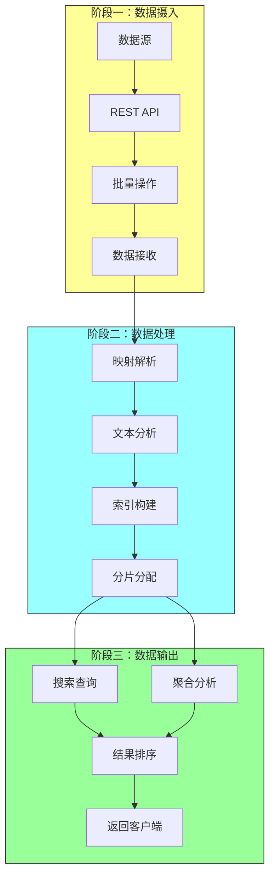
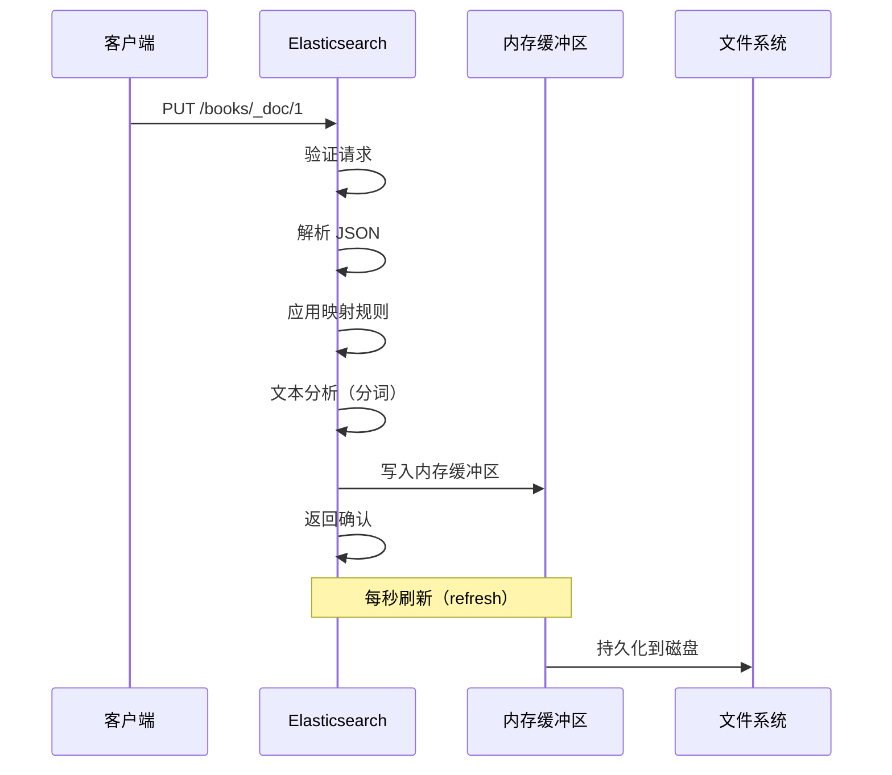
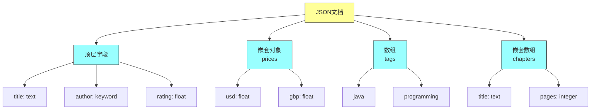
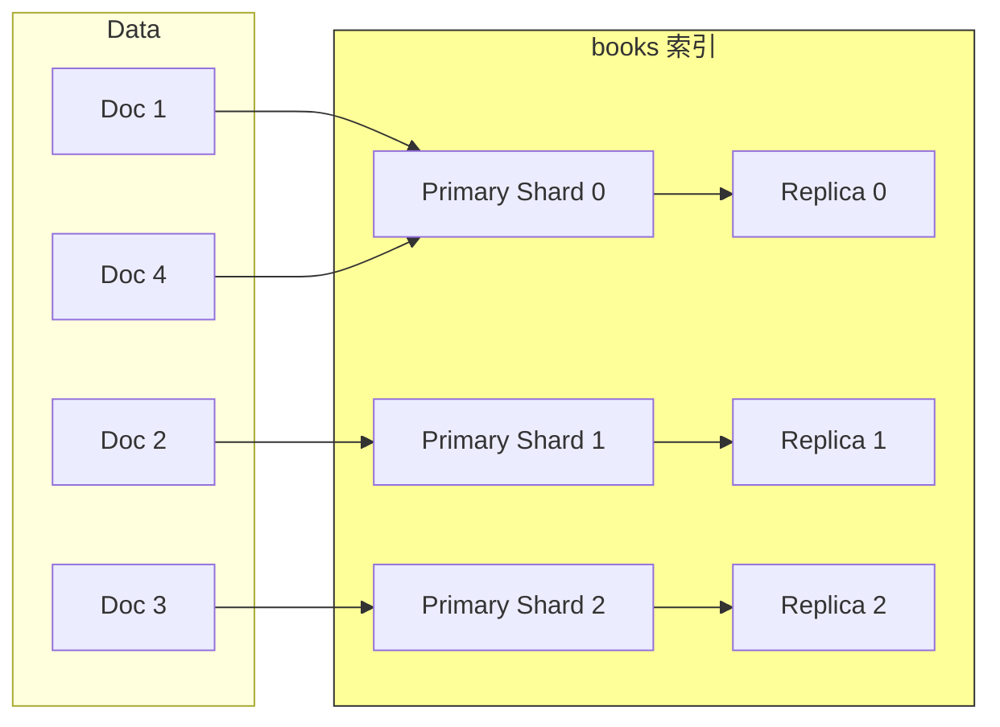
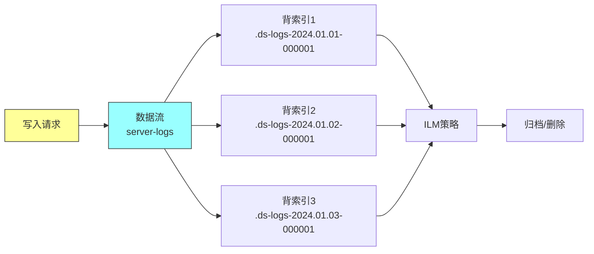
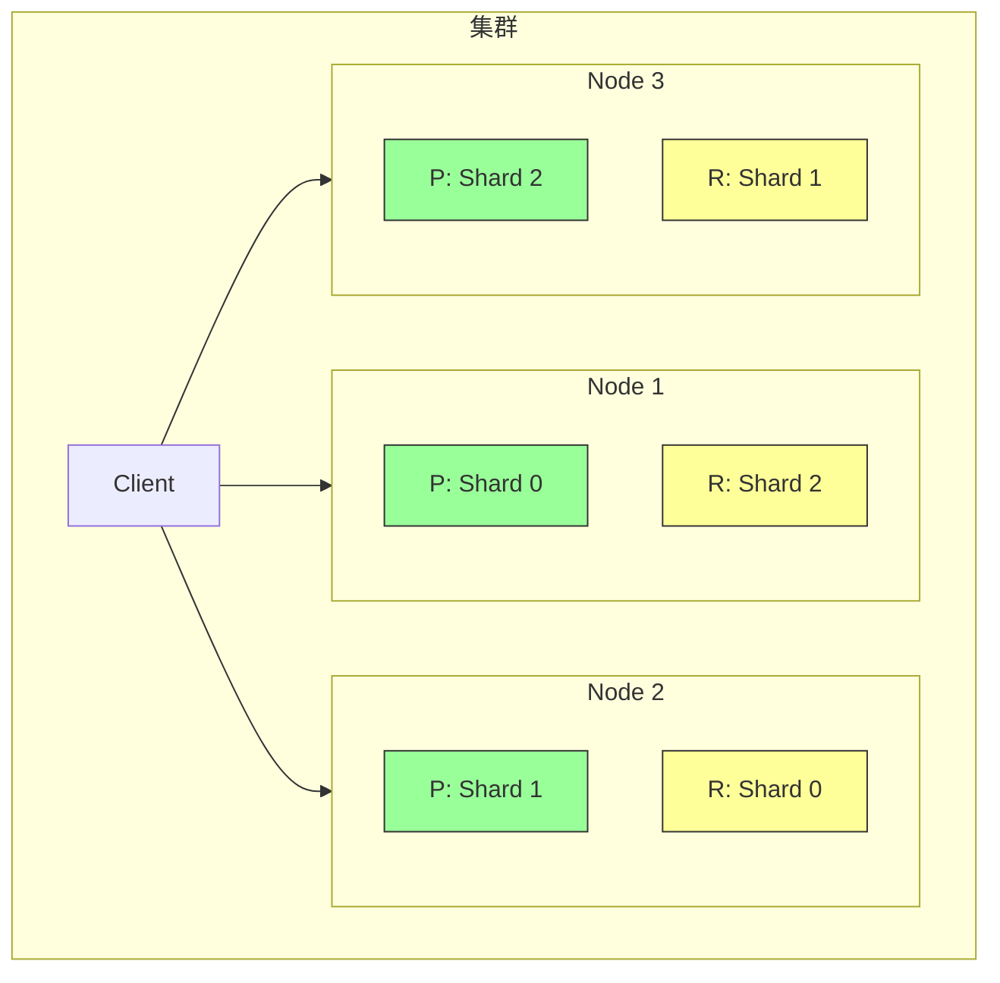
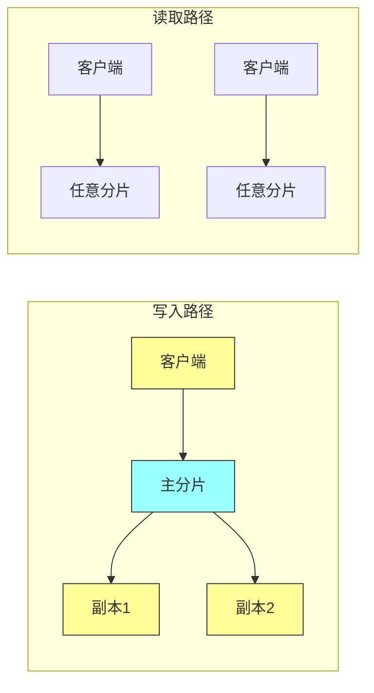
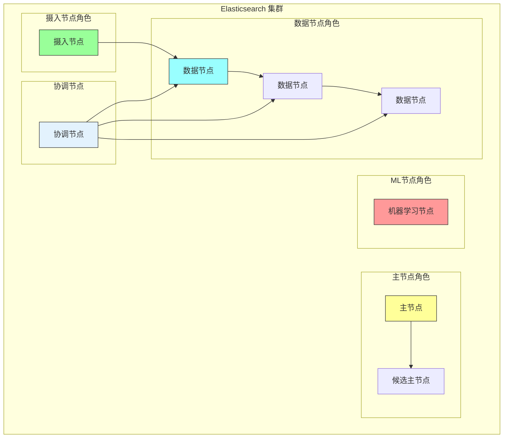
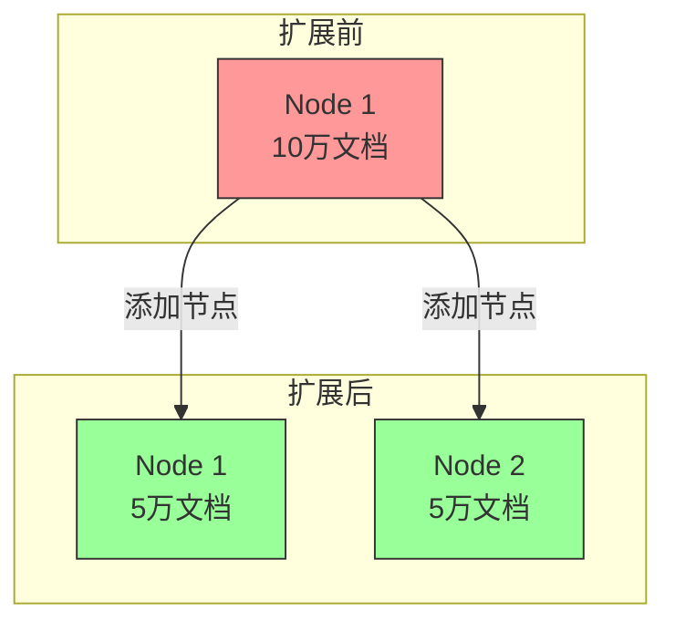
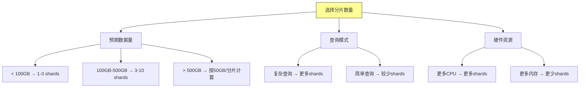

# 《Elasticsearch in Action》第三章：架构原理

## 一、本章概述

### 1.1 本章简介

本章深入探讨 Elasticsearch 的内部架构和核心原理。理解这些底层机制对于高效使用 Elasticsearch 至关重要，特别是在以下场景中：

- **调试搜索结果**：为什么预期结果没有出现？相关性评分如何计算？
- **性能优化**：理解分片策略、缓存机制、查询执行流程
- **故障排查**：集群异常、分片分配问题、数据一致性
- **架构设计**：如何规划索引、分片数量、节点角色

本章将解答以下核心问题：
- Elasticsearch 如何存储和索引文档？
- 倒排索引是什么？为什么它是全文搜索的核心？
- 分片和副本如何工作？路由算法如何确定文档位置？
- 相关性评分算法（BM25）如何计算？
- 如何实现水平扩展？

### 1.2 学习目标

完成本章学习后，你将能够：

1. 描述 Elasticsearch 的整体数据流（摄入、处理、输出）
2. 理解倒排索引的结构和工作原理
3. 掌握分片、副本、节点的职责和协作方式
4. 理解相关性评分算法 BM25
5. 理解路由算法和文档定位机制
6. 做出明智的架构设计决策

---

## 二、高层架构概览

### 2.1 数据流三大阶段

Elasticsearch 的数据处理可以分为三个主要阶段：



### 2.2 数据摄入（Data In）

数据可以通过多种方式进入 Elasticsearch：

| 方式 | 描述 | 适用场景 |
|-----|------|---------|
| REST API | 直接通过 HTTP 调用 | 实时应用、测试 |
| Bulk API | 批量导入大量数据 | 数据迁移、初始化 |
| Logstash | ETL 管道处理 | 日志收集、数据转换 |
| Beats | 轻量级数据采集器 | 指标收集、心跳检测 |
| 客户端 SDK | Java/Python/Go 等客户端 | 应用程序集成 |

**数据摄入流程**：



### 2.3 数据处理（Processing）

数据处理阶段包括以下关键步骤：

**1. 映射解析（Mapping）**
- 根据字段名称和值推断数据类型
- 应用预定义的映射规则

**2. 文本分析（Text Analysis）**
- 分词（Tokenization）：将文本拆分成词条
- 标准化（Normalization）：小写化、词形还原
- 过滤（Filtering）：去除停用词、同义词处理

**3. 索引构建**
- 将处理后的词条存入倒排索引
- 创建必要的元数据和数据结构

**4. 分片分配**
- 根据路由算法确定目标分片
- 写入主分片并复制到副本

### 2.4 数据输出（Data Out）

数据输出主要通过两种方式：

**搜索查询（Search）**
- 解析查询语句
- 执行查询逻辑
- 计算相关性得分
- 返回排序结果

**聚合分析（Aggregation）**
- 按维度分组
- 计算统计指标
- 返回聚合结果

---

## 三、核心构建块

### 3.1 文档（Document）

文档是 Elasticsearch 中的基本数据单元，以 JSON 格式存储：

```json
{
  "title": "Effective Java",
  "author": "Joshua Bloch",
  "release_date": "2001-06-01",
  "amazon_rating": 4.7,
  "best_seller": true,
  "prices": {
    "usd": 9.95,
    "gbp": 7.95,
    "eur": 8.95
  },
  "tags": ["java", "programming", "best-practices"],
  "chapters": [
    {"title": "Creating Objects", "pages": 45},
    {"title": "Methods", "pages": 38}
  ]
}
```

**文档特点**：

| 特性 | 说明 |
|-----|------|
| 自包含 | 整个文档存储在一个索引中，无需 JOIN |
| 层次结构 | 支持嵌套对象和数组 |
| 灵活Schema | 字段可以在运行时动态添加 |
| 版本控制 | 每次更新递增版本号 |
| 元数据 | 系统自动添加 _index、_id、_version 等 |



### 3.2 索引（Index）

索引是存储文档的逻辑容器，相当于关系型数据库中的表：

```json
// 创建索引
PUT /books
{
  "settings": {
    "number_of_shards": 3,
    "number_of_replicas": 1,
    "refresh_interval": "1s"
  },
  "mappings": {
    "properties": {
      "title": { "type": "text" },
      "author": { "type": "keyword" },
      "release_date": { "type": "date" },
      "amazon_rating": { "type": "float" }
    }
  },
  "aliases": {
    "books_alias": {}
  }
}
```

**索引命名规则**：
- 必须小写
- 不能包含 `\`, `/`, `*`, `?`, `"`, `<`, `>`, `|`, `,`, `#`, `:`



### 3.3 数据流（Data Stream）

数据流是处理时序数据的特殊索引类型：

```json
// 创建数据流
PUT /_data_stream/server-logs
{
  "indices": [
    {
      "index_name": ".ds-server-logs-2024.01.01-000001",
      "index_uuid": "abc123"
    }
  ],
  "generation": 1
}
```

**数据流特点**：

| 特性 | 说明 |
|-----|------|
| 自动滚动 | 根据策略自动创建新 backing index |
| 时间分区 | 按时间组织数据，便于生命周期管理 |
| ILM 集成 | 无缝集成索引生命周期管理 |
| 保留策略 | 自动删除过期数据 |



### 3.4 分片（Shard）

分片是索引数据的子集，每个分片是一个独立的 Lucene 索引：

```json
// 分片结构示例
PUT /products
{
  "settings": {
    "number_of_shards": 3,     // 主分片数量
    "number_of_replicas": 1    // 副本数量
  }
}
```

**分片类型**：

| 类型 | 说明 | 特点 |
|-----|------|------|
| 主分片（Primary） | 存储原始数据 | 数量在创建时确定，不可更改 |
| 副本（Replica） | 主分片的副本 | 可动态调整，用于容灾和读扩展 |



**分片设计原则**：

| 建议 | 说明 |
|-----|------|
| 分片大小 | 建议 10GB-50GB |
| 分片数量 | 避免过多或过少，考虑未来增长 |
| 副本数量 | 生产环境至少1个 |

### 3.5 副本（Replica）

副本是主分片的完整副本，提供以下功能：

```json
// 动态调整副本数量
PUT /products/_settings
{
  "number_of_replicas": 2
}
```

**副本的作用**：



| 功能 | 说明 |
|-----|------|
| 高可用 | 节点故障时副本提升为主分片 |
| 读扩展 | 并发读取分散到多个副本 |
| 数据安全 | 防止数据丢失 |

### 3.6 节点（Node）

节点是 Elasticsearch 集群中的单个服务器实例：

```yaml
# elasticsearch.yml 节点配置
node.name: es-node-1
node.roles: [master, data, ingest]
cluster.name: production-cluster
network.host: 0.0.0.0
http.port: 9200
```

**节点角色**：

| 角色 | 说明 | 职责 |
|-----|------|------|
| master | 主节点 | 集群管理、索引创建删除 |
| data | 数据节点 | 存储数据、执行查询 |
| ingest | 摄入节点 | 数据转换、预处理 |
| ml | 机器学习 | 异常检测、预测分析 |
| coordinator | 协调节点 | 请求路由、结果合并 |



### 3.7 集群（Cluster）

集群是一个或多个节点的集合：

```yaml
# elasticsearch.yml 集群配置
cluster.name: production-cluster
cluster.initial_master_nodes: ["es-node-1", "es-node-2", "es-node-3"]
```

**集群状态**：

| 状态 | 说明 | 可能原因 |
|-----|------|---------|
| green | 所有主副分片都可用 | 正常 |
| yellow | 所有主分片可用，部分副本不可用 | 副本不足 |
| red | 部分主分片不可用 | 硬件故障 |

```json
// 集群健康检查
GET /_cluster/health

// 响应
{
  "cluster_name": "production-cluster",
  "status": "green",
  "timed_out": false,
  "number_of_nodes": 3,
  "number_of_data_nodes": 2,
  "active_primary_shards": 10,
  "active_shards": 20,
  "relocating_shards": 0,
  "initializing_shards": 0,
  "unassigned_shards": 0
}
```

---

## 四、倒排索引

### 4.1 什么是倒排索引

倒排索引是全文搜索的核心数据结构，类似书籍的索引部分：

```mermaid
graph LR
    subgraph Original["原始文档"]
        D1["Doc 1: Elasticsearch is awesome"]
        D2["Doc 2: Elasticsearch powers search"]
    end

    subgraph InvertedIndex["倒排索引"]
        T1["elasticsearch"] --> P1["Doc 1", "Doc 2"]
        T2["is"] --> P2["Doc 1"]
        T3["awesome"] --> P3["Doc 1"]
        T4["powers"] --> P4["Doc 2"]
        T5["search"] --> P5["Doc 2"]
    end

    D1 --> T1
    D1 --> T2
    D1 --> T3
    D2 --> T1
    D2 --> T4
    D2 --> T5

    style Original fill:#ff9,stroke:#333
    style InvertedIndex fill:#9ff,stroke:#333
```

**倒排索引 vs 正排索引**：

| 类型 | 结构 | 用途 |
|-----|------|------|
| 正排索引 | Doc → Terms | 获取文档内容 |
| 倒排索引 | Term → Docs | 根据词查找文档 |

### 4.2 倒排索引结构

每个字段的倒排索引包含以下组件：

```json
// 倒排索引结构示例
{
  "terms": {
    "elasticsearch": {
      "docfreq": 100,
      "ttf": 150,
      "postings": {
        "doc_1": {"pos": [0], "freq": 1},
        "doc_2": {"pos": [1], "freq": 1}
      }
    },
    "search": {
      "docfreq": 200,
      "ttf": 300
    }
  },
  "norms": {
    "doc_1": 1.2,
    "doc_2": 1.0
  },
  "doc_values": {
    "amazon_rating": [4.7, 4.8, 4.6]
  }
}
```

**术语说明**：

| 术语 | 全称 | 说明 |
|-----|------|------|
| docfreq | Document Frequency | 包含该词的文档数 |
| ttf | Total Term Frequency | 词在所有文档中的总出现次数 |
| postings | Postings List | 包含该词的文档列表及位置信息 |
| norms | Field Length Norm | 字段长度归一化因子 |

### 4.3 倒排索引构建过程

```mermaid
flowchart TD
    A[原始文档] --> B[文本分析]
    B --> C[分词<br/>Tokenization]
    C --> D[过滤<br/>Filtering]
    D --> E[标准化<br/>Normalization]
    E --> F[词条列表]

    F --> G[构建倒排索引]
    G --> H[存储到磁盘]

    subgraph TextAnalysis["文本分析过程"]
        I["Elasticsearch is Awesome"] --> J[["elasticsearch", "is", "awesome"]]
        J --> K[["elasticsearch", "awesome"]]
        K --> L[["elasticsearch", "awesome"]]
    end

    style A fill:#ff9,stroke:#333
    style G fill:#9ff,stroke:#333
    style H fill:#9f9,stroke:#333
```

### 4.4 倒排索引查询过程

当执行搜索 "Elasticsearch tutorial" 时：

```mermaid
flowchart LR
    A["查询: Elasticsearch tutorial"] --> B[分词]
    B --> C["elasticsearch", "tutorial"]

    C --> D[倒排索引]

    D --> E["elasticsearch → Doc1, Doc3, Doc5"]
    D --> F["tutorial → Doc1, Doc2, Doc7"]

    E --> G[交集]
    F --> G
    G --> H[Doc1]

    style A fill:#ff9,stroke:#333
    style H fill:#9f9,stroke:#333
```

---

## 五、相关性评分

### 5.1 BM25 算法

Elasticsearch 使用 BM25（Okapi Best Match 25）作为默认相关性评分算法：

```json
// 查看相关性评分详情
GET /books/_search
{
  "explain": true,
  "query": {
    "match": { "title": "Java programming" }
  }
}
```

**BM25 公式**：

```
score(D, Q) = Σ IDF(qi) * (f(qi, D) * (k1 + 1)) / (f(qi, D) + k1 * (1 - b + b * |D|/avgdl))

其中：
- qi: 查询词
- f(qi, D): qi 在文档 D 中的词频
- |D|: 文档长度
- avgdl: 平均文档长度
- k1: 词频饱和度参数（默认 1.2）
- b: 长度归一化参数（默认 0.75）
- IDF: 逆文档频率
```

```mermaid
flowchart TD
    A[查询词: "Java"] --> B[计算IDF]
    A --> C[计算词频]
    A --> D[考虑文档长度]

    B --> E[BM25公式]
    C --> E
    D --> E
    E --> F[相关性得分]

    subgraph IDFCalc["IDF计算"]
        F1[总文档数: 1000] --> F2[包含Java的文档: 100]
        F2 --> F3["IDF = log((1000-100+0.5)/(100+0.5))"]
    end

    subgraph TFCalc["词频计算"]
        G1[文档中Java出现次数] --> G2[freq * (k1+1)]
        G2 --> G3[freq + k1 * (1-b+b*len/avglen)]
    end

    style A fill:#ff9,stroke:#333
    style F fill:#9f9,stroke:#333
```

### 5.2 影响评分的因素

| 因素 | 影响 | 说明 |
|-----|------|------|
| 词频（TF） | 正相关 | 词在文档中出现越多得分越高 |
| 逆文档频率（IDF） | 正相关 | 词越稀有得分越高 |
| 字段长度 | 负相关 | 文档越长词的重要性越低 |
| 词权重 | 正相关 | boost 参数可提升字段权重 |

### 5.3 使用 explain 理解评分

```json
GET /books/_explain/1
{
  "query": {
    "match": { "title": "Java" }
  }
}
```

**响应示例**：

```json
{
  "explanation": {
    "value": 1.23,
    "description": "weight(title:java in 0) [BM25], result of",
    "details": [
      {
        "value": 1.23,
        "description": "score(freq=2.0), product of"
      },
      {
        "value": 1.2,
        "description": "idf, computed as log(1 + (N - n + 0.5) / (n + 0.5))"
      },
      {
        "value": 0.5,
        "description": "tf_norm, computed as (freq * (k1 + 1)) / (freq + k1 * (1 - b + b * dl / avgdl))"
      }
    ]
  }
}
```

---

## 六、路由算法

### 6.1 文档路由机制

Elasticsearch 使用公式确定文档应该存储在哪个主分片：

```
shard_num = hash(_routing) % num_primary_shards
```

```java
// 路由计算示例
public class RoutingExample {

    public static void main(String[] args) {
        String documentId = "doc123";
        int numShards = 5;

        // 默认使用 _id 作为路由键
        int shardNumber = calculateShard(documentId, numShards);
        System.out.println("文档将存储在 Shard " + shardNumber);
    }

    public static int calculateShard(String routing, int numShards) {
        int hash = routing.hashCode();
        return Math.abs(hash % numShards);
    }
}
```

### 6.2 自定义路由

```json
// 使用自定义路由
PUT /orders/_doc/1?routing=customer_123
{
  "order_id": "ORD-001",
  "customer_id": "customer_123",
  "total": 99.99
}

// 使用自定义路由查询
GET /orders/_search?routing=customer_123
{
  "query": {
    "term": { "customer_id": "customer_123" }
  }
}
```

```mermaid
flowchart LR
    A[文档<br/>{customer_id: "123", ...}] --> B[路由键<br/>customer_123]
    B --> C[哈希函数]
    C --> D[shard = hash % 5]
    D --> E[Shard 2]

    F[查询请求<br/>routing=123] --> G[计算分片]
    G --> H[Shard 2]
    H --> I[返回结果]

    style A fill:#ff9,stroke:#333
    style E fill:#9ff,stroke:#333
    style H fill:#9f9,stroke:#333
```

### 6.3 路由优化

| 场景 | 建议 |
|-----|------|
| 按租户隔离 | 使用 tenant_id 作为路由键 |
| 按时间分区 | 使用日期作为路由键 |
| 热点问题 | 确保路由值分布均匀 |

---

## 七、扩展策略

### 7.1 垂直扩展（Scale Up）

增加单节点资源：

```yaml
# elasticsearch.yml JVM配置
-Xms4g
-Xmx4g

# 堆内存建议
# - 不超过物理内存的50%
# - 最小堆等于最大堆
```

**优点**：简单、无需改代码
**缺点**：有上限、成本指数增长

### 7.2 水平扩展（Scale Out）

增加节点数量：

```json
// 添加节点后的集群
GET /_cat/nodes?v

// 输出示例
ip         heap.percent ram.percent cpu load_1m load_5m load_15m node.role
192.168.1.1           45         78  12    1.2     0.8     0.5 dimr
192.168.1.2           42         72  10    1.1     0.7     0.4 dimr
192.168.1.3           48         80  11    1.3     0.9     0.6 dimr
```



### 7.3 扩展策略对比

| 维度 | 垂直扩展 | 水平扩展 |
|-----|---------|---------|
| 成本 | 高（硬件升级） | 低（普通服务器） |
| 扩展性 | 有上限 | 几乎无限制 |
| 容错 | 单点故障 | 多节点容灾 |
| 复杂度 | 低 | 高 |

---

## 八、Java 客户端示例

### 8.1 集群管理

```java
import co.elastic.clients.elasticsearch.ElasticsearchClient;
import co.elastic.clients.elasticsearch.cluster.*;
import co.elastic.clients.elasticsearch.cluster.HealthResponse;
import co.elastic.clients.json.jackson.JacksonJsonpMapper;
import co.elastic.clients.transport.ElasticsearchTransport;
import co.elastic.clients.transport.rest_client.RestClientTransport;
import org.apache.http.HttpHost;
import org.elasticsearch.client.RestClient;

import java.io.IOException;
import java.util.List;

public class ClusterManagementExample {

    private final ElasticsearchClient client;

    public ClusterManagementExample() {
        RestClient restClient = RestClient.builder(
            new HttpHost("localhost", 9200, "http")
        ).build();

        ElasticsearchTransport transport = new RestClientTransport(
            restClient, new JacksonJsonpMapper()
        );

        this.client = new ElasticsearchTransport.create(transport).elasticsearch();
    }

    /**
     * 获取集群健康状态
     */
    public void getClusterHealth() throws IOException {
        HealthResponse response = client.cluster().health();

        System.out.println("集群状态: " + response.status());
        System.out.println("节点数量: " + response.numberOfNodes());
        System.out.println("数据节点: " + response.numberOfDataNodes());
        System.out.println("主分片数: " + response.activePrimaryShards());
        System.out.println("总分片数: " + response.activeShards());
    }

    /**
     * 获取节点信息
     */
    public void getNodesInfo() throws IOException {
        NodesInfoResponse response = client.nodes().info(n -> n
            .all(true)
        );

        response.nodes().forEach(node -> {
            System.out.println("节点: " + node.name());
            System.out.println("  角色: " + node.roles());
            System.out.println("  堆内存: " + node.heap().usedPercent() + "%");
            System.out.println("  CPU: " + node.cpu().percent() + "%");
        });
    }

    /**
     * 查看分片分配情况
     */
    public void getShardAllocation() throws IOException {
        AllocationExplainResponse response = client.cluster().allocationExplain(a -> a
            .includeYesDecisions(true)
        );

        System.out.println("分片: " + response.shard().index());
        System.out.println("分片号: " + response.shard().shard());
        System.out.println("当前节点: " + response.shard().currentNode());
        System.out.println("决策: " + response.decisions());
    }

    /**
     * 创建索引（指定分片数）
     */
    public void createIndex(String indexName, int shards, int replicas) throws IOException {
        client.indices().create(c -> c
            .index(indexName)
            .settings(s -> s
                .numberOfShards(String.valueOf(shards))
                .numberOfReplicas(String.valueOf(replicas))
                .refreshInterval(t -> t.time("1s"))
            )
            .mappings(m -> m
                .properties("title", p -> p.text(t -> t))
                .properties("author", p -> p.keyword(k -> k))
                .properties("content", p -> p.text(t -> t))
                .properties("created_at", p -> p.date(d -> d))
            )
        );

        System.out.println("索引 " + indexName + " 创建成功");
    }

    /**
     * 索引别名管理
     */
    public void manageAliases() throws IOException {
        String indexName = "books";
        String aliasName = "books_latest";

        // 添加别名
        client.indices().updateAliases(a -> a
            .actions(
                co.elastic.clients.elasticsearch._types.aliases.Action.of(action -> action
                    .add(add -> add.index(indexName).alias(aliasName))
                )
            )
        );

        // 查询别名
        co.elastic.clients.elasticsearch.indices.ExistsAliasResponse exists =
            client.indices().existsAlias(e -> e.name(aliasName));

        System.out.println("别名存在: " + exists.value());
    }
}
```

### 8.2 倒排索引与评分分析

```java
import co.elastic.clients.elasticsearch.core.ExplainRequest;
import co.elastic.clients.elasticsearch.core.ExplainResponse;
import co.elastic.clients.elasticsearch.core.SearchRequest;
import co.elastic.clients.elasticsearch.core.SearchResponse;
import co.elastic.clients.elasticsearch.core.search.Hit;
import co.elastic.clients.elasticsearch.core.search.ExplanationDetail;

import java.io.IOException;
import java.util.Map;

public class RelevancyExample {

    private final ElasticsearchClient client;

    public RelevancyExample() {
        // 初始化客户端...
    }

    /**
     * 使用 explain 查看评分详情
     */
    public void explainScore(String indexName, String documentId, String query) throws IOException {
        ExplainResponse response = client.explain(e -> e
            .index(indexName)
            .id(documentId)
            .query(q -> q
                .match(m -> m
                    .field("title")
                    .query(query)
                )
            )
        );

        if (response.explanation() != null) {
            printExplanation(response.explanation(), 0);
        }
    }

    private void printExplanation(ExplanationDetail explanation, int depth) {
        String indent = "  ".repeat(depth);
        System.out.printf("%s%.2f: %s%n",
            indent,
            explanation.value(),
            explanation.description());

        if (explanation.details() != null) {
            explanation.details().forEach(detail ->
                printExplanation(detail, depth + 1)
            );
        }
    }

    /**
     * 搜索并显示得分
     */
    public void searchWithScores(String indexName, String query) throws IOException {
        SearchResponse<Map> response = client.search(s -> s
                .index(indexName)
                .query(q -> q
                    .match(m -> m
                        .field("title")
                        .query(query)
                    )
                )
                .size(10)
                .explain(true),
            Map.class
        );

        System.out.println("\n搜索结果（按相关性得分排序）：");
        for (Hit<Map> hit : response.hits().hits()) {
            System.out.printf("  得分: %.4f | 标题: %s%n",
                hit.score(),
                hit.source().get("title"));
        }
    }

    /**
     * 使用 function_score 自定义评分
     */
    public void customScoreQuery() throws IOException {
        SearchResponse<Map> response = client.search(s -> s
                .index("books")
                .query(q -> q
                    .functionScore(fs -> fs
                        .query(inner -> inner
                            .match(m -> m.field("title").query("Java"))
                        )
                        .functions(
                            f -> f
                                .fieldValueFactor(fvf -> fvf
                                    .field("amazon_rating")
                                    .factor(1.2)
                                    .modifier(
 co.elastic.clients.elasticsearch._types.query_dsl.FieldValueFactorModifier.Sqrt)
                                    .missing(1.0)
                                )
                        )
                        .scoreMode("sum")
                        .boostMode("multiply")
                    )
                )
                .size(10),
            Map.class
        );

        System.out.println("function_score 结果：");
        for (Hit<Map> hit : response.hits().hits()) {
            System.out.printf("  得分: %.2f | 评分: %.1f | 标题: %s%n",
                hit.score(),
                hit.source().get("amazon_rating"),
                hit.source().get("title"));
        }
    }
}
```

### 8.3 路由与分片操作

```java
import co.elastic.clients.elasticsearch.ElasticsearchClient;
import co.elastic.clients.elasticsearch._types.RefreshState;
import co.elastic.clients.elasticsearch.core.*;
import co.elastic.clients.elasticsearch.indices.*;
import co.elastic.clients.transport.endpoints.BooleanResponse;

import java.io.IOException;
import java.util.Map;

public class ShardRoutingExample {

    private final ElasticsearchClient client;

    public ShardRoutingExample() {
        // 初始化客户端...
    }

    /**
     * 索引文档时使用自定义路由
     */
    public void indexWithRouting(String indexName, String documentId,
                                  String routingValue, Map<String, Object> doc) throws IOException {
        IndexResponse response = client.index(i -> i
            .index(indexName)
            .id(documentId)
            .routing(routingValue)  // 自定义路由
            .document(doc)
        );

        System.out.println("文档已索引到分片: " + response.shards().total());
    }

    /**
     * 根据路由查询
     */
    public void searchWithRouting(String indexName, String routing, String query) throws IOException {
        SearchResponse<Map> response = client.search(s -> s
                .index(indexName)
                .routing(routing)  // 指定路由
                .query(q -> q
                    .match(m -> m
                        .field("content")
                        .query(query)
                    )
                )
                .size(5),
            Map.class
        );

        System.out.println("找到 " + response.hits().total().value() + " 个结果");
    }

    /**
     * 查看索引分片信息
     */
    public void getShardInfo(String indexName) throws IOException {
        IndicesStatsResponse response = client.indices().stats(s -> s
            .index(indexName)
            .level("shards")
        );

        response.all().primaries().shards().forEach(shard -> {
            System.out.println("分片: " + shard.id());
            System.out.println("  角色: " + shard.shardRouting().state());
            System.out.println("  文档数: " + shard.docs().count());
            System.out.println("  存储大小: " + shard.store().sizeInBytes() / 1024 + " KB");
        });
    }

    /**
     * 强制刷新索引
     */
    public void forceRefresh(String indexName) throws IOException {
        BooleanResponse response = client.indices().refresh(r -> r.index(indexName));
        System.out.println("索引已刷新");
    }

    /**
     * 打开/关闭索引
     */
    public void openCloseIndex(String indexName, boolean open) throws IOException {
        if (open) {
            client.indices().open(o -> o.index(indexName));
            System.out.println("索引已打开");
        } else {
            client.indices().close(c -> c.index(indexName));
            System.out.println("索引已关闭");
        }
    }

    /**
     * 删除索引
     */
    public void deleteIndex(String indexName) throws IOException {
        BooleanResponse response = client.indices().delete(d -> d.index(indexName));
        System.out.println("索引已删除: " + response.value());
    }
}
```

---

## 九、cURL 命令速查

### 9.1 集群管理

```bash
# 集群健康
curl -XGET "localhost:9200/_cluster/health?pretty"

# 集群状态
curl -XGET "localhost:9200/_cluster/state?pretty"

# 节点统计
curl -XGET "localhost:9200/_nodes/stats?pretty"

# 查看分片
curl -XGET "localhost:9200/_cat/shards?v"
```

### 9.2 索引管理

```bash
# 创建索引
curl -XPUT "localhost:9200/books" \
  -H 'Content-Type: application/json' \
  -d '{
    "settings": {
      "number_of_shards": 3,
      "number_of_replicas": 1
    }
  }'

# 查看索引
curl -XGET "localhost:9200/books/_mapping?pretty"

# 删除索引
curl -XDELETE "localhost:9200/books"
```

### 9.3 评分分析

```bash
# 开启 explain
curl -XGET "localhost:9200/books/_explain/1" \
  -H 'Content-Type: application/json' \
  -d '{
    "query": {
      "match": { "title": "Java" }
    }
  }'
```

### 9.4 路由操作

```bash
# 使用路由索引
curl -XPUT "localhost:9200/orders/_doc/1?routing=customer_123" \
  -H 'Content-Type: application/json' \
  -d '{"customer_id": "customer_123", "total": 99.99}'

# 使用路由查询
curl -XGET "localhost:9200/orders/_search?routing=customer_123" \
  -H 'Content-Type: application/json' \
  -d '{"query": {"match_all": {}}}'
```

---

## 十、最佳实践

### 10.1 分片规划

| 场景 | 建议 |
|-----|------|
| 小数据量 | 1-3 个分片 |
| 中等数据量 | 3-10 个分片 |
| 大数据量 | 分片大小控制在 10GB-50GB |
| 时间序列 | 按时间创建索引，按周期滚动 |

### 10.2 节点配置

```yaml
# 数据节点配置
node.data: true
node.master: false
node.ingest: false

# 主节点配置（专用）
node.data: false
node.master: true
node.ingest: false
node.master: true

# 协调节点配置
node.data: false
node.master: false
node.ingest: false
```

### 10.3 内存配置

```bash
# JVM 选项
-Xms4g          # 最小堆
-Xmx4g          # 最大堆

# 堆内存原则
# 1. 不超过物理内存的50%
# 2. 最小堆等于最大堆
# 3. 预留足够内存给文件系统缓存
```

---

## 十一、常见问题

### Q1：集群变成 yellow 状态怎么办？

Yellow 状态表示主分片正常但副本不足：

```bash
# 查看未分配的分片
curl -XGET "localhost:9200/_cat/shards?h=index,shard,prirep,state,unassigned.reason"

# 常见原因：
# 1. 节点磁盘空间不足
# 2. 节点离线
# 3. 副本设置问题

# 解决方案：
# 1. 增加节点
# 2. 清理磁盘空间
# 3. 调整副本数
```

### Q2：如何选择分片数量？

考虑以下因素：



### Q3：倒排索引太大怎么办？

```json
// 使用 force_merge 减少段数量
POST /books/_forcemerge

// 压缩索引
PUT /books/_settings
{
  "index.codec": "best_compression"
}
```

### Q4：如何优化相关性？

```json
// 1. 调整字段权重
{
  "query": {
    "multi_match": {
      "query": "Java programming",
      "fields": ["title^3", "description^2", "tags"]
    }
  }
}

// 2. 使用 function_score
{
  "query": {
    "function_score": {
      "query": {"match": {"content": "Java"}},
      "functions": [
        {"field_value_factor": {"field": "rating", "factor": 1.2}}
      ]
    }
  }
}
```

---

## 十二、本章小结

本章深入探讨了 Elasticsearch 的架构原理：

1. **数据流**：理解数据从摄入到输出的完整流程
2. **核心构建块**：文档、索引、数据流、分片、副本、节点、集群
3. **倒排索引**：全文搜索的核心数据结构
4. **相关性评分**：BM25 算法原理和影响因素
5. **路由算法**：文档定位机制和自定义路由
6. **扩展策略**：垂直扩展和水平扩展

理解这些底层原理对于：
- 优化查询性能
- 排查搜索问题
- 设计高效的索引策略
- 规划集群容量

下一章将深入探讨 **映射（Mapping）**，学习如何精确定义字段类型和分析器。

---

## 相关资源

- **Elasticsearch 官方文档**：https://www.elastic.co/guide/en/elasticsearch/reference/current/index.html
- **BM25 算法详解**：https://en.wikipedia.org/wiki/Okapi_BM25
- **分片配置指南**：https://www.elastic.co/guide/en/elasticsearch/reference/current/scalability.html
- **集群配置最佳实践**：https://www.elastic.co/guide/en/elasticsearch/reference/current/setup-configuration.html
