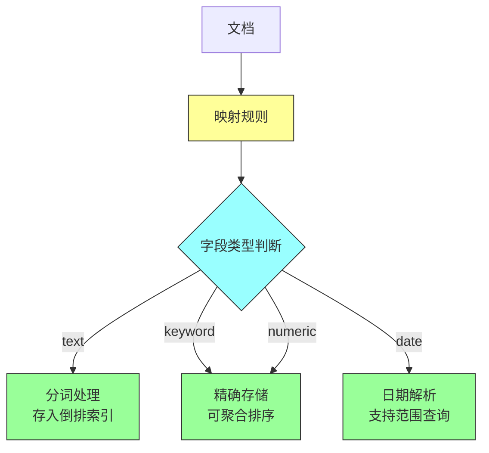
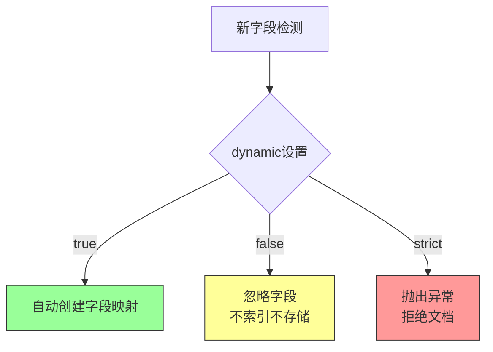
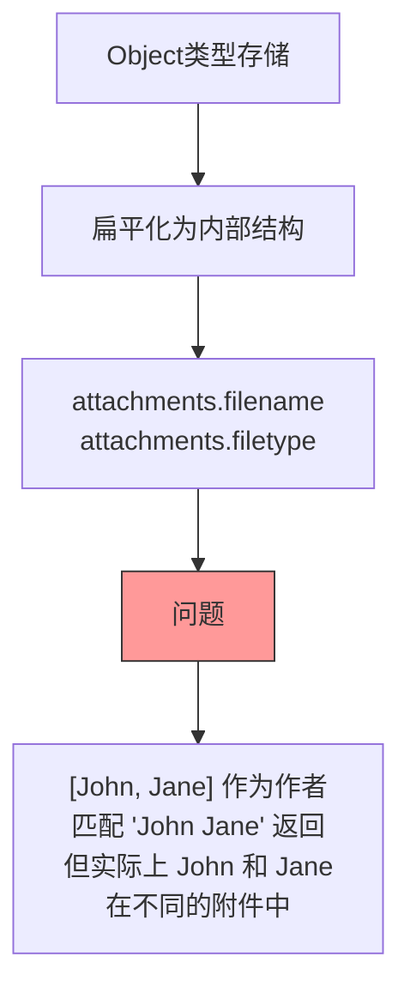
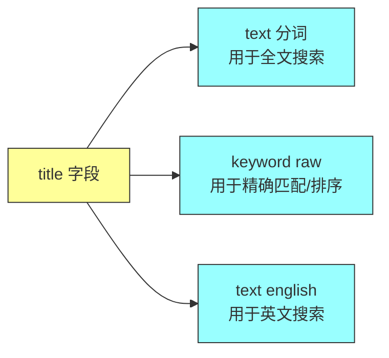
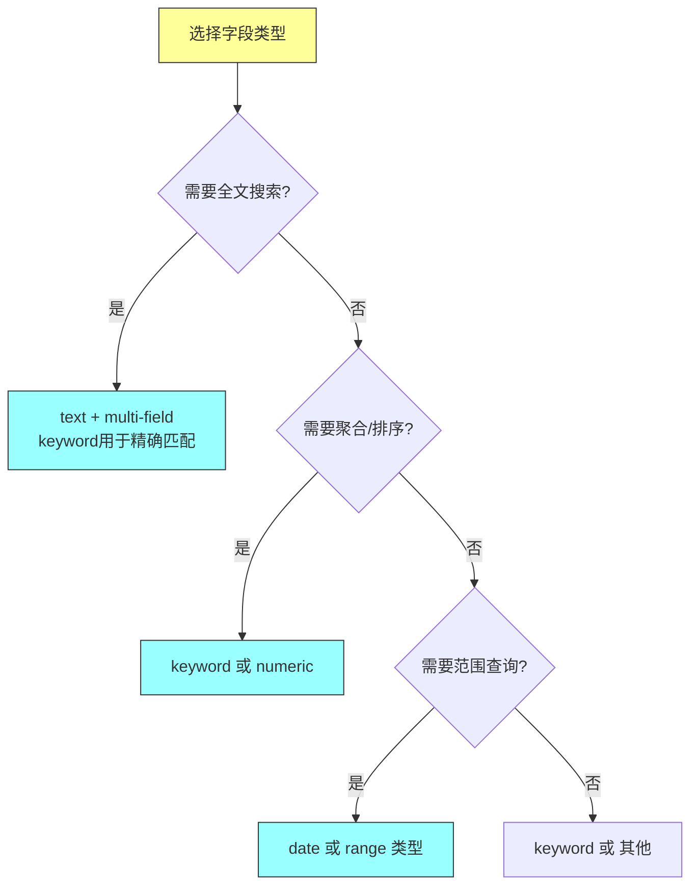

# 《Elasticsearch in Action》第四章：映射（Mapping）

## 一、本章概述

### 1.1 本章简介

映射（Mapping）是 Elasticsearch 中定义索引Schema的核心机制，它告诉引擎如何处理索引中的每个字段。正确的映射设计是实现准确、高效搜索的基础。

本章将深入探讨：

- **映射概述**：什么是映射，为什么需要映射
- **动态映射**：Elasticsearch 如何自动推断字段类型
- **显式映射**：手动定义精确的字段映射
- **核心数据类型**：text、keyword、date、numeric、boolean、range、IP
- **高级数据类型**：geo_point、object、nested、flattened、join
- **多字段（Multi-Fields）**：单一字段的多种表示方式
- **映射参数**：coerce、doc_values、norms、index 等

### 1.2 学习目标

完成本章学习后，你将能够：

1. 理解映射的作用和重要性
2. 区分动态映射和显式映射的使用场景
3. 正确选择字段的数据类型
4. 使用多字段实现灵活的查询需求
5. 处理复杂的数据结构（嵌套对象、父子关系）
6. 优化映射参数以提升性能和存储效率

---

## 二、映射概述

### 2.1 什么是映射

映射是定义索引Schema的过程，它指定了每个字段的数据类型和处理方式：

```json
// 映射示例
PUT /movies
{
  "mappings": {
    "properties": {
      "title": { "type": "text" },
      "release_date": { "type": "date" },
      "rating": { "type": "float" },
      "genre": { "type": "keyword" }
    }
  }
}
```

**映射的核心作用**：



### 2.2 映射的组成

每个索引的映射包含三个部分：

| 组成部分 | 说明 |
|---------|------|
| properties | 字段定义，核心部分 |
| dynamic | 动态映射策略 |
| _meta | 自定义元数据 |

```json
PUT /books
{
  "mappings": {
    "dynamic": "strict",
    "properties": {
      "title": { "type": "text" },
      "author": { "type": "keyword" }
    }
  },
  "_meta": {
    "description": "书籍索引",
    "version": "1.0"
  }
}
```

### 2.3 查看索引映射

```json
// 查看完整映射
GET /movies/_mapping

// 查看特定字段映射
GET /movies/_mapping/field/title

// 查看多个索引映射
GET /movies,books/_mapping
```

---

## 三、动态映射

### 3.1 动态映射机制

Elasticsearch 在索引第一个文档时自动创建映射，称为动态映射：

```json
// 索引文档，无需预先创建映射
PUT /movies/_doc/1
{
  "title": "The Godfather",
  "director": "Francis Ford Coppola",
  "release_year": "1972-03-24",
  "rating": 9.2,
  "genre": ["Crime", "Drama"]
}
```

Elasticsearch 自动推断类型：

| JSON 值类型 | Elasticsearch 推断类型 |
|------------|---------------------|
| 字符串（文本） | text + keyword（multi-field） |
| 字符串（日期格式） | date |
| 整数 | long |
| 浮点数 | float |
| 布尔值 | boolean |
| 对象 | object |
| 数组 | 根据元素类型推断 |

```json
// 自动创建的映射
{
  "movies": {
    "mappings": {
      "properties": {
        "title": {
          "type": "text",
          "fields": {
            "keyword": {
              "type": "keyword",
              "ignore_above": 256
            }
          }
        },
        "director": {
          "type": "text",
          "fields": {
            "keyword": {
              "type": "keyword",
              "ignore_above": 256
            }
          }
        },
        "release_year": {
          "type": "date"
        },
        "rating": {
          "type": "float"
        },
        "genre": {
          "type": "keyword"
        }
      }
    }
  }
}
```

### 3.2 动态映射策略

使用 `dynamic` 参数控制新字段的处理方式：

| 值 | 行为 |
|---|------|
| true | 默认，自动添加新字段 |
| false | 忽略新字段，不索引 |
| strict | 遇到新字段抛出异常 |

```json
PUT /dynamic_strict_index
{
  "mappings": {
    "dynamic": "strict",
    "properties": {
      "title": { "type": "text" }
    }
  }
}

// 以下请求会失败，因为 unknown_field 不允许
PUT /dynamic_strict_index/_doc/1
{
  "title": "Test Movie",
  "unknown_field": "value"
}

// 响应
{
  "error": {
    "type": "strict_dynamic_mapping_exception",
    "reason": "mapping set to strict, cannot introduce field [unknown_field]"
  }
}
```



### 3.3 动态模板

使用动态模板为特定模式的字段自动应用映射：

```json
PUT /dynamic_template_index
{
  "mappings": {
    "dynamic_templates": [
      {
        "strings_as_keywords": {
          "match_mapping_type": "string",
          "mapping": {
            "type": "keyword"
          }
        }
      },
      {
        "longs_as_integers": {
          "match": "*_count",
          "mapping": {
            "type": "integer"
          }
        }
      },
      {
        "no_doc_values": {
          "match": "no_dv_*",
          "mapping": {
            "doc_values": false
          }
        }
      }
    ]
  }
}
```

**动态模板参数**：

| 参数 | 说明 |
|-----|------|
| match_mapping_type | 匹配 JSON 类型（string、long、double 等） |
| match | 匹配字段名（支持通配符） |
| unmatch | 排除匹配的字段 |
| path_match | 匹配完整路径 |
| path_unmatch | 排除路径 |

---

## 四、显式映射

### 4.1 创建显式映射

在创建索引时手动定义完整映射：

```json
PUT /movies_explicit
{
  "settings": {
    "number_of_shards": 1,
    "number_of_replicas": 0
  },
  "mappings": {
    "properties": {
      "title": {
        "type": "text",
        "analyzer": "standard"
      },
      "director": {
        "type": "keyword"
      },
      "release_date": {
        "type": "date",
        "format": "yyyy-MM-dd||epoch_millis"
      },
      "rating": {
        "type": "float"
      },
      "genres": {
        "type": "keyword"
      },
      "box_office": {
        "type": "long"
      }
    }
  }
}
```

### 4.2 更新现有映射

**可以添加新字段**：

```json
// 现有映射添加新字段
PUT /movies/_mapping
{
  "properties": {
    "language": {
      "type": "keyword"
    },
    "budget": {
      "type": "long"
    }
  }
}
```

**不能修改现有字段**：

```json
// 以下操作会失败
PUT /movies/_mapping
{
  "properties": {
    "rating": {
      "type": "double"  // 不能将 float 改为 double
    }
  }
}
```

**不能删除现有字段**：

```json
// 无法删除字段，只能通过_reindex迁移
```

### 4.3 映射参数

| 参数 | 说明 | 默认值 |
|-----|------|-------|
| type | 字段数据类型 | - |
| index | 是否索引 | true |
| doc_values | 是否存储聚合/排序数据 | true |
| norms | 是否存储归一化因子 | true（text类型） |
| store | 是否单独存储字段值 | false |
| coerce | 是否强制类型转换 | true |
| ignore_above | 超过长度的值不索引 | 256（keyword） |
| ignore_malformed | 忽略格式错误 | false（date/numeric） |
| format | 日期格式 | ISO |
| null_value | 空值替换 | - |

---

## 五、核心数据类型

### 5.1 text 数据类型

用于全文搜索的字段，会被分析（分词）：

```json
PUT /articles
{
  "mappings": {
    "properties": {
      "title": {
        "type": "text",
        "analyzer": "standard",
        "fields": {
          "raw": {
            "type": "keyword"
          }
        }
      },
      "content": {
        "type": "text",
        "analyzer": "english"
      }
    }
  }
}
```

**text 类型的特点**：

```mermaid
flowchart LR
    A["原始文本<br/>Elasticsearch is awesome"] --> B[分析器]
    B --> C["elasticsearch", "is", "awesome"]
    C --> D[倒排索引]

    style A fill:#ff9,stroke:#333
    style B fill:#9ff,stroke:#333
    style C fill:#9f9,stroke:#333
    style D fill:#9f9,stroke:#333
```

### 5.2 keyword 数据类型

用于精确匹配、聚合、排序的字段：

```json
PUT /products
{
  "mappings": {
    "properties": {
      "category": {
        "type": "keyword"
      },
      "sku": {
        "type": "keyword",
        "ignore_above": 100
      },
      "status": {
        "type": "keyword"
      }
    }
  }
}
```

**keyword 家族**：

| 类型 | 说明 | 示例 |
|-----|------|------|
| keyword | 普通关键字 | "Electronics" |
| constant_keyword | 常量关键字 | 所有文档相同值 |
| wildcard | 通配符匹配 | 支持 `*` 和 `?` |

```json
// constant_keyword 示例
PUT /orders
{
  "mappings": {
    "properties": {
      "order_status": {
        "type": "constant_keyword",
        "value": "completed"
      },
      "payment_method": {
        "type": "keyword"
      }
    }
  }
}

// wildcard 查询
GET /products/_search
{
  "query": {
    "wildcard": {
      "sku": "SKU-*"
    }
  }
}
```

### 5.3 date 数据类型

处理日期和时间：

```json
PUT /events
{
  "mappings": {
    "properties": {
      "event_date": {
        "type": "date"
      },
      "created_at": {
        "type": "date",
        "format": "yyyy-MM-dd HH:mm:ss||epoch_millis"
      },
      "expire_time": {
        "type": "date",
        "ignore_malformed": false
      }
    }
  }
}
```

**日期格式支持**：

| 格式 | 示例 |
|-----|------|
| yyyy-MM-dd | 2024-01-15 |
| yyyy-MM-dd'T'HH:mm:ss | 2024-01-15T10:30:00 |
| epoch_millis | 1705315800000 |
| epoch_second | 1705315800 |
| week_date ||w2024-w03 |

**日期查询示例**：

```json
GET /events/_search
{
  "query": {
    "range": {
      "event_date": {
        "gte": "2024-01-01",
        "lte": "2024-12-31"
      }
    }
  }
}
```

### 5.4 数值数据类型

| 类型 | 范围 | 存储大小 |
|-----|------|---------|
| byte | -128 ~ 127 | 1 byte |
| short | -32,768 ~ 32,767 | 2 bytes |
| integer | -2³¹ ~ 2³¹-1 | 4 bytes |
| long | -2⁶³ ~ 2⁶³-1 | 8 bytes |
| float | 32位浮点 | 4 bytes |
| double | 64位浮点 | 8 bytes |
| half_float | 16位浮点 | 2 bytes |
| scaled_float | 缩放浮点 | 变长 |

```json
PUT /products
{
  "mappings": {
    "properties": {
      "product_id": { "type": "long" },
      "price": { "type": "scaled_float", "scaling_factor": 100 },
      "discount_percent": { "type": "float" },
      "quantity": { "type": "integer" }
    }
  }
}
```

### 5.5 boolean 数据类型

```json
PUT /users
{
  "mappings": {
    "properties": {
      "is_active": { "type": "boolean" },
      "is_admin": { "type": "boolean" }
    }
  }
}

// 支持的值：true, false, "true", "false", 1, 0
```

### 5.6 range 数据类型

| 类型 | 说明 |
|-----|------|
| integer_range | 整数范围 |
| long_range | 长整数范围 |
| float_range | 浮点范围 |
| double_range | 双精度范围 |
| date_range | 日期范围 |
| ip_range | IP 地址范围 |

```json
PUT /employees
{
  "mappings": {
    "properties": {
      "age_range": {
        "type": "integer_range"
      },
      "salary_range": {
        "type": "float_range"
      },
      "work_period": {
        "type": "date_range",
        "format": "yyyy-MM-dd"
      }
    }
  }
}

// 索引范围数据
PUT /employees/_doc/1
{
  "age_range": {
    "gte": 25,
    "lte": 35
  },
  "salary_range": {
    "gte": 50000.0,
    "lte": 80000.0
  }
}
```

### 5.7 IP 地址数据类型

```json
PUT /network_logs
{
  "mappings": {
    "properties": {
      "source_ip": { "type": "ip" },
      "destination_ip": { "type": "ip" },
      "ip_range": {
        "type": "ip_range"
      }
    }
  }
}

// 查询示例
GET /network_logs/_search
{
  "query": {
    "term": {
      "source_ip": "192.168.1.100"
    }
  }
}

// IP 范围查询
GET /network_logs/_search
{
  "query": {
    "ip_range": {
      "source_ip": {
        "gte": "192.168.1.0",
        "lte": "192.168.1.255"
      }
    }
  }
}
```

---

## 六、高级数据类型

### 6.1 geo_point 地理位置

```json
PUT /restaurants
{
  "mappings": {
    "properties": {
      "name": { "type": "text" },
      "location": {
        "type": "geo_point"
      }
    }
  }
}

// 索引地理位置数据
PUT /restaurants/_doc/1
{
  "name": "Sticky Fingers",
  "location": {
    "lat": 51.5074,
    "lon": -0.1278
  }
}

// 其他格式
PUT /restaurants/_doc/2
{
  "name": "Another Place",
  "location": "51.5074,-0.1278"
}

PUT /restaurants/_doc/3
{
  "name": "Third Place",
  "location": [ -0.1278, 51.5074 ]
}
```

**地理位置查询**：

```json
// 地理边界框查询
GET /restaurants/_search
{
  "query": {
    "geo_bounding_box": {
      "location": {
        "top_left": {
          "lat": 51.52,
          "lon": -0.15
        },
        "bottom_right": {
          "lat": 51.50,
          "lon": -0.10
        }
      }
    }
  }
}

// 距离查询
GET /restaurants/_search
{
  "query": {
    "geo_distance": {
      "distance": "1km",
      "location": {
        "lat": 51.5074,
        "lon": -0.1278
      }
    }
  }
}
```

### 6.2 object 数据类型

```json
PUT /emails
{
  "mappings": {
    "properties": {
      "subject": { "type": "text" },
      "from": { "type": "keyword" },
      "attachments": {
        "type": "object",
        "properties": {
          "filename": { "type": "text" },
          "filetype": { "type": "keyword" },
          "size": { "type": "long" }
        }
      }
    }
  }
}

// 索引嵌套对象
PUT /emails/_doc/1
{
  "subject": "Project Update",
  "from": "john@example.com",
  "attachments": [
    {
      "filename": "report.pdf",
      "filetype": "pdf",
      "size": 1024000
    },
    {
      "filename": "data.xlsx",
      "filetype": "excel",
      "size": 512000
    }
  ]
}
```

**object 类型的限制**：



### 6.3 nested 嵌套类型

当需要保持数组中对象的独立性时，使用 nested 类型：

```json
PUT /emails_nested
{
  "mappings": {
    "properties": {
      "subject": { "type": "text" },
      "attachments": {
        "type": "nested",
        "properties": {
          "filename": { "type": "text" },
          "filetype": { "type": "keyword" }
        }
      }
    }
  }
}
```

**nested 查询**：

```json
// 查找同时包含 "report.pdf" 和 "excel" 类型的附件
GET /emails_nested/_search
{
  "query": {
    "nested": {
      "path": "attachments",
      "query": {
        "bool": {
          "must": [
            { "term": { "attachments.filename": "report.pdf" } },
            { "term": { "attachments.filetype": "excel" } }
          ]
        }
      }
    }
  }
}
```

**object vs nested 对比**：

| 特性 | object | nested |
|-----|--------|--------|
| 数组元素独立性 | ❌ 合并 | ✅ 保持独立 |
| 存储方式 | 扁平化 | 独立Lucene文档 |
| 查询性能 | 快 | 较慢 |
| 使用场景 | 无需独立查询元素 | 需要独立查询数组元素 |

### 6.4 flattened 扁平类型

当子字段不确定或数量很多时使用：

```json
PUT /doctor_notes
{
  "mappings": {
    "properties": {
      "patient": { "type": "text" },
      "notes": {
        "type": "flattened",
        "ignore_above": 1000
      }
    }
  }
}

// 索引任意结构的笔记
PUT /doctor_notes/_doc/1
{
  "patient": "John Smith",
  "notes": {
    "blood_pressure": "120/80",
    "heart_rate": 72,
    "symptoms": ["headache", "fatigue"],
    "prescription": "Take aspirin twice daily"
  }
}

// 所有子字段都作为 keyword 索引
```

### 6.5 join 父子关系

```json
PUT /doctors
{
  "mappings": {
    "properties": {
      "name": { "type": "text" },
      "specialty": { "type": "keyword" },
      "patients": {
        "type": "join",
        "relations": {
          "doctor": "patient"
        }
      }
    }
  }
}
```

**索引父子文档**：

```json
// 索引父文档
PUT /doctors/_doc/dr_1
{
  "name": "Dr. Smith",
  "specialty": "Cardiology",
  "patients": {
    "name": "doctor"
  }
}

// 索引子文档
PUT /doctors/_doc/pat_1?routing=dr_1
{
  "name": "John Doe",
  "age": 45,
  "condition": "Hypertension",
  "patients": {
    "name": "patient",
    "parent": "dr_1"
  }
}
```

**父子关系查询**：

```json
// 查找医生的所有病人
GET /doctors/_search
{
  "query": {
    "has_child": {
      "type": "patient",
      "query": {
        "term": { "condition": "Hypertension" }
      }
    }
  }
}

// 查找病人所属的医生
GET /doctors/_search
{
  "query": {
    "has_parent": {
      "parent_type": "doctor",
      "query": {
        "term": { "specialty": "Cardiology" }
      }
    }
  }
}
```

---

## 七、多字段（Multi-Fields）

### 7.1 什么是多字段

多字段允许为同一字段创建多种索引方式：

```json
PUT /products
{
  "mappings": {
    "properties": {
      "title": {
        "type": "text",
        "fields": {
          "raw": { "type": "keyword" },
          "english": { "type": "text", "analyzer": "english" }
        }
      }
    }
  }
}
```



### 7.2 多字段查询

```json
// 全文搜索
GET /products/_search
{
  "query": {
    "match": { "title": "running shoes" }
  }
}

// 精确匹配
GET /products/_search
{
  "query": {
    "term": { "title.raw": "Running Shoes" }
  }
}

// 按原始标题排序
GET /products/_search
{
  "query": { "match_all": {} },
  "sort": [ { "title.raw": { "order": "asc" } } ]
}
```

### 7.3 常见多字段模式

```json
PUT /books
{
  "mappings": {
    "properties": {
      "title": {
        "type": "text",
        "analyzer": "standard",
        "fields": {
          "keyword": {
            "type": "keyword",
            "ignore_above": 256
          },
          "suggest": {
            "type": "completion"
          }
        }
      },
      "author": {
        "type": "text",
        "fields": {
          "raw": { "type": "keyword" }
        }
      }
    }
  }
}
```

---

## 八、映射参数详解

### 8.1 coerce 强制类型转换

```json
PUT /coerce_example
{
  "mappings": {
    "properties": {
      "price": {
        "type": "float",
        "coerce": true
      }
    }
  }
}

// 以下值会被自动转换
PUT /coerce_example/_doc/1
{ "price": "29.99" }  // 字符串转浮点

PUT /coerce_example/_doc/2
{ "price": 30 }  // 整数转浮点
```

### 8.2 doc_values 聚合排序

```json
PUT /doc_values_example
{
  "mappings": {
    "properties": {
      "status": {
        "type": "keyword",
        "doc_values": true  // 用于聚合和排序
      },
      "content": {
        "type": "text",
        "doc_values": false  // 不需要聚合的文本字段
      }
    }
  }
}
```

### 8.3 norms 归一化因子

```json
PUT /norms_example
{
  "mappings": {
    "properties": {
      "title": {
        "type": "text",
        "norms": true  // 用于相关性评分
      },
      "short_description": {
        "type": "text",
        "norms": false  // 不需要评分
      }
    }
  }
}
```

### 8.4 index 控制索引

```json
PUT /index_example
{
  "mappings": {
    "properties": {
      "content": {
        "type": "text",
        "index": true  // 索引用于搜索
      },
      "internal_id": {
        "type": "keyword",
        "index": false  // 不索引，仅存储
      }
    }
  }
}
```

### 8.5 ignore_above 截断长度

```json
PUT /ignore_above_example
{
  "mappings": {
    "properties": {
      "sku": {
        "type": "keyword",
        "ignore_above": 100  // 超过100字符的值不索引
      }
    }
  }
}
```

---

## 九、Java 客户端示例

### 9.1 创建索引映射

```java
import co.elastic.clients.elasticsearch.ElasticsearchClient;
import co.elastic.clients.elasticsearch.indices.CreateIndexRequest;
import co.elastic.clients.elasticsearch.indices.ExistsRequest;
import co.elastic.clients.json.jackson.JacksonJsonpMapper;
import co.elastic.clients.transport.ElasticsearchTransport;
import co.elastic.clients.transport.rest_client.RestClientTransport;
import org.apache.http.HttpHost;
import org.elasticsearch.client.RestClient;

import java.io.IOException;

public class MappingExample {

    private final ElasticsearchClient client;

    public MappingExample() {
        RestClient restClient = RestClient.builder(
            new HttpHost("localhost", 9200, "http")
        ).build();

        ElasticsearchTransport transport = new RestClientTransport(
            restClient, new JacksonJsonpMapper()
        );

        this.client = new ElasticsearchClient(transport);
    }

    /**
     * 创建包含完整映射的索引
     */
    public void createMovieIndex() throws IOException {
        // 检查索引是否存在
        boolean exists = client.indices().exists(
            ExistsRequest.of(e -> e.index("movies"))
        ).value();

        if (exists) {
            System.out.println("索引 movies 已存在");
            return;
        }

        // 创建索引和映射
        client.indices().create(CreateIndexRequest.of(c -> c
            .index("movies")
            .settings(s -> s
                .numberOfShards("1")
                .numberOfReplicas("0")
            )
            .mappings(m -> m
                .properties("title", p -> p.text(t -> t
                    .analyzer("standard")
                    .fields("raw", f -> f.keyword(k -> k.ignoreAbove(256)))
                ))
                .properties("director", p -> p.keyword(k -> k))
                .properties("release_date", p -> p.date(d -> d
                    .format("yyyy-MM-dd||epoch_millis")
                ))
                .properties("rating", p -> p.float_(f -> f))
                .properties("genres", p -> p.keyword(k -> k))
                .properties("box_office", p -> p.long_(l -> l))
                .properties("location", p -> p.geoPoint(g -> g))
            )
        ));

        System.out.println("索引 movies 创建成功");
    }

    /**
     * 为现有索引添加新字段
     */
    public void addFieldToIndex() throws IOException {
        client.indices().putMapping(pm -> pm
            .index("movies")
            .properties("language", p -> p.keyword(k -> k))
            .properties("budget", p -> p.long_(l -> l))
        );

        System.out.println("新字段添加成功");
    }

    /**
     * 创建带动态模板的索引
     */
    public void createIndexWithDynamicTemplate() throws IOException {
        client.indices().create(CreateIndexRequest.of(c -> c
            .index("dynamic_products")
            .mappings(m -> m
                .dynamicTemplates(dt -> dt
                    .name("strings_as_keywords")
                    .template(t -> t
                        .matchMappingType("string")
                        .mapping(mp -> mp.keyword(k -> k))
                    )
                )
                .name("no_doc_values")
                .template(t -> t
                    .match("no_dv_*")
                    .mapping(mp -> mp.docValues(false))
                )
            )
            .properties("product_name", p -> p.text(t -> t))
        ));

        System.out.println("带动态模板的索引创建成功");
    }
}
```

### 9.2 查看和分析映射

```java
import co.elastic.clients.elasticsearch.ElasticsearchClient;
import co.elastic.clients.elasticsearch.indices.GetMappingResponse;
import co.elastic.clients.elasticsearch.core.indices.AnalyzeResponse;

import java.io.IOException;
import java.util.List;

public class MappingAnalysisExample {

    private final ElasticsearchClient client;

    public MappingAnalysisExample() {
        // 初始化客户端...
    }

    /**
     * 获取完整映射
     */
    public void getMapping() throws IOException {
        GetMappingResponse response = client.indices().getMapping(g -> g
            .index("movies")
        );

        System.out.println("电影索引映射：");
        response.result().forEach((index, mapping) -> {
            System.out.println("索引: " + index);
            System.out.println("映射: " + mapping.mappings().properties());
        });
    }

    /**
     * 获取特定字段映射
     */
    public void getFieldMapping() throws IOException {
        client.indices().getMapping(g -> g
            .index("movies")
            .fields("title", "release_date", "rating")
        ).result().forEach((index, mapping) -> {
            System.out.println("索引: " + index);
            mapping.mappings().properties().forEach((name, field) -> {
                System.out.println("  字段: " + name);
                System.out.println("    类型: " + field.type());
            });
        });
    }

    /**
     * 测试分析器
     */
    public void testAnalyzer() throws IOException {
        AnalyzeResponse response = client.indices().analyze(a -> a
            .index("movies")
            .analyzer("standard")
            .text("Elasticsearch is awesome for search")
        );

        System.out.println("分析结果：");
        response.tokens().forEach(token -> {
            System.out.printf("  Token: %s, Position: %d%n",
                token.token(), token.position());
        });
    }
}
```

### 9.3 高级数据类型使用

```java
import co.elastic.clients.elasticsearch.ElasticsearchClient;
import co.elastic.clients.elasticsearch.core.IndexRequest;
import co.elastic.clients.elasticsearch.core.SearchRequest;
import co.elastic.clients.elasticsearch.core.SearchResponse;
import co.elastic.clients.elasticsearch.core.search.Hit;
import co.elastic.clients.json.jackson.JacksonJsonpMapper;
import co.elastic.clients.transport.ElasticsearchTransport;
import co.elastic.clients.transport.rest_client.RestClientTransport;
import org.apache.http.HttpHost;

import java.io.IOException;
import java.util.List;
import java.util.Map;

public class AdvancedTypesExample {

    private final ElasticsearchClient client;

    public AdvancedTypesExample() {
        RestClient restClient = RestClient.builder(
            new HttpHost("localhost", 9200, "http")
        ).build();

        ElasticsearchTransport transport = new RestClientTransport(
            restClient, new JacksonJsonpMapper()
        );

        this.client = new ElasticsearchClient(transport);
    }

    /**
     * 创建带 nested 类型的索引
     */
    public void createNestedIndex() throws IOException {
        client.indices().create(c -> c
            .index("orders")
            .mappings(m -> m
                .properties("order_id", p -> p.keyword(k -> k))
                .properties("customer", p -> p.text(t -> t))
                .properties("items", p -> p.nested(n -> n
                    .properties("product", p2 -> p2.text(t -> t))
                    .properties("quantity", p2 -> p2.integer(i -> i))
                    .properties("price", p2 -> p2.float_(f -> f))
                ))
            )
        );
    }

    /**
     * 索引 nested 文档
     */
    public void indexNestedDocument() throws IOException {
        String orderJson = """
            {
                "order_id": "ORD-001",
                "customer": "John Doe",
                "items": [
                    {"product": "Laptop", "quantity": 1, "price": 999.99},
                    {"product": "Mouse", "quantity": 2, "price": 29.99}
                ]
            }
            """;

        // 使用 REST API 索引
        client.lowLevel().performRequest(
            org.elasticsearch.client.Request.POST,
            "/orders/_doc/ORD-001",
            Map.of("refresh", "true"),
            org.elasticsearch.client.RequestBody.create(orderJson,
                org.elasticsearch.common.xcontent.XContentType.JSON)
        );
    }

    /**
     * nested 查询
     */
    public void searchNestedDocuments() throws IOException {
        SearchResponse<Map> response = client.search(s -> s
                .index("orders")
                .query(q -> q
                    .nested(n -> n
                        .path("items")
                        .query(nq -> nq
                            .bool(b -> b
                                .must(m -> m
                                    .term(t -> t
                                        .field("items.product")
                                        .value("Laptop")
                                    )
                                )
                                .must(m -> m
                                    .range(r -> r
                                        .field("items.price")
                                        .gte(co.elastic.clients.json.JsonData.of(500.0))
                                    )
                                )
                            )
                        )
                    )
                )
                .size(10),
            Map.class
        );

        System.out.println("找到 " + response.hits().total().value() + " 个订单");
        for (Hit<Map> hit : response.hits().hits()) {
            System.out.println("订单: " + hit.source().get("order_id"));
        }
    }

    /**
     * 创建带地理位置的索引
     */
    public void createGeoIndex() throws IOException {
        client.indices().create(c -> c
            .index("restaurants")
            .mappings(m -> m
                .properties("name", p -> p.text(t -> t))
                .properties("location", p -> p.geoPoint(g -> g))
                .properties("cuisine", p -> p.keyword(k -> k))
            )
        );
    }

    /**
     * 地理位置搜索
     */
    public void geoSearch() throws IOException {
        // 查找距离特定点5km内的餐厅
        SearchResponse<Map> response = client.search(s -> s
                .index("restaurants")
                .query(q -> q
                    .geoDistance(gd -> gd
                        .field("location")
                        .distance("5km")
                        .location(loc -> loc.latlon(ll -> ll.lat(51.5074).lon(-0.1278)))
                    )
                )
                .size(20),
            Map.class
        );

        System.out.println("附近餐厅：");
        for (Hit<Map> hit : response.hits().hits()) {
            System.out.println("  - " + hit.source().get("name"));
        }
    }
}
```

### 9.4 join 父子关系示例

```java
import co.elastic.clients.elasticsearch.ElasticsearchClient;
import co.elastic.clients.elasticsearch.core.IndexRequest;
import co.elastic.clients.elasticsearch.core.SearchRequest;
import co.elastic.clients.elasticsearch.core.SearchResponse;
import co.elastic.clients.elasticsearch.core.search.Hit;

import java.io.IOException;
import java.util.Map;

public class JoinTypeExample {

    private final ElasticsearchClient client;

    public JoinTypeExample() {
        // 初始化客户端...
    }

    /**
     * 创建带 join 的索引
     */
    public void createJoinIndex() throws IOException {
        client.indices().create(c -> c
            .index("company")
            .mappings(m -> m
                .properties("name", p -> p.text(t -> t))
                .properties("department", p -> p.keyword(k -> k))
                .properties("employees", p -> p.join(j -> j
                    .name("employee")
                    .relations("department")
                ))
            )
        );
    }

    /**
     * 索引部门（父文档）
     */
    public void indexDepartment() throws IOException {
        client.index(IndexRequest.of(i -> i
            .index("company")
            .id("dept_1")
            .document(Map.of(
                "name", "Engineering",
                "department", "Engineering Dept",
                "employees", Map.of("name", "department")
            ))
        ));
    }

    /**
     * 索引员工（子文档）
     */
    public void indexEmployee() throws IOException {
        client.index(IndexRequest.of(i -> i
            .index("company")
            .id("emp_1")
            .routing("dept_1")  // 使用父文档ID作为路由
            .document(Map.of(
                "name", "John Smith",
                "role", "Senior Developer",
                "employees", Map.of(
                    "name", "employee",
                    "parent", "dept_1"
                )
            ))
        ));
    }

    /**
     * has_child 查询
     */
    public void searchByChild() throws IOException {
        SearchResponse<Map> response = client.search(s -> s
                .index("company")
                .query(q -> q
                    .hasChild(hc -> hc
                        .type("employee")
                        .query(cq -> cq
                            .term(t -> t
                                .field("role")
                                .value("Senior Developer")
                            )
                        )
                    )
                )
                .size(10),
            Map.class
        );

        System.out.println("找到 " + response.hits().total().value() + " 个部门");
        for (Hit<Map> hit : response.hits().hits()) {
            System.out.println("部门: " + hit.source().get("name"));
        }
    }

    /**
     * has_parent 查询
     */
    public void searchByParent() throws IOException {
        SearchResponse<Map> response = client.search(s -> s
                .index("company")
                .query(q -> q
                    .hasParent(hp -> hp
                        .parentType("department")
                        .query(pq -> pq
                            .term(t -> t
                                .field("name.keyword")
                                .value("Engineering")
                            )
                        )
                    )
                )
                .size(10),
            Map.class
        );

        System.out.println("Engineering 部门的员工：");
        for (Hit<Map> hit : response.hits().hits()) {
            System.out.println("  - " + hit.source().get("name"));
        }
    }
}
```

---

## 十、cURL 命令速查

### 10.1 创建映射

```bash
# 创建索引并定义映射
curl -XPUT "localhost:9200/movies" \
  -H 'Content-Type: application/json' \
  -d '{
    "mappings": {
      "properties": {
        "title": {"type": "text"},
        "director": {"type": "keyword"},
        "release_date": {"type": "date"},
        "rating": {"type": "float"}
      }
    }
  }'

# 为现有索引添加字段
curl -XPUT "localhost:9200/movies/_mapping" \
  -H 'Content-Type: application/json' \
  -d '{
    "properties": {
      "language": {"type": "keyword"},
      "budget": {"type": "long"}
    }
  }'
```

### 10.2 查看映射

```bash
# 查看完整映射
curl -XGET "localhost:9200/movies/_mapping?pretty"

# 查看特定字段
curl -XGET "localhost:9200/movies/_mapping/field/title,rating?pretty"

# 查看所有索引映射
curl -XGET "localhost:9200/_mapping?pretty"
```

### 10.3 动态映射

```bash
# 禁用自动创建索引
curl -XPUT "localhost:9200/_cluster/settings" \
  -H 'Content-Type: application/json' \
  -d '{
    "persistent": {
      "action.auto_create_index": "false"
    }
  }'
```

### 10.4 测试分析器

```bash
# 测试标准分析器
curl -XPOST "localhost:9200/_analyze" \
  -H 'Content-Type: application/json' \
  -d '{
    "analyzer": "standard",
    "text": "Elasticsearch is awesome"
  }'

# 测试自定义分析器
curl -XPOST "localhost:9200/movies/_analyze" \
  -H 'Content-Type: application/json' \
  -d '{
    "field": "title",
    "text": "The Godfather"
  }'
```

---

## 十一、最佳实践

### 11.1 字段类型选择



### 11.2 映射优化建议

| 场景 | 建议 |
|-----|------|
| 不需要聚合的文本字段 | 设置 doc_values: false |
| 不需要评分 | 设置 norms: false |
| 长文本不需要搜索 | 设置 index: false |
| 关键字长度有限制 | 设置 ignore_above |
| 日期格式固定 | 明确指定 format |
| 数组元素需独立查询 | 使用 nested 类型 |

### 11.3 避免的常见错误

```json
// ❌ 错误：将用于聚合的字段定义为 text
PUT /bad_example
{
  "mappings": {
    "properties": {
      "category": { "type": "text" }  // 无法准确聚合
    }
  }
}

// ✅ 正确：使用 keyword 或 multi-field
PUT /good_example
{
  "mappings": {
    "properties": {
      "category": {
        "type": "text",
        "fields": {
          "keyword": { "type": "keyword" }
        }
      }
    }
  }
}
```

---

## 十二、常见问题

### Q1：动态映射和显式映射如何选择？

| 场景 | 推荐方式 |
|-----|---------|
| 开发测试 | 动态映射 |
| 生产环境 | 显式映射 |
| 结构稳定的数据 | 显式映射 |
| 快速原型 | 动态映射 + 动态模板 |

### Q2：如何修改字段类型？

无法直接修改字段类型。解决方案：

```json
// 1. 创建新索引
PUT /new_movies

// 2. 使用 reindex 迁移数据
POST _reindex
{
  "source": { "index": "old_movies" },
  "dest": { "index": "new_movies" }
}

// 3. 切换别名
POST /_aliases
{
  "actions": [
    { "remove": { "index": "old_movies", "alias": "movies" } },
    { "add": { "index": "new_movies", "alias": "movies" } }
  ]
}
```

### Q3：nested vs object 怎么选？

```java
// 选择 nested 如果需要：
// - 独立查询数组中的每个对象
// - 数组元素之间不应相互影响

// 选择 object 如果需要：
// - 简单嵌套结构
// - 不需要独立查询子对象
```

### Q4：映射参数有什么性能影响？

| 参数 | 影响 |
|-----|------|
| doc_values: false | 减少内存占用，但无法聚合/排序 |
| norms: false | 减少内存，无法相关性评分 |
| index: false | 不索引，但可以存储 |
| store: true | 额外存储，但可快速获取 |

---

## 十三、本章小结

本章深入介绍了 Elasticsearch 的映射机制：

1. **映射基础**：理解映射的作用和组成
2. **动态映射**：Elasticsearch 自动推断类型的机制和策略
3. **显式映射**：手动定义精确的字段映射
4. **核心类型**：text、keyword、date、numeric、boolean、range、IP
5. **高级类型**：geo_point、object、nested、flattened、join
6. **多字段**：同一字段的多种表示方式
7. **映射参数**：优化性能和存储的各种选项

正确的映射设计是实现高效搜索的关键。生产环境应尽量使用显式映射，并在充分测试后上线。

---

## 相关资源

- **映射文档**：https://www.elastic.co/guide/en/elasticsearch/reference/current/mapping.html
- **数据类型参考**：https://www.elastic.co/guide/en/elasticsearch/reference/current/mapping-types.html
- **动态映射**：https://www.elastic.co/guide/en/elasticsearch/reference/current/dynamic-mapping.html
- **Java 客户端文档**：https://www.elastic.co/guide/en/elasticsearch/client/java-api/current/index.html
