# Elasticsearch in Action - 第五章：Working with documents

## 一、本章概述

本章深入探讨 Elasticsearch 中文档操作的核心机制，涵盖 CRUD（创建、读取、更新、删除）操作的完整生命周期。在开始搜索之前，我们需要先将数据导入搜索引擎，而文档正是 Elasticsearch 存储和检索的基本单元。本章将从单文档 API 开始，逐步深入到批量操作、脚本更新和跨索引迁移等高级特性，帮助读者建立对文档操作机制的完整认知。

Elasticsearch 将文档 API 划分为两大类别：单文档 API 和多文档 API。单文档 API 通过指定文档 ID 来执行增删改查操作，适用于处理电商订单、社交媒体推文等独立事件。而多文档 API 则专注于批量处理场景，例如从包含数百万条记录的数据库中导入产品目录。Elasticsearch 提供了 `_bulk` 端点来高效处理这些批量数据导入需求。

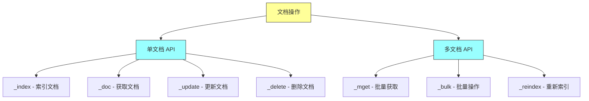

### 本章学习目标

通过本章的学习，你将掌握以下核心技能：使用 Index API 将文档存储到指定索引，理解 PUT 和 POST 在索引操作中的区别与适用场景；通过 GET API 灵活检索文档，包括元数据和原始内容的分离获取；运用 Update API 和脚本机制实现文档的部分更新和条件修改；利用 Delete API 和查询删除功能清理过时或无效数据；借助 Bulk API 实现高效的批量数据导入；运用 Reindex API 完成索引间的无缝数据迁移。

---

## 二、索引文档（Indexing Documents）

### 2.1 文档标识符的重要性

索引文档是将数据持久化到 Elasticsearch 的核心操作。与关系型数据库的 INSERT 类似，索引操作将 JSON 格式的文档存储到逻辑容器——索引（Index）中。在执行索引操作之前，我们需要理解文档标识符（ID）的概念及其在 API 调用中的关键作用。

每个文档都可以拥有一个由用户指定或系统自动生成的唯一标识符。以电影数据为例，《教父》可以分配 ID 为 1，《肖申克的救赎》可以分配 ID 为 2。这种 ID 机制类似于关系型数据库的主键，在文档的整个生命周期中保持关联。然而，并非所有场景都需要业务层面的 ID——例如汽车自动发送的成千上万个心跳消息，每条消息可能只需要一个随机生成的唯一标识符即可。

文档 API 允许我们在有 ID 和无 ID 两种情况下进行索引操作。这里存在一个重要的 HTTP 动词使用规范：如果文档 ID 由客户端提供，使用 HTTP PUT 方法调用文档索引 API；如果文档没有客户端提供的 ID，则在索引时使用 HTTP POST 方法，系统将自动生成一个随机 UUID 分配给该文档。

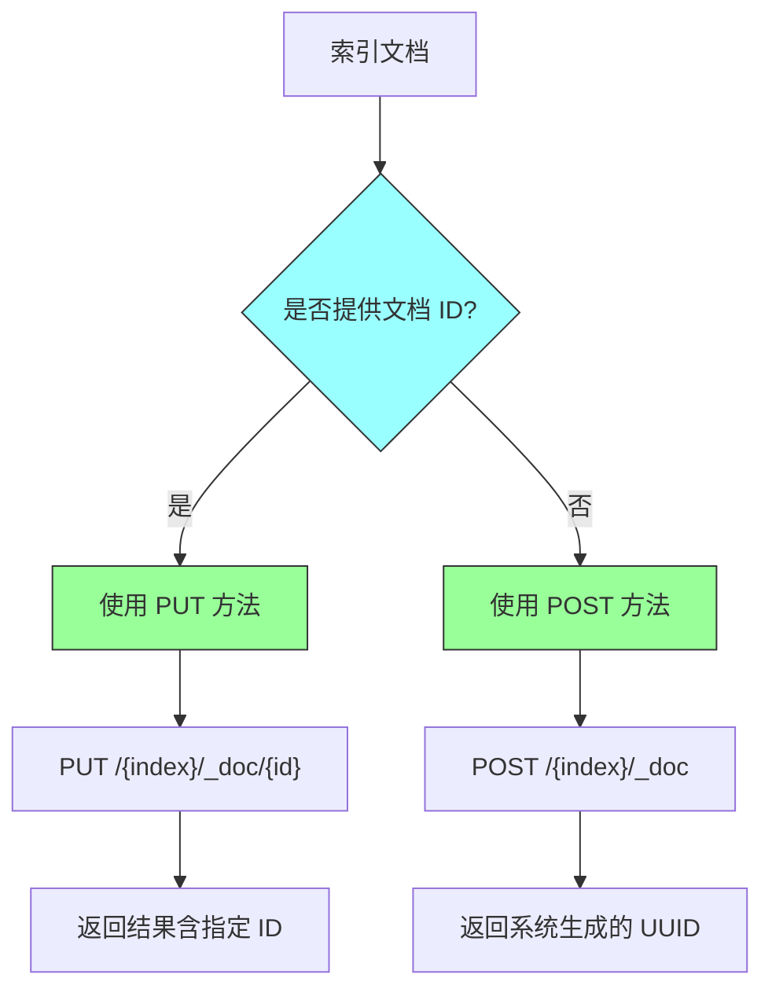

### 2.2 使用 PUT 方法索引带 ID 的文档

当文档拥有 ID 时，我们可以通过 `_doc` 端点配合 HTTP PUT 动作来索引文档。API 的基本语法格式为：`PUT <index_name>/_doc/<identifier>`。其中 `<index_name>` 是文档将要存储的索引名称，`_doc` 是索引文档时必须存在的端点，`<identifier>` 是文档的身份标识（类似数据库主键），在使用 HTTP PUT 方法时是强制的路径参数。

以下示例展示了如何索引一部电影文档：

```http
PUT movies/_doc/1
{
  "title": "The Godfather",
  "synopsis": "The aging patriarch of an organized crime dynasty transfers control of his clandestine empire to his reluctant son"
}
```

执行成功后，Elasticsearch 将返回包含元数据的响应：

```json
{
  "_index": "movies",
  "_type": "_doc",
  "_id": "1",
  "_version": 1,
  "result": "created",
  "_shards": {
    "total": 4,
    "successful": 1,
    "failed": 0
  },
  "_seq_no": 0,
  "_primary_term": 1
}
```

响应字段详解：`_index` 指示文档所属索引；`_type` 表示文档类型（由于类型已废弃，默认值为 `_doc`）；`_id` 是文档的唯一标识符；`_version` 追踪文档版本，初始值为 1，每次修改后递增；`_seq_no` 和 `_primary_term` 用于乐观并发控制；`_shards` 反映分片复制信息，`total` 表示总分片数，`successful` 表示成功写入的分片数。

### 2.3 使用 POST 方法索引无 ID 的文档

对于不需要业务层面 ID 的场景——如股票价格即时报价、社交媒体推文流、系统告警等——我们可以让 Elasticsearch 自动生成随机 ID。此时应使用 HTTP POST 方法代替 PUT。API 格式中不包含 ID 路径参数：`POST <index_name>/_doc`。

```http
POST movies_reviews/_doc
{
  "movie": "The Godfather",
  "user": "Peter Piper",
  "rating": 4.5,
  "remarks": "The movie started with a..."
}
```

系统将自动生成并返回随机 UUID：

```json
{
  "_index": "movies_reviews",
  "_type": "_doc",
  "_id": "53NyfXoBW8A1B2amKR5j",
  "_version": 1,
  "result": "created",
  "_shards": {
    "total": 4,
    "successful": 1,
    "failed": 0
  },
  "_seq_no": 0,
  "_primary_term": 1
}
```

关于 POST 和 PUT 的使用规则，有几点需要特别注意：POST 方法不强制要求用户提供文档 ID，系统会自动生成随机 UUID；但 POST 也可以携带 ID 使用（如 `POST movies/_doc/1` 是合法调用）。相反，PUT 方法在不带 ID 的情况下调用是非法的（如 `PUT movies/_doc` 将抛出错误）。

### 2.4 使用 _create 端点防止意外覆盖

默认情况下，Elasticsearch 的文档索引 API 对文档是否存在不做区分。如果对已存在的文档 ID 执行索引操作，系统会直接覆盖原有内容。这种行为在某些场景下可能导致意外的数据丢失。为解决这一问题，Elasticsearch 提供了 `_create` 端点来确保只创建新文档。

```http
PUT movies/_create/100
{
  "title": "Mission: Impossible",
  "director": "Brian De Palma"
}
```

如果尝试对已存在的文档 ID 使用 `_create` 端点，Elasticsearch 将抛出版本冲突异常：

```json
{
  "type": "version_conflict_engine_exception",
  "reason": "[100]: version conflict, document already exists (current version [1])"
}
```

这一机制有效防止了因应用程序逻辑错误或人为操作失误导致的文档意外覆盖。在数据一致性要求较高的场景中，建议使用 `_create` 端点进行文档创建操作。

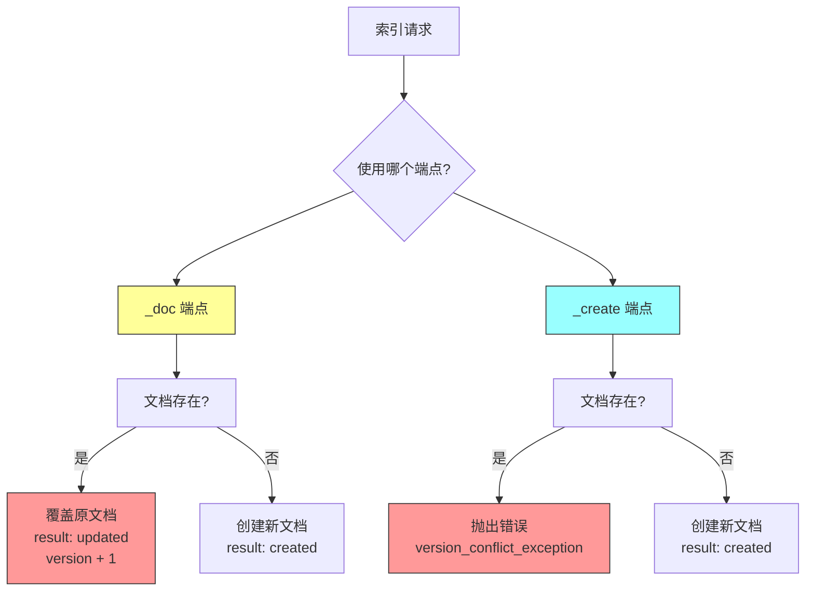

### 2.5 索引机制内部原理

理解 Elasticsearch 的索引机制对于优化写入性能和故障排查至关重要。当文档被索引时，系统首先根据路由算法确定文档应存储到哪个分片（Shard）。每个分片本质上是一个 Lucene 实例，拥有独立的堆内存空间。文档首先被推入分片的内存缓冲区（In-Memory Buffer），在此期间保持未提交状态，直到刷新操作触发。

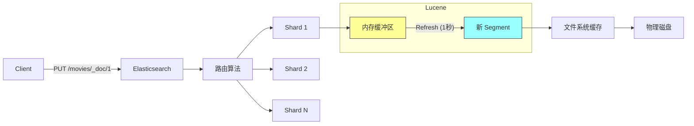

Lucene 的调度器默认每秒执行一次刷新（Refresh）操作，将内存缓冲区中的所有文档收集起来，创建新的段（Segment）。段由文档数据和倒排索引组成，一旦创建完成，数据首先写入文件系统缓存，随后才提交到物理磁盘。这种设计通过延迟持久化来提升写入性能。

段一旦创建便具有不可变性（Immutable）。新文档不会被添加到现有段中，而是进入新的段。删除操作同样不会物理移除文档，而是标记为待后续清理。这种策略确保了 Elasticsearch 的高吞吐量和查询性能。

### 2.6 段合并机制

为了防止段数量无限膨胀，Lucene 采用三级段合并策略：当三个段准备就绪时，Lucene 会将它们合并成一个新的段。这个过程循环进行，每积累三个段就合并出一个新段。

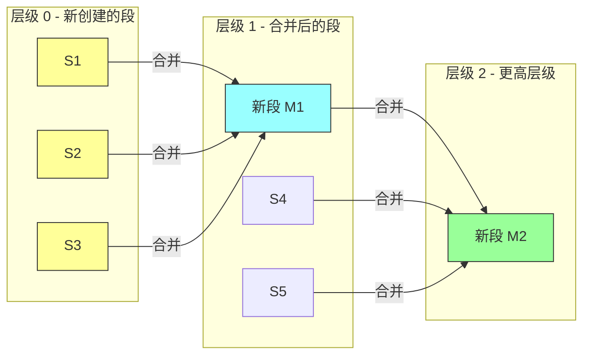

### 2.7 刷新策略配置

默认情况下，文档在内存缓冲区中停留一秒后通过刷新操作变为可搜索状态。这一秒的刷新间隔是性能与数据可见性之间的平衡点。我们可以根据业务需求灵活调整刷新策略。

```http
# 设置自定义刷新间隔为 60 秒
PUT movies/_settings
{
  "index": {
    "refresh_interval": "60s"
  }
}

# 完全禁用自动刷新
PUT movies/_settings
{
  "index": {
    "refresh_interval": "-1"
  }
}

# 手动触发刷新
POST movies/_refresh
```

禁用刷新的典型使用场景是大规模数据迁移——在从数据库批量导入数据期间，我们不希望文档过早变得可搜索，以免用户看到不完整的数据集。迁移完成后，手动刷新使所有数据一次性变为可见。

客户端也可以通过请求参数控制单次操作的刷新行为：

| 参数值 | 行为说明 |
|-------|---------|
| `refresh=false` | 默认值，不强制刷新，等待默认的一秒间隔 |
| `refresh=true` | 强制立即刷新，文档立即对搜索可见 |
| `refresh=wait_for` | 阻塞请求，直到下一次刷新完成 |

```http
# 强制立即刷新
PUT movies/_doc/1?refresh=true

# 等待刷新完成
PUT movies/_doc/1?refresh=wait_for
```

### 2.8 自动索引创建控制

默认情况下，如果请求索引的文档时目标索引不存在，Elasticsearch 会自动创建该索引。某些场景下我们可能希望禁用这一行为，例如已手动创建索引并定义了精确的映射和设置。

```http
# 通过配置禁用自动创建索引
PUT _cluster/settings
{
  "persistent": {
    "action.auto_create_index": "false"
  }
}
```

---

## 三、检索文档（Retrieving Documents）

### 3.1 单文档检索 API

Elasticsearch 提供了 GET API 来读取文档，语法与索引 API 类似，仅 HTTP 动词不同。检索单个文档的基本格式为：`GET <index_name>/_doc/<id>`。

```http
# 检索指定 ID 的文档
GET movies/_doc/1
```

成功响应将返回文档的元数据和原始内容（`_source`）：

```json
{
  "_index": "movies",
  "_type": "_doc",
  "_id": "1",
  "_version": 1,
  "_seq_no": 0,
  "_primary_term": 1,
  "found": true,
  "_source": {
    "title": "The Godfather",
    "synopsis": "The aging patriarch of an organized crime dynasty..."
  }
}
```

如果请求的文档不存在，响应中的 `found` 字段将设置为 `false`：

```json
{
  "_index": "movies",
  "_type": "_doc",
  "_id": "999",
  "found": false
}
```

### 3.2 使用 HEAD 请求检查文档存在性

除了 GET 请求，Elasticsearch 还支持 HEAD 请求来检查文档是否存在。HEAD 请求只返回 HTTP 状态码，不返回响应体：200 表示文档存在，404 表示文档不存在。

```http
# 检查文档是否存在
HEAD movies/_doc/1

# 返回: 200 - OK

HEAD movies/_doc/999

# 返回: 404 - Not Found
```

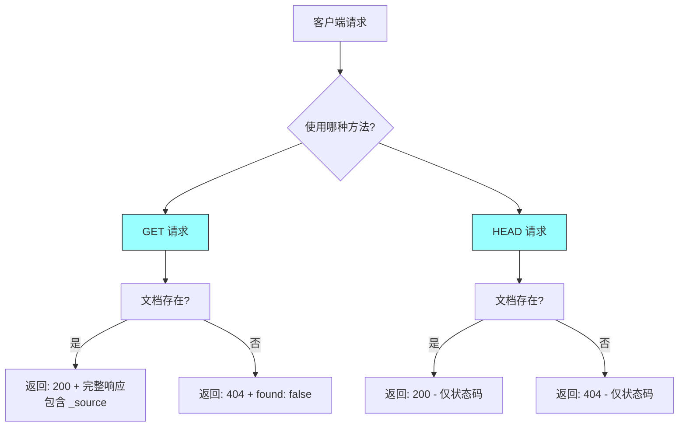

### 3.3 批量检索多个文档（_mget API）

当需要同时获取多个文档时，逐个调用 GET API 会产生大量网络往返。Elasticsearch 提供了 `_mget` API 解决这个问题，支持从同一索引或多个索引中批量获取文档。

```http
# 从同一索引批量获取
GET movies/_mget
{
  "ids": ["1", "12", "19", "34"]
}
```

从多个索引获取文档：

```http
# 从多个索引批量获取
GET _mget
{
  "docs": [
    {
      "_index": "classic_movies",
      "_id": 11
    },
    {
      "_index": "international_movies",
      "_id": 22
    },
    {
      "_index": "top100_movies",
      "_id": 33
    }
  ]
}
```

需要注意的是，Elasticsearch 尚未支持在 `ids` 数组中直接指定 `_index`，必须为每个文档创建单独的 `_index`/`_id` 对。如果请求的索引不存在，系统将返回 `index_not_found_exception`。

---

## 四、响应操控（Manipulating Responses）

### 4.1 获取原始文档而不含元数据

默认情况下，检索响应同时包含文档元数据和原始内容。如果只需要原始文档而不关心元数据，可以使用 `_source` 端点：

```http
# 仅获取原始文档内容
GET movies/_source/1

# 响应
{
  "title": "The Godfather",
  "synopsis": "The aging patriarch of an organized crime dynasty..."
}
```

### 4.2 抑制原始文档仅返回元数据

某些场景下我们可能只需要元数据而不想传输原始文档内容——例如检查文档是否存在或仅需要版本信息时。可以通过 `_source` 查询参数设置为 `false` 来实现：

```http
# 仅返回元数据
GET movies/_doc/1?_source=false

# 响应
{
  "_index": "movies",
  "_type": "_doc",
  "_id": "1",
  "_version": 1,
  "_seq_no": 0,
  "_primary_term": 1,
  "found": true
}
```

这一功能在文档体积较大但查询量极高的场景下特别有用，可以显著减少网络带宽消耗。

### 4.3 字段过滤：包含与排除

`_source` 端点支持更精细的字段控制，通过 `_source_includes` 和 `_source_excludes` 参数可以灵活指定返回哪些字段或排除哪些字段。

```http
# 仅包含指定字段
GET movies/_doc/3?_source_includes=title,rating,genre

# 响应
{
  "_source": {
    "rating": 9.3,
    "genre": "drama",
    "title": "The Shawshank Redemption"
  }
}

# 排除指定字段
GET movies/_source/3?_source_excludes=actors,synopsis

# 使用通配符和组合过滤
GET movies/_source/13?_source_includes=rating*&_source_excludes=rating_amazon
```

这些字段过滤功能在处理包含大量字段的文档（如完整的 Twitter 推文数据）时特别有价值，可以根据实际需求精确控制返回的数据量。

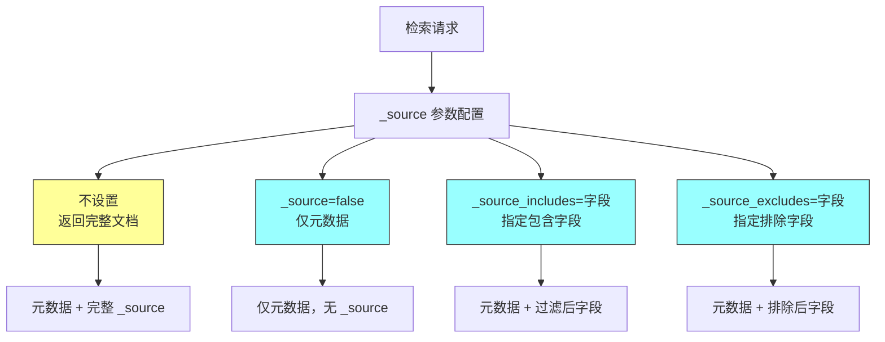

---

## 五、更新文档（Updating Documents）

### 5.1 更新机制内部原理

Elasticsearch 的文档更新遵循"获取-修改-重建索引"的三步流程。当执行更新操作时，系统首先获取原文档，在内存中进行修改，然后创建一个包含新内容的新文档，同时将原文档标记为删除。在这个过程中，文档版本号会递增。

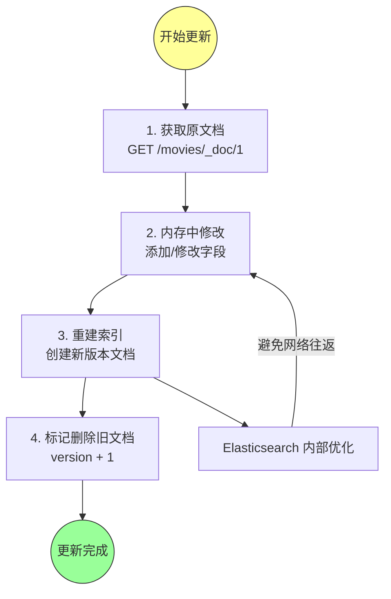

值得注意的是，虽然更新操作在逻辑上分为三步，但 Elasticsearch 通过在同一分片上执行这些操作来避免额外的网络往返，相比客户端分别调用 GET、修改、PUT 更加高效。

### 5.2 _update API 基本用法

_update API 用于修改现有文档，支持三种典型场景：添加新字段、修改现有字段值、整体替换文档。API 格式为：`POST <index_name>/_update/<id>`。

```http
# 添加新字段到现有文档
POST movies/_update/1
{
  "doc": {
    "actors": ["Marlon Brando", "Al Pacino", "James Caan"],
    "director": "Francis Ford Coppola"
  }
}

# 修改现有字段值
POST movies/_update/1
{
  "doc": {
    "title": "The Godfather (Original)"
  }
}

# 更新数组字段需要提供完整数组
POST movies/_update/1
{
  "doc": {
    "actors": ["Marlon Brando", "Al Pacino", "James Caan", "Robert Duvall"]
  }
}
```

### 5.3 脚本更新（Scripted Updates）

对于更复杂的更新逻辑，Elasticsearch 支持使用 Painless 脚本语言进行条件更新。脚本通过 `script` 对象传递，逻辑写在 `source` 字段中。可以通过 `ctx` 上下文变量访问和修改文档内容。

```http
# 使用脚本向数组添加元素
POST movies/_update/1
{
  "script": {
    "source": "ctx._source.actors.add('Diane Keaton')"
  }
}

# 使用脚本从数组移除元素
POST movies/_update/1
{
  "script": {
    "source": "ctx._source.actors.remove(ctx._source.actors.indexOf('Diane Keaton'))"
  }
}

# 使用脚本添加新字段
POST movies/_update/1
{
  "script": {
    "source": "ctx._source.imdb_user_rating = 9.2"
  }
}

# 使用脚本移除字段
POST movies/_update/1
{
  "script": {
    "source": "ctx._source.remove('imdb_user_rating')"
  }
}

# 批量添加多个字段
POST movies/_update/1
{
  "script": {
    "source": """
      ctx._source.runtime_in_minutes = 175;
      ctx._source.metacritic_rating = 100;
      ctx._source.tomatometer = 97;
      ctx._source.boxoffice_gross_in_millions = 134.8;
    """
  }
}
```

### 5.4 条件更新脚本

脚本更新功能支持条件逻辑，可以根据文档字段值决定如何更新：

```http
# 条件更新：票房超过 1.25 亿标记为大片
POST movies/_update/1
{
  "script": {
    "source": """
      if (ctx._source.boxoffice_gross_in_millions > 125) {
        ctx._source.blockbuster = true
      } else {
        ctx._source.blockbuster = false
      }
    """
  }
}
```

通过 `params` 对象可以动态传递参数，避免在脚本中硬编码值：

```http
# 使用 params 传递动态参数
POST movies/_update/1
{
  "script": {
    "source": """
      if (ctx._source.boxoffice_gross_in_millions > params.gross_earnings_threshold) {
        ctx._source.blockbuster = true
      } else {
        ctx._source.blockbuster = false
      }
    """,
    "params": {
      "gross_earnings_threshold": 150
    }
  }
}
```

使用 params 的重要优势在于性能优化：脚本首次执行会被编译，后续执行如果仅改变参数值则无需重新编译，大大提升了执行效率。

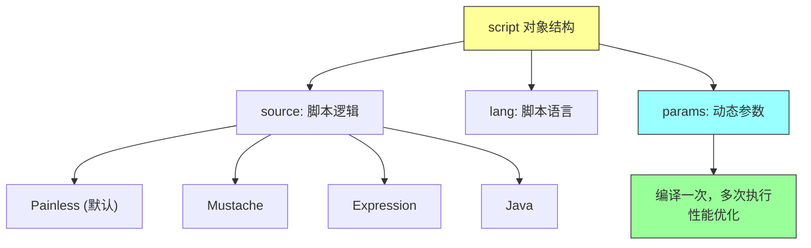

### 5.5 Upsert 操作

`Upsert`（Update + Insert）是"更新或插入"的复合操作：如果文档存在则执行更新，如果文档不存在则创建新文档。

```http
# Upsert 示例
POST movies/_update/5
{
  "script": {
    "source": "ctx._source.gross_earnings = '357.1m'"
  },
  "upsert": {
    "title": "Top Gun",
    "gross_earnings": "357.5m"
  }
}
```

如果文档 5 不存在，`upsert` 块的内容将被索引为新文档；如果文档已存在，则执行脚本更新现有文档。再次执行同一请求将执行脚本部分，将 `gross_earnings` 从 `357.5m` 更新为 `357.1m`。

### 5.6 doc_as_upsert

当使用 `doc` 对象进行部分更新时，如果文档不存在会抛出错误。`doc_as_upsert` 参数允许在文档不存在时将 `doc` 内容作为新文档创建：

```http
POST movies/_update/11
{
  "doc": {
    "runtime_in_minutes": 110
  },
  "doc_as_upsert": true
}
```

### 5.7 通过查询批量更新

_update_by_query API 允许根据查询条件批量更新匹配的文档：

```http
# 批量更新所有包含 Al Pacino 的电影
POST movies/_update_by_query
{
  "query": {
    "match": {
      "actors": "Al Pacino"
    }
  },
  "script": {
    "source": """
      ctx._source.actors.add('Oscar Winner Al Pacino');
      ctx._source.actors.remove(ctx._source.actors.indexOf('Al Pacino'))
    """,
    "lang": "painless"
  }
}
```

_update_by_query 的执行过程：首先解析查询条件并识别可能匹配文档的分片；对每个分片执行查询找到所有匹配文档；在每个匹配文档上执行提供的脚本；检查版本一致性后重新索引更新后的文档；操作完成后刷新索引使更改对搜索可见。

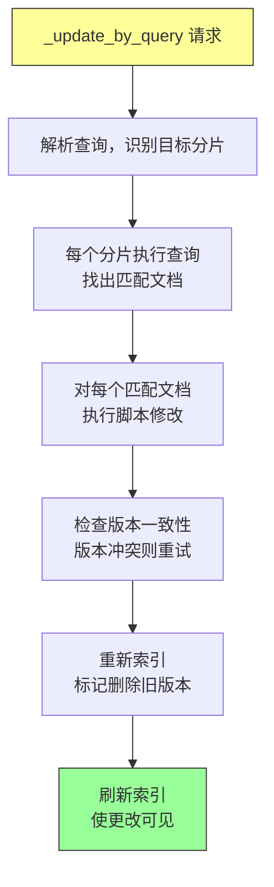

---

## 六、删除文档（Deleting Documents）

### 6.1 通过 ID 删除单文档

删除单文档使用 HTTP DELETE 方法，URL 格式与索引操作相同：`DELETE <index_name>/_doc/<id>`。

```http
DELETE movies/_doc/1

# 成功响应
{
  "_index": "movies",
  "_id": "1",
  "_version": 2,
  "result": "deleted"
}
```

响应中的 `result` 字段指示操作结果：`deleted` 表示成功删除，`not_found`（404 状态码）表示文档不存在。有趣的是，即使删除操作成功，`_version` 仍会递增，这反映了文档状态的每一次变化。

### 6.2 通过查询批量删除（_delete_by_query）

_delete_by_query API 支持根据查询条件批量删除匹配的文档，功能类似于 SQL 的 DELETE WHERE 语句。

```http
# 删除所有 James Cameron 导演的电影
POST movies/_delete_by_query
{
  "query": {
    "match": {
      "director": "James Cameron"
    }
  }
}

# 使用范围查询删除
POST movies/_delete_by_query
{
  "query": {
    "range": {
      "gross_earnings_in_millions": {
        "gt": 350,
        "lt": 400
      }
    }
  }
}

# 复杂条件删除：Spielberg 导演、评分 9-9.5、票房不足 1 亿
POST movies/_delete_by_query
{
  "query": {
    "bool": {
      "must": [
        { "match": { "director": "Steven Spielberg" } }
      ],
      "must_not": [
        { "range": { "imdb_rating": { "gte": 9, "lte": 9.5 } } }
      ],
      "filter": [
        { "range": { "gross_earnings_in_millions": { "lt": 100 } } }
      ]
    }
  }
}
```

### 6.3 删除所有文档

使用 `match_all` 查询可以删除索引中的所有文档：

```http
# 删除索引中的所有文档
POST movies/_delete_by_query
{
  "query": {
    "match_all": {}
  }
}

# 跨多个索引删除
POST old_movies,classics,movie_reviews/_delete_by_query
{
  "query": {
    "match_all": {}
  }
}
```

**警告：删除操作不可逆！在生产环境中执行删除查询前，请务必确认操作目标并做好数据备份。**

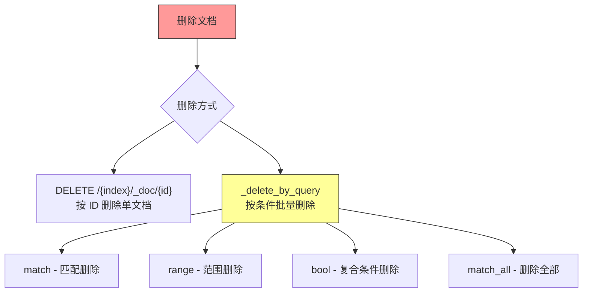

---

## 七、批量操作（Working with Documents in Bulk）

### 7.1 Bulk API 的价值与格式

在生产环境中，逐个索引文档效率低下且容易出错。Elasticsearch 提供了 `_bulk` API 来执行批量操作，可以在一个请求中执行索引、创建、更新、删除等多种操作，显著减少网络开销并提升吞吐量。

_bulk API 使用特殊格式：每个操作用两行 JSON 表示。第一行指定操作类型和相关元数据（索引名、文档 ID），第二行包含文档内容（删除操作不需要第二行）。所有行必须以换行符分隔，形成 NDJSON（Newline-Delimited JSON）格式。

```http
POST _bulk
{"index":{"_index":"movies","_id":"100"}}
{"title": "Mission Impossible", "release_date": "1996-07-05"}
{"index":{"_index":"movies","_id":"101"}}
{"title": "Mission Impossible II", "release_date": "2000-05-24"}
```

```mermaid
flowchart TB
    subgraph Bulk_Request["批量请求结构"]
    Line1["操作元数据<br/>{"index":{"_index":"movies","_id":"100"}}"]
    Line2["文档内容<br/>{"title":"...","release_date":"..."}]
    Line3["操作元数据<br/>{"delete":{"_index":"movies","_id":"99"}}"]
    Line4["操作元数据<br/>{"update":{"_index":"movies","_id":"1"}}"]
    Line5["更新内容<br/>{"doc":{"title":"..."}}"]
    end

    Line1 -.-> Line2
    Line3
    Line4 -.-> Line5

    style Bulk_Request fill:#ff9,stroke:#333
```

### 7.2 Bulk API 操作类型

_bulk API 支持四种操作类型：

| 操作 | 作用 | 第二行要求 |
|-----|-----|-----------|
| `index` | 创建或覆盖文档 | 需要（文档内容） |
| `create` | 仅创建文档（不存在则报错） | 需要（文档内容） |
| `update` | 更新现有文档 | 需要（更新内容，包裹在 `doc` 中） |
| `delete` | 删除文档 | 不需要 |

```http
# 混合操作批量请求
POST _bulk
{"index":{"_index":"books"}}
{"title": "Elasticsearch in Action"}
{"create":{"_index":"flights","_id":"101"}}
{"title": "London to Bucharest"}
{"index":{"_index":"pets"}}
{"name": "Milly", "age_months": 18}
{"delete":{"_index":"movies","_id":"101"}}
{"update":{"_index":"movies","_id":"1"}}
{"doc": {"title": "The Godfather (Original)"}}
```

### 7.3 Bulk API 使用技巧

索引名可以嵌入 URL 中简化请求：

```http
# 简化格式：索引名在 URL 中
POST movies/_bulk
{"index":{"_id":"100"}}
{"title": "Mission Impossible", "release_date": "1996-07-05"}
{"index":{"_id":"101"}}
{"title": "Mission Impossible II", "release_date": "2000-05-24"}
```

系统自动生成 ID（省略 `_id`）：

```http
POST movies/_bulk
{"index":{}}
{"title": "Mission Impossible", "release_date": "1996-07-05"}
{"index":{}}
{"title": "Mission Impossible III", "release_date": "2006-05-03"}
```

### 7.4 使用 cURL 执行 Bulk 操作

对于大量数据的导入，使用 cURL 配合文件是更实用的方案：

```bash
curl -H "Content-Type: application/x-ndjson" \
  -XPOST localhost:9200/_bulk \
  --data-binary "@movie_bulk_data.json"
```

`--data-binary` 标志确保文件内容原样传输（包括换行符），这对 NDJSON 格式至关重要。


---

## 八、重新索引（Reindexing Documents）

### 8.1 何时需要重新索引

在实际应用中，由于业务需求变化或映射 schema 需要更新，我们经常需要将文档从一个索引迁移到另一个索引。_reindex API 提供了便捷的跨索引数据迁移能力。

典型使用场景包括：映射结构变更（如添加新字段类型、修改分词器）、分片策略调整、索引别名切换实现零停机迁移、数据归档（将旧数据迁移到只读归档索引）。

```http
# 基本重新索引
POST _reindex
{
  "source": { "index": "movies" },
  "dest": { "index": "movies_new" }
}
```

_reindex 操作的工作原理：它从源索引读取文档快照，按批次发送到目标索引。执行期间对源索引的新增或修改不会自动同步到目标索引。如需实现实时同步迁移，需要结合索引别名和滚动索引策略。

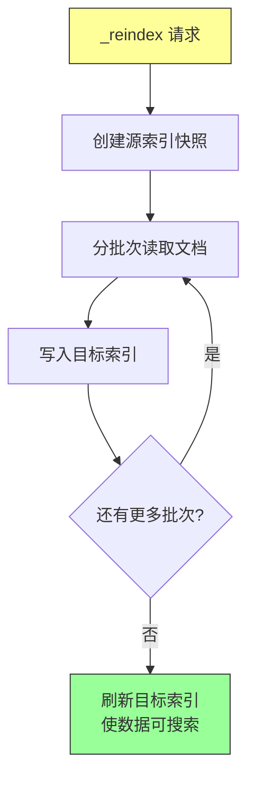

---

## 九、最佳实践总结

### 9.1 索引操作最佳实践

选择正确的 HTTP 动词至关重要。对于需要指定业务 ID 的文档使用 PUT 方法，对于由系统自动生成 ID 的场景使用 POST 方法。如果需要确保只创建新文档（防止意外覆盖），使用 `_create` 端点而非 `_doc` 端点。

在高吞吐量写入场景下，禁用自动刷新可以显著提升写入性能，待批量导入完成后再手动刷新使数据变为可搜索。同时考虑使用 Bulk API 进行批量写入，减少网络往返开销。

### 9.2 查询与检索最佳实践

根据实际需求选择合适的检索方式。只需要检查文档是否存在时使用 HEAD 请求，可以减少网络传输量。需要获取多个文档时务必使用 `_mget` API，避免逐个查询带来的性能损失。善用 `_source` 参数进行字段过滤，只返回必要的数据以减少网络开销。

### 9.3 更新操作最佳实践

优先使用 `_update` API 的 `doc` 对象进行部分更新，避免整体替换带来的额外开销。使用脚本更新时，务必通过 `params` 对象传递动态参数，避免脚本重复编译。对于复杂的条件更新逻辑，脚本更新是最佳选择。

使用 `upsert` 和 `doc_as_upsert` 功能可以简化代码逻辑，减少针对文档是否存在分别处理的情况。在执行批量更新前，评估对集群性能的影响，必要时通过 `conflicts` 参数控制冲突处理策略。

### 9.4 删除操作最佳实践

删除操作不可逆，执行前务必确认操作范围。在生产环境执行 `_delete_by_query` 前，建议先用相同的查询条件执行搜索，确认匹配的文档数量和内容是否符合预期。考虑使用别名机制管理索引，通过别名切换实现无缝的索引迁移和归档策略。

---

## 十、常见问题

**问题一：索引文档时返回版本冲突错误**

这通常是因为尝试使用 `_create` 端点索引一个已存在的文档 ID。解决方法：确认文档 ID 是否正确，或使用 `_doc` 端点进行覆盖操作。

**问题二：索引的文档搜索不到**

新索引的文档需要等待刷新周期（默认 1 秒）后才能被搜索到。如果禁用了自动刷新，需要手动调用 `POST <index>/_refresh` 使文档可见。

**问题三：Bulk 操作部分失败**

_bulk 操作的每个子操作独立执行，一个子操作的失败不会影响其他子操作。响应中包含每个操作的状态信息，需要检查返回结果识别和处理失败的操作。

**问题四：更新脚本执行报错**

检查脚本语法是否正确，Painless 脚本有特定的语法规则。确保引用的字段确实存在于文档中，访问不存在的字段会抛出异常。使用 `params` 对象传递参数可以避免脚本重复编译带来的性能问题。

**问题五：_reindex 速度慢**

_reindex 速度受限于集群资源和源索引的数据量。考虑以下优化方案：调整 `slices` 参数增加并行度，增大 `size` 参数增加每批处理量，在非高峰期执行迁移操作。

---

## 十一、API 参考速查表

### 单文档操作

| 操作 | 方法 | 端点格式 | 用途 |
|-----|-----|---------|-----|
| 索引 | PUT | `/{index}/_doc/{id}` | 创建或覆盖文档 |
| 索引 | POST | `/{index}/_doc` | 自动生成 ID 创建 |
| 创建 | PUT | `/{index}/_create/{id}` | 仅创建（存在则报错） |
| 获取 | GET | `/{index}/_doc/{id}` | 获取文档及元数据 |
| 获取源 | GET | `/{index}/_source/{id}` | 仅获取原始文档 |
| 更新 | POST | `/{index}/_update/{id}` | 更新现有文档 |
| 删除 | DELETE | `/{index}/_doc/{id}` | 删除单文档 |

### 多文档操作

| 操作 | 方法 | 端点格式 | 用途 |
|-----|-----|---------|-----|
| 批量获取 | GET | `/{index}/_mget` | 批量获取文档 |
| 批量索引 | POST | `/_bulk` | 批量 CRUD 操作 |
| 批量更新 | POST | `/{index}/_update_by_query` | 按条件批量更新 |
| 批量删除 | POST | `/{index}/_delete_by_query` | 按条件批量删除 |
| 重新索引 | POST | `/_reindex` | 跨索引迁移数据 |

### 查询参数

| 参数 | 值 | 作用 |
|-----|-----|-----|
| `refresh` | `true/false/wait_for` | 控制刷新行为 |
| `_source` | `false` | 禁止返回原始文档 |
| `_source_includes` | 字段列表 | 指定返回字段 |
| `_source_excludes` | 字段列表 | 排除返回字段 |

---

## 本章小结

本章系统介绍了 Elasticsearch 文档操作的核心机制和实践技巧。我们学习了文档的基本 CRUD 操作，理解了单文档 API 与多文档 API 的适用场景，掌握了 Bulk API 的强大批量处理能力，以及 Reindex API 在索引迁移中的应用。

文档是 Elasticsearch 数据存储的基本单元，深入理解本章内容将为后续学习搜索、聚合等高级功能奠定坚实基础。建议读者在本地环境中动手实践每个 API 示例，通过实际操作加深对文档操作机制的理解。

下一章将深入探讨索引操作（Index Operations），包括索引配置、模板、状态管理和生命周期管理等内容，敬请期待。
