# Elasticsearch in Action - 第六章：Indexing Operations（索引操作）

## 一、本章概述

本章深入探讨 Elasticsearch 中索引操作的核心机制，从索引的创建、配置到高级管理特性全面覆盖。索引是 Elasticsearch 中组织和管理数据的核心逻辑单元，它将具有相似属性的文档聚合在一起——如员工信息、订单记录、登录审计数据、新闻故事等。通过深入理解索引操作，我们可以构建高效、可扩展的搜索架构。

索引操作涵盖多个层面：设置（Settings）用于调整分片数量、副本数和其他索引属性；映射（Mappings）定义数据的模式schema，以实现高效的索引和查询；别名（Aliases）为索引提供替代名称，支持跨多索引查询和零停机重索引。本章将详细讲解这些配置，并介绍索引模板、生命周期管理等高级特性，帮助读者建立对索引操作的完整认知。

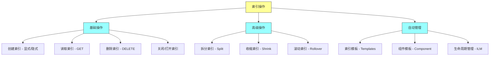

### 本章学习目标

通过本章的学习，你将掌握以下核心技能：理解索引与分片的关系，掌握显式创建和隐式创建索引的方法；能够自定义索引的设置、映射和别名；区分静态设置与动态设置，并理解其对运维的影响；运用索引模板实现批量标准化配置；理解拆分、收缩、滚动等高级索引操作；掌握索引生命周期管理（ILM）实现自动化运维。

---

## 二、创建索引（Creating Indexes）

### 2.1 索引的基本概念

在深入创建索引之前，我们需要理解索引的本质。索引是文档的逻辑集合，由分片（Shards）物理支持。文档以 JSON 格式存储，具有相似属性（如员工、订单、登录审计数据、新闻等）的文档存储在相应的索引中。任何包含分片的索引分布在集群中的各个节点上。新创建的索引默认关联一定数量的主分片、副本分片和其他属性，我们可以通过自定义配置来优化这些设置。

索引是 Elasticsearch 最核心的概念之一，它不仅仅是数据的容器，还包含了数据如何被存储、检索和分析的所有元信息。一个设计良好的索引可以显著提升搜索性能和存储效率。

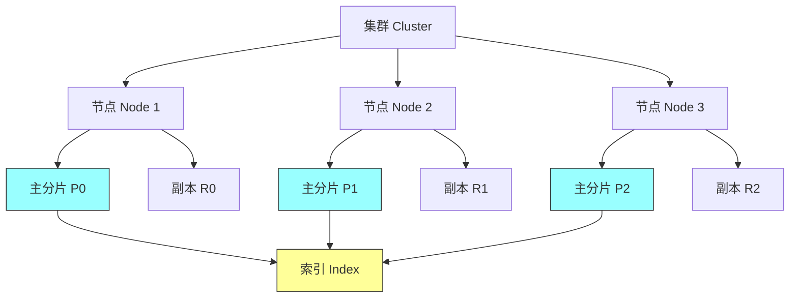

### 2.2 隐式创建与显式创建

Elasticsearch 提供了两种创建索引的方式，各有适用场景。

**隐式创建（自动创建）** 是最简单的方式。当我们首次索引文档时，如果索引不存在，Elasticsearch 会自动创建它。这种方式在开发阶段非常方便，但存在一些隐患：默认情况下，索引只配置一个主分片和一个副本分片，这对于生产环境可能不够；Elasticsearch 使用动态映射来推断字段类型，可能导致不准确的数据类型判断。

**显式创建（手动创建）** 让我们完全控制索引的所有配置。我们可以预先定义映射模式（由数据架构师设计）、根据当前和预期的存储需求分配分片数量、配置合适的副本数以实现高可用。这种方式是生产环境的最佳实践。

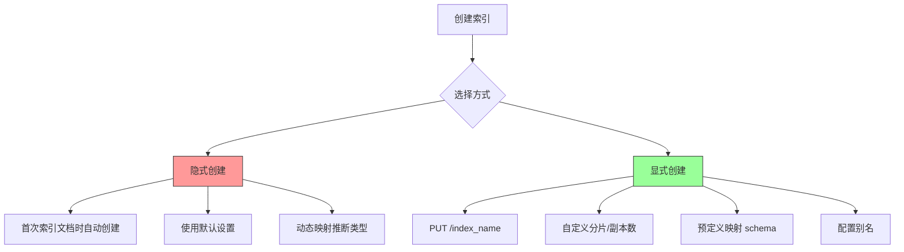

### 2.3 禁用自动创建索引

在某些生产环境中，我们可能希望禁用索引的自动创建，以防止应用程序意外创建不符合规范的索引。Elasticsearch 提供了 `action.auto_create_index` 配置项来控制这一行为。

```http
PUT _cluster/settings
{
  "persistent": {
    "action.auto_create_index": false
  }
}
```

更灵活的做法是使用正则表达式来控制哪些索引可以自动创建，哪些不可以：

```http
PUT _cluster/settings
{
  "persistent": {
    "action.auto_create_index": "[.admin*, cars*, *books*, -x*,-y*,+z*]"
  }
}
```

这个配置的含义是：允许自动创建以 `.admin` 开头的隐藏索引、以 `cars` 或 `books` 开头的索引、以及带 `+` 前缀的索引；禁止自动创建以 `x` 或 `y` 开头的索引；其他索引名称将无法自动创建。

### 2.4 索引的三大配置

每个索引都由三个核心配置组成，无论它是自动创建还是手动创建：

**映射（Mappings）** 定义了数据的模式schema。数据通常包含多种数据类型，如 text、keyword、long、date 等。Elasticsearch 查询映射定义来应用适当的规则，分析输入数据后再存储，以便高效搜索。

**设置（Settings）** 包含索引的各种配置参数，如主分片数量、副本数量、刷新间隔、压缩编解码器等。部分设置（称为动态设置）可以在运行时调整；其他设置（静态设置）只能在索引创建时或关闭状态下修改。

**别名（Aliases）** 是索引的替代名称。一个别名可以指向单个或多个索引。例如，一个名为 `my_cars_aliases` 的别名可以指向所有汽车相关的索引。我们可以像操作单个索引一样对别名执行查询。

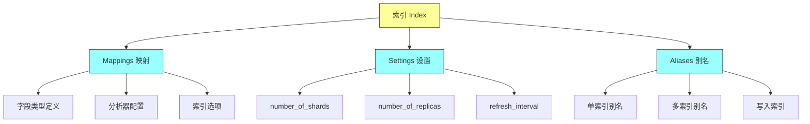

---

## 三、索引设置详解（Index Settings）

### 3.1 静态设置与动态设置

理解静态设置和动态设置的区别对于索引运维至关重要。

**静态设置（Static Settings）** 只能在索引创建时或索引关闭状态下配置。这些设置包括主分片数量（number_of_shards）、压缩编解码器（codec）等。如果需要修改静态设置，必须先关闭索引，修改后再重新打开，或者重新创建索引并迁移数据。

**动态设置（Dynamic Settings）** 可以在运行时随时修改，无需关闭索引。这些设置包括副本数量（number_of_replicas）、刷新间隔（refresh_interval）、是否允许写入（index.blocks.write）等。动态设置的灵活性使得我们可以在不中断服务的情况下调整索引行为。

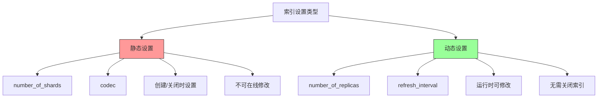

### 3.2 创建带自定义设置的索引

以下示例创建一个带有完整自定义设置的索引：

```http
PUT cars_with_custom_settings
{
  "settings": {
    "number_of_shards": 3,
    "number_of_replicas": 5,
    "codec": "best_compression",
    "max_script_fields": 128,
    "refresh_interval": "60s"
  }
}
```

配置说明：主分片数量设为 3，提供更好的数据分布；副本数量设为 5，保证高可用性；使用最佳压缩编解码器节省存储空间；最大脚本字段数增加到 128；刷新间隔设为 60 秒，减少 I/O 开销。

如果我们尝试在运行时修改静态设置（如 number_of_shards），Elasticsearch 将抛出异常：

```json
{
  "error": "illegal_argument_exception",
  "reason": "can't merge because static setting [index.number_of_shards] cannot be changed"
}
```

但动态设置可以随时修改：

```http
PUT cars_with_custom_settings/_settings
{
  "settings": {
    "number_of_replicas": 2
  }
}
```

### 3.3 为什么不能修改主分片数量

这是一个常见但重要的问题：为什么索引的主分片数量一旦创建就不能修改？

答案在于 Elasticsearch 的路由算法。文档所属的分片由以下公式决定：`shard_home = hash(doc_ID) % number_of_shards`。路由函数依赖于主分片数量，如果修改了分片数量，现有文档可能会被错误地分配到不同的分片，导致数据丢失或查询结果不完整。因此，主分片数量被视为静态设置，只能在索引创建时确定。

---

## 四、索引映射与别名（Mappings and Aliases）

### 4.1 创建带映射的索引

映射定义了索引中每个字段的数据类型和分析方式。以下示例创建一个带有完整映射定义的索引：

```http
PUT cars_with_mappings
{
  "mappings": {
    "properties": {
      "make": {
        "type": "text"
      },
      "model": {
        "type": "text"
      },
      "registration_year": {
        "type": "date",
        "format": "dd-MM-yyyy"
      }
    }
  }
}
```

这个映射定义了三个字段：make 和 model 为文本类型，registration_year 为日期类型并指定了自定义日期格式。正确的映射可以确保数据分析的准确性，避免搜索结果不如预期。

### 4.2 同时设置和映射

在实际应用中，我们通常需要同时配置设置和映射：

```http
PUT cars_with_settings_and_mappings
{
  "settings": {
    "number_of_replicas": 3
  },
  "mappings": {
    "properties": {
      "make": {
        "type": "text"
      },
      "model": {
        "type": "text"
      },
      "registration_year": {
        "type": "date",
        "format": "dd-MM-yyyy"
      },
      "price": {
        "type": "float"
      }
    }
  }
}
```

### 4.3 索引别名

别名是索引的替代名称，提供极大的灵活性。别名可以指向单个或多个索引，支持零停机数据迁移。

**创建指向单个索引的别名：**

```http
PUT cars_for_aliases
{
  "aliases": {
    "my_new_cars_alias": {}
  }
}
```

或者使用 _alias 端点：

```http
PUT cars_for_aliases/_alias/my_cars_alias
```

**创建指向多个索引的别名：**

```http
PUT cars1,cars2,cars3/_alias/multi_cars_alias
```

当别名指向多个索引时，至少要有一个索引设置为可写索引：

```http
PUT cars3
{
  "aliases": {
    "cars_alias": {
      "is_write_index": true
    }
  }
}
```

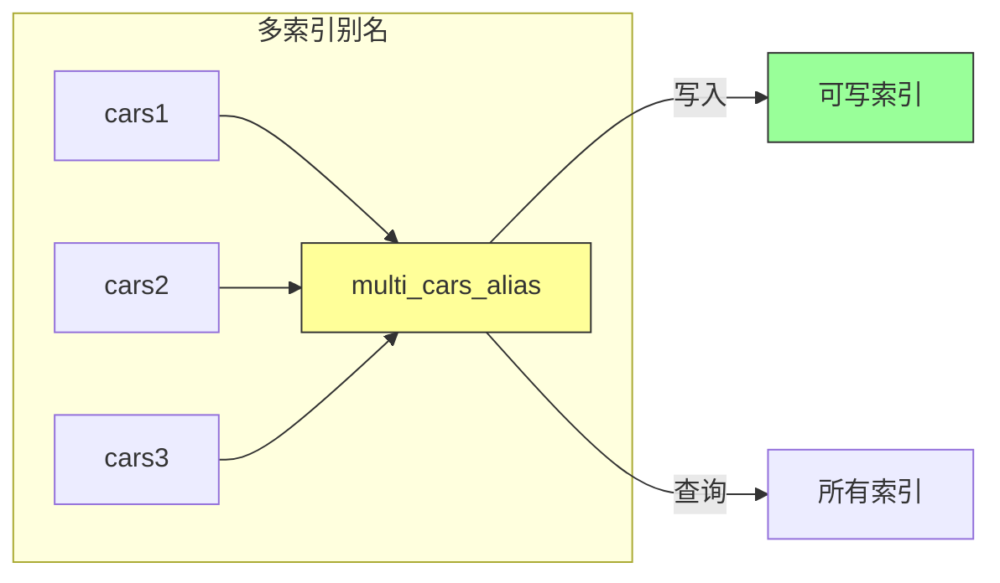

### 4.4 使用别名实现零停机迁移

别名最重要的应用场景之一是实现零停机的数据迁移。假设我们需要升级 vintage_cars 索引，但由于新属性与现有数据不兼容，需要创建新索引。步骤如下：

1. 创建别名指向当前索引
2. 创建新索引并配置新设置
3. 使用 reindex 迁移数据
4. 将别名重新指向新索引
5. 删除旧索引

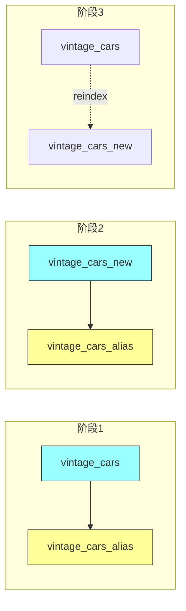

这个过程对应用程序是完全透明的——所有查询仍然针对别名执行，无需修改任何代码。

---

## 五、索引的读取、关闭与删除

### 5.1 读取索引信息

获取索引的详细信息：

```http
GET cars
```

获取多个索引的信息：

```http
GET cars1,cars2,cars3
```

使用通配符获取符合模式的索引：

```http
GET cars*
```

分别获取设置、映射和别名：

```http
GET cars/_settings
GET cars/_mapping
GET cars/_alias
```

### 5.2 关闭与打开索引

关闭索引会使其停止所有读写操作，释放系统资源。当索引暂时不需要但又不希望删除时，可以选择关闭它。

**关闭索引：**

```http
POST cars/_close
```

关闭后，任何读写操作都会失败。

**打开索引：**

```http
POST cars/_open
```

打开后，索引恢复正常工作状态。我们也可以批量关闭或打开多个索引：

```http
POST cars1,*mov*,students*/_close
POST */_open
```

注意：关闭所有索引可能会导致集群不稳定，应谨慎操作。

### 5.3 删除索引

删除索引是一个不可逆操作，会永久丢失所有数据和配置：

```http
DELETE cars
```

批量删除：

```http
DELETE cars,movies,orders
```

使用通配符删除（需先设置）：

```http
PUT _cluster/settings
{
  "transient": {
    "action.destructive_requires_name": false
  }
}

DELETE *
```

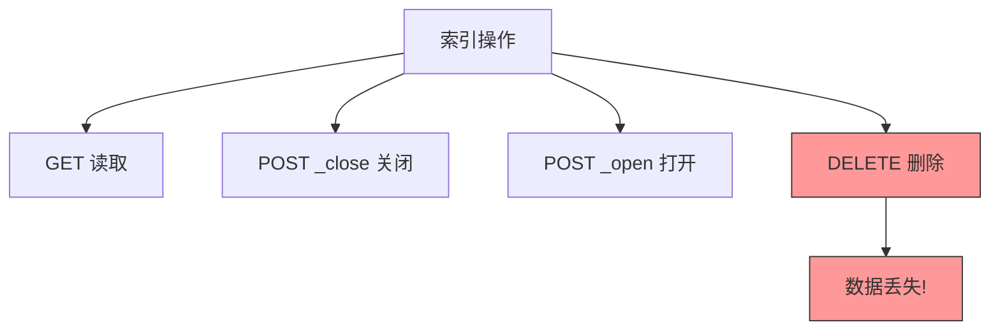

---

## 六、索引模板（Index Templates）

### 6.1 模板的概念与价值

在大型组织中，手动为每个索引配置设置是繁琐且容易出错的工作。索引模板解决了这一问题：我们可以预先定义一套配置规则，当创建新索引时，如果索引名称匹配模板规则，模板会自动应用到新索引上。这确保了整个组织内索引配置的一致性。

模板特别适合以下场景：不同环境的差异化配置（开发环境 3 分片 2 副本，生产环境 10 分片 5 副本）；为特定类型的索引（如日志、指标）定义统一配置；标准化映射定义，确保字段类型一致。

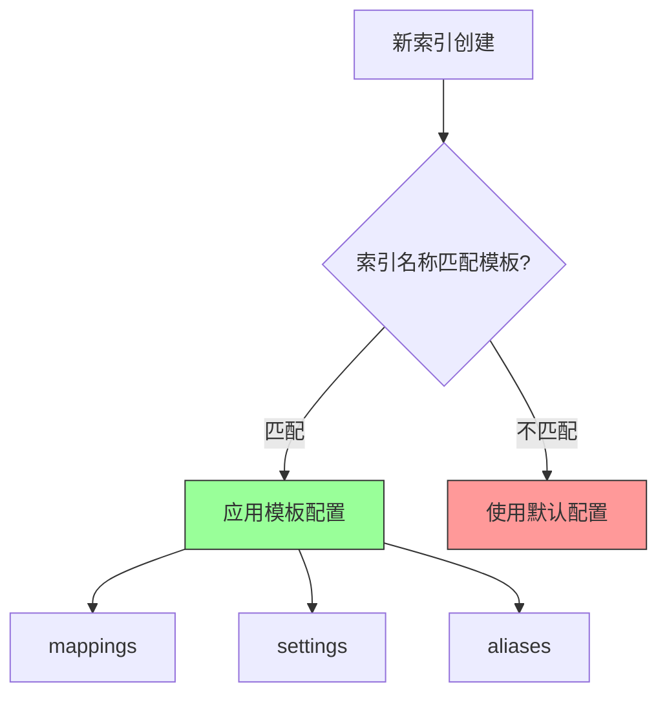

### 6.2 可组合索引模板

Elasticsearch 7.8+ 引入了可组合索引模板（Composable Index Templates），由两部分组成：索引模板（Index Template）和组件模板（Component Template）。

**创建索引模板：**

```http
PUT _index_template/cars_template
{
  "index_patterns": ["*cars*"],
  "priority": 1,
  "template": {
    "mappings": {
      "properties": {
        "created_at": {
          "type": "date"
        },
        "created_by": {
          "type": "text"
        }
      }
    }
  }
}
```

当创建新索引（如 vintage_cars、sports_cars）时，如果名称匹配 `*cars*` 模式，模板会自动应用。

**模板优先级：**

如果多个模板匹配同一索引，优先级（priority）高的模板优先：

```http
POST _index_template/cars_template_mar21
{
  "index_patterns": ["*cars*"],
  "priority": 20,
  "template": { ... }
}

POST _index_template/cars_template_feb21
{
  "index_patterns": ["*cars*"],
  "priority": 30,
  "template": { ... }
}
```

当两个模板都匹配时，priority=30 的模板会被应用。

### 6.3 组件模板

组件模板是 可重用的配置块，可以被多个索引模板共享。这类似于面向对象编程中的组合模式。

**创建组件模板（设置）：**

```http
POST _component_template/dev_settings_component_template
{
  "template": {
    "settings": {
      "number_of_shards": 3,
      "number_of_replicas": 3
    }
  }
}
```

**创建组件模板（映射）：**

```http
POST _component_template/dev_mapping_component_template
{
  "template": {
    "mappings": {
      "properties": {
        "created_by": {
          "type": "text"
        },
        "version": {
          "type": "float"
        }
      }
    }
  }
}
```

**组合使用组件模板：**

```http
POST _index_template/composed_cars_template
{
  "index_patterns": ["*cars*"],
  "priority": 200,
  "composed_of": [
    "dev_settings_component_template",
    "dev_mapping_component_template"
  ]
}
```

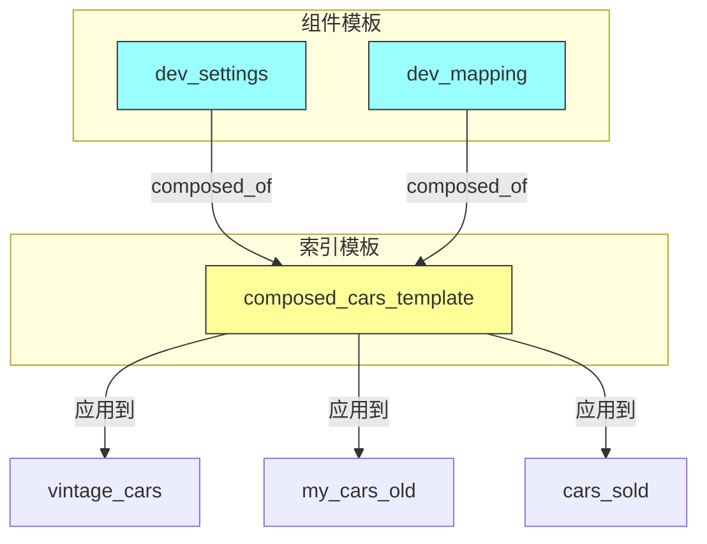

---

## 七、高级索引操作

### 7.1 拆分索引（Split）

当索引数据量增长导致性能下降时，可以通过拆分操作将索引扩展到更多分片。拆分会创建一个新索引（具有更多分片），并将数据从原索引迁移过去。

**前置条件：**

1. 将原索引设置为只读
2. 目标索引的分片数必须是原分片数的倍数
3. 目标索引的分片数必须大于原分片数

```http
PUT all_cars/_settings
{
  "settings": {
    "index.blocks.write": true
  }
}

POST all_cars/_split/all_cars_new
{
  "settings": {
    "index.number_of_shards": 12
  }
}
```

如果原索引有 3 个分片，目标索引可以是 3、6、9、12 等。试图创建非倍数的分片数将失败。

### 7.2 收缩索引（Shrink）

收缩是与拆分相反的操作，用于将分片较多的索引收缩为分片较少的索引。适用于数据量减少或需要合并分片的场景。

**前置条件：**

1. 将原索引设置为只读
2. 所有分片必须位于同一节点
3. 目标分片数必须是原分片数的因数

```http
PUT all_cars/_settings
{
  "settings": {
    "index.blocks.write": true,
    "index.routing.allocation.require._name": "node1"
  }
}

PUT all_cars/_shrink/all_cars_new
{
  "settings": {
    "index.blocks.write": null,
    "index.routing.allocation.require._name": null,
    "index.number_of_shards": 1,
    "index.number_of_replicas": 5
  }
}
```

### 7.3 滚动索引（Rollover）

滚动索引是时间序列数据的常用模式。当索引达到一定条件（如大小、文档数、时间）时，自动创建新索引并将写入切换到新索引。

**创建带别名的初始索引：**

```http
POST _aliases
{
  "actions": [
    {
      "add": {
        "index": "cars_2021-000001",
        "alias": "latest_cars_a",
        "is_write_index": true
      }
    }
  ]
}
```

**触发滚动：**

```http
POST latest_cars_a/_rollover
```

滚动成功后，会创建 cars_2021-000002，别名自动指向新索引。

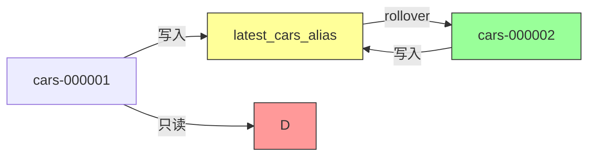

---

## 八、索引生命周期管理（ILM）

### 8.1 ILM 概述

索引生命周期管理（Index Lifecycle Management，ILM）是 Elasticsearch 提供的自动化索引管理功能。它基于策略（Policy）自动管理索引在不同的生命周期阶段的转换。ILM 特别适合时间序列数据，如日志、指标、APM 数据等。

ILM 的核心概念：

- **策略（Policy）**：定义索引生命周期各阶段的规则
- **阶段（Phase）**：索引生命周期的各个时期（Hot、Warm、Cold、Frozen、Delete）
- **操作（Action）**：在每个阶段执行的具体动作

### 8.2 生命周期阶段

索引在生命周期中会经历五个阶段：

**Hot（热阶段）** 是索引最活跃的时期，处于完全运行模式，支持读写操作。数据频繁写入和查询，这是唯一允许写入的阶段。

**Warm（暖阶段）** 索引变为只读模式，不再接受新文档，但仍然开放用于查询。可以执行压缩、合并等优化操作。

**Cold（冷阶段）** 索引继续为只读，但查询频率降低。可以将数据迁移到更便宜的存储，查询响应可能变慢。

**Frozen（冻结阶段）** 索引完全只读，查询非常稀少或几乎不做查询。释放更多内存资源。

**Delete（删除阶段）** 索引的最终阶段，数据被永久删除，释放存储资源。

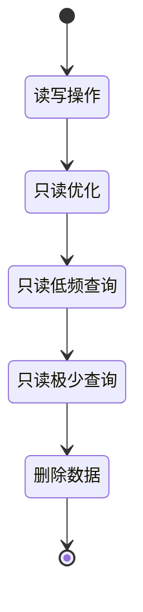

### 8.3 创建 ILM 策略

**创建简单的生命周期策略：**

```http
PUT _ilm/policy/hot_delete_policy
{
  "policy": {
    "phases": {
      "hot": {
        "min_age": "1d",
        "actions": {
          "set_priority": {
            "priority": 250
          }
        }
      },
      "delete": {
        "actions": {
          "delete": {}
        }
      }
    }
  }
}
```

这个策略定义了两个阶段：热阶段持续 1 天后，执行设置优先级操作；然后进入删除阶段，自动删除索引。

**关联策略到索引：**

```http
PUT hot_delete_policy_index
{
  "settings": {
    "index.lifecycle.name": "hot_delete_policy"
  }
}
```

### 8.4 带滚动条件的 ILM

对于需要根据条件自动滚动的场景：

```http
PUT _ilm/policy/hot_rollover_policy
{
  "policy": {
    "phases": {
      "hot": {
        "min_age": "0ms",
        "actions": {
          "rollover": {
            "max_age": "30d",
            "max_size": "50gb",
            "max_docs": 10000
          },
          "set_priority": {
            "priority": 100
          }
        }
      },
      "warm": {
        "min_age": "30d",
        "actions": {
          "shrink": {
            "number_of_shards": 1
          },
          "forcemerge": {
            "max_num_segments": 1
          }
        }
      },
      "delete": {
        "min_age": "90d",
        "actions": {
          "delete": {}
        }
      }
    }
  }
}
```

这个完整的策略定义了：热阶段立即生效，当索引满足任一条件（30天、50GB、10000文档）时自动滚动；30天后进入暖阶段，执行收缩和强制合并；90天后删除索引。

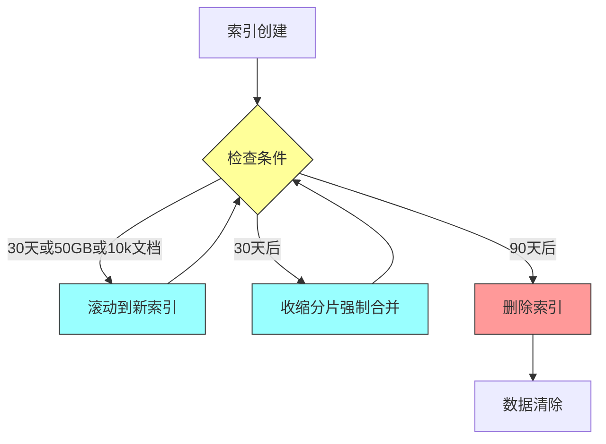

---

## 九、索引监控与统计

### 9.1 获取索引统计信息

Elasticsearch 提供了丰富的统计 API 来监控索引状态：

```http
GET cars/_stats
```

返回的信息包括：文档数量和已删除文档数、存储大小、搜索请求统计、刷新和合并统计等。

```http
GET cars1,cars2,cars3/_stats
GET */_stats
```

### 9.2 索引段信息

查看索引的底层段信息：

```http
GET cars/_segments
```

返回每个分片的段信息，包括：段数量、内存使用、文档数（包括已删除）、磁盘大小等。这对于性能调优和问题排查非常有帮助。

---

## 十、总结与最佳实践

### 10.1 核心要点回顾

本章涵盖了 Elasticsearch 索引操作的方方面面：创建索引的两种方式（隐式和显式）以及各自的适用场景；索引的三大配置（设置、映射、别名）及其作用；静态设置与动态设置的区别及运维注意事项；索引模板和组件模板实现配置标准化；拆分、收缩、滚动等高级操作；ILM 实现自动化生命周期管理。

### 10.2 生产环境最佳实践

**索引设计阶段：**
- 根据数据量和查询模式合理规划分片数量
- 为时间序列数据使用 ILM + Rollover
- 使用索引模板确保配置一致性
- 预先定义映射而非依赖动态映射

**运维阶段：**
- 优先使用别名而非直接操作索引
- 利用 ILM 实现自动化管理
- 定期监控索引统计信息
- 谨慎操作删除和关闭索引

**性能优化：**
- 合理设置刷新间隔（在写入性能和查询可见性之间平衡）
- 使用最佳压缩编解码器节省存储
- 适时收缩和合并索引

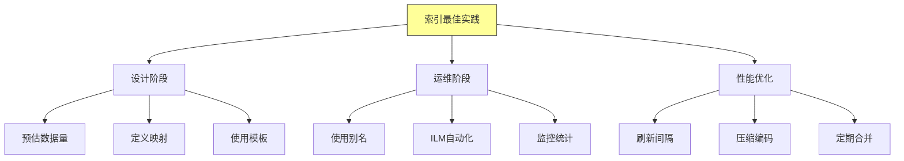

---

## 十一、常见问题

**Q1：主分片数量可以修改吗？**
不可以。主分片数量是静态设置，只能在索引创建时确定。如果需要修改，只能通过拆分或收缩操作重建索引。

**Q2：什么时候使用索引别名？**
别名的主要用途包括：跨多索引查询、零停机数据迁移、简化应用程序的索引引用、读写分离。

**Q3：如何选择 ILM 各阶段的配置？**
Hot 阶段保持默认配置以获得最佳写入性能；Warm 阶段收缩分片并压缩数据；Cold 阶段将数据迁移到低成本存储；Delete 阶段根据数据保留策略删除过期数据。

**Q4：索引模板的优先级有什么作用？**
当多个模板匹配同一索引时，优先级高的模板被优先应用。如果多个模板有冲突配置，优先级高的会覆盖优先级低的。

**Q5：如何决定分片和副本数量？**
主分片数量取决于数据量和查询模式，建议每个分片数据量不超过 50GB；副本数量取决于高可用要求，通常为 1-2 个。
