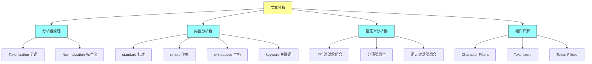
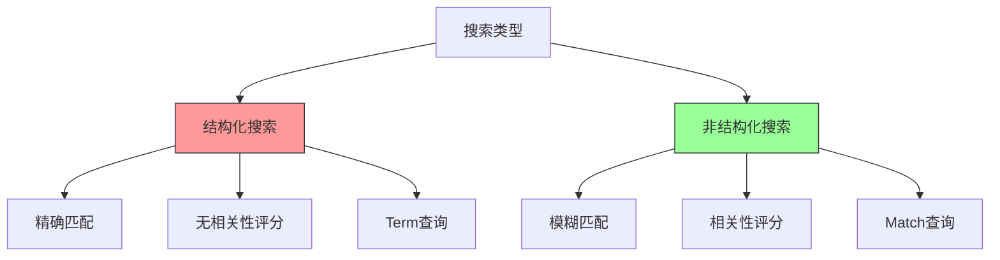
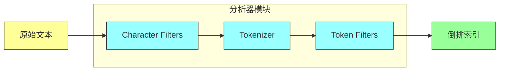
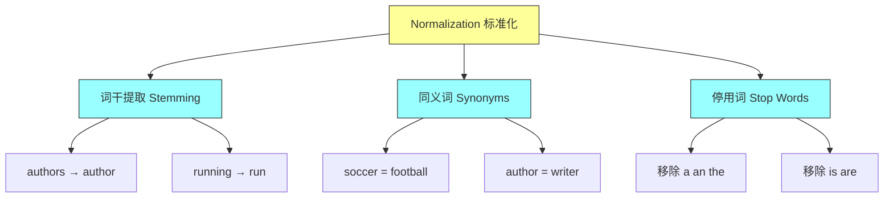
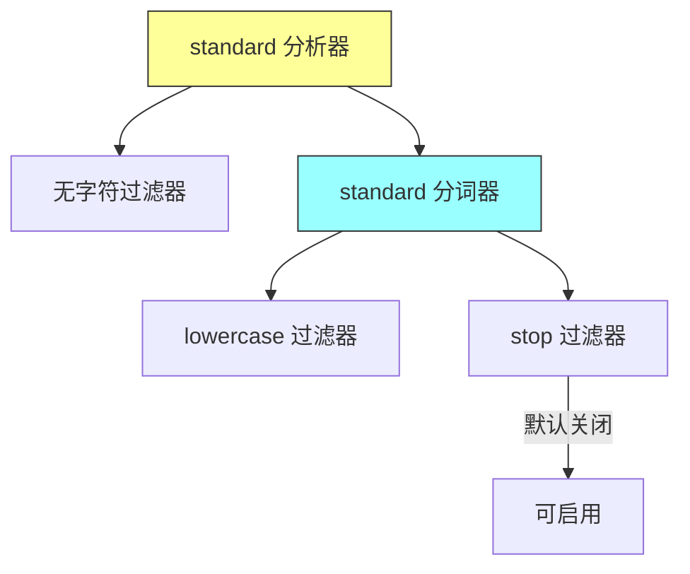
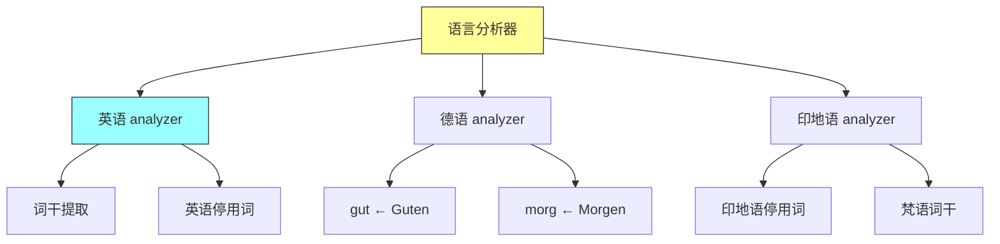
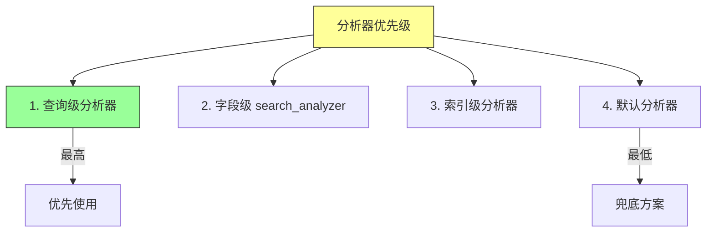

# Elasticsearch in Action - 第七章：Text Analysis（文本分析）

## 一、本章概述

本章深入探讨 Elasticsearch 中文本分析的核心机制，这是实现智能搜索的关键技术。当用户在搜索引擎中输入查询词时，他们期望获得相关结果，即使查询词与索引中的文本存在同义词、缩写、拼写错误或词根变化等差异。文本分析正是 Elasticsearch 处理这些复杂场景的核心能力。

本章首先介绍结构化搜索与非结构化搜索的区别，帮助读者理解文本分析的应用场景。然后深入剖析分析器（Analyzer）的内部组成：字符过滤器（Character Filters）、分词器（Tokenizers）和词元过滤器（Token Filters）。我们将详细讲解 Elasticsearch 提供的 8 种内置分析器，包括 standard、simple、stop、whitespace、keyword、fingerprint、pattern 和各种语言分析器。此外，还包括自定义分析器的创建方法、分析器在不同层级（索引级、字段级、查询级）的配置，以及字符过滤器、分词器和词元过滤器的具体使用场景。



### 本章学习目标

通过本章的学习，你将掌握以下核心技能：理解文本分析在搜索中的重要性，掌握分析器的基本组成和工作原理；能够使用 _analyze API 测试分析器效果；根据业务需求选择和配置合适的内置分析器；创建自定义分析器满足特殊场景需求；在索引和搜索时指定不同的分析器；使用字符过滤器、分词器和词元过滤器构建强大的文本处理 pipeline。

---

## 二、快速上手

### 2.1 环境准备

在使用文本分析功能之前，确保 Elasticsearch 集群正常运行。本章所有示例都使用 _analyze 端点进行测试，无需创建实际索引即可验证分析器效果。

### 2.2 第一个分析器测试

让我们从最简单的例子开始，了解文本分析的基本流程：

```http
GET _analyze
{
  "text": "James Bond 007"
}
```

执行后返回的分词结果：

```json
{
  "tokens": [
    {"token": "james", "start_offset": 0, "end_offset": 5, "type": "<ALPHANUM>", "position": 0},
    {"token": "bond", "start_offset": 6, "end_offset": 10, "type": "<ALPHANUM>", "position": 1},
    {"token": "007", "start_offset": 11, "end_offset": 14, "type": "NUM", "position": 2}
  ]
}
```

可以看到，文本被分解为三个 token：james、bond 和 007。由于未指定分析器，Elasticsearch 默认使用 standard 分析器。

### 2.3 显式指定分析器

```http
GET _analyze
{
  "text": "James Bond 007",
  "analyzer": "simple"
}
```

使用 simple 分析器时，非字母字符会被作为分词边界，因此 "007" 会被截断，只产生 "james" 和 "bond" 两个 token。

### 2.4 自定义组合分析器

```http
GET _analyze
{
  "tokenizer": "path_hierarchy",
  "filter": ["uppercase"],
  "text": "/Volumes/FILES/Dev"
}
```

这个示例组合了 path_hierarchy 分词器和大写过滤器，输出结果为 ["/VOLUMES", "/VOLUMES/FILES", "/VOLUMES/FILES/DEV"]。

---

## 三、核心概念

### 3.1 结构化搜索与非结构化搜索

**结构化搜索**用于精确匹配场景，如查找特定日期范围的航班、畅销书排行榜等。查询结果要么匹配要么不匹配，不涉及相关性评分。

**非结构化搜索**用于模糊匹配场景，搜索引擎不仅判断是否匹配，还计算相关性分数。分数越高表示文档与查询条件越相关。例如搜索 "Konda" 应该返回《Elasticsearch in Action》以及作者的其他书籍。



### 3.2 分析器的解剖

分析器（Analyzer）是文本分析的核心模块，由三个组件构成：字符过滤器、分词器和词元过滤器。



**字符过滤器（Character Filters）**：在字符级别处理原始文本，可移除 HTML 标签、进行字符映射或正则替换。字符过滤器是可选的，一个分析器可以包含零个或多个。

**分词器（Tokenizer）**：将文本分割为独立的词元（Tokens）。每个分析器必须包含且仅包含一个分词器。

**词元过滤器（Token Filters）**：对分词器产生的词元进行进一步处理，如小写转换、同义词扩展、词干提取等。词元过滤器是可选的，一个分析器可以包含零个或多个。

### 3.3 Tokenization 分词

分词是将句子按照特定规则拆分为独立单词的过程。例如使用 whitespace 分词器时，"Hello World" 会被拆分为 "Hello" 和 "World" 两个词元。

### 3.4 Normalization 标准化

标准化是对分词后的词元进行转换和增强的过程，主要包括：

- **词干提取（Stemming）**：将单词还原为词根形式，如 "running"、"runs" 还原为 "run"
- **同义词（Synonyms）**：添加同义词到索引，如 "soccer" 添加同义词 "football"
- **停用词（Stop Words）**：移除常见但无意义的词，如 "a"、"an"、"the"



---

## 四、实际场景示例

### 4.1 内置分析器详解

#### 4.1.1 Standard 分析器

Standard 是 Elasticsearch 默认的分析器，按空格和标点符号分词，并小写所有词元。

```http
GET _analyze
{
  "text": "Hot cup of coffee and a Weird Combo",
  "analyzer": "standard"
}
```

输出：["hot", "cup", "of", "coffee", "and", "a", "weird", "combo"]

Standard 分析器的组成：
- 分词器：standard
- 词元过滤器：lowercase（默认启用）
- 词元过滤器：stop（默认禁用）



#### 4.1.2 Simple 分析器

Simple 分析器在遇到非字母字符时进行分词。

```http
GET _analyze
{
  "text": "Lukša's K8s in Action",
  "analyzer": "simple"
}
```

输出：["lukša", "s", "k", "s", "in", "action"]

可以看到 "K8s" 被拆分为 "k" 和 "s"，因为数字是非字母字符。

#### 4.1.3 Whitespace 分析器

Whitespace 仅按空格分词，保留大小写。

```http
GET _analyze
{
  "text": "Peter_Piper picked a peck of PICKLED-peppers",
  "analyzer": "whitespace"
}
```

输出：["Peter_Piper", "picked", "a", "peck", "of", "PICKLED-peppers"]

下划线和连字符不会被作为分词边界，且大小写保持不变。

#### 4.1.4 Keyword 分析器

Keyword 分析器不做任何处理，文本保持原样存储为一个词元。

```http
GET _analyze
{
  "text": "Elasticsearch in Action",
  "analyzer": "keyword"
}
```

输出：["Elasticsearch in Action"]（单一词元）

这意味着搜索时必须使用完整匹配，无法进行分词搜索。

#### 4.1.5 Fingerprint 分析器

Fingerprint 分析器对词元排序、去重并连接为单一词元。

```http
GET _analyze
{
  "text": "A dosa is a thin pancake from South India",
  "analyzer": "fingerprint"
}
```

输出：["a dosa is a thin pancake from south india"]

特点：去重、排序、小写、连接为单一词元。

#### 4.1.6 语言分析器

Elasticsearch 提供多种语言分析器，包括英语、德语、西班牙语、法语、印地语等。

```http
POST _analyze
{
  "text": "She sells Sea Shells on the Sea Shore",
  "analyzer": "english"
}
```

输出：["she", "sell", "sea", "shell", "sea", "shore"]

英语分析器自动进行词干提取，"sells" 和 "Shells" 被还原为 "sell" 和 "shell"。



### 4.2 自定义分析器

当内置分析器无法满足需求时，可以创建自定义分析器。

```http
PUT index_with_custom_analyzer
{
  "settings": {
    "analysis": {
      "analyzer": {
        "custom_analyzer": {
          "type": "custom",
          "char_filter": ["html_strip"],
          "tokenizer": "standard",
          "filter": ["uppercase"]
        }
      }
    }
  }
}
```

测试自定义分析器：

```http
POST index_with_custom_analyzer/_analyze
{
  "text": "<H1>HELLO, WoRLD</H1>",
  "analyzer": "custom_analyzer"
}
```

输出：["HELLO", "WORLD"]

处理流程：
1. html_strip 移除 HTML 标签
2. standard 分词器按空格和标点分词
3. uppercase 过滤器将词元转为大写

### 4.3 配置停用词

可以启用英语停用词过滤：

```http
PUT my_index_with_stopwords
{
  "settings": {
    "analysis": {
      "analyzer": {
        "standard_with_stopwords": {
          "type": "standard",
          "stopwords": "_english_"
        }
      }
    }
  }
}
```

测试效果：

```http
POST my_index_with_stopwords/_analyze
{
  "text": ["Hot cup of coffee and a Weird Combo"],
  "analyzer": "standard_with_stopwords"
}
```

输出：["hot", "cup", "weird", "combo"]

可以看到 "of"、"and"、"a" 等停用词被移除。

### 4.4 同义词过滤器

```http
PUT index_with_synonyms
{
  "settings": {
    "analysis": {
      "filter": {
        "synonyms_filter": {
          "type": "synonym",
          "synonyms": ["soccer => football"]
        }
      }
    }
  }
}
```

测试同义词：

```http
POST index_with_synonyms/_analyze
{
  "text": "What's soccer?",
  "tokenizer": "standard",
  "filter": ["synonyms_filter"]
}
```

输出：["what's", "football"]

"soccer" 被替换为 "football" 同义词。

### 4.5 NGram 和 Edge NGram 分词器

NGram 用于模糊匹配和拼写纠错。对于单词 "bond"：
- Bi-grams (2-gram): "bo", "on", "nd"
- Tri-grams (3-gram): "bon", "ond"

```http
PUT index_with_ngram
{
  "settings": {
    "analysis": {
      "analyzer": {
        "ngram_analyzer": {
          "tokenizer": "ngram_tokenizer"
        }
      },
      "tokenizer": {
        "ngram_tokenizer": {
          "type": "ngram",
          "min_gram": 2,
          "max_gram": 3,
          "token_chars": ["letter"]
        }
      }
    }
  }
}
```

```http
POST index_with_ngram/_analyze
{
  "text": "bond",
  "analyzer": "ngram_analyzer"
}
```

输出：["bo", "bon", "on", "ond", "nd"]

Edge NGram 从单词开头开始生成 n-gram：

```http
POST index_with_edge_ngram/_analyze
{
  "text": "bond",
  "analyzer": "edge_ngram_analyzer"
}
```

输出：["b", "bo", "bon", "bond"]

### 4.6 分词器优先级

在索引和搜索时可以指定不同的分析器，优先级如下：



**配置字段级搜索分析器：**

```http
PUT authors_index_with_both_analyzers
{
  "mappings": {
    "properties": {
      "author_name": {
        "type": "text",
        "analyzer": "standard",
        "search_analyzer": "simple"
      }
    }
  }
}
```

这个配置表示索引时使用 standard 分析器，搜索时使用 simple 分析器。

---

## 五、最佳实践

### 5.1 选择合适的分析器

| 场景 | 推荐分析器 | 原因 |
|------|------------|------|
| 通用英文文本 | standard | 默认选项，处理大多数场景 |
| 精确匹配 | keyword | 不进行任何分词 |
| 标签/代码 | simple | 按非字母字符分词 |
| 日志分析 | whitespace | 保留原始格式 |
| 去重检测 | fingerprint | 生成唯一标识 |
| 多语言内容 | language | 针对特定语言优化 |

### 5.2 停用词的使用建议

- **启用场景**：文档量较大，需要排除常见词减少索引大小时
- **禁用场景**：搜索短文本，停用词可能包含重要信息时

### 5.3 词干提取的注意事项

词干提取可能导致过度还原，例如 "authorization" 会被还原为 "author"。可以使用 stem_exclusion 排除特定词：

```http
PUT index_with_stem_exclusion
{
  "settings": {
    "analysis": {
      "analyzer": {
        "stem_exclusion_analyzer": {
          "type": "english",
          "stem_exclusion": ["authorization", "authority"]
        }
      }
    }
  }
}
```

### 5.4 NGram 使用场景

- **模糊搜索**：用户可能拼写错误
- **自动补全**：prefix 查询的补充
- **建议功能**：搜索建议器

注意：NGram 会增加索引体积，建议在满足需求的前提下使用较大的 min_gram 值。

### 5.5 测试驱动配置

在生产环境使用分析器之前，务必使用 _analyze API 进行充分测试：

```http
POST your_index/_analyze
{
  "text": "your test text here",
  "analyzer": "your_custom_analyzer"
}
```

验证输出是否符合预期，再将配置应用到实际索引。

---

## 六、常见问题

**Q1：分析器在什么时候起作用？**

分析器在两个阶段起作用：索引时（写入文档）和搜索时（查询词）。两者可以使用不同的分析器。

**Q2：文本字段一定会被分析吗？**

不是。只有 text 类型字段会被分析。keyword、date、number 等类型不会被分析。

**Q3：如何查看字段使用了什么分析器？**

```http
GET your_index/_mapping
```

在返回的映射中可以查看每个字段的 analyzer 属性。

**Q4：为什么搜索不到预期结果？**

可能的原因：索引时和搜索时使用的分析器不一致；分析器配置了停用词移除了查询词；词干提取过度还原了词元。建议使用 _analyze API 分别测试索引和搜索时的分析结果。

**Q5：如何选择 NGram 的 min_gram 和 max_gram？**

min_gram 决定最小匹配单元，建议设置为 2-3；max_gram 决定最大匹配单元，不宜过大以免影响索引体积。对于自动补全场景，edge_ngram 是更好的选择。

**Q6：同义词过滤器何时使用？**

当用户搜索 synonyms 时应该返回相关结果。例如搜索 "football" 和 "soccer" 都应返回足球相关文档。同义词需要在索引和搜索时同时生效。

---

## 七、实践练习

1. 使用 _analyze API 测试 standard、simple、whitespace、keyword 四种分析器的输出差异

2. 创建一个包含 HTML 标签的文本，分别使用默认分析和自定义分析（带 html_strip）进行测试

3. 配置一个支持同义词的分析器，实现 "手机 => 手机" 和 "电话 => 手机" 的双向同义词

4. 使用 NGram 分析器实现一个简单的模糊搜索功能

5. 配置一个英语分析器，启用停用词过滤，并测试对比启用前后的输出差异

6. 创建一个自定义分析器，组合使用 mapping 字符过滤器和 synonym 词元过滤器

---

## 本章小结

本章深入学习了 Elasticsearch 文本分析的核心知识。文本分析是实现智能搜索的基础，通过分析器可以将原始文本转换为适合搜索的词元。分析器由字符过滤器、分词器和词元过滤器三部分组成，每部分都可以根据需求进行定制。Elasticsearch 提供了 8 种内置分析器，覆盖大多数常见场景。当内置分析器无法满足需求时，可以通过组合现有组件创建自定义分析器。理解分析器的工作原理和选择技巧，对于构建高质量的搜索体验至关重要。
