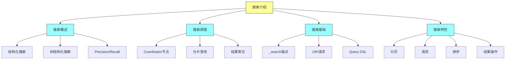
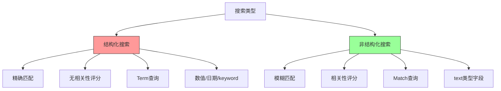
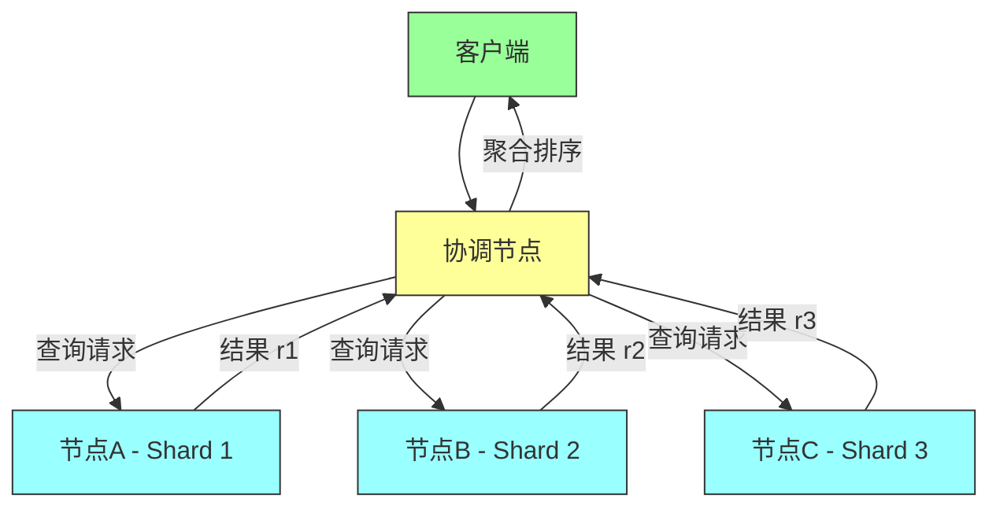
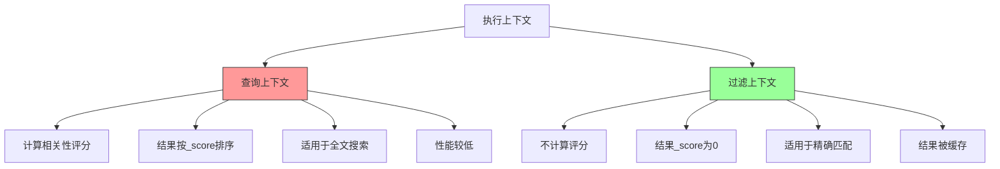
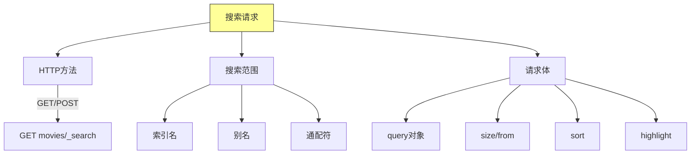

# Elasticsearch in Action - 第八章：Introducing Search（搜索介绍）

## 一、本章概述

本章深入探讨 Elasticsearch 搜索的核心机制，这是构建高效搜索应用的基础。当用户输入查询词时，搜索引擎不仅判断是否匹配，还会计算相关性分数，分数越高表示文档与查询条件越相关。结果按相关性分数降序排列，排在最顶部的是最匹配的文档。

然而，并非所有返回结果都是准确的。正如我们在 Google 上搜索时可能会遇到不相关的结果一样，Elasticsearch 也不可能返回 100% 精确的结果。这是因为 Elasticsearch 采用两种内部策略：精确度（Precision）和召回率（Recall），它们共同影响搜索结果的相关性。精确度是指检索到的相关文档占索引中所有可用文档的百分比，召回率是指检索到的相关文档占所有相关文档的百分比。这两个概念我们将在第十章详细讨论。

搜索功能在各种查询类型中都是通用的，无论是全文搜索、词项级搜索还是地理空间搜索。本章将详细讲解搜索的工作机制，包括搜索请求的构成、响应结果的解析，以及各种搜索特性的实际应用。



### 本章学习目标

通过本章的学习，你将掌握以下核心技能：理解结构化搜索与非结构化搜索的区别；掌握搜索的工作原理，包括协调节点的角色和查询执行流程；熟练使用 _search 端点进行搜索；区分 URI 请求方式和 Query DSL 的使用场景；理解查询上下文与过滤上下文的差异；掌握分页、高亮、排序、结果操作等搜索特性；能够解释相关性评分机制并进行调优。

---

## 二、快速上手

### 2.1 环境准备

在使用搜索功能之前，确保 Elasticsearch 集群正常运行。本章使用 movies 索引作为示例数据集，通过 _bulk API 导入测试电影数据。

### 2.2 创建 movies 索引映射

首先创建 movies 索引的映射定义，指定各字段的数据类型：

```http
PUT movies
{
  "mappings": {
    "properties": {
      "title": {
        "type": "text",
        "fields": {
          "original": {
            "type": "keyword"
          }
        }
      },
      "synopsis": {
        "type": "text"
      },
      "actors": {
        "type": "text"
      },
      "director": {
        "type": "text"
      },
      "rating": {
        "type": "half_float"
      },
      "release_date": {
        "type": "date",
        "format": "dd-MM-yyyy"
      },
      "certificate": {
        "type": "keyword"
      },
      "genre": {
        "type": "text"
      }
    }
  }
}
```

注意：title 字段使用了 multi-field 特性，同时包含 text 类型（用于全文搜索）和 keyword 类型（用于精确匹配）。

### 2.3 第一个搜索查询

让我们从最简单的搜索开始：

```http
GET movies/_search?q=title:Godfather
```

这个 URI 请求方式搜索 title 字段包含 "Godfather" 的电影。执行后返回的结果会包含相关性评分。

### 2.4 使用 Query DSL

更强大的方式是使用 Query DSL：

```http
GET movies/_search
{
  "query": {
    "match": {
      "title": "Godfather"
    }
  }
}
```

这个查询返回两部 Godfather 电影，每部电影都带有相关性评分。第一部评分较高（2.879596），因为 "Godfather" 在较短标题（两个词）中匹配度更高。

---

## 三、核心概念

### 3.1 结构化搜索与非结构化搜索

**结构化搜索**用于精确匹配场景，处理数值、日期、IP 地址、枚举、keyword 类型等结构化数据。结构化搜索不关心相关性，只关心是否匹配——结果只有匹配或不匹配两种情况。

**非结构化搜索**用于全文搜索场景，处理 text 类型字段。搜索引擎会计算每个文档的相关性分数，分数越高表示文档与查询条件越匹配。结果按相关性分数降序排列。



### 3.2 搜索工作原理

当客户端发送搜索请求到 Elasticsearch 时，请求首先到达集群中的某个节点。这个节点充当协调节点（Coordinator Node）的角色，负责整个查询的协调工作。

协调节点收到请求后，首先确定哪些分片包含需要搜索的文档。每个索引由多个分片组成，这些分片分布在集群的不同节点上。协调节点向包含相关分片的节点发送查询请求。

各数据节点在本地分片上执行查询，提取匹配度最高的文档（默认返回前 10 个），然后将结果返回给协调节点。协调节点接收所有响应后，进行聚合和排序，最后将最终结果返回给客户端。



### 3.3 查询上下文与过滤上下文

Elasticsearch 执行搜索时有两种上下文：查询上下文（Query Context）和过滤上下文（Filter Context）。

**查询上下文**会计算相关性评分。每个匹配的文档都会获得一个 _score，表示文档与查询的匹配程度。查询上下文适用于全文搜索场景，需要对结果进行相关性排序。

**过滤上下文**不计算相关性评分，结果的 _score 固定为 0.0。过滤上下文适用于精确匹配场景，只需要判断是否匹配。由于不需要计算评分，过滤查询性能更好，而且结果会被缓存。



**查询上下文示例：**

```http
GET movies/_search
{
  "query": {
    "match": {
      "title": "Godfather"
    }
  }
}
```

**过滤上下文示例：**

```http
GET movies/_search
{
  "query": {
    "bool": {
      "filter": {
        "match": {
          "title": "Godfather"
        }
      }
    }
  }
}
```

### 3.4 搜索请求与响应结构

**搜索请求结构：**



**搜索响应结构：**

```json
{
  "took": 5,
  "timed_out": false,
  "_shards": {
    "total": 5,
    "successful": 5,
    "failed": 0
  },
  "hits": {
    "total": {"value": 2, "relation": "eq"},
    "max_score": 2.879596,
    "hits": [
      {
        "_index": "movies",
        "_id": "1",
        "_score": 2.879596,
        "_source": {
          "title": "The Godfather"
        }
      }
    ]
  }
}
```

- **took**：查询耗时（毫秒），从协调节点接收请求到返回响应的时间
- **timed_out**：是否超时
- **_shards**：分片信息，total 表示预期搜索的分片数，successful 表示成功返回结果的分片数
- **hits**：搜索结果，total 是匹配文档总数，max_score 是最高相关性分数

---

## 四、实际场景示例

### 4.1 URI 请求搜索

URI 请求是简单的搜索方式，将查询参数附加在 URL 中。

**按标题搜索：**

```http
GET movies/_search?q=title:Godfather
```

返回两部 Godfather 电影。

**多词搜索（默认 OR 逻辑）：**

```http
GET movies/_search?q=title:Godfather Knight Shawshank
```

返回四部电影：The Shawshank Redemption、The Dark Knight、The Godfather、The Godfather Part II。

**AND 逻辑：**

```http
GET movies/_search?q=title:Knight AND actors:Bale
```

只返回 The Dark Knight（同时满足标题包含 Knight 且演员包含 Bale）。

**设置默认操作符：**

```http
GET movies/_search?q=title:Godfather actors:Bale&default_operator=AND
```

**带参数的综合查询：**

```http
GET movies/_search?q=title:Godfather actors:(Brando OR Pacino) rating:(>=9.0 AND <=9.5)&from=0&size=10&explain=true&sort=rating&default_operator=AND
```

这个查询搜索：title 包含 Godfather，actors 包含 Brando 或 Pacino，rating 在 9.0 到 9.5 之间，返回第 1 页（每页 10 条），按 rating 排序，并解释评分计算。

### 4.2 Query DSL 查询

Query DSL 是构建复杂查询的首选方式，基于 JSON 格式。

**match 查询（全文搜索）：**

```http
GET movies/_search
{
  "query": {
    "match": {
      "title": "Godfather"
    }
  }
}
```

**multi_match 查询（多字段搜索）：**

```http
GET movies/_search
{
  "query": {
    "multi_match": {
      "query": "Lord",
      "fields": ["synopsis", "title"]
    }
  }
}
```

**match_phrase 查询（短语匹配）：**

```http
GET movies/_search
{
  "query": {
    "match_phrase": {
      "synopsis": "A meek hobbit from the shire and eight companions"
    }
  }
}
```

**bool 复合查询：**

```http
GET movies/_search
{
  "query": {
    "bool": {
      "must": [{"match": {"title": "Godfather"}}],
      "must_not": [{"range": {"rating": {"lt": 9.0}}}],
      "should": [{"match": {"actors": "Pacino"}}],
      "filter": [{"match": {"actors": "Brando"}}]
    }
  }
}
```

这个查询的含义：必须匹配 title 为 Godfather，rating 必须不小于 9.0，应该考虑包含 Pacino 的电影，最终过滤出包含 Brando 的电影。

**constant_score 查询：**

```http
GET movies/_search
{
  "query": {
    "constant_score": {
      "filter": {
        "match": {
          "title": "Godfather"
        }
      }
    }
  }
}
```

constant_score 将查询包装在 filter 中，以过滤上下文执行，不计算相关性评分。

### 4.3 分页功能

**基础分页：**

```http
GET movies/_search
{
  "size": 20,
  "query": {
    "match_all": {}
  }
}
```

返回前 20 条结果。默认 size 为 10，最大为 10000。

**分页查询：**

```http
GET movies/_search
{
  "size": 100,
  "from": 3,
  "query": {
    "match_all": {}
  }
}
```

返回第 4 页（每页 100 条），跳过前 300 条。

**调整最大窗口：**

```http
PUT movies/_settings
{
  "max_result_window": 20000
}
```

允许返回最多 20000 条结果。注意：深度分页建议使用 search_after 而不是大幅增加 max_result_window。

### 4.4 高亮功能

高亮在搜索结果中标记匹配的关键词，提升用户体验。

**基础高亮：**

```http
GET movies/_search
{
  "_source": false,
  "query": {
    "term": {
      "title": {
        "value": "godfather"
      }
    }
  },
  "highlight": {
    "fields": {
      "title": {}
    }
  }
}
```

返回结果中，匹配的词会被 `<em>` 标签包裹：
```json
"highlight": {
  "title": ["The <em>Godfather</em>"]
}
```

**自定义高亮标签：**

```http
GET movies/_search
{
  "query": {
    "match": {
      "title": "Godfather"
    }
  },
  "highlight": {
    "pre_tags": "{{",
    "post_tags": "}}",
    "fields": {
      "title": {}
    }
  }
}
```

结果变为：`The {{Godfather}}`

### 4.5 排序功能

**按相关性分数排序（默认）：**

```http
GET movies/_search
{
  "query": {
    "match": {
      "title": "Godfather"
    }
  },
  "sort": [
    "_score"
  ]
}
```

**按字段排序：**

```http
GET movies/_search
{
  "query": {
    "match": {
      "genre": "crime"
    }
  },
  "sort": [
    {"rating": {"order": "desc"}}
  ]
}
```

**多字段排序：**

```http
GET movies/_search
{
  "query": {
    "match": {
      "genre": "crime"
    }
  },
  "sort": [
    {"rating": {"order": "asc"}},
    {"release_date": {"order": "asc"}}
  ]
}
```

先按 rating 升序，rating 相同时按 release_date 升序。

**排序时仍计算评分：**

```http
GET movies/_search
{
  "track_scores": true,
  "query": {
    "match": {
      "genre": "crime"
    }
  },
  "sort": [
    {"rating": {"order": "asc"}}
  ]
}
```

### 4.6 结果操作

**抑制文档返回（只返回元数据）：**

```http
GET movies/_search
{
  "_source": false,
  "query": {
    "match": {
      "certificate": "R"
    }
  }
}
```

**只返回指定字段：**

```http
GET movies/_search
{
  "_source": false,
  "fields": ["title", "rating"],
  "query": {
    "match": {
      "certificate": "R"
    }
  }
}
```

**使用通配符选择字段：**

```http
GET movies/_search
{
  "_source": false,
  "fields": ["title*"],
  "query": {
    "match_all": {}
  }
}
```

**使用 script_fields 计算动态字段：**

```http
GET movies/_search
{
  "_source": ["title", "rating"],
  "query": {
    "match": {
      "certificate": "R"
    }
  },
  "script_fields": {
    "top_rated_movie": {
      "script": {
        "lang": "painless",
        "source": "if (doc['rating'].value > 9.0) 'true'; else 'false'"
      }
    }
  }
}
```

**source 过滤（includes/excludes）：**

```http
GET movies/_search
{
  "_source": {
    "includes": ["title*", "synopsis", "genre"],
    "excludes": ["title.original"]
  },
  "query": {
    "match_all": {}
  }
}
```

### 4.7 跨索引搜索

**搜索所有索引：**

```http
GET _search
{
  "query": {
    "match": {
      "actors": "Pacino"
    }
  }
}
```

**使用 indices_boost 调整评分：**

```http
GET movies*/_search
{
  "indices_boost": [
    {"movies": 0.1},
    {"movies_new": 0},
    {"movies_top": 2.0}
  ],
  "query": {
    "match": {
      "title": "Redemption"
    }
  }
}
```

这个查询将 movies_top 索引的评分提升 2 倍，movies 索引的评分降低到 10%，movies_new 索引不参与评分。

---

## 五、最佳实践

### 5.1 选择合适的查询方式

| 场景 | 推荐方式 | 原因 |
|------|----------|------|
| 简单查询 | URI 请求 | 快速便捷 |
| 复杂查询 | Query DSL | 功能强大，表达力强 |
| 精确匹配 | Filter Context | 性能好，结果可缓存 |
| 全文搜索 | Query Context | 计算相关性评分 |
| 生产环境 | Query DSL | 可维护性好，易调试 |

### 5.2 性能优化建议

**使用过滤上下文代替查询上下文：**

当不需要相关性评分时，使用 filter 或 bool 的 filter 子句，可以利用缓存提升性能。

**避免深度分页：**

不要使用大的 from 值，深度分页会导致性能问题。推荐使用 search_after 进行深度分页。

**控制返回字段：**

使用 _source 过滤只返回需要的字段，减少网络传输和数据处理开销。

**合理设置 size：**

默认 size 为 10，通常足够使用。如果需要更多结果，使用分页而不是一次性返回大量数据。

### 5.3 评分调优

**理解评分公式：**

相关性评分 = boost × IDF × TF

- **TF（Term Frequency）**：词项在文档中出现的频率，越高评分越高
- **IDF（Inverse Document Frequency）**：词项在整个索引中的稀有程度，越稀有评分越高
- **boost**：可以通过 boost 参数人为提升某个字段或查询的权重

**使用 explain 调试：**

```http
GET movies/_search
{
  "explain": true,
  "query": {
    "match": {
      "title": "Lord"
    }
  }
}
```

explain 返回详细的评分计算过程，帮助理解为什么某个文档获得特定评分。

---

## 六、常见问题

**Q1：搜索结果不准确怎么办？**

可能原因包括：分析器配置不一致导致索引和搜索时文本处理方式不同；评分公式参数需要调整；同义词配置不完整。建议使用 _analyze API 分别测试索引和搜索时的分词结果，使用 explain API 调试评分。

**Q2：如何实现精确匹配而不是全文搜索？**

对于 keyword 类型字段使用 term 查询；对于 text 类型字段但需要精确匹配，可以使用 fields 子句中的 keyword 子字段。

**Q3：分页结果中有重复文档？**

这通常发生在深度分页时，因为排序字段值相同导致结果不稳定。可以使用 search_after 替代 from/size，或者在排序条件中增加唯一字段（如 _id）作为次级排序。

**Q4：为什么过滤查询返回的结果 score 为 0？**

这是正常行为。过滤上下文不计算相关性评分，所有结果的 _score 固定为 0.0。这是为了性能优化，因为精确匹配不需要评分。

**Q5：如何实现搜索建议/自动补全？**

可以使用 completion suggester 或者利用 NGram/Edge NGram 结合 match 查询实现前缀匹配。建议功能需要专门的索引配置和查询方式。

**Q6：跨索引搜索时如何控制结果优先级？**

使用 indices_boost 为不同索引设置不同的评分权重，或者在查询中为不同索引的查询设置不同的 boost 值。

---

## 七、实践练习

1. 使用 URI 请求方式搜索 title 包含 "Lord" 的电影

2. 使用 Query DSL 实现相同搜索，比较两种方式的异同

3. 创建一个 bool 查询：搜索 genre 为 "Action"，rating 大于 8.0，不包含某个特定演员的电影

4. 实现分页功能：返回第 3 页，每页 20 条结果

5. 配置高亮功能，搜索结果中显示匹配的关键词

6. 按 rating 和 release_date 进行多字段排序

7. 使用 script_fields 计算高于平均评分的电影

8. 配置跨索引搜索，使用 indices_boost 提升某个索引的优先级

9. 使用 explain API 分析某个电影的评分计算过程

10. 尝试使用不同的过滤器和查询上下文，比较性能差异

---

## 本章小结

本章深入学习了 Elasticsearch 搜索的核心知识。搜索是 Elasticsearch 最核心的功能之一，通过 _search 端点可以执行各种复杂的搜索查询。

本章首先介绍了结构化搜索与非结构化搜索的区别，帮助读者理解不同场景下应使用何种搜索方式。然后详细讲解了搜索的工作原理，包括协调节点的角色、查询分发和结果聚合的过程。

搜索有两种执行上下文：查询上下文计算相关性评分，过滤上下文不计算评分但可以利用缓存。理解这两种上下文的差异对于编写高效的搜索查询至关重要。

Query DSL 是构建复杂搜索查询的首选方式，它提供了丰富的查询类型，包括叶子查询（match、term、range 等）和复合查询（bool、constant_score 等）。

搜索特性方面，本章介绍了分页（size/from、search_after）、高亮（highlight）、排序（sort）、结果操作（_source、fields、script_fields）以及跨索引搜索等常用功能。熟练掌握这些特性可以构建功能强大的搜索应用。

理解相关性评分的计算机制（TF × IDF × boost）对于调优搜索结果非常重要，Elasticsearch 提供了 explain 功能帮助调试评分计算过程。
