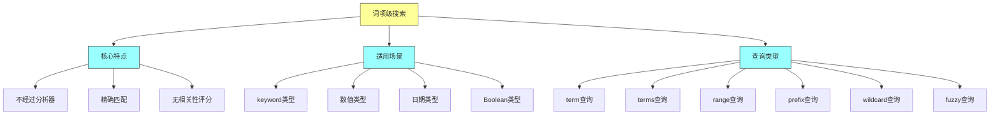
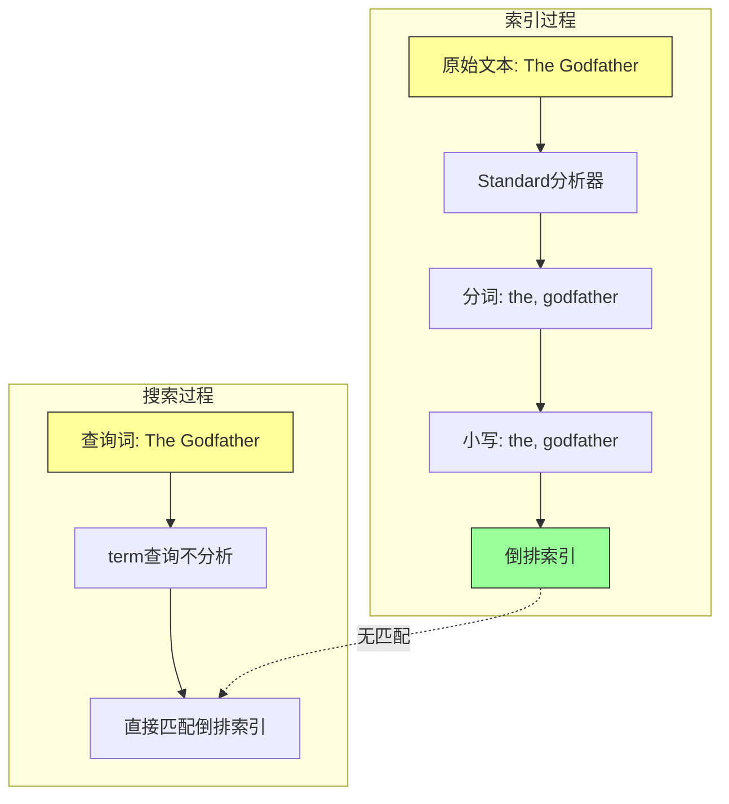
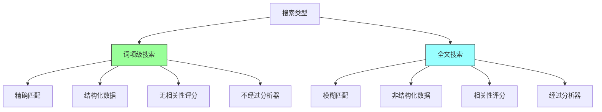
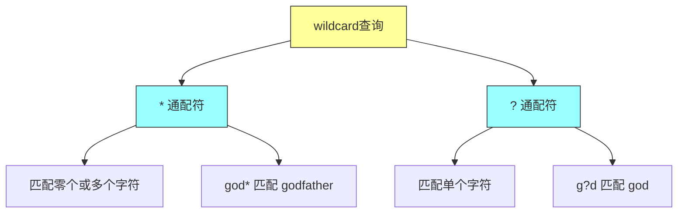
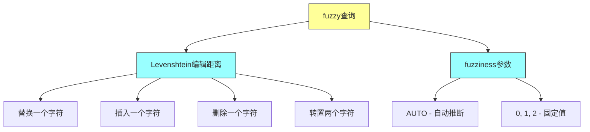

# Elasticsearch in Action - 第九章：Term-level Search（词项级搜索）

## 一、本章概述

本章深入探讨 Elasticsearch 中的词项级搜索（Term-level Search），这是处理结构化数据的核心查询方式。词项级搜索用于精确匹配场景，处理数值、日期、IP 地址、枚举、keyword 类型等结构化数据。与全文搜索不同，词项级搜索不关心相关性评分，只关心是否精确匹配——查询结果要么匹配要么不匹配，返回二进制的是/否结果。

词项级搜索产生的查询结果类似于数据库的 WHERE 子句：当条件满足时返回查询结果，否则不返回任何结果。虽然文档可能有关联的评分，但评分并不重要。文档如果匹配查询就返回，但不以相关性方式返回。实际上，我们可以使用 constant_score 运行词项级查询，这些查询可以被服务器缓存，从而在重新运行相同查询时提供性能优势。这类查询类似于传统数据库搜索。

词项级搜索的一个重要特点是它们不经过分析处理。与全文查询不同，词项查询不会对搜索词进行分词和分析。这意味着搜索词必须与倒排索引中存储的词精确匹配。



### 本章学习目标

通过本章的学习，你将掌握以下核心技能：理解词项级搜索与全文搜索的本质区别；掌握词项级查询不过分析器处理的核心原理；熟练使用 term、terms、ids、exists、range 等词项级查询；理解 wildcard、prefix、fuzzy 等模糊查询的使用场景和性能特点；掌握 prefix 查询的性能优化方法（index_prefixes）；理解 fuzzy 查询背后的 Levenshtein 编辑距离算法。

---

## 二、快速上手

### 2.1 环境准备

本章继续使用 movies 索引作为示例数据。确保 Elasticsearch 集群正常运行，movies 索引已创建并导入了测试数据。

movies 索引的映射定义：

```http
PUT movies
{
  "mappings": {
    "properties": {
      "title": {
        "type": "text",
        "fields": {
          "original": {
            "type": "keyword"
          }
        }
      },
      "actors": {
        "type": "text",
        "fields": {
          "original": {
            "type": "keyword"
          }
        }
      },
      "certificate": {
        "type": "keyword"
      },
      "rating": {
        "type": "half_float"
      },
      "release_date": {
        "type": "date",
        "format": "dd-MM-yyyy"
      }
    }
  }
}
```

### 2.2 第一个词项级查询

让我们从最简单的 term 查询开始：

```http
GET movies/_search
{
  "query": {
    "term": {
      "certificate": "R"
    }
  }
}
```

这个查询返回所有 R 级电影。注意：certificate 是 keyword 类型，所以搜索词 "R" 不会经过分析器处理，与索引中存储的值精确匹配。

### 2.3 理解"不经过分析器"

在 text 字段上使用 term 查询要特别注意。假设我们搜索 "The Godfather"：

```http
GET movies/_search
{
  "query": {
    "term": {
      "title": "The Godfather"
    }
  }
}
```

这个查询不会返回任何结果。原因如下：

1. 索引时：title 是 text 类型，会经过 standard 分析器处理，"The Godfather" 被分词并小写存储为 ["the", "godfather"]
2. 搜索时：term 查询不经过分析器，"The Godfather" 作为一个完整字符串与倒排索引匹配
3. 结果：倒排索引中没有 "The Godfather" 这个词元，所以匹配失败



---

## 三、核心概念

### 3.1 词项级搜索 vs 全文搜索

**词项级搜索**用于结构化数据，返回精确匹配结果，不计算相关性评分。适用于 keyword、数值、日期、Boolean 等字段。

**全文搜索**用于非结构化文本数据，计算相关性评分，返回按相关度排序的结果。适用于 text 类型字段。



### 3.2 为什么不适用于 text 字段

词项级查询不经过分析器处理，这意味着：

1. **大小写敏感**：搜索 "R" 不会匹配 "r"（因为 keyword 类型保留原始大小写）
2. **完整匹配**：搜索 "godfather" 不会匹配 "the godfather"（因为 text 字段被分词）
3. **分词问题**：搜索 "The Godfather" 不会匹配任何结果（因为倒排索引中存储的是分词后的词元）

适用于 text 字段的词项级查询的唯一情况是：当 text 字段包含枚举值或常量值时（如订单状态：CREATED、CANCELLED、FULFILLED）。

### 3.3 完整语法 vs 简写语法

term 查询有两种写法：

**完整语法：**

```http
GET movies/_search
{
  "query": {
    "term": {
      "certificate": {
        "value": "R",
        "boost": 2.0
      }
    }
  }
}
```

**简写语法：**

```http
GET movies/_search
{
  "query": {
    "term": {
      "certificate": "R"
    }
  }
}
```

完整语法允许我们添加 boost 参数来调整查询权重。

---

## 四、实际场景示例

### 4.1 term 查询

term 查询用于精确匹配单个值。

**基础 term 查询：**

```http
GET movies/_search
{
  "query": {
    "term": {
      "certificate": "R"
    }
  }
}
```

返回所有 R 级电影。

**term 查询在 text 字段上的问题：**

```http
GET movies/_search
{
  "query": {
    "term": {
      "title": "godfather"
    }
  }
}
```

搜索 "godfather" 可以返回结果，因为 "godfather" 作为完整词元存在于倒排索引中。但搜索 "The Godfather" 不会返回结果。

### 4.2 terms 查询

terms 查询用于在单个字段上搜索多个值。

```http
GET movies/_search
{
  "query": {
    "terms": {
      "certificate": ["PG-13", "R"]
    }
  }
}
```

返回 PG-13 和 R 级的所有电影。

**terms 数量限制：**

默认最多支持 65,536 个词项。可以调整：

```http
PUT movies/_settings
{
  "index": {
    "max_terms_count": 10
  }
}
```

### 4.3 terms lookup 查询

terms lookup 允许从其他文档获取查询条件。

```http
PUT classic_movies/_doc/1
{"title": "Jaws", "director": "Steven Spielberg"}
PUT classic_movies/_doc/2
{"title": "Jaws II", "director": "Jeannot Szwarc"}
PUT classic_movies/_doc/3
{"title": "Ready Player One", "director": "Steven Spielberg"}
```

使用 terms lookup 查询：

```http
GET classic_movies/_search
{
  "query": {
    "terms": {
      "director": {
        "index": "classic_movies",
        "id": "3",
        "path": "director"
      }
    }
  }
}
```

这个查询从 classic_movies 索引中获取 ID 为 3 的文档的 director 字段值，然后用这些值作为查询条件。返回由 Steven Spielberg 导演的所有电影。

### 4.4 ids 查询

根据文档 ID 批量获取文档。

```http
GET movies/_search
{
  "query": {
    "ids": {
      "values": [10, 4, 6, 8]
    }
  }
}
```

返回 ID 为 10、4、6、8 的四个文档。

也可以使用 terms 查询实现相同功能：

```http
GET movies/_search
{
  "query": {
    "terms": {
      "_id": [10, 4, 6, 8]
    }
  }
}
```

### 4.5 exists 查询

exists 查询用于检查字段是否存在。

**检查字段是否存在：**

```http
GET movies/_search
{
  "query": {
    "exists": {
      "field": "title"
    }
  }
}
```

返回所有包含 title 字段的文档。

**查找缺少某字段的文档：**

```http
PUT top_secret_files/_doc/1
{"code": "Flying Bird", "confidential": true}
PUT top_secret_files/_doc/2
{"code": "Cold Rock"}

GET top_secret_files/_search
{
  "query": {
    "bool": {
      "must_not": [
        {
          "exists": {
            "field": "confidential"
          }
        }
      ]
    }
  }
}
```

返回所有没有 confidential 字段的文档（即非机密文档）。

### 4.6 range 查询

range 查询用于范围搜索。

**数值范围查询：**

```http
GET movies/_search
{
  "query": {
    "range": {
      "rating": {
        "gte": 9.0,
        "lte": 9.5
      }
    }
  }
}
```

返回评分在 9.0 到 9.5 之间的电影。

**日期范围查询：**

```http
GET movies/_search
{
  "query": {
    "range": {
      "release_date": {
        "gte": "01-01-1970"
      }
    }
  },
  "sort": [
    {"release_date": {"order": "asc"}}
  ]
}
```

返回 1970 年之后发行的所有电影，按发行日期升序排序。

**日期数学：**

Elasticsearch 支持强大的日期数学表达式：

```http
GET movies/_search
{
  "query": {
    "range": {
      "release_date": {
        "lte": "now-2d"
      }
    }
  }
}
```

返回两天前及之前发行的电影。

常用日期数学单位：

| 单位 | 含义 |
|------|------|
| y | 年 |
| M | 月 |
| w | 周 |
| d | 天 |
| h | 小时 |
| m | 分钟 |
| s | 秒 |

示例：
- `now-1y`：一年前
- `now-2w`：两周前
- `22-05-2023||-2d`：指定日期减2天

### 4.7 wildcard 查询

wildcard 查询使用通配符匹配词元。



**基础 wildcard 查询：**

```http
GET movies/_search
{
  "query": {
    "wildcard": {
      "title": {
        "value": "god*"
      }
    }
  }
}
```

返回所有 title 包含以 "god" 开头的词的的电影（The Godfather、The Godfather II、City of God 等）。

**词内通配符：**

```http
GET movies/_search
{
  "query": {
    "wildcard": {
      "title": {
        "value": "g*d"
      }
    }
  }
}
```

返回 The Good, the Bad and the Ugly 和 City of God。

**带高亮的 wildcard 查询：**

```http
GET movies/_search
{
  "_source": false,
  "query": {
    "wildcard": {
      "title": {
        "value": "g*d"
      }
    }
  },
  "highlight": {
    "fields": {
      "title": {}
    }
  }
}
```

返回结果中高亮匹配的词：
- "The <em>Good</em>, the Bad and the Ugly"
- "City of <em>God</em>"

**注意事项：wildcard 查询是"昂贵查询"**

wildcard、prefix、range、fuzzy、regex 等查询都属于"昂贵查询"，可能影响集群性能。可以禁用：

```http
PUT _cluster/settings
{
  "transient": {
    "search.allow_expensive_queries": false
  }
}
```

### 4.8 prefix 查询

prefix 查询用于前缀匹配。

```http
GET movies/_search
{
  "query": {
    "prefix": {
      "actors.original": {
        "value": "Mar"
      }
    }
  }
}
```

返回所有演员名字以 "Mar" 开头的电影（Marlon Brando、Mark Hamill、Martin Balsam）。

**简写语法：**

```http
GET movies/_search
{
  "query": {
    "prefix": {
      "actors.original": "Mar"
    }
  }
}
```

**带高亮的 prefix 查询：**

```http
GET movies/_search
{
  "_source": false,
  "query": {
    "prefix": {
      "actors.original": {
        "value": "Mar"
      }
    }
  },
  "highlight": {
    "fields": {
      "actors.original": {}
    }
  }
}
```

**prefix 查询优化：index_prefixes**

prefix 查询性能较差，可以通过 index_prefixes 优化：

```http
PUT boxoffice_hit_movies
{
  "mappings": {
    "properties": {
      "title": {
        "type": "text",
        "index_prefixes": {}
      }
    }
  }
}
```

索引时会自动创建前缀索引（前缀长度默认为 2-5 个字符），查询时直接使用预建前缀。

**自定义前缀长度：**

```http
PUT boxoffice_hit_movies_custom
{
  "mappings": {
    "properties": {
      "title": {
        "type": "text",
        "index_prefixes": {
          "min_chars": 4,
          "max_chars": 10
        }
      }
    }
  }
}
```

### 4.9 fuzzy 查询

fuzzy 查询基于 Levenshtein 编辑距离算法，实现拼写纠错。



**基础 fuzzy 查询：**

```http
GET movies/_search
{
  "query": {
    "fuzzy": {
      "genre": {
        "value": "rama",
        "fuzziness": 1
      }
    }
  }
}
```

搜索 "rama"（少了一个字母 d）会返回 "drama" 类型的电影。因为 fuzziness=1 允许一个字符的编辑距离。

**AUTO 自动推断：**

```http
GET movies/_search
{
  "query": {
    "fuzzy": {
      "genre": "rama"
    }
  }
}
```

使用默认的 AUTO 设置，根据词长自动推断编辑距离：

| 词长 | 编辑距离 |
|------|----------|
| 0-2 | 0 |
| 3-5 | 1 |
| >5 | 2 |

**两个字母错误：**

```http
GET movies/_search
{
  "query": {
    "fuzzy": {
      "genre": {
        "value": "ama",
        "fuzziness": 2
      }
    }
  }
}
```

搜索 "ama"（缺少两个字母）需要设置 fuzziness=2。

---

## 五、最佳实践

### 5.1 选择合适的查询类型

| 数据类型 | 推荐查询 | 原因 |
|----------|----------|------|
| keyword | term/terms | 精确匹配 |
| 数值/日期 | range | 范围查询 |
| ID 批量查询 | ids | 高效批量获取 |
| 字段存在性 | exists | 检查字段是否存在 |
| 前缀匹配 | prefix + index_prefixes | 优化后性能好 |
| 模糊匹配 | fuzzy | 拼写纠错 |
| 通配符 | wildcard | 灵活但性能差 |

### 5.2 性能优化建议

**避免在 text 字段上使用 term 查询：**

term 查询不经过分析器，在 text 字段上可能返回意外结果。如果必须在 text 字段上使用，确保字段值是枚举或常量。

**使用 filter 上下文：**

词项级查询通常不需要相关性评分，使用 filter 上下文可以利用缓存：

```http
GET movies/_search
{
  "query": {
    "bool": {
      "filter": [
        {"term": {"certificate": "R"}}
      ]
    }
  }
}
```

**优化 prefix 和 wildcard 查询：**

- 使用 index_prefixes 优化 prefix 查询
- 避免以 * 开头的 wildcard 查询
- 考虑使用 search.allow_expensive_queries 控制昂贵查询

**控制 fuzzy 查询的编辑距离：**

fuzziness 设置越高，查询越慢。根据实际需求选择合适的值，推荐使用 AUTO。

### 5.3 常见错误避免

**大小写问题：**

keyword 类型保留原始大小写，搜索时必须使用精确的大小写。如果需要忽略大小写，考虑使用 normalizer 或在查询时使用 lowercase 过滤器。

**分词问题：**

text 字段会被分词，term 查询无法匹配分词后的内容。如果需要精确匹配，使用字段的 keyword 子字段。

**日期格式：**

确保使用与映射中一致的日期格式。Elasticsearch 支持多种日期格式。

---

## 六、常见问题

**Q1：term 查询返回空结果怎么办？**

检查字段类型：term 查询只适用于 keyword、数值、日期等非 text 字段。检查搜索词大小写是否正确。检查字段是否经过分析器处理。

**Q2：为什么搜索小写 "r" 匹配不到 R 级电影？**

因为 certificate 是 keyword 类型，索引时值 "R" 不会经过分析器处理，保持原始大小写。term 查询也不经过分析器，所以搜索 "r" 不会匹配 "R"。

**Q3：wildcard 查询性能很差怎么办？**

wildcard 查询是昂贵查询。可以考虑：使用 prefix 查询代替（如果有前缀）；使用 index_prefixes 优化 prefix 查询；禁用通配符开头（*xxx）的查询；在设计阶段避免需要 wildcard 的场景。

**Q4：fuzzy 查询返回太多不相关结果？**

这是因为编辑距离设置过高。降低 fuzziness 值，或使用精确的数值而非 AUTO。

**Q5：如何实现搜索建议/自动补全？**

使用 prefix 查询配合 index_prefixes，或者使用 completion suggester。

**Q6：terms lookup 有什么用？**

terms lookup 允许从另一个文档动态获取查询条件，适用于：用户偏好查询、基于分类的筛选、动态查询条件等场景。

---

## 七、实践练习

1. 使用 term 查询搜索 certificate 为 "R" 的所有电影

2. 使用 terms 查询搜索多个证书级别的电影（PG-13、R、PG）

3. 使用 ids 查询获取指定 ID 的电影文档

4. 使用 exists 查询找出所有缺少某字段的文档

5. 使用 range 查询搜索评分在 8.0-9.0 之间的电影

6. 使用日期范围查询搜索特定年份范围的电影

7. 使用 wildcard 查询搜索标题包含特定模式的电影

8. 使用 prefix 查询搜索演员名字以特定前缀开头的电影

9. 创建带 index_prefixes 的索引并测试 prefix 查询性能

10. 使用 fuzzy 查询测试拼写纠错功能

11. 使用 bool 查询组合多个词项级查询条件

---

## 本章小结

本章深入学习了 Elasticsearch 词项级搜索的核心知识。词项级搜索是处理结构化数据的重要工具，与全文搜索有着本质的区别。

词项级搜索的核心特点是不经过分析器处理，这意味着搜索词会与倒排索引中存储的词元进行精确匹配。这一特性使得词项级搜索非常适合 keyword、数值、日期、Boolean 等结构化字段，但不太适合 text 字段（除非 text 字段包含枚举值）。

本章详细介绍了多种词项级查询：term 查询用于精确匹配单个值；terms 查询用于多值匹配，支持多达 65,536 个词项，还可以通过 terms lookup 从其他文档动态获取查询条件；ids 查询用于根据文档 ID 批量获取文档；exists 查询用于检查字段是否存在；range 查询用于数值和日期范围搜索，支持强大的日期数学表达式。

模糊查询方面，wildcard 查询使用通配符匹配，prefix 查询用于前缀匹配（可通过 index_prefixes 优化），fuzzy 查询基于 Levenshtein 编辑距离算法实现拼写纠错。这些查询都是"昂贵查询"，需要谨慎使用并考虑性能影响。

词项级搜索是 Elasticsearch 查询体系的重要组成部分，与下一章将要介绍的全文搜索相辅相成，共同构成强大的搜索能力。
