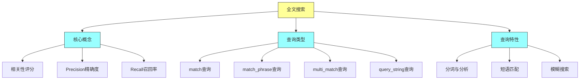
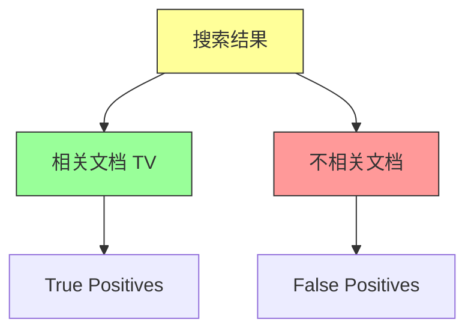
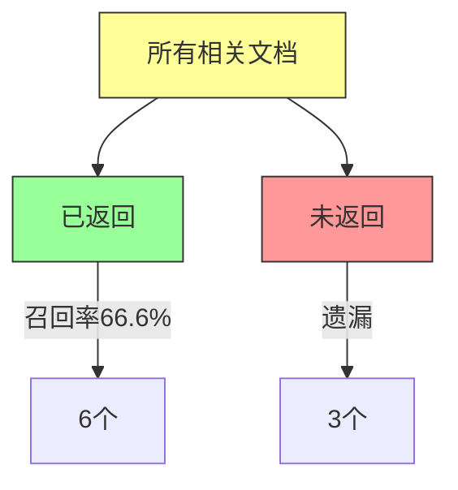
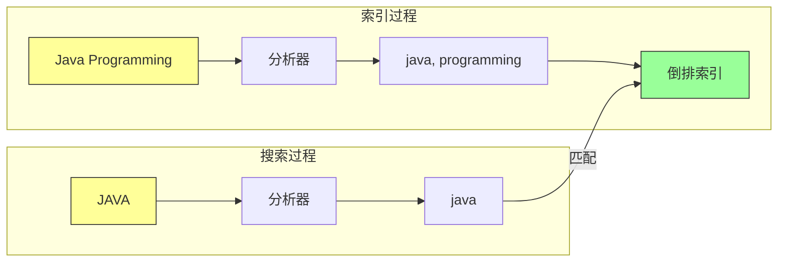

# Elasticsearch in Action - 第十章：Full-text Searches（全文搜索）

## 一、本章概述

本章深入探讨 Elasticsearch 中的全文搜索（Full-text Search），这是处理非结构化文本数据的核心查询方式。全文搜索与词项级搜索的本质区别在于：全文搜索会计算相关性评分，返回的文档按照与查询条件的相关程度进行排序。

当我们使用电商网站搜索产品时，搜索引擎会返回与搜索词最相关的结果。这种相关性就是通过全文搜索实现的。Elasticsearch 在全文搜索方面表现卓越，通过复杂的相关性算法快速准确地返回结果。

理解相关性需要了解两个核心指标：精确度（Precision）和召回率（Recall）。精确度是指检索到的文档中真正相关的文档所占的百分比；召回率是指所有相关文档中被成功检索到的百分比。这两个指标通常呈反比关系：提高精确度会降低召回率，反之亦然。理想的搜索系统需要在两者之间取得平衡。



### 本章学习目标

通过本章的学习，你将掌握以下核心技能：理解全文搜索与词项级搜索的本质区别；掌握 Precision 和 Recall 的概念及其相互关系；熟练使用 match 查询进行全文搜索；理解 match 查询经过分析器处理的原理；掌握 match_phrase 和 match_phrase_prefix 进行短语匹配；使用 multi_match 实现多字段搜索；使用 query_string 和 simple_query_string 构建复杂查询；理解 fuzzy 查询实现拼写纠错。

---

## 二、快速上手

### 2.1 环境准备

本章使用 books 索引作为示例数据集，包含 50 本技术书籍。通过 _bulk API 导入测试数据。

创建 books 索引并导入数据后，开始进行全文搜索测试。

### 2.2 第一个全文搜索

最简单的全文搜索是 match_all 查询，返回所有文档：

```http
GET books/_search
{
  "query": {
    "match_all": {}
  }
}
```

这个查询返回所有文档，每个文档的默认评分为 1.0。

### 2.3 match 查询

match 查询是最常用的全文搜索查询：

```http
GET books/_search
{
  "query": {
    "match": {
      "title": "Java"
    }
  }
}
```

搜索 title 字段包含 "Java" 的书籍。与 term 查询不同，match 查询会经过分析器处理，所以大小写不敏感。

---

## 三、核心概念

### 3.1 精确度与召回率

**精确度（Precision）**：检索结果中相关文档所占的百分比。

例如搜索"4K电视"，返回 10 个结果，其中 6 个是真正的电视，4 个是相机或投影仪，则精确度为 60%。



**召回率（Recall）**：所有相关文档中被检索到的百分比。

假设索引中有 9 个相关电视产品，但只返回了 6 个，则召回率为 66.6%。



**两者关系**：精确度和召回率呈反比关系。返回结果越多，召回率越高但精确度越低；返回结果越少，精确度越高但召回率越低。

### 3.2 全文搜索 vs 词项级搜索

| 特性 | 全文搜索 | 词项级搜索 |
|------|----------|------------|
| 适用数据类型 | text 类型 | keyword、数值、日期 |
| 是否计算评分 | 是 | 否 |
| 是否经过分析器 | 是 | 否 |
| 匹配方式 | 模糊匹配 | 精确匹配 |
| 查询类型 | match、multi_match | term、range |

### 3.3 match 查询的分析过程

match 查询与 term 查询的关键区别在于：match 查询会经过分析器处理。

1. **索引时**：文本经过分析器处理，如 "Java Programming" 被分词为 ["java", "programming"] 并小写存储
2. **搜索时**：搜索词也经过相同的分析器处理
3. **匹配**：处理后的搜索词与倒排索引匹配

这意味着搜索 "JAVA" 或 "java" 都能匹配到 "Java Programming"，因为分析器会将它们都转换为小写。



---

## 四、实际场景示例

### 4.1 match_all 与 match_none

**match_all 查询**：返回所有文档，用于需要 100% 召回率的场景。

```http
GET books/_search
{
  "query": {
    "match_all": {}
  }
}
```

可以设置 boost 值：

```http
GET books/_search
{
  "query": {
    "match_all": {
      "boost": 2.0
    }
  }
}
```

简写形式（不提供查询体）：

```http
GET books/_search
```

**match_none 查询**：不返回任何结果，用于条件排除所有文档。

```http
GET books/_search
{
  "query": {
    "match_none": {}
  }
}
```

应用场景：数据库维护锁定时返回空结果。

### 4.2 match 查询

**基础 match 查询**：

```http
GET books/_search
{
  "query": {
    "match": {
      "title": "Java"
    }
  }
}
```

**多词搜索（默认 OR 逻辑）**：

```http
GET books/_search
{
  "query": {
    "match": {
      "title": {
        "query": "Java Complete Guide"
      }
    }
  }
}
```

返回包含 "Java"、"Complete" 或 "Guide" 任一词的书。

**AND 逻辑**：

```http
GET books/_search
{
  "query": {
    "match": {
      "title": {
        "query": "Java Complete Guide",
        "operator": "and"
      }
    }
  }
}
```

返回同时包含 "Java"、"Complete" 和 "Guide" 的书。

### 4.3 match_phrase 查询

match_phrase 查询用于精确短语匹配，词项必须按顺序出现。

```http
GET books/_search
{
  "query": {
    "match_phrase": {
      "title": "Java Complete Guide"
    }
  }
}
```

**phrase_slop 参数**：允许词序有一定间隔。

```http
GET books/_search
{
  "query": {
    "match_phrase": {
      "title": {
        "query": "Java Guide",
        "slop": 1
      }
    }
  }
}
```

允许在 "Java" 和 "Guide" 之间插入一个词。

### 4.4 match_phrase_prefix 查询

前缀短语匹配，常用于自动补全功能。

```http
GET books/_search
{
  "query": {
    "match_phrase_prefix": {
      "title": {
        "query": "Java Pro"
      }
    }
  }
}
```

匹配 "Java Programming"、"Java Professional" 等。

### 4.5 multi_match 查询

多字段搜索，支持多种类型。

**基础多字段搜索**：

```http
GET books/_search
{
  "query": {
    "multi_match": {
      "query": "Design Patterns",
      "fields": ["title", "synopsis", "tags"]
    }
  }
}
```

**type 类型**：

| 类型 | 说明 |
|------|------|
| best_fields | 默认，使用最佳匹配字段的评分 |
| most_fields | 累加多个字段的评分 |
| cross_fields | 词项必须在不同字段中出现 |
| phrase | 作为短语匹配 |
| phrase_prefix | 作为前缀短语匹配 |

```http
GET books/_search
{
  "query": {
    "multi_match": {
      "query": "Design Patterns",
      "fields": ["title", "synopsis"],
      "type": "best_fields"
    }
  }
}
```

**字段权重提升**：

```http
GET books/_search
{
  "query": {
    "multi_match": {
      "query": "C# Guide",
      "fields": ["title^2", "tags"]
    }
  }
}
```

title 字段权重提升 2 倍。

**tie_breaker 打破平局**：

```http
GET books/_search
{
  "query": {
    "multi_match": {
      "query": "Design Patterns",
      "fields": ["title", "synopsis"],
      "tie_breaker": 0.9
    }
  }
}
```

评分计算：最佳匹配字段评分 + 其他匹配字段评分 × 0.9

### 4.6 query_string 查询

支持逻辑运算符的查询字符串查询。

**基础 query_string**：

```http
GET books/_search
{
  "query": {
    "query_string": {
      "query": "author:Bert AND edition:2"
    }
  }
}
```

**指定默认字段**：

```http
GET books/_search
{
  "query": {
    "query_string": {
      "query": "Patterns",
      "default_field": "title"
    }
  }
}
```

**设置默认运算符**：

```http
GET books/_search
{
  "query": {
    "query_string": {
      "query": "Design Patterns",
      "default_field": "title",
      "default_operator": "AND"
    }
  }
}
```

**短语查询**：

```http
GET books/_search
{
  "query": {
    "query_string": {
      "query": "\"making the code better\"",
      "default_field": "synopsis"
    }
  }
}
```

注意：短语中的引号需要转义。

### 4.7 simple_query_string 查询

query_string 的简化版本，对语法错误更宽容。

**支持的操作符**：

| 操作符 | 说明 |
|--------|------|
| + | AND |
| \| | OR |
| - | NOT |
| " | 短语 |
| * | 前缀 |
| ~ | 模糊 |

```http
GET books/_search
{
  "query": {
    "simple_query_string": {
      "query": "Java +Cay"
    }
  }
}
```

搜索包含 "Java" 且包含 "Cay" 的书籍。

**语法错误处理**：

query_string 对语法错误严格，会抛出异常；simple_query_string 对语法错误宽容，静默忽略。

```http
GET books/_search
{
  "query": {
    "simple_query_string": {
      "query": "title:Java\""
    }
  }
}
```

这个查询不会抛出异常，只返回空结果。

### 4.8 fuzzy 模糊查询

使用 ~ 操作符实现模糊搜索，自动纠错。

```http
GET books/_search
{
  "query": {
    "query_string": {
      "query": "Pattenrs~",
      "default_field": "title"
    }
  }
}
```

搜索 "Pattenrs"（拼写错误）会返回包含 "Patterns" 的结果。

默认编辑距离为 2，可以设置为 1：

```http
GET books/_search
{
  "query": {
    "query_string": {
      "query": "Pattenrs~1",
      "default_field": "title"
    }
  }
}
```

---

## 五、最佳实践

### 5.1 选择合适的查询类型

| 场景 | 推荐查询 |
|------|----------|
| 简单全文搜索 | match |
| 精确短语匹配 | match_phrase |
| 自动补全 | match_phrase_prefix |
| 多字段搜索 | multi_match |
| 复杂逻辑查询 | query_string |
| 用户输入搜索 | simple_query_string |
| 拼写纠错 | fuzzy |

### 5.2 性能优化建议

**使用 filter 上下文**：不需要评分时使用 filter，可以利用缓存。

**控制返回字段**：使用 _source 过滤只返回必要字段。

**避免通配符开头**：如 *xxx 会导致全索引扫描。

**合理使用 fuzzy**：编辑距离越大，性能越差。

### 5.3 评分调优

**使用 boost 调整权重**：提升重要字段的权重。

```http
GET books/_search
{
  "query": {
    "multi_match": {
      "query": "Java",
      "fields": ["title^3", "description", "tags"]
    }
  }
}
```

**使用 tie_breaker**：在多字段搜索时平衡各字段的贡献。

---

## 六、常见问题

**Q1：match 查询返回空结果怎么办？**

检查字段类型：match 查询只适用于 text 类型字段。检查分析器配置：索引时和搜索时使用的分析器是否一致。

**Q2：为什么多词搜索返回太多结果？**

默认使用 OR 逻辑，改为 AND 逻辑可以缩小范围。

**Q3：phrase 和 phrase_prefix 有什么区别？**

phrase 精确匹配短语；phrase_prefix 前缀匹配，适用于自动补全场景。

**Q4：query_string 和 simple_query_string 有什么区别？**

query_string 对语法严格，错误会抛异常；simple_query_string 对语法宽容，错误静默忽略。

**Q5：如何实现拼写纠错？**

使用 fuzzy 查询或 query_string 加上 ~ 操作符。

---

## 七、实践练习

1. 使用 match_all 查询返回所有书籍

2. 使用 match 查询搜索标题包含 "Java" 的书籍

3. 使用 match_phrase 查询精确匹配短语

4. 使用 multi_match 在多个字段中搜索

5. 使用字段权重提升 title 字段的重要性

6. 使用 query_string 组合多个条件

7. 使用 simple_query_string 实现用户友好搜索

8. 使用 fuzzy 查询测试拼写纠错功能

9. 使用 match_phrase_prefix 实现搜索自动补全

10. 对比 query_string 和 simple_query_string 对语法错误的处理

---

## 本章小结

本章深入学习了 Elasticsearch 全文搜索的核心知识。全文搜索是 Elasticsearch 最强大的功能之一，通过相关性算法返回按匹配度排序的结果。

首先介绍了精确度（Precision）和召回率（Recall）这两个衡量搜索质量的核心指标，理解它们的反比关系对于优化搜索体验至关重要。

详细讲解了多种全文搜索查询：match 查询是最常用的全文搜索查询，会经过分析器处理；match_phrase 查询用于精确短语匹配，支持 slop 参数允许间隔；match_phrase_prefix 用于前缀匹配和自动补全；multi_match 支持多字段搜索，可以通过权重提升和 tie_breaker 调整评分计算方式。

query_string 和 simple_query_string 提供了类似 URI 查询的灵活性，支持逻辑运算符和通配符。两者区别在于对语法错误的处理方式不同。

最后介绍了 fuzzy 模糊查询，通过编辑距离算法实现拼写纠错功能，提升用户体验。

全文搜索与下一章将要介绍的复合查询相结合，可以构建功能强大的搜索应用。
