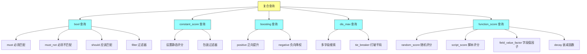
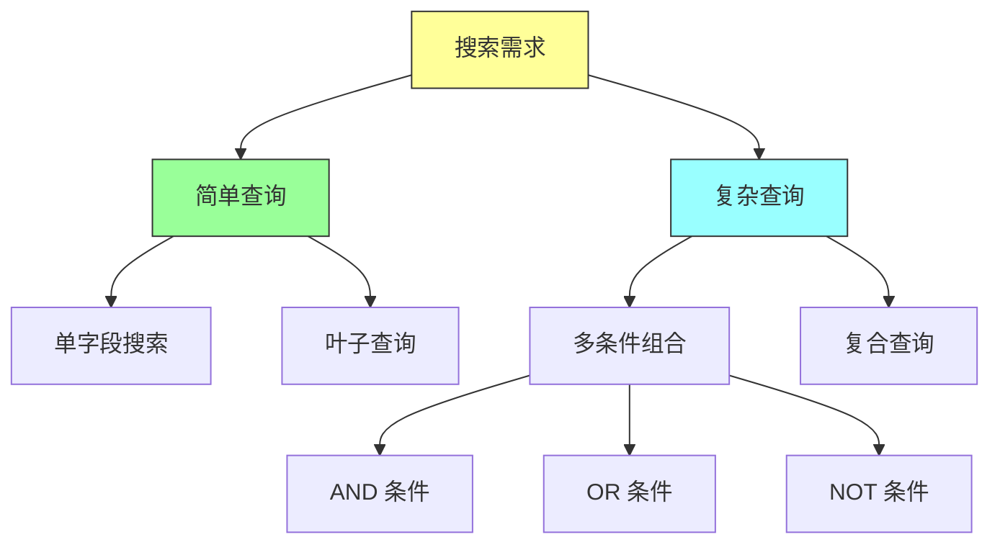
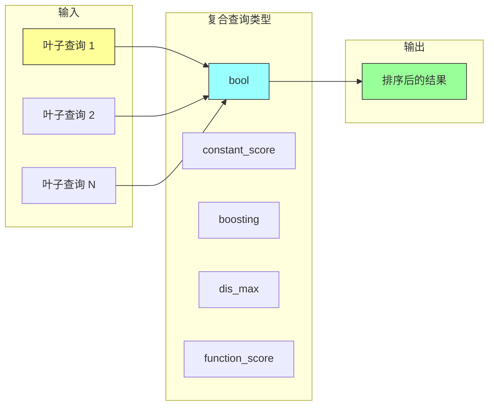
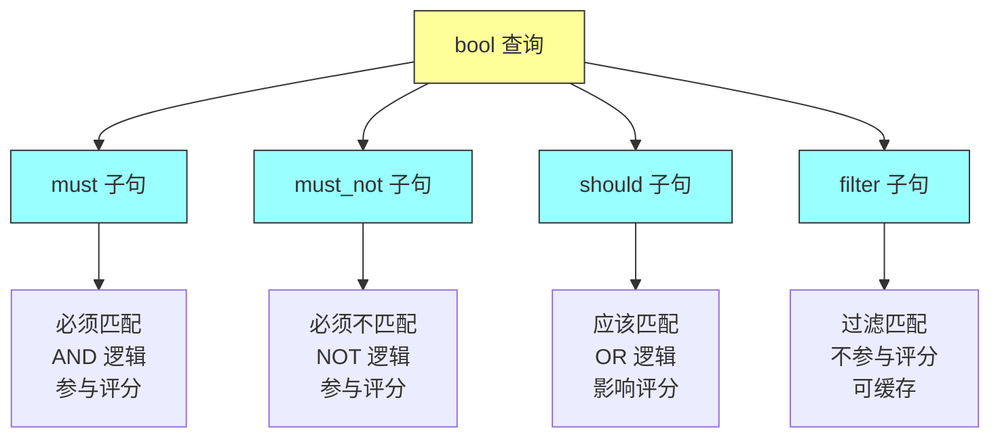
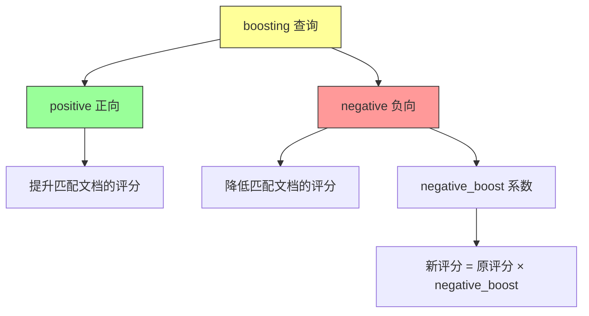
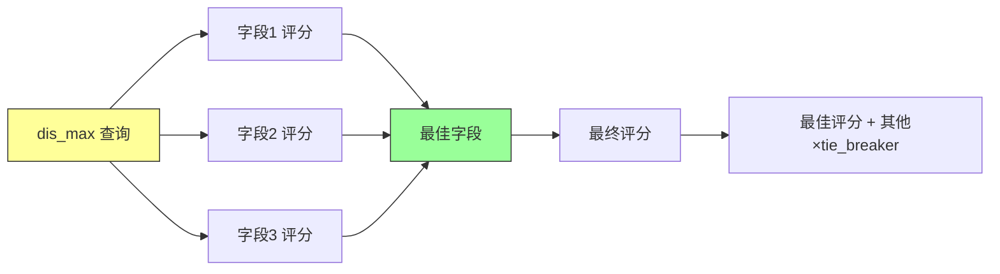
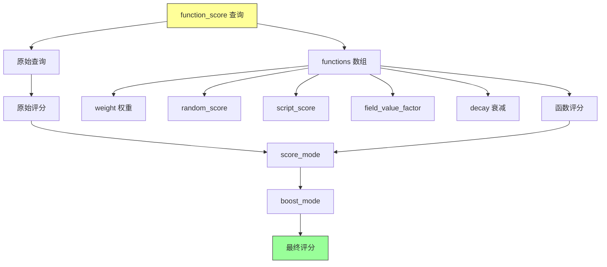

# Elasticsearch in Action - 第十一章：Compound Queries（复合查询）

## 一、本章概述

本章深入探讨 Elasticsearch 中的复合查询（Compound Queries），这是构建高级搜索功能的核心技术。复合查询通过组合多个叶子查询（leaf queries）来满足复杂的搜索需求，是实现高级搜索功能的必备工具。

在实际的电商场景中，我们经常需要构建复杂的查询条件。例如：搜索特定作者在特定时间段内出版的畅销书，评分在 4.5 分以上且页数在一定范围内。这类复杂需求无法通过单一的叶子查询实现，需要使用复合查询来组合多个查询条件。

本章将详细介绍五种复合查询类型：bool（布尔）查询、constant_score（常量评分）查询、boosting（提升）查询、dis_max（析取最大）查询和 function_score（函数评分）查询。每种查询都有其独特的应用场景和语法特性。



### 本章学习目标

通过本章的学习，你将掌握以下核心技能：理解复合查询与叶子查询的区别；熟练使用 bool 查询构建复杂条件组合；掌握 constant_score 设置静态评分的方法；使用 boosting 查询实现结果排序控制；理解 dis_max 查询的多字段评分机制；使用 function_score 实现自定义评分算法。

---

## 二、复合查询概述

### 2.1 为什么需要复合查询

在前两章中，我们学习了叶子查询（term-level 和 full-text queries）：这些查询主要针对单个字段进行搜索。例如查找畅销书或特定日期段的书籍，这类简单查询使用叶子查询就能满足需求。然而，现实世界的搜索需求往往更加复杂。

考虑一个典型的电商搜索需求：查找由特定作者撰写、在特定时间段出版、被列为畅销书、评分在 4.5 分以上且页数在一定范围内的书籍。这种复杂的多条件查询就需要使用复合查询来实现。



### 2.2 复合查询类型

Elasticsearch 提供了五种复合查询类型，每种类型适用于不同的场景：

| 查询类型 | 说明 | 典型应用场景 |
|---------|------|------------|
| bool | 布尔查询，组合多个条件子句 | 最常用的复合查询，支持 must、must_not、should、filter |
| constant_score | 包装过滤器，设置静态评分 | 不关心相关性评分，只关心是否匹配 |
| boosting | 正向提升 + 负向降权 | 优先显示某些结果，降低某些结果排名 |
| dis_max | 析取最大查询 | 多字段搜索，返回最佳匹配字段的评分 |
| function_score | 函数评分 | 自定义评分算法，基于字段值或脚本 |



---

## 三、Bool 查询详解

### 3.1 Bool 查询概述

Bool（布尔）查询是 Elasticsearch 中最灵活且最常用的复合查询。它通过四个条件子句来组合叶子查询：

- **must**：AND 关系，所有条件必须匹配
- **must_not**：NOT 关系，所有条件必须不匹配
- **should**：OR 关系，至少一个条件匹配（可影响评分）
- **filter**：过滤条件（不计算评分，性能更好）



### 3.2 Must 子句

must 子句要求所有条件都匹配，相当于 AND 逻辑。让我们从一个简单例子开始：查找 products 索引中所有类型为 TV 的产品。

```http
GET products/_search
{
  "query": {
    "bool": {
      "must": [
        {
          "match": {
            "product": "TV"
          }
        }
      ]
    }
  }
}
```

这个查询返回所有 product 字段包含 "TV" 的文档。

**增强版 Must 子句**：在基本查询基础上增加价格范围条件。

```http
GET products/_search
{
  "query": {
    "bool": {
      "must": [
        {
          "match": {
            "product": "TV"
          }
        },
        {
          "range": {
            "price": {
              "gte": 500,
              "lte": 1500
            }
          }
        }
      ]
    }
  }
}
```

这个查询同时满足两个条件：产品类型为 TV 且价格在 500 到 1500 之间。

### 3.3 Must_not 子句

must_not 子句排除匹配条件的文档，相当于 NOT 逻辑。例如：查找所有 TV 但排除黑色的。

```http
GET products/_search
{
  "query": {
    "bool": {
      "must": [
        {
          "match": {
            "product": "TV"
          }
        }
      ],
      "must_not": [
        {
          "term": {
            "colour": "black"
          }
        }
      ]
    }
  }
}
```

### 3.4 Should 子句

should 子句表示"应该匹配"的条件，至少一个 should 条件匹配即可。多个 should 条件都匹配时，会提升文档的评分。

```http
GET products/_search
{
  "query": {
    "bool": {
      "should": [
        {
          "term": {
            "energy_rating": "A+"
          }
        },
        {
          "term": {
            "energy_rating": "A"
          }
        }
      ]
    }
  }
}
```

这个查询返回能耗等级为 A+ 或 A 的产品。

### 3.5 Filter 子句

filter 子句与 must 类似，但不计算评分。由于不需要计算相关性评分，filter 子句的执行速度更快，且结果可以被 Elasticsearch 缓存。

```http
GET products/_search
{
  "query": {
    "bool": {
      "filter": [
        {
          "range": {
            "user_ratings": {
              "gte": 4,
              "lte": 5
            }
          }
        }
      ]
    }
  }
}
```

这个查询只返回评分在 4 到 5 之间的产品，但不计算相关性评分（所有文档评分都为 0）。

---

## 四、Constant Score 查询

### 4.1 概述

constant_score 查询包装一个 filter 查询，并为所有匹配结果设置一个固定的评分值。当我们不关心相关性评分，只关心文档是否匹配时，可以使用 constant_score。

### 4.2 基础用法

```http
GET products/_search
{
  "query": {
    "constant_score": {
      "filter": {
        "range": {
          "user_ratings": {
            "gte": 4,
            "lte": 5
          }
        }
      },
      "boost": 5.0
    }
  }
}
```

这个查询为所有评分在 4-5 分之间的产品设置固定的 5.0 评分，而不是默认的 0 分。

### 4.3 与 Bool 查询结合

constant_score 可以与 bool 查询结合使用，实现更复杂的评分逻辑：

```http
GET products/_search
{
  "query": {
    "bool": {
      "must": [
        {
          "match": {
            "product": "TV"
          }
        },
        {
          "constant_score": {
            "filter": {
              "term": {
                "colour": "black"
              }
            },
            "boost": 3.5
          }
        }
      ]
    }
  }
}
```

这个查询查找所有 TV，并且为黑色的 TV 额外增加 3.5 分的评分。

---

## 五、Boosting 查询

### 5.1 概述

boosting 查询用于操控搜索结果的排名。它包含两个部分：positive（正向）和 negative（负向）。正向匹配提高评分，负向匹配降低评分。

这种查询适用于需要"偏袒"某些结果同时"打压"其他结果的场景。例如：优先显示 LG 电视，将价格过高的产品排在后面。

### 5.2 基础用法

```http
GET products/_search
{
  "size": 50,
  "_source": ["product", "price", "colour"],
  "query": {
    "boosting": {
      "positive": {
        "term": {
          "product": "tv"
        }
      },
      "negative": {
        "range": {
          "price": {
            "gte": 2500
          }
        }
      },
      "negative_boost": 0.5
    }
  }
}
```

这个查询的工作原理：
1. 匹配所有 TV 产品（正向）
2. 对于价格大于等于 2500 的产品，将其评分乘以 0.5（负向提升）
3. 最终结果：LG 电视排在前面，高价电视排在后面



### 5.3 与 Bool 查询结合

boosting 查询也可以包含复杂的 bool 查询：

```http
GET products/_search
{
  "size": 40,
  "_source": ["product", "price", "colour", "brand"],
  "query": {
    "boosting": {
      "positive": {
        "bool": {
          "must": [
            {
              "match": {
                "product": "TV"
              }
            }
          ]
        }
      },
      "negative": {
        "bool": {
          "must_not": [
            {
              "term": {
                "brand": "LG"
              }
            }
          ],
          "filter": [
            {
              "range": {
                "price": {
                  "gte": 2000
                }
              }
            }
          ]
        }
      },
      "negative_boost": 0.3
    }
  }
}
```

---

## 六、Dis Max 查询

### 6.1 概述

dis_max（Disjunction Max，析取最大）查询包装多个查询，返回最佳匹配字段评分最高的文档。当多个字段都可能包含搜索词时，dis_max 查询会返回与最佳匹配字段最相关的文档。

注意：multi_match 查询在后台就是使用 dis_max 实现的。

### 6.2 基础用法

```http
GET products/_search
{
  "_source": ["type", "overview"],
  "query": {
    "dis_max": {
      "queries": [
        {
          "match": {
            "type": "smart tv"
          }
        },
        {
          "match": {
            "overview": "smart tv"
          }
        }
      ]
    }
  }
}
```

这个查询在 type 和 overview 两个字段中搜索 "smart tv"，返回与最佳匹配字段最相关的文档。

### 6.3 Tie Breaker 参数

dis_max 查询默认只使用最佳匹配字段的评分。通过设置 tie_breaker 参数，可以将其他匹配字段的评分也纳入考量：

```http
GET products/_search
{
  "_source": ["type", "overview"],
  "query": {
    "dis_max": {
      "queries": [
        {
          "match": {
            "type": "smart tv"
          }
        },
        {
          "match": {
            "overview": "smart tv"
          }
        },
        {
          "match": {
            "product": "smart tv"
          }
        }
      ],
      "tie_breaker": 0.5
    }
  }
}
```

评分计算方式：
- 最终评分 = 最佳字段评分 + 其他字段评分 × tie_breaker

tie_breaker 的取值范围是 0.0 到 1.0，默认为 0.0。



---

## 七、Function Score 查询

### 7.1 概述

function_score 查询允许我们根据自定义需求为返回的文档分配评分。这在以下场景中特别有用：
- 根据特定字段值加权
- 随机展示广告
- 基于地理位置的衰减评分
- 使用脚本自定义评分逻辑

### 7.2 基础用法

```http
GET products/_search
{
  "query": {
    "function_score": {
      "query": {
        "term": {
          "product": "tv"
        }
      }
    }
  }
}
```

这个查询包装了一个简单的 term 查询，允许我们对其评分进行自定义。

### 7.3 Random Score 函数

random_score 函数为每个文档生成随机评分。每次执行查询时，同一个文档可能获得不同的评分。

```http
GET products/_search
{
  "query": {
    "function_score": {
      "query": {
        "term": {
          "product": "TV"
        }
      },
      "random_score": {}
    }
  }
}
```

**可复现的随机评分**：通过设置 seed 和 field 参数，可以生成可复现的随机评分。

```http
GET products/_search
{
  "query": {
    "function_score": {
      "query": {
        "term": {
          "product": "TV"
        }
      },
      "random_score": {
        "seed": 10,
        "field": "user_ratings"
      }
    }
  }
}
```

使用相同的 seed 值，每次执行查询都会得到相同的随机评分结果。

### 7.4 Script Score 函数

script_score 函数允许我们使用脚本自定义评分逻辑。例如：根据用户评分字段值的三倍来提升评分。

```http
GET products/_search
{
  "query": {
    "function_score": {
      "query": {
        "term": {
          "product": "tv"
        }
      },
      "script_score": {
        "script": {
          "source": "_score * doc['user_ratings'].value * params['factor']",
          "params": {
            "factor": 3
          }
        }
      }
    }
  }
}
```

这个脚本的计算逻辑：
- 最终评分 = 原始评分 × user_ratings 字段值 × factor 参数值

### 7.5 Field Value Factor 函数

field_value_factor 函数可以直接使用文档中某个字段的值作为评分因子，无需编写脚本。

```http
GET products/_search
{
  "query": {
    "function_score": {
      "query": {
        "term": {
          "product": "tv"
        }
      },
      "field_value_factor": {
        "field": "user_ratings"
      }
    }
  }
}
```

**带修饰符的用法**：

```http
GET products/_search
{
  "query": {
    "function_score": {
      "query": {
        "term": {
          "product": "tv"
        }
      },
      "field_value_factor": {
        "field": "user_ratings",
        "factor": 2,
        "modifier": "square"
      }
    }
  }
}
```

这个查询：
1. 获取文档的 user_ratings 字段值
2. 将值乘以 factor (2)
3. 对结果进行平方计算

支持的 modifier：
- none：无修饰符
- log / log1p / log2p：对数
- sqrt：平方根
- square：平方
- reciprocal：倒数

### 7.6 组合多个函数

function_score 支持同时使用多个函数，通过 functions 数组来定义：

```http
GET products/_search
{
  "query": {
    "function_score": {
      "query": {
        "term": {
          "product": "TV"
        }
      },
      "functions": [
        {
          "filter": {
            "term": {
              "brand": "LG"
            }
          },
          "weight": 3
        },
        {
          "filter": {
            "range": {
              "user_ratings": {
                "gte": 4.5,
                "lte": 5
              }
            }
          },
          "field_value_factor": {
            "field": "user_ratings",
            "factor": 5,
            "modifier": "square"
          }
        }
      ],
      "score_mode": "avg",
      "boost_mode": "sum"
    }
  }
}
```

这个查询组合了两个函数：
1. 如果品牌是 LG，权重增加 3
2. 如果用户评分在 4.5-5 之间，使用评分字段值乘以 5 后平方

**score_mode** 定义如何合并多个函数的评分：
- multiply（默认）：相乘
- sum：相加
- avg：平均
- max：取最大值
- min：取最小值
- first：取第一个匹配的函数评分

**boost_mode** 定义如何将函数评分与原始评分合并：
- multiply（默认）：相乘
- sum：相加
- avg：平均
- replace：用函数评分替换原始评分



---

## 八、最佳实践

### 8.1 选择合适的复合查询

| 场景 | 推荐查询 |
|------|----------|
| 多条件组合查询 | bool |
| 统一设置静态评分 | constant_score |
| 调整结果排序（提升/降权） | boosting |
| 多字段搜索最佳匹配 | dis_max |
| 自定义评分算法 | function_score |

### 8.2 性能优化建议

**使用 filter 代替 must**：filter 子句不计算评分，结果可以被缓存，执行速度更快。

**避免在 should 中使用通配符**：通配符查询本身性能较差，放在 should 中会影响整体性能。

**合理使用 function_score**：复杂的脚本评分会影响查询性能，尽量使用简单的 field_value_factor 替代 script_score。

**使用 filter 上下文**：当不需要评分时，始终使用 filter 上下文。

### 8.3 评分调优技巧

**使用 boost 调整权重**：

```http
GET products/_search
{
  "query": {
    "bool": {
      "must": [
        {
          "match": {
            "product": {
              "query": "TV",
              "boost": 2.0
            }
          }
        }
      ]
    }
  }
}
```

**组合使用多个函数**：

```http
GET products/_search
{
  "query": {
    "function_score": {
      "query": {
        "match": {
          "product": "TV"
        }
      },
      "functions": [
        {
          "field_value_factor": {
            "field": "user_ratings",
            "modifier": "log1p",
            "factor": 1.2
          }
        },
        {
          "weight": 2
        }
      ],
      "score_mode": "multiply",
      "boost_mode": "multiply"
    }
  }
}
```

---

## 九、常见问题

**Q1：bool 查询中 should 子句何时必须匹配？**

默认情况下，should 子句是可选的。但如果 bool 查询中只有 should 子句而没有 must 或 filter，那么至少要有一个 should 条件匹配。

**Q2：constant_score 和 filter 有什么区别？**

filter 不计算评分（评分为 0），constant_score 可以通过 boost 参数设置一个非零的固定评分。

**Q3：dis_max 和 multi_match 有什么区别？**

multi_match 是更高级的查询，底层使用 dis_max 实现。multi_match 提供了更简洁的语法和更多的类型选项（如 best_fields、most_fields、cross_fields 等）。

**Q4：function_score 的 score_mode 和 boost_mode 有什么区别？**

- score_mode：定义多个函数评分如何合并
- boost_mode：定义函数评分如何与原始查询评分合并

**Q5：如何实现"新用户优先"的排序？**

可以使用 function_score 结合 script_score 或 field_value_factor，基于用户注册时间或最近登录时间进行评分。

---

## 十、实践练习

1. 使用 bool 查询实现：查找 product=TV，color!=black，rating>=4.5 的产品

2. 使用 constant_score 为所有匹配产品设置统一评分为 10

3. 使用 boosting 查询：优先显示三星电视，降低价格高于 5000 的产品排名

4. 使用 dis_max 在多个字段中搜索，比较有无 tie_breaker 的结果差异

5. 使用 function_score 的 random_score 实现随机推荐功能

6. 使用 script_score 实现复杂的自定义评分算法

7. 组合使用多个函数（weight + field_value_factor），设置不同的 score_mode

8. 对比 score_mode 的不同取值（multiply/sum/avg）对结果评分的影响

---

## 本章小结

本章深入学习了 Elasticsearch 复合查询的核心知识。复合查询通过组合多个叶子查询来满足复杂的搜索需求，是构建高级搜索功能的基础。

bool 查询是最常用也是最灵活的复合查询，通过 must、must_not、should、filter 四个子句可以构建任意复杂的查询条件。理解这四个子句的区别对于编写高效搜索查询至关重要。

constant_score 提供了设置静态评分的能力，适用于不关心相对排序只关心是否匹配的场景。boosting 查询则提供了精细的评分控制能力，可以提升正向匹配的结果，降低负向匹配的结果排名。

dis_max 查询在多字段搜索场景下非常有用，它返回最佳匹配字段评分最高的文档。function_score 则是最强大的评分自定义工具，支持随机评分、脚本评分、字段值因子等多种函数，还可以组合使用多个函数来实现复杂的评分逻辑。

掌握这些复合查询类型，将帮助你构建功能强大且性能优异的 Elasticsearch 搜索应用。下一章我们将介绍其他高级搜索功能，如地理空间搜索和连接查询。
