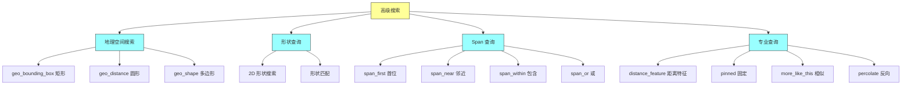
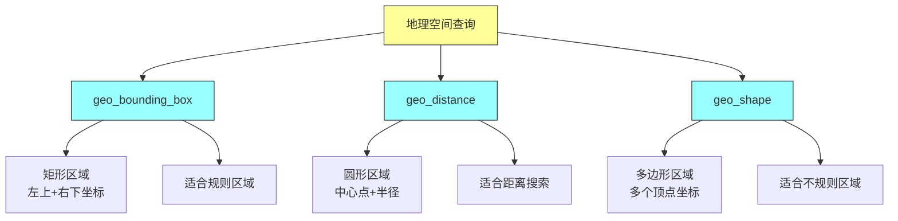
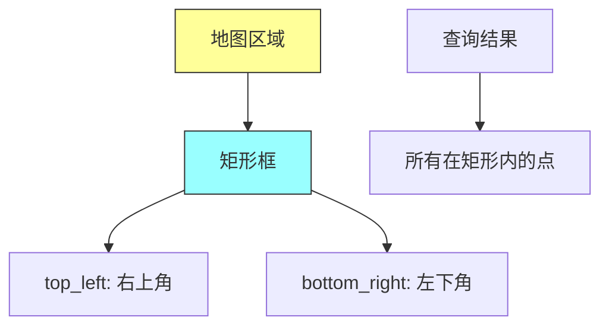
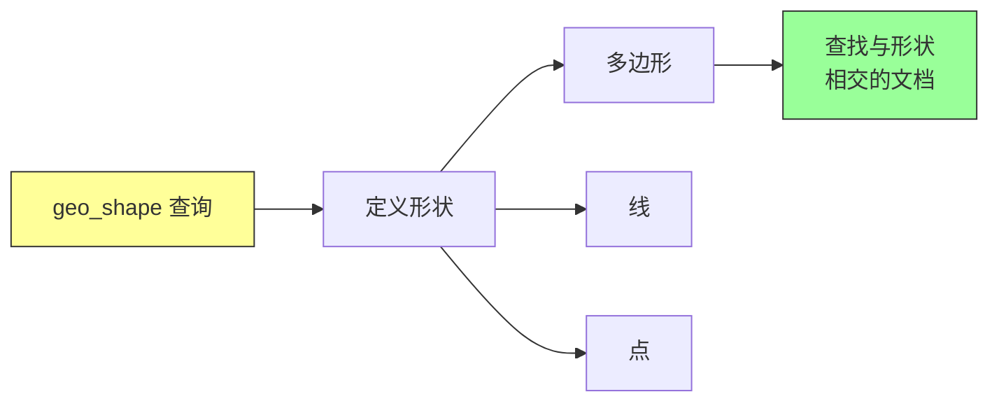
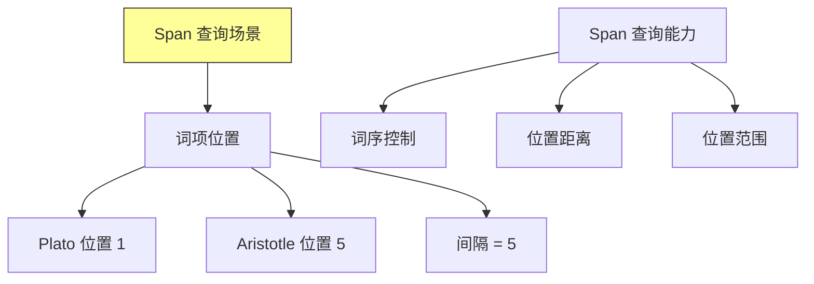
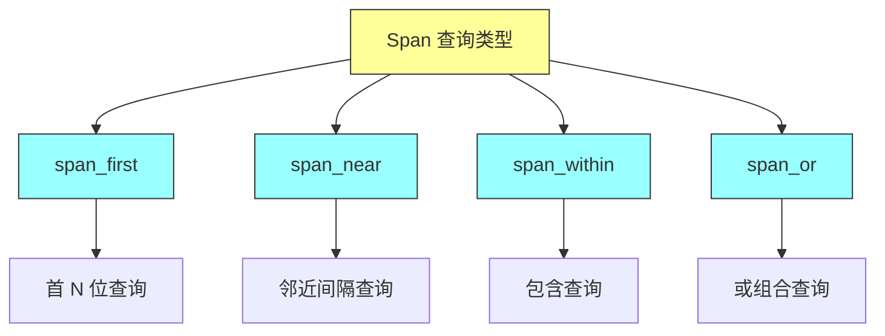
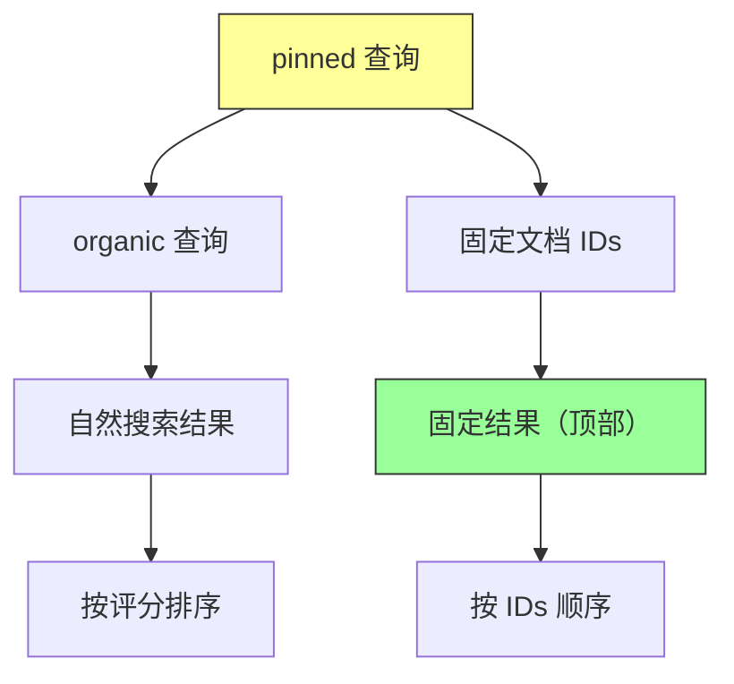
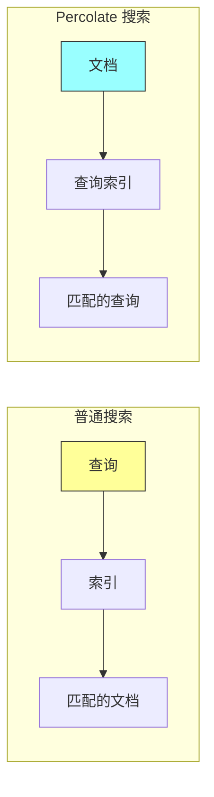
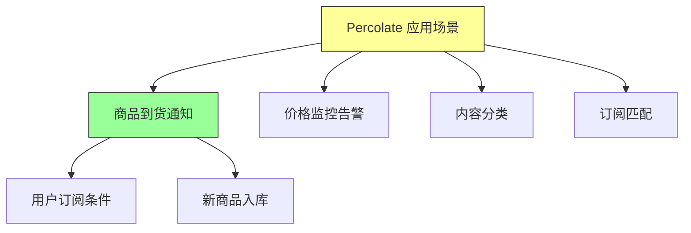

# Elasticsearch in Action - 第十二章：Advanced Search（高级搜索）

## 一、本章概述

本章深入探讨 Elasticsearch 中的高级搜索功能，这是处理复杂搜索需求的核心技术。高级搜索涵盖了地理空间搜索、形状查询、Span 查询以及多种专业查询类型，能够满足现实世界中各种复杂的业务需求。

在现代应用开发中，位置搜索已成为必不可少的功能。例如，用户期望能够找到附近的餐厅、一定距离内的加油站或者特定区域内的房产信息。Elasticsearch 提供了原生的地理空间支持，专门的数据类型和查询类型能够高效处理这类需求。此外，在法律文档检索、学术论文搜索等场景中，我们常常需要精确控制词项的位置信息，比如查找两个词按特定顺序出现且间隔一定距离的文档，这时 Span 查询就派上了用场。

本章还将介绍多种专业查询类型：distance_feature 查询可以根据距离提升相关性评分，pinned 查询可以实现赞助商结果的固定展示，more_like_this 查询能够查找相似文档，percolate 查询则实现了反向搜索的功能。



### 本章学习目标

通过本章的学习，你将掌握以下核心技能：理解地理空间查询的原理和数据类型；熟练使用 geo_bounding_box、geo_distance、geo_shape 进行位置搜索；掌握 Span 查询进行词项位置精确控制；使用 distance_feature 实现基于距离的评分提升；使用 pinned 查询实现赞助商结果；使用 more_like_this 查找相似文档；理解 percolate 查询的反向搜索机制。

---

## 二、地理空间搜索概述

### 2.1 位置搜索的需求

在当今互联网时代，基于位置的搜索已成为应用标配功能。用户期望能够找到附近的餐厅、一定距离内的房屋、或者特定区域内的服务点。Elasticsearch 将地理空间支持作为一等公民（first-class citizen），提供了专门的数据类型来定义地理空间数据的索引结构，从而支持精准的位置搜索。

地理空间搜索的核心应用场景包括：查找用户当前位置附近的服务点（如餐厅、酒店、加油站）；计算两点之间的距离并按距离排序；搜索特定地理区域内的所有地点；根据位置和距离进行相关性评分优化。

### 2.2 地理空间查询类型

Elasticsearch 提供了三种主要的地理空间查询类型：

**geo_bounding_box（矩形框）查询**：通过指定矩形的左上角和右下角坐标，查找落在这个矩形区域内的所有地点。例如，在地图上框选一个矩形区域，返回该区域内所有匹配的地点。

**geo_distance（地理距离）查询**：以某个点为圆心，指定半径距离，查找圆形区域内的所有地点。这类似于 FBI 探员在地图上画圈追踪嫌疑人的场景。

**geo_shape（地理形状）查询**：支持任意多边形区域的搜索，可以处理三角形、五边形、六边形等复杂几何形状。这提供了最大的灵活性，可以适应各种不规则区域的需求。



---

## 三、地理空间数据类型

### 3.1 geo_point 数据类型

geo_point 用于存储单个地理坐标点，包含经度（longitude）和纬度（latitude）两个值。在 Elasticsearch 中，经度范围是 -180 到 180 度，纬度范围是 -90 到 90 度。

创建包含 geo_point 字段的索引映射：

```http
PUT my_locations
{
  "mappings": {
    "properties": {
      "name": {
        "type": "text"
      },
      "location": {
        "type": "geo_point"
      }
    }
  }
}
```

索引文档时，可以采用多种格式指定坐标：

```http
PUT my_locations/_doc/1
{
  "name": "London Office",
  "location": {
    "lat": 51.5074,
    "lon": -0.1278
  }
}
```

也可以使用字符串格式：

```http
PUT my_locations/_doc/2
{
  "name": "Manchester Office",
  "location": "53.4808, -2.2426"
}
```

或者使用数组格式（：数组格式是 [经度, 纬度注意]）：

```http
PUT my_locations/_doc/3
{
  "name": "Birmingham Office",
  "location": [-1.902, 52.479]
}
```

### 3.2 geo_shape 数据类型

geo_shape 用于存储复杂几何形状，支持点、线、多边形等复杂形状。这在需要匹配地理区域边界时非常有用，例如搜索某个城市边界内或某条河流经过的所有地点。

创建 geo_shape 类型的索引映射：

```http
PUT my_regions
{
  "mappings": {
    "properties": {
      "name": {
        "type": "text"
      },
      "region": {
        "type": "geo_shape"
      }
    }
  }
}
```

geo_shape 支持的形状类型包括：Point（点）、LineString（线）、Polygon（多边形）、MultiPoint（多点）、MultiPolygon（多多边形）、GeometryCollection（几何集合）。

例如，定义一个矩形区域：

```http
PUT my_regions/_doc/1
{
  "name": "Central London",
  "region": {
    "type": "polygon",
    "coordinates": [
      [
        [-0.1276, 51.5073],
        [-0.1276, 51.5573],
        [-0.0776, 51.5573],
        [-0.0776, 51.5073],
        [-0.1276, 51.5073]
      ]
    ]
  }
}
```

---

## 四、地理空间查询详解

### 4.1 geo_bounding_box 查询

geo_bounding_box 查询用于查找落在指定矩形区域内的所有文档。矩形由两个坐标点定义：左上角（top_left）和右下角（bottom_right）。

```http
GET my_locations/_search
{
  "query": {
    "geo_bounding_box": {
      "location": {
        "top_left": {
          "lat": 51.6,
          "lon": -0.3
        },
        "bottom_right": {
          "lat": 51.4,
          "lon": 0.0
        }
      }
    }
  }
}
```

矩形区域内的所有点都会被返回，包括边界上的点。



### 4.2 geo_distance 查询

geo_distance 查询以指定点为圆心，指定距离为半径，查找圆形区域内的所有文档。

```http
GET my_locations/_search
{
  "query": {
    "geo_distance": {
      "distance": "10km",
      "location": {
        "lat": 51.5074,
        "lon": -0.1278
      }
    }
  }
}
```

距离单位可以指定为：km（公里）、m（米）、mi（英里）、ft（英尺）等。

可以通过 distance_type 参数指定距离计算方式：

```http
GET my_locations/_search
{
  "query": {
    "geo_distance": {
      "distance": "10km",
      "distance_type": "arc",
      "location": {
        "lat": 51.5074,
        "lon": -0.1278
      }
    }
  }
}
```

distance_type 选项包括：arc（默认，使用椭球体计算，更精确）、plane（使用平面计算，在小范围内更快）。

### 4.3 geo_shape 查询

geo_shape 查询用于查找与指定几何形状相交的文档。可以用于查找落在某个多边形区域内或者与某条线相交的文档。

```http
GET my_locations/_search
{
  "query": {
    "geo_shape": {
      "location": {
        "shape": {
          "type": "polygon",
          "coordinates": [
            [
              [-0.1276, 51.5073],
              [-0.1276, 51.5573],
              [-0.0776, 51.5573],
              [-0.0776, 51.5073],
              [-0.1276, 51.5073]
            ]
          ]
        }
      }
    }
  }
}
```

geo_shape 查询支持的关系类型包括：intersects（相交）、within（包含）、disjoint（不相交）。



---

## 五、形状查询

### 5.1 形状查询概述

形状查询（Shape Query）用于搜索二维形状集合，适用于设计工程师、游戏开发者等需要管理大量 2D 形状数据的场景。与地理空间查询类似，形状查询也支持多种几何类型的索引和搜索，但处理的是抽象的几何形状而非地理坐标。

形状查询使用 shape 字段类型来存储几何数据，支持的类型包括：point（点）、linestring（线）、polygon（多边形）、envelope（矩形）、circle（圆形）。

### 5.2 形状查询示例

创建包含形状字段的索引：

```http
PUT shapes
{
  "mappings": {
    "properties": {
      "name": {
        "type": "text"
      },
      "shape": {
        "type": "shape"
      }
    }
  }
}
```

索引一个矩形形状：

```http
PUT shapes/_doc/1
{
  "name": "My Rectangle",
  "shape": {
    "type": "envelope",
    "coordinates": [
      [-10, 10],
      [10, -10]
    ]
  }
}
```

执行形状查询：

```http
GET shapes/_search
{
  "query": {
    "shape": {
      "shape": {
        "type": "polygon",
        "coordinates": [
          [
            [-5, 5],
            [-5, -5],
            [5, -5],
            [5, 5],
            [-5, 5]
          ]
        ]
      }
    }
  }
}
```

---

## 六、Span 查询

### 6.1 Span 查询概述

Span 查询是低级别的位置查询，用于精确控制词项在文档中的位置信息。与普通的全文搜索不同，Span 查询关注词项的具体位置、顺序和间隔距离。

考虑牛顿的一句名言："Plato is my friend. Aristotle is my friend. But my greatest friend is truth." 假设我们想找到同时满足以下条件的文档：Plato 和 Aristotle 都出现；Plato 必须出现在 Aristotle 之前；两个词之间至少间隔 5 个词。

这种情况下，普通的 match 查询无法满足需求，因为它们不关心词项的位置信息。Span 查询正是为这类精确位置匹配场景设计的。



### 6.2 span_first 查询

span_first 查询用于查找在文档开头前 N 个位置内出现的词项。

```http
GET quotes/_search
{
  "query": {
    "span_first": {
      "match": {
        "span_term": {
          "quote": "Aristotle"
        }
      },
      "end": 5
    }
  }
}
```

这个查询查找 "Aristotle" 出现在前 5 个位置内的文档。

### 6.3 span_near 查询

span_near 查询用于查找多个词项在指定间隔内相邻出现的文档。

```http
GET quotes/_search
{
  "query": {
    "span_near": {
      "clauses": [
        {
          "span_term": {
            "quote": "Plato"
          }
        },
        {
          "span_term": {
            "quote": "Aristotle"
          }
        }
      ],
      "slop": 5,
      "in_order": true
    }
  }
}
```

参数说明：clauses 指定要匹配的词项列表；slop 指定词项之间的最大间隔；in_order 设置为 true 表示词项必须按顺序出现。

这个查询查找 Plato 和 Aristotle 按顺序出现且间隔不超过 5 个词的文档。

### 6.4 span_within 查询

span_within 查询查找包含在指定 span 内的词项。

```http
GET quotes/_search
{
  "query": {
    "span_within": {
      "match": {
        "span_term": {
          "quote": "friend"
        }
      },
      "big": {
        "span_near": {
          "clauses": [
            {
              "span_term": {
                "quote": "Plato"
              }
            },
            {
              "span_term": {
                "quote": "Aristotle"
              }
            }
          ],
          "slop": 10,
          "in_order": false
        }
      }
    }
  }
}
```

### 6.5 span_or 查询

span_or 查询组合多个 span 查询，使用 OR 逻辑。

```http
GET quotes/_search
{
  "query": {
    "span_or": {
      "clauses": [
        {
          "span_term": {
            "quote": "Plato"
          }
        },
        {
          "span_term": {
            "quote": "Aristotle"
          }
        }
      ]
    }
  }
}
```

这个查询返回包含 Plato 或 Aristotle 的文档。



---

## 七、专业查询

### 7.1 distance_feature 查询

distance_feature 查询根据文档与指定位置或日期的接近程度来提升相关性评分。这在需要优先展示距离某地点更近或时间更接近的文档时非常有用。

**基于位置的评分提升**：

```http
GET universities/_search
{
  "query": {
    "distance_feature": {
      "field": "location",
      "pivot": "10km",
      "origin": {
        "lat": 51.5074,
        "lon": -0.1278
      }
    }
  }
}
```

参数说明：field 指定要计算距离的字段（必须是 geo_point 类型）；pivot 是参考距离，超过这个距离后评分衰减；origin 是参考原点位置。

**基于日期的评分提升**：

```http
GET books/_search
{
  "query": {
    "distance_feature": {
      "field": "publish_date",
      "pivot": "30d",
      "origin": "2023-01-01"
    }
  }
}
```

这个查询会优先显示 publish_date 接近 2023-01-01 的书籍。

distance_feature 查询使用衰减函数来计算评分：距离 pivot 越近的文档评分越高，超过 pivot 后评分逐渐降低。衰减函数可以是 linear（线性）、exp（指数）或 gauss（高斯）。

### 7.2 pinned 查询

pinned 查询用于将指定文档固定到搜索结果顶部，常用于实现赞助商广告或推广内容功能。

```http
GET products/_search
{
  "query": {
    "pinned": {
      "ids": ["1", "3"],
      "organic": {
        "match": {
          "name": "iPhone"
        }
      }
    }
  }
}
```

参数说明：ids 是要固定的文档 ID 列表；organic 是常规搜索查询。

被固定的文档会出现在结果最顶部，其评分由 Elasticsearch 自动设置为高于所有其他文档。需要注意的是，固定的多个文档按照 ids 数组中的顺序排列，而不是按评分排列。



### 7.3 more_like_this 查询

more_like_this 查询用于查找与给定文档相似的其他文档，类似于 Netflix 的 "More Like This" 或 Amazon 的推荐功能。

```http
GET profiles/_search
{
  "query": {
    "more_like_this": {
      "fields": ["name", "profile"],
      "like": "Sotherby",
      "min_term_freq": 1,
      "max_query_terms": 12,
      "min_doc_freq": 1
    }
  }
}
```

参数说明：fields 指定要匹配的字段列表；like 是要查找相似内容的关键词或文档；min_term_freq 是词项在原文中出现的最小频率；max_query_terms 是查询中使用的最大词项数；min_doc_freq 是词项在索引中出现的最小文档频率。

more_like_this 查询基于词项频率来计算相似度：两个文档共享的独特词项越多，它们就越相似。

**基于文档的相似查询**：

```http
GET profiles/_search
{
  "query": {
    "more_like_this": {
      "fields": ["name", "profile"],
      "like": [
        {
          "_index": "profiles",
          "_id": "1"
        }
      ],
      "min_term_freq": 1,
      "max_query_terms": 12
    }
  }
}
```

### 7.4 percolate 查询

percolate 查询是 Elasticsearch 独特的反向搜索功能。普通搜索是用查询找文档，percolate 则是用文档找查询。这在监控和告警场景中非常有用。

**工作原理**：普通搜索是"查询 → 文档"，percolate 是"文档 → 查询"。



**典型应用场景**：商品到货通知——用户订阅了某个商品的到货提醒，当新商品入库时，系统匹配用户的订阅条件并发送通知；价格监控——用户关注某些商品的价格变化，当价格达到目标时通知用户；内容分类——新文档入库时，自动匹配预定义的分类规则。

**使用 percolate 查询**：

首先创建一个包含 percolator 字段的索引：

```http
PUT tech_books
{
  "mappings": {
    "properties": {
      "query": {
        "type": "percolator"
      },
      "name": {
        "type": "text"
      },
      "tags": {
        "type": "keyword"
      }
    }
  }
}
```

注册一个查询（将查询存储为文档）：

```http
PUT tech_books/_doc/1
{
  "query": {
    "term": {
      "tags": "Python"
    }
  }
}
```

使用 percolate 查询找出匹配的查询：

```http
GET tech_books/_search
{
  "query": {
    "percolate": {
      "field": "query",
      "document": {
        "name": "Python in Action",
        "tags": ["Python", "Programming"]
      }
    }
  }
}
```

这个查询会返回所有匹配的已注册查询，即 tags 包含 "Python" 的查询规则。



---

## 八、最佳实践

### 8.1 地理空间查询性能优化

**使用适当的距离计算方式**：对于小范围搜索（小于 500km），可以使用 plane 模式获得更快的计算速度；对于大范围搜索或需要高精度的场景，使用 arc 模式。

**合理设置索引映射**：将经常用于过滤的 geo_point 字段设置为 doc_values enabled，可以提高查询性能。

**避免使用 script 过滤**：在 geo 查询中避免使用 Painless 脚本，这会显著降低查询性能。

### 8.2 Span 查询使用建议

**仅在必要时使用**：Span 查询虽然功能强大，但执行速度比普通查询慢，只有在需要精确位置匹配时才使用。

**注意索引开销**：Span 查询需要在索引中存储词项的位置信息，这会增加索引体积。

**合理设置 slop 值**：较大的 slop 值会增加查询计算量，应根据实际需求设置合理的值。

### 8.3 专业查询选择指南

| 场景 | 推荐查询 |
|------|----------|
| 基于位置的距离排序 | geo_distance |
| 基于位置的距离评分 | distance_feature |
| 赞助商结果置顶 | pinned |
| 相似文档推荐 | more_like_this |
| 反向搜索/监控告警 | percolate |

---

## 九、常见问题

**Q1：geo_point 支持哪些格式的坐标输入？**

Elasticsearch 支持多种 geo_point 格式：对象格式 {lat, lon}、字符串格式 "lat,lon"、数组格式 [lon, lat]、WKT 格式 "POINT(lon lat)"。注意数组格式是经度在前，纬度在后。

**Q2：geo_distance 和 geo_bounding_box 有什么区别？**

geo_distance 查找圆形区域内的点（指定中心和半径），geo_bounding_box 查找矩形区域内的点。前者适合"距离某地 N 公里内"的场景，后者适合"在某个矩形范围内"的场景。

**Q3：Span 查询和 match_phrase 查询有什么区别？**

两者都可以进行词序匹配，但 Span 查询更底层，提供更精确的位置控制（如指定间隔距离、位置范围），而 match_phrase 只能指定 slop 值。

**Q4：percolate 查询的性能如何优化？**

percolate 查询的执行速度取决于注册的查询数量。对于大量查询的场景，可以考虑按类别拆分索引、使用过滤器预过滤等策略。

**Q5：distance_feature 查询的 pivot 值如何设置？**

pivot 决定了评分开始衰减的距离或时间。建议设置为业务上"足够近"的阈值。例如，对于本地搜索，pivot 设置为 5-10km 较为合理。

---

## 十、实践练习

1. 创建一个包含 geo_point 字段的索引，索引多个位置的文档

2. 使用 geo_bounding_box 查询搜索指定矩形区域内的地点

3. 使用 geo_distance 查询搜索距离某点 10km 内的所有地点

4. 创建一个 quotes 索引，使用 span_near 查询验证词序匹配功能

5. 使用 distance_feature 查询实现"优先显示距离某地更近的结果"

6. 使用 pinned 查询实现赞助商结果置顶功能

7. 使用 more_like_this 查询查找与给定文档相似的其他文档

8. 创建一个 percolate 查询，测试当新文档入库时如何匹配已注册的查询条件

9. 对比 geo_distance 的 arc 和 plane 两种距离计算方式的差异

---

## 本章小结

本章深入学习了 Elasticsearch 高级搜索的核心知识。地理空间搜索是现代应用不可或缺的功能，Elasticsearch 提供了完整的数据类型和查询类型来支持位置搜索需求。geo_point 和 geo_shape 数据类型能够存储各种地理信息，geo_bounding_box、geo_distance 和 geo_shape 查询则能够满足不同形状区域的搜索需求。

Span 查询提供了词项级别的位置控制能力，能够精确指定词项的顺序、位置和间隔。这在法律文档检索、学术论文搜索等需要精确匹配的场景中非常有用。span_first、span_near、span_within 和 span_or 等查询类型提供了灵活的位置匹配能力。

专业查询方面，distance_feature 实现了基于距离的智能评分，pinned 查询支持赞助商结果的展示，more_like_this 提供了相似文档推荐能力，percolate 则实现了独特的反向搜索功能，为监控告警等场景提供了优雅的解决方案。

掌握这些高级搜索功能，将帮助你构建功能更加丰富和智能的搜索应用。
