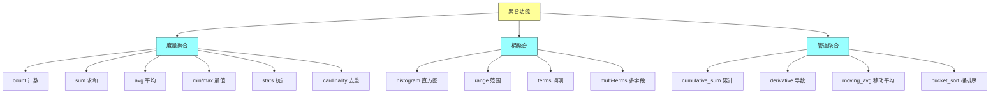
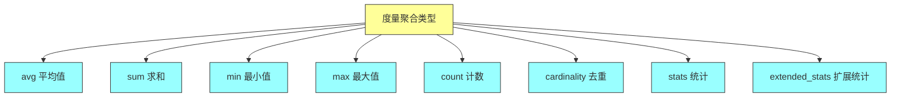
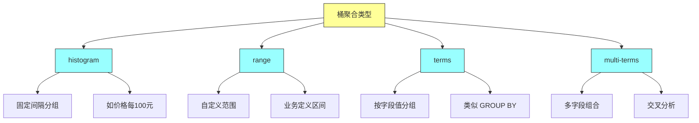
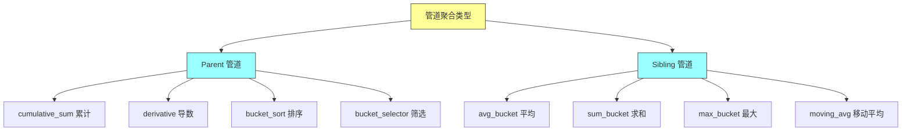

# Elasticsearch in Action - 第十三章：Aggregations（聚合）

## 一、本章概述

本章深入探讨 Elasticsearch 中的聚合功能，这是实现数据分析的核心技术。聚合允许对索引中的数据进行统计分析，生成各种指标、报表和可视化数据，类似于 SQL 中的 GROUP BY 和聚合函数。

在现代数据驱动的应用中，仅仅能够搜索文档是不够的。我们经常需要对数据进行深入分析，例如：计算某类产品的销售总额；按类别统计商品数量并排序；分析用户行为数据，生成趋势报表；构建仪表盘展示关键业务指标。这些场景都需要用到聚合功能。

Elasticsearch 的聚合功能非常强大，提供了多种聚合类型：度量聚合（Metric Aggregations）用于计算统计指标，如求和、平均值、最大最小值等；桶聚合（Bucket Aggregations）用于将数据分组到不同的桶中；管道聚合（Pipeline Aggregations）用于对其他聚合的输出进行二次计算，实现链式操作。



### 本章学习目标

通过本章的学习，你将掌握以下核心技能：理解聚合的基本语法和工作原理；熟练使用各种度量聚合计算统计指标；掌握桶聚合进行数据分组；理解嵌套聚合的实现方式；使用管道聚合实现链式计算；组合搜索和聚合实现复杂的分析需求。

---

## 二、聚合基础

### 2.1 聚合的概念

聚合是对一组文档进行分析并计算结果的功能。与搜索查询不同，聚合不返回匹配的文档，而是返回关于数据的分析结果。例如，搜索可能返回 1000 条文档，而聚合会告诉我们这些文档中有多少个不同的类别、各类别的数量分布、平均价格等信息。

聚合的基本组成部分包括：聚合名称（用于标识聚合结果）、聚合类型（指定执行何种分析）、聚合参数（根据聚合类型而定）。

### 2.2 聚合的基本语法

```http
GET <index_name>/_search
{
  "aggregations": {
    "my_agg_name": {
      "avg": {
        "field": "price"
      }
    }
  }
}
```

也可以使用简写形式 "aggs"：

```http
GET <index_name>/_search
{
  "aggs": {
    "my_agg_name": {
      "AGG_TYPE": {}
    }
  }
}
```

默认情况下，聚合会对索引中的所有文档进行分析。如果需要限制分析范围，可以结合查询条件使用。

### 2.3 组合搜索与聚合

聚合可以与搜索查询结合使用。首先执行搜索过滤出相关文档，然后对这些文档进行聚合分析。这就是所谓的"作用域聚合"（Scoped Aggregations）。

```http
GET books/_search
{
  "query": {
    "match": {
      "title": "Java"
    }
  },
  "aggs": {
    "avg_price": {
      "avg": {
        "field": "price"
      }
    }
  }
}
```

这个查询首先搜索标题包含 "Java" 的书籍，然后计算这些书籍的平均价格。如果不指定查询条件，聚合会对索引中的所有文档进行分析。

### 2.4 多个聚合

可以在单个请求中执行多个聚合，一次性获取多种分析结果：

```http
GET products/_search
{
  "size": 0,
  "aggs": {
    "avg_price": {
      "avg": {
        "field": "price"
      }
    },
    "total_products": {
      "value_count": {
        "field": "product_id"
      }
    },
    "price_range": {
      "range": {
        "field": "price",
        "ranges": [
          { "to": 100 },
          { "from": 100, "to": 500 },
          { "from": 500 }
        ]
      }
    }
  }
}
```

### 2.5 嵌套聚合

聚合可以嵌套使用，即在一个聚合的结果上进行进一步分析。例如，首先按类别分组（桶聚合），然后计算每个类别中的平均价格（度量聚合）。

```http
GET products/_search
{
  "size": 0,
  "aggs": {
    "category_bucket": {
      "terms": {
        "field": "category"
      },
      "aggs": {
        "avg_price_in_category": {
          "avg": {
            "field": "price"
          }
        }
      }
    }
  }
}
```

### 2.6 忽略结果

默认情况下，搜索会返回匹配的文档。如果只需要聚合结果而不需要文档，可以将 size 设置为 0：

```http
GET products/_search
{
  "size": 0,
  "aggs": {
    "avg_price": {
      "avg": {
        "field": "price"
      }
    }
  }
}
```

---

## 三、度量聚合

### 3.1 度量聚合概述

度量聚合（Metric Aggregations）用于对文档中的字段进行数学计算，返回各种统计指标。这些聚合会对每个文档的字段值进行计算，最终返回一个聚合值。度量聚合是数据分析的基础，可以计算总和、平均值、最大值、最小值等基本统计量。

### 3.2 value_count 聚合

value_count 聚合计算特定字段包含值的文档数量。这在需要知道有多少文档包含某个字段时非常有用。

```http
GET products/_search
{
  "size": 0,
  "aggs": {
    "count_products": {
      "value_count": {
        "field": "product_id"
      }
    }
  }
}
```

这个聚合返回索引中 product_id 字段有值的文档数量。

### 3.3 avg 聚合

avg 聚合计算数值字段的平均值。这是最常用的聚合之一，例如计算平均订单金额、平均评分等。

```http
GET products/_search
{
  "size": 0,
  "aggs": {
    "avg_price": {
      "avg": {
        "field": "price"
      }
    }
  }
}
```

计算所有产品的平均价格。

### 3.4 sum 聚合

sum 聚合计算数值字段的总和。例如计算销售总额、总库存量等。

```http
GET sales/_search
{
  "size": 0,
  "aggs": {
    "total_revenue": {
      "sum": {
        "field": "amount"
      }
    }
  }
}
```

计算所有销售记录的总金额。

### 3.5 min 和 max 聚合

min 和 max 聚合分别找出数值字段的最小值和最大值。

```http
GET products/_search
{
  "size": 0,
  "aggs": {
    "min_price": {
      "min": {
        "field": "price"
      }
    },
    "max_price": {
      "max": {
        "field": "price"
      }
    }
  }
}
```

这个查询同时返回产品的最低价格和最高价格。

### 3.6 stats 聚合

stats 聚合一次性返回字段的完整统计信息，包括：count（数量）、sum（总和）、avg（平均值）、min（最小值）、max（最大值）。

```http
GET products/_search
{
  "size": 0,
  "aggs": {
    "price_stats": {
      "stats": {
        "field": "price"
      }
    }
  }
}
```

返回结果类似：

```json
{
  "price_stats": {
    "count": 100,
    "min": 10.0,
    "max": 999.99,
    "avg": 150.50,
    "sum": 15050.0
  }
}
```

### 3.7 extended_stats 聚合

extended_stats 聚合在 stats 的基础上增加了更多统计指标，包括：方差（variance）、标准差（std_deviation）、标准差偏差（sum_of_squares）。

```http
GET products/_search
{
  "size": 0,
  "aggs": {
    "price_extended_stats": {
      "extended_stats": {
        "field": "price"
      }
    }
  }
}
```

### 3.8 cardinality 聚合

cardinality 聚合计算字段的去重后的唯一值数量。类似于 SQL 中的 COUNT(DISTINCT field)。

```http
GET products/_search
{
  "size": 0,
  "aggs": {
    "unique_brands": {
      "cardinality": {
        "field": "brand.keyword"
      }
    }
  }
}
```

这个聚合返回索引中不同品牌的数量。



---

## 四、桶聚合

### 4.1 桶聚合概述

桶聚合（Bucket Aggregations）用于将文档分组到不同的桶中。每个桶代表一组满足特定条件的文档，类似于 SQL 中的 GROUP BY。桶聚合是实现数据分析报表的核心功能，可以按类别、时间段、数值范围等维度对数据进行分组。

桶聚合的特点是：每个文档只能属于一个桶（除了某些特殊情况）；桶聚合可以嵌套使用，实现多维度分析；桶内可以包含子聚合，对桶内数据进行进一步分析。

### 4.2 histogram 聚合

histogram 聚合按照指定的数值间隔将数据分成多个桶。例如，按价格每 100 元一组，或按评分每 1 分一组。

```http
GET books/_search
{
  "size": 0,
  "aggs": {
    "ratings_histogram": {
      "histogram": {
        "field": "amazon_rating",
        "interval": 1
      }
    }
  }
}
```

这个聚合将书籍按评分分组，间隔为 1 分。结果会包含评分 2-3、3-4、4-5 等区间的书籍数量。

**按价格区间分组**：

```http
GET products/_search
{
  "size": 0,
  "aggs": {
    "price_histogram": {
      "histogram": {
        "field": "price",
        "interval": 100
      }
    }
  }
}
```

### 4.3 range 聚合

range 聚合允许自定义桶的范围，而不是使用固定的间隔。这在需要按业务定义的区间分组时非常有用。

```http
GET products/_search
{
  "size": 0,
  "aggs": {
    "price_ranges": {
      "range": {
        "field": "price",
        "ranges": [
          { "to": 100 },
          { "from": 100, "to": 500 },
          { "from": 500, "to": 1000 },
          { "from": 1000 }
        ]
      }
    }
  }
}
```

这个聚合将产品按价格分为四个区间：100 元以下、100-500 元、500-1000 元、1000 元以上。

### 4.4 terms 聚合

terms 聚合按字段的值进行分组，每个不同的值成为一个桶。这类似于 SQL 中的 GROUP BY field。

```http
GET books/_search
{
  "size": 0,
  "aggs": {
    "authors": {
      "terms": {
        "field": "author.keyword",
        "size": 10
      }
    }
  }
}
```

这个聚合统计各作者出版的书籍数量，并返回前 10 位。

**带子聚合的 terms 聚合**：

```http
GET books/_search
{
  "size": 0,
  "aggs": {
    "authors": {
      "terms": {
        "field": "author.keyword",
        "size": 10
      },
      "aggs": {
        "avg_rating": {
          "avg": {
            "field": "amazon_rating"
          }
        }
      }
    }
  }
}
```

这个查询按作者分组，并计算每位作者书籍的平均评分。

### 4.5 multi-terms 聚合

multi-terms 聚合是 terms 聚合的升级版，支持多个字段的组合分组。

```http
GET products/_search
{
  "size": 0,
  "aggs": {
    "category_brand": {
      "multi_terms": {
        "terms": [
          { "field": "category" },
          { "field": "brand.keyword" }
        ]
      }
    }
  }
}
```

这个聚合按类别和品牌的组合进行分组，例如"手机-苹果"、"手机-三星"、"电脑-联想"等。



---

## 五、嵌套聚合

### 5.1 子聚合的概念

子聚合（Sub-aggregations）允许在桶聚合的结果上进行进一步的聚合分析。这是 Elasticsearch 聚合功能最强大的特性之一，可以实现多维度的数据分析。

例如：首先按作者分组（桶聚合），然后计算每位作者书籍的平均价格（度量聚合），最后按平均价格排序。

### 5.2 子聚合示例

```http
GET books/_search
{
  "size": 0,
  "aggs": {
    "by_author": {
      "terms": {
        "field": "author.keyword",
        "size": 5
      },
      "aggs": {
        "avg_rating": {
          "avg": {
            "field": "amazon_rating"
          }
        },
        "max_price": {
          "max": {
            "field": "price"
          }
        }
      }
    }
  }
}
```

这个查询首先按作者分组，然后对每个作者的书籍分别计算平均评分和最高价格。

### 5.3 多层嵌套

聚合可以嵌套多层，实现复杂的数据分析：

```http
GET sales/_search
{
  "size": 0,
  "aggs": {
    "by_category": {
      "terms": {
        "field": "category"
      },
      "aggs": {
        "by_month": {
          "date_histogram": {
            "field": "date",
            "calendar_interval": "month"
          },
          "aggs": {
            "total_sales": {
              "sum": {
                "field": "amount"
              }
            }
          }
        }
      }
    }
  }
}
```

这个查询按类别分组，然后按月分组，最后计算每月的销售总额。

---

## 六、管道聚合

### 6.1 管道聚合概述

管道聚合（Pipeline Aggregations）是一种特殊的聚合类型，它不对文档本身进行分析，而是对其他聚合的输出结果进行二次计算。这使得多个聚合可以链式组合，实现更复杂的分析需求。

管道聚合的输入是其他聚合的输出（桶或度量结果），而不是原始文档。例如：计算每个月的销售总额后，再计算累计总额；计算变化率（derivative）；计算移动平均值；筛选特定的桶。

### 6.2 管道聚合类型

管道聚合分为两种类型：

**Parent 管道聚合**：在现有桶的基础上添加新的聚合或修改桶。例如 cumulative_sum、derivative、bucket_sort 等。

**Sibling 管道聚合**：在同级创建新的聚合，对父聚合的输出进行计算。例如 avg_bucket、sum_bucket、max_bucket 等。

### 6.3 cumulative_sum 聚合

cumulative_sum（累计求和）计算桶的累计总和。这在分析趋势时非常有用。

```http
GET coffee_sales/_search
{
  "size": 0,
  "aggs": {
    "sales_by_date": {
      "date_histogram": {
        "field": "date",
        "calendar_interval": "day"
      },
      "aggs": {
        "cappuccino_sales": {
          "sum": {
            "field": "sales.cappuccino"
          }
        },
        "cumulative_cappuccino": {
          "cumulative_sum": {
            "buckets_path": "cappuccino_sales"
          }
        }
      }
    }
  }
}
```

### 6.4 derivative 聚合

derivative（导数）计算桶之间值的变化率。

```http
GET sales/_search
{
  "size": 0,
  "aggs": {
    "sales_over_time": {
      "date_histogram": {
        "field": "date",
        "calendar_interval": "day"
      },
      "aggs": {
        "daily_sales": {
          "sum": {
            "field": "amount"
          }
        },
        "sales_derivative": {
          "derivative": {
            "buckets_path": "daily_sales"
          }
        }
      }
    }
  }
}
```

### 6.5 moving_avg 聚合

moving_avg（移动平均）计算滑动窗口内的平均值，用于平滑数据波动。

```http
GET sales/_search
{
  "size": 0,
  "aggs": {
    "sales_over_time": {
      "date_histogram": {
        "field": "date",
        "calendar_interval": "day"
      },
      "aggs": {
        "daily_sales": {
          "sum": {
            "field": "amount"
          }
        },
        "moving_avg_sales": {
          "moving_avg": {
            "buckets_path": "daily_sales",
            "window": 7,
            "model": "simple"
          }
        }
      }
    }
  }
}
```

window 参数指定滑动窗口的大小，model 指定使用的模型（simple、linear、ewma 等）。

### 6.6 bucket_sort 聚合

bucket_sort 允许对桶进行排序，替代 sort 参数在子聚合中的限制。

```http
GET products/_search
{
  "size": 0,
  "aggs": {
    "categories": {
      "terms": {
        "field": "category",
        "size": 100
      },
      "aggs": {
        "top_products": {
          "bucket_sort": {
            "sort": [
              { "total_sales": { "order": "desc" } }
            ],
            "size": 5
          }
        },
        "total_sales": {
          "sum": {
            "field": "sales"
          }
        }
      }
    }
  }
}
```

### 6.7 bucket_selector 聚合

bucket_selector 允许根据条件筛选桶。

```http
GET products/_search
{
  "size": 0,
  "aggs": {
    "categories": {
      "terms": {
        "field": "category"
      },
      "aggs": {
        "total_sales": {
          "sum": {
            "field": "sales"
          }
        },
        "min_threshold": {
          "bucket_selector": {
            "buckets_path": "total_sales",
            "script": "params.total_sales >= 1000"
          }
        }
      }
    }
  }
}
```



---

## 七、最佳实践

### 7.1 聚合性能优化

**使用 filter 上下文**：在聚合前使用 filter 过滤数据，可以减少需要分析的数据量。

**合理设置 size 参数**：terms 聚合的 size 参数决定返回的桶数量，过大会影响性能。

**使用 doc_count_error_margin**：对于 terms 聚合，可以设置误差范围来提高性能。

**避免深层嵌套**：过多的嵌套层级会显著影响性能，尽量在满足需求的前提下减少嵌套深度。

### 7.2 聚合选择指南

| 需求场景 | 推荐聚合 |
|---------|----------|
| 计算总和 | sum |
| 计算平均值 | avg |
| 统计最值 | min / max |
| 完整统计 | stats / extended_stats |
| 去重计数 | cardinality |
| 按区间分组 | histogram / range |
| 按类别分组 | terms |
| 多维度分析 | multi-terms + 子聚合 |
| 累计计算 | cumulative_sum |
| 趋势分析 | derivative / moving_avg |

### 7.3 常见模式

**销售报表模式**：

```http
GET sales/_search
{
  "size": 0,
  "aggs": {
    "by_category": {
      "terms": { "field": "category" },
      "aggs": {
        "by_month": {
          "date_histogram": {
            "field": "date",
            "calendar_interval": "month"
          },
          "aggs": {
            "total_amount": { "sum": { "field": "amount" } },
            "avg_amount": { "avg": { "field": "amount" } }
          }
        }
      }
    }
  }
}
```

---

## 八、常见问题

**Q1：聚合和搜索可以同时执行吗？**

可以。在请求中同时包含 query 和 aggs 即可。搜索返回匹配的文档，聚合返回分析结果。

**Q2：聚合可以处理嵌套对象吗？**

可以，但需要使用正确的路径。例如，对于嵌套对象 nested_field，可以直接使用 nested_field.property 进行聚合。

**Q3：terms 聚合返回的桶数量有限制吗？**

默认返回 10 个桶。可以通过 size 参数调整，但过大的值会影响性能。

**Q4：管道聚合和普通聚合有什么区别？**

普通聚合对文档进行分析，管道聚合对其他聚合的输出进行分析。管道聚合使用 buckets_path 引用其他聚合的结果。

**Q5：如何对聚合结果排序？**

对于 terms 聚合，可以使用 order 参数排序。对于管道聚合的结果，可以使用 bucket_sort 进行排序。

---

## 九、实践练习

1. 使用 value_count 统计索引中的文档总数

2. 使用 avg、sum、min、max 聚合计算产品的价格统计信息

3. 使用 stats 聚合一次性获取完整的价格统计

4. 使用 cardinality 聚合统计不同品牌的数量

5. 使用 histogram 聚合按价格区间分组统计产品

6. 使用 range 聚合按业务定义的价格区间分组

7. 使用 terms 聚合统计各分类的产品数量

8. 使用嵌套聚合：按作者分组后计算平均评分

9. 使用 cumulative_sum 计算累计销售额

10. 使用 moving_avg 计算 7 天移动平均销售额

11. 使用 bucket_selector 筛选销售额超过阈值的分类

---

## 本章小结

本章深入学习了 Elasticsearch 聚合的核心知识。聚合是实现数据分析的核心功能，能够对索引中的数据进行各种统计和分析。

度量聚合提供了基础的数学计算能力，包括计数、求和、平均值、最小值、最大值、统计信息、去重等功能。这些聚合是数据分析的基础构建块。

桶聚合是实现数据分组的核心功能，histogram、range、terms、multi-terms 等聚合类型能够满足各种分组需求。通过子聚合，可以对每个桶内的数据进行进一步分析，实现多维度的数据分析。

管道聚合是 Elasticsearch 聚合功能的高级特性，通过对其他聚合的输出进行二次计算，实现了聚合的链式组合。cumulative_sum、derivative、moving_avg 等管道聚合使得趋势分析、累计计算等复杂分析成为可能。

熟练掌握这些聚合类型，将帮助你构建功能强大的数据分析应用，实现商业智能和报表功能。
