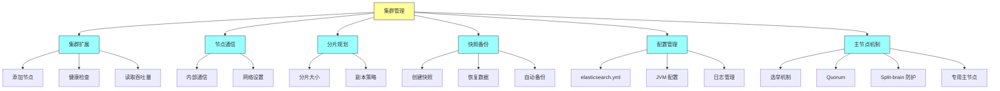
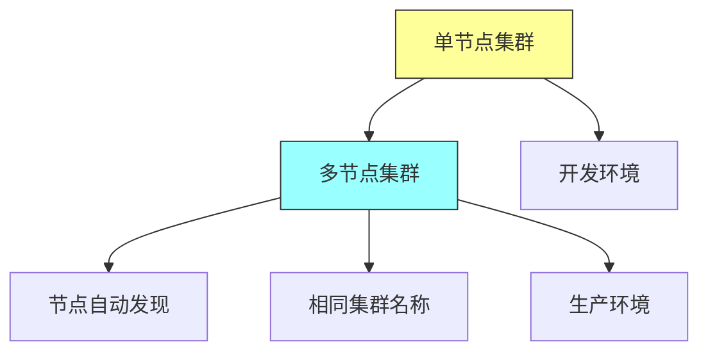
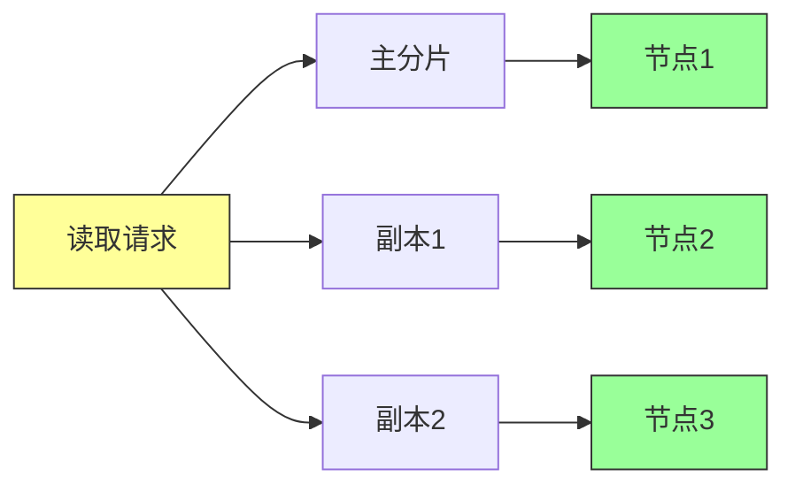
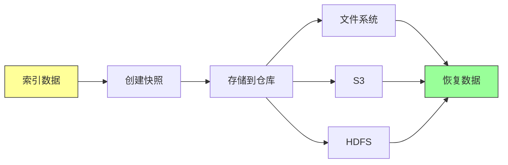
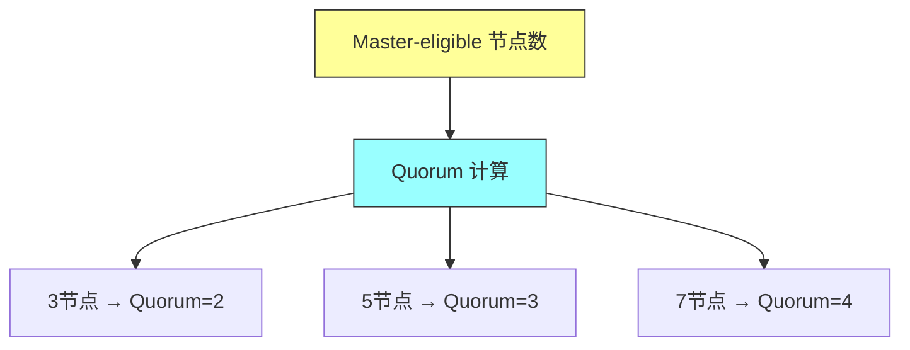
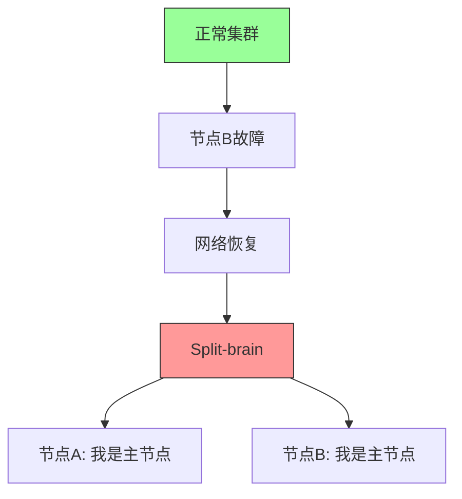

# Elasticsearch in Action - 第十四章：Administration（集群管理）

## 一、本章概述

本章深入探讨 Elasticsearch 的集群管理知识，这是将 Elasticsearch 投入生产环境前必须掌握的核心技能。Elasticsearch 是一个分布式系统，拥有许多移动部件，要掌握每个部件的功能是一项艰巨但可行的任务。虽然大多数 Elasticsearch 功能开箱即用，但仅仅将这些功能部署到生产环境是不够的，还必须进行适当的管理工作。

本章首先介绍集群的扩展和收缩，包括如何添加节点、调整副本数量来提高读取吞吐量。然后讨论节点之间的内部通信以及如何形成集群，网络设置对集群的稳定性至关重要。接着讲解分片大小的规划策略，解释为什么增加副本可以缓解读取性能问题。

任何包含事务和配置数据的服务器都应该定期备份，以避免因不可预见的情况而丢失数据。Elasticsearch 提供了随时快照数据的功能，可以根据需要恢复数据。此外，本章还讨论了 Elasticsearch 的高级配置，包括常用的 elasticsearch.yml 配置文件、如何修改网络设置、增加堆内存以及如何将组件日志级别设置为 trace。最后，详细介绍集群主节点的角色，以及集群如何基于 quorum 进行决策，并探讨 split-brain 场景以了解健康集群所需的最少 master-eligible 节点数量。



### 本章学习目标

通过本章的学习，你将掌握以下核心技能：理解集群扩展和收缩的原理；掌握集群健康状态的检查方法；了解节点之间的通信机制；掌握分片大小的规划策略；熟练使用快照和恢复功能备份数据；能够进行 Elasticsearch 的高级配置；理解集群主节点的选举机制和 quorum 原理；了解 split-brain 问题及其防护措施。

---

## 二、集群扩展

### 2.1 集群扩展概述

Elasticsearch 集群可以根据用例、数据和业务需求扩展到任意数量的节点，从单节点到数百个节点皆可。虽然在学习 Elasticsearch 时我们可能在个人机器上使用单节点集群，但在生产环境中很少使用单节点集群。

选择集群大小是任何组织的重要 IT 策略，需要考虑多个变量、因素和输入来为数据需求规划 Elasticsearch 集群。虽然我们可以向现有集群添加资源（内存或新节点），但提前预测这些需求是很重要的。

### 2.2 添加节点

集群中的每个节点本质上是在专用服务器上运行的 Elasticsearch 实例。不建议在单个服务器上创建多个节点，因为如果该服务器崩溃，您将丢失该服务器上的所有节点。

建议在专用服务器上部署和运行 Elasticsearch，根据需求配置足够的计算能力，而不是将其与其他应用程序捆绑在一起，尤其是与资源消耗大的应用程序捆绑。



当我们首次启动 Elasticsearch 服务器时，会形成一个单节点集群。当我们启动更多节点时（只要所有节点都使用相同的集群名称），它们都会加入形成多节点集群。

### 2.3 集群健康

集群健康状态是监控集群状态的重要指标。Elasticsearch 提供了三种集群健康状态：

**green（绿色）**：所有主分片和副本分片都正常分配，集群完全健康。

**yellow（黄色）**：所有主分片正常分配，但存在未分配的副本分片。这通常是因为副本数量超过了可用节点数量。

**red（红色）**：存在未分配的主分片，这意味着部分数据不可用。这是最严重的健康状态，需要立即处理。

检查集群健康：

```http
GET /_cluster/health
```

检查特定索引的健康状态：

```http
GET /_cluster/health/my_index
```

### 2.4 增加读取吞吐量

可以通过增加副本分片的数量来提高读取吞吐量。因为读取请求可以分配到多个节点，所以增加副本数量可以线性提升读取性能。

```http
PUT my_index/_settings
{
  "number_of_replicas": 2
}
```

将副本数从 1 增加到 2，可以将读取请求分散到 3 个节点（1 个主分片 + 2 个副本分片）上处理。



---

## 三、节点通信

### 3.1 节点通信概述

Elasticsearch 是一个分布式系统，节点之间需要相互通信以协调工作。节点通信涉及集群的形成、分片的分配、数据的复制等核心功能。

### 3.2 Zen Discovery

Elasticsearch 使用 Zen Discovery 模块进行节点发现和选举。Zen Discovery 负责：发现集群中的其他节点；选举主节点；在节点之间进行故障检测；协调分片分配。

### 3.3 网络设置

网络配置对集群稳定性至关重要。主要配置项包括：

**network.host**：绑定到特定网络地址。

**discovery.seed_hosts**：配置种子节点地址列表。

**cluster.name**：所有节点必须使用相同的集群名称才能加入同一集群。

```yaml
# elasticsearch.yml
network.host: 0.0.0.0
discovery.seed_hosts:
  - 192.168.1.1
  - 192.168.1.2
  - 192.168.1.3
cluster.name: my-production-cluster
```

---

## 四、分片规划

### 4.1 分片概述

分片是 Elasticsearch 实现水平扩展的基础。每个索引可以被分割成多个分片，每个分片可以分布到集群中的不同节点上。分片数量在索引创建时指定，之后不能修改。

### 4.2 单索引分片设置

在创建索引时，需要指定主分片数量和副本数量：

```http
PUT my_index
{
  "settings": {
    "number_of_shards": 3,
    "number_of_replicas": 1
  },
  "mappings": {
    "properties": {
      "field1": { "type": "text" },
      "field2": { "type": "keyword" }
    }
  }
}
```

### 4.3 分片策略

**主分片数量**：主分片数量决定了索引的水平扩展能力。更多的分片意味着可以分散到更多节点，但会增加管理开销。

**副本数量**：副本数量决定了数据冗余度和读取吞吐量。建议在生产环境中至少设置 1 个副本。

分片规划的最佳实践：
- 每个分片的大小建议在 30-50GB 之间
- 避免过多的分片（每个节点分片数不超过 20-30 个）
- 根据数据增长预期提前规划

### 4.4 多索引策略

根据业务需求，可能需要创建多个索引而不是将所有数据放入一个索引：

**按时间分索引**：例如每天或每月一个索引，便于历史数据管理和删除。

```http
PUT logs-2024-01-01
{
  "settings": {
    "number_of_shards": 3,
    "number_of_replicas": 1
  }
}
```

**按业务类型分索引**：将不同类型的数据存入不同索引，便于管理和查询。

---

## 五、快照与恢复

### 5.1 快照概述

快照是 Elasticsearch 数据备份的核心功能。任何包含事务和配置数据的服务器都应该定期备份，以避免因不可预见的情况而丢失数据。

Elasticsearch 提供了强大的快照和恢复功能，可以随时快照数据并根据需要恢复。

### 5.2 注册快照仓库

在使用快照之前，需要先注册一个快照仓库。支持的仓库类型包括：文件系统（fs）、Amazon S3、Microsoft Azure、Google Cloud Storage、HDFS 等。

**注册文件系统仓库**：

```http
PUT /_snapshot/my_backup
{
  "type": "fs",
  "settings": {
    "location": "/mount/backups/my_backup",
    "compress": true
  }
}
```

### 5.3 创建快照

**创建整个集群的快照**：

```http
PUT /_snapshot/my_backup/snapshot_1?wait_for_completion=true
{
  "indices": "_all",
  "ignore_unavailable": true,
  "include_global_state": false
}
```

**创建特定索引的快照**：

```http
PUT /_snapshot/my_backup/snapshot_2
{
  "indices": "my_index1,my_index2"
}
```

### 5.4 恢复快照

**恢复整个快照**：

```http
POST /_snapshot/my_backup/snapshot_1/_restore
```

**恢复特定索引**：

```http
POST /_snapshot/my_backup/snapshot_2/_restore
{
  "indices": "my_index1",
  "ignore_unavailable": true,
  "rename_pattern": "my_index1",
  "rename_replacement": "restored_index1"
}
```

### 5.5 管理快照

**查看快照状态**：

```http
GET /_snapshot/my_backup/_all
```

**删除快照**：

```http
DELETE /_snapshot/my_backup/snapshot_1
```

### 5.6 自动快照

可以配置定时任务自动执行快照。在 Linux 系统中，可以使用 cron 调度：

```bash
# 每天凌晨2点执行快照
0 2 * * * curl -X PUT "localhost:9200/_snapshot/my_backup/backup-$(date +\%Y\%m\%d)?wait_for_completion=false"
```



---

## 六、高级配置

### 6.1 elasticsearch.yml 配置文件

elasticsearch.yml 是 Elasticsearch 的主要配置文件，包含集群设置、节点设置、网络设置等。

**基本配置**：

```yaml
# 集群名称
cluster.name: my-production-cluster

# 节点名称
node.name: node-1

# 节点角色
node.master: true
node.data: true
node.ingest: true

# 网络设置
network.host: 0.0.0.0
http.port: 9200
transport.tcp.port: 9300

# 种子节点列表
discovery.seed_hosts:
  - 192.168.1.1
  - 192.168.1.2
  - 192.168.1.3
```

### 6.2 JVM 配置

Elasticsearch 运行在 Java 虚拟机（JVM）上。JVM 堆内存配置对性能至关重要。

**堆内存设置**：建议将堆内存设置为可用 RAM 的 50%。例如，服务器有 64GB RAM，则堆内存设置为 32GB。

```bash
# jvm.options 或 jvm.options.d/custom.options
-Xms32g
-Xmx32g
```

**垃圾回收调优**：对于 Elasticsearch，推荐使用 G1GC（Garbage First Garbage Collector）。

```bash
# 添加到 JVM 选项
-XX:+UseG1GC
-XX:MaxGCPauseMillis=200
```

### 6.3 日志配置

Elasticsearch 使用 Log4j 进行日志记录。默认日志级别是 INFO，可以根据需要调整。

**查看日志**：

```bash
# 查看日志文件
tail -f /var/log/elasticsearch/my-cluster.log
```

**设置日志级别**：可以通过 API 动态调整日志级别：

```http
PUT /_cluster/settings
{
  "transient": {
    "logger.org.elasticsearch.discovery": "DEBUG"
  }
}
```

**常用日志组件**：
- discovery：节点发现
- cluster：集群管理
- index：索引操作
- search：搜索操作
- transport：节点间通信

---

## 七、集群主节点

### 7.1 主节点概述

集群中的每个节点可以分配多个角色：master、data、ingest、ml（机器学习）等。分配 master 角色表示该节点是 master-eligible 节点。主节点负责集群范围内的操作，如分配分片、管理索引等。

主节点是保持集群健康的关键组件，负责维护集群和节点社区的状态。一个集群只有一个主节点，其唯一职责是处理集群操作。

### 7.2 主节点选举

集群主节点通过选举产生！当集群首次形成或当前主节点死亡时，会进行选举。

如果主节点因任何原因崩溃，master-eligible 节点会发起选举。成员投票选举新的主节点。选举完成后，主节点接管集群管理工作。

**选举配置**：

```yaml
# 选举超时设置
cluster.election.duration: 500ms
cluster.election.initial_timeout: 500ms
```

### 7.3 集群状态

集群状态包含关于分片、副本、模式、映射、字段信息等所有元数据。这些详细信息作为全局状态存储在集群中，并写入每个节点。主节点是唯一可以提交集群状态的节点。

**集群状态更新流程**：

1. 主节点计算集群变更，发布到各个节点，然后等待确认
2. 每个节点接收集群更新，但尚未应用到本地状态。收到后，它们向主节点发送确认
3. 当主节点收到来自 master-eligible 节点的 quorum 确认后，将更改提交到集群状态
4. 主节点广播最终消息，指示各节点提交之前接收的集群更改
5. 各个节点提交集群更新

### 7.4 Quorum 机制

主节点负责维护和管理集群。但是，对于集群状态更新和主节点选举，它会咨询 master-eligible 节点的 quorum。

Quorum 是选择主节点有效运营集群所需的 master-eligible 节点的子集。这是主节点就集群状态和其他问题达成共识的大多数节点。

**计算公式**：
```
最小 master-eligible 节点数 = (总 master-eligible 节点数 / 2) + 1
```

例如，如果有 8 个 master-eligible 节点，则 quorum = 8 / 2 + 1 = 5。

**建议**：任何节点集群推荐的最小 master-eligible 成员数是 3。设置 3 个 master-eligible 节点是管理集群的可靠方法。



### 7.5 Split-brain 问题

Elasticsearch 的集群健康在很大程度上依赖于网络、内存、JVM 垃圾回收等因素。在某些情况下，集群会被分成两个集群，部分节点在一个集群中，部分在另一个集群中。这就是所谓的 split-brain（脑裂）问题。

**问题场景**：假设一个两节点集群，节点 A 被选为主节点。如果节点 B 因硬件问题死亡，节点 A 继续工作，集群变成事实上的单节点集群。

当节点 B 重新启动时，如果网络连接中断，节点 B 无法看到节点 A 的存在。这导致节点 B 认为集群中没有主节点，从而自己成为主节点，形成 split-brain 局面。

**解决方案**：
- 配置足够的 master-eligible 节点（至少 3 个）
- 正确设置 quorum
- 使用专用主节点



### 7.6 专用主节点

可以配置专用主节点，只负责集群管理，不承担数据服务。这可以提高集群的稳定性和管理效率。

**配置专用主节点**：

```yaml
# 在专用主节点上配置
node.master: true
node.data: false
node.ingest: false

# 在数据节点上配置
node.master: false
node.data: true
node.ingest: false
```

**推荐的节点角色配置**：

| 节点类型 | master | data | ingest | ml |
|---------|--------|------|--------|-----|
| 主节点 | ✓ | ✗ | ✗ | ✗ |
| 数据节点 | ✗ | ✓ | ✓ | ✗ |
| Ingest 节点 | ✗ | ✗ | ✓ | ✗ |

---

## 八、最佳实践

### 8.1 集群规划建议

**节点部署**：每个节点部署在独立的服务器上，确保硬件故障不会同时影响多个节点。

**硬件选择**：
- CPU：多核处理器
- 内存：建议 64GB 以上
- 磁盘：SSD 优先
- 网络：高速网络

**master-eligible 节点**：至少配置 3 个 master-eligible 节点，避免 split-brain 问题。

### 8.2 监控建议

**监控项**：
- 集群健康状态
- 节点状态和负载
- 分片分配状态
- JVM 堆内存使用率
- 磁盘空间

**使用工具**：
- Kibana Dev Tools
- Elasticsearch _stats API
- Monitoring 插件
- Prometheus + Grafana

### 8.3 备份策略

**定期快照**：
- 每天执行全量快照
- 每小时执行增量快照
- 将快照存储到异地

**测试恢复**：定期测试恢复流程，确保备份有效。

---

## 九、常见问题

**Q1：如何增加副本数量？**

使用索引设置 API 可以动态调整副本数量：
```http
PUT my_index/_settings
{ "number_of_replicas": 2 }
```

**Q2：集群变红（red）怎么办？**

检查未分配的分片，分析原因（磁盘空间不足、节点离线等），然后采取相应措施修复。

**Q3：如何查看分片分布？**

```http
GET _cat/shards?v
```

**Q4：主节点选举失败怎么办？**

检查网络连接，确保 master-eligible 节点可以相互通信。检查节点配置是否正确。

**Q5：如何防止 split-brain？**

确保集群至少有 3 个 master-eligible 节点，并正确配置 quorum。

---

## 十、实践练习

1. 创建包含多个节点的集群，验证节点自动发现

2. 检查集群健康状态，观察 green/yellow/red 状态

3. 调整索引副本数量，观察读取性能变化

4. 配置快照仓库，执行快照创建和恢复操作

5. 修改 elasticsearch.yml 配置，重启节点验证

6. 调整 JVM 堆内存设置，验证生效

7. 配置 3 个 master-eligible 节点，验证 quorum 机制

8. 模拟节点故障，观察主节点选举过程

9. 配置专用主节点，分离集群管理职责

10. 设置日志级别，使用 API 动态调整

---

## 本章小结

本章深入学习了 Elasticsearch 集群管理的核心知识。集群管理是生产环境部署的关键环节，涉及多个方面的知识和技能。

集群扩展是实现水平扩展的基础，通过添加节点可以提高系统的吞吐量和可用性。节点之间的通信机制确保了集群的协调工作，网络配置的稳定性对集群至关重要。

分片规划是影响性能的重要因素，合理的分片策略可以提高查询性能和故障恢复能力。快照与恢复是数据安全的保障，定期备份是生产环境的必要措施。

高级配置允许我们根据业务需求调整 Elasticsearch 的行为，包括网络设置、内存配置和日志管理。主节点机制是集群稳定运行的核心，理解选举、quorum 和 split-brain 问题对于构建高可用集群至关重要。

掌握这些集群管理知识，将帮助你构建稳定、高效、可维护的 Elasticsearch 生产环境。
