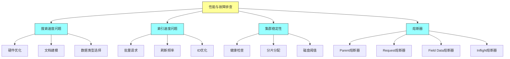
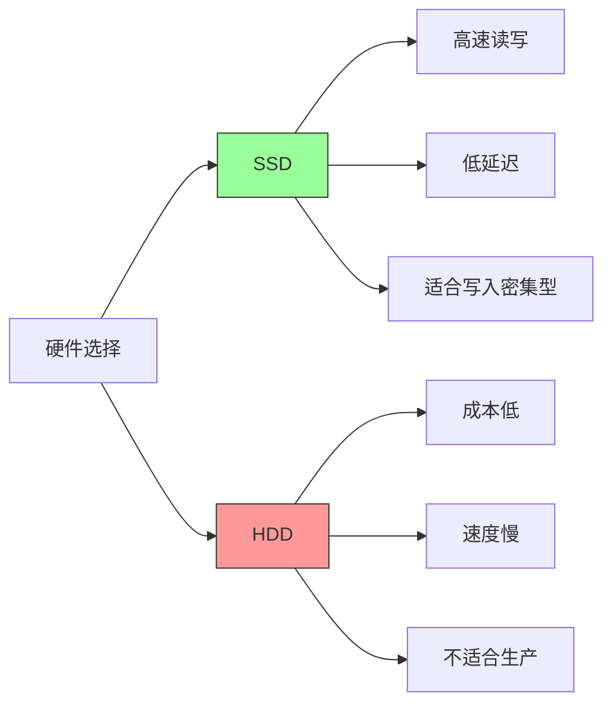
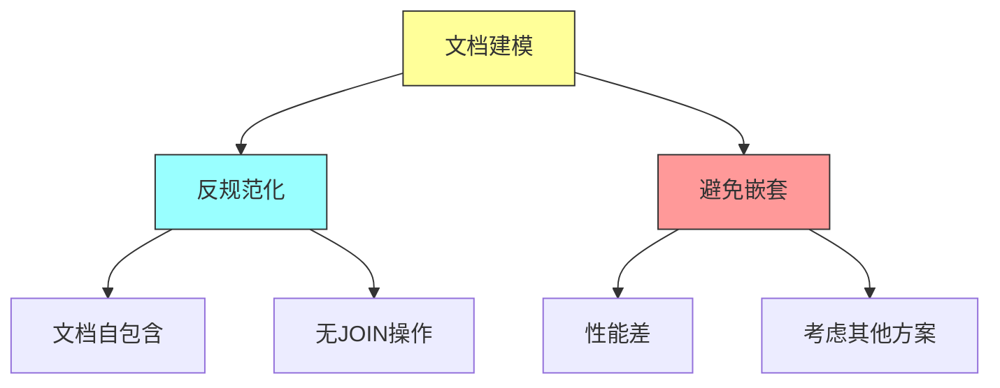
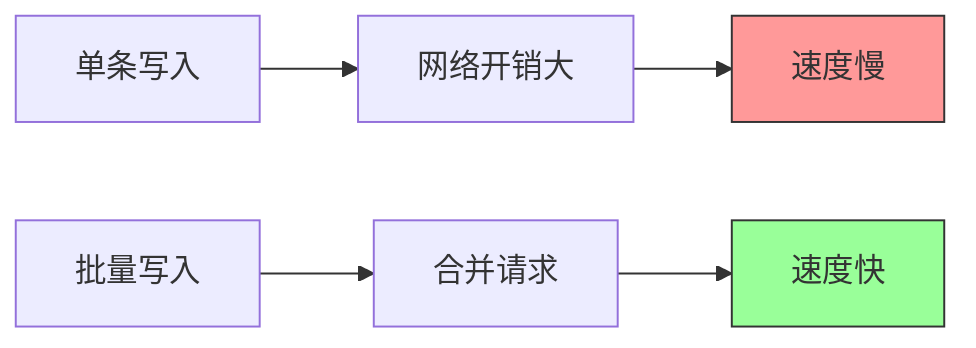
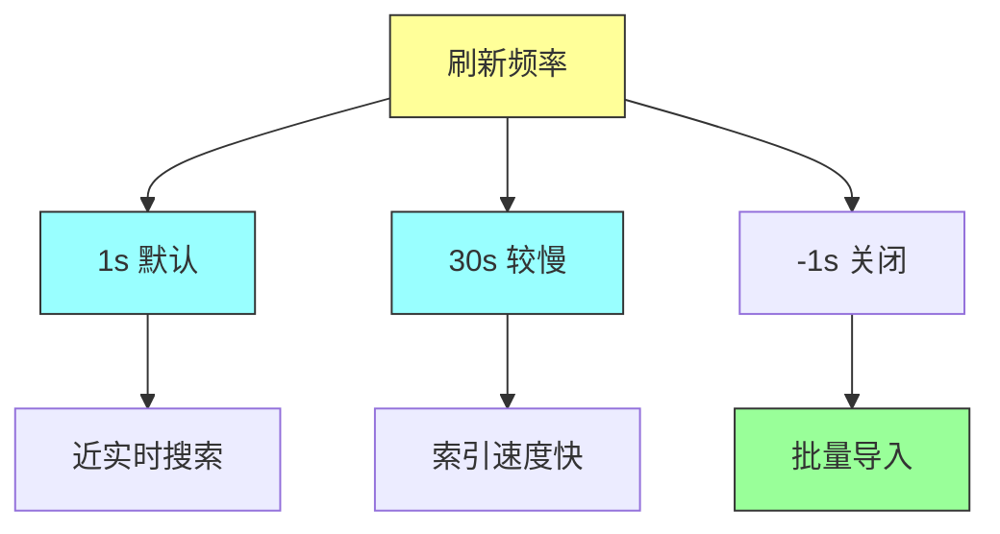
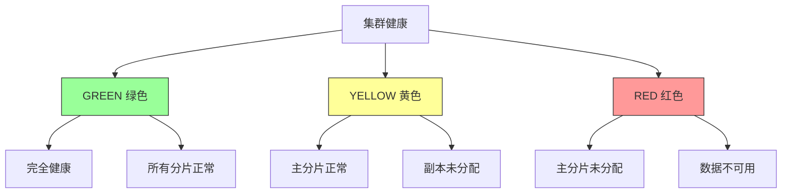
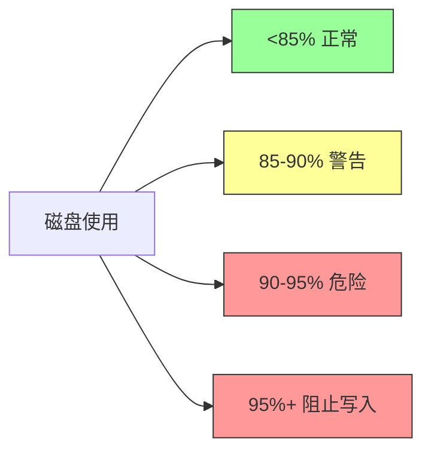
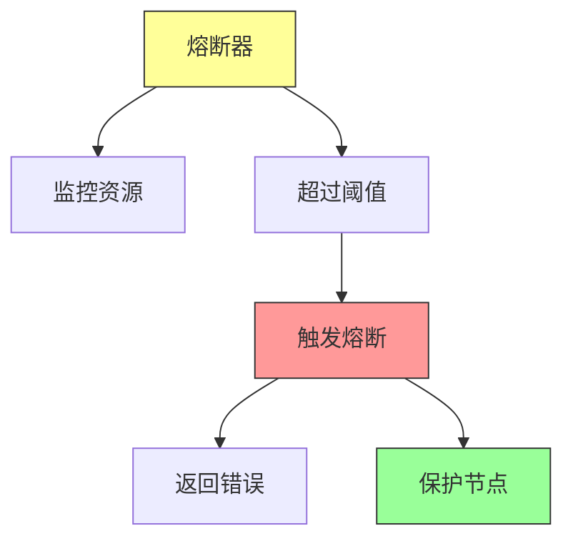
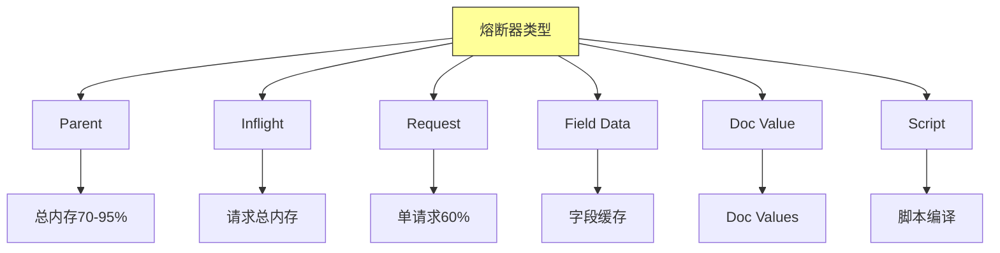

# Elasticsearch in Action - 第十五章：Performance and Troubleshooting（性能与故障排查）

## 一、本章概述

本章深入探讨 Elasticsearch 的性能优化和故障排查知识。Elasticsearch 是一个复杂的分布式架构，性能问题可能出现在多个环节。当生产集群出现故障时，可能会出现各种意想不到的问题，因此不仅需要掌握基本的排查方法，更需要理解系统的底层原理。

Elasticsearch 以其极快的查询速度著称，但这并不意味着开箱即用的配置能够满足所有需求。性能优化需要考虑多个变量，包括节点的合理分布、分片和副本的配置、内存管理和硬件可用性等。本章将从搜索速度问题、索引速度问题、集群稳定性和熔断器四个方面，全面介绍性能优化和故障排查的核心知识。



### 本章学习目标

通过本章的学习，你将掌握以下核心技能：理解搜索速度慢的常见原因及优化方法；掌握索引性能优化的技巧；能够诊断和解决集群不稳定问题；理解熔断器的工作原理和配置方法；能够在实际工作中进行基本的性能调优和故障排查。

---

## 二、搜索速度问题

### 2.1 问题概述

虽然 Elasticsearch 是一个近实时（NRT）的搜索引擎，但我们必须谨慎配置以确保它在各种场景下正常工作。随着时间的推移，如果架构设计时没有考虑未来的数据需求，并且缺乏持续维护，Elasticsearch 的性能可能会下降。服务器性能的下降对整体集群健康有害，会影响搜索查询和索引性能。

用户报告的最常见问题包括：搜索查询响应慢、索引速度慢。理解这些问题的根本原因并采取相应的优化措施，是保持系统高性能的关键。

### 2.2 现代硬件优化

Elasticsearch 底层使用 Lucene 进行数据索引和存储。虽然 Lucene 高效地处理文件系统存储，但使用更好的硬件可以进一步提升性能。

**SSD vs HDD**：优先使用固态硬盘（SSD）而非机械硬盘（HDD）。SSD 的读写速度远高于 HDD，可以显著减少 I/O 延迟。



**内存配置**：Elasticsearch 是用 Java 开发的，分配足够的堆内存对应用程序的顺畅运行至关重要。堆是存储新对象的内存位置，新对象存储在年轻代空间。当年轻代空间填满后，存活的对象会被移动到老年代。

一般建议将至少一半的内存分配给堆内存。例如，如果机器配置了 16GB RAM，请确保堆内存至少设置为 8GB。

```bash
# jvm.options 配置
-Xms8g
-Xmx8g
```

**本地存储**：使用本地存储磁盘比使用网络文件系统具有更好的性能。在为节点配置存储时，本地卷是更好的策略。

**网络带宽**：随着分片数量增加，节点之间的通信也会增加。因此，性能也依赖于网络容量和带宽。确保集群节点之间有高速的网络连接。

### 2.3 文档建模优化

**反规范化设计**：Elasticsearch 是一个 NoSQL 数据库，数据应该反规范化，这与关系数据库中数据需要规范化的做法不同。例如，创建一个员工记录时，应该包含员工的完整信息，而不是通过 ID 引用其他表。

**避免嵌套类型**：Elasticsearch 中的每个文档都是自包含的，不应该对数据进行关联操作。如果数据主要是父子关系，可能需要重新考虑是否适合使用 Elasticsearch。嵌套（nested）和父子（parent-child）操作从一开始就很慢，会严重影响性能。



**多字段搜索优化**：搜索多个字段会降低查询响应时间。建议将多个字段合并到一个字段中进行搜索。Elasticsearch 提供了 copy_to 属性来实现这一目标。

```http
PUT books
{
  "mappings": {
    "properties": {
      "title": {
        "type": "text",
        "copy_to": "combined_field"
      },
      "synopsis": {
        "type": "text",
        "copy_to": "combined_field"
      },
      "combined_field": {
        "type": "text"
      }
    }
  }
}
```

这样可以只搜索 combined_field 而非同时搜索 title 和 synopsis。

### 2.4 数据类型选择

**Keyword vs Text**：如果不需要进行全文搜索，使用 keyword 类型可以获得更好的性能。text 类型会经过分析器处理，而 keyword 类型是精确匹配，不需要分析过程。

```http
PUT products
{
  "mappings": {
    "properties": {
      "sku": {
        "type": "keyword"
      },
      "name": {
        "type": "text"
      }
    }
  }
}
```

对于精确匹配的场景（如 SKU、ID、状态码等），始终使用 keyword 类型。

---

## 三、索引速度问题

### 3.1 系统生成的 ID

默认情况下，Elasticsearch 会为每个文档自动生成一个 ID。这个自动生成的 ID 是 UUID，包含了数字和字母的随机组合。使用自动生成的 ID 可能会导致写入热点，因为连续的文档可能被分配到相同的分片上。

**优化建议**：使用自定义 ID 可以更好地控制数据分布，避免写入热点。

```http
PUT products/_doc/12345
{
  "name": "Sample Product",
  "price": 99.99
}
```

### 3.2 批量请求

批量请求是提高索引速度的最有效方法之一。单个文档的索引请求会产生大量的网络开销，而批量请求可以将多个文档的索引操作合并为一个请求。

```http
POST _bulk
{ "index": { "_index": "products", "_id": "1" } }
{ "name": "Product 1", "price": 10 }
{ "index": { "_index": "products", "_id": "2" } }
{ "name": "Product 2", "price": 20 }
{ "index": { "_index": "products", "_id": "3" } }
{ "name": "Product 3", "price": 30 }
```

批量请求的最佳大小通常在 1000-5000 个文档之间，具体取决于文档大小和可用内存。



### 3.3 调整刷新频率

Elasticsearch 默认每秒刷新一次（refresh_interval 为 1s），这意味着新索引的文档在 1 秒后就可以被搜索到。对于大量数据导入的场景，可以临时调整刷新频率来提高索引速度。

**临时关闭刷新**：

```http
PUT my_index/_settings
{
  "refresh_interval": -1
}
```

**批量导入完成后恢复**：

```http
PUT my_index/_settings
{
  "refresh_interval": "1s"
}
```

**延长刷新间隔**：

```http
PUT my_index/_settings
{
  "refresh_interval": "30s"
}
```



**注意事项**：关闭或延长刷新间隔会牺牲搜索的近实时性。只在批量导入期间使用，完成后记得恢复。

### 3.4 其他优化技巧

**使用正确的分片数**：过多的分片会增加管理开销，建议每个分片大小在 30-50GB 之间。

**调整合并策略**：Lucene 会在后台定期合并小的段文件，可以调整合并频率以减少 I/O 开销。

```http
PUT my_index/_settings
{
  "indices.merge.policy.max_merge_at_once": 10,
  "indices.merge.policy.segments_per_tier": 10
}
```

---

## 四、集群稳定性问题

### 4.1 集群健康状态

集群健康是监控集群状态的重要指标。Elasticsearch 提供了三种健康状态：

**GREEN（绿色）**：所有主分片和副本分片都正常分配，集群完全健康。

**YELLOW（黄色）**：所有主分片正常分配，但存在未分配的副本分片。这通常是因为副本数量超过了可用节点数量。

**RED（红色）**：存在未分配的主分片，这意味着部分数据不可用。这是最严重的健康状态，需要立即处理。



### 4.2 未分配分片问题

未分配的分片是集群不稳定的常见原因。可以通过以下命令查看未分配的分片：

```http
GET _cluster/allocation/explain
{
  "index": "my_index",
  "shard": 0,
  "primary": true
}
```

**常见原因及解决方案**：

**磁盘空间不足**：检查节点磁盘使用情况，清理数据或添加新节点。

```http
GET _cat/allocation?v
```

**节点离线**：检查节点状态，确保节点重新上线。

```http
GET _cat/nodes?v
```

**分片损坏**：可能需要删除并重新索引数据。

**分片分配过滤**：检查是否有过多的分片分配规则阻止了分片分配。

### 4.3 磁盘使用阈值

Elasticsearch 会自动监控磁盘使用情况，并采取措施防止磁盘空间不足导致的集群问题。

**磁盘空间阈值配置**：

```http
PUT _cluster/settings
{
  "transient": {
    "cluster.routing.allocation.disk.threshold_enabled": true,
    "cluster.routing.allocation.disk.watermark.low": "85%",
    "cluster.routing.allocation.disk.watermark.high": "90%",
    "cluster.routing.allocation.disk.watermark.flood_stage": "95%"
  }
}
```

- **low**：磁盘使用超过此阈值时，Elasticsearch 不会将分片分配到该节点
- **high**：磁盘使用超过此阈值时，Elasticsearch 会尝试将分片从该节点移走
- **flood_stage**：磁盘使用超过此阈值时，Elasticsearch 会阻止写入该节点上的索引



---

## 五、熔断器

### 5.1 熔断器概述

在分布式架构和应用中，远程调用失败是常见问题。客户端可能长时间等待后只收到一个错误。熔断器模式正是为了解决这一问题而设计的。

熔断器是一种回退方法，当响应因服务器端问题（如内存不足、资源锁定等）超过阈值时间时触发。这就像在排队购买 iPhone 时等待很长时间，结果商店告诉你缺货，但给你一张礼品券。

Elasticsearch 实现了熔断器来对抗阻碍客户端进度的问题。当熔断器触发时，Elasticsearch 会向客户端抛出有意义的错误。



### 5.2 熔断器类型

Elasticsearch 有六种类型的熔断器，用于不同的场景：

**Parent 熔断器**：总体内存限制，可以跨所有其他熔断器计算总内存使用。如果考虑实时内存，默认为 JVM 堆内存的 70%；否则为 95%。

**Inflight Requests 熔断器**：所有正在进行的请求的总内存不能超过阈值。默认值为 JVM 堆内存的 100%。

**Request 熔断器**：帮助防止超出堆内存来服务单个请求。默认值为 JVM 堆内存的 60%。

**Field Data 熔断器**：帮助防止在将字段加载到字段缓存时超出内存。

**Doc Value 熔断器**：帮助防止在构建 Doc Values 时超出内存。

**Script 熔断器**：帮助防止脚本编译超出内存。



### 5.3 查看熔断器配置

```http
GET _nodes/stats/breaker
```

### 5.4 调整熔断器限制

如果需要调整熔断器限制（谨慎操作）：

```http
PUT _cluster/settings
{
  "persistent": {
    "indices.breaker.request.limit": "70%"
  }
}
```

---

## 六、最佳实践

### 6.1 性能优化清单

**硬件层面**：
- 使用 SSD 存储
- 分配足够的内存（堆内存为可用 RAM 的 50%）
- 使用本地存储
- 确保网络带宽充足

**索引设计**：
- 合理设置分片数量（每个分片 30-50GB）
- 适当设置副本数量
- 使用合适的分析器

**查询优化**：
- 只返回必要的字段
- 使用过滤器而非查询（不计算评分）
- 避免通配符查询
- 使用 keyword 类型进行精确匹配

### 6.2 监控建议

**监控指标**：
- 集群健康状态
- 节点 CPU、内存、磁盘使用率
- 查询响应时间
- 索引吞吐量
- JVM 堆内存使用率和 GC 频率

**使用工具**：
- Kibana Monitoring
- Elasticsearch _stats API
- Prometheus + Grafana

---

## 七、常见问题

**Q1：搜索速度很慢怎么办？**

首先检查硬件是否满足要求（SSD、足够内存）。然后检查文档建模是否合理，是否可以优化查询语法。可以使用 Profile API 分析查询性能。

```http
GET my_index/_search
{
  "profile": true,
  "query": { ... }
}
```

**Q2：索引速度下降怎么办？**

检查是否有大批量写入、是否触发了合并、磁盘 I/O 是否饱和。可以临时调整 refresh_interval 来提高批量写入速度。

**Q3：集群变红怎么办？**

使用 allocation explain API 查找原因。常见原因包括磁盘空间不足、节点离线、分片损坏等。

**Q4：内存使用率很高怎么办？**

检查是否有大查询加载了过多数据到内存。考虑增加堆内存或优化查询。检查熔断器触发情况。

**Q5：如何预防性能问题？**

- 合理规划硬件资源
- 监控关键指标
- 定期维护和优化
- 遵循最佳实践进行索引和查询设计

---

## 八、实践练习

1. 在测试环境中对比 SSD 和 HDD 的索引性能

2. 使用 bulk API 批量导入数据，对比单条导入的性能差异

3. 临时关闭刷新频率，测试批量导入速度

4. 使用 copy_to 优化多字段搜索

5. 模拟磁盘空间不足，观察集群行为

6. 查看熔断器配置并尝试调整

7. 使用 Profile API 分析查询性能

8. 配置监控仪表盘，监控集群关键指标

---

## 九、结语

生产集群可能出现的故障数量巨大，穷尽所有性能和排查问题是不现实的。大多数问题需要详细调查，包括应用分析、日志筛选、反复尝试等。建议保持冷静，有条不紊地维护健康稳定的集群。

建议在非生产环境充分测试 Elasticsearch，使用更大的数据集（预估未来数据量）进行实验，不仅要理解基础设施，还要深入理解搜索和文件 I/O 性能指标。官方文档、讨论论坛（Stack Overflow）和技术博客都是很好的学习资源。

Elasticsearch 是一个复杂的搜索引擎，维护和管理健康集群需要专业知识。虽然官方文档有时枯燥和冗长，但在遇到问题时可以提供很大帮助。通过不断学习和实践，你将能够有效地管理和优化你的 Elasticsearch 集群。

---

## 本章小结

本章深入学习了 Elasticsearch 性能优化和故障排查的核心知识。性能问题是分布式系统中的常见挑战，需要从多个层面进行考虑和优化。

搜索速度优化需要从硬件、文档建模、数据类型选择等方面入手。使用 SSD、分配足够的内存、合理设计文档结构、选择合适的数据类型都可以显著提升搜索性能。

索引速度优化主要通过批量请求和调整刷新频率来实现。批量请求可以大幅减少网络开销，临时调整刷新间隔可以加速大规模数据导入。

集群稳定性问题需要通过监控集群健康、分析未分配分片原因、合理配置磁盘阈值来解决。及时发现和处理问题可以防止小问题演变成大故障。

熔断器是 Elasticsearch 保护节点的重要机制，理解各种熔断器的功能和限制，可以帮助我们更好地设计和优化查询，避免因单个查询导致整个节点崩溃。

掌握这些性能优化和故障排查知识，将帮助你构建和维护高性能、高可用的 Elasticsearch 集群。
