# 第一章：算法在计算中的作用

## 一、算法是什么

### 1.1 算法的定义

**算法（Algorithm）** 是解决特定问题的一系列清晰指令。

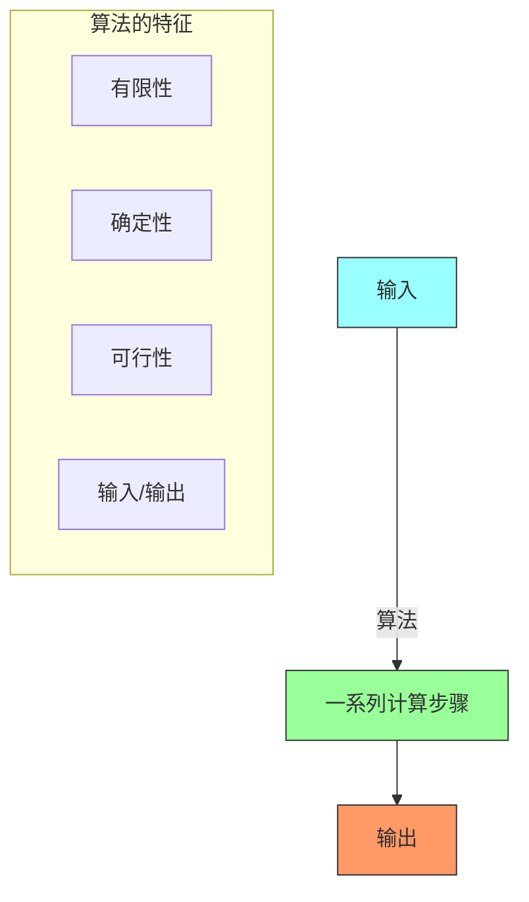

**算法的五大特征**：

| 特征 | 描述 | 示例 |
|-----|------|-----|
| **输入** | 零个或多个输入 | 排序算法的待排序数组 |
| **输出** | 至少一个输出 | 排序后的数组 |
| **确定性** | 每步指令清晰无歧义 | `x = x + 1` |
| **可行性** | 每步可由基本操作完成 | 加减乘除 |
| **有限性** | 有限步骤后终止 | 排序一定结束 |

### 1.2 算法的形式化描述

```java
/**
 * 线性查找算法
 *
 * @param array 待查找的数组
 * @param target 目标值
 * @return 目标值的索引，若不存在返回 -1
 */
public static int linearSearch(int[] array, int target) {
    for (int i = 0; i < array.length; i++) {
        if (array[i] == target) {
            return i;  // 找到返回索引
        }
    }
    return -1;  // 未找到
}
```

### 1.3 算法与程序的区别

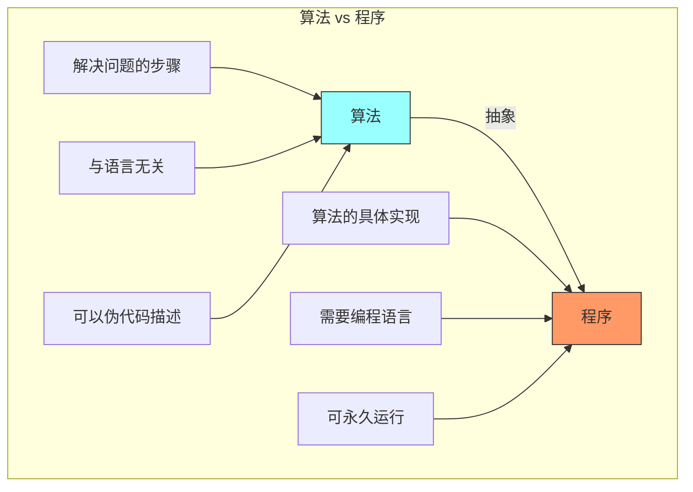

## 二、算法的历史

### 2.1 算法发展时间线

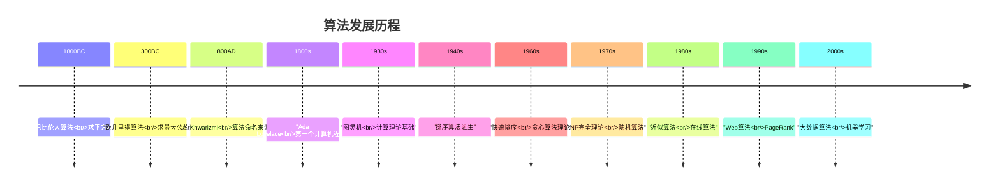

### 2.2 关键历史人物

| 人物 | 年代 | 贡献 |
|-----|------|-----|
| **Al-Khwarizmi** | 9世纪 | "算法"一词来源于他的名字 |
| **欧几里得** | 公元前300年 | 欧几里得算法（gcd） |
| **Ada Lovelace** | 1843年 | 第一个计算机程序设计者 |
| **Alan Turing** | 1936年 | 图灵机模型 |
| **Donald Knuth** | 1968年 | 《计算机程序设计艺术》 |
| **Cormen等** | 1990年 | 《算法导论》第一版 |

## 三、为什么学习算法

### 3.1 算法的重要性

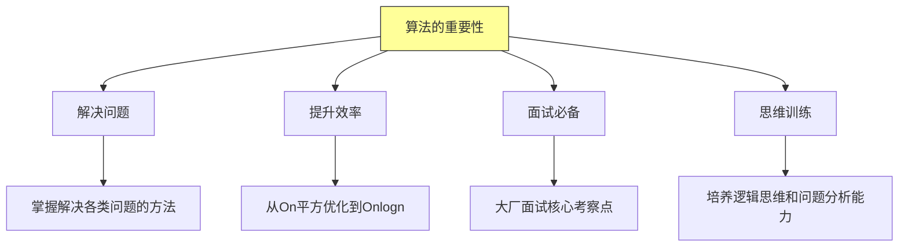

### 3.2 算法效率的威力

**排序 100 万个元素的对比**：

| 算法 | 时间复杂度 | 实际耗时（估算） |
|-----|----------|----------------|
| 冒泡排序 | On平方 | 数小时 |
| 快速排序 | Onlogn | 约 1 秒 |
| 归并排序 | Onlogn | 约 1 秒 |
| 基数排序 | On | 约 0.1 秒 |

**关键洞察**：选择正确的算法可以将性能提升几个数量级！

### 3.3 实际应用场景

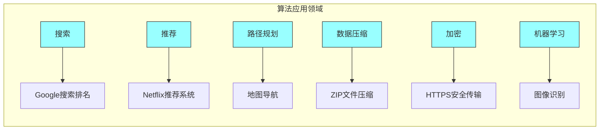

## 四、算法问题示例

### 4.1 排序问题

**问题描述**：将一组无序的数字按从小到大的顺序排列。

```java
/**
 * 排序问题示例
 * 输入: [64, 34, 25, 12, 22, 11, 90]
 * 输出: [11, 12, 22, 25, 34, 64, 90]
 */
public class SortingExample {

    // 冒泡排序实现
    public static void bubbleSort(int[] arr) {
        int n = arr.length;
        for (int i = 0; i < n - 1; i++) {
            for (int j = 0; j < n - i - 1; j++) {
                if (arr[j] > arr[j + 1]) {
                    // 交换
                    int temp = arr[j];
                    arr[j] = arr[j + 1];
                    arr[j + 1] = temp;
                }
            }
        }
    }

    public static void main(String[] args) {
        int[] arr = {64, 34, 25, 12, 22, 11, 90};
        System.out.println("排序前: " + java.util.Arrays.toString(arr));
        bubbleSort(arr);
        System.out.println("排序后: " + java.util.Arrays.toString(arr));
    }
}
```

**运行结果**：
```
排序前: [64, 34, 25, 12, 22, 11, 90]
排序后: [11, 12, 22, 25, 34, 64, 90]
```

### 4.2 搜索问题

**问题描述**：在数组中查找特定元素的位置。

```java
/**
 * 二分查找 - 高效搜索算法
 *
 * 前提：数组必须有序
 * 时间复杂度: Olog n
 */
public class BinarySearch {

    public static int binarySearch(int[] arr, int target) {
        int left = 0;
        int right = arr.length - 1;

        while (left <= right) {
            int mid = left + (right - left) / 2;  // 防止溢出

            if (arr[mid] == target) {
                return mid;  // 找到
            } else if (arr[mid] < target) {
                left = mid + 1;  // 在右半边查找
            } else {
                right = mid - 1;  // 在左半边查找
            }
        }
        return -1;  // 未找到
    }

    public static void main(String[] args) {
        int[] arr = {11, 12, 22, 25, 34, 64, 90};
        int target = 25;
        int result = binarySearch(arr, target);

        if (result != -1) {
            System.out.println("元素 " + target + " 在索引 " + result + " 处");
        } else {
            System.out.println("元素 " + target + " 不存在");
        }
    }
}
```

### 4.3 字符串匹配问题

**问题描述**：在一个文本中查找模式串的位置。

```java
/**
 * 朴素字符串匹配算法
 */
public class StringMatching {

    /**
     * 在文本中搜索模式串
     * @param text 文本
     * @param pattern 模式串
     * @return 模式串在文本中的起始索引
     */
    public static int naiveSearch(String text, String pattern) {
        int n = text.length();
        int m = pattern.length();

        for (int i = 0; i <= n - m; i++) {
            int j;
            for (j = 0; j < m; j++) {
                if (text.charAt(i + j) != pattern.charAt(j)) {
                    break;
                }
            }
            if (j == m) {
                return i;  // 找到匹配
            }
        }
        return -1;  // 未找到
    }

    public static void main(String[] args) {
        String text = "ABABDABACDABABCABAB";
        String pattern = "ABABCABAB";

        int result = naiveSearch(text, pattern);
        if (result != -1) {
            System.out.println("模式串在文本中的索引: " + result);
        } else {
            System.out.println("未找到匹配");
        }
    }
}
```

## 五、算法正确性证明

### 5.1 正确性的定义

一个算法是正确的，如果：
1. 对所有**合法输入**，算法都会**终止**
2. 输出**满足问题的要求**

### 5.2 循环不变式

**循环不变式（Loop Invariant）** 是证明算法正确性的关键工具。

```java
// 冒泡排序的循环不变式
public static void bubbleSort(int[] arr) {
    for (int i = 0; i < arr.length - 1; i++) {
        // 循环不变式：
        // arr[0..i] 包含了数组中最大的 i+1 个元素，且已排序
        for (int j = 0; j < arr.length - i - 1; j++) {
            if (arr[j] > arr[j + 1]) {
                swap(arr, j, j + 1);
            }
        }
    }
}
```

**循环不变式的三个性质**：

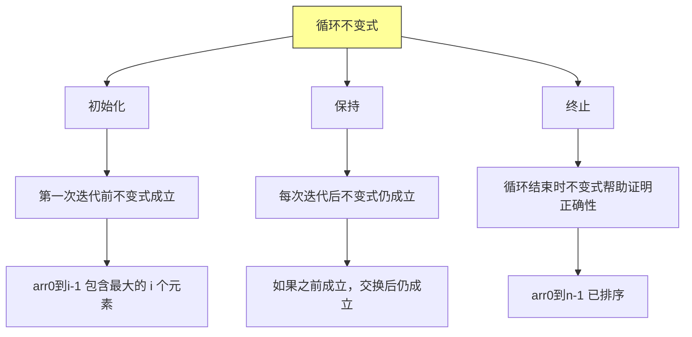

## 六、算法的分析方法

### 6.1 时间复杂度

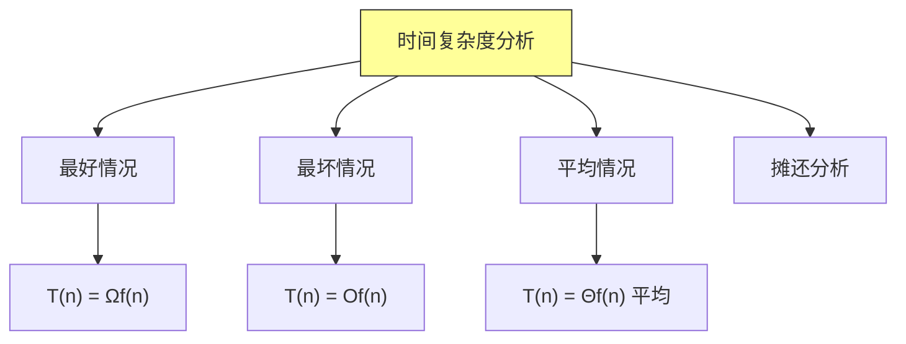

### 6.2 渐进符号

| 符号 | 含义 | 描述 |
|-----|------|------|
| **Ofn** | 上界 | 不超过 fn 的某个常数倍 |
| **Ωfn** | 下界 | 至少是 fn 的某个常数倍 |
| **Θfn** | 紧界 | 同时是上界和下界 |

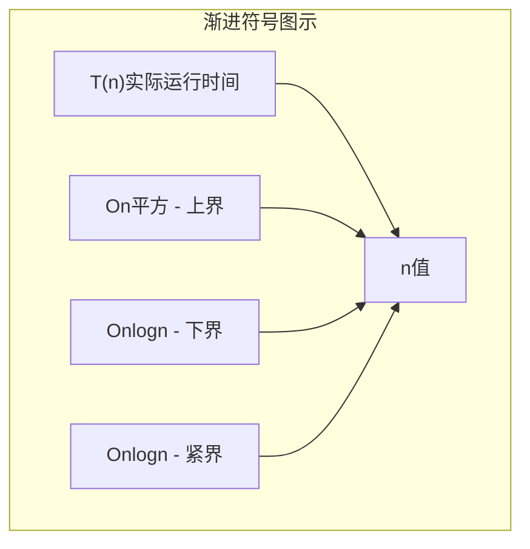

### 6.3 常见复杂度对比

| 复杂度 | 名称 | 1,000条 | 1,000,000条 | 示例 |
|-------|------|---------|------------|------|
| O1 | 常数 | 1 | 1 | 哈希查找 |
| Olog n | 对数 | 10 | 20 | 二分查找 |
| On | 线性 | 1,000 | 1,000,000 | 线性查找 |
| Onlogn | 线性对数 | 10,000 | 20,000,000 | 堆排序 |
| On平方 | 平方 | 1,000,000 | 10的12次方 | 冒泡排序 |
| O2的n次方 | 指数 | 2的1000次方 | 巨大 | 旅行商问题 |

## 七、数据结构回顾

### 7.1 基本数据结构

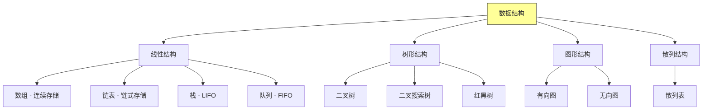

### 7.2 数据结构选择指南

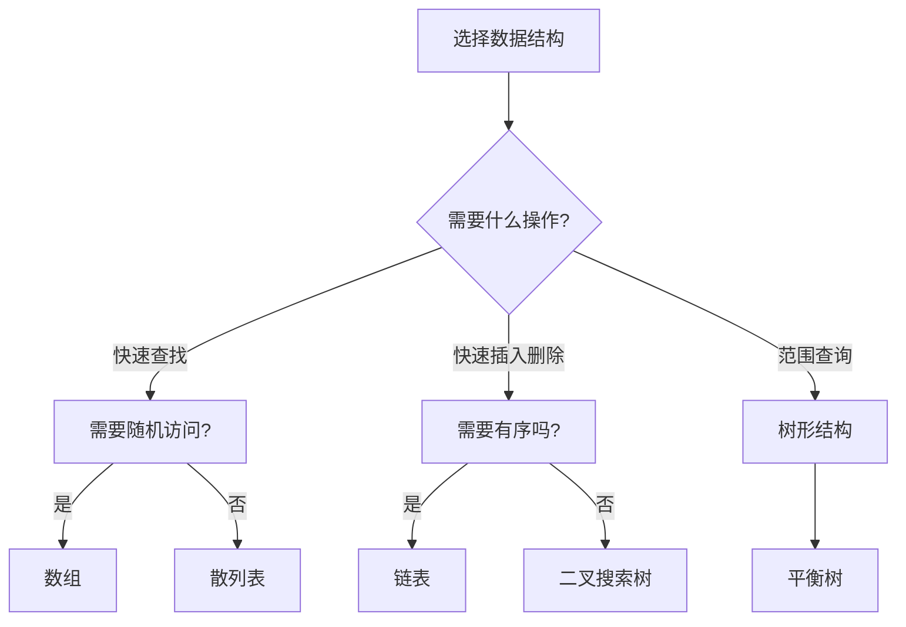

## 八、Python 实现示例

### 8.1 线性查找（Python）

```python
def linear_search(arr, target):
    """
    线性查找算法

    Args:
        arr: 待查找的数组
        target: 目标值

    Returns:
        目标值的索引，若不存在返回 -1
    """
    for i, num in enumerate(arr):
        if num == target:
            return i  # 找到，返回索引
    return -1  # 未找到


# 测试
if __name__ == "__main__":
    arr = [64, 34, 25, 12, 22, 11, 90]
    target = 25
    result = linear_search(arr, target)

    if result != -1:
        print(f"元素 {target} 在索引 {result} 处")
    else:
        print(f"元素 {target} 不存在")
```

### 8.2 二分查找（Python）

```python
def binary_search(arr, target):
    """
    二分查找算法

    Args:
        arr: 已排序的数组
        target: 目标值

    Returns:
        目标值的索引，若不存在返回 -1
    """
    left, right = 0, len(arr) - 1

    while left <= right:
        mid = left + (right - left) // 2  # 防止溢出

        if arr[mid] == target:
            return mid
        elif arr[mid] < target:
            left = mid + 1
        else:
            right = mid - 1

    return -1


# 测试
if __name__ == "__main__":
    arr = [11, 12, 22, 25, 34, 64, 90]
    targets = [25, 100]

    for t in targets:
        result = binary_search(arr, t)
        if result != -1:
            print(f"元素 {t} 在索引 {result} 处")
        else:
            print(f"元素 {t} 不存在")
```

## 九、总结

### 9.1 本章核心要点

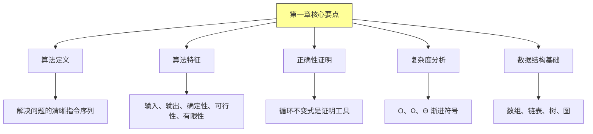

### 9.2 关键概念速查表

| 概念 | 含义 |
|-----|------|
| **算法** | 解决问题的步骤序列 |
| **循环不变式** | 证明算法正确性的工具 |
| **时间复杂度** | 算法运行时间与输入规模的关系 |
| **空间复杂度** | 算法占用空间与输入规模的关系 |
| **On** | 线性时间，随输入规模线性增长 |
| **Olog n** | 对数时间，增长极慢 |

---

*本章精读笔记完成*
