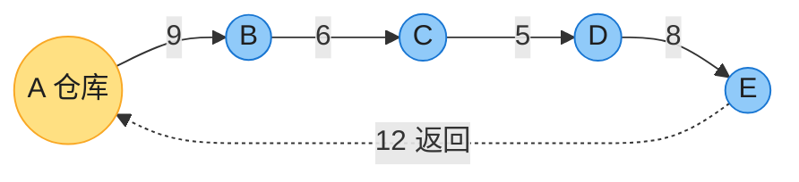

# 第一章：算法在计算中的作用

> **本章定位**：全书唯一的「纯概念」引论，只回答三个问题——算法是什么？为什么值得学？算法相对硬件等其他技术处于什么地位？本章**没有要背的算法**，但有一段可运行的实测代码（3.3 节），花 5 分钟亲手感受「算法差距 > 硬件差距」。伪代码、循环不变式、渐进符号这套分析框架从第 2、3 章才正式建立。

---

## 一、算法是什么

### 1.1 定义：问题 / 算法 / 实例

非形式化地说，**算法**是任何**定义良好的计算过程**——以一个或一组值作为**输入**，在**有限时间**内产生一个或一组值作为**输出**。一句话：**算法 = 把输入变成输出的有限计算过程**。三个术语要分清：

- **问题（problem）**：用一般语言描述期望的输入/输出关系（对任意大的实例都成立）。
- **算法（algorithm）**：实现这一输入/输出关系的具体计算过程。
- **实例（instance）**：满足问题约束的一组具体输入。

> 算法可以用自然语言、程序、甚至硬件设计来描述，唯一要求是**精确**说明要执行的计算过程。

### 1.2 例子：排序问题（全书反复出现的样板）

> LeetCode：[912 排序数组](https://leetcode.cn/problems/sort-an-array/)（中等）——以后每学一个排序算法（第 2/4/6/7 章），都拿它提交一遍验证。

**排序问题的形式化定义**：
- **输入**：n 个数的序列 ⟨a₁, a₂, …, aₙ⟩
- **输出**：输入序列的一个排列 ⟨a₁′, a₂′, …, aₙ′⟩，满足 a₁′ ≤ a₂′ ≤ … ≤ aₙ′

例如输入 ⟨31, 41, 59, 26, 41, 58⟩，正确的排序算法输出 ⟨26, 31, 41, 41, 58, 59⟩。这组具体输入就叫排序问题的一个**实例**。

排序是许多程序的中间步骤，因此是计算机科学的基础操作。选哪个排序算法最好，取决于待排序元素数量、是否已部分有序、元素取值限制、计算机体系结构、存储介质（内存/磁盘/磁带）等因素。

### 1.3 正确算法与不正确算法

- **正确算法**：对每一个输入实例都**停机**（有限步内结束）并输出正确答案。
- **不正确算法**：可能对某些实例不停机，或给出错误答案。

> 出乎意料的是，**不正确算法有时也有用**——前提是能**控制误差率**。例如第 31 章找大素数的随机算法就是「大概率正确」。不过本书主要关心正确算法。

---

## 二、算法解决什么问题

### 2.1 应用速查

算法的应用无处不在，远不止排序。CLRS 给出的代表性领域（都对应后续章节）：

| 领域 | 问题 | 本书章节 |
|------|------|---------|
| 基因组学 | 识别人类 DNA 约 3 万个基因、测定约 30 亿个碱基对、序列比对 | 动态规划（14） |
| 互联网 | 数据路由、搜索引擎 | 最短路径（22）、哈希表（11）、字符串匹配（32） |
| 电子商务 | 公钥密码、数字签名 | 数论算法（31） |
| 资源分配 | 油井选址、机组排班 | 线性规划（29） |
| 路径规划 | 两点间最短路径 | 单源最短路径（22） |
| 依赖排序 | 零件装配顺序（拓扑排序；n 个零件有 n! 种顺序） | 基本图算法（20） |
| 机器学习 | 肿瘤良恶性聚类分类 | 机器学习算法（33） |
| 数据压缩 | LZW、Huffman 编码 | 贪心算法（15） |
| 信号处理 | 离散傅里叶变换（时域 → 频域） | FFT（30） |

**这类算法问题有两个共性**：
1. **候选解极多**，且绝大多数不是解（或不是最优解）。难点在于**不逐一枚举**就找到好解。
2. **有实际应用**。

（也有些问题没有明显的「候选解集合」，如 FFT 把信号从时域转频域——这类是变换类问题。）

### 2.2 难问题：NP 完全与近似算法

有些问题**没有已知的多项式时间算法**（第 34 章）。NP 完全问题有三点迷人之处：

1. 没人找到高效算法，也没人证明它不存在；
2. **只要其中一个有多项式算法，所有 NP 完全问题就都有**；
3. 它们和「已知高效算法的问题」常常只差一点点改动。

典型例子：**旅行商问题（TSP）**——快递车从仓库出发，送完所有地址再返回，求总路程最短：



上图这条回路总长 9+6+5+8+12 = 40，但它是不是最短的？只能枚举比较。难点在于 **n 个城市有 (n-1)!/2 条回路**：5 城只有 12 条，20 城 ≈ 6×10¹⁶ 条，30 城 ≈ 4.4×10³⁰ 条——用每秒枚举 10¹⁰ 条的机器也要算上宇宙年龄的 1000 倍。枚举这条路在 n 稍大时就是死路。

> 🔑 **小改动 → 大差别**：最短路径只连**两个**点（多项式算法，第 22 章）；TSP 要经过**所有**点并回到起点（NP 完全）。问题描述只差几个字，最好已知算法的效率天差地别——做题时认准问题类型再动手。
>
> 遇到 NP 完全问题，与其硬找精确算法，不如做**近似算法**（第 35 章，给出「足够好但不一定最优」的解）。（严格地说，只有**判定问题**——答案为「是/否」——才能称为 NP 完全。TSP 的判定版本是：「是否存在总路程 ≤ k 的送货顺序？」）
>
> 想直观体验「候选解指数爆炸」，去写 [LC 51 N 皇后](https://leetcode.cn/problems/n-queens/)的回溯搜索——那就是 NP 类问题的日常手感。

### 2.3 数据结构与技术

- **数据结构**：存储和组织数据、以方便访问与修改的方式。**没有一种数据结构适用所有场景**，要懂各自的优劣（本书第 10 章起系统介绍）。
- **技术**：本书既讲具体问题（中位数与顺序统计量 9、最小生成树 21、最大流 24），也讲通用设计/分析技术（分治 2/4、动态规划 14、摊还分析 16）。

### 2.4 其他计算模型

- **多核/并行**：功耗密度随主频**超线性**增长，主频撞墙（再快芯片会熔毁），芯片靠多核提升算力 → 需要**并行算法**（第 26 章的任务并行模型）。
- **输入随时间到达**：数据中心调度、网络路由、急诊分诊等场景，算法必须在「不知道未来输入」时决策 → **在线算法**（第 27 章）。

---

## 三、算法作为一种技术（本章核心）

### 3.1 效率：增长率的差距碾压常数的差距

如果计算机无限快、内存免费，还需要学算法吗？**需要**——至少要确认方法会终止且正确。但现实中算力是**有限资源**。常说「时间就是金钱」，其实时间比金钱更宝贵：钱花出去能挣回来，时间花出去就永远没了。选对算法至关重要——同一问题不同算法的效率可以差到**比硬件换代还显著**。

CLRS 用排序做对比（第 2 章详讲）：
- **插入排序**：耗时 ≈ c₁·n²
- **归并排序**：耗时 ≈ c₂·n·lg n （lg n = log₂ n）

插入排序常数更小（c₁ < c₂），但归并排序的增长率 lg n 远慢于 n——lg 1000 ≈ 10，lg 一百万 ≈ 20。无论 c₁ 比 c₂ 小多少，总存在一个**交叉点**，超过它之后归并排序的反超**不可逆转**。

### 3.2 震撼的例子：快机 A vs 慢机 B

排序 **1000 万** 个数（n = 10⁷；若是 8 字节整数，输入约 80 MB，廉价笔记本的内存也绰绰有余）：

| | 计算机 A（快机） | 计算机 B（慢机） |
|--|----------------|----------------|
| 算力 | 每秒 10¹⁰ 条指令 | 每秒 10⁷ 条指令（**慢 1000 倍**） |
| 算法 | 插入排序（2n² 条指令） | 归并排序（50·n·lg n 条指令） |
| 指令数 | 2·(10⁷)² = 2×10¹⁴ | 50·10⁷·lg(10⁷) ≈ 1.16×10¹⁰ |
| **耗时** | 2×10¹⁴ / 10¹⁰ = **20000 秒（>5.5 小时）** | 1.16×10¹⁰ / 10⁷ ≈ **1163 秒（<20 分钟）** |

> 硬件慢 1000 倍的 B，靠更好的算法反而**快了超过 17 倍**。排 **1 亿** 个数时差距更悬殊：插入排序 **>23 天**，归并排序 **<4 小时**。
> （1 亿并不夸张：全球每半小时的网页搜索、每分钟的电子邮件都超过 1 亿；最小的超致密矮星系也约有 1 亿颗恒星。）
>
> **结论：算法和硬件一样是「技术」。** 系统总性能既取决于硬件，也同样取决于算法选择。

### 3.3 亲手实测：30 行代码验证 CLRS

不用信书上的假设数字，自己跑一遍。同一台机器上，**手写插入排序 vs 语言内置排序**（内置实现是工程优化过的 n log n 混合排序，近似代表「好算法」）：

**Java**：

```java
import java.util.Arrays;
import java.util.Random;

public class SortRace {
    static void insertionSort(long[] a) {
        for (int i = 1; i < a.length; i++) {
            long key = a[i];
            int j = i - 1;
            while (j >= 0 && a[j] > key) { a[j + 1] = a[j]; j--; }
            a[j + 1] = key;
        }
    }

    public static void main(String[] args) {
        Random rnd = new Random(42);
        long[] slow = rnd.longs(100_000).toArray();       // 给插入排序 10 万个
        long[] fast = rnd.longs(10_000_000).toArray();    // 给内置排序 1000 万个（多 100 倍）

        long t = System.nanoTime();
        insertionSort(slow);
        System.out.printf("插入排序 10 万个: %.2f 秒%n", (System.nanoTime() - t) / 1e9);

        t = System.nanoTime();
        Arrays.sort(fast);
        System.out.printf("Arrays.sort 1000 万个: %.2f 秒%n", (System.nanoTime() - t) / 1e9);
    }
}
```

**Python**：

```python
import random, time

def insertion_sort(a):
    for i in range(1, len(a)):
        key, j = a[i], i - 1
        while j >= 0 and a[j] > key:
            a[j + 1] = a[j]
            j -= 1
        a[j + 1] = key

random.seed(42)
small = [random.random() for _ in range(5_000)]        # 给插入排序 5 千个
big   = [random.random() for _ in range(1_000_000)]    # 给内置排序 100 万个（多 200 倍）

t = time.perf_counter(); insertion_sort(small); t1 = time.perf_counter() - t
t = time.perf_counter(); sorted(big);           t2 = time.perf_counter() - t
print(f"插入排序 5 千个: {t1:.2f} 秒")
print(f"内置 sorted 100 万个: {t2:.2f} 秒")
```

实测结果（笔记本单次运行，绝对数字随机器浮动，**量级关系不变**）：

| 实现 | 数据量 | 实测耗时 |
|------|--------|---------|
| 手写插入排序（Java） | 10 万 | ≈1.5 秒 |
| `Arrays.sort`（Java） | 1000 万（**多 100 倍**） | ≈0.7 秒 |
| 手写插入排序（Python） | 5 千 | ≈0.2 秒 |
| 内置 `sorted`（Python） | 100 万（**多 200 倍**） | ≈0.2 秒 |

好算法排**多两个数量级**的数据，耗时反而更短——这就是 3.2 节那张表在你自己机器上的样子。

> 💡 Java 的 `Arrays.sort`（双轴快排/TimSort）和 Python 的 `sorted`（Timsort）都是「多种排序算法按数据特征切换」的工程混合体。刷题时直接调库没问题，但面试考的是你能不能手写它们背后的基础算法。

### 3.4 算法与其他技术（含机器学习）

如今有先进的体系结构、直观的 GUI、面向对象系统、Web 技术、高速网络、机器学习、移动设备——算法还那么重要吗？答案是肯定的。

- 许多应用在**应用层**就含算法：出行导航服务除了硬件、GUI、广域网，还需要**寻路（最短路径）、地图渲染、地址插值**等算法。
- 即使应用表面上不含算法，它依赖的每一层也都靠算法支撑：硬件**设计**用算法，网络**路由**重度依赖算法，代码要经**编译器/解释器**处理——而这些工具大量使用算法。**算法处于当代计算机绝大多数技术的核心。**
- **机器学习**看似「不用设计算法，从数据里学解法」，但它本身**就是一组算法**（换个名字而已）。ML 目前主要胜在**人类还不甚理解**的问题上（计算机视觉、机器翻译）；对**人类已理解得很好**的问题（本书大部分），专门设计的高效算法通常仍优于 ML 方案。**数据科学**同理——算法的设计与分析是它的根基。

随着算力增长，求解的问题规模也越来越大，而「**规模越大，算法效率的差异越显著**」。扎实的算法功底是**真正优秀程序员**的标志之一：凭现代计算技术，不懂算法也能完成一些任务；但有算法功底，你能做得**多得多**。

---

## 四、习题精选

**1.1-2**　除速度外，实际场景中还有哪些效率度量？
> 内存/空间占用、能耗（移动设备与数据中心都敏感）、网络通信量；工程上还常考虑实现与维护成本。

**1.1-4**　上文的最短路径问题与旅行商问题有何异同？
> 同：都是在带权图上求「总权最小的路线」。异：最短路径只连接**两个**点（有多项式算法，第 22 章）；TSP 要经过**所有**点并回到起点（NP 完全，第 35 章做近似）。这正是「问题描述的小改动 → 最好已知算法效率的大差别」的样板。

**1.1-5**　举一个「必须最优解」的现实问题，再举一个「近似最优就够」的。
> 示例：必须最优——医疗剂量、航天器轨道等安全攸关的计算；近似就够——快递配送路线、广告排期（TSP 式问题每天都在用近似解）。

**1.2-2**　插入排序耗时 8n² 步、归并排序 64n·lg n 步，n 多大时插入排序更快？
> 解：8n² < 64n·lg n ⟺ n < 8 lg n。代入 n=43：8·lg43 ≈ 43.4 > 43 ✓；n=44：8·lg44 ≈ 43.7 < 44 ✗。**故 2 ≤ n ≤ 43 时插入排序更快**（n=1 时 64n·lg n = 0 < 8，归并反而胜）。

**1.2-3**　100n² 的算法在 n 多大时比 2ⁿ 的算法快？
> 解：100n² < 2ⁿ。n=14：100·196 = 19600 > 16384 = 2¹⁴ ✗；n=15：100·225 = 22500 < 32768 = 2¹⁵ ✓。**最小 n = 15。**

**问题 1-1（运行时间对照表）**　若算法耗时 f(n) **微秒**，求在各时间预算内能处理的最大问题规模 n。做法：令 f(n) = t 反解 n（月按 30 天、年按 365 天、世纪按 100 年计）。答案：

| f(n) | 1 秒 | 1 分钟 | 1 小时 | 1 天 | 1 月 | 1 年 | 1 世纪 |
|------|------|--------|--------|------|------|------|--------|
| lg n | 2^(10⁶) | 2^(6×10⁷) | 2^(3.6×10⁹) | 2^(8.6×10¹⁰) | 2^(2.6×10¹²) | 2^(3.2×10¹³) | 2^(3.2×10¹⁵) |
| √n | 10¹² | 3.6×10¹⁵ | 1.3×10¹⁹ | 7.5×10²¹ | 6.7×10²⁴ | 9.9×10²⁶ | 1.0×10³¹ |
| n | 10⁶ | 6×10⁷ | 3.6×10⁹ | 8.6×10¹⁰ | 2.6×10¹² | 3.2×10¹³ | 3.2×10¹⁵ |
| n lg n | ≈6.3×10⁴ | ≈2.8×10⁶ | ≈1.3×10⁸ | ≈2.8×10⁹ | ≈7.1×10¹⁰ | ≈8.0×10¹¹ | ≈6.9×10¹³ |
| n² | 10³ | ≈7.7×10³ | 6×10⁴ | ≈2.9×10⁵ | ≈1.6×10⁶ | ≈5.6×10⁶ | ≈5.6×10⁷ |
| n³ | 10² | ≈3.9×10² | ≈1.5×10³ | ≈4.4×10³ | ≈1.4×10⁴ | ≈3.2×10⁴ | ≈1.5×10⁵ |
| 2ⁿ | 19 | 25 | 31 | 36 | 41 | 44 | 51 |
| n! | 9 | 11 | 12 | 13 | 15 | 16 | 17 |

> 这张表是体会各阶复杂度差距的经典练习：**lg n 一行大得失去物理意义；而 2ⁿ、n! 在一小时内就「撞墙」**——时间预算从一秒钟扩到一个世纪，可解规模只从 19 涨到 51（2ⁿ）、从 9 涨到 17（n!）。

> **章末注记**：第 1 章注记主要是一份「算法教材书目」——Knuth（TAOCP）、Sedgewick & Wayne、Kleinberg & Tardos、Dasgupta、Roughgarden、Erickson 等；偏工程实践的可看 Bentley（《编程珠玑》作者）。

---

## 五、总结

**一句话**：算法是把输入变成输出的**有限**计算过程；**选对算法带来的效率提升远超硬件升级**——所以算法和硬件一样，是必须认真对待的「技术」。

- 算法 = 定义良好的输入→输出过程；区分**问题 / 算法 / 实例**。
- 排序是全书的样板问题（输入/输出的形式化定义），练手入口 LC 912。
- 算法应用极广（基因组、网络、密码、运筹、压缩、FFT…），问题共性是「候选解极多 + 有实用」。
- 难问题（NP 完全）用**近似算法**；多核用**并行**、输入渐至用**在线**算法。
- **效率是算法作为技术的根本**：归并排序（n lg n）在慢 1000 倍的机器上仍以超过 17 倍的优势击败插入排序（n²）——3.3 节的代码可以在自己机器上复现这个结论。

> 下一章：**第 2 章「入门」**——从插入排序开始，正式建立伪代码、循环不变式、运行时间分析这套全书通用的框架。

---

*本章笔记按「应用导向」准则编写，CLRS 第四版第 1 章仅作参考。*
