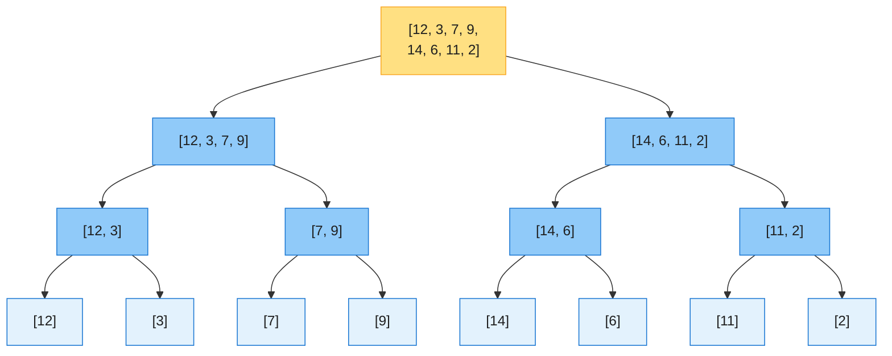
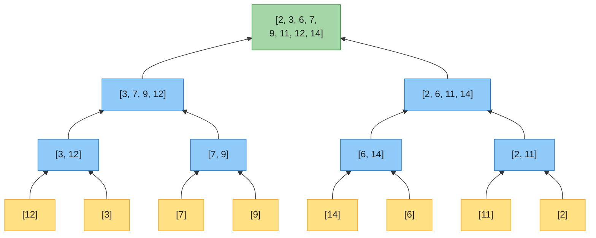
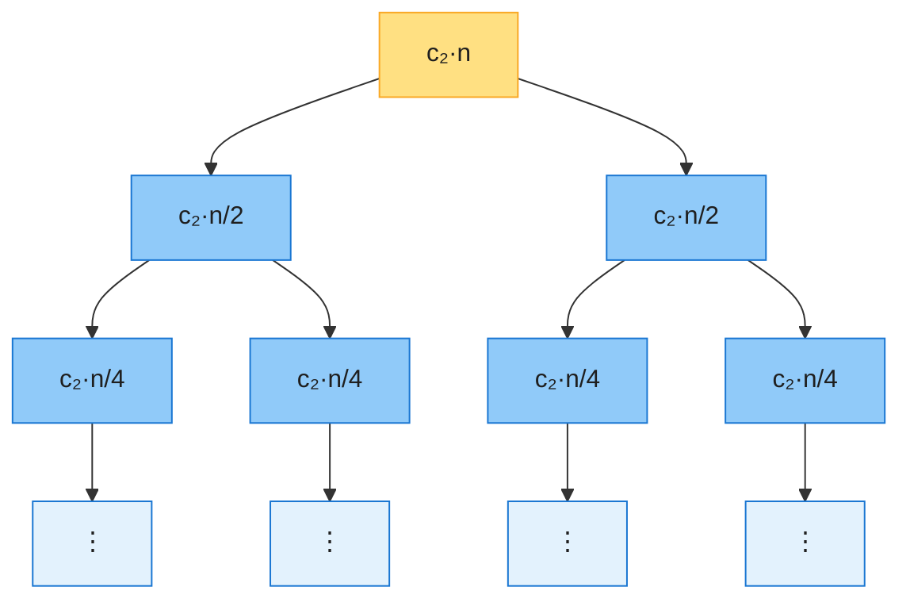
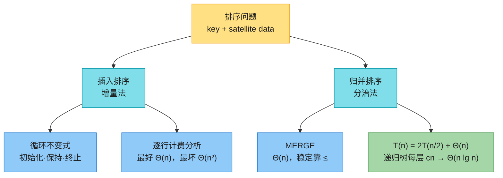

# 第二章：入门（Getting Started）

> **本章定位**：这一章是全书方法论的「样板章」。用**插入排序**演示三件基本功——伪代码描述算法、**循环不变式**证明正确性、**逐条语句计费**的运行时间分析；再用**归并排序**引出最重要的设计范式**分治**，并给出「**递归式 + 递归树**」的分析套路。这两套工具在后面每一章都会反复用到。
>
> 与前后章节的关系：排序问题在第 1 章提出；Θ 记号的严格定义见第 3 章；递归式的一般解法（代入法、递归树、主定理）见第 4 章；更快的排序算法（堆排序、快速排序）见第 6、7 章。
>
> 📌 **索引约定**：CLRS 伪代码用 **1-indexed**（数组写作 `A[1 : n]`，`A[i : j]` 含两端端点）；本章 Java/Python 代码用实战惯用的 **0-indexed**，下标整体减 1 即可。伪代码约定：缩进即块结构、`//` 是注释、for 循环退出后循环变量仍保留其值（终止性证明要用到这一点）。

---

## 一、排序问题

**形式定义**（第 1 章引入）：

- **输入**：n 个数构成的序列 ⟨a₁, a₂, …, aₙ⟩。
- **输出**：输入序列的一个排列 ⟨a′₁, a′₂, …, a′ₙ⟩，满足 a′₁ ≤ a′₂ ≤ ⋯ ≤ a′ₙ。

待排序的数称为**键（key）**。实际场景中键通常携带着**卫星数据（satellite data）**——比如学生成绩表按分数排序时，整行记录都要跟着键移动。键 + 卫星数据合称一条**记录（record）**。讲算法时我们只关注键，但要记得卫星数据的存在（排序的「稳定性」就与之相关）。

本章给出解决同一问题的两种设计范式：

| 范式 | 代表 | 思路 |
|------|------|------|
| **增量法** | 插入排序 | 保持 A[1 : i−1] 有序，把 A[i] 插进去，已排序区每次扩大 1 |
| **分治法** | 归并排序 | 分成两半，各自递归排好，再合并 |

---

## 二、插入排序（Insertion Sort）

### 2.1 直觉：整理扑克牌

左手握着一摞**已排好序**的牌，桌上的牌堆面朝下。每次从桌上摸一张牌，**从右往左**与左手中的牌逐一比较，找到第一个不大于它的位置，插进去。任何时刻左手中的牌都是有序的，且这些牌就是桌上原来顶部的那几张。

### 2.2 伪代码（1-indexed）

```
INSERTION-SORT(A, n)
1  for i = 2 to n
2      key = A[i]
3      // Insert A[i] into the sorted subarray A[1 : i − 1].
4      j = i − 1
5      while j > 0 and A[j] > key
6          A[j + 1] = A[j]
7          j = j − 1
8      A[j + 1] = key
```

> 🔑 **注意是「平移」不是「交换」**：第 6 行把比 key 大的元素**右移一格**（1 次赋值），腾出空位后第 8 行把 key 放入。若写成相邻交换则每次要 3 次赋值——同样的思想，常数因子差 3 倍。

### 2.3 过程演示（对应原书 Figure 2.2）

对 A = ⟨5, 2, 4, 6, 1, 3⟩ 模拟，加粗格是本轮被改写的位置：

| 轮次 | A[1] | A[2] | A[3] | A[4] | A[5] | A[6] | 说明 |
|------|-----|-----|-----|-----|-----|-----|------|
| 初始 | 5 | 2 | 4 | 6 | 1 | 3 | |
| i=2，key=2 | **2** | **5** | 4 | 6 | 1 | 3 | 5 右移，2 落到 A[1] |
| i=3，key=4 | 2 | **4** | **5** | 6 | 1 | 3 | 5 右移，4 落到 A[2] |
| i=4，key=6 | 2 | 4 | 5 | 6 | 1 | 3 | 6 ≥ 5，原地不动 |
| i=5，key=1 | **1** | **2** | **4** | **5** | **6** | 3 | 2/4/5/6 依次右移，1 落到 A[1] |
| i=6，key=3 | 1 | 2 | **3** | **4** | **5** | 6 | 4/5/6 右移，3 落到 A[3] |

### 2.4 正确性：循环不变式

**循环不变式**：在 for 循环（第 1–8 行）每次迭代**开始时**，子数组 A[1 : i−1] 由**原先就位于** A[1 : i−1] 的那些元素组成，且已排好序。

> ⚠️ **易错点**：不变式**不是**「A[1 : i−1] 包含最小的 i−1 个元素」——那是**选择排序**的不变式（习题 2.2-2）。插入排序的已排序区始终是「原班人马排好了序」：元素身份不变，只是顺序变了。打牌类比的「左手始终是最初桌上顶部那几张牌」说的正是这一点。

用循环不变式证明正确性要验证三条性质（本质就是数学归纳法：初始化 = 基例，保持 = 归纳步，终止 = 用归纳结论收尾）：

| 性质 | 对插入排序的验证 |
|------|----------------|
| **初始化** | 首次迭代前 i = 2，A[1 : 1] 只含单个元素 A[1]，单元素子数组天然有序 |
| **保持** | 循环体把 A[i−1]、A[i−2]、… 依次右移，直到找到 key 的正确位置并放入；此后 A[1 : i] 有序，i 自增后不变式对下一次迭代仍成立 |
| **终止** | i 递增到 n+1 时循环退出（for 循环变量退出后保留其值）；把 i = n+1 代入不变式：A[1 : n] 由全部 n 个原始元素组成且有序——算法正确 |

---

## 三、分析算法（Analyzing Algorithms）

### 3.1 分析框架：RAM 模型与输入规模

- **输入规模**：因问题而异。排序问题取元素个数 n；图算法常用顶点数 + 边数两个量；整数乘法则取二进制总位数。
- **运行时间**：执行的**指令与数据访问次数**，与具体机器无关。
- **RAM（随机访问机）模型**：指令逐条执行、无并发；每条指令（算术、数据移动、控制流）和每次数据访问都花**常量时间**——数组随机访问也是。RAM 不建模缓存与虚拟内存，但实践表明它对真实机器的性能预测相当准。

### 3.2 插入排序的精确分析

给每行伪代码标上常量代价 cₖ 和执行次数。记 tᵢ = 第 5 行 while 测试对某个 i 的执行次数（循环正常退出时，测试比循环体多执行 1 次，故循环体执行 tᵢ − 1 次）：

| 行 | 语句 | 代价 | 执行次数 |
|----|------|------|---------|
| 1 | `for i = 2 to n` | c₁ | n |
| 2 | `key = A[i]` | c₂ | n − 1 |
| 4 | `j = i − 1` | c₄ | n − 1 |
| 5 | `while j > 0 and A[j] > key` | c₅ | Σ(i=2..n) tᵢ |
| 6 | `A[j+1] = A[j]` | c₆ | Σ(i=2..n) (tᵢ − 1) |
| 7 | `j = j − 1` | c₇ | Σ(i=2..n) (tᵢ − 1) |
| 8 | `A[j+1] = key` | c₈ | n − 1 |

总运行时间是「代价 × 次数」之和：

T(n) = c₁n + c₂(n−1) + c₄(n−1) + c₅·Σtᵢ + c₆·Σ(tᵢ−1) + c₇·Σ(tᵢ−1) + c₈(n−1)

**最好情况：数组已升序**。while 第一次测试就失败，tᵢ = 1，于是

T(n) = (c₁+c₂+c₄+c₅+c₈)·n − (c₂+c₄+c₅+c₈) = **an + b**（n 的线性函数）→ **Θ(n)**

**最坏情况：数组逆序**。每个 A[i] 都要和已排序区全部 i−1 个元素比较，tᵢ = i。代入求和公式 Σ(i=2..n) i = n(n+1)/2 − 1 与 Σ(i=2..n) (i−1) = n(n−1)/2：

T(n) = (c₅/2 + c₆/2 + c₇/2)·n² + (c₁+c₂+c₄+c₅/2−c₆/2−c₇/2+c₈)·n − (c₂+c₄+c₅+c₈) = **an² + bn + c** → **Θ(n²)**

### 3.3 为什么重点关注最坏情况

1. 最坏情况是任何输入的**上界**——拿到它就拿到保证（实时系统尤其需要）。
2. 对很多算法，最坏情况**经常出现**（如数据库检索一个不存在的值）。
3. **平均情况往往和最坏情况一样糟**：对随机数组做插入排序，A[i] 平均要和已排序区一半的元素比较（tᵢ ≈ i/2；等价地，随机排列的期望逆序对数是 n(n−1)/4），平均运行时间仍是 n 的二次函数。

### 3.4 增长量级：只看首项

精确公式里的常数太琐碎，再做一层抽象：**只保留首项、忽略其系数**。n²/100 + 100n + 17 在 n > 10000 后被 n²/100 项完全主导，低阶项和常数因子都无关紧要。于是最坏情况记作 **Θ(n²)**，最好情况记作 **Θ(n)**——本章先非正式地用 Θ（读作「n 很大时大致正比于」），第 3 章给出严格定义。

> 💡 比较算法优劣时比的是**增长量级**：Θ(n²) 的算法在小输入上可能因常数小而占优，但输入足够大之后必输给 Θ(n lg n) 的算法。

---

## 四、分治策略（Divide and Conquer）

### 4.1 三步套路

许多有用的算法是**递归**的：把问题分解成若干**同类型但规模更小**的子问题，递归求解，再把子问题的解合并。递归到底（问题足够小，**基例**）时直接求解。递归情形分三步：

1. **分解（Divide）**：把问题分成更小的同类子问题；
2. **解决（Conquer）**：递归地解子问题；
3. **合并（Combine）**：把子问题的解拼成原问题的解。

### 4.2 分治的递归式

设 T(n) 为规模为 n 的问题的最坏运行时间：规模足够小（n < n₀）时直接求解，代价 Θ(1)；否则

T(n) = D(n) + a·T(n/b) + C(n)

| 参数 | 含义 |
|------|------|
| a | 子问题个数（a ≥ 1） |
| n/b | 每个子问题的规模（b > 1） |
| D(n) | 分解的代价 |
| C(n) | 合并的代价 |

> 📌 两个省事约定（第 4 章会论证其合理性）：子问题规模的**上下取整可忽略**（⌈n/2⌉ 与 ⌊n/2⌋ 只差 1，不影响增长量级）；递归式的**基例通常略去不写**（常量规模必然 Θ(1)）。

---

## 五、归并排序（Merge Sort）

### 5.1 核心操作 MERGE：合并两个有序子数组

**直觉（还是打牌）**：桌上有**两摞面朝上的牌**，各自从小到大。每次比较两摞的顶牌，取较小者面朝下放到输出摞上。某一摞取空后，把另一摞整体翻过来盖上即可。每步常量时间，共 n 步 → **Θ(n)**。

`MERGE(A, p, q, r)`：已知相邻子数组 A[p : q] 与 A[q+1 : r] 各自有序，把它们合并成有序的 A[p : r]。先把两段分别拷到临时数组 L、R，再逐个取小者写回 A：

```
MERGE(A, p, q, r)
 1  nL = q − p + 1                // A[p : q] 的长度
 2  nR = r − q                    // A[q+1 : r] 的长度
 3  let L[0 : nL − 1] and R[0 : nR − 1] be new arrays
 4  for i = 0 to nL − 1           // 拷贝 A[p : q] → L
 5      L[i] = A[p + i]
 6  for j = 0 to nR − 1           // 拷贝 A[q+1 : r] → R
 7      R[j] = A[q + j + 1]
 8  i = 0                         // i 指向 L 中尚未合并的最小元素
 9  j = 0                         // j 指向 R 中尚未合并的最小元素
10  k = p                         // k 指向 A 中待填入的位置
11  while i < nL and j < nR
12      if L[i] ≤ R[j]
13          A[k] = L[i]
14          i = i + 1
15      else A[k] = R[j]
16          j = j + 1
17      k = k + 1
18  while i < nL                  // 把 L 的剩余部分写回
19      A[k] = L[i]
20      i = i + 1
21      k = k + 1
22  while j < nR                  // 把 R 的剩余部分写回
23      A[k] = R[j]
24      j = j + 1
25      k = k + 1
```

> 📌 **第四版的变化**：第三版在 L、R 末尾各放一个 ∞「哨兵」来省掉边界检查；第四版去掉了哨兵，改用第 18–25 行两个收尾 while 显式拷贝剩余元素（判存逻辑更直白，习题 2.3-3 的循环不变式也更简洁）。注意第 12 行用 **≤**——相等时取左边的，这正是归并排序**稳定性**的来源。
>
> 📌 **索引细节**：这是全书少见的混用——A 是 1-indexed，临时数组 L、R 是 0-indexed（作者脚注说明：0 起点的 L、R 让循环不变式更好写）。

**复杂度论证**：三个 while 循环的每次迭代恰好把 L 或 R 中**一个**元素写回 A，每个元素恰好写回一次，合计恰好 n 次迭代、每次常量代价；加上拷贝的 Θ(n)，MERGE 总共 **Θ(n)**。

**过程演示**（对应原书 Figure 2.3）：调用 MERGE(A, 9, 12, 16)，其中 A[9 : 16] = ⟨2, 4, 6, 7, 1, 2, 3, 5⟩，则 L = ⟨2, 4, 6, 7⟩，R = ⟨1, 2, 3, 5⟩：

| 迭代 | 比较 L[i] 与 R[j] | 写入 | i | j | k |
|------|------------------|------|---|---|---|
| 初始 | — | — | 0 | 0 | 9 |
| 1 | 2 > 1 | A[9] = **1**（取 R） | 0 | 1 | 10 |
| 2 | 2 ≤ 2 | A[10] = **2**（取 L） | 1 | 1 | 11 |
| 3 | 4 > 2 | A[11] = **2**（取 R） | 1 | 2 | 12 |
| 4 | 4 > 3 | A[12] = **3**（取 R） | 1 | 3 | 13 |
| 5 | 4 ≤ 5 | A[13] = **4**（取 L） | 2 | 3 | 14 |
| 6 | 6 > 5 | A[14] = **5**（取 R） | 2 | 4 | 15 |
| 收尾 | R 已空（j = nR） | 复制 L 余部：A[15 : 16] = **6, 7** | 4 | 4 | 17 |

### 5.2 主算法 MERGE-SORT

```
MERGE-SORT(A, p, r)
1  if p ≥ r                       // 0 或 1 个元素，天然有序
2      return
3  q = ⌊(p + r)/2⌋                // A[p : r] 的中点
4  MERGE-SORT(A, p, q)            // 递归排序左半
5  MERGE-SORT(A, q + 1, r)        // 递归排序右半
6  // 合并 A[p : q] 与 A[q+1 : r] 到 A[p : r]
7  MERGE(A, p, q, r)
```

- **分解**：算中点 q，Θ(1)；
- **解决**：递归排序两个 n/2 规模子问题，2T(n/2)；
- **合并**：MERGE，Θ(n)。

**过程演示**（对应原书 Figure 2.4）：对 A = ⟨12, 3, 7, 9, 14, 6, 11, 2⟩，先一路分解到单元素：



再自底向上两两合并（同一层的合并互不依赖，递归完成的顺序是先左后右）：



### 5.3 分析：递归式与递归树

把三步加起来，归并排序最坏情况的递归式为

T(n) = 2T(n/2) + Θ(n)        (2.3)

第 4 章的主定理可一步给出 T(n) = Θ(n lg n)，但不用它，画**递归树**就能直观看懂。假设 n 是 2 的幂，把 (2.3) 具体化为：T(1) = c₁；T(n) = 2T(n/2) + c₂n（c₂n 是该层分解 + 合并的代价，c₁ 是基例代价）。



每往下一层，节点数翻倍、单节点代价减半，两者抵消——**每层合计都是 c₂n**：

| 层（自顶向下，从 0 计） | 节点数 | 每节点代价 | 层合计 |
|------------------------|--------|-----------|--------|
| 0 | 1 | c₂n | c₂n |
| 1 | 2 | c₂n/2 | c₂n |
| 2 | 4 | c₂n/4 | c₂n |
| ⋮（第 i 层） | 2ⁱ | c₂n/2ⁱ | c₂n |
| 叶子层（第 lg n 层） | n | c₁ | c₁n |

树共 **lg n + 1** 层，总代价 = c₂n·lg n + c₁n = **Θ(n lg n)**。

> 💡 与插入排序对比：最坏情况从 Θ(n²) 降到 Θ(n lg n)，相当于**把一个因子 n 换成了 lg n**——对数增长远慢于线性，这笔交易非常划算。输入足够大时，归并排序必胜。

---

## 六、代码实现（0-indexed）

伪代码的 `A[1 : n]` 对应 0-indexed 的 `a[0 : n−1]`，循环起点、中点等下标整体减 1。

### 6.1 Java

```java
public class Sorts {

    /** 插入排序：原地、稳定。最好 O(n)，最坏/平均 O(n^2)，额外空间 O(1)。 */
    public static void insertionSort(int[] a) {
        for (int i = 1; i < a.length; i++) {     // i 对应伪代码下标 i+1
            int key = a[i];
            int j = i - 1;
            while (j >= 0 && a[j] > key) {       // 比 key 大的右移一格
                a[j + 1] = a[j];
                j--;
            }
            a[j + 1] = key;                      // key 落入空位
        }
    }

    /** 归并排序：稳定。时间 O(n log n)，额外空间 O(n)。 */
    public static void mergeSort(int[] a) {
        int[] aux = new int[a.length];           // 全程复用同一辅助数组
        mergeSort(a, 0, a.length - 1, aux);
    }

    private static void mergeSort(int[] a, int p, int r, int[] aux) {
        if (p >= r) return;                      // 基例：0 或 1 个元素
        int q = (p + r) >>> 1;                   // 中点，等价 floor((p+r)/2)
        mergeSort(a, p, q, aux);
        mergeSort(a, q + 1, r, aux);
        merge(a, p, q, r, aux);
    }

    /** 合并有序子数组 a[p..q] 与 a[q+1..r]。 */
    private static void merge(int[] a, int p, int q, int r, int[] aux) {
        System.arraycopy(a, p, aux, p, r - p + 1);
        int i = p, j = q + 1;
        for (int k = p; k <= r; k++) {
            if (i > q) a[k] = aux[j++];               // 左半用尽
            else if (j > r) a[k] = aux[i++];          // 右半用尽
            else if (aux[i] <= aux[j]) a[k] = aux[i++]; // 相等取左 → 稳定
            else a[k] = aux[j++];
        }
    }

    public static void main(String[] args) {
        int[] a = {5, 2, 4, 6, 1, 3};
        insertionSort(a);
        System.out.println(java.util.Arrays.toString(a)); // [1, 2, 3, 4, 5, 6]

        int[] b = {12, 3, 7, 9, 14, 6, 11, 2};
        mergeSort(b);
        System.out.println(java.util.Arrays.toString(b)); // [2, 3, 6, 7, 9, 11, 12, 14]
    }
}
```

### 6.2 Python

```python
def insertion_sort(a):
    """插入排序：原地、稳定。最好 O(n)，最坏/平均 O(n^2)，额外空间 O(1)。"""
    for i in range(1, len(a)):
        key = a[i]
        j = i - 1
        while j >= 0 and a[j] > key:   # 比 key 大的右移一格
            a[j + 1] = a[j]
            j -= 1
        a[j + 1] = key                 # key 落入空位
    return a


def merge_sort(a, p=0, r=None):
    """归并排序：原地、稳定。时间 O(n log n)，额外空间 O(n)。"""
    if r is None:
        r = len(a) - 1
    if p >= r:
        return a
    q = (p + r) // 2
    merge_sort(a, p, q)
    merge_sort(a, q + 1, r)
    # MERGE：切片拷贝出 L、R，再取小者写回
    L, R = a[p:q + 1], a[q + 1:r + 1]
    i = j = 0
    for k in range(p, r + 1):
        if i >= len(L):
            a[k] = R[j]; j += 1
        elif j >= len(R):
            a[k] = L[i]; i += 1
        elif L[i] <= R[j]:             # 相等取左 → 稳定
            a[k] = L[i]; i += 1
        else:
            a[k] = R[j]; j += 1
    return a


if __name__ == "__main__":
    print(insertion_sort([5, 2, 4, 6, 1, 3]))        # [1, 2, 3, 4, 5, 6]
    print(merge_sort([12, 3, 7, 9, 14, 6, 11, 2]))   # [2, 3, 6, 7, 9, 11, 12, 14]
```

> 💡 **实战提示**：工业界的排序实现正是本章两个算法的「合体」。
>
> - **Java**：`Arrays.sort` 对**对象数组**用 TimSort（归并 + 插入，稳定），对**基本类型**用双轴快速排序（不稳定但快）。
> - **Python**：`sorted()` / `list.sort()` 用 TimSort——分段用小规模插入排序、再归并，正是**思考题 2-1** 的思想。

---

## 七、复杂度汇总与对比

| 算法 | 最好 | 平均 | 最坏 | 额外空间 | 稳定性 | 设计范式 |
|------|------|------|------|---------|--------|---------|
| 插入排序 | **Θ(n)**（已有序） | Θ(n²) | Θ(n²)（逆序） | Θ(1) | 稳定 | 增量法 |
| 归并排序 | Θ(n lg n) | Θ(n lg n) | Θ(n lg n) | Θ(n) | 稳定（合并取 ≤） | 分治法 |

> 插入排序的价值：**常数小、原地、对近乎有序的输入接近 O(n)**（内层循环几乎不进；准确说运行时间 Θ(n + 逆序对数)，见思考题 2-4）——所以小规模子问题（如 n < 16）它反而比归并快，这也是混合排序的依据。归并排序的价值：**最坏情况也有 Θ(n lg n) 保证**且稳定，代价是 Θ(n) 额外空间。

---

## 八、精选习题与面试题

### 8.1 CLRS 习题快问快答（第四版题号）

| 习题 | 要点 |
|------|------|
| 2.1-3 | 改成降序：while 条件换成 `A[j] < key` 即可 |
| 2.2-1 | n³/1000 + 100n² − 100n + 3 = **Θ(n³)**（只看首项） |
| 2.2-2 | **选择排序**：循环不变式是「A[1 : i−1] 含最小的 i−1 个元素且有序」（对比插入排序不变式！）；只需跑前 n−1 个位置（最后一个自然就位）；最坏、最好都是 Θ(n²) |
| 2.2-3 | 线性查找：平均查 n/2 个、最坏查 n 个 → 都是 Θ(n) |
| 2.2-4 | 让任何排序获得好的最好情况：先 O(n) 检查一遍是否已有序 |
| 2.3-4 | 数学归纳法：T(2)=2，T(n)=2T(n/2)+n ⟹ T(n)=n lg n（n 为 2 的幂） |
| 2.3-5 | **递归版插入排序**：T(n) = T(n−1) + Θ(n) ⟹ Θ(n²)，不比迭代版好 |
| 2.3-6 | **二分查找**：与中点比较、每次砍掉一半 → 最坏 Θ(lg n) |
| 2.3-7 | 用二分查找找插入位置能让插入排序到 Θ(n lg n) 吗？**不能**——比较次数降到 Θ(n lg n)，但元素**平移**仍需 Θ(n²) |
| 2.3-8 | **两数之和**（LeetCode 1 的离线版）：先排序 Θ(n lg n)，再双指针/二分 → 总体 Θ(n lg n) |

### 8.2 思考题 2-1：归并排序中用插入排序处理小数组

把归并的叶子「剪粗」：n/k 个长度 k 的子段各用插入排序，再走标准合并。

- 插入排序部分：n/k 段 × Θ(k²) = **Θ(nk)**；
- 合并部分：只剩 lg(n/k) 层 → **Θ(n lg(n/k))**；
- 渐近意义下 k 最大取 **Θ(lg n)**（此时 Θ(nk + n lg(n/k)) = Θ(n lg n)，与标准归并同阶）；
- 实践中 k 按常数因子实测选取（与理论无关，纯粹是哪个常数小）——**TimSort 就是这么做的**。

### 8.3 思考题 2-4：逆序对（面试高频）

若 i < j 且 A[i] > A[j]，称 (i, j) 为一个**逆序对**。

- (a) ⟨2, 3, 8, 6, 1⟩ 的 5 个逆序对：(2,1)、(3,1)、(8,6)、(8,1)、(6,1)；
- (b) 逆序数组最多，共 n(n−1)/2 个；
- (c) **插入排序的运行时间 = Θ(n + 逆序对数)**——内层循环每执行一次恰好消去一个逆序对。这把「近乎有序时插入排序快」精确化了；
- (d) **Θ(n lg n) 数逆序对**：改造归并排序，合并时若取了右半元素 R[j]，则左半剩余元素（都比它大且下标小）各贡献一个逆序对：

```python
def count_inversions(a):
    """归并计数逆序对：返回 (排序后的新列表, 逆序对数)。O(n log n)。"""
    if len(a) <= 1:
        return a, 0
    mid = len(a) // 2
    left, inv_l = count_inversions(a[:mid])
    right, inv_r = count_inversions(a[mid:])
    merged, i, j, inv = [], 0, 0, inv_l + inv_r
    while i < len(left) and j < len(right):
        if left[i] <= right[j]:
            merged.append(left[i]); i += 1
        else:
            merged.append(right[j]); j += 1
            inv += len(left) - i      # left 剩余元素都与 right[j] 构成逆序对
    merged += left[i:] + right[j:]
    return merged, inv
```

### 8.4 思考题 2-2、2-3 与章末注记

- **2-2 冒泡排序正确性**：内层循环不变式「每轮把 A[i : n] 的最小元素冒到 A[i]」，外层不变式「A[1 : i−1] 已含最小的 i−1 个元素且有序」；最坏 Θ(n²)，不优于插入排序。
- **2-3 Horner 法则**：多项式求值 p = a₀ + x(a₁ + x(a₂ + …))，循环不变式直接用求和式陈述，Θ(n) 优于逐项重算的 Θ(n²)。
- **章末注记**：「algorithm」一词源自九世纪波斯数学家 al-Khowārizmī 的名字；循环不变式归功于 R. W. Floyd；归并排序在 1945 年由冯·诺依曼在 EDVAC 上实现；Knuth 的《计算机程序设计艺术》对排序有百科式论述，其中 **Shell 排序**（对间隔子序列做插入排序）是插入排序最重要的变体。

---

## 九、本章要点回顾



**一句话记忆**：

- 插入排序：已排序区「原班人马、保持有序」，右移平移腾出空位；最好 Θ(n)，最坏 Θ(n²)，原地稳定；
- 循环不变式三性质 = 归纳法的算法版，**终止**才是证明目的；
- 分析套路：RAM 模型逐行计费 → 只留首项得 Θ；重点关注最坏情况；
- 分治：分解 / 解决 / 合并 → 递归式 → 递归树求和（每层 c₂n × lg n 层）；
- 归并排序：T(n) = 2T(n/2) + Θ(n) = **Θ(n lg n)**，最坏有保证且稳定，代价是 Θ(n) 额外空间。
