# 第二章：算法基础

## 一、插入排序（Insertion Sort）

### 1.1 问题引入

**排序问题**：将一个无序数组重新排列成非递减顺序。

```
输入: [5, 2, 4, 6, 1, 3]
输出: [1, 2, 3, 4, 5, 6]
```

### 1.2 插入排序的思想

**核心类比**：像整理手中的扑克牌一样排序。

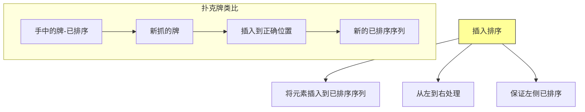

### 1.3 算法过程可视化

```
初始: [5, 2, 4, 6, 1, 3]

      i=1 (key=2)
      [5 | 2, 4, 6, 1, 3]
      比较 5 > 2，交换
      [2, 5 | 4, 6, 1, 3]  ✓ 已排序

      i=2 (key=4)
      [2, 5 | 4, 6, 1, 3]
      比较 5 > 4，交换
      [2, 4, 5 | 6, 1, 3]  ✓ 已排序

      i=3 (key=6)
      [2, 4, 5 | 6, 1, 3]
      6 > 5，不需要移动
      [2, 4, 5, 6 | 1, 3]  ✓ 已排序

      i=4 (key=1)
      [2, 4, 5, 6 | 1, 3]
      6 > 1，交换
      [2, 4, 5, 1 | 6, 3]
      5 > 1，交换
      [2, 4, 1, 5 | 6, 3]
      4 > 1，交换
      [2, 1, 4, 5 | 6, 3]
      2 > 1，交换
      [1, 2, 4, 5, 6 | 3]  ✓ 已排序

      i=5 (key=3)
      [1, 2, 4, 5, 6 | 3]
      6 > 3，交换
      [1, 2, 4, 5, 3 | 6]
      5 > 3，交换
      [1, 2, 4, 3, 5 | 6]
      4 > 3，交换
      [1, 2, 3, 4, 5, 6]  ✓ 已排序

最终: [1, 2, 3, 4, 5, 6]
```

### 1.4 Java 实现

```java
/**
 * 插入排序算法
 *
 * 时间复杂度:
 *   - 最好情况: On  (数组已有序)
 *   - 最坏情况: On平方 (数组逆序)
 *   - 平均情况: On平方
 *
 * 空间复杂度: O1 (原地排序)
 */
public class InsertionSort {

    /**
     * 插入排序
     * @param arr 待排序数组
     */
    public static void insertionSort(int[] arr) {
        // 从第二个元素开始，依次插入到前面已排序序列
        for (int i = 1; i < arr.length; i++) {
            int key = arr[i];  // 当前要插入的元素
            int j = i - 1;

            // 将比 key 大的元素向后移动
            while (j >= 0 && arr[j] > key) {
                arr[j + 1] = arr[j];  // 向后移动
                j--;
            }

            // 插入 key 到正确位置
            arr[j + 1] = key;

            // 打印每次迭代后的结果（可选）
            printStep(arr, i, key);
        }
    }

    /**
     * 打印排序步骤
     */
    private static void printStep(int[] arr, int i, int key) {
        System.out.print("i=" + i + " (key=" + key + "): ");
        for (int num : arr) {
            System.out.print(num + " ");
        }
        System.out.println();
    }

    public static void main(String[] args) {
        int[] arr = {5, 2, 4, 6, 1, 3};
        System.out.print("初始数组: ");
        for (int num : arr) System.out.print(num + " ");
        System.out.println("\n排序过程:");
        insertionSort(arr);
        System.out.print("\n最终结果: ");
        for (int num : arr) System.out.print(num + " ");
    }
}
```

**运行结果**：
```
初始数组: 5 2 4 6 1 3
排序过程:
i=1 (key=2): 2 5 4 6 1 3
i=2 (key=4): 2 4 5 6 1 3
i=3 (key=6): 2 4 5 6 1 3
i=4 (key=1): 1 2 4 5 6 3
i=5 (key=3): 1 2 3 4 5 6
最终结果: 1 2 3 4 5 6
```

### 1.5 Python 实现

```python
def insertion_sort(arr):
    """
    插入排序算法

    Args:
        arr: 待排序列表

    Returns:
        排序后的列表（原地修改）
    """
    for i in range(1, len(arr)):
        key = arr[i]
        j = i - 1

        # 将大于 key 的元素向后移动
        while j >= 0 and arr[j] > key:
            arr[j + 1] = arr[j]
            j -= 1

        # 插入 key
        arr[j + 1] = key

    return arr


# 测试
if __name__ == "__main__":
    arr = [5, 2, 4, 6, 1, 3]
    print("初始数组:", arr)
    insertion_sort(arr)
    print("排序后:", arr)
```

### 1.6 循环不变式证明

**循环不变式**：在每次循环开始时，子数组 `arr[0..i-1]` 包含原数组中最小的 `i` 个元素，且已排序。

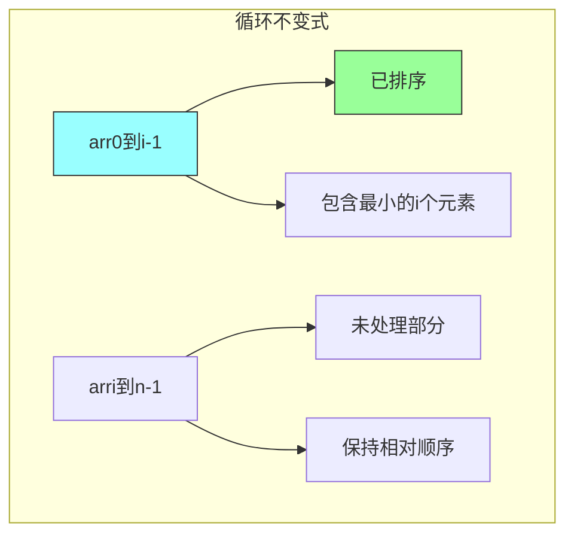

**证明过程**：

| 步骤 | 说明 |
|-----|------|
| **初始化** | i=1 时，`arr0到0` 只含一个元素，显然有序，性质成立 |
| **保持** | 假设 `arr0到i-1` 有序，将 `arri` 插入正确位置后，`arr0到i` 有序 |
| **终止** | i=n 时，`arr0到n-1` 包含所有元素且有序 |

## 二、分析算法

### 2.1 分析框架

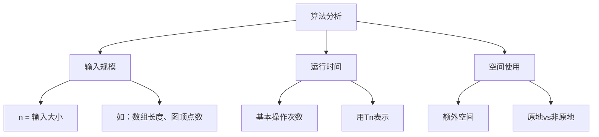

### 2.2 插入排序分析

```java
public static void insertionSort(int[] arr) {
    for (int i = 1; i < arr.length; i++) {      // 执行 n-1 次
        int key = arr[i];                        // 1 次
        int j = i - 1;                           // 1 次

        while (j >= 0 && arr[j] > key) {         // 最坏情况：i 次
            arr[j + 1] = arr[j];                 // 1 次
            j--;                                  // 1 次
        }

        arr[j + 1] = key;                        // 1 次
    }
}
```

**时间复杂度计算**：

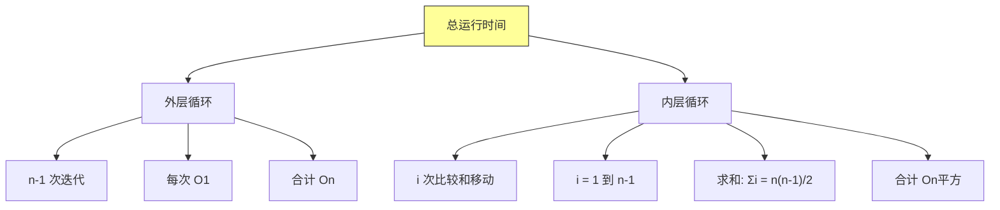

| 情况 | 内层循环次数 | 总比较次数 | 时间复杂度 |
|-----|------------|-----------|-----------|
| **最好** | 0 | n-1 | On |
| **最坏** | i | nn-1/2 | On平方 |
| **平均** | i/2 | nn-1/4 | On平方 |

### 2.3 最坏情况 vs 平均情况

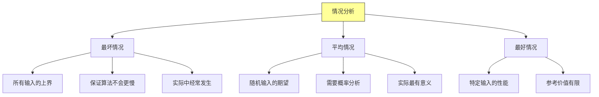

### 2.4 增长量级

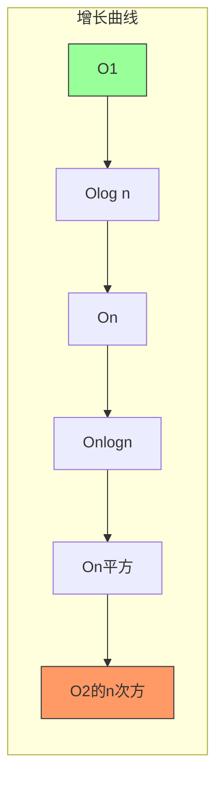

## 三、分治策略（Divide and Conquer）

### 3.1 分治思想概述

**分治三步骤**：

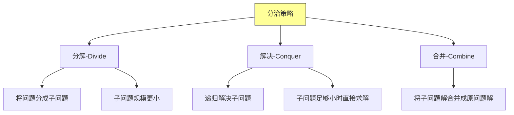

### 3.2 分治递归式

**递归式表示**：

```
Tn =
    Θ1                                      如果 n ≤ c (基本情况)
    a * Tn/b + Dn + Cn                  如果 n > c
```

**参数解释**：

| 参数 | 含义 |
|-----|------|
| a | 子问题个数 (a ≥ 1) |
| b | 子问题规模缩放因子 (b > 1) |
| Dn | 分解问题的时间 |
| Cn | 合并解的时间 |

### 3.3 主定理（Master Theorem）

**主定理**：求解形如 Tn = aTn/b + fn 的递归式。

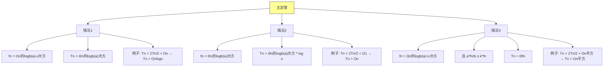

## 四、归并排序（Merge Sort）

### 4.1 算法思想

归并排序是分治策略的经典应用：

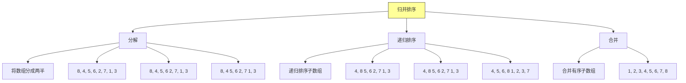

### 4.2 合并过程详解

```
合并两个有序数组: [4, 8] 和 [5, 6]

初始: [4, 8] + [5, 6] → []
比较: 4 < 5，取 4 → [4]
比较: 8 > 5，取 5 → [4, 5]
比较: 8 > 6，取 6 → [4, 5, 6]
左数组为空，复制右数组剩余 → [4, 5, 6, 8]
```

### 4.3 Java 实现

```java
/**
 * 归并排序
 *
 * 时间复杂度: Onlogn
 * 空间复杂度: On 需要额外空间
 */
public class MergeSort {

    /**
     * 归并排序主方法
     */
    public static void mergeSort(int[] arr) {
        if (arr == null || arr.length <= 1) {
            return;
        }
        int[] temp = new int[arr.length];
        sort(arr, 0, arr.length - 1, temp);
    }

    /**
     * 递归排序
     */
    private static void sort(int[] arr, int left, int right, int[] temp) {
        if (left < right) {
            int mid = left + (right - left) / 2;

            // 递归排序左半部分
            sort(arr, left, mid, temp);

            // 递归排序右半部分
            sort(arr, mid + 1, right, temp);

            // 合并
            merge(arr, left, mid, right, temp);
        }
    }

    /**
     * 合并两个有序子数组
     */
    private static void merge(int[] arr, int left, int mid, int right, int[] temp) {
        System.out.println("合并: " + left + "-" + mid + " 和 " + (mid+1) + "-" + right);

        // 左子数组: arrleft到mid
        // 右子数组: arrmid+1到right
        int i = left;      // 左子数组起始
        int j = mid + 1;   // 右子数组起始
        int k = left;      // temp 起始

        // 合并两个子数组
        while (i <= mid && j <= right) {
            if (arr[i] <= arr[j]) {
                temp[k++] = arr[i++];
            } else {
                temp[k++] = arr[j++];
            }
        }

        // 处理剩余元素
        while (i <= mid) {
            temp[k++] = arr[i++];
        }
        while (j <= right) {
            temp[k++] = arr[j++];
        }

        // 将合并结果复制回原数组
        for (int idx = left; idx <= right; idx++) {
            arr[idx] = temp[idx];
        }

        // 打印当前状态
        printArray(arr, left, right);
    }

    private static void printArray(int[] arr, int left, int right) {
        System.out.print("  [");
        for (int idx = left; idx <= right; idx++) {
            System.out.print(arr[idx] + " ");
        }
        System.out.println("]");
    }

    public static void main(String[] args) {
        int[] arr = {8, 4, 5, 6, 2, 7, 1, 3};
        System.out.println("初始数组: " + java.util.Arrays.toString(arr));
        System.out.println("\n归并排序过程:");
        mergeSort(arr);
        System.out.println("\n最终结果: " + java.util.Arrays.toString(arr));
    }
}
```

**运行结果**：
```
初始数组: [8, 4, 5, 6, 2, 7, 1, 3]

归并排序过程:
合并: 0-0 和 1-1
  [4 8 ]
合并: 2-2 和 3-3
  [5 6 ]
合并: 0-1 和 2-3
  [4 5 6 8 ]
合并: 4-4 和 5-5
  [2 7 ]
合并: 6-6 和 7-7
  [1 3 ]
合并: 4-5 和 6-7
  [1 2 3 7 ]
合并: 0-3 和 4-7
  [1 2 3 4 5 6 7 8 ]

最终结果: [1, 2, 3, 4, 5, 6, 7, 8]
```

### 4.4 Python 实现

```python
def merge_sort(arr):
    """
    归并排序

    Args:
        arr: 待排序列表

    Returns:
        排序后的列表（原地修改）
    """
    if len(arr) <= 1:
        return arr

    # 分解
    mid = len(arr) // 2
    left = arr[:mid]
    right = arr[mid:]

    # 递归排序
    left = merge_sort(left)
    right = merge_sort(right)

    # 合并
    return merge(left, right)


def merge(left, right):
    """合并两个有序列表"""
    result = []
    i = j = 0

    while i < len(left) and j < len(right):
        if left[i] <= right[j]:
            result.append(left[i])
            i += 1
        else:
            result.append(right[j])
            j += 1

    # 添加剩余元素
    result.extend(left[i:])
    result.extend(right[j:])

    return result


# 测试
if __name__ == "__main__":
    arr = [8, 4, 5, 6, 2, 7, 1, 3]
    print("初始数组:", arr)
    sorted_arr = merge_sort(arr)
    print("排序后:", sorted_arr)
```

### 4.5 归并排序分析

**递归式**：
```
Tn = 2Tn/2 + Θn
```

**使用主定理**：
- a = 2, b = 2
- n的logb(a)次方 = n的1次方 = n
- fn = Θn
- 符合情况2：Tn = Θnlogn

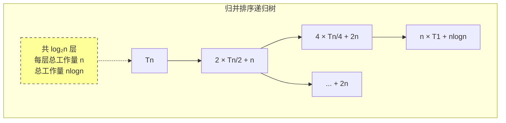

## 五、算法设计技术

### 5.1 分治 vs 增量

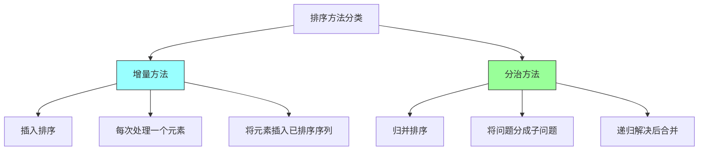

### 5.2 对比总结

| 特性 | 插入排序 | 归并排序 |
|-----|---------|---------|
| **时间复杂度（最坏）** | On平方 | Onlogn |
| **空间复杂度** | O1 | On |
| **稳定性** | 稳定 | 稳定 |
| **适用场景** | 小数组、近有序 | 大数组 |
| **实现难度** | 简单 | 中等 |

## 六、扩展：哨兵优化

### 6.1 减少边界检查

```java
/**
 * 插入排序优化版（使用哨兵）
 * 减少内层循环的边界检查
 */
public class InsertionSortWithSentinel {

    public static void insertionSortWithSentinel(int[] arr) {
        // 找到最小元素，移动到首位作为哨兵
        int minIndex = 0;
        for (int i = 1; i < arr.length; i++) {
            if (arr[i] < arr[minIndex]) {
                minIndex = i;
            }
        }

        // 将最小元素交换到首位
        swap(arr, 0, minIndex);

        // 现在 arr0 是最小值，作为哨兵
        for (int i = 2; i < arr.length; i++) {
            int key = arr[i];
            int j = i - 1;

            // 只需要检查 arrj > key，不需要检查 j >= 0
            while (arr[j] > key) {
                arr[j + 1] = arr[j];
                j--;
            }
            arr[j + 1] = key;
        }
    }

    private static void swap(int[] arr, int i, int j) {
        int temp = arr[i];
        arr[i] = arr[j];
        arr[j] = temp;
    }
}
```

## 七、总结

### 7.1 本章核心要点

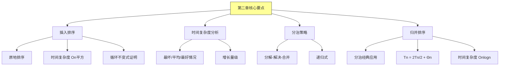

### 7.2 关键公式

| 算法 | 时间复杂度 | 空间复杂度 | 稳定性 |
|-----|----------|-----------|-------|
| 插入排序 | On平方 | O1 | 稳定 |
| 归并排序 | Onlogn | On | 稳定 |

### 7.3 递归式求解方法

| 情况 | 条件 | 结果 |
|-----|------|------|
| 情况1 | fn = On的logb(a)-ε次方 | Tn = Θn的logb(a)次方 |
| 情况2 | fn = Θn的logb(a)次方 | Tn = Θn的logb(a)次方 * log n |
| 情况3 | fn = Ωn的logb(a)+ε次方 | Tn = Θfn |

---

*本章精读笔记完成*
