# 第三章：函数的增长

## 一、渐近符号基础

### 1.1 为什么需要渐近分析

在分析算法时，我们关心的是**当输入规模趋近于无穷大时，算法的运行时间如何增长**。

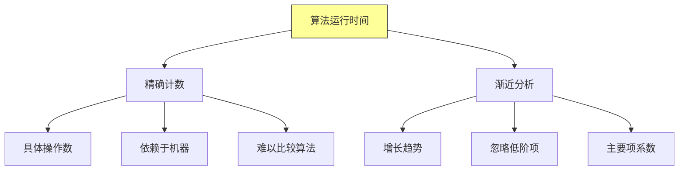

**核心思想**：对于足够大的输入，真正影响运行时间的是**增长最快的项**。

### 1.2 渐近符号概览

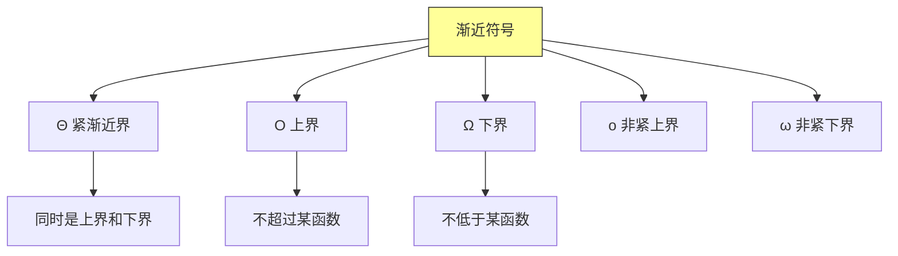

---

## 二、Θ 符号：紧渐近界

### 2.1 Θ 的定义

**定义**：若存在正常量 $c_1, c_2, n_0$，使得对于所有 $n \geq n_0$，有：
$$0 \leq c_1 \cdot g(n) \leq f(n) \leq c_2 \cdot g(n)$$

则称 $f(n) = \Theta(g(n))$，读作 "f(n) 是 g(n) 的渐近紧界"。

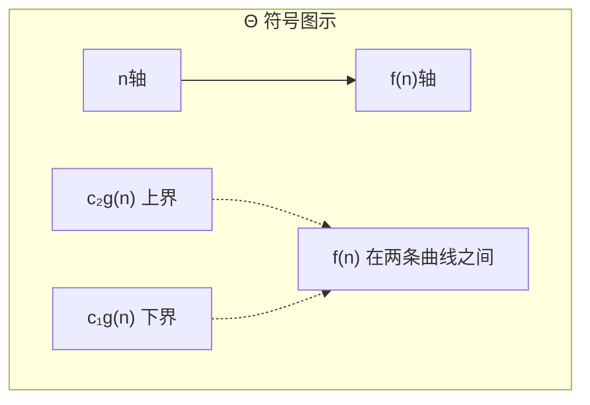

### 2.2 Θ 的直观理解

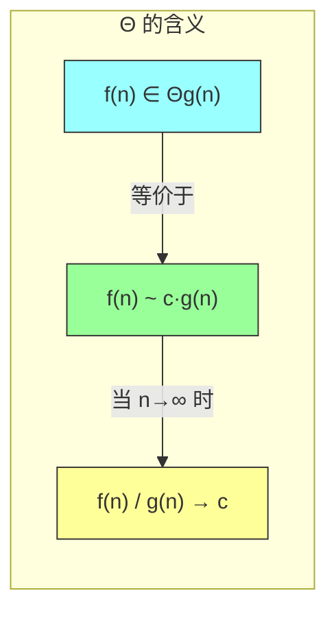

### 2.3 Θ 示例

| 函数 | 渐近紧界 | 说明 |
|-----|---------|------|
| $5n^2 + 3n + 2$ | $\Theta(n^2)$ | 二次项主导 |
| $an^3 + bn^2 + cn + d$ | $\Theta(n^3)$ | 三次项主导 |
| $\log_2 n + 100$ | $\Theta(\log n)$ | 对数项主导 |

**推导过程**：
```
5n² + 3n + 2
= n²(5 + 3/n + 2/n²)
当 n→∞ 时，括号内 → 5
所以 = Θ(n²)
```

---

## 三、O 符号：上界

### 3.1 O 的定义

**定义**：若存在正常量 $c, n_0$，使得对于所有 $n \geq n_0$，有：
$$0 \leq f(n) \leq c \cdot g(n)$$

则称 $f(n) = O(g(n))$，读作 "f(n) 是 g(n) 的大 O"。

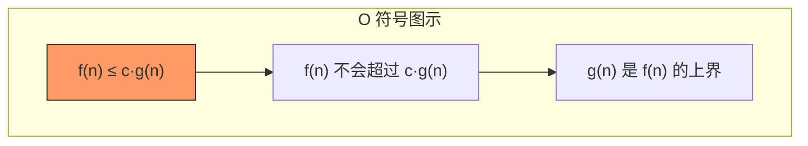

### 3.2 O 与 Θ 的关系

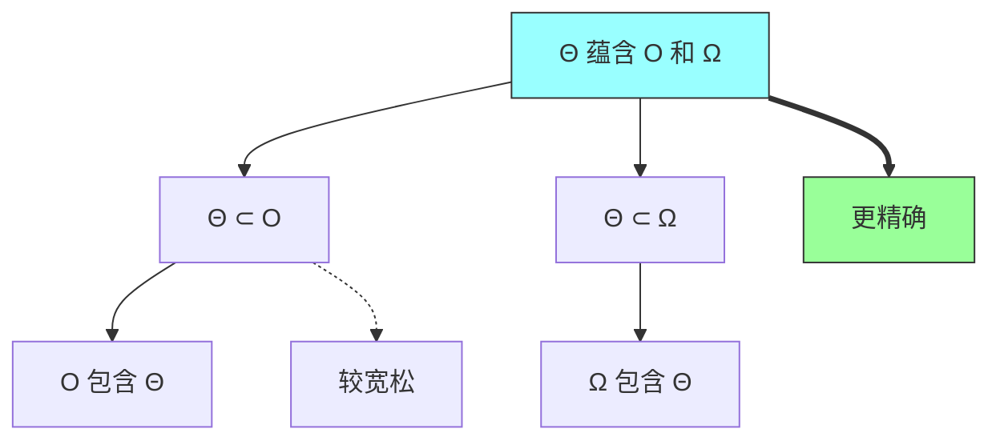

### 3.3 常见时间复杂度

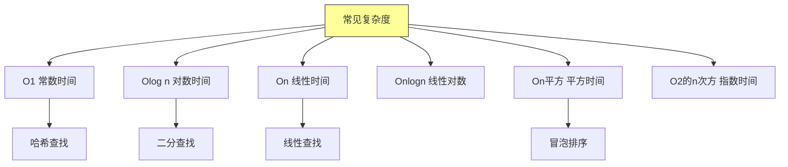

---

## 四、Ω 符号：下界

### 4.1 Ω 的定义

**定义**：若存在正常量 $c, n_0$，使得对于所有 $n \geq n_0$，有：
$$0 \leq c \cdot g(n) \leq f(n)$$

则称 $f(n) = \Omega(g(n))$，读作 "f(n) 是 g(n) 的大 Omega"。

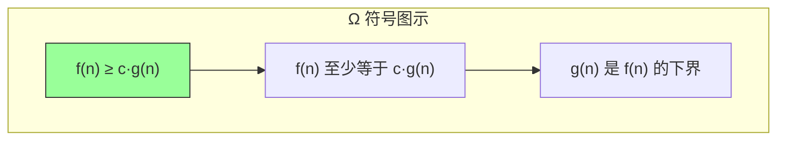

### 4.2 复杂度下界示例

| 算法问题 | 最佳可能复杂度 | Ω 符号表示 |
|---------|--------------|-----------|
| 排序比较模型 | $\Omega(n\log n)$ | 任何比较排序都需要 |
| 数组查找 | $\Omega(1)$ | 最好情况 |
| 遍历链表 | $\Omega(n)$ | 必须访问每个节点 |

---

## 五、o 和 ω 符号：非紧渐近界

### 5.1 o 符号：非紧上界

**定义**：对于任意正常量 $c > 0$，存在 $n_0$，使得对于所有 $n \geq n_0$，有：
$$0 \leq f(n) < c \cdot g(n)$$

则称 $f(n) = o(g(n))$，读作 "f(n) 是 g(n) 的小 o"。

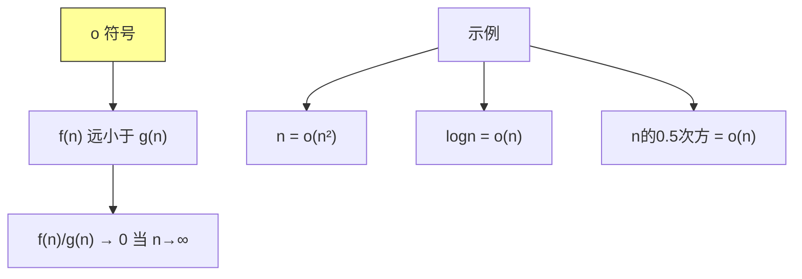

### 5.2 ω 符号：非紧下界

**定义**：对于任意正常量 $c > 0$，存在 $n_0$，使得对于所有 $n \geq n_0$，有：
$$0 \leq c \cdot g(n) < f(n)$$

则称 $f(n) = \omega(g(n))$，读作 "f(n) 是 g(n) 的小 omega"。

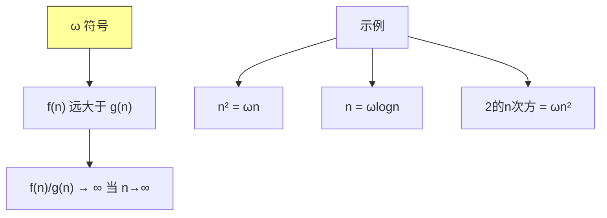

### 5.3 符号关系总结

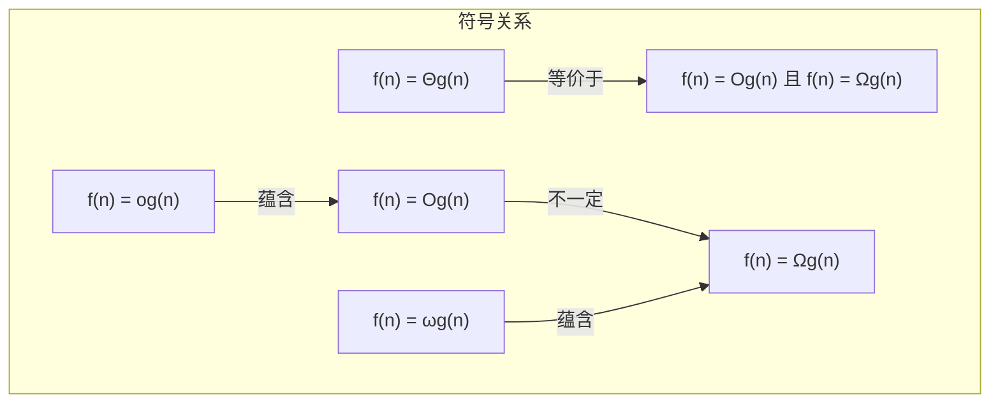

---

## 六、渐近记号的性质

### 6.1 传递性

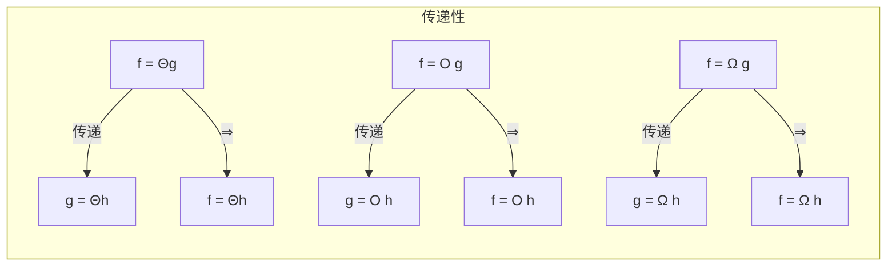

### 6.2 对称性

| 符号对 | 关系 | 说明 |
|-------|------|------|
| f = Θg | ⇔ | g = Θf |
| f = O g | ⇐ | g = Ω f |
| f = o g | ⇐ | g = ω f |

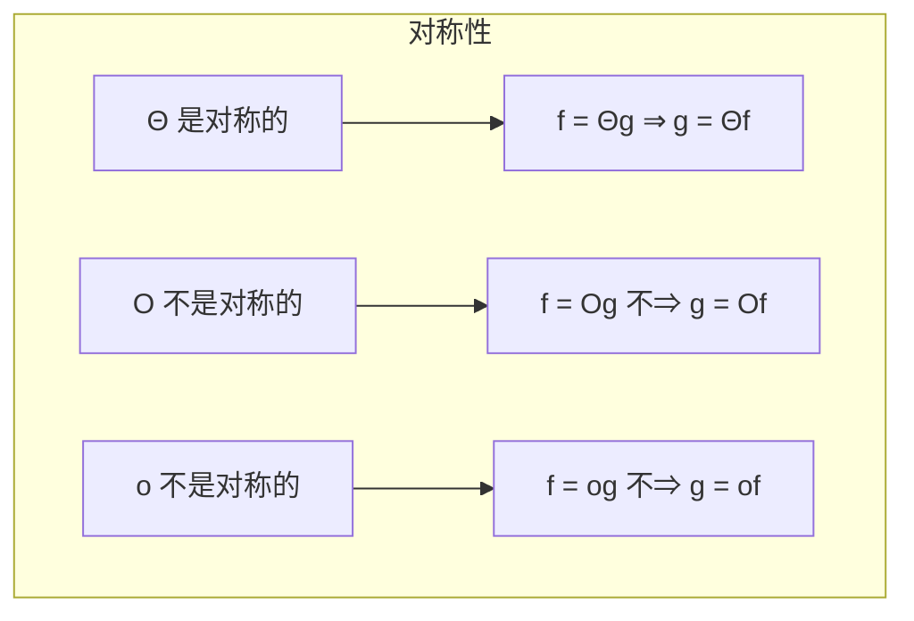

### 6.3 算术运算规则

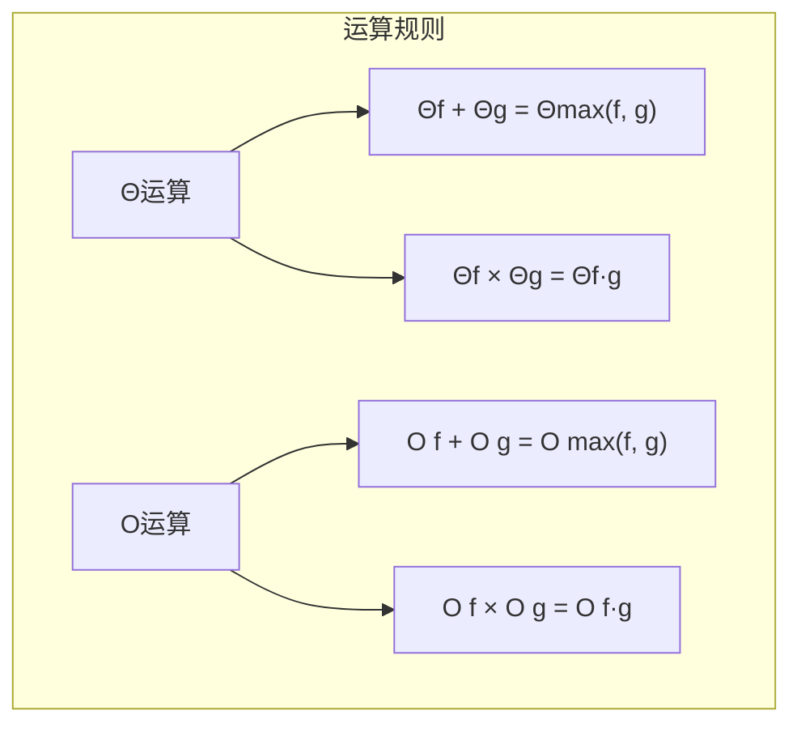

**示例**：
```
Θn + Θlog n = Θn           （主导项原则）
Θn × Θlog n = Θn log n
O n² + O n³ = O n³
```

---

## 七、常见函数及其增长

### 7.1 多项式函数

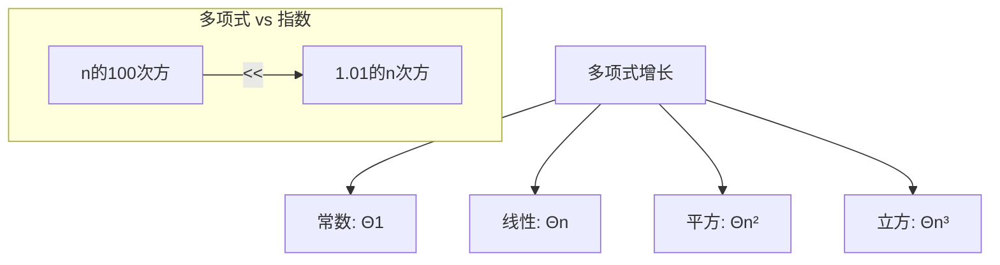

| 多项式 | 增长级别 |
|-------|---------|
| $n^3$ | 比 $n^2$ 快 |
| $n^2$ | 比 $n \log n$ 快 |
| $n \log n$ | 比 $n$ 快 |

### 7.2 对数函数

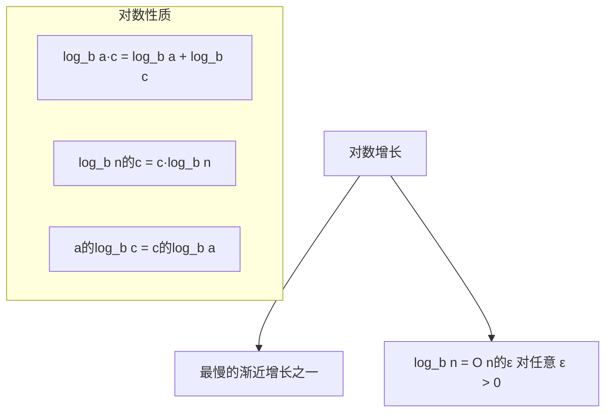

**重要性质**：对数增长极其缓慢
- $\log_2 10^6 ≈ 20$
- $\log_2 10^9 ≈ 30$
- $\log_2 10^{12} ≈ 40$

### 7.3 指数函数

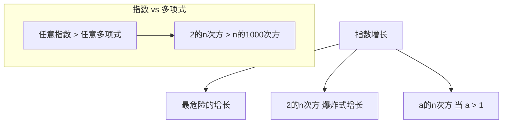

### 7.4 阶乘函数

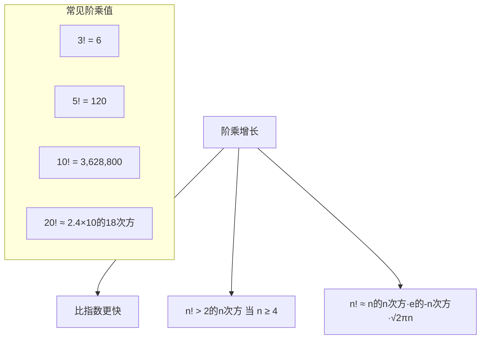

### 7.5 增长曲线对比

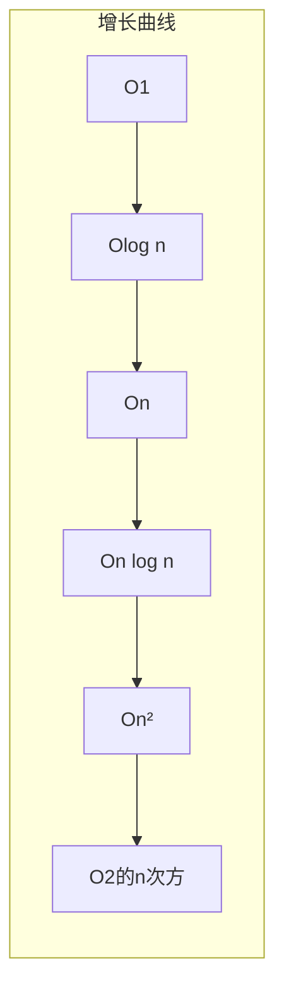

| n | log n | n | n log n | n² | 2^n |
|---|-------|---|---------|-----|-----|
| 1 | 0 | 1 | 0 | 1 | 2 |
| 10 | 3 | 10 | 33 | 100 | 1024 |
| 100 | 7 | 100 | 664 | 10000 | 10³⁰ |
| 1000 | 10 | 1000 | 9966 | 10⁶ | 10³⁰⁰ |

---

## 八、Java 实现示例

### 8.1 复杂度判断工具

```java
/**
 * 渐近复杂度分析工具类
 */
public class AsymptoticAnalysis {

    /**
     * 判断 f(n) 是否为 Θg(n)
     * 通过比较增长趋势来判断
     */
    public static boolean isTheta(double[] f, double[] g) {
        // 计算 f(n)/g(n) 的比值
        double ratio = f[f.length - 1] / g[g.length - 1];
        // 如果比值稳定，则 f = Θg
        return ratio > 0.1 && ratio < 10;
    }

    /**
     * 判断 f(n) 是否为 O g(n)
     */
    public static boolean isO(double[] f, double[] g) {
        // f 增长不快于 g
        for (int i = 0; i < f.length; i++) {
            if (f[i] > 100 * g[i]) {  // 使用较大的常数因子
                return false;
            }
        }
        return true;
    }

    /**
     * 判断 f(n) 是否为 Ω g(n)
     */
    public static boolean isOmega(double[] f, double[] g) {
        // f 增长不慢于 g
        for (int i = 0; i < f.length; i++) {
            if (f[i] < 0.01 * g[i]) {  // 使用较小的常数因子
                return false;
            }
        }
        return true;
    }

    /**
     * 生成 n 的不同幂次的值
     */
    public static double[] powerSeries(int n, double exponent) {
        double[] result = new double[n];
        for (int i = 1; i <= n; i++) {
            result[i - 1] = Math.pow(i, exponent);
        }
        return result;
    }

    /**
     * 生成对数序列
     */
    public static double[] logSeries(int n, double base) {
        double[] result = new double[n];
        for (int i = 1; i <= n; i++) {
            result[i - 1] = Math.log(i) / Math.log(base);
        }
        return result;
    }

    /**
     * 生成指数序列
     */
    public static double[] exponentialSeries(int n, double base) {
        double[] result = new double[n];
        for (int i = 0; i < n; i++) {
            result[i] = Math.pow(base, i);
        }
        return result;
    }

    public static void main(String[] args) {
        // 测试：5n² + 3n + 2 是否为 Θn²
        int n = 1000;
        double[] f = new double[n];
        double[] g = new double[n];

        for (int i = 1; i <= n; i++) {
            f[i - 1] = 5 * i * i + 3 * i + 2;  // f(n)
            g[i - 1] = i * i;                   // g(n) = n²
        }

        System.out.println("f(n) = 5n² + 3n + 2");
        System.out.println("g(n) = n²");
        System.out.println("f = Θg? " + isTheta(f, g));
        System.out.println("f = O g? " + isO(f, g));
        System.out.println("f = Ω g? " + isOmega(f, g));
    }
}
```

### 8.2 复杂度比较器

```java
import java.util.Comparator;

/**
 * 基于渐近分析的复杂度比较器
 */
public class ComplexityComparator implements Comparator<String> {

    // 复杂度级别映射
    private static final java.util.Map<String, Integer> LEVELS =
        java.util.Map.of(
            "O1", 1,
            "Olog n", 2,
            "On", 3,
            "On log n", 4,
            "On²", 5,
            "On³", 6,
            "O2的n次方", 7,
            "On的阶乘", 8
        );

    @Override
    public int compare(String c1, String c2) {
        Integer level1 = LEVELS.getOrDefault(c1, 0);
        Integer level2 = LEVELS.getOrDefault(c2, 0);
        return level1.compareTo(level2);
    }

    /**
     * 判断复杂度 c1 是否优于 c2
     */
    public static boolean isBetter(String c1, String c2) {
        return new ComplexityComparator().compare(c1, c2) < 0;
    }
}
```

---

## 九、Python 实现示例

### 9.1 渐近符号验证

```python
"""
渐近符号验证工具
"""
import math
from typing import Callable, List

def generate_values(func: Callable[[int], float], n: int) -> List[float]:
    """生成函数值序列"""
    return [func(i) for i in range(1, n + 1)]


def is_theta(f: List[float], g: List[float], c1: float = 0.1, c2: float = 10) -> bool:
    """
    判断 f(n) 是否为 Θg(n)
    即：存在 c1, c2 使得 c1*g(n) ≤ f(n) ≤ c2*g(n)
    """
    for fn, gn in zip(f, g):
        if gn == 0:
            continue
        ratio = fn / gn
        if ratio < c1 or ratio > c2:
            return False
    return True


def is_o(f: List[float], g: List[float]) -> bool:
    """
    判断 f(n) 是否为 o(g(n))
    即：f(n)/g(n) → 0 当 n → ∞
    """
    # 检查比值是否趋近于0
    ratios = [fn / gn for fn, gn in zip(f, g) if gn != 0]
    return all(ratios[i] >= ratios[i+1] for i in range(len(ratios)-1)) and ratios[-1] < 0.01


def is_big_O(f: List[float], g: List[float], c: float = 100) -> bool:
    """
    判断 f(n) 是否为 O(g(n))
    即：f(n) ≤ c*g(n)
    """
    for fn, gn in zip(f, g):
        if gn == 0:
            continue
        if fn > c * gn:
            return False
    return True


def is_omega(f: List[float], g: List[float], c: float = 0.01) -> bool:
    """
    判断 f(n) 是否为 Ω(g(n))
    即：f(n) ≥ c*g(n)
    """
    for fn, gn in zip(f, g):
        if gn == 0:
            continue
        if fn < c * gn:
            return False
    return True


# 测试
if __name__ == "__main__":
    n = 1000

    # f(n) = 5n² + 3n + 2
    f = generate_values(lambda x: 5*x*x + 3*x + 2, n)
    # g(n) = n²
    g = generate_values(lambda x: x*x, n)
    # h(n) = n³
    h = generate_values(lambda x: x*x*x, n)

    print("f(n) = 5n² + 3n + 2")
    print(f"f = Θ(n²)? {is_theta(f, g)}")
    print(f"f = O(n²)? {is_big_O(f, g)}")
    print(f"f = Ω(n²)? {is_omega(f, g)}")
    print(f"f = o(n³)? {is_o(f, h)}")
```

### 9.2 复杂度可视化

```python
"""
复杂度增长曲线对比
"""
import matplotlib.pyplot as plt
import numpy as np

def plot_complexity_growth():
    """绘制各种复杂度的时间增长曲线"""
    n = np.linspace(1, 100, 1000)

    # 定义各种复杂度函数
    functions = {
        'O(1)': lambda x: np.ones_like(x),
        'O(log n)': lambda x: np.log2(x),
        'O(n)': lambda x: x,
        'O(n log n)': lambda x: x * np.log2(x),
        'O(n²)': lambda x: x ** 2,
        'O(2^n)': lambda x: 2 ** x
    }

    plt.figure(figsize=(12, 8))

    colors = ['blue', 'green', 'orange', 'red', 'purple', 'brown']

    for (name, func), color in zip(functions.items(), colors):
        # 对 O(2^n) 进行缩放以便显示
        if name == 'O(2^n)':
            y = func(n) / func(n)[-1] * 100  # 归一化显示
        else:
            y = func(n)
        plt.plot(n, y, label=name, color=color, linewidth=2)

    plt.xlabel('n (输入规模)', fontsize=12)
    plt.ylabel('运行时间（相对值）', fontsize=12)
    plt.title('算法复杂度增长对比', fontsize=14)
    plt.legend(loc='upper left')
    plt.grid(True, alpha=0.3)
    plt.yscale('log')  # 对数坐标更好地展示差异

    plt.tight_layout()
    plt.savefig('complexity_growth.png', dpi=150)
    plt.show()


if __name__ == "__main__":
    plot_complexity_growth()
```

---

## 十、复杂度分析实战

### 10.1 常见代码段复杂度

```java
public class ComplexityExamples {

    // O(1) - 常数时间
    public static int constantTime(int[] arr) {
        return arr[0] + arr[arr.length - 1];  // 两次访问 O(1)
    }

    // O(n) - 线性时间
    public static int linearTime(int[] arr) {
        int sum = 0;
        for (int i = 0; i < arr.length; i++) {
            sum += arr[i];
        }
        return sum;
    }

    // O(n²) - 平方时间
    public static int quadraticTime(int[][] matrix) {
        int sum = 0;
        for (int i = 0; i < matrix.length; i++) {
            for (int j = 0; j < matrix[i].length; j++) {
                sum += matrix[i][j];
            }
        }
        return sum;
    }

    // O(log n) - 对数时间（二分查找）
    public static int binarySearch(int[] arr, int target) {
        int left = 0, right = arr.length - 1;
        while (left <= right) {
            int mid = left + (right - left) / 2;
            if (arr[mid] == target) return mid;
            if (arr[mid] < target) left = mid + 1;
            else right = mid - 1;
        }
        return -1;
    }

    // O(n log n) - 线性对数时间（归并排序）
    public static void mergeSort(int[] arr, int left, int right) {
        if (left < right) {
            int mid = left + (right - left) / 2;
            mergeSort(arr, left, mid);
            mergeSort(arr, mid + 1, right);
            merge(arr, left, mid, right);
        }
    }
}
```

### 10.2 复杂度选择指南

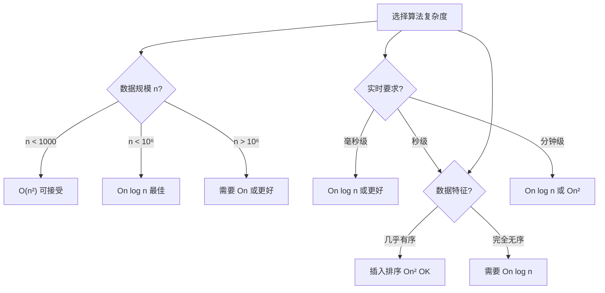

---

## 十一、总结与要点

### 11.1 核心概念

```mermaid
graph TD
    A["第三章核心"] --> B["渐近符号"]
    A --> C["符号性质"]
    A --> D["复杂度比较"]

    B --> B1["Θ 紧界"]
    B --> B2["O 上界"]
    B --> B3["Ω 下界"]

    C --> C1["传递性"]
    C --> C2["对称性"]
    C --> C3["算术规则"]

    D --> D1["多项式 < 指数"]
    D --> D2["对数最慢"]
    D --> D3["阶乘最快"]

    style A fill:#ff9,stroke:#333
```

### 11.2 符号速查表

| 符号 | 读音 | 含义 | 数学定义 |
|-----|------|------|---------|
| Θ | Theta | 紧渐近界 | $c_1 g \leq f \leq c_2 g$ |
| O | Big-O | 上界 | $f \leq c \cdot g$ |
| Ω | Omega | 下界 | $f \geq c \cdot g$ |
| o | little-o | 严格上界 | $f < c \cdot g$ |
| ω | little-omega | 严格下界 | $f > c \cdot g$ |

### 11.3 增长级别排序

$$O(1) < O(\log n) < O(n) < O(n \log n) < O(n^2) < O(n^3) < O(2^n) < O(n!)$$

**记忆口诀**："常对线乘平立指阶"

- 常：O(1) 常数
- 对：O(log n) 对数
- 线：O(n) 线性
- 乘：O(n log n) 线性对数
- 平：O(n²) 平方
- 立：O(n³) 立方
- 指：O(2^n) 指数
- 阶：O(n!) 阶乘

---

## 十二、课后思考

### 思考题 1
证明：若 $f(n) = O(g(n))$ 且 $g(n) = O(h(n))$，则 $f(n) = O(h(n))$

### 思考题 2
判断下列关系是否成立：
- $n^2 = O(n^3)$ ？
- $n^3 = O(n^2)$ ？
- $2^{n+1} = O(2^n)$ ？

### 思考题 3
排序算法的时间复杂度下界是什么？为什么？

---

*本章精读笔记完成*
