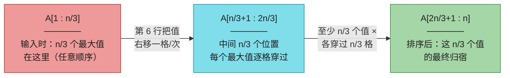
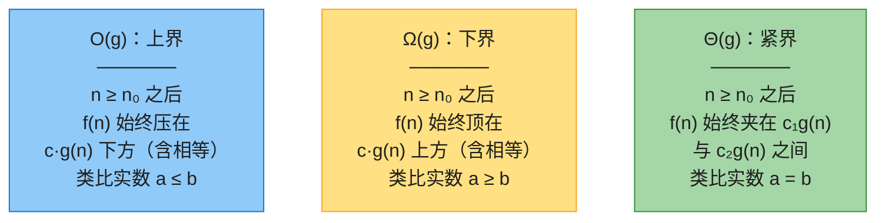
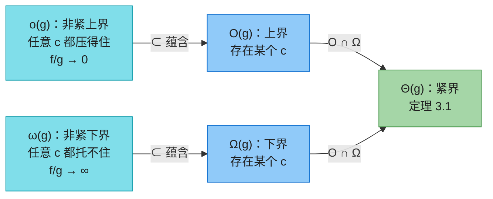

# 第三章：函数的增长（Characterizing Running Times）

> **本章定位**：第 2 章我们逐条数指令，算出插入排序的精确运行时间——一个带 8 个常数的二次多项式，繁琐且机器相关。本章给出全书通用的「简化语言」：**渐近记号**（O、Ω、Θ、o、ω），用来刻画输入规模 n 趋于无穷时运行时间的**增长量级**，忽略低阶项和首项系数。
>
> 这套记号是本书之后所有复杂度声明的基础语言：第 4 章的递归式、第 6 章的堆排序、第 16 章的摊还分析，全部用它书写。**本章没有新算法，全是数学工具**，但「会不会规范使用 O/Θ」决定了后面每一章的表述是否严谨。
>
> 📌 **第四版变化**：本章在第三版中叫 "Growth of Functions"，第四版改名 "Characterizing Running Times"，并新增 3.1 节——先非正式地引入记号、并用插入排序做完整示范，3.2 节才给形式定义。本章笔记按第四版顺序组织。
>
> 📌 **对数约定**（全书统一）：`lg n = log₂ n`（二分对数），`ln n = logₑ n`（自然对数），`lgᵏ n = (lg n)ᵏ`（幂），`lg lg n = lg(lg n)`（复合）。

---

## 一、渐近记号的直觉（§3.1）

### 1.1 三种记号的一句话版本

分析插入排序时，我们把精确时间 $\left(\frac{c_5}{2}+\frac{c_6}{2}+\frac{c_7}{2}\right)n^2 + (\cdots)n + (\cdots)$ 中的**低阶项丢掉、首项系数忽略**，只留下 $n^2$ 这个增长因子。三种记号就是三种「留白」方式：

| 记号 | 一句话含义 | 类比实数关系 |
|------|-----------|-------------|
| **O(g)** | f 增长**不比** g 快（渐近上界） | $a \le b$ |
| **Ω(g)** | f 增长**至少**和 g 一样快（渐近下界） | $a \ge b$ |
| **Θ(g)** | f 增长**恰好**和 g 同阶（渐近紧界） | $a = b$ |

都以**最高次项**为准。例如 $7n^3 + 100n^2 - 20n + 6$：

- 是 $O(n^3)$——同时也是 $O(n^4)$、$O(n^5)$……说「不比它快」永远不算错，只是越来越不准；
- 是 $\Omega(n^3)$——同时也是 $\Omega(n^2)$、$\Omega(n)$；
- 是 $\Theta(n^3)$——只有同阶才能进 Θ，**不是** $\Theta(n^4)$。

> 🔑 关键事实（3.2 节的定理 3.1）：**既是 O(g) 又是 Ω(g) ⟺ 是 Θ(g)**。上例中 $7n^3+\cdots$ 既 $O(n^3)$ 又 $\Omega(n^3)$，故 $\Theta(n^3)$。

### 1.2 案例：不算求和式，论证插入排序最坏 Θ(n²)

第 2 章靠展开求和式得到插入排序最坏 $\Theta(n^2)$；本节示范**只用渐近记号的推理**（这是第四版新增内容，也是本章记号的第一次实战）。

```
INSERTION-SORT(A, n)
1  for i = 2 to n
2      key = A[i]
3      // 把 A[i] 插入已排序子数组 A[1 : i-1]
4      j = i - 1
5      while j > 0 and A[j] > key
6          A[j+1] = A[j]
7          j = j - 1
8      A[j+1] = key
```

**第一步：O(n²)（对所有输入成立的「毯式」上界）**。外层 for 固定跑 $n-1$ 轮；第 $i$ 轮内层 while 最多迭代 $i-1 \le n$ 次，每次迭代是常数时间。内层总迭代数 $\le (n-1)(n-1) < n^2$，故任何输入下运行时间 $O(n^2)$。

**第二步：Ω(n²)（最坏情况的下界）**。注意「最坏情况是 Ω(n²)」的含义：对每个足够大的 n，**存在某个**规模为 n 的输入使耗时至少 $cn^2$——不要求所有输入都慢。

观察：一个值要想最终落在比起始位置靠右 k 格的地方，第 6 行至少执行 k 次。构造输入：让**最大的 n/3 个值占据数组前 n/3 个位置**（内部顺序任意）。排序后它们都必须落到后 n/3 个位置，因此每个值都要**逐一穿过中间 n/3 个位置**：



于是第 6 行至少执行 $\frac{n}{3}\cdot\frac{n}{3} = \frac{n^2}{9}$ 次，即这个输入耗时 $\Omega(n^2)$。（对应 CLRS Figure 3.1；n 不是 3 的倍数时取整修正即可，习题 3.1-1。推广到「αn 个最大值在前 αn 个位置」见习题 3.1-3。）

**第三步：合成**。所有输入 $O(n^2)$ + 最坏情况 $\Omega(n^2)$ ⟹ **最坏情况运行时间为 $\Theta(n^2)$**。注意这只刻画了最坏情况——最好情况（已排序输入）是 $\Theta(n)$，见第 2 章。

---

## 二、形式定义（§3.2）

### 2.1 三个集合定义

渐近记号定义在**函数集合**上（定义域通常为自然数）：

$$
\begin{aligned}
O(g(n)) &= \{\, f(n) : \text{存在正常量 } c, n_0 \text{ 使 } 0 \le f(n) \le c\,g(n) \text{ 对所有 } n \ge n_0 \,\} \\
\Omega(g(n)) &= \{\, f(n) : \text{存在正常量 } c, n_0 \text{ 使 } 0 \le c\,g(n) \le f(n) \text{ 对所有 } n \ge n_0 \,\} \\
\Theta(g(n)) &= \{\, f(n) : \text{存在正常量 } c_1, c_2, n_0 \text{ 使 } 0 \le c_1 g(n) \le f(n) \le c_2 g(n) \text{ 对所有 } n \ge n_0 \,\}
\end{aligned}
$$

要点：

- **常量 $c$（Θ 为 $c_1, c_2$）和 $n_0$ 都只要求「存在」**，与 n 无关；找到任意一组就算证明完毕。
- 定义里的 $0 \le \cdots$ 要求成员函数**渐近非负**（n 足够大后非负），因此 g(n) 本身也必须渐近非负，否则集合为空。**本章所有记号默认作用于渐近非负函数。**
- 严格写法应是集合成员 $f(n) \in O(g(n))$，但习惯上写 **$f(n) = O(g(n))$**。这个「=」是**滥用符号**（有方向性：$n^2 = O(n^3)$ 成立，$O(n^3) = n^2$ 不成立），第四节会讲它的精确解释。

三种记号的直观几何图像（对应 CLRS Figure 3.2）：



图中的 $n_0$ 取的是「最小可行值」，任何更大的值同样合法——这正是「渐近」的含义：**n₀ 左侧的有限行为一律不管**。

> ⚠️ **常见错误**：「$f = \Theta(g)$ 等价于 $f/g \to c$（比值收敛到某常数）」——**不对**。Θ 只要求比值最终被**夹在** $[c_1, c_2]$ 区间内，可以永远振荡。例如 $f(n) = n(2+\sin n) = \Theta(n)$，但 $f(n)/n$ 在 $[1,3]$ 上振荡、没有极限。带极限的判据只属于 o 和 ω（见第五节）。

### 2.2 定理 3.1：Θ ⟺ O 且 Ω

> **定理 3.1**　对任意两个函数 $f(n)$ 和 $g(n)$，$f(n) = \Theta(g(n))$ 当且仅当 $f(n) = O(g(n))$ 且 $f(n) = \Omega(g(n))$。

证明是直接按定义拆合区间（习题 3.2-4）。这是证明紧界的标准套路：**上界、下界分开攻，最后合成 Θ**——1.2 节的插入排序就是用它收尾的。

### 2.3 用定义证明：找一对 c 和 n₀

**例 1（正面）**：证 $4n^2 + 100n + 500 = O(n^2)$。两边除以 $n^2$：需 $4 + \frac{100}{n} + \frac{500}{n^2} \le c$。多组 $(n_0, c)$ 都可行——**$n_0$ 取得越大，c 就能压得越低**：

| 取 $n_0$ = | 1 | 10 | 100 |
|-----------|---|----|----|
| 可用 $c$ = | 604 | 19 | 5.05 |

同理可证它是 $\Omega(n^2)$（$c = 4$、任意 $n_0$ 即可），合成得 $\Theta(n^2)$。**低阶项系数再大（100、500 ≫ 4）也不影响渐近结论。**

**例 2（反面）**：证 $n^3 - 100n^2 \ne O(n^2)$。若成立，则需 $n - 100 \le c$ 对所有 $n \ge n_0$ 成立——但 $n > c + 100$ 时必然被破坏，无论 c 取多大。**首项系数是巨大负数也救不回来。**

**例 3（极端小系数）**：$\frac{n^2}{100} - 100n - 500 = \Omega(n^2)$。取 $n_0 = 10005$ 时 $c = 2.49\times10^{-9}$ 即可。c 小得可怜，但**只要它是正常量就合法**；$n_0$ 取得越大，c 越能逼近真实系数 $1/100$。

---

## 三、用渐近记号描述运行时间：怎么说才不算错

渐近记号必须**尽量精确、且不夸大适用范围**。以插入排序为例：

| 说法 | 对不对 | 原因 |
|------|-------|------|
| 最坏情况 $O(n^2)$ / $\Omega(n^2)$ / $\Theta(n^2)$ | ✅（Θ 最精确、最优选） | 见 1.2 节 |
| 最好情况 $\Theta(n)$ | ✅ | 已排序输入，内层不迭代 |
| 「插入排序的运行时间是 $\Theta(n^2)$」 | ❌ **夸大** | 没写「最坏」= 对所有输入声称，但最好情况只有 $\Theta(n)$ |
| 「插入排序的运行时间是 $O(n^2)$」 | ✅ | 上界允许某些情况更慢，毯式成立 |
| 「插入排序的运行时间是 $\Omega(n)$」 | ✅（但很弱） | 下界同理 |
| 归并排序：直接说「运行时间 $\Theta(n \lg n)$」 | ✅ | 它**所有情况**都是 $\Theta(n \lg n)$，无需限定词 |

> ⚠️ **O 被误当紧界**：常听人说「O(n lg n) 的算法比 O(n²) 的快」——**这句话推不出来**。O 只是上界，那个「O(n²)」的算法实际可能是 $\Theta(n)$。要表达紧界请用 Θ。

另外，总要用**最简单**的界：运行时间 $3n^2 + 20n$ 就写 $\Theta(n^2)$，不写 $O(n^3)$（太松）或 $\Theta(3n^2+20n)$（徒增噪音）。

---

## 四、等式中的渐近记号与「恰当的滥用」

### 4.1 「=」的精确解释：匿名函数

渐近记号**单独出现在等号右边**时，「=」意为集合成员：$4n^2+100n+500 = O(n^2)$ 即 $\in O(n^2)$。

渐近记号**出现在公式内部**时，它代表某个**不必指名的匿名函数**：

$$2n^2 + 3n + 1 = 2n^2 + \Theta(n)$$

读作：存在某 $f(n) \in \Theta(n)$（这里 $f(n) = 3n+1$）使等式成立。好处是**消除无关细节**——归并排序写成 $T(n) = 2T(n/2) + \Theta(n)$，而不必写出合并代价的每个低阶项。

一个式子里记号出现几次就有几个匿名函数：$\sum_{i=1}^{n} O(i)$ 里只有**一个**关于 i 的匿名函数，它与 $O(1) + O(2) + \cdots + O(n)$ **不是一回事**（后者没有干净的解释）。

### 4.2 左边出现记号：右边更粗

$$2n^2 + \Theta(n) = \Theta(n^2)$$

解释规则：**无论左边的匿名函数怎么选，右边都选得出匿名函数使等式成立**。即「右边比左边更粗」。多个式子可以链起来：

$$2n^2 + 3n + 1 = 2n^2 + \Theta(n) = \Theta(n^2)$$

逐式解释后即得首尾的结论 $2n^2+3n+1 = \Theta(n^2)$。这是日后化简递归式的日常写法。

### 4.3 三种「恰当的滥用」（约定俗成，不会误解）

1. **O(1) 里的变量靠上下文判断**：$f(n) = O(1)$ 指 f 被常数界住（随 n→∞），式子里没出现变量也不影响理解。
2. **「n < 3 时 T(n) = O(1)」**：按形式定义这句话无意义（定义只约束 $n \ge n_0$ 之后）。约定含义是「存在常数 c 使 $n<3$ 时 $T(n) \le c$」——写递归式的边界条件时天天这么用。
3. **部分定义域**：若 f 只在 2 的幂上有定义，则 $f = O(g)$ 的不等式只要求在 f 有定义的点上成立。

> 💡 滥用（abuse）不等于乱用：只要每个人对含义的理解一致、推不出错误结论，它就是好的数学简写。

---

## 五、o 与 ω：非紧渐近界

O 给的界**可能紧也可能松**：$2n^2 = O(n^2)$ 是紧的，$2n = O(n^2)$ 是松的。o 记号专表「**一定不紧**的上界」：

$$
\begin{aligned}
o(g(n)) &= \{\, f(n) : \text{对任意常量 } c>0, \text{ 存在 } n_0>0 \text{ 使 } 0 \le f(n) < c\,g(n) \text{ 对所有 } n \ge n_0 \,\} \\
\omega(g(n)) &= \{\, f(n) : \text{对任意常量 } c>0, \text{ 存在 } n_0>0 \text{ 使 } 0 \le c\,g(n) < f(n) \text{ 对所有 } n \ge n_0 \,\}
\end{aligned}
$$

与 O/Ω 的唯一区别、也是关键区别：**「存在某个 c」变成了「对任意 c」**——不管把 g 压多扁，f 终究还是比它小（大）。直觉：f 相对 g 变得**微不足道（任意大）**：

$$f(n) = o(g(n)) \iff \lim_{n\to\infty} \frac{f(n)}{g(n)} = 0, \qquad f(n) = \omega(g(n)) \implies \lim_{n\to\infty} \frac{f(n)}{g(n)} = \infty \text{（若极限存在）}$$

| 例子 | 成立 | 不成立 |
|------|------|--------|
| o | $2n = o(n^2)$，$\lg n = o(n)$ | $2n^2 \ne o(n^2)$（比值 → 2 ≠ 0） |
| ω | $\frac{n^2}{2} = \omega(n)$，$2^n = \omega(n^{1000})$ | $\frac{n^2}{2} \ne \omega(n^2)$ |

> 🔑 $f = \omega(g) \iff g = o(f)$（转置）。且 $o(g) \cap \omega(g) = \varnothing$（习题 3.2-6：同一 f 不可能比 g 既任意小又任意大）。

---

## 六、函数比较的性质

设 f(n)、g(n) 渐近为正：

| 性质 | 内容（五种记号 uniformly 成立的部分） |
|------|--------------------------------------|
| **传递性** | f = ⊙(g) 且 g = ⊙(h) ⟹ f = ⊙(h)，⊙ ∈ {Θ, O, Ω, o, ω} 全部成立 |
| **自反性** | f = Θ(f)、f = O(f)、f = Ω(f)（注意：o、ω **不**自反） |
| **对称性** | f = Θ(g) ⟺ g = Θ(f)（只有 Θ 对称） |
| **转置对称** | f = O(g) ⟺ g = Ω(f)；f = o(g) ⟺ g = ω(f) |

由此，**渐近比较可以完全类比实数比较**：

$$f = O(g) \approx a \le b;\quad f = \Omega(g) \approx a \ge b;\quad f = \Theta(g) \approx a = b;\quad f = o(g) \approx a < b;\quad f = \omega(g) \approx a > b$$

$f = o(g)$ 称 f **渐近小于** g，$f = \omega(g)$ 称**渐近大于**。

> ⚠️ **三分律（trichotomy）不成立**：任意两个实数必满足 $a<b$、$a=b$、$a>b$ 之一，但**两个函数可能渐近不可比**——既非 $f = O(g)$ 也非 $f = \Omega(g)$。经典反例：$n$ 与 $n^{1+\sin n}$，后者指数在 $[0,2]$ 间振荡，轮流压过对方。（思考题 3-6 的 $\overset{\infty}{\Omega}$ 记号正是为修补这一点而设计的。）

---

## 七、标准记号与常见函数（§3.3）

### 7.1 单调性、取整、模运算

- **单调**：$m \le n \Rightarrow f(m) \le f(n)$ 为单调递增；换成严格不等号为严格递增。递减同理。
- **向下取整 ⌊x⌋ / 向上取整 ⌈x⌉**，最常用的几条：

| 公式 | 编号 | 用途 |
|------|------|------|
| $x - 1 < \lfloor x \rfloor \le x \le \lceil x \rceil < x + 1$ | (3.2) | 放缩的万能起手式 |
| $\lceil x \rceil = -\lfloor -x \rfloor$ | (3.3) | 上下取整互换 |
| $\lceil \lceil x/a \rceil / b \rceil = \lceil x/(ab) \rceil$，向下取整同理 | (3.5)(3.6) | 递归式分层分析 |
| $\lceil a/b \rceil \le \frac{a+(b-1)}{b}$；$\lfloor a/b \rfloor \ge \frac{a-(b-1)}{b}$ | (3.7)(3.8) | 去取整号估计 |
| $\lfloor n+x \rfloor = n + \lfloor x \rfloor$（n 为整数） | (3.9)(3.10) | 整数进出取整号 |

- **模运算**：$a \bmod n = a - n\lfloor a/n \rfloor$，故 $0 \le a \bmod n < n$（**a 为负也成立**）。$a \equiv b \pmod n$ 表示余数相同，等价于 $n \mid (b-a)$。

### 7.2 多项式

$d$ 次多项式 $p(n) = \sum_{i=0}^{d} a_i n^i$（$a_d \ne 0$）。**$p(n)$ 渐近正当且仅当 $a_d > 0$，此时 $p(n) = \Theta(n^d)$**。若 $f(n) = O(n^k)$ 对某常数 k 成立，称 f **多项式有界**（polynomially bounded）。

### 7.3 指数与 e

基本恒等式：$a^0 = 1$，$a^{-1} = 1/a$，$(a^m)^n = a^{mn}$，$a^m a^n = a^{m+n}$。约定 $0^0 = 1$。

**核心结论：任何底 > 1 的指数都压过任何多项式**：

$$\lim_{n\to\infty} \frac{n^b}{a^n} = 0 \quad\Longrightarrow\quad n^b = o(a^n) \quad (a > 1,\ b \text{ 任意实常数}) \tag{3.13}$$

（$2^n$ 终将大于 $n^{1000}$，b 多大都没用。）

关于 $e = 2.71828\ldots$ 的三件常用武器：

| 公式 | 编号 | 备注 |
|------|------|------|
| $e^x = 1 + x + \frac{x^2}{2!} + \frac{x^3}{3!} + \cdots$ | | 泰勒展开 |
| $1 + x \le e^x$（仅 x=0 取等）；$|x|\le 1$ 时 $1+x \le e^x \le 1+x+x^2$ | (3.14)(3.15) | 放缩神器 |
| $\lim\limits_{n\to\infty}\left(1+\frac{x}{n}\right)^n = e^x$ | (3.16) | 复利极限，概率分析常用 |

x→0 时 $e^x = 1 + x + \Theta(x^2)$——这里渐近记号刻画的是 **x→0** 而非 n→∞，上下文会说明。

### 7.4 对数

常用恒等式（a, b, c > 0，底 ≠ 1）：

| 公式 | 编号 |
|------|------|
| $a = b^{\log_b a}$ | (3.17) |
| $\log_c(ab) = \log_c a + \log_c b$ | (3.18) |
| $\log_b a^n = n \log_b a$ | |
| $\log_b a = \dfrac{\log_c a}{\log_c b}$（换底） | (3.19) |
| $\log_b(1/a) = -\log_b a$；$\log_b a = \dfrac{1}{\log_a b}$ | (3.20) |
| $a^{\log_b c} = c^{\log_b a}$ | (3.21)——**底和真数可以互换，极常用** |

要点：

- 由换底公式，**不同底的常数对数只差常数因子**，所以渐近记号里底数随便写：$O(\log_2 n) = O(\ln n)$，统一记 $O(\lg n)$。计算机科学偏爱底 2，因为算法总在「二分」。
- **书写约定**：对数只作用于紧随其后的那一项——`lg n + 1` 表示 $(\lg n) + 1$，不是 $\lg(n+1)$。
- $\ln(1+x) = x - \frac{x^2}{2} + \frac{x^3}{3} - \cdots$（|x|<1）；且 $x>-1$ 时 $\dfrac{x}{1+x} \le \ln(1+x) \le x$ (3.23)。
- **多重对数有界**：$f(n) = O(\lg^k n)$（k 为常数）称 polylogarithmically bounded。**任何正次数多项式都压过任何多重对数**（把 (3.13) 中 n 换成 $\lg n$ 即得）：

$$\lg^b n = o(n^a) \quad (a > 0) \tag{3.24}$$

### 7.5 阶乘与 Stirling 近似

$n! = 1 \cdot 2 \cdot 3 \cdots n$（$0! = 1$）。弱上界 $n! \le n^n$（n 个因子每个 ≤ n）。紧得多的估计：

$$\text{Stirling 近似：} \quad n! = \sqrt{2\pi n}\left(\frac{n}{e}\right)^n \left(1 + \Theta\!\left(\frac{1}{n}\right)\right) \tag{3.25}$$

三个由它推出的高频结论（习题 3.3-4）：

$$n! = o(n^n), \qquad n! = \omega(2^n), \qquad \lg(n!) = \Theta(n \lg n)$$

第三条特别常用（比较排序下界、哈希分析里反复出现）。更精确的误差项：$n! = \sqrt{2\pi n}\,(n/e)^n e^{\alpha_n}$，其中 $\frac{1}{12n+1} < \alpha_n < \frac{1}{12n}$ (3.29)。

### 7.6 函数迭代与迭代对数 lg\*

$f^{(i)}(n)$ 表示 f **迭代作用 i 次**：$f^{(0)}(n) = n$，$f^{(i)}(n) = f(f^{(i-1)}(n))$。例如 $f(n) = 2n$ 时 $f^{(i)}(n) = 2^i n$。

**迭代对数**：$\lg^* n = \min\{\, i \ge 0 : \lg^{(i)} n \le 1 \,\}$——「连续取多少次 lg 才能压到 1 以下」。注意区分：$\lg^{(i)} n$ 是迭代 i 次，$\lg^i n$ 是 $(\lg n)^i$。

它慢到离谱：

| n | 2 | 4 | 16 | 65536 | $2^{65536}$ |
|---|---|---|----|-------|-------------|
| $\lg^* n$ | 1 | 2 | 3 | 4 | 5 |

可观测宇宙的原子数约 $10^{80}$，远小于 $2^{65536} \approx 10^{19728}$——**实际输入的 lg\* n 永远不会超过 5**。它在并查集（第 19 章）等处的分析中出现。

### 7.7 Fibonacci 数

$F_0 = 0,\ F_1 = 1,\ F_i = F_{i-1} + F_{i-2}$，即 $0, 1, 1, 2, 3, 5, 8, 13, \ldots$。与**黄金分割比** $\phi$ 及其共轭 $\hat\phi$（方程 $x^2 = x + 1$ 的两根）相关：

$$\phi = \frac{1+\sqrt5}{2} = 1.61803\ldots, \qquad \hat\phi = \frac{1-\sqrt5}{2} = -0.61803\ldots$$

$$F_i = \frac{\phi^i - \hat\phi^i}{\sqrt5} \quad\Longrightarrow\quad F_i = \left\lfloor \frac{\phi^i}{\sqrt5} + \frac{1}{2} \right\rfloor$$

（因为 $|\hat\phi| < 1$，$\left|\hat\phi^i/\sqrt5\right| < 1/2$，第二项只影响四舍五入。）**Fibonacci 数指数增长**：$F_i = \Theta(\phi^i)$。

---

## 八、增长速度全景与可视化

### 8.1 增长级别总表

$$\Theta(1) < \Theta(\lg^* n) < \Theta(\lg \lg n) < \Theta(\lg n) < \Theta(\lg^2 n) < \Theta(\sqrt n) < \Theta(n) < \Theta(n \lg n) < \Theta(n^2) < \Theta(n^3) < \Theta(2^n) < \Theta(n!) < \Theta(n^n)$$

**记忆口诀**：「常、星、双对、对、对方、根、线、线对、平、立、指、阶、幂」——重点记住三组碾压关系：**多重对数 < 多项式**（(3.24)）、**多项式 < 指数**（(3.13)）、**指数 < 阶乘**（$n! = \omega(2^n)$）。

数值感受（lg 以 2 为底）：

| n | lg n | n | n lg n | n² | 2ⁿ | n! |
|---|------|---|--------|-----|-----|-----|
| 10 | 3.3 | 10 | 33 | 100 | 1024 | 3.6×10⁶ |
| 100 | 6.6 | 100 | 664 | 10⁴ | 1.3×10³⁰ | 9.3×10¹⁵⁷ |
| 1000 | 10 | 1000 | 9966 | 10⁶ | 10³⁰¹ | 4×10²⁵⁶⁷ |

典型算法对照：$O(1)$ 哈希查找；$O(\lg n)$ 二分查找；$O(n)$ 线性扫描；$O(n \lg n)$ 归并/堆排序；$O(n^2)$ 冒泡/插入排序；$O(2^n)$ 子集枚举；$O(n!)$ 全排列枚举。

### 8.2 用 Python 画出增长差异

本章是纯数学章，没有算法要实现；但一段画图代码能让你对「指数 vs 多项式」的碾压有肌肉记忆：

```python
import matplotlib.pyplot as plt
import numpy as np

def plot_growth():
    fig, (ax1, ax2) = plt.subplots(1, 2, figsize=(14, 5))

    # 左图：小 n 线性坐标——多项式家族内部对比
    n = np.arange(1, 21)
    ax1.plot(n, np.ones_like(n), label="1")
    ax1.plot(n, np.log2(n), label="lg n")
    ax1.plot(n, n, label="n")
    ax1.plot(n, n * np.log2(n), label="n lg n")
    ax1.plot(n, n**2, label="n^2")
    ax1.set(xlabel="n", ylabel="f(n)", title="n ≤ 20：多项式与对数")
    ax1.legend(); ax1.grid(alpha=0.3)

    # 右图：对数坐标——加入指数后的碾压
    n = np.arange(1, 101)
    for name, f in [("n", n), ("n lg n", n * np.log2(n)),
                    ("n^2", n**2.0), ("2^n", 2.0**n)]:
        ax2.plot(n, f, label=name)
    ax2.set(xlabel="n", ylabel="f(n)（对数轴）", yscale="log",
            title="n ≤ 100：2^n 一骑绝尘")
    ax2.legend(); ax2.grid(alpha=0.3)

    plt.tight_layout()
    plt.savefig("growth.png", dpi=150)
    plt.show()

if __name__ == "__main__":
    plot_growth()
```

> 💡 **实战量级感**（估算用，非定理）：现代 CPU 每秒约 $10^8$~$10^9$ 次简单运算。n ≤ 10³ 时 $O(n^2)$ 无压力；n ≈ 10⁵~10⁶ 需要 $O(n \lg n)$；n ≥ 10⁷ 基本只能 $O(n)$ 或 $O(n \lg n)$ 卡常数；$O(2^n)$、$O(n!)$ 只能处理 n ≤ 20~30。面试看到数据范围，复杂度上限基本就定了。

---

## 九、习题精选（第四版题号）

### 9.1 习题快问快答

| 习题 | 要点 |
|------|------|
| 3.1-1 | n 非 3 的倍数：取整后三段大小差 ≤1，下界仍是 $\Theta(n^2)$ |
| 3.1-2 | 同法分析选择排序：**任何输入**都 $\Theta(n^2)$（每轮固定扫剩余全部），没有好坏情况之分 |
| 3.1-3 | 推广为「αn 个最大值在前 αn 位」：需 $0<\alpha<1/2$，穿过次数 $\alpha(1-2\alpha)n^2$，$\alpha = 1/4$ 时最大 |
| 3.2-1 | $\max\{f,g\} = \Theta(f+g)$：$\max \le f+g \le 2\max$（渐近非负函数） |
| 3.2-2 | 「运行时间**至少**是 $O(n^2)$」**无意义**：O 是上界，「≥ 某个上界」等于什么都没说（任何 $f \ge 0$ 总 $\ge$ 某个属于 $O(n^2)$ 的函数） |
| 3.2-3 | $2^{n+1} = O(2^n)$？**是**（c=2，常数位移无关）；$2^{2n} = O(2^n)$？**否**（比值 $2^n$ 无界）——指数上的常数**倍数**要命 |
| 3.2-4 | 证定理 3.1：Θ 定义的两半分别就是 O 和 Ω |
| 3.2-5 | 运行时间是 $\Theta(g)$ ⟺ 最坏 $O(g)$ 且最好 $\Omega(g)$——「所有情况 Θ」的判别法 |
| 3.2-6 | $o(g) \cap \omega(g) = \varnothing$：f/g 不可能既 →0 又 →∞ |
| 3.2-7 | 双参数：$O(g(n,m))$ 用「$n \ge n_0$ **或** $m \ge m_0$」界定（两变量独立趋于 ∞） |
| 3.3-3 | $(n + o(n))^k = \Theta(n^k)$；故 $\lceil n \rceil^k$、$\lfloor n \rfloor^k$ 都是 $\Theta(n^k)$ |
| 3.3-4 | $a^{\log_b c} = c^{\log_b a}$；$n! = o(n^n)$、$n! = \omega(2^n)$、$\lg(n!) = \Theta(n\lg n)$；$\lg(\Theta(n)) = \Theta(\lg n)$ |
| 3.3-5 | $\lceil \lg n \rceil!$ 多项式有界？**否**（$\lg\lceil\lg n\rceil! = \Theta(\lg n \cdot \lg\lg n) = \omega(k\lg n)$，超任何 $n^k$）；$\lceil \lg\lg n \rceil!$？**是**（其对数 $= o(\lg n)$，慢于任何 $n^\varepsilon$） |
| 3.3-6 | $\lg(\lg^* n)$ vs $\lg^*(\lg n)$：**后者渐近更大**（在 $n = 2^{65536}$ 处：$\lg 5 \approx 2.3$ vs $\lg^* 65536 = 4$） |
| 3.3-9 | $k \lg k = \Theta(n) \Rightarrow k = \Theta(n / \lg n)$（取对数得 $\lg k = \Theta(\lg n)$ 再回代） |

### 9.2 思考题 3-1 ~ 3-7 摘要

**3-1 多项式的渐近行为**（$p(n) = \sum_{i=0}^d a_i n^i$，$a_d > 0$）：$k \ge d \Rightarrow p = O(n^k)$；$k \le d \Rightarrow p = \Omega(n^k)$；$k = d \Rightarrow \Theta(n^k)$；$k > d \Rightarrow o(n^k)$；$k < d \Rightarrow \omega(n^k)$。——「多项式的阶就是它的次数」的完整版。

**3-2 相对增长判断**（k ≥ 1、ε > 0、c > 1 为常数）答案表：

| A | B | O | o | Ω | ω | Θ |
|---|---|---|---|---|---|---|
| $\lg^k n$ | $n^\varepsilon$ | ✓ | ✓ | | | |
| $n^k$ | $c^n$ | ✓ | ✓ | | | |
| $\sqrt n$ | $n^{\sin n}$ | | | | | （不可比） |
| $2^n$ | $2^{n/2}$ | | | ✓ | ✓ | |
| $n^{\lg c}$ | $c^{\lg n}$ | ✓ | | ✓ | | ✓（两者相等，(3.21)） |
| $\lg(n!)$ | $\lg(n^n)$ | ✓ | | ✓ | | ✓（Stirling） |

**3-3 30 个函数按增长率排序**（同级用 = 连接；每行严格慢于下一行）：

1. $1 = n^{1/\lg n}$（后者恒等于 2！）
2. $\lg(\lg^* n)$
3. $\lg^*(\lg n) = \lg^* n$（二者差至多为 1）
4. $2^{\lg^* n}$
5. $\ln \ln n$
6. $\sqrt{\lg n}$
7. $\ln n = \lg n$
8. $\lg^2 n$
9. $2^{\sqrt{2\lg n}}$
10. $(\sqrt2)^{\lg n}$（= $\sqrt n$）
11. $n = 2^{\lg n}$
12. $n \lg \lg n$
13. $\lg(n!) = n \lg n$（Stirling）
14. $n^2 = 4^{\lg n}$
15. $n^3$
16. $(\lg n)! = (\lg n)^{\lg n}$（都是 $n^{\Theta(\lg\lg n)}$）
17. $(3/2)^n$
18. $2^n$
19. $e^n$
20. $n \cdot 2^n$
21. $n!$
22. $(n+1)!$
23. $2^{2^n}$
24. $2^{2^{n+1}}$

b 问：找一个非负函数与**所有** $g_i$ 都不可比——例如 $f(n) = (1+\sin n)\cdot 2^{2^{n+2}}$ 这类在最大者之上振荡的构造。

**3-4 渐近记号性质判真伪**（f、g 渐近为正）：

| 断言 | 结论 | 一句理由 / 反例 |
|------|------|----------------|
| a. $f = O(g) \Rightarrow g = O(f)$ | ❌ | $f=n,\ g=n^2$ |
| b. $f+g = \Theta(\min\{f,g\})$ | ❌ | 应是 max：$f=n,\ g=n^2$ |
| c. $f = O(g) \Rightarrow \lg f = O(\lg g)$（$\lg g \ge 1$） | ✅ | $f \le cg \Rightarrow \lg f \le \lg g + \lg c$ |
| d. $f = O(g) \Rightarrow 2^f = O(2^g)$ | ❌ | $f=2n,\ g=n$：$4^n \ne O(2^n)$ |
| e. $f = O(f^2)$ | ❌ | $f = 1/n$（趋零函数反向） |
| f. $f = O(g) \Rightarrow g = \Omega(f)$ | ✅ | 转置对称 |
| g. $f = \Theta(f/2)$ | ❌ | $f = 2^{2n}$：减半指数差出 $2^n$ 倍 |
| h. $f + o(f) = \Theta(f)$ | ✅ | 尾项最终 < f/2，总和夹在 $[f, 2f]$ |

**3-5 记号的代数运算**：$\Theta(\Theta(f)) = \Theta(f)$；$\Theta(f) + O(f) = \Theta(f)$；$\Theta(f) + \Theta(g) = \Theta(f+g)$；$\Theta(f)\cdot\Theta(g) = \Theta(f\cdot g)$；$(a_1 n)^{k_1}\lg^{k_2}(a_2 n) = \Theta(n^{k_1}\lg^{k_2} n)$；收敛时 $\sum_{k\in S}\Theta(f(k)) = \Theta(\sum f(k))$——但**乘积版不成立**：$\prod \Theta(f(k)) \ne \Theta(\prod f(k))$（反例：每项都在 $\Theta(2)$ 里交替取 $2$ 与 $1/2$，乘积可低至 1，而 $\prod 2 = 2^n$）。

**3-6 O 与 Ω 的变体**：

- $\overset{\infty}{\Omega}(g)$：存在 c > 0 使 $f(n) \ge c\,g(n) \ge 0$ 对**无穷多个** n 成立（弱化「所有 $n \ge n_0$」为「无穷多」）。好处：**任意两个渐近非负函数 f、g，$f = O(g)$ 或 $f = \overset{\infty}{\Omega}(g)$ 必居其一**（恢复了某种三分律）。
- $O'(g)$：$|f| = O(g)$（放弃渐近非负、改管绝对值）。代入定理 3.1 后**两个方向仍然都成立**——因为 Ω 的定义本身已要求 $0 \le cg(n) \le f(n)$，把 f 钉死在渐近非负上，于是 $|f| = f$，O' 自动退化为 O。（真正会失效的是把 Ω 也换成绝对值版：那时 f 可在 $+cg$ 与 $-cg$ 之间乱跳。）
- $\tilde{O}$（soft-oh）：**忽略对数因子**的 O，即 $f \le c\,g(n)\lg^k n$。如 $\tilde{O}(n)$ 涵盖 $O(n \lg n)$。由 Babai、Luks、Seress 引入，近年文献很常见。

**3-7 迭代函数 $f_c^*(n) = \min\{i \ge 0 : f^{(i)}(n) \le c\}$** 答案表：

| f(n) | c | $f_c^*(n)$ |
|------|---|-----------|
| $n - 1$ | 0 | $\Theta(n)$ |
| $\lg n$ | 1 | $\lg^* n$（定义如此） |
| $n/2$ | 1 | $\lceil \lg n \rceil$ |
| $n/2$ | 2 | $\lceil \lg n \rceil - 1$ |
| $\sqrt n$ | 2 | $\lceil \lg \lg n \rceil$ |
| $\sqrt n$ | 1 | **无定义**（n>1 时永远压不到 1） |
| $n^{1/3}$ | 2 | $\Theta(\log_3 \lg n)$ |

---

## 十、章末注记与要点回顾

### 10.1 历史注记

**O 记号**可追溯到 Bachmann 1892 年的数论著作；**o 记号**由 Landau 1909 年为素数分布研究发明；**Ω 和 Θ** 由 **Knuth** 提倡，用以纠正学界「用 O 同时表示上界和紧界」的粗糙习惯——至今很多人仍在该用 Θ 的地方写 O。$\tilde{O}$ 由 Babai–Luks–Seress 引入（原写作 $O\hat{\ }$）。

### 10.2 要点回顾



**一句话记忆**：

- O/Ω/Θ 类比 ≤/≥/=，o/ω 类比 </>；**O、Ω 要「存在一个 c」，o、ω 要「对任意 c」**；
- 证 Θ 的标准打法：上界 O、下界 Ω 分开攻，定理 3.1 合成；
- 「=」是滥用：匿名函数、右边更粗；O(1)、「n<3 时 T(n)=O(1)」都是约定俗成；
- 三组碾压：多重对数 ≺ 多项式 ≺ 指数 ≺ 阶乘；$\lg^* n \le 5$ 笑傲江湖；
- 描述运行时间时**带上「最坏/最好情况」**，别把 O 当紧界用。
