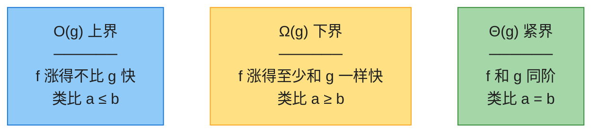
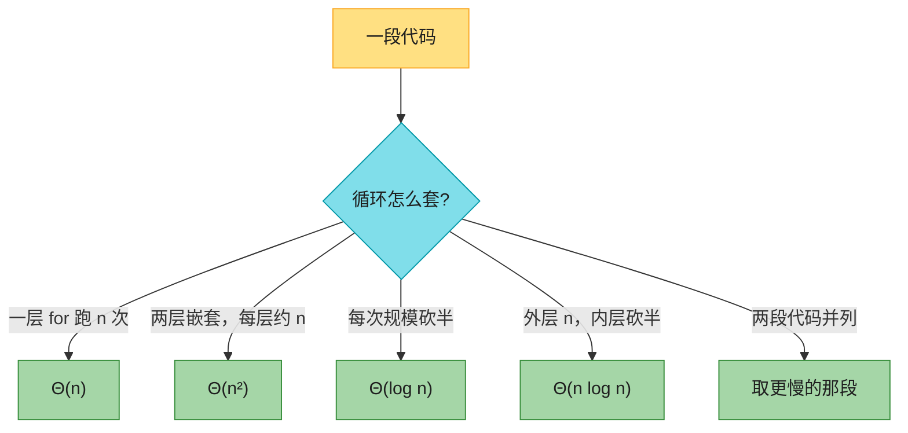
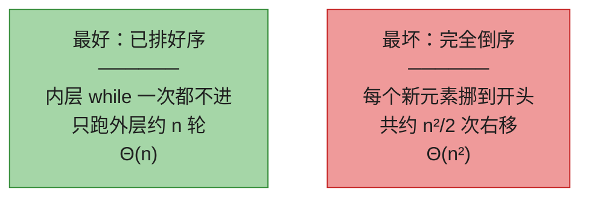
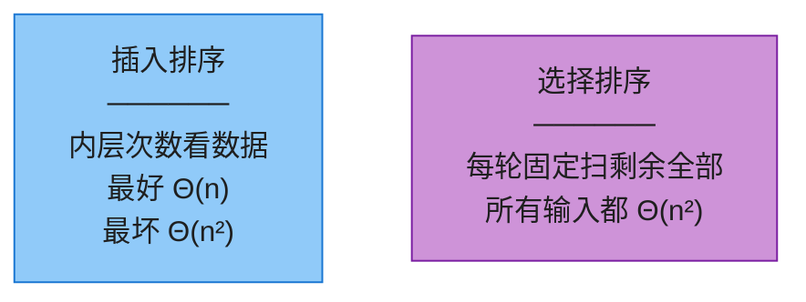
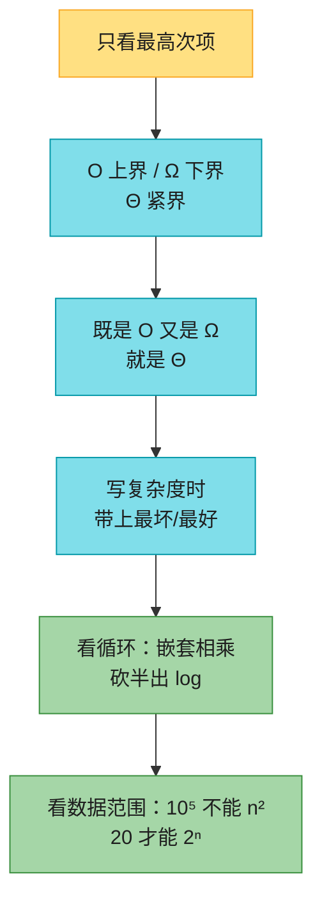

# 第三章：函数的增长（Characterizing Running Times）

> **本章定位**：第 2 章把插入排序的运行时间算成带 8 个常数的二次多项式——又繁琐又和机器有关。本章只干一件事：**丢掉常数和低阶项，用 O / Ω / Θ 三个符号说清楚「n 变大时时间怎么涨」**。
>
> 后面每一章的复杂度声明都用这套语言：第 4 章的递归式、第 6 章的堆排序、面试里「n = 10⁵ 能不能过」，全部靠它。
>
> **本章没有新算法。** 读完你应该能：看到循环写出复杂度、看到数据范围选对算法、不把 O 和 Θ 搞混。
>
> 📌 数学克制版：不找常数 c、不写集合定义、不推公式。记号当「比较快慢的口语」用。
>
> 📌 **对数约定**（全书统一）：`lg n` = log₂ n（二分对数）。O 记号里底数差常数倍，写成 `O(lg n)` 或 `O(log n)` 都行。

---

## 一、核心思想：只看最高次项

`3n² + 100n + 5` 和 `n²` 涨得一样快——n 足够大时，平方项会把后面全部压住。三种记号就是三种「留白」方式：



| 记号 | 一句话 | 对 `7n³ + 100n² − 20n + 6` |
|------|--------|---------------------------|
| **O** | 不比它快（上界，可以松） | 是 `O(n³)`，也是 `O(n⁴)`、`O(n⁵)`……越松越「没错但没用」 |
| **Ω** | 至少这么快（下界，可以松） | 是 `Ω(n³)`，也是 `Ω(n²)`、`Ω(n)` |
| **Θ** | 恰好同阶（又是上界又是下界） | **只有** `Θ(n³)`，不是 `Θ(n⁴)` |

> 🔑 **既是 O 又是 Ω，就是 Θ。** 证紧界的标准打法：上界、下界分开攻，最后合成。

**「渐近」是什么意思？** 只关心 n 足够大以后谁赢，前面那段有限的行为一律不管。

`100n` 和 `n²` 比：n = 10 时线性反而更小（1000 vs 100）；n = 200 时平方已经翻倍领先（40000 vs 20000）。交叉点之后，平方永远领先——这就是「n 趋于无穷时，只看最高次项」。

---

## 二、做题时怎么估复杂度

这是本章最有用的一节：看到代码 / 数据范围，直接写出量级。

### 2.1 看循环结构



口诀：**嵌套相乘、并列取慢、砍半出 log、只留最高项。**

| 代码形态 | 复杂度 | 典型题 |
|---------|--------|--------|
| `for i in 1..n` | `Θ(n)` | 扫一遍、LC 1 哈希版 |
| 两层 `for` 嵌套，每层 n | `Θ(n²)` | 暴力两数之和、插入排序最坏 |
| 三层嵌套 | `Θ(n³)` | 暴力三数之和 |
| `while (l < r)` 每次砍半 | `Θ(log n)` | LC 704 二分查找 |
| 外层 n，内层每次砍半 | `Θ(n log n)` | 归并 / 堆排序 |
| 递归拆成两半再合并 | `Θ(n log n)` | 归并排序（第 4 章） |
| 枚举所有子集 / 排列 | `Θ(2ⁿ)` / `Θ(n!)` | 子集、全排列 |

> 内层循环次数不固定时（插入排序的 while），按**最坏**估：每轮最多 n，共 n 轮 → `O(n²)`。

### 2.2 看到数据范围，复杂度上限就定了

LeetCode 时限大约 1 秒 ≈ 10⁸ 次简单运算。**先看 n，再选题解：**

| n 的上限 | 能过的复杂度 | 过不了的 |
|---------|-------------|---------|
| n ≤ 20 | `O(n!)`、`O(2ⁿ · n)` | — |
| n ≤ 400 | `O(n³)` | `O(2ⁿ)` |
| n ≤ 5000 | `O(n²)` | `O(n³)` |
| n ≤ 10⁶ | `O(n log n)`、`O(n)` | `O(n²)` |
| n ≤ 10⁸ | 只能 `O(n)` 或 `O(n log n)` 卡常数 | 双重循环 |

> 面试官说「数组长度 10⁵」，你还写双重循环，基本直接挂。这张表比任何定理都实用。

### 2.3 常见算法对照（建立肌肉记忆）

| 复杂度 | 算法 | LeetCode |
|--------|------|----------|
| `O(1)` | 哈希表查一次 | [1 两数之和](https://leetcode.cn/problems/two-sum/)（哈希版） |
| `O(log n)` | 二分查找 | [704 二分查找](https://leetcode.cn/problems/binary-search/) |
| `O(n)` | 线性扫描、双指针 | [283 移动零](https://leetcode.cn/problems/move-zeroes/) |
| `O(n log n)` | 归并 / 堆排 / 快排平均 | [912 排序数组](https://leetcode.cn/problems/sort-an-array/) |
| `O(n²)` | 插入 / 冒泡 / 选择；双层枚举 | [15 三数之和](https://leetcode.cn/problems/3sum/)（排序 + 双指针） |
| `O(2ⁿ)` | 子集枚举、朴素递归斐波那契 | [78 子集](https://leetcode.cn/problems/subsets/)、[509 斐波那契](https://leetcode.cn/problems/fibonacci-number/)（朴素递归） |
| `O(n!)` | 全排列 | [46 全排列](https://leetcode.cn/problems/permutations/) |

---

## 三、插入排序：不用求和也能得出最坏 Θ(n²)

第 2 章靠展开求和式得到最坏 `Θ(n²)`。这里换一种**只看循环**的说法（第四版 3.1 节的示范）。

### 3.1 上界：任何输入都是 O(n²)

外层 for 固定跑 n−1 轮。第 i 轮内层 while 最多跑 i−1 ≤ n 次，每次常数时间。总次数 < n²，所以**所有输入**都是 `O(n²)`。

### 3.2 下界：倒序输入是 Ω(n²)

倒序数组里，每个新元素都比左边所有数小，必须一路挪到最前面。n = 5 时（下表跟第 2 章一样，**1-indexed**）：

| 轮次 | A[1] | A[2] | A[3] | A[4] | A[5] | 本轮右移次数 |
|------|------|------|------|------|------|-------------|
| 初始 | 5 | 4 | 3 | 2 | 1 | |
| i=2，key=4 | **4** | **5** | 3 | 2 | 1 | 1 |
| i=3，key=3 | **3** | **4** | **5** | 2 | 1 | 2 |
| i=4，key=2 | **2** | **3** | **4** | **5** | 1 | 3 |
| i=5，key=1 | **1** | **2** | **3** | **4** | **5** | 4 |

右移总次数 = 1+2+3+4 = 10 = 5×4/2。一般地，倒序时右移 `n(n−1)/2` 次，所以最坏至少是 `Ω(n²)`。



### 3.3 合成 + 怎么说才不算错

所有输入 `O(n²)` + 最坏 `Ω(n²)` ⇒ **最坏情况是 `Θ(n²)`**。最好情况（已排序）是 `Θ(n)`。

| 说法 | 对不对 | 原因 |
|------|-------|------|
| 插入排序**最坏** `Θ(n²)` | ✅ 最精确 | 上界 + 下界都是 n² |
| 插入排序**最好** `Θ(n)` | ✅ | 内层不迭代 |
| 「插入排序的运行时间是 `Θ(n²)`」 | ❌ 夸大 | 没写「最坏」= 声称所有输入都 n²，但最好只有 `Θ(n)` |
| 「插入排序的运行时间是 `O(n²)`」 | ✅ | 上界允许某些情况更快 |
| 归并排序：直接说「运行时间 `Θ(n lg n)`」 | ✅ | 它**所有情况**都是 `Θ(n lg n)`，不用加限定词 |

> ⚠️ **别把 O 当紧界。** 「O(n log n) 的算法比 O(n²) 的快」推不出来——那个「O(n²)」实际可能是 `Θ(n)`。要表达「就是这个量级」，请用 Θ。
>
> 另外，界要写**最简单**的：`3n² + 20n` 就写 `Θ(n²)`，别写 `O(n³)`（太松）或 `Θ(3n²+20n)`（噪音）。

---

## 四、o 和 ω：知道「一定不紧」就够了

O 给的界**可能紧也可能松**：`2n² = O(n²)` 紧，`2n = O(n²)` 松。小写 **o** 专门表示「一定松的上界」：

| | 大写（可能紧） | 小写（一定不紧） |
|--|----------------|-----------------|
| 上界 | `n = O(n)`，`n = O(n²)` 都对 | `n = o(n²)` 对；`n = o(n)` **不对** |
| 下界 | `n² = Ω(n)`，`n² = Ω(n²)` 都对 | `n² = ω(n)` 对；`n² = ω(n²)` **不对** |

直觉：`f = o(g)` 就是 f 相对 g 变得**微不足道**（n / n² → 0）。

> 做题几乎只用 **O 和 Θ**。o / ω 在论文里用来强调「这个界一定松」，面试不会考定义。

---

## 五、谁涨得更快

### 5.1 增长阶梯（从慢到快）

`1` < `lg* n` < `lg n` < `√n` < `n` < `n lg n` < `n²` < `n³` < `2ⁿ` < `n!` < `nⁿ`

三组必须记住的碾压关系：

| 慢的 | 快的 | 一句话 |
|------|------|--------|
| 任何对数的任何次方 | 任何正次数多项式 | `(lg n)¹⁰⁰` 最终跑不过 `√n` |
| 任何多项式 | 任何底 > 1 的指数 | `n¹⁰⁰⁰` 最终跑不过 `2ⁿ` |
| 指数 | 阶乘 | `2ⁿ` 最终跑不过 `n!` |

数值感受（lg 以 2 为底）：

| n | lg n | n lg n | n² | 2ⁿ |
|---|------|--------|-----|-----|
| 10 | 3.3 | 33 | 100 | 1024 |
| 20 | 4.3 | 86 | 400 | 约 100 万 |
| 30 | 4.9 | 147 | 900 | 约 10 亿（已经爆炸） |
| 1000 | 10 | 约 1 万 | 100 万 | 写不下 |

n = 30 时 `2ⁿ` 已经约 10 亿次运算，这就是「n ≤ 20 才能爆搜」的来源。

### 5.2 几个做题会碰到的结论（只记结果）

- **不同底的 log 只差常数**，所以 `O(log₂ n) = O(ln n)`，统一写 `O(lg n)`。
- **`lg(n!) = Θ(n lg n)`**：比较排序的下界（第 8 章）用这一条。直觉：n! 大约是 n 个「接近 n 的数」相乘，取 log 就是 n 个 lg n 相加。
- **斐波那契 `F_n = Θ(φⁿ)`**，φ ≈ 1.618。所以朴素递归斐波那契是指数级（LC 509 要用 DP 降到 `O(n)`）。
- **`lg* n`（迭代对数）**：对 n 连续取 lg，取几次才 ≤ 1。实际输入永远 ≤ 5（对 2⁶⁵⁵³⁶ 才是 5）。第 19 章并查集的分析里会见到，当常数看就行。

---

## 六、代码实现

索引约定：伪代码 1-indexed；下面 Java / Python 一律 **0-indexed**。

这段代码做两件事：

1. **插入排序数右移次数**——验证「已排序 = 0 次、倒序 = n(n−1)/2 次」；
2. **打印增长表**——亲手看一眼 n = 10 / 20 / 30 时各项差多少。

### Java

```java
import java.util.Arrays;
import java.util.Random;

public class GrowthOfFunctions {

    /** 插入排序，返回右移次数（内层 while 的迭代次数）。 */
    static int insertionSortShifts(int[] a) {
        int shifts = 0;
        for (int i = 1; i < a.length; i++) {
            int key = a[i];
            int j = i - 1;
            while (j >= 0 && a[j] > key) {
                a[j + 1] = a[j];
                j--;
                shifts++;
            }
            a[j + 1] = key;
        }
        return shifts;
    }

    /** 两层嵌套循环的实际执行次数：正好 n²。 */
    static long nestedCount(int n) {
        long c = 0;
        for (int i = 0; i < n; i++)
            for (int j = 0; j < n; j++)
                c++;
        return c;
    }

    public static void main(String[] args) {
        for (int n = 1; n <= 50; n++) {
            int[] sorted = new int[n];
            int[] rev = new int[n];
            for (int i = 0; i < n; i++) {
                sorted[i] = i;
                rev[i] = n - 1 - i;
            }
            int shSorted = insertionSortShifts(sorted.clone());
            int shRev = insertionSortShifts(rev.clone());
            if (shSorted != 0)
                throw new AssertionError("sorted shifts");
            if (shRev != n * (n - 1) / 2)
                throw new AssertionError("reverse shifts n=" + n);
            if (nestedCount(n) != (long) n * n)
                throw new AssertionError("nested");
        }

        Random rng = new Random(0);
        for (int t = 0; t < 200; t++) {
            int n = rng.nextInt(80);
            int[] a = new int[n];
            for (int i = 0; i < n; i++) a[i] = rng.nextInt(2001) - 1000;
            int[] expect = a.clone();
            Arrays.sort(expect);
            insertionSortShifts(a);
            if (!Arrays.equals(a, expect))
                throw new AssertionError("sort mismatch");
        }

        System.out.println("shifts sorted n=10: " + insertionSortShifts(new int[]{0,1,2,3,4,5,6,7,8,9}));
        System.out.println("shifts reverse n=10: " + insertionSortShifts(new int[]{9,8,7,6,5,4,3,2,1,0}));
        System.out.println("nested n=10: " + nestedCount(10));

        System.out.println("n\tlg n\tn lg n\tn^2\t2^n");
        for (int n : new int[]{10, 20, 30}) {
            double lg = Math.log(n) / Math.log(2);
            String exp = n <= 20 ? String.format("%.0f", Math.pow(2, n)) : "too big";
            System.out.printf("%d\t%.1f\t%.0f\t%d\t%s%n", n, lg, n * lg, n * n, exp);
        }
        System.out.println("all checks passed");
    }
}
```

### Python

```python
import math
import random


def insertion_sort_shifts(a):
    """插入排序，返回 (排好的数组, 右移次数)。"""
    a = list(a)
    shifts = 0
    for i in range(1, len(a)):
        key = a[i]
        j = i - 1
        while j >= 0 and a[j] > key:
            a[j + 1] = a[j]
            j -= 1
            shifts += 1
        a[j + 1] = key
    return a, shifts


def nested_count(n):
    """两层嵌套循环的实际执行次数：正好 n²。"""
    c = 0
    for _ in range(n):
        for _ in range(n):
            c += 1
    return c


if __name__ == "__main__":
    for n in range(1, 51):
        _, sh_sorted = insertion_sort_shifts(range(n))
        _, sh_rev = insertion_sort_shifts(range(n - 1, -1, -1))
        assert sh_sorted == 0
        assert sh_rev == n * (n - 1) // 2
        assert nested_count(n) == n * n

    rng = random.Random(0)
    for _ in range(200):
        a = [rng.randint(-1000, 1000) for _ in range(rng.randint(0, 80))]
        got, _ = insertion_sort_shifts(a)
        assert got == sorted(a)

    print("shifts sorted n=10:", insertion_sort_shifts(range(10))[1])
    print("shifts reverse n=10:", insertion_sort_shifts(range(9, -1, -1))[1])
    print("nested n=10:", nested_count(10))

    print("n\tlg n\tn lg n\tn^2\t2^n")
    for n in (10, 20, 30):
        lg = math.log2(n)
        exp = f"{2 ** n:.0f}" if n <= 20 else "too big"
        print(f"{n}\t{lg:.1f}\t{n * lg:.0f}\t{n * n}\t{exp}")
    print("all checks passed")
```

跑完应看到：已排序右移 0 次，倒序右移 45 次（= 10×9/2），双重循环恰好 100 次。

---

## 七、复杂度速查 + 易混点

| 想说的意思 | 该用的记号 | 别写成 |
|-----------|-----------|--------|
| 不会比 g 更慢（上界） | `O(g)` | 把 O 当「就是这个量级」 |
| 不会比 g 更快（下界） | `Ω(g)` | 「至少是 O(n²)」——这句话**无意义**（O 已经是上界，「≥ 某个上界」什么都没说） |
| 就是 g 这个量级 | `Θ(g)` | `O(g)`（可能松） |
| 最好 / 最坏不同 | 写明「最坏 Θ(n²)、最好 Θ(n)」 | 省略「最坏」直接说 Θ |
| `2^{n+1}` vs `2ⁿ` | `2^{n+1} = Θ(2ⁿ)`（差常数 2） | 以为指数上 +1 就不是同阶 |
| `2^{2n}` vs `2ⁿ` | **不是** `O(2ⁿ)`（比值是 `2ⁿ`，无界） | 指数上的**倍数**才致命 |
| 选择排序 | **任何输入**都 `Θ(n²)`（每轮固定扫完剩余） | 以为它也有最好 `Θ(n)` |

选择排序和插入排序的对比（第 2 章习题，用本章语言收尾）：



---

## 八、LeetCode 题单 + 习题快问快答

### 8.1 本章题单（练「复杂度直觉」，不是练渐近证明）

| 题号 | 题目 | 难度 | 考点 |
|------|------|------|------|
| 1 | 两数之和 | 简单 | 暴力 `O(n²)` vs 哈希 `O(n)`——n 一大就必须换 |
| 15 | 三数之和 | 中等 | 暴力 `O(n³)` 过不了；排序 + 双指针 `O(n²)` |
| 704 | 二分查找 | 简单 | 每次砍半 → `O(log n)` |
| 912 | 排序数组 | 中等 | `O(n log n)` 是比较排序的标准答案 |
| 215 | 数组中的第 K 个最大元素 | 中等 | 全排序 `O(n log n)` vs 堆 `O(n log k)` |
| 50 | Pow(x, n) | 中等 | 朴素 `O(n)` 会超时；快速幂 `O(log n)` |
| 509 | 斐波那契数 | 简单 | 朴素递归 `Θ(φⁿ)` 爆炸；DP `O(n)` |
| 78 | 子集 | 中等 | 答案有 `2ⁿ` 个，复杂度下限就是指数 |
| 46 | 全排列 | 中等 | 答案有 `n!` 个，n=10 已经 300 万 |

### 8.2 习题快问快答（第四版题号，只留做题用得上的）

| 习题 | 要点 |
|------|------|
| 3.1-2 | 选择排序**任何输入**都 `Θ(n²)`：每轮固定扫完剩余元素，没有好坏情况之分 |
| 3.2-2 | 「运行时间**至少**是 `O(n²)`」**无意义**：O 是上界，「≥ 某个上界」等于什么都没说 |
| 3.2-3 | `2^{n+1} = O(2ⁿ)`？**是**（只差常数 2）。`2^{2n} = O(2ⁿ)`？**否**（指数上乘 2 等于整体多乘 `2ⁿ`） |
| 3.2-5 | 所有情况都是 `Θ(g)` ⇔ 最坏 `O(g)` 且最好 `Ω(g)` |
| 3.3-4 | `lg(n!) = Θ(n lg n)`；`n!` 比 `2ⁿ` 快、比 `nⁿ` 慢 |

---

## 九、要点回顾



**一句话记忆**：

- O / Ω / Θ 类比 ≤ / ≥ / =；要说「就是这个量级」用 Θ，别滥用 O。
- 插入排序：最坏 `Θ(n²)`、最好 `Θ(n)`；没写「最坏」就别说 `Θ(n²)`。
- 估复杂度：嵌套相乘、并列取慢、砍半出 log。
- 三组碾压：对数 ≺ 多项式 ≺ 指数 ≺ 阶乘。看到 n，先查 2.2 的表。

---

*本章笔记按「应用导向」准则编写，CLRS 第四版第 3 章仅作参考。*
