# 第四章：分治策略

## 一、分治策略概述

### 1.1 什么是分治策略

**分治策略** 是一种经典的算法设计范式，其核心思想是：将原问题**分解**为若干个规模较小的**子问题**，**递归**地解决这些子问题，最后将子问题的解**合并**为原问题的解。

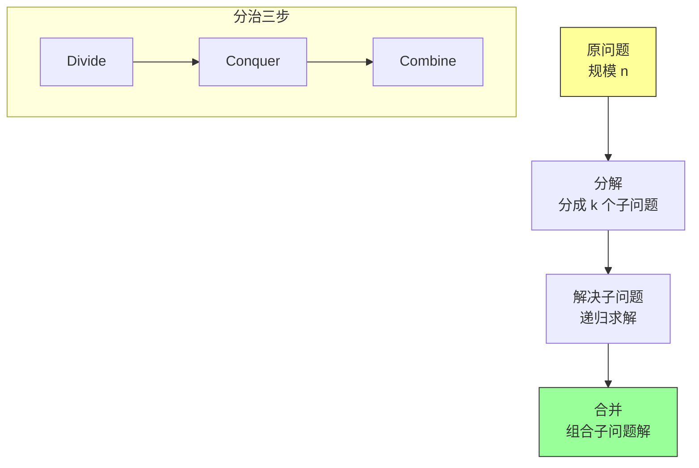

### 1.2 分治策略的通用框架

```java
/**
 * 分治策略通用框架
 */
public class DivideAndConquer {

    /**
     * 分治主方法
     *
     * @param problem 待解决的问题实例
     * @return 问题的解
     */
    public static Result solve(Problem problem) {
        // 基准情况：问题足够小，直接求解
        if (problem.size() <= BASE_SIZE) {
            return solveSmallProblem(problem);
        }

        // 第一步：分解 - 将问题分成若干子问题
        Problem[] subProblems = divide(problem);

        // 第二步：递归解决每个子问题
        Result[] subResults = new Result[subProblems.length];
        for (int i = 0; i < subProblems.length; i++) {
            subResults[i] = solve(subProblems[i]);
        }

        // 第三步：合并 - 将子问题的解组合成原问题的解
        return combine(subResults);
    }

    private static Problem[] divide(Problem problem) {
        // 子类实现具体的分解逻辑
        return null;
    }

    private static Result solveSmallProblem(Problem problem) {
        // 子类实现基准情况的求解
        return null;
    }

    private static Result combine(Result[] results) {
        // 子类实现合并逻辑
        return null;
    }
}
```

### 1.3 分治策略的适用条件

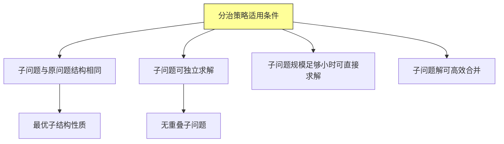

**三个关键特征**：
1. **最优子结构**：原问题的最优解包含子问题的最优解
2. **无重叠子问题**（与动态规划区分）：子问题相互独立
3. **可合并性**：子问题的解可以组合成原问题的解

---

## 二、分治策略分析

### 2.1 递归式表示

分治算法的时间复杂度通常用**递归式**表示：

$$T(n) = \begin{cases} \Theta(1) & \text{若 } n \leq c \\ aT(n/b) + D(n) + C(n) & \text{否则} \end{cases}$$

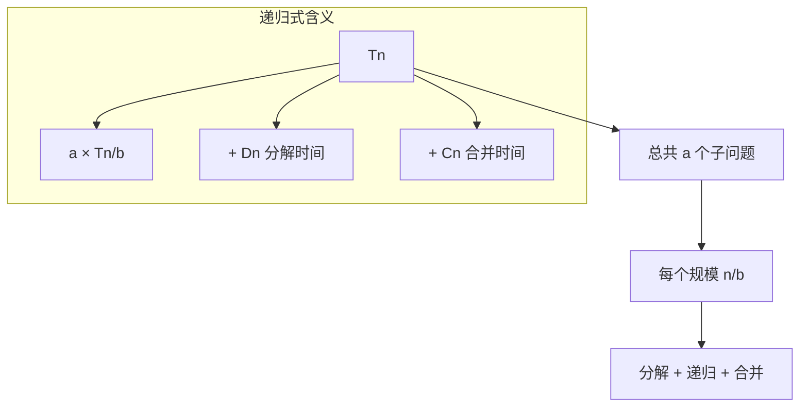

### 2.2 递归树分析方法

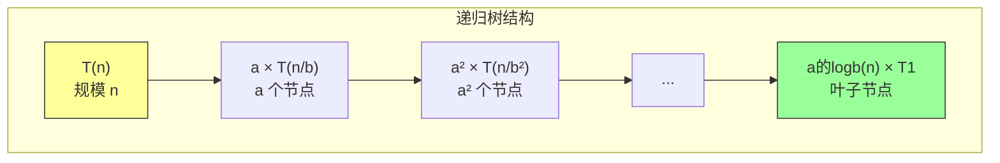

**递归树的三层**：

| 层级 | 节点数 | 单个节点工作量 | 总工作量 |
|-----|-------|-------------|---------|
| 根 | 1 | $D(n) + C(n)$ | $D(n) + C(n)$ |
| 第1层 | a | $D(n/b) + C(n/b)$ | $a \cdot [D(n/b) + C(n/b)]$ |
| 第2层 | a² | $D(n/b²) + C(n/b²)$ | $a² \cdot [D(n/b²) + C(n/b²)] |
| ... | ... | ... | ... |
| 叶子 | $a^{\log_b n} = n^{\log_b a}$ | $\Theta(1)$ | $\Theta(n^{\log_b a})$ |

### 2.3 主定理回顾

```mermaid
flowchart TD
    A["主定理：Tn = aTn/b + fn"] --> B{"fn 与 n的logb(a)比较?"}

    B -->|fn 更小<br/>fn = On的logb(a)-ε| C["情况1<br/>T = Θn的logb(a)"]
    B -->|fn 相同<br/>fn = Θn的logb(a)"| D["情况2<br/>T = Θn的logb(a)logn"]
    B -->|fn 更大<br/>fn = Ωn的logb(a)+ε"| E["情况3<br/>T = Θfn"]

    C --> F["如：a=9, b=3<br/>fn = n的1.5次方"]
    D --> G["如：a=2, b=2<br/>fn = n"]
    E --> H["如：a=1, b=2<br/>fn = n²"]

    style A fill:#ff9,stroke:#333
    style C fill:#9ff,stroke:#333
    style D fill:#9ff,stroke:#333
    style E fill:#9ff,stroke:#333
```

---

## 三、归并排序深入分析

### 3.1 归并排序完整实现

```java
import java.util.Arrays;

/**
 * 归并排序实现
 */
public class MergeSort {

    /**
     * 归并排序主方法
     *
     * @param arr 待排序数组
     * @param left 左边界（包含）
     * @param right 右边界（包含）
     */
    public static void mergeSort(int[] arr, int left, int right) {
        // 基准情况：只有一个元素或空数组
        if (left >= right) {
            return;
        }

        // 第一步：分解 - 计算中点
        int mid = left + (right - left) / 2;

        // 第二步：递归解决子问题
        mergeSort(arr, left, mid);       // 排序左半部分
        mergeSort(arr, mid + 1, right);  // 排序右半部分

        // 第三步：合并两个有序子数组
        merge(arr, left, mid, right);
    }

    /**
     * 合并两个有序子数组 arr[left..mid] 和 arr[mid+1..right]
     */
    private static void merge(int[] arr, int left, int mid, int right) {
        // 创建临时数组
        int[] leftArray = Arrays.copyOfRange(arr, left, mid + 1);
        int[] rightArray = Arrays.copyOfRange(arr, mid + 1, right + 1);

        // 合并过程
        int i = 0, j = 0, k = left;
        while (i < leftArray.length && j < rightArray.length) {
            if (leftArray[i] <= rightArray[j]) {
                arr[k++] = leftArray[i++];
            } else {
                arr[k++] = rightArray[j++];
            }
        }

        // 处理剩余元素
        while (i < leftArray.length) {
            arr[k++] = leftArray[i++];
        }
        while (j < rightArray.length) {
            arr[k++] = rightArray[j++];
        }
    }

    /**
     * 归并排序复杂度分析版
     */
    public static class WithAnalysis {

        private static int mergeCount = 0;
        private static int compareCount = 0;

        public static void mergeSort(int[] arr, int left, int right) {
            if (left >= right) return;

            int mid = left + (right - left) / 2;
            mergeSort(arr, left, mid);
            mergeSort(arr, mid + 1, right);
            mergeWithAnalysis(arr, left, mid, right);
        }

        private static void mergeWithAnalysis(int[] arr, int left, int mid, int right) {
            mergeCount++;
            int[] leftArray = Arrays.copyOfRange(arr, left, mid + 1);
            int[] rightArray = Arrays.copyOfRange(arr, mid + 1, right + 1);

            int i = 0, j = 0, k = left;
            while (i < leftArray.length && j < rightArray.length) {
                compareCount++;
                if (leftArray[i] <= rightArray[j]) {
                    arr[k++] = leftArray[i++];
                } else {
                    arr[k++] = rightArray[j++];
                }
            }
            while (i < leftArray.length) arr[k++] = leftArray[i++];
            while (j < rightArray.length) arr[k++] = rightArray[j++];
        }

        public static void printAnalysis(int n) {
            System.out.println("归并排序分析 (n = " + n + ")");
            System.out.println("合并次数: " + mergeCount + " = log₂" + n + " ≈ " + Math.log(n) / Math.log(2));
            System.out.println("总比较次数: " + compareCount);
        }
    }

    public static void main(String[] args) {
        int[] arr = {38, 27, 43, 3, 9, 82, 10};
        System.out.println("排序前: " + Arrays.toString(arr));

        mergeSort(arr, 0, arr.length - 1);
        System.out.println("排序后: " + Arrays.toString(arr));
    }
}
```

### 3.2 递归树详细分析

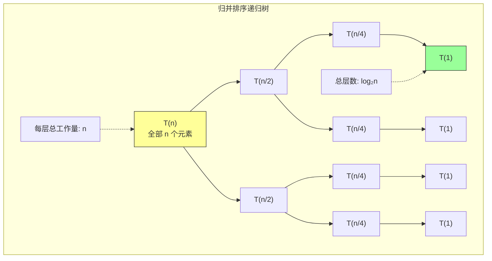

**递归式推导**：
```
Tn = 2Tn/2 + Θn          （合并两个 n/2 的子问题，需要 Θn 时间）

a = 2, b = 2, fn = Θn
n的logb(a) = n的log2(2) = n的1次方 = n

fn = Θn = Θn的logb(a)     → 主定理情况2
Tn = Θnlogn
```

---

## 四、二分查找及其变体

### 4.1 标准二分查找

```java
/**
 * 二分查找实现
 */
public class BinarySearch {

    /**
     * 标准二分查找
     * 在有序数组中查找目标值
     *
     * @param arr 有序数组
     * @param target 目标值
     * @return 目标值索引，若不存在返回 -1
     */
    public static int search(int[] arr, int target) {
        int left = 0;
        int right = arr.length - 1;

        while (left <= right) {
            // 防止溢出
            int mid = left + (right - left) / 2;

            if (arr[mid] == target) {
                return mid;  // 找到
            } else if (arr[mid] < target) {
                left = mid + 1;  // 在右半部分查找
            } else {
                right = mid - 1;  // 在左半部分查找
            }
        }

        return -1;  // 未找到
    }

    /**
     * 递归版二分查找
     */
    public static int searchRecursive(int[] arr, int target, int left, int right) {
        if (left > right) {
            return -1;  // 基准情况：未找到
        }

        int mid = left + (right - left) / 2;

        if (arr[mid] == target) {
            return mid;
        } else if (arr[mid] < target) {
            return searchRecursive(arr, target, mid + 1, right);
        } else {
            return searchRecursive(arr, target, left, mid - 1);
        }
    }
}
```

### 4.2 二分查找变体

```java
/**
 * 二分查找变体集合
 */
public class BinarySearchVariants {

    /**
     * 变体1：查找第一个等于目标值的位置
     */
    public static int findFirstEqual(int[] arr, int target) {
        int left = 0, right = arr.length - 1;
        int result = -1;

        while (left <= right) {
            int mid = left + (right - left) / 2;

            if (arr[mid] >= target) {
                if (arr[mid] == target) {
                    result = mid;  // 记录可能的结果
                }
                right = mid - 1;  // 继续向左查找
            } else {
                left = mid + 1;
            }
        }

        return result;
    }

    /**
     * 变体2：查找最后一个等于目标值的位置
     */
    public static int findLastEqual(int[] arr, int target) {
        int left = 0, right = arr.length - 1;
        int result = -1;

        while (left <= right) {
            int mid = left + (right - left) / 2;

            if (arr[mid] <= target) {
                if (arr[mid] == target) {
                    result = mid;
                }
                left = mid + 1;  // 继续向右查找
            } else {
                right = mid - 1;
            }
        }

        return result;
    }

    /**
     * 变体3：查找第一个大于等于目标值的位置
     */
    public static int findFirstGreaterOrEqual(int[] arr, int target) {
        int left = 0, right = arr.length - 1;

        while (left <= right) {
            int mid = left + (right - left) / 2;

            if (arr[mid] >= target) {
                if (mid == 0 || arr[mid - 1] < target) {
                    return mid;
                }
                right = mid - 1;
            } else {
                left = mid + 1;
            }
        }

        return arr.length;  // 所有元素都小于 target
    }

    /**
     * 变体4：查找最后一个小于等于目标值的位置
     */
    public static int findLastLessOrEqual(int[] arr, int target) {
        int left = 0, right = arr.length - 1;

        while (left <= right) {
            int mid = left + (right - left) / 2;

            if (arr[mid] <= target) {
                if (mid == arr.length - 1 || arr[mid + 1] > target) {
                    return mid;
                }
                left = mid + 1;
            } else {
                right = mid - 1;
            }
        }

        return -1;  // 所有元素都大于 target
    }

    /**
     * 变体5：在旋转数组中查找
     */
    public static int searchInRotated(int[] arr, int target) {
        int left = 0, right = arr.length - 1;

        while (left <= right) {
            int mid = left + (right - left) / 2;

            if (arr[mid] == target) {
                return mid;
            }

            // 判断哪一半是有序的
            if (arr[left] <= arr[mid]) {  // 左半部分有序
                if (arr[left] <= target && target < arr[mid]) {
                    right = mid - 1;
                } else {
                    left = mid + 1;
                }
            } else {  // 右半部分有序
                if (arr[mid] < target && target <= arr[right]) {
                    left = mid + 1;
                } else {
                    right = mid - 1;
                }
            }
        }

        return -1;
    }
}
```

### 4.3 二分查找流程图

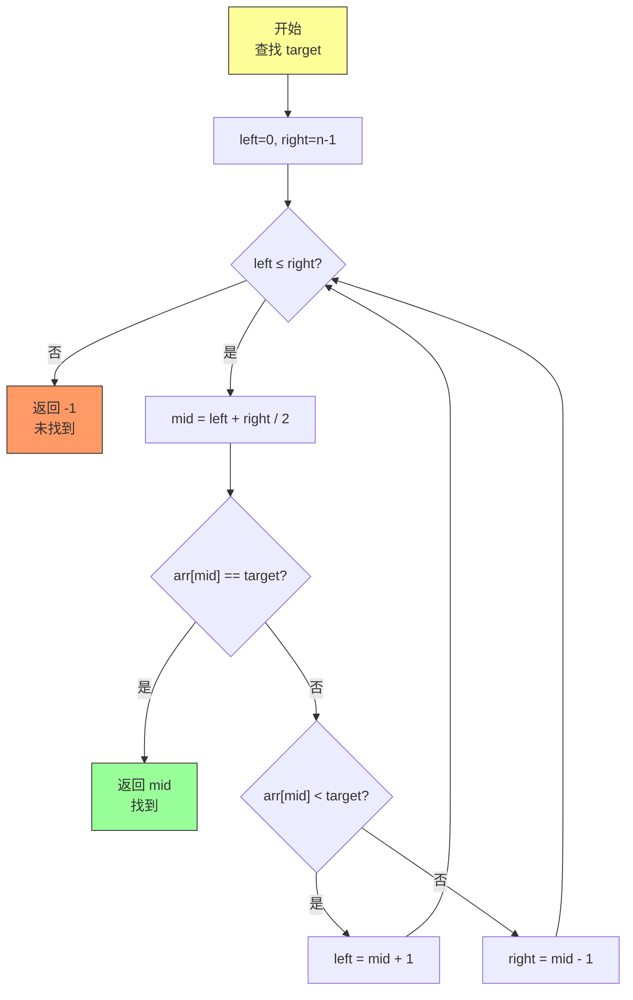

---

## 五、Strassen 矩阵乘法

### 5.1 标准矩阵乘法

```java
/**
 * 矩阵乘法
 */
public class MatrixMultiplication {

    /**
     * 标准矩阵乘法
     * 时间复杂度：O(n³)
     *
     * @param A m×n 矩阵
     * @param B n×p 矩阵
     * @return m×p 矩阵
     */
    public static int[][] multiplyStandard(int[][] A, int[][] B) {
        int m = A.length;       // 行数
        int n = A[0].length;    // A 的列数
        int p = B[0].length;    // B 的列数

        int[][] C = new int[m][p];

        for (int i = 0; i < m; i++) {
            for (int j = 0; j < p; j++) {
                C[i][j] = 0;
                for (int k = 0; k < n; k++) {
                    C[i][j] += A[i][k] * B[k][j];
                }
            }
        }

        return C;
    }
}
```

### 5.2 Strassen 算法原理

**核心思想**：通过巧妙的矩阵分块和代数变换，将8次乘法减少到7次。

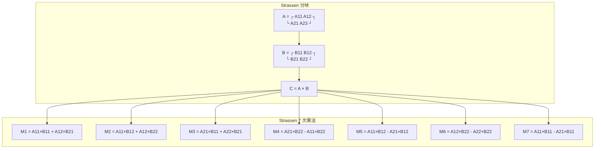

### 5.3 Strassen 算法实现

```java
/**
 * Strassen 矩阵乘法
 * 时间复杂度：O(n的log2(7)次方) ≈ O(n的2.81次方)
 */
public class StrassenMultiplication {

    /**
     * Strassen 矩阵乘法
     */
    public static double[][] multiply(double[][] A, double[][] B) {
        int n = A.length;

        // 基准情况：足够小时使用标准乘法
        if (n <= 64) {
            return multiplyStandard(A, B);
        }

        // 确保 n 是 2 的幂
        int size = 1;
        while (size < n) size *= 2;

        // 填充到 2 的幂次方大小
        double[][] A_pad = padMatrix(A, size);
        double[][] B_pad = padMatrix(B, size);

        // 递归计算
        double[][] C_pad = strassen(A_pad, B_pad, size);

        // 截取原始大小
        return extractMatrix(C_pad, n);
    }

    private static double[][] strassen(double[][] A, double[][] B, int n) {
        if (n == 1) {
            double[][] C = new double[1][1];
            C[0][0] = A[0][0] * B[0][0];
            return C;
        }

        int half = n / 2;

        // 分割矩阵
        double[][] A11 = getQuadrant(A, 0, 0, half);
        double[][] A12 = getQuadrant(A, 0, half, half);
        double[][] A21 = getQuadrant(A, half, 0, half);
        double[][] A22 = getQuadrant(A, half, half, half);

        double[][] B11 = getQuadrant(B, 0, 0, half);
        double[][] B12 = getQuadrant(B, 0, half, half);
        double[][] B21 = getQuadrant(B, half, 0, half);
        double[][] B22 = getQuadrant(B, half, half, half);

        // 计算 7 个 M 值
        double[][] M1 = strassen(add(A11, A22), add(B11, B22), half);
        double[][] M2 = strassen(add(A12, A22), B11, half);
        double[][] M3 = strassen(A11, sub(B12, B22), half);
        double[][] M4 = strassen(A22, sub(B21, B11), half);
        double[][] M5 = strassen(add(A11, A12), B22, half);
        double[][] M6 = strassen(sub(A21, A11), add(B11, B12), half);
        double[][] M7 = strassen(sub(A12, A22), add(B21, B22), half);

        // 计算 C 的四个块
        double[][] C11 = sub(add(add(M1, M4), M7), M5);
        double[][] C12 = add(M3, M5);
        double[][] C21 = add(M2, M4);
        double[][] C22 = sub(add(add(M1, M3), M6), M2);

        // 合并结果
        return combine(C11, C12, C21, C22, half);
    }

    // 辅助方法：矩阵加法
    private static double[][] add(double[][] A, double[][] B) {
        int n = A.length;
        double[][] C = new double[n][n];
        for (int i = 0; i < n; i++) {
            for (int j = 0; j < n; j++) {
                C[i][j] = A[i][j] + B[i][j];
            }
        }
        return C;
    }

    // 辅助方法：矩阵减法
    private static double[][] sub(double[][] A, double[][] B) {
        int n = A.length;
        double[][] C = new double[n][n];
        for (int i = 0; i < n; i++) {
            for (int j = 0; j < n; j++) {
                C[i][j] = A[i][j] - B[i][j];
            }
        }
        return C;
    }

    // 其他辅助方法省略...
    private static double[][] multiplyStandard(double[][] A, double[][] B) {
        // 标准乘法实现
        return null;  // 省略
    }

    private static double[][] padMatrix(double[][] A, int size) { return null; }
    private static double[][] extractMatrix(double[][] A, int n) { return null; }
    private static double[][] getQuadrant(double[][] A, int row, int col, int size) { return null; }
    private static double[][] combine(double[][] A, double[][] B, double[][] C, double[][] D, int size) { return null; }
}
```

### 5.4 算法复杂度对比

| 算法 | 时间复杂度 | 乘法次数 | 加法次数 |
|-----|-----------|---------|---------|
| 标准算法 | $O(n^3)$ | $n^3$ | $n^3(n-1)$ |
| Strassen | $O(n^{\log_2 7}) \approx O(n^{2.81})$ | $7n^{2.81}$ | $18n^{2.81}$ |

```mermaid
graph LR
    subgraph 复杂度对比
    A["标准算法"] -->|"O n³"| B["Strassen"]
    A -->|"| C["n 较大时优势明显"]
    end

    subgraph n=1024
    D["标准: 10⁹ 次乘法"]
    E["Strassen: 10⁸ 次乘法"]
    end
```

---

## 六、快速幂算法

### 6.1 问题描述

**问题**：计算 $a^n$，其中 $n$ 是非负整数。

**朴素算法**：$O(n)$ 次乘法
**优化算法**：$O(\log n)$ 次乘法

### 6.2 快速幂实现

```java
/**
 * 快速幂算法
 */
public class FastExponentiation {

    /**
     * 递归版快速幂
     * 时间复杂度：O(log n)
     *
     * @param a 底数
     * @param n 指数
     * @return a^n
     */
    public static double power(double a, long n) {
        // 基准情况
        if (n == 0) {
            return 1;
        }
        if (n == 1) {
            return a;
        }

        // 递归计算 a^(n/2)
        double halfPower = power(a, n / 2);

        // 如果 n 是偶数：a^n = (a^(n/2))²
        // 如果 n 是奇数：a^n = (a^(n/2))² × a
        if (n % 2 == 0) {
            return halfPower * halfPower;
        } else {
            return halfPower * halfPower * a;
        }
    }

    /**
     * 迭代版快速幂
     * 使用二进制分解
     */
    public static double powerIterative(double a, long n) {
        double result = 1;
        double base = a;
        long exponent = n;

        while (exponent > 0) {
            // 如果当前位是 1，乘入结果
            if (exponent % 2 == 1) {
                result *= base;
            }
            // base 平方，exponent 右移
            base *= base;
            exponent /= 2;
        }

        return result;
    }

    /**
     * 矩阵快速幂
     */
    public static int[][] matrixPower(int[][] base, long exponent) {
        int n = base.length;
        int[][] result = identityMatrix(n);

        while (exponent > 0) {
            if (exponent % 2 == 1) {
                result = multiply(result, base);
            }
            base = multiply(base, base);
            exponent /= 2;
        }

        return result;
    }

    private static int[][] multiply(int[][] A, int[][] B) {
        // 矩阵乘法
        return null;  // 省略
    }

    private static int[][] identityMatrix(int n) {
        int[][] I = new int[n][n];
        for (int i = 0; i < n; i++) {
            I[i][i] = 1;
        }
        return I;
    }
}
```

### 6.3 快速幂流程图

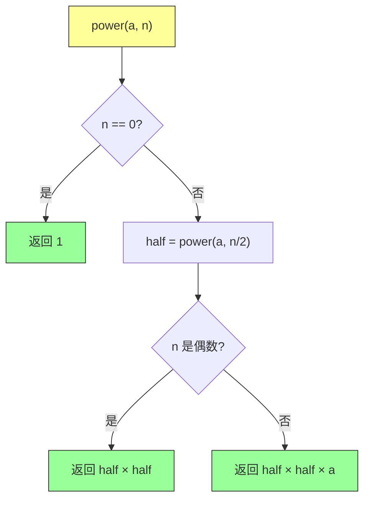

**递归式**：$T(n) = T(n/2) + \Theta(1) = O(\log n)$

---

## 七、计算斐波那契数

### 7.1 斐波那契数列

$$F_n = \begin{cases} 0 & \text{if } n = 0 \\ 1 & \text{if } n = 1 \\ F_{n-1} + F_{n-2} & \text{if } n \geq 2 \end{cases}$$

### 7.2 朴素递归的问题

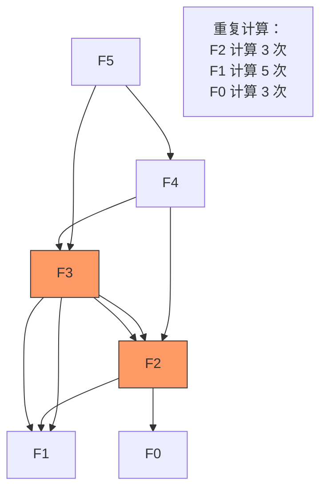

**朴素递归复杂度**：$T(n) = T(n-1) + T(n-2) = O(\phi^n)$，其中 $\phi \approx 1.618$

### 7.3 分治优化：矩阵快速幂法

```java
/**
 * 斐波那契数列计算
 */
public class Fibonacci {

    /**
     * 方法1：朴素递归
     * 时间复杂度：O(2^n)
     */
    public static long fibRecursive(long n) {
        if (n <= 1) {
            return n;
        }
        return fibRecursive(n - 1) + fibRecursive(n - 2);
    }

    /**
     * 方法2：动态规划（自底向上）
     * 时间复杂度：O(n)
     */
    public static long fibDP(long n) {
        if (n <= 1) {
            return n;
        }

        long prev2 = 0;  // F0
        long prev1 = 1;  // F1
        long current = 0;

        for (int i = 2; i <= n; i++) {
            current = prev1 + prev2;
            prev2 = prev1;
            prev1 = current;
        }

        return current;
    }

    /**
     * 方法3：分治 + 矩阵快速幂
     * 时间复杂度：O(log n)
     *
     * 核心：| F(n+1)  F(n)   |   = | 1 1 |^n
     *       | F(n)    F(n-1)|     | 1 0 |
     */
    public static long fibMatrix(long n) {
        if (n <= 1) {
            return n;
        }

        // 计算矩阵的 n 次方
        long[][] result = {{1, 0}, {0, 1}};  // 单位矩阵
        long[][] base = {{1, 1}, {1, 0}};
        long exponent = n - 1;

        while (exponent > 0) {
            if (exponent % 2 == 1) {
                result = multiply(result, base);
            }
            base = multiply(base, base);
            exponent /= 2;
        }

        // result = | F(n+1)  F(n)   |
        //          | F(n)    F(n-1) |
        return result[0][1];
    }

    private static long[][] multiply(long[][] A, long[][] B) {
        long[][] C = new long[2][2];
        C[0][0] = A[0][0] * B[0][0] + A[0][1] * B[1][0];
        C[0][1] = A[0][0] * B[0][1] + A[0][1] * B[1][1];
        C[1][0] = A[1][0] * B[0][0] + A[1][1] * B[1][0];
        C[1][1] = A[1][0] * B[0][1] + A[1][1] * B[1][1];
        return C;
    }
}
```

### 7.4 斐波那契计算方法对比

| 方法 | 时间复杂度 | 空间复杂度 | 说明 |
|-----|-----------|-----------|------|
| 朴素递归 | $O(2^n)$ | $O(n)$ | 大量重复计算 |
| 迭代 DP | $O(n)$ | $O(1)$ | 最佳实用解 |
| 矩阵快速幂 | $O(\log n)$ | $O(1)$ | 理论最优 |

---

## 八、最近点对问题

### 8.1 问题描述

**问题**：在平面上的 $n$ 个点中，找到距离最近的两个点。

**暴力解法**：检查所有 $\binom{n}{2}$ 对点，$O(n^2)$

**分治解法**：$O(n \log n)$

### 8.2 分治策略

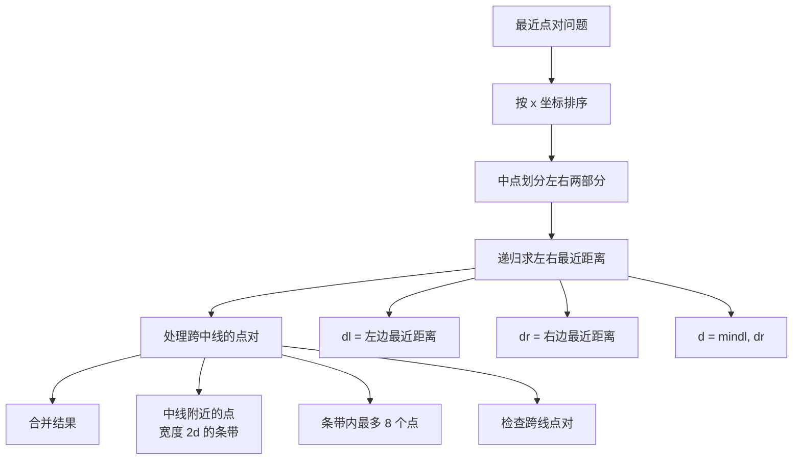

### 8.3 算法实现

```java
import java.util.*;

/**
 * 最近点对问题分治解法
 */
public class ClosestPair {

    static class Point {
        double x, y;

        Point(double x, double y) {
            this.x = x;
            this.y = y;
        }
    }

    /**
     * 主方法：找到最近点对的距离
     */
    public static double closestPair(List<Point> points) {
        // 按 x 坐标排序
        points.sort(Comparator.comparingDouble(p -> p.x));

        return closestPair(points, 0, points.size() - 1);
    }

    private static double closestPair(List<Point> points, int left, int right) {
        // 基准情况：只有 2-3 个点
        if (right - left <= 3) {
            return bruteForce(points, left, right);
        }

        // 划分
        int mid = (left + right) / 2;
        double midX = points.get(mid).x;

        // 递归求解左右两边
        double dl = closestPair(points, left, mid);
        double dr = closestPair(points, mid + 1, right);
        double d = Math.min(dl, dr);

        // 合并：处理跨越中线的点对
        return Math.min(d, stripClosest(points, midX, d, left, right));
    }

    /**
     * 处理中线附近的点
     */
    private static double stripClosest(List<Point> points, double midX,
                                        double d, int left, int right) {
        // 提取中线附近宽度为 2d 的点
        List<Point> strip = new ArrayList<>();
        for (int i = left; i <= right; i++) {
            if (Math.abs(points.get(i).x - midX) < d) {
                strip.add(points.get(i));
            }
        }

        // 按 y 坐标排序
        strip.sort(Comparator.comparingDouble(p -> p.y));

        // 检查相邻点（最多检查 7 个）
        double minDist = d;
        for (int i = 0; i < strip.size(); i++) {
            for (int j = i + 1; j < strip.size() &&
                    strip.get(j).y - strip.get(i).y < minDist; j++) {
                double dist = distance(strip.get(i), strip.get(j));
                if (dist < minDist) {
                    minDist = dist;
                }
            }
        }

        return minDist;
    }

    /**
     * 暴力求解小规模问题
     */
    private static double bruteForce(List<Point> points, int left, int right) {
        double min = Double.MAX_VALUE;
        for (int i = left; i <= right; i++) {
            for (int j = i + 1; j <= right; j++) {
                double dist = distance(points.get(i), points.get(j));
                if (dist < min) {
                    min = dist;
                }
            }
        }
        return min;
    }

    private static double distance(Point a, Point b) {
        double dx = a.x - b.x;
        double dy = a.y - b.y;
        return Math.sqrt(dx * dx + dy * dy);
    }
}
```

---

## 九、总结与要点

### 9.1 核心概念回顾

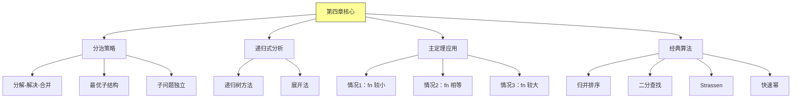

### 9.2 递归式速查表

| 递归式 | 解 | 例子 |
|-------|-----|------|
| $T(n) = 2T(n/2) + \Theta(n)$ | $\Theta(n \log n)$ | 归并排序 |
| $T(n) = 2T(n/2) + \Theta(1)$ | $\Theta(n)$ | 二分查找 |
| $T(n) = T(n-1) + \Theta(1)$ | $\Theta(n)$ | 线性遍历 |
| $T(n) = 2T(n/2) + \Theta(n^2)$ | $\Theta(n^2)$ | Strassen |
| $T(n) = T(n/2) + \Theta(1)$ | $\Theta(\log n)$ | 快速幂 |

### 9.3 分治 vs 动态规划

| 特性 | 分治 | 动态规划 |
|-----|------|---------|
| 子问题 | 独立 | 可能重叠 |
| 重复计算 | 无 | 有（需记忆） |
| 典型应用 | 归并、快速幂 | 斐波那契、背包 |
| 复杂度 | $O(n \log n)$ | 可优化至 $O(n)$ |

---

## 课后思考

### 思考题 1
使用主定理分析 Strassen 算法的时间复杂度。

### 思考题 2
证明：使用矩阵快速幂计算斐波那契数的时间复杂度为 $O(\log n)$。

### 思考题 3
在最近点对问题中，为什么 strip 中每个点只需要检查最多 7 个相邻点？

### 思考题 4
设计一个使用分治策略的算法，在 $O(n \log n)$ 时间内找到数组中的第 $k$ 小元素。

---

*本章精读笔记完成*
