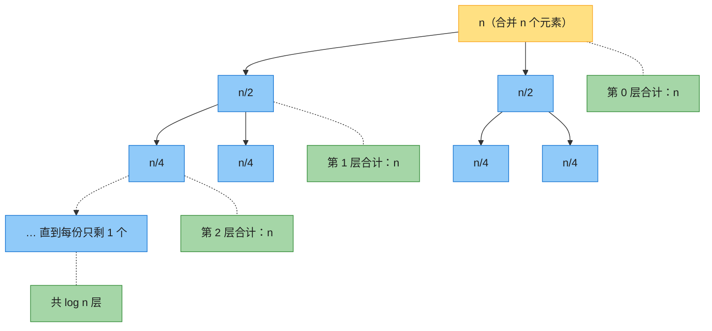
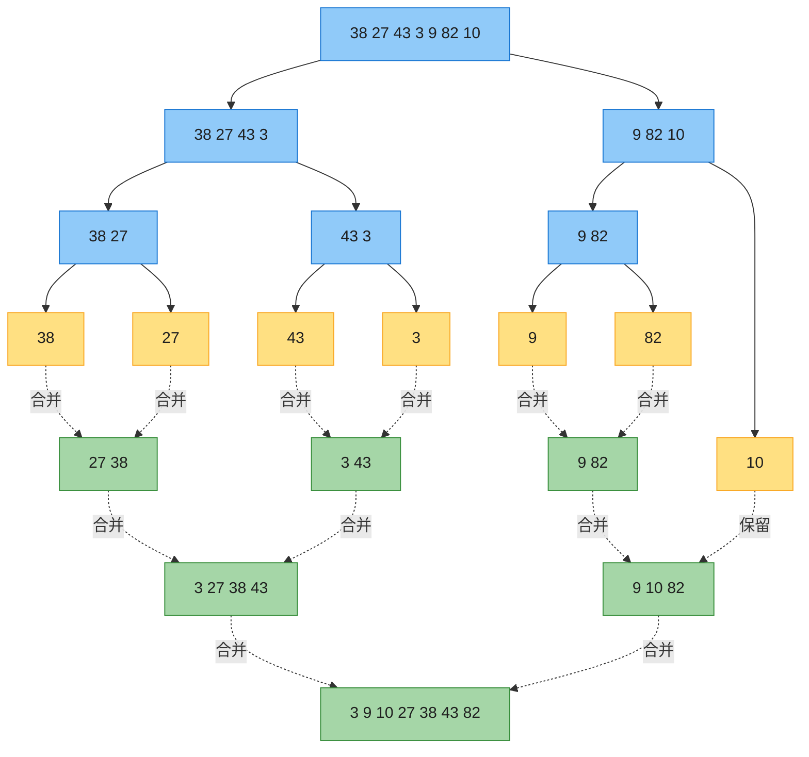
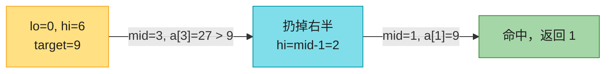
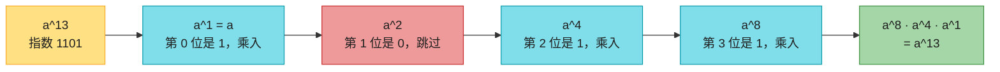
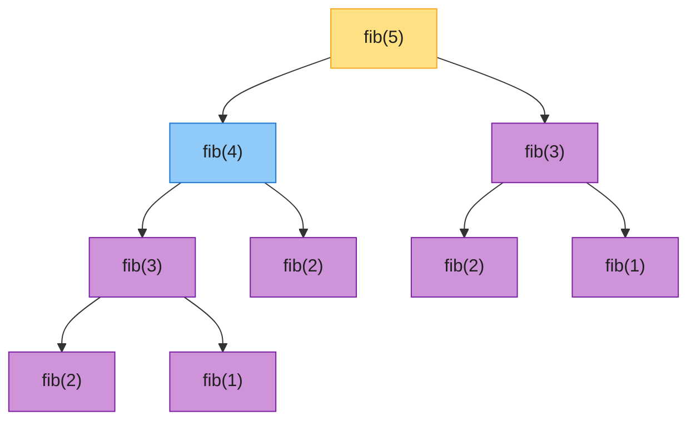
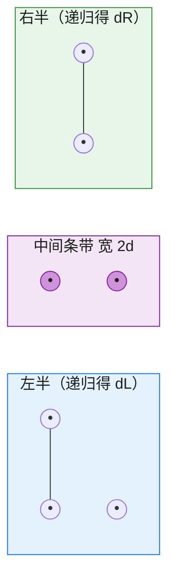

# 第四章：分治策略

> **本章定位**：分治是算法设计的第一大范式——**归并排序、快速排序、二分查找全是它**。本章讲四件事：分治怎么想、复杂度怎么估（只记结论，不推公式）、五个必会应用（归并排序 / 二分查找 / 快速幂 / 斐波那契 / 最近点对）、配套 LeetCode 题单。
>
> 📌 数学克制版：本章只用 `T(n)`、`Θ`、`log` 三个符号。递归式全部以「式子 → 结论」速查表给出，推导过程用递归树**画图直观看**，不做归纳证明。

---

## 一、分治是什么

### 1.1 三步走

遇到大问题，**递归**地拆小：


**什么时候能用分治**（三个条件同时满足）：
1. 子问题和原问题**结构相同**（只是规模变小）；
2. 子问题之间**互相独立**（各算各的，不共享中间结果——否则该用动态规划，见第五节）；
3. 子问题的答案**能合并**出原问题的答案。

### 1.2 复杂度怎么估：递归式（只记结论）

分治算法的耗时写成**递归式**：`T(n) = a·T(n/b) + f(n)`
- `a` = 拆成几个子问题；`n/b` = 每个子问题的规模；`f(n)` = 分解 + 合并本身的代价。

**不用解方程，画递归树一眼看**：以归并排序 `T(n) = 2T(n/2) + n` 为例——



**每层加起来都是 n，共 log n 层 → 总代价 n·log n**。这就是 Θ(n log n) 的全部直觉。

### 1.3 主定理速查表（背这三行就够）

> 对 `T(n) = a·T(n/b) + f(n)`，比较「每层代价」随层数的变化：

| 每层代价 | 规律 | 总复杂度 | 例子 |
|---------|------|---------|------|
| **逐层几何增长** | 叶子（最底层）占大头 | $\Theta(n^{\log_b a})$ | 8 分矩阵乘法 $8T(n/2)+1 \to \Theta(n^3)$ |
| **每层都一样** | 单层 × 层数 | $\Theta(n^{\log_b a}\cdot\log n)$ | 归并 $2T(n/2)+n \to \Theta(n\log n)$ |
| **逐层几何缩小** | 根（第一层）占大头 | $\Theta(f(n))$ | $2T(n/2)+n^2 \to \Theta(n^2)$ |

速查口诀：**「谁贵听谁的」**——叶子贵 → 看叶子数；每层平摊 → 乘层数；根贵 → 就是 f(n)。

### 1.4 常见递归式速查

| 递归式 | 复杂度 | 对应算法 |
|--------|--------|---------|
| $T(n)=2T(n/2)+\Theta(n)$ | $\Theta(n\log n)$ | 归并排序 |
| $T(n)=T(n/2)+\Theta(1)$ | $\Theta(\log n)$ | 二分查找 |
| $T(n)=2T(n/2)+\Theta(1)$ | $\Theta(n)$ | 求数组最大值（分治版） |
| $T(n)=T(n/2)+\Theta(n)$ | $\Theta(n)$ | 几何级数 $n+n/2+\ldots$ |
| $T(n)=2T(n-1)+\Theta(1)$ | $\Theta(2^n)$ | 汉诺塔（指数爆炸） |
| $T(n)=T(n-1)+\Theta(n)$ | $\Theta(n^2)$ | 快排最坏情况（第 7 章） |
| $T(n)=T(n/3)+T(2n/3)+\Theta(n)$ | $\Theta(n\log n)$ | 不平衡划分（如快排平均） |

---

## 二、归并排序：分治的标准模板

> LeetCode：[912 排序数组](https://leetcode.cn/problems/sort-an-array/)（中等）、[148 排序链表](https://leetcode.cn/problems/sort-list/)（中等）、[23 合并 K 个升序链表](https://leetcode.cn/problems/merge-k-sorted-lists/)（困难）、[剑指 Offer 51 逆序对](https://leetcode.cn/problems/shu-zu-zhong-de-ni-xu-dui-lcof/)（困难）

### 2.1 直觉

**拆到只有一个元素（天然有序），再两两合并成有序数组**。分解 trivial，功夫全在合并（merge）上。

### 2.2 分解与合并示意图

以 `[38, 27, 43, 3, 9, 82, 10]` 为例：



**合并两个有序数组**（merge）用双指针，各扫一遍，$\Theta(n)$。一次 `[3, 27, 38, 43]` 和 `[9, 10, 82]` 的合并 trace：

| 步骤 | 比较 | 取出 | 结果数组 |
|------|------|------|---------|
| 1 | 3 vs 9 | **3** | 3 |
| 2 | 27 vs 9 | **9** | 3 9 |
| 3 | 27 vs 10 | **10** | 3 9 10 |
| 4 | 27 vs 82 | **27** | 3 9 10 27 |
| 5 | 38 vs 82 | **38** | 3 9 10 27 38 |
| 6 | 43 vs 82 | **43** | 3 9 10 27 38 43 |
| 7 | 右半剩 82 | **82** | 3 9 10 27 38 43 82 |

### 2.3 代码（0-indexed）

**Java**：

```java
import java.util.Arrays;

public class MergeSort {
    public static void mergeSort(int[] arr, int left, int right) {
        if (left >= right) return;                    // 只剩一个元素，天然有序
        int mid = left + (right - left) / 2;          // Divide
        mergeSort(arr, left, mid);                    // Conquer 左半
        mergeSort(arr, mid + 1, right);               // Conquer 右半
        merge(arr, left, mid, right);                 // Combine
    }

    private static void merge(int[] arr, int left, int mid, int right) {
        int[] tmp = new int[right - left + 1];        // 临时数组
        int i = left, j = mid + 1, k = 0;
        while (i <= mid && j <= right)                // 双指针取较小者
            tmp[k++] = arr[i] <= arr[j] ? arr[i++] : arr[j++];
        while (i <= mid) tmp[k++] = arr[i++];         // 左半剩余
        while (j <= right) tmp[k++] = arr[j++];       // 右半剩余
        System.arraycopy(tmp, 0, arr, left, tmp.length);
    }

    public static void main(String[] args) {
        int[] arr = {38, 27, 43, 3, 9, 82, 10};
        mergeSort(arr, 0, arr.length - 1);
        System.out.println(Arrays.toString(arr));     // [3, 9, 10, 27, 38, 43, 82]
    }
}
```

**Python**：

```python
def merge_sort(arr):
    if len(arr) <= 1:
        return arr
    mid = len(arr) // 2
    left, right = merge_sort(arr[:mid]), merge_sort(arr[mid:])
    return merge(left, right)

def merge(left, right):
    res, i, j = [], 0, 0
    while i < len(left) and j < len(right):
        if left[i] <= right[j]:
            res.append(left[i]); i += 1
        else:
            res.append(right[j]); j += 1
    return res + left[i:] + right[j:]

if __name__ == "__main__":
    print(merge_sort([38, 27, 43, 3, 9, 82, 10]))  # [3, 9, 10, 27, 38, 43, 82]
```

### 2.4 复杂度与考点

- 时间 $\Theta(n\log n)$（**最好最坏都一样**）；空间 $\Theta(n)$（临时数组）；**稳定**排序（`<=` 时取左半，相等元素相对顺序不变）。
- **逆序对计数**（剑指 51 / LC 493）：合并时，若右半元素先被取出，则左半剩余元素都和它构成逆序对，累加 `mid - i + 1` 即可——一行改动，分治的招牌应用。

---

## 三、二分查找与变体：每次扔掉一半

> LeetCode：[704 二分查找](https://leetcode.cn/problems/binary-search/)（简单）、[34 查找首尾位置](https://leetcode.cn/problems/find-first-and-last-position-of-element-in-sorted-array/)（中等）、[35 搜索插入位置](https://leetcode.cn/problems/search-insert-position/)（简单）、[33 搜索旋转排序数组](https://leetcode.cn/problems/search-in-rotated-sorted-array/)（中等）、[153 寻找旋转排序数组最小值](https://leetcode.cn/problems/find-minimum-in-rotated-sorted-array/)（中等）、[875 爱吃香蕉的珂珂](https://leetcode.cn/problems/koko-eating-bananas/)（二分答案，中等）

### 3.1 直觉

有序数组里查 target：和中间比一比，**不相等就扔掉不可能的一半**。每次规模减半：`T(n) = T(n/2) + Θ(1) → Θ(log n)`。



### 3.2 标准二分 + 两个必会变体

**Java**：

```java
public class BinarySearch {

    /** 标准版：找到返回下标，找不到返回 -1（LC 704） */
    public static int search(int[] a, int target) {
        int lo = 0, hi = a.length - 1;
        while (lo <= hi) {
            int mid = lo + (hi - lo) / 2;             // 防溢出写法
            if (a[mid] == target) return mid;
            else if (a[mid] < target) lo = mid + 1;   // 扔掉左半
            else hi = mid - 1;                        // 扔掉右半
        }
        return -1;
    }

    /** 左边界版：第一个 >= target 的下标（LC 34/35 的核心） */
    public static int lowerBound(int[] a, int target) {
        int lo = 0, hi = a.length;                    // 注意：开区间写法
        while (lo < hi) {
            int mid = lo + (hi - lo) / 2;
            if (a[mid] >= target) hi = mid;           // mid 可能是答案，保留
            else lo = mid + 1;
        }
        return lo;                                    // 全部小于 target 时返回 n
    }

    /** 旋转数组版：先判哪一半有序（LC 33） */
    public static int searchRotated(int[] a, int target) {
        int lo = 0, hi = a.length - 1;
        while (lo <= hi) {
            int mid = lo + (hi - lo) / 2;
            if (a[mid] == target) return mid;
            if (a[lo] <= a[mid]) {                    // 左半有序
                if (a[lo] <= target && target < a[mid]) hi = mid - 1;
                else lo = mid + 1;
            } else {                                  // 右半有序
                if (a[mid] < target && target <= a[hi]) lo = mid + 1;
                else hi = mid - 1;
            }
        }
        return -1;
    }

    public static void main(String[] args) {
        int[] a = {3, 9, 10, 27, 38, 43, 82};
        System.out.println(search(a, 9));                          // 1
        int[] dup = {5, 7, 7, 8, 8, 10};
        System.out.println(lowerBound(dup, 8));                    // 3（第一个 8）
        int[] rot = {4, 5, 6, 7, 0, 1, 2};
        System.out.println(searchRotated(rot, 0));                 // 4
    }
}
```

**Python**：

```python
def search(a, target):
    """标准版：找到返回下标，找不到返回 -1（LC 704）"""
    lo, hi = 0, len(a) - 1
    while lo <= hi:
        mid = (lo + hi) // 2
        if a[mid] == target: return mid
        elif a[mid] < target: lo = mid + 1
        else: hi = mid - 1
    return -1

def lower_bound(a, target):
    """左边界版：第一个 >= target 的下标（LC 34/35 的核心）"""
    lo, hi = 0, len(a)
    while lo < hi:
        mid = (lo + hi) // 2
        if a[mid] >= target: hi = mid
        else: lo = mid + 1
    return lo

def search_rotated(a, target):
    """旋转数组版：先判哪一半有序（LC 33）"""
    lo, hi = 0, len(a) - 1
    while lo <= hi:
        mid = (lo + hi) // 2
        if a[mid] == target: return mid
        if a[lo] <= a[mid]:
            if a[lo] <= target < a[mid]: hi = mid - 1
            else: lo = mid + 1
        else:
            if a[mid] < target <= a[hi]: lo = mid + 1
            else: hi = mid - 1
    return -1

if __name__ == "__main__":
    print(search([3, 9, 10, 27, 38, 43, 82], 9))   # 1
    print(lower_bound([5, 7, 7, 8, 8, 10], 8))     # 3
    print(search_rotated([4, 5, 6, 7, 0, 1, 2], 0)) # 4
```

### 3.3 易错点（面试必问）

- **区间定义要一致**：`while (lo <= hi)` 配闭区间、`hi = mid - 1`；`while (lo < hi)` 配左闭右开、`hi = mid`。混用必死循环。
- **mid 防溢出**：Java/C++ 写 `lo + (hi - lo) / 2`，别写 `(lo + hi) / 2`（Python 无所谓）。
- **「二分答案」思维**：875（吃香蕉）、1011（运货）这类题，答案单调可判定 → 对**答案**二分，把「求最小可行解」变成「判定可行否」。

---

## 四、快速幂：分治用在指数上

> LeetCode：[50 Pow(x, n)](https://leetcode.cn/problems/powx-n/)（中等）、[372 超级次方](https://leetcode.cn/problems/super-pow/)（中等）

### 4.1 直觉

算 $a^{13}$ 不用乘 13 次：$a^{13} = a^8 \cdot a^4 \cdot a^1$——把指数写成二进制 `1101`，**每一位对应一个平方项**：



每轮 base 自乘（`a → a² → a⁴ → a⁸`），指数右移一位，遇到 1 就乘进答案。乘法次数从 $O(n)$ 降到 $O(\log n)$。

### 4.2 代码

**Java**：

```java
public class FastPow {
    /** 迭代版快速幂（LC 50），处理负指数 */
    public static double pow(double x, long n) {
        if (n < 0) { x = 1 / x; n = -n; }             // 负指数翻转
        double result = 1, base = x;
        while (n > 0) {
            if (n % 2 == 1) result *= base;           // 当前位是 1 才乘入
            base *= base;                             // base 平方
            n /= 2;                                   // 指数右移
        }
        return result;
    }

    public static void main(String[] args) {
        System.out.println(pow(2, 13));               // 8192.0
        System.out.println(pow(2, -2));               // 0.25
    }
}
```

**Python**：

```python
def pow_(x, n):
    """迭代版快速幂（LC 50），处理负指数。"""
    if n < 0:
        x, n = 1 / x, -n
    result, base = 1.0, x
    while n > 0:
        if n & 1:
            result *= base
        base *= base
        n >>= 1
    return result

if __name__ == "__main__":
    print(pow_(2, 13))   # 8192.0
    print(pow_(2, -2))   # 0.25
```

> 💡 同一个「折半平方」思想套在矩阵上就是**矩阵快速幂**（见下节斐波那契）。

---

## 五、斐波那契：分治翻车的经典现场

> LeetCode：[509 斐波那契数](https://leetcode.cn/problems/fibonacci-number/)（简单）、[70 爬楼梯](https://leetcode.cn/problems/climbing-stairs/)（简单）

### 5.1 朴素递归为什么爆炸

`fib(n) = fib(n-1) + fib(n-2)` 直接递归，看它的调用树：



**紫色全是重复计算**：`fib(3)` 算 2 遍、`fib(2)` 算 3 遍……$n$ 稍大就指数爆炸 $O(2^n)$。

> 🔑 **分治要求子问题独立**，这里 fib(4) 和 fib(3) 大量重叠——**子问题重叠 = 动态规划的信号**（第 14 章）。分治翻车，DP 接盘。

### 5.2 三种写法对比

```python
# ① 朴素递归：O(2^n)，重复计算爆炸（反面教材）
def fib_naive(n):
    return n if n <= 1 else fib_naive(n - 1) + fib_naive(n - 2)

# ② 迭代 DP：O(n) 时间 O(1) 空间，实用最优
def fib(n):
    a, b = 0, 1
    for _ in range(n):
        a, b = b, a + b
    return a

# ③ 矩阵快速幂：O(log n)，把 [F(n+1), F(n); F(n), F(n-1)] = [[1,1],[1,0]]^n
def fib_matrix(n):
    def mul(A, B):
        return [[A[0][0]*B[0][0] + A[0][1]*B[1][0], A[0][0]*B[0][1] + A[0][1]*B[1][1]],
                [A[1][0]*B[0][0] + A[1][1]*B[1][0], A[1][0]*B[0][1] + A[1][1]*B[1][1]]]
    result, base, e = [[1, 0], [0, 1]], [[1, 1], [1, 0]], n
    while e > 0:
        if e & 1:
            result = mul(result, base)
        base, e = mul(base, base), e >> 1
    return result[0][1]

if __name__ == "__main__":
    print([fib(i) for i in range(10)])         # [0, 1, 1, 2, 3, 5, 8, 13, 21, 34]
    print(fib_matrix(10))                      # 55
```

| 方法 | 时间 | 空间 | 说明 |
|------|------|------|------|
| 朴素递归 | $O(2^n)$ | $O(n)$ 栈 | 子问题重叠，分治翻车 |
| 迭代 DP | $O(n)$ | $O(1)$ | 实用首选 |
| 矩阵快速幂 | $O(\log n)$ | $O(1)$ | 理论最优，超大型 $n$ 用 |

---

## 六、最近点对：分治压轴题（选读）

**问题**：平面上 $n$ 个点，找距离最近的两个点。暴力 $O(n^2)$，分治 $O(n \log n)$。

### 6.1 思路（文字版）

1. 按 x 坐标排序，从中间竖着切成左右两半；
2. 递归求左半最近距离 $d_L$、右半 $d_R$，取 $d = \min(d_L, d_R)$；
3. **麻烦在跨界**：最近的两个点可能一个在左一个在右。但跨界点对必落在中间宽度 $2d$ 的**竖条带**里，只需在条带内继续找；
4. 条带内按 y 排序后，**每个点只需和后面 7 个点比**（直觉：条带左右两半各是 $d\times d$ 区域，里面两两距离都 $\ge d$，每半最多装 4 个点），所以合并只要 $\Theta(n)$。



每层合并 $\Theta(n)$、共 $\log n$ 层 → $T(n)=2T(n/2)+\Theta(n)=\Theta(n\log n)$。

### 6.2 代码骨架（Python）

```python
import math

def closest_pair(points):
    """points: [(x, y), ...]，返回最近点对距离。O(n log n)。"""
    px = sorted(points)                                  # 按 x 排序
    py = sorted(points, key=lambda p: p[1])              # 按 y 排序

    def rec(px, py):
        if len(px) <= 3:                                 # 小规模暴力
            return min((dist(px[i], px[j])
                        for i in range(len(px)) for j in range(i + 1, len(px))),
                       default=math.inf)
        mid = len(px) // 2
        midx = px[mid][0]
        left_x, right_x = px[:mid], px[mid:]
        left_ids = {id(p) for p in left_x}             # 按对象归属划分 y 数组
        left_y = [p for p in py if id(p) in left_ids]
        right_y = [p for p in py if id(p) not in left_ids]
        d = min(rec(left_x, left_y), rec(right_x, right_y))

        strip = [p for p in py if abs(p[0] - midx) < d]  # 条带（保持 y 序）
        for i in range(len(strip)):                      # 每点最多查后 7 个
            for j in range(i + 1, min(i + 8, len(strip))):
                d = min(d, dist(strip[i], strip[j]))
        return d

    def dist(a, b):
        return math.hypot(a[0] - b[0], a[1] - b[1])

    return rec(px, py)

if __name__ == "__main__":
    print(closest_pair([(0, 0), (3, 4), (1, 1), (10, 10)]))  # 1.4142135623730951
```

> 📌 此题面试罕见、竞赛经典；LeetCode 无直接对应题。记住结论即可：**分治 + 条带剪枝 = $O(n\log n)$**。

---

## 七、趣闻：Strassen 矩阵乘法

朴素矩阵乘法 $\Theta(n^3)$。把矩阵切 4 块直接分治要 8 次递归乘法 → 还是 $\Theta(n^3)$，白拆。1969 年 Strassen 用一堆加减法凑出一个代数恒等式，把递归乘法从 **8 次压到 7 次** → `T(n) = 7T(n/2) + Θ(n²)`，查速查表第一行：$\Theta(n^{\log_2 7}) \approx \Theta(n^{2.81})$。

**启示**：分治的收益不只在「拆」，还在「拆完后能不能用代数技巧少递归一次」。细节对做题无用，记住 $n^{2.81}$ 这个里程碑数字即可。

---

## 八、总结

### 8.1 分治 vs 动态规划 vs 减治

| | 分治 | 动态规划 | 减治（减而治之） |
|---|---|---|---|
| 子问题 | **互相独立** | **大量重叠** | 只留一个子问题 |
| 做法 | 全部递归求解再合并 | 记忆化 / 递推填表 | 每步扔掉一部分 |
| 典型 | 归并排序、最近点对 | 斐波那契、背包 | 二分查找、快速幂 |

### 8.2 本章 LeetCode 题单

| 题号 | 题目 | 考点 |
|------|------|------|
| 912 | 排序数组 | 归并模板 |
| 148 | 排序链表 | 归并 + 链表 |
| 23 | 合并 K 个升序链表 | 两两归并 |
| 剑指 51 / 493 | 逆序对 / 翻转对 | 归并计数 |
| 704 | 二分查找 | 标准模板 |
| 34 / 35 | 首尾位置 / 插入位置 | 左边界变体 |
| 33 / 153 | 旋转数组 | 判哪半有序 |
| 875 / 1011 | 吃香蕉 / 运货 | 二分答案 |
| 50 | Pow(x, n) | 快速幂 |
| 509 / 70 | 斐波那契 / 爬楼梯 | 分治翻车 → DP |

### 8.3 一句话回顾

- 分治 = 分解 → 递归 → 合并；**子问题必须独立**，重叠了就用 DP。
- 复杂度不用推：画递归树看每层，套三行速查表「谁贵听谁的」。
- 归并的功夫在 merge，二分的功夫在区间定义，快速幂的功夫在二进制拆解。

---

*本章笔记按「应用导向」准则编写，CLRS 第四版第 4 章仅作参考。*
