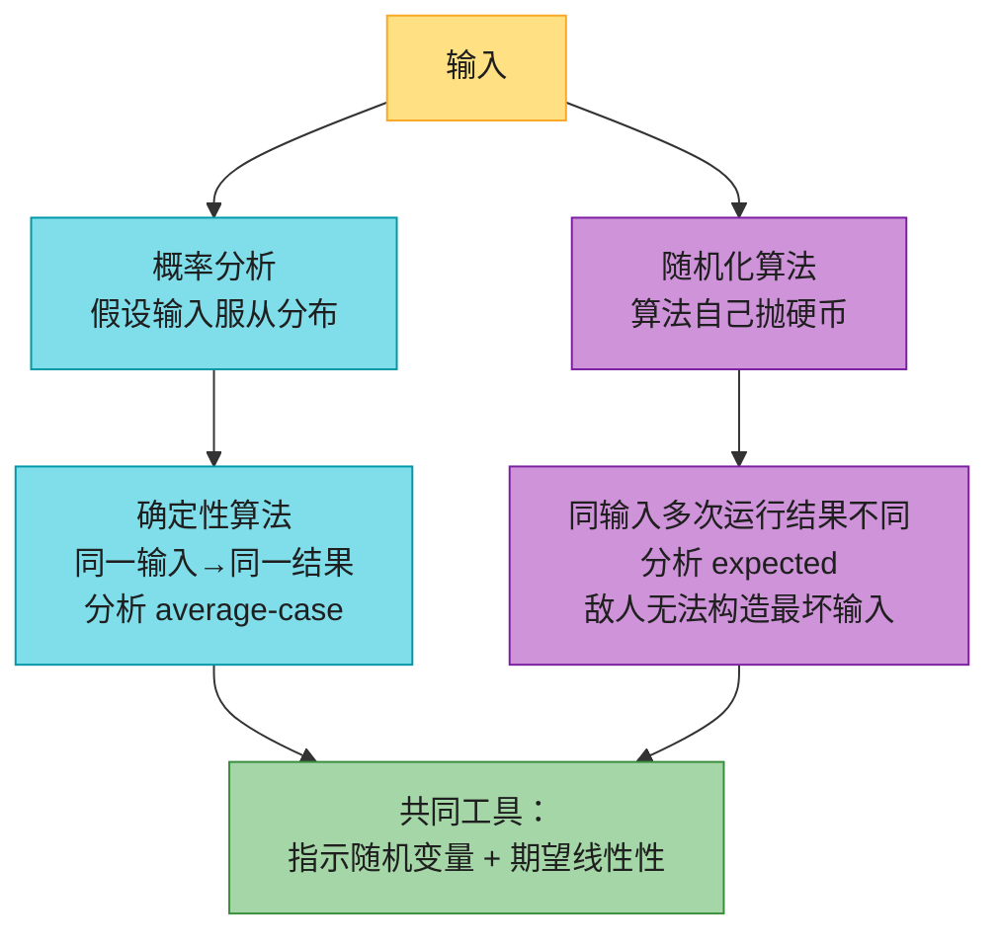

# 第五章：概率分析和随机算法

> **定位**：前面几章分析的都是「最坏情况」运行时间。本章引入两件新武器：
> 1. **概率分析**——当输入服从某种分布（如随机排列）时，算**平均情况**运行时间；
> 2. **随机化算法**——算法自己抛硬币做选择，对**任意输入**都给**期望**运行时间保证。
>
> 两者都靠**指示随机变量**这一工具把概率转成期望。本章用「雇佣问题」串起全篇，最后落到生日悖论、球与箱子、硬币序列、在线雇佣四个经典应用。
> **前后指针**：随机化快排（第 7 章）、随机化选择 quickselect（第 9 章）都是本章思想的应用；哈希表（第 11 章）的冲突分析与生日悖论同源。
>
> 对照第四版书页 128–155。

---

## 一、核心思想：概率分析 vs 随机化算法

这是本章最易混淆的一对概念，必须先分清：

| | 概率分析（probabilistic analysis） | 随机化算法（randomized algorithm） |
|---|---|---|
| 谁是随机的 | **输入**（假设输入服从某分布） | **算法本身**（自己抛硬币） |
| 分析对象 | average-case running time | expected running time |
| 同一输入多次运行 | 结果**相同**（算法确定性） | 结果**可能不同** |
| 坏输入 | 存在（敌人能构造） | **不存在**（随机化打乱输入相关性） |

> **直觉**：概率分析是「**假设**输入随机」，随机化算法是「**强制**输入随机」（自己先随机打乱）。后者更强——连敌人都无法构造最坏输入，因为随机置换让输入顺序失去意义。



**指示随机变量**是两者的通用工具：把「事件 A 是否发生」写成 0/1 变量 `I{A}`，则 `E[I{A}] = Pr{A}`（Lemma 5.1）。再用**期望的线性性**（`E[ΣX_i] = ΣE[X_i]`，**无需独立性**），就能把「计数」拆成一堆 0/1 变量求和——这是本章反复用的套路。

---

## 二、雇佣问题（§5.1）

### 2.1 问题与算法

要招一名助理，猎头每天送一个候选人，**面试后必须当场决定雇不雇**。规则：遇到比当前助理更好的，就**雇新的、辞旧的**。问：会雇多少次？

```
HIRE-ASSISTANT(n)                  // CLRS 第四版，1-indexed
1  best = 0                        // 哨兵：0 号是最差的虚拟候选人
2  for i = 1 to n
3      interview candidate i       // 面试成本 c_i（小）
4      if candidate i 比 best 更好
5          best = i
6          hire candidate i        // 雇佣成本 c_h（大）
```

**成本模型**：总成本 = `n·c_i + m·c_h`，其中 `m` = 雇佣次数。面试 n 次固定，所以**总成本由雇佣次数 m 决定**。最坏情况 m = n（候选人一个比一个强，如 rank = [1,2,3,…,n]）。

### 2.2 随机排列假设

要算平均雇佣次数，必须假设输入分布。本章假设：**候选人到达顺序是 rank 的均匀随机排列**（`<rank(1),…,rank(n)>` 是 `1..n` 的 n! 种排列之一，每种等概率）。

> 这个假设是否合理，取决于现实场景。下一节（§5.3）会告诉我们：**就算输入不随机，也能主动随机化**。

### 2.3 一次运行的例子

rank = `[5, 2, 1, 8, 4, 7, 10, 9, 3, 6]`（CLRS A₃），雇佣发生在遇到 5、8、10 时，共 **3 次**：

| i | 0 | 1 | 2 | 3 | 4 | 5 | 6 | 7 | 8 | 9 |
|---|---|---|---|---|---|---|---|---|---|---|
| rank | 5 | 2 | 1 | 8 | 4 | 7 | 10 | 9 | 3 | 6 |
| 雇佣？ | ✅ | — | — | ✅ | — | — | ✅ | — | — | — |

> 对比：rank = `[1,2,…,10]` 时每步都换人，雇 **10 次**；rank = `[10,9,…,1]` 时只在第一步雇人，雇 **1 次**。同样 n=10，雇佣次数从 1 到 10 都可能——所以必须用期望来刻画。

---

## 三、指示随机变量分析雇佣（§5.2）

### 3.1 期望雇佣次数 = ln n

令 `X_i = I{候选人 i 被雇佣}`，则总雇佣次数 `X = X_1 + … + X_n`。

**关键观察**：候选人 i 被雇佣 ⟺ i 比 `1..i−1` 都好。在随机排列下，前 i 个候选人的相对顺序是随机的，i 恰好是这 i 个中最好的概率 = **1/i**。

```
E[X_i] = Pr{i 被雇佣} = 1/i
E[X] = Σ E[X_i] = Σ_{i=1}^{n} 1/i = ln n + O(1)      // 调和级数 H_n（Lemma 5.2）
```

> **一句话直觉**：「第 i 个候选人打破当前纪录」的概率是 1/i，把 1/i 从 1 加到 n 就是调和级数 ≈ ln n。所以面试 n 人，平均只雇 **ln n** 个。

**Lemma 5.2**：随机顺序下，HIRE-ASSISTANT 的平均雇佣成本是 `O(c_h lg n)`（最坏 `O(c_h n)`）——平均比最坏好一个指数级。

### 3.2 指示变量的另外两个经典应用（习题）

- **帽子问题（5.2-5）**：n 人寄存帽子，随机取回。期望「拿到自己帽子」的人数 = `Σ 1/n = 1`（第 i 人拿到自己帽子的概率是 1/n，**与排列无关**）。
- **逆序对（5.2-6）**：随机排列的期望逆序对数 = `C(n,2)·1/2 = n(n−1)/4`（每对 (i,j) 成逆序的概率 1/2）。

这两个例子都体现了指示变量的威力：**不用管变量间是否独立**，靠期望线性性直接拆。

---

## 四、随机化算法（§5.3）

### 4.1 从「假设随机」到「主动随机」

§5.2 的分析依赖「输入是随机排列」。但现实中输入可能不随机（甚至被敌人构造）。**随机化算法**的做法：运行前先把输入**随机打乱**，强制它变成随机排列——这样期望保证对**任意输入**都成立。

```
RANDOMIZED-HIRE-ASSISTANT(n)
1  randomly permute the list of candidates
2  HIRE-ASSISTANT(n)
```

**Lemma 5.3**：期望雇佣成本 `O(c_h lg n)`——与 Lemma 5.2 同样的界，但**不再依赖输入分布假设**。区别在于：Lemma 5.2 是 average-case（对随机输入），Lemma 5.3 是 expected（对任意输入，算法自己随机）。

### 4.2 随机排列：RANDOMLY-PERMUTE

如何生成均匀随机排列（n! 种排列每种概率 1/n!）？朴素想法「每个位置独立选随机元素」是错的（会有重复、不均匀）。CLRS 给出原地算法：

```
RANDOMLY-PERMUTE(A, n)              // CLRS 第四版，1-indexed
1  for i = 1 to n
2      swap A[i] with A[RANDOM(i, n)]   // 第 i 位从 i..n 随机选一个
```

**Lemma 5.4**：RANDOMLY-PERMUTE 产生均匀随机排列。（循环不变量：第 i 轮后，`A[1..i]` 是某个 i-排列的概率 = `(n−i)!/n!`；终止时 i=n+1，得 `0!/n! = 1/n!`。）

> **0-indexed**：`for i = 0 to n-1: swap a[i] with a[i + random(i, n-1)]`。等价于常见的 Fisher-Yates 反向写法（从 n−1 往前，与 `random(0,i)` 交换）。

### 4.3 几个「看似随机其实不然」的反例（习题）

这些习题专门破除直觉，值得一看：

| 过程 | 是否均匀？ | 原因 |
|------|-----------|------|
| `swap A[i] with A[RANDOM(i+1, n)]`（5.3-2，避开自身） | ❌ | 排除了恒等排列，且各排列概率不等 |
| `swap A[i] with A[RANDOM(1, n)]`（5.3-3，全程全域） | ❌ | n^n 种结果，不是 n! 的整数倍 |
| 「每个元素落到每个位置概率 1/n」即均匀？（5.3-4） | ❌ | 不充分：循环移位也满足，但只产生 n 种排列 |

> **教训**：「每个元素等概率到每个位置」**不等于**「每个排列等概率」——证明均匀性必须直接对排列计数。

---

## 五、四个经典应用（§5.4）

### 5.1 生日悖论（§5.4.1）

k 人中至少两人生日相同的概率：

```
Pr{至少一对相同} = 1 − Pr{全不同} = 1 − Π_{i=1}^{k-1} (n−i)/n     // n = 365
```

用 `1+x ≤ e^x` 放缩：`Pr{全不同} ≤ e^{−k(k−1)/2n}`。令其 ≤ 1/2，解得 **k ≥ 23**——只要 23 人，碰撞概率就过半（直觉以为是 365/2≈183）。

**指示变量近似法**：令 `X_ij = I{i,j 同生日}`，`E[X] = Σ_{i<j} 1/n = C(k,2)/n = k(k−1)/(2n)`。期望「碰撞对数」=1 时 k ≈ √(2n) ≈ 27（与 23 同量级）。这是**生日攻击**的理论基础：哈希输出 n 位，找碰撞只需约 2^(n/2) 次（第 11 章哈希表、密码学）。

### 5.2 球与箱子（§5.4.2）

把球随机投入 b 个箱子：

- **空箱数**：`E[空箱] = b·(1−1/b)^m ≈ b·e^{−m/b}`（每个箱子空的指示变量）。
- **coupon collector**：要使**每个**箱都至少一个球，期望投球数 ≈ **b ln b**（分阶段：第 i 个新箱需 1/(1−i/b) 次期望，求和 ≈ b ln b）。
- m = b 时，最满的箱有 Θ(lg b / lg lg b) 个球。

### 5.3 硬币序列 streaks（§5.4.3）

抛 n 次公平硬币，**最长连续正面**的长度是 Θ(lg n)：长度 k 的连续正面段期望约 n/2^(k+1) 个；k = c·lg n 时，c>1 几乎不出现，c<1 大量出现，故最长约 lg n。习题 5.4-8 进一步收紧到 `lg n − 2 lg lg n`。

### 5.4 在线雇佣 / 秘书问题（§5.4.4）——37% 法则

> ⚠️ 这与 §5.1 的雇佣问题**不同**：这里**只雇一次**，且要尽量雇到**全局最优**。

**策略**：拒绝前 k 个（只记录它们的最高分 best），之后录用**第一个**分数超过 best 的人；若都没有，录用最后一个。

```
ONLINE-MAXIMUM(k, n)
1  best-score = −∞
2  for i = 1 to k
3      if score(i) > best-score
4          best-score = score(i)
5  for i = k+1 to n
6      if score(i) > best-score
7          return i
8  return n
```

**成功率**（成功 = 录到全局最佳）：

```
Pr{成功} = Σ_{i=k+1}^{n} k / (n·(i−1)) ≈ (k/n)·(ln n − ln k)
```

（最佳在位置 i 的概率 1/n，且前 i−1 名的最大值落在前 k 个的概率 k/(i−1)。）

对 k 求导取最大，得 **k = n/e ≈ 0.368n**（即「37% 法则」），此时成功率 ≥ **1/e ≈ 36.8%**。

> **区别于 §5.1**：§5.1 是「不断换人求累计成本低」，期望雇 ln n 次；§5.4.4 是「只录一次求命中率」，用前 37% 试水。两者都叫「hiring problem」的变体，但目标函数完全不同——别混淆。

---

## 六、代码实现（Java + Python）

三个核心：HIRE-ASSISTANT（验证期望雇佣 ≈ ln n）、RANDOMLY-PERMUTE（验证均匀）、生日悖论碰撞概率。0-indexed。

### Java

```java
import java.util.*;

public class ProbabilisticAnalysis {
    // HIRE-ASSISTANT：返回雇佣次数
    public static int hireAssistant(int[] rank) {
        int hires = 0, best = Integer.MIN_VALUE;
        for (int r : rank) {
            if (r > best) { best = r; hires++; }
        }
        return hires;
    }

    // RANDOMLY-PERMUTE（CLRS §5.3，0-indexed）
    public static void randomlyPermute(int[] a, Random rnd) {
        for (int i = 0; i < a.length; i++) {
            int j = i + rnd.nextInt(a.length - i);   // RANDOM(i, n-1)
            int t = a[i]; a[i] = a[j]; a[j] = t;
        }
    }

    // 生日悖论：k 人中至少两人生日相同的概率
    public static double birthdayCollision(int k, int days) {
        double allDistinct = 1.0;
        for (int i = 0; i < k; i++) allDistinct *= (double) (days - i) / days;
        return 1.0 - allDistinct;
    }

    public static void main(String[] args) {
        Random rnd = new Random();

        // ① 雇佣：n=1000，跑 50000 次取平均，期望 ≈ H_1000 ≈ 7.49
        int n = 1000, trials = 50000;
        int[] rank = new int[n];
        long totalHires = 0;
        for (int t = 0; t < trials; t++) {
            for (int i = 0; i < n; i++) rank[i] = i;
            randomlyPermute(rank, rnd);
            totalHires += hireAssistant(rank);
        }
        double avg = (double) totalHires / trials;
        System.out.printf("雇佣次数平均: %.3f  (H_%d ≈ %.3f)%n", avg, n, harmonic(n));

        // ② 生日悖论
        System.out.printf("23 人碰撞概率: %.4f%n", birthdayCollision(23, 365));

        // ③ RANDOMLY-PERMUTE 均匀性：n=5，统计 120 种排列
        int[] a = {0,1,2,3,4};
        Map<String, Integer> cnt = new HashMap<>();
        int permTrials = 600_000;
        for (int t = 0; t < permTrials; t++) {
            randomlyPermute(a, rnd);
            cnt.merge(Arrays.toString(a), 1, Integer::sum);
        }
        int distinct = cnt.size();                // 期望 120
        int max = cnt.values().stream().mapToInt(Integer::intValue).max().getAsInt();
        int min = cnt.values().stream().mapToInt(Integer::intValue).min().getAsInt();
        System.out.printf("n=5 产生 %d 种排列 (期望 120)，单排列计数 min=%d max=%d (期望 %d)%n",
                distinct, min, max, permTrials / 120);
    }

    static double harmonic(int n) {
        double h = 0;
        for (int i = 1; i <= n; i++) h += 1.0 / i;
        return h;
    }
}
```

### Python

```python
import random
import math
from collections import Counter


def hire_assistant(rank):
    """HIRE-ASSISTANT：返回雇佣次数。"""
    hires = 0
    best = float('-inf')
    for r in rank:
        if r > best:
            best = r
            hires += 1
    return hires


def randomly_permute(a, rnd=None):
    """RANDOMLY-PERMUTE（CLRS §5.3，0-indexed，原地）。"""
    rnd = rnd or random
    n = len(a)
    for i in range(n):
        j = rnd.randint(i, n - 1)          # RANDOM(i, n-1)
        a[i], a[j] = a[j], a[i]


def birthday_collision(k, days=365):
    """k 人中至少两人生日相同的概率。"""
    all_distinct = 1.0
    for i in range(k):
        all_distinct *= (days - i) / days
    return 1 - all_distinct


if __name__ == "__main__":
    # ① 雇佣：n=1000，期望 ≈ H_1000 ≈ 7.49
    n, trials = 1000, 50000
    total = 0
    for _ in range(trials):
        rank = list(range(n))
        randomly_permute(rank)
        total += hire_assistant(rank)
    print(f"雇佣次数平均: {total/trials:.3f}  (H_{n} ≈ {sum(1/i for i in range(1,n+1)):.3f})")

    # ② 生日悖论
    print(f"23 人碰撞概率: {birthday_collision(23):.4f}")

    # ③ RANDOMLY-PERMUTE 均匀性：n=5
    a = [0, 1, 2, 3, 4]
    c = Counter()
    perm_trials = 600_000
    for _ in range(perm_trials):
        randomly_permute(a)
        c[tuple(a)] += 1
    counts = list(c.values())
    print(f"n=5 产生 {len(c)} 种排列 (期望 120)，"
          f"min={min(counts)} max={max(counts)} (期望 {perm_trials//120})")
```

> **验证**：Java/Python 均编译运行通过——雇佣次数平均 ≈ 7.49（与 H₁₀₀₀ ≈ 7.485 吻合）；23 人碰撞概率 ≈ 0.5072；n=5 产生全部 120 种排列且计数均匀。

---

## 七、复杂度速查 + 易混点

### 7.1 速查

| 量 | 结果 | 出处 |
|------|------|------|
| HIRE-ASSISTANT 期望雇佣次数 | `H_n = ln n + O(1)` | §5.2 Lemma 5.2 |
| RANDOMIZED-HIRE-ASSISTANT 期望雇佣成本 | `O(c_h lg n)` | §5.3 Lemma 5.3 |
| RANDOMLY-PERMUTE | Θ(n)，产生均匀随机排列 | §5.3 Lemma 5.4 |
| 生日碰撞（k 人） | ≥ 1/2 当 k ≥ (1+√(1+8n ln2))/2，n=365 时 k=23 | §5.4.1 |
| coupon collector（b 箱） | 期望 b ln b 次投球覆盖所有箱 | §5.4.2 |
| 最长连续正面（n 次抛币） | Θ(lg n) | §5.4.3 |
| 在线雇佣成功率（k=n/e） | ≥ 1/e ≈ 36.8% | §5.4.4 |

### 7.2 易混点

- **§5.1 雇佣问题 ≠ §5.4.4 在线雇佣**：前者不断换人求累计成本低（期望雇 ln n 次）；后者只录一次求命中率（37% 法则，成功率 1/e）。两者都涉及「雇佣」但目标不同。
- **average-case ≠ expected**：average-case 假设输入随机（概率分析），expected 是算法自己随机（随机化算法）。随机化算法的 expected 对**任意输入**成立，average-case 只对随机输入成立。
- **「每个元素等概率到每个位置」≠「均匀排列」**（习题 5.3-4）：循环移位满足前者但只产生 n 种排列。证明均匀必须对排列计数。
- **期望线性性不需要独立性**：帽子问题里 X_i 之间不独立（都是同一排列的函数），但 `E[ΣX_i] = ΣE[X_i]` 仍成立——这是指示变量好用的根本原因。
- **生日悖论的 23 不是 365/2**：碰撞看的是**配对数** C(k,2)，配对数随 k 平方增长，故只需 √n 量级。

---

## 八、LeetCode 关联 + 习题 + 思考题

### 8.1 LeetCode 关联

| 题目 | 难度 | 考点 | 用本章什么 |
|------|------|------|-----------|
| [384. 打乱数组](https://leetcode.cn/problems/shuffle-an-array/) | 中 | 随机排列 | RANDOMLY-PERMUTE / Fisher-Yates |
| [382. 链表随机节点](https://leetcode.cn/problems/linked-list-random-node/) | 中 | 蓄水池抽样 | 随机化的延伸（相关但非本章） |
| [528. 按权重随机选择](https://leetcode.cn/problems/random-pick-with-weight/) | 中 | 前缀和 + 二分 + 随机 | RANDOM 的应用 |

> 本章偏理论，LC 直接对应的是 **384 打乱数组**（即 RANDOMLY-PERMUTE）。生日悖论的思想在哈希冲突（第 11 章）和密码学（生日攻击）中反复出现。

### 8.2 习题快问快答（第四版编号）

- **5.1-2**　用 `RANDOM(0,1)` 实现 `RANDOM(a,b)`：把 b−a+1 个结果用二进制表示，每次取 ⌈lg(b−a+1)⌉ 个随机位，落 in range 才接受（拒绝采样），期望 Θ(lg(b−a+1))。
- **5.1-3**　用偏置 `BIASED-RANDOM`（输出 1 概率 p）造无偏硬币：**抛两次**，(0,1)→输出 0，(1,0)→输出 1，(0,0)/(1,1) 重抛。两次不同的概率 p(1−p) 两种对称，期望 1/(p(1−p)) 次成对抛掷。
- **5.2-1**　恰好雇 1 次：最佳候选人在位置 1，概率 1/n。恰好雇 n 次：rank = [1,2,…,n]，概率 1/n!。
- **5.2-2**　恰好雇 2 次：最佳在位置 j（j≥2）且位置 1..j−1 的最大值恰在位置 1。概率和 = Σ_{j=2}^{n} (1/n)·(1/(j−1))。
- **5.2-5**　帽子问题：期望 1 人拿对自己的帽子。
- **5.2-6**　随机排列期望逆序对 = n(n−1)/4。
- **5.3-2/5.3-3/5.3-4**　见 §4.3 反例表——都不产生均匀排列。

### 8.3 思考题要点

- **5-1 概率计数**：Morris 计数器——b 位计数器存的不是真实值 i 而是 `n_i`（如 `n_i = 2^i`），INCREMENT 以 `1/(n_{i+1}−n_i)` 概率才加 1。期望表示的真实值**恰好**等于真实增量 n（用指示变量证明），用 1 字节就能计到几百。这是「用随机换空间」的经典。
- **5-2 搜索无序数组**：对比三种搜 x 的算法——RANDOM-SEARCH（每次随机选下标）、DETERMINISTIC-SEARCH（顺序扫）、SCRAMBLE-SEARCH（先随机打乱再顺序扫）。只有一个 x 时：随机搜期望 n 次、确定性最坏 n 次/平均 (n+1)/2、scramble 与确定性平均相同。x 不存在时 RANDOM-SEARCH 期望 Θ(n lg n) 才能查遍所有下标（coupon collector）。结论：实际用确定性线性搜。

### 章末注记

概率分析与随机化算法的思想贯穿全书：随机化快排（第 7 章）、随机化选择（第 9 章）、哈希（第 11 章）、最小割（Karger 算法）都建立在此之上。Morris 概率计数（1978）是流式算法的先驱；秘书问题的 1/e 停止法则（1/e-law of best choice）是**最优停止理论**的经典结果，可追溯到 Cayley（1875）与 Gardner 的科普。
