# 第五章：概率分析和随机算法

## 一、概率分析基础

### 1.1 为什么需要概率分析

在分析算法时，如果输入数据是**随机的**或者算法本身是**随机的**，我们使用概率分析来确定算法的**期望性能**。

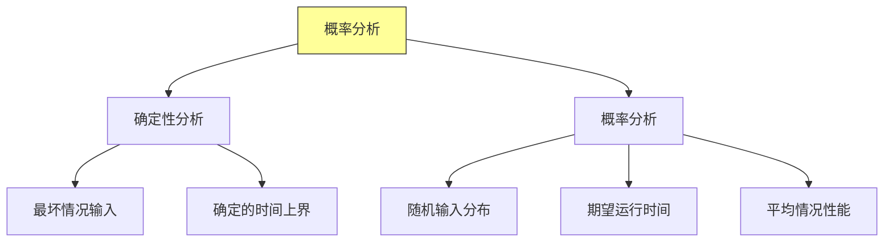

### 1.2 概率论回顾

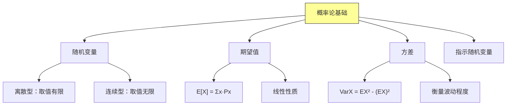

### 1.3 随机变量与期望

```java
import java.util.Random;

/**
 * 概率论基础示例
 */
public class ProbabilityBasics {

    /**
     * 离散随机变量示例：掷骰子
     */
    public static class DiceExample {

        // 随机变量 X：骰子点数
        // P(X = k) = 1/6，k = 1, 2, 3, 4, 5, 6

        /**
         * 计算骰子的期望值
         * E[X] = Σk·P(X=k) = (1+2+3+4+5+6)/6 = 3.5
         */
        public static double expectedValue() {
            double sum = 0;
            for (int k = 1; k <= 6; k++) {
                sum += k * (1.0 / 6);
            }
            return sum;  // 3.5
        }

        /**
         * 模拟掷骰子多次取平均
         */
        public static double simulate(int trials) {
            Random random = new Random();
            long sum = 0;
            for (int i = 0; i < trials; i++) {
                sum += random.nextInt(6) + 1;
            }
            return (double) sum / trials;
        }
    }

    /**
     * 期望的线性性质
     * E[X + Y] = E[X] + E[Y]
     * 即使 X 和 Y 不独立也成立！
     */
    public static class LinearityExample {

        /**
         * 问题：计算 n 个骰子点数之和的期望
         * 解法1：直接计算
         * 解法2：利用线性性质
         */
        public static double expectedSum(int n) {
            // 线性性质：E[X1 + X2 + ... + Xn] = E[X1] + ... + E[Xn]
            // E[Xi] = 3.5
            return n * 3.5;
        }
    }
}
```

---

## 二、雇佣问题

### 2.1 问题描述

**问题**：有一位秘书，需要从 n 个候选人中按随机顺序逐一面试。每次面试后，必须立即决定是否雇用该候选人。如果雇用，之后的候选人就不再考虑。如果不雇用，可以考虑后续候选人。如何做出最优决策？

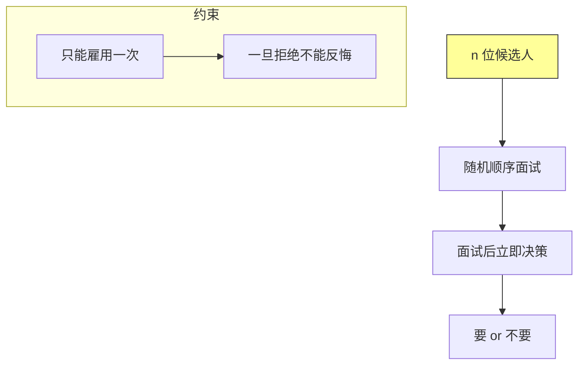

### 2.2 最优策略：37% 法则

**策略**：先面试前 k 位候选人（不使用任何人的信息），然后从第 k+1 位开始，选择第一个比前面所有候选人都优秀的人。

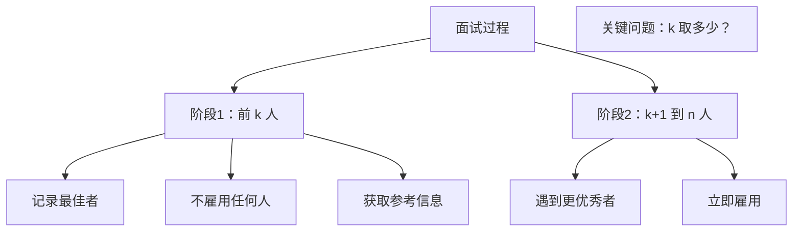

### 2.3 概率分析

```java
/**
 * 雇佣问题分析
 */
public class HiringProblem {

    /**
     * 随机排列生成
     * 将数组随机打乱
     */
    public static void shuffle(int[] arr) {
        Random random = new Random();
        for (int i = arr.length - 1; i > 0; i--) {
            int j = random.nextInt(i + 1);
            swap(arr, i, j);
        }
    }

    private static void swap(int[] arr, int i, int j) {
        int temp = arr[i];
        arr[i] = arr[j];
        arr[j] = temp;
    }

    /**
     * 雇用成本分析
     *
     * @param quality 候选人质量数组（值越大越好）
     * @param k 观察期长度
     * @return 雇用次数
     */
    public static int hireCount(int[] quality, int k) {
        int n = quality.length;
        int hireCount = 0;
        int best = -1;

        // 阶段1：观察，不雇用
        for (int i = 0; i < k; i++) {
            if (quality[i] > best) {
                best = quality[i];
            }
        }

        // 阶段2：雇用第一个比 best 更好的人
        for (int i = k; i < n; i++) {
            if (quality[i] > best) {
                best = quality[i];
                hireCount++;
            }
        }

        return hireCount;
    }

    /**
     * 计算雇用 k 位置最佳候选人的概率
     *
     * 思路：第 i 位是最佳候选人的条件
     * - 第 i 位是 n 个中质量最高的
     * - 前 k 位中没有任何人比第 i 位优秀
     *
     * P = 1/n × Σi=k+1 to n (k / (i-1))
     * 当 n 很大时 ≈ k/n × ln(n/k)
     */
    public static double probabilityBestAtPosition(int n, int k) {
        double prob = 0.0;
        for (int i = k + 1; i <= n; i++) {
            // 第 i 位是最佳的概率 × 前面 k 个都不如它的概率
            prob += (1.0 / n) * (k / (i - 1.0));
        }
        return prob;
    }
}
```

### 2.4 雇用次数的期望

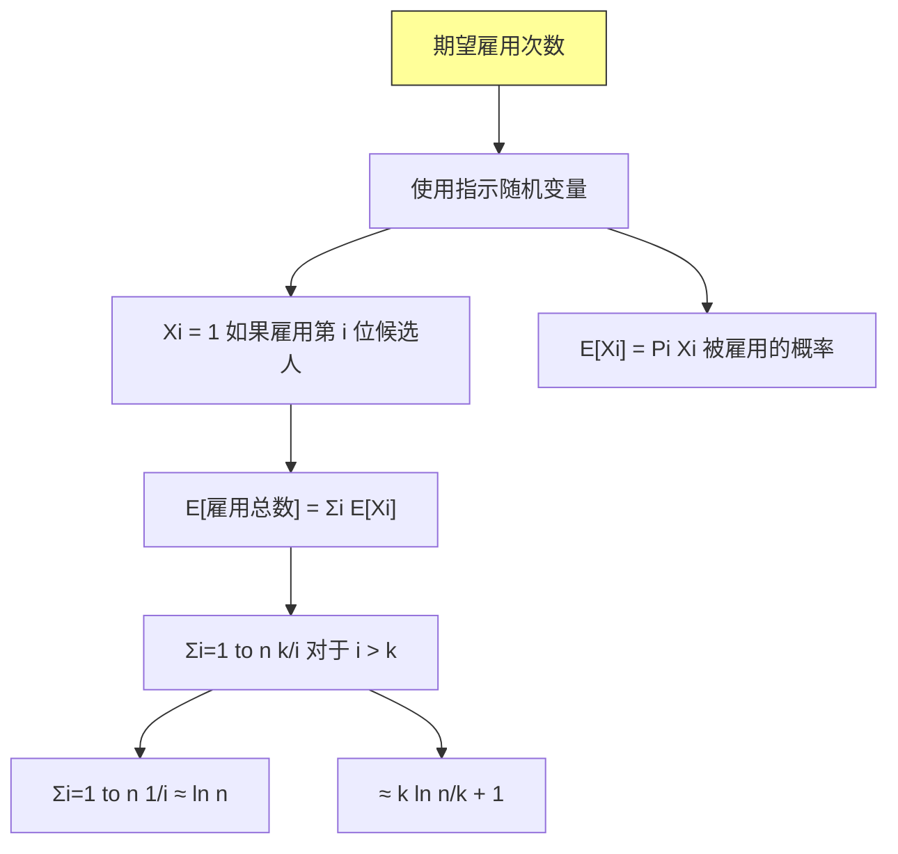

**雇用成本的期望值**：
$$E[\text{成本}] = \sum_{i=1}^{n} P(\text{雇用第 } i \text{ 位}) \times \text{雇用成本}$$

对于 $i > k$：
$$P(\text{雇用第 } i \text{ 位}) = \frac{k}{i-1}$$

---

## 三、指示随机变量

### 3.1 指示随机变量定义

**指示随机变量**是一个随机变量，用于表示某个事件是否发生。

$$X_I = \begin{cases} 1 & \text{如果事件 I 发生} \\ 0 & \text{否则} \end{cases}$$

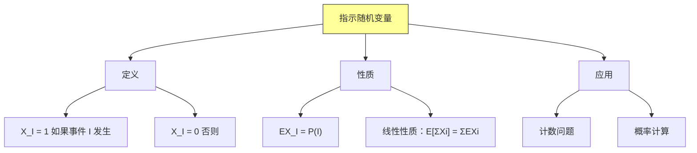

### 3.2 示例：计算逆序对

```java
/**
 * 使用指示随机变量分析逆序对问题
 */
public class InversionAnalysis {

    /**
     * 逆序对：i < j 且 A[i] > A[j]
     */
    public static class InversionCount {

        /**
         * 指示随机变量方法
         * X_ij = 1 如果 (i, j) 是逆序对
         * 总逆序数 X = Σi<j X_ij
         *
         * 对于随机排列：
         * P(i, j) 是逆序对 = 1/2
         * E[X] = n(n-1)/4
         */
        public static double expectedInversions(int n) {
            // EX = Σi<j EX_ij
            // EX_ij = P(逆序) = 1/2
            return n * (n - 1) / 4.0;
        }

        /**
         * 实际计算逆序对数量
         */
        public static int count(int[] arr) {
            int count = 0;
            for (int i = 0; i < arr.length; i++) {
                for (int j = i + 1; j < arr.length; j++) {
                    if (arr[i] > arr[j]) {
                        count++;
                    }
                }
            }
            return count;
        }
    }

    /**
     * 生日悖论分析
     */
    public static class BirthdayParadox {

        /**
         * 指示随机变量：X_ij = 1 如果第 i 天和第 j 天有人生日相同
         *
         * P(X_ij = 1) = 1 - P(不同) = 1 - (365/364) × ... × (365-i+2)/365
         */
        public static double[][] calculateCollisionProbabilities(int days, int people) {
            double[][] probs = new double[people][people];

            for (int i = 0; i < people; i++) {
                for (int j = i + 1; j < people; j++) {
                    probs[i][j] = collisionProbability(i + 1, j + 1, days);
                }
            }

            return probs;
        }

        private static double collisionProbability(int groupSize, int day1, int day2, int days) {
            // 使用指示随机变量
            double prob = 1.0;
            for (int i = 0; i < groupSize - 1; i++) {
                prob *= (double) (days - i - 1) / days;
            }
            return 1 - prob;
        }

        private static double collisionProbability(int person1, int person2, int days) {
            // 简单情况：两个人的生日相同概率
            // P(相同) = 1/365（近似）
            return 1.0 / days;
        }
    }
}
```

### 3.3 指示随机变量的优势

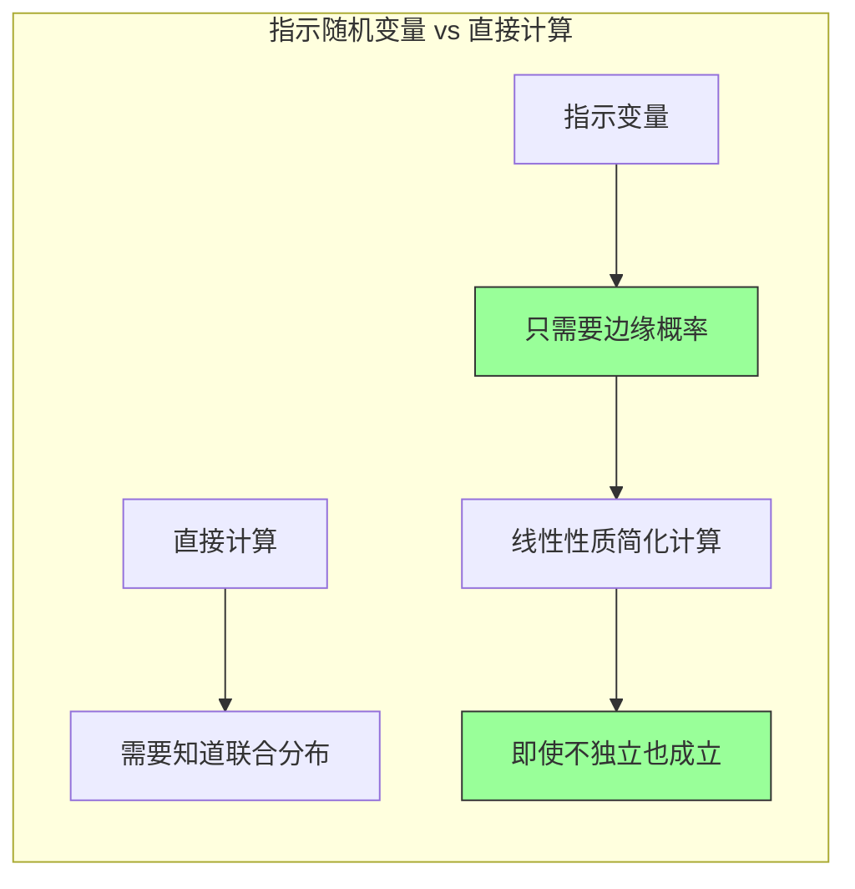

---

## 四、随机算法

### 4.1 随机算法概述

**随机算法**在执行过程中会做出随机选择，即使输入相同，每次运行的结果也可能不同。

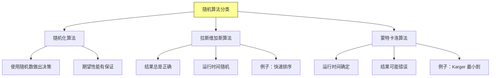

### 4.2 随机化快速排序

```java
import java.util.Random;

/**
 * 随机化快速排序
 * 避免最坏情况，提高期望性能
 */
public class RandomizedQuickSort {

    private static Random random = new Random();

    /**
     * 随机化快速排序
     *
     * @param arr 待排序数组
     */
    public static void sort(int[] arr) {
        shuffle(arr);  // 先随机打乱
        quickSort(arr, 0, arr.length - 1);
    }

    /**
     * 随机打乱数组
     * 确保任意输入排列的概率相同
     */
    private static void shuffle(int[] arr) {
        for (int i = arr.length - 1; i > 0; i--) {
            int j = random.nextInt(i + 1);
            swap(arr, i, j);
        }
    }

    /**
     * 快速排序主方法
     */
    private static void quickSort(int[] arr, int left, int right) {
        if (left < right) {
            int pivotIndex = partition(arr, left, right);
            quickSort(arr, left, pivotIndex - 1);
            quickSort(arr, pivotIndex + 1, right);
        }
    }

    /**
     * 分区操作
     * 选择 pivot，将其放到正确位置
     */
    private static int partition(int[] arr, int left, int right) {
        int pivot = arr[right];  // 选择最右元素作为 pivot
        int i = left - 1;        // 小于 pivot 的区域边界

        for (int j = left; j < right; j++) {
            if (arr[j] <= pivot) {
                i++;
                swap(arr, i, j);
            }
        }
        swap(arr, i + 1, right);  // 将 pivot 放到正确位置
        return i + 1;
    }

    private static void swap(int[] arr, int i, int j) {
        int temp = arr[i];
        arr[i] = arr[j];
        arr[j] = temp;
    }

    /**
     * 随机化分析版
     */
    public static class WithAnalysis {

        private static long comparisonCount = 0;

        /**
         * 随机快速排序（带比较计数）
         */
        public static void sort(int[] arr) {
            shuffle(arr);
            quickSort(arr, 0, arr.length - 1);
        }

        private static void quickSort(int[] arr, int left, int right) {
            if (left < right) {
                int pivotIndex = partition(arr, left, right);
                quickSort(arr, left, pivotIndex - 1);
                quickSort(arr, pivotIndex + 1, right);
            }
        }

        private static int partition(int[] arr, int left, int right) {
            int pivot = arr[right];
            int i = left - 1;

            for (int j = left; j < right; j++) {
                comparisonCount++;  // 计数
                if (arr[j] <= pivot) {
                    i++;
                    swap(arr, i, j);
                }
            }
            swap(arr, i + 1, right);
            return i + 1;
        }

        public static long getComparisonCount() {
            return comparisonCount;
        }

        public static void resetCount() {
            comparisonCount = 0;
        }
    }
}
```

### 4.3 随机化算法的期望分析

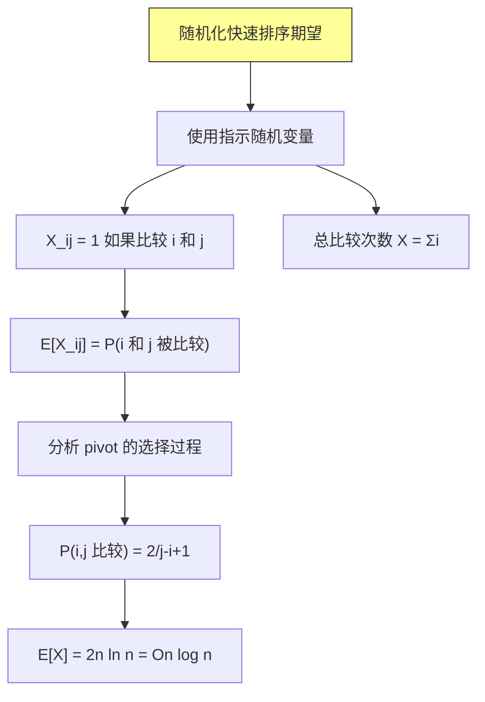

**关键推导**：
- 元素 $i$ 和 $j$ 只有在它们之间的元素都没被选为 pivot 时才会被比较
- 如果 $[i, j]$ 区间内有元素被选为 pivot，则 pivot 会隔离 $i$ 和 $j$，它们不会被比较

---

## 五、生日悖论

### 5.1 问题描述

**问题**：房间里有多少人，才能使至少两个人生日相同的概率超过 50%？

**直觉回答**：365/2 ≈ 183 人
**实际答案**：23 人！

### 5.2 概率分析

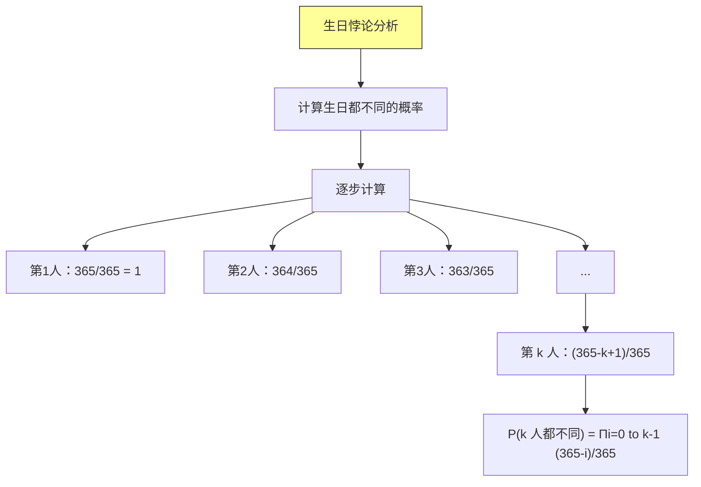

### 5.3 Java 实现

```java
/**
 * 生日悖论分析
 */
public class BirthdayParadox {

    /**
     * 计算 k 个人中至少两人生日相同的概率
     *
     * @param k 人数
     * @param days 一年的天数（默认 365）
     * @return 至少一人生日相同的概率
     */
    public static double collisionProbability(int k, int days) {
        // 计算生日都不同的概率
        double probAllDifferent = 1.0;

        for (int i = 0; i < k; i++) {
            probAllDifferent *= (double) (days - i) / days;
        }

        // 至少两人相同的概率 = 1 - 全都不同
        return 1.0 - probAllDifferent;
    }

    /**
     * 找到使碰撞概率达到 threshold 的人数
     *
     * @param threshold 目标概率
     * @param days 天数
     * @return 最少人数
     */
    public static int findMinimumPeople(double threshold, int days) {
        for (int k = 1; k <= days; k++) {
            if (collisionProbability(k, days) >= threshold) {
                return k;
            }
        }
        return days;
    }

    /**
     * 近似计算（使用对数近似）
     * ln(1-x) ≈ -x 当 x 很小时
     *
     * P(碰撞) ≈ 1 - e^(-k(k-1)/2M)
     */
    public static double approximateProbability(int k, int days) {
        // 近似公式
        double lambda = (double) k * (k - 1) / (2 * days);
        return 1.0 - Math.exp(-lambda);
    }

    /**
     * 生日悖论演示
     */
    public static void demonstrate() {
        int days = 365;
        double[] thresholds = {0.5, 0.7, 0.99};

        System.out.println("=== 生日悖论演示 ===");
        System.out.println("一年 " + days + " 天\n");

        for (double threshold : thresholds) {
            int minPeople = findMinimumPeople(threshold, days);
            System.out.printf("概率超过 %.0f%% 需要 %d 人%n",
                threshold * 100, minPeople);
        }

        System.out.println("\n=== 碰撞概率表 ===");
        System.out.println("人数\t\t碰撞概率");
        for (int k = 1; k <= 60; k += 5) {
            double prob = collisionProbability(k, days);
            System.out.printf("%d\t\t%.4f%n", k, prob);
        }
    }

    public static void main(String[] args) {
        demonstrate();

        // 验证：23 人时概率约为 50.7%
        System.out.println("\n23 人时碰撞概率: " +
            String.format("%.4f", collisionProbability(23, 365)));
    }
}
```

### 5.4 生日悖论可视化

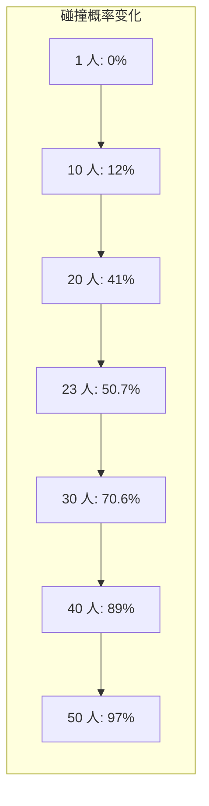

### 5.5 生日悖论的应用

```mermaid
graph TD
    A["生日悖论应用"] --> B["哈希攻击"]
    A --> C["密码学"]
    A --> D["碰撞检测"]

    B --> B1["哈希表攻击者尝试碰撞"]
    B --> B2["只需 √M 次尝试"

    C --> C1["生日攻击：伪造签名"]
    C --> C2["需要 2的n/2次方 次尝试"

    D --> D3["哈希函数强度测试"]
    D --> D4["彩虹表攻击"

    style A fill:#ff9,stroke:#333
```

---

## 六、球与箱子问题

### 6.1 问题描述

**问题**：将 m 个球随机投入 n 个箱子，求：
- 某个箱子是空的概率
- 某个箱子恰有一个球的概率
- 最满的箱子有多少个球

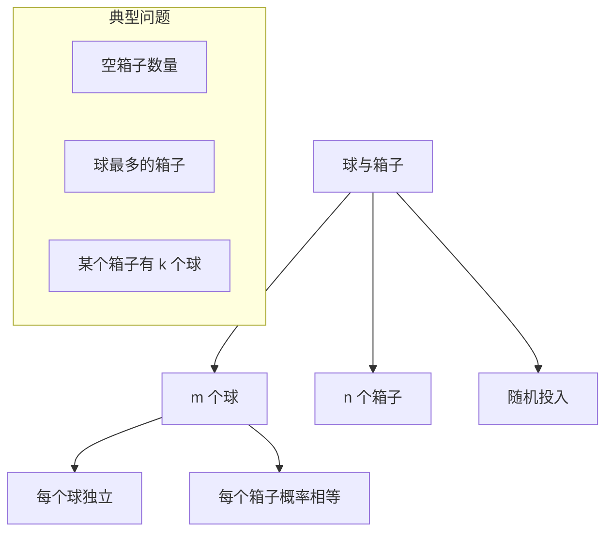

### 6.2 分析

```java
import java.util.Random;

/**
 * 球与箱子问题分析
 */
public class BallsAndBins {

    /**
     * 使用指示随机变量计算空箱子数期望
     *
     * X_i = 1 如果箱子 i 是空的
     * E[X_i] = (1 - 1/n)^m
     * E[总空箱数] = n × (1 - 1/n)^m
     */
    public static double expectedEmptyBins(int m, int n) {
        // 每个箱子空的概率
        double probEmpty = Math.pow((double) (n - 1) / n, m);
        return n * probEmpty;
    }

    /**
     * 某个箱子恰有 k 个球的概率
     * 二项分布：B(m, 1/n)
     */
    public static double probExactlyKBalls(int m, int n, int k) {
        // C(m, k) × (1/n)^k × (1 - 1/n)^(m-k)
        return binomialCoefficient(m, k) *
               Math.pow(1.0 / n, k) *
               Math.pow((double) (n - 1) / n, m - k);
    }

    /**
     * 计算二项式系数 C(n, k)
     */
    private static long binomialCoefficient(int n, int k) {
        if (k > n - k) k = n - k;
        long result = 1;
        for (int i = 0; i < k; i++) {
            result = result * (n - i) / (i + 1);
        }
        return result;
    }

    /**
     * 模拟：随机投球
     */
    public static int[] simulate(int m, int n) {
        int[] bins = new int[n];
        Random random = new Random();

        for (int i = 0; i < m; i++) {
            int bin = random.nextInt(n);
            bins[bin]++;
        }

        return bins;
    }

    /**
     * 最满箱子分析
     */
    public static int maxBallsInBin(int[] bins) {
        int max = 0;
        for (int count : bins) {
            if (count > max) max = count;
        }
        return max;
    }
}
```

### 6.3 球与箱子的期望值

```mermaid
graph TD
    A["球与箱子期望值"] --> B["空箱子数"]
    A --> C["装球最多的箱子"]

    B --> B1["E = n × (1 - 1/n)^m"]
    B --> B2["≈ n × e^(-m/n)"]
    B --> B3["当 m = n ln n 时，E ≈ 1"]

    C --> C1["当 m = n 时，最满箱子 ≈ ln n / ln ln n"]
    C --> C2["当 m = n ln n 时，最满箱子 ≈ ln n / ln ln n × e"]
    C --> C3["当 m = cn 时，最满箱子 ≈ ln n / ln ln n"

    style A fill:#ff9,stroke:#333
```

---

## 七、特征向量

### 7.1 特征向量简介

**特征向量**在随机算法分析中用于：
- 分析随机游走
- 分析马尔可夫链
- PageRank 算法

```mermaid
graph TD
    A["特征向量应用"] --> B["随机游走收敛"]
    A --> C["马尔可夫链稳态"]
    A --> D["PageRank"]

    B --> B1["转移矩阵的特征值"]
    B --> B2["收敛速度由第二大特征值决定"

    style A fill:#ff9,stroke:#333
```

### 7.2 在线雇用问题扩展

```java
/**
 * 在线雇用问题的变体分析
 */
public class OnlineHiringVariants {

    /**
     * 变体1：预算限制
     * 最多雇用 k 个人，选择最好的
     */
    public static class BudgetLimited {

        /**
         * 策略：选择前 k 个中的最大值
         * 期望成功率 = 1/k
         */
        public static double successProbability(int k) {
            // 最佳候选人随机分布在 k 个位置之一
            return 1.0 / k;
        }
    }

    /**
     * 变体2：知道候选人数量的完整信息
     * 可以精确计算最优的 k
     */
    public static class FullInformation {

        /**
         * 计算最优观察期 k*
         * 使得 P(成功) 最大
         */
        public static int optimalK(int n) {
            // 近似解：k* ≈ n/e
            return (int) (n / Math.E);
        }

        /**
         * 成功率计算
         */
        public static double successProbability(int n, int k) {
            double prob = 0.0;
            for (int i = k; i < n; i++) {
                // 第 i 位是最佳的概率 × 前 k 位不雇用的条件
                prob += (1.0 / n) * (k / (double) i);
            }
            return prob;
        }
    }

    /**
     * 变体3：无放回抽样
     * 只能看到一次
     */
    public static class NoReplacement {

        /**
         * 采样 k 个样本，选择最好的
         * 期望值分析
         */
        public static double expectedBestValue(int n, int k) {
            // 采样 k 个值的期望最大值
            // 对于均匀分布 [0,1]
            return (double) k / (k + 1);
        }
    }
}
```

---

## 八、Python 实现示例

```python
"""
概率分析和随机算法 Python 实现
"""
import random
import math
from typing import List, Callable


class BirthdayParadox:
    """生日悖论分析"""

    @staticmethod
    def collision_probability(k: int, days: int = 365) -> float:
        """计算 k 人中至少两人生日相同的概率"""
        prob_all_different = 1.0
        for i in range(k):
            prob_all_different *= (days - i) / days
        return 1 - prob_all_different

    @staticmethod
    def approximate_probability(k: int, days: int = 365) -> float:
        """使用近似公式计算"""
        lam = k * (k - 1) / (2 * days)
        return 1 - math.exp(-lam)

    @staticmethod
    def find_min_people(threshold: float, days: int = 365) -> int:
        """找到使碰撞概率达到阈值的最少人数"""
        for k in range(1, days + 1):
            if BirthdayParadox.collision_probability(k, days) >= threshold:
                return k
        return days


class RandomizedQuickSort:
    """随机化快速排序"""

    def __init__(self):
        self.comparison_count = 0

    def sort(self, arr: List) -> List:
        """排序并返回"""
        self._shuffle(arr)
        self._quick_sort(arr, 0, len(arr) - 1)
        return arr

    def _shuffle(self, arr: List) -> None:
        """随机打乱"""
        for i in range(len(arr) - 1, 0, -1):
            j = random.randint(0, i)
            arr[i], arr[j] = arr[j], arr[i]

    def _quick_sort(self, arr: List, left: int, right: int) -> None:
        if left < right:
            pivot_idx = self._partition(arr, left, right)
            self._quick_sort(arr, left, pivot_idx - 1)
            self._quick_sort(arr, pivot_idx + 1, right)

    def _partition(self, arr: List, left: int, right: int) -> int:
        pivot = arr[right]
        i = left - 1

        for j in range(left, right):
            self.comparison_count += 1
            if arr[j] <= pivot:
                i += 1
                arr[i], arr[j] = arr[j], arr[i]

        arr[i + 1], arr[right] = arr[right], arr[i + 1]
        return i + 1


class MonteCarloPrimalityTest:
    """蒙特卡洛素性测试"""

    def is_probable_prime(self, n: int, iterations: int = 10) -> bool:
        """
        Miller-Rabin 素性测试
        返回 True 表示 n 可能是素数
        返回 False 表示 n 一定是合数
        """
        if n < 2:
            return False
        if n == 2:
            return True
        if n % 2 == 0:
            return False

        # 分解 n-1 = d × 2^s
        d = n - 1
        s = 0
        while d % 2 == 0:
            d //= 2
            s += 1

        # 进行多次测试
        for _ in range(iterations):
            if not self._miller_rabin_test(n, d, s):
                return False
        return True

    def _miller_rabin_test(self, n: int, d: int, s: int) -> bool:
        a = random.randint(2, n - 2)
        x = pow(a, d, n)

        if x == 1 or x == n - 1:
            return True

        for _ in range(s - 1):
            x = (x * x) % n
            if x == n - 1:
                return True

        return False


if __name__ == "__main__":
    # 生日悖论演示
    print("=== 生日悖论演示 ===")
    for k in [10, 20, 23, 30, 40, 50]:
        prob = BirthdayParadox.collision_probability(k)
        print(f"{k} 人: 碰撞概率 = {prob:.4f}")

    # 随机排序测试
    print("\n=== 随机快速排序测试 ===")
    sorter = RandomizedQuickSort()
    arr = [3, 1, 4, 1, 5, 9, 2, 6, 5]
    sorted_arr = sorter.sort(arr.copy())
    print(f"原数组: {arr}")
    print(f"排序后: {sorted_arr}")
    print(f"比较次数: {sorter.comparison_count}")
```

---

## 九、总结与要点

### 9.1 核心概念回顾

```mermaid
flowchart TD
    A["第五章核心"] --> B["概率分析"]
    A --> C["指示随机变量"]
    A --> D["随机算法"]
    A --> E["经典问题"]

    B --> B1["期望运行时间"]
    B --> B2["平均情况分析"]

    C --> C1["X_I = 1 如果 I 发生"]
    C --> C2["EX = P(I)"]
    C --> C3["线性性质"

    D --> D1["拉斯维加斯：结果正确"]
    D --> D2["蒙特卡洛：时间确定"]

    E --> E1["雇佣问题：37%法则"]
    E --> E2["生日悖论：23人"]
    E --> E3["球与箱子"]

    style A fill:#ff9,stroke:#333
```

### 9.2 关键公式速查

| 问题 | 期望/概率 | 公式 |
|-----|---------|------|
| 雇佣成本 | 期望雇用次数 | $k \ln(n/k) + O(k)$ |
| 生日碰撞 | k 人碰撞概率 | $1 - \prod_{i=0}^{k-1} \frac{365-i}{365}$ |
| 逆序对 | 期望数量 | $n(n-1)/4$ |
| 随机快排 | 期望比较次数 | $2n \ln n \approx 1.39n \log_2 n$ |
| 空箱子 | 期望数量 | $n(1 - 1/n)^m \approx ne^{-m/n}$ |

### 9.3 随机算法分类

| 类型 | 确定性 | 随机性 | 示例 |
|-----|-------|-------|------|
| 拉斯维加斯 | 时间随机 | 结果正确 | 随机快排 |
| 蒙特卡洛 | 时间确定 | 结果可能错误 | Miller-Rabin 测试 |

---

## 课后思考

### 思考题 1
证明：随机快速排序的期望比较次数为 $2n \ln n$。

### 思考题 2
在雇佣问题中，证明最优的 $k$ 值满足 $k^* \approx n/e$。

### 思考题 3
解释为什么生日悖论中只需要 23 人就能达到 50% 的碰撞概率。

### 思考题 4
设计一个拉斯维加斯算法，在 O(n log n) 时间内找到第 k 小的元素（使用随机选择 pivot）。

---

*本章精读笔记完成*
