# 第六章：堆排序

## 一、二叉堆数据结构

### 1.1 堆的定义

**二叉堆**是一棵**完全二叉树**，可以用数组高效存储。它满足**堆性质**：
- **最大堆**：每个节点的值 ≥ 其子节点的值
- **最小堆**：每个节点的值 ≤ 其子节点的值

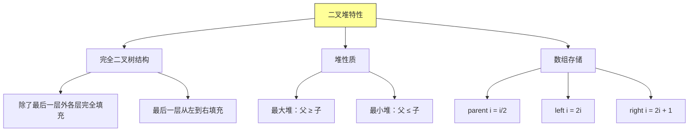

### 1.2 堆的数组表示

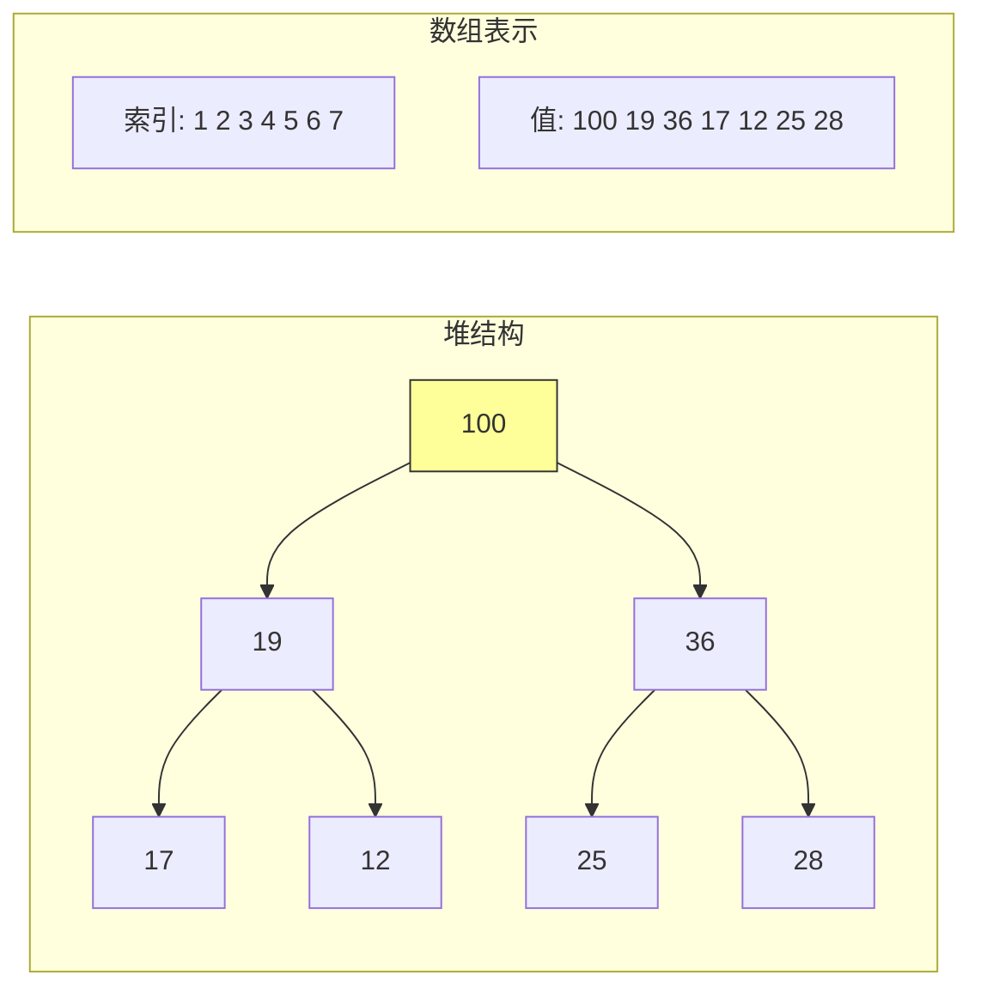

### 1.3 堆的基本操作

```java
/**
 * 最大堆实现
 */
public class MaxHeap {
    private int[] heap;
    private int size;
    private int capacity;

    public MaxHeap(int capacity) {
        this.capacity = capacity;
        this.heap = new int[capacity + 1];  // 1-indexed
        this.size = 0;
    }

    /**
     * 获取父节点索引
     */
    private int parent(int i) {
        return i / 2;
    }

    /**
     * 获取左子节点索引
     */
    private int left(int i) {
        return 2 * i;
    }

    /**
     * 获取右子节点索引
     */
    private int right(int i) {
        return 2 * i + 1;
    }

    /**
     * 检查索引是否有效
     */
    private boolean isValid(int i) {
        return i >= 1 && i <= size;
    }

    /**
     * 交换两个元素
     */
    private void swap(int i, int j) {
        int temp = heap[i];
        heap[i] = heap[j];
        heap[j] = temp;
    }
}
```

---

## 二、堆的核心操作

### 2.1 Max-Heapify（上浮/下沉）

**Max-Heapify** 是维护堆性质的核心操作：给定一个节点 i，确保以 i 为根的子树满足堆性质。

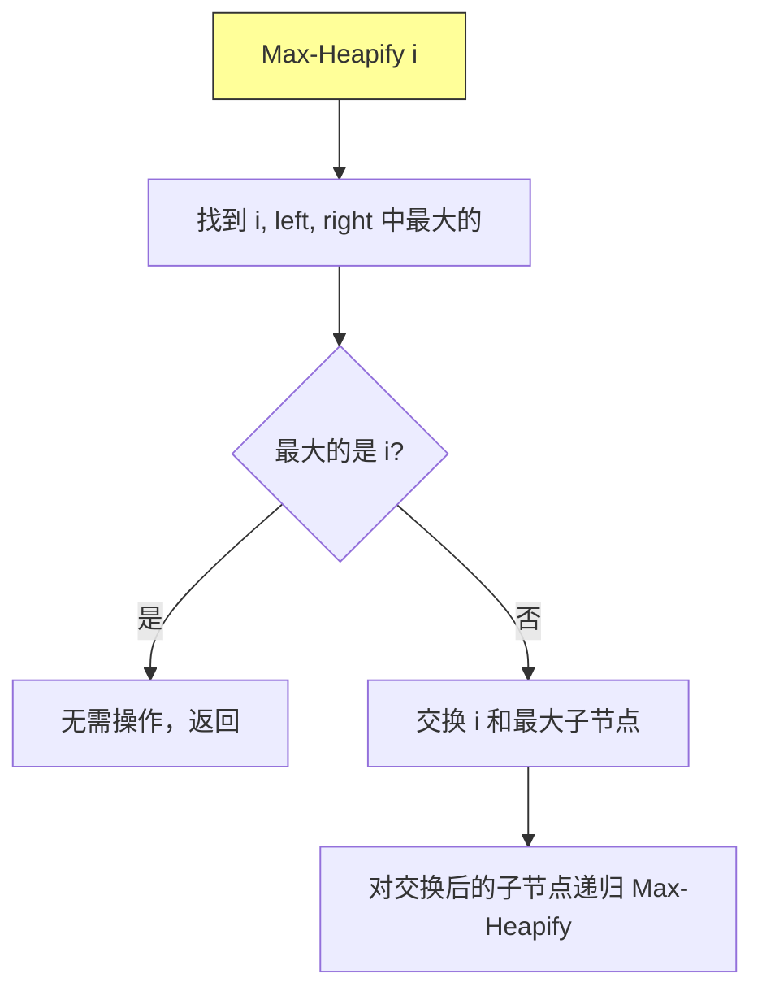

### 2.2 Max-Heapify 实现

```java
/**
     * 最大堆化操作
     * 时间复杂度：O(log n)
     *
     * @param i 需要堆化的节点索引
     */
    public void maxHeapify(int i) {
        int largest = i;  // 假设当前节点最大
        int l = left(i);
        int r = right(i);

        // 比较左子节点
        if (l <= size && heap[l] > heap[largest]) {
            largest = l;
        }

        // 比较右子节点
        if (r <= size && heap[r] > heap[largest]) {
            largest = r;
        }

        // 如果最大节点不是当前节点，交换并递归
        if (largest != i) {
            swap(i, largest);
            maxHeapify(largest);  // 递归堆化交换后的节点
        }
    }

    /**
     * 非递归版 Max-Heapify
     * 避免栈溢出
     */
    public void maxHeapifyIterative(int i) {
        while (true) {
            int largest = i;
            int l = left(i);
            int r = right(i);

            if (l <= size && heap[l] > heap[largest]) {
                largest = l;
            }
            if (r <= size && heap[r] > heap[largest]) {
                largest = r;
            }

            if (largest == i) {
                break;  // 已经是最大堆
            }

            swap(i, largest);
            i = largest;  // 继续下沉
        }
    }
```

### 2.3 Build-Max-Heap（建堆）

**Build-Max-Heap** 将任意数组转换为最大堆。

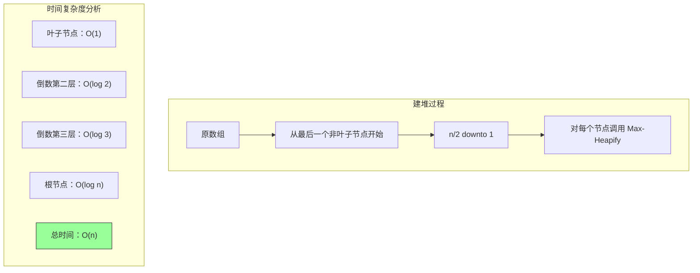

### 2.4 建堆实现

```java
    /**
     * 建堆操作
     * 时间复杂度：O(n)
     *
     * @param arr 输入数组
     * @return 建好的最大堆
     */
    public static MaxHeap buildMaxHeap(int[] arr) {
        MaxHeap heap = new MaxHeap(arr.length);
        System.arraycopy(arr, 0, heap.heap, 1, arr.length);
        heap.size = arr.length;

        // 从最后一个非叶子节点开始
        // 最后一个非叶子节点是 n/2
        for (int i = heap.size / 2; i >= 1; i--) {
            heap.maxHeapify(i);
        }

        return heap;
    }

    /**
     * 原地建堆（修改原数组）
     */
    public static void buildMaxHeapInPlace(int[] arr) {
        int n = arr.length;

        // 将数组转为 1-indexed 风格处理
        for (int i = n / 2 - 1; i >= 0; i--) {
            heapifyInPlace(arr, n, i);
        }
    }

    /**
     * 原地堆化（适用于 0-indexed 数组）
     */
    private static void heapifyInPlace(int[] arr, int n, int i) {
        int largest = i;
        int left = 2 * i + 1;      // 0-indexed 的左子节点
        int right = 2 * i + 2;     // 0-indexed 的右子节点

        if (left < n && arr[left] > arr[largest]) {
            largest = left;
        }
        if (right < n && arr[right] > arr[largest]) {
            largest = right;
        }

        if (largest != i) {
            swapInPlace(arr, i, largest);
            heapifyInPlace(arr, n, largest);
        }
    }

    private static void swapInPlace(int[] arr, int i, int j) {
        int temp = arr[i];
        arr[i] = arr[j];
        arr[j] = temp;
    }
```

---

## 三、堆排序算法

### 3.1 堆排序思想

**堆排序**利用最大堆的性质：
1. 构建最大堆
2. 每次将堆顶（最大元素）与堆尾交换
3. 堆大小减一，对堆顶进行 Max-Heapify
4. 重复直到排序完成

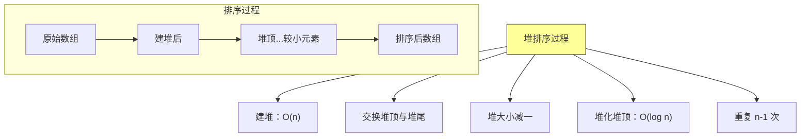

### 3.2 堆排序实现

```java
/**
 * 堆排序实现
 */
public class HeapSort {

    /**
     * 堆排序主方法
     * 时间复杂度：O(n log n)
     * 空间复杂度：O(1)
     *
     * @param arr 待排序数组
     */
    public static void sort(int[] arr) {
        int n = arr.length;

        // 1. 建堆：O(n)
        buildMaxHeap(arr, n);

        // 2. 提取元素：O(n log n)
        for (int i = n - 1; i > 0; i--) {
            // 将堆顶（最大元素）移到数组末尾
            swap(arr, 0, i);

            // 对堆顶进行堆化（堆大小减一）
            heapify(arr, i, 0);
        }
    }

    /**
     * 建堆
     */
    private static void buildMaxHeap(int[] arr, int n) {
        // 从最后一个非叶子节点开始
        for (int i = n / 2 - 1; i >= 0; i--) {
            heapify(arr, n, i);
        }
    }

    /**
     * 堆化操作（向下堆化/下滤）
     */
    private static void heapify(int[] arr, int n, int i) {
        int largest = i;       // 假设当前节点最大
        int left = 2 * i + 1;  // 左子节点
        int right = 2 * i + 2; // 右子节点

        // 找最大节点
        if (left < n && arr[left] > arr[largest]) {
            largest = left;
        }
        if (right < n && arr[right] > arr[largest]) {
            largest = right;
        }

        // 如果最大节点不是当前节点，交换并递归
        if (largest != i) {
            swap(arr, i, largest);
            heapify(arr, n, largest);
        }
    }

    private static void swap(int[] arr, int i, int j) {
        int temp = arr[i];
        arr[i] = arr[j];
        arr[j] = temp;
    }

    /**
     * 带详细步骤的堆排序
     */
    public static class WithSteps {

        private static int stepCount = 0;

        public static void sort(int[] arr) {
            stepCount = 0;
            int n = arr.length;

            System.out.println("=== 堆排序过程 ===\n");
            System.out.println("原始数组: " + java.util.Arrays.toString(arr));

            // 建堆
            buildMaxHeap(arr, n);
            System.out.println("建堆完成: " + java.util.Arrays.toString(arr));

            // 提取元素
            for (int i = n - 1; i > 0; i--) {
                stepCount++;
                System.out.printf("\n第 %d 次提取:\n", stepCount);
                System.out.printf("  交换 arr[0]=%d 和 arr[%d]=%d\n", arr[0], i, arr[i]);
                swap(arr, 0, i);
                System.out.printf("  交换后: " + java.util.Arrays.toString(arr) + "\n");
                heapify(arr, i, 0);
                System.out.printf("  堆化后: " + java.util.Arrays.toString(arr) + "\n");
            }

            System.out.println("\n排序完成: " + java.util.Arrays.toString(arr));
        }

        private static void buildMaxHeap(int[] arr, int n) {
            for (int i = n / 2 - 1; i >= 0; i--) {
                heapify(arr, n, i);
            }
        }

        private static void heapify(int[] arr, int n, int i) {
            int largest = i;
            int left = 2 * i + 1;
            int right = 2 * i + 2;

            if (left < n && arr[left] > arr[largest]) {
                largest = left;
            }
            if (right < n && arr[right] > arr[largest]) {
                largest = right;
            }

            if (largest != i) {
                swap(arr, i, largest);
                heapify(arr, n, largest);
            }
        }

        private static void swap(int[] arr, int i, int j) {
            int temp = arr[i];
            arr[i] = arr[j];
            arr[j] = temp;
        }
    }
}
```

### 3.3 堆排序过程可视化

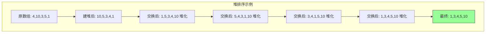

---

## 四、优先队列

### 4.1 优先队列定义

**优先队列**是一种数据结构，支持以下操作：
- **Insert**：插入元素
- **Maximum/Minimum**：获取最大/最小元素
- **Extract-Max/Min**：移除并返回最大/最小元素
- **Increase-Key**：增加某个元素的值

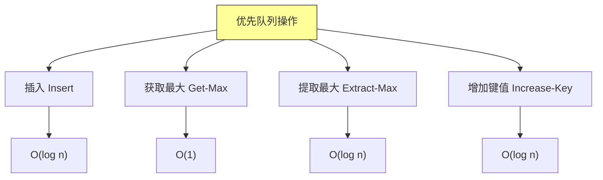

### 4.2 优先队列实现

```java
import java.util.NoSuchElementException;

/**
 * 基于最大堆的优先队列实现
 */
public class MaxPriorityQueue {
    private int[] heap;
    private int size;
    private int capacity;

    public MaxPriorityQueue(int capacity) {
        this.capacity = capacity;
        this.heap = new int[capacity];
        this.size = 0;
    }

    /**
     * 获取最大元素（堆顶）
     * 时间复杂度：O(1)
     */
    public int maximum() {
        if (size == 0) {
            throw new NoSuchElementException("Queue is empty");
        }
        return heap[0];
    }

    /**
     * 提取最大元素
     * 时间复杂度：O(log n)
     */
    public int extractMax() {
        if (size == 0) {
            throw new NoSuchElementException("Queue is empty");
        }

        int max = heap[0];           // 保存最大值
        heap[0] = heap[size - 1];    // 将最后一个元素移到堆顶
        size--;
        maxHeapify(0);               // 堆化堆顶

        return max;
    }

    /**
     * 增加键值
     * 将索引 i 的元素增加到新值 key
     * 时间复杂度：O(log n)
     */
    public void increaseKey(int i, int key) {
        if (i < 0 || i >= size) {
            throw new IndexOutOfBoundsException("Invalid index");
        }
        if (key < heap[i]) {
            throw new IllegalArgumentException("New key is smaller than current key");
        }

        heap[i] = key;
        // 可能需要上浮
        while (i > 0 && heap[parent(i)] < heap[i]) {
            swap(i, parent(i));
            i = parent(i);
        }
    }

    /**
     * 插入元素
     * 时间复杂度：O(log n)
     */
    public void insert(int key) {
        if (size == capacity) {
            throw new IllegalStateException("Queue is full");
        }

        heap[size] = key;  // 先放在末尾
        size++;

        // 上浮到正确位置
        int i = size - 1;
        while (i > 0 && heap[parent(i)] < heap[i]) {
            swap(i, parent(i));
            i = parent(i);
        }
    }

    /**
     * 堆化（下滤）
     */
    private void maxHeapify(int i) {
        int largest = i;
        int left = 2 * i + 1;
        int right = 2 * i + 2;

        if (left < size && heap[left] > heap[largest]) {
            largest = left;
        }
        if (right < size && heap[right] > heap[largest]) {
            largest = right;
        }

        if (largest != i) {
            swap(i, largest);
            maxHeapify(largest);
        }
    }

    private int parent(int i) {
        return (i - 1) / 2;
    }

    private void swap(int i, int j) {
        int temp = heap[i];
        heap[i] = heap[j];
        heap[j] = temp;
    }

    public int size() {
        return size;
    }

    public boolean isEmpty() {
        return size == 0;
    }

    public void printHeap() {
        System.out.print("堆: [");
        for (int i = 0; i < size; i++) {
            System.out.print(heap[i]);
            if (i < size - 1) System.out.print(", ");
        }
        System.out.println("]");
    }
}
```

### 4.3 优先队列应用

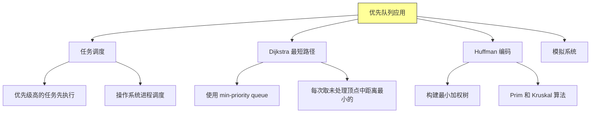

---

## 五、堆排序深入分析

### 5.1 复杂度分析

| 操作 | 时间复杂度 | 空间复杂度 | 说明 |
|-----|-----------|-----------|------|
| Build-Max-Heap | O(n) | O(1) | 原地建堆 |
| Heapify | O(log n) | O(1) | 下滤操作 |
| Extract-Max | O(log n) | O(1) | 交换+堆化 |
| Heap-Sort | O(n log n) | O(1) | 原地排序 |

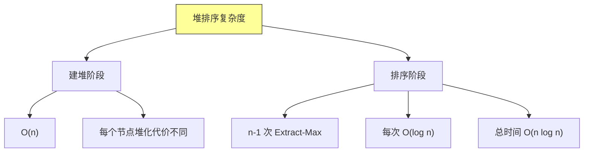

### 5.2 原地建堆的复杂度证明

**关键观察**：深度为 d 的节点最多需要 d 次交换操作。

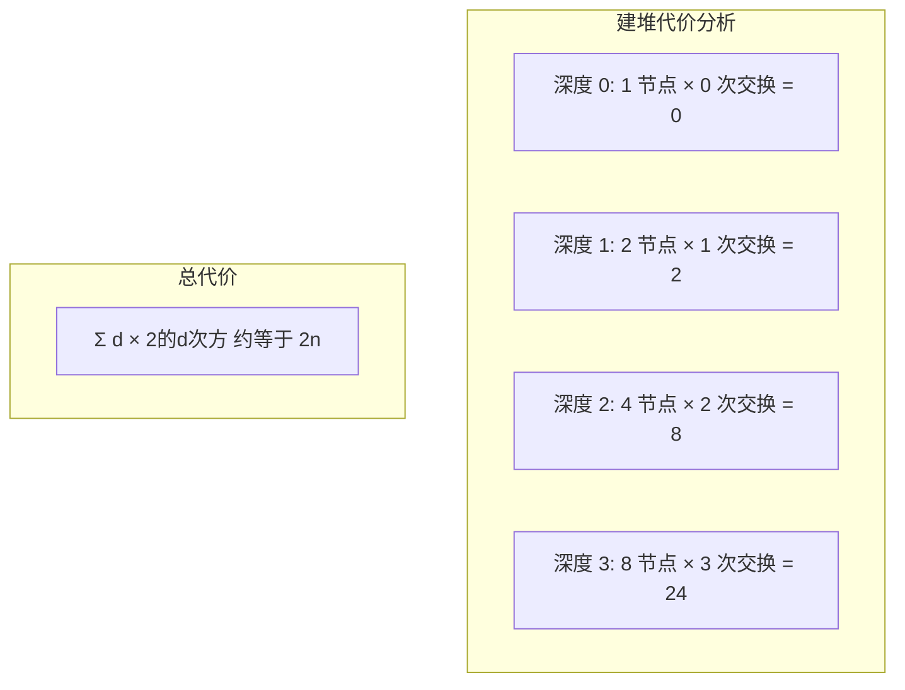

### 5.3 堆排序 vs 其他排序

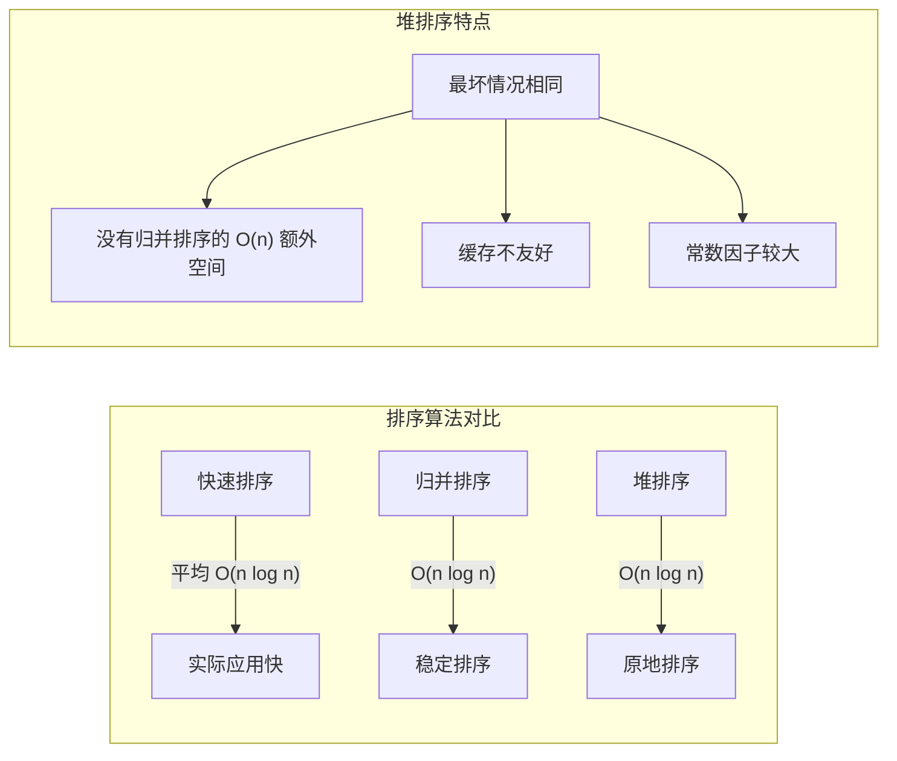

| 排序算法 | 平均时间 | 最坏时间 | 空间 | 稳定性 |
|---------|---------|---------|------|--------|
| 堆排序 | O(n log n) | O(n log n) | O(1) | 不稳定 |
| 快速排序 | O(n log n) | O(n²) | O(log n) | 不稳定 |
| 归并排序 | O(n log n) | O(n log n) | O(n) | 稳定 |
| 插入排序 | O(n²) | O(n²) | O(1) | 稳定 |

---

## 六、Python 实现

```python
"""
堆排序和优先队列 Python 实现
"""


class MaxHeap:
    """最大堆实现"""

    def __init__(self, capacity=None):
        self.heap = [] if capacity is None else [None] * capacity
        self.size = 0

    def parent(self, i):
        """返回父节点索引"""
        return (i - 1) // 2

    def left(self, i):
        """返回左子节点索引"""
        return 2 * i + 1

    def right(self, i):
        """返回右子节点索引"""
        return 2 * i + 2

    def swap(self, i, j):
        """交换元素"""
        self.heap[i], self.heap[j] = self.heap[j], self.heap[i]

    def max_heapify(self, i):
        """堆化操作（下滤）"""
        n = self.size
        largest = i
        l = self.left(i)
        r = self.right(i)

        if l < n and self.heap[l] > self.heap[largest]:
            largest = l
        if r < n and self.heap[r] > self.heap[largest]:
            largest = r

        if largest != i:
            self.swap(i, largest)
            self.max_heapify(largest)

    def build_max_heap(self, arr):
        """从数组建堆"""
        self.heap = arr[:]
        self.size = len(arr)

        # 从最后一个非叶子节点开始
        for i in range(self.size // 2 - 1, -1, -1):
            self.max_heapify(i)

    def extract_max(self):
        """提取最大元素"""
        if self.size == 0:
            raise IndexError("Heap is empty")

        max_val = self.heap[0]
        self.heap[0] = self.heap[self.size - 1]
        self.size -= 1
        self.max_heapify(0)

        return max_val

    def insert(self, key):
        """插入元素"""
        if self.size < len(self.heap):
            self.heap[self.size] = key
        else:
            self.heap.append(key)
        self.size += 1

        # 上浮
        i = self.size - 1
        while i > 0 and self.heap[self.parent(i)] < self.heap[i]:
            self.swap(i, self.parent(i))
            i = self.parent(i)

    def increase_key(self, i, key):
        """增加键值"""
        if key < self.heap[i]:
            raise ValueError("New key is smaller than current key")

        self.heap[i] = key
        # 上浮
        while i > 0 and self.heap[self.parent(i)] < self.heap[i]:
            self.swap(i, self.parent(i))
            i = self.parent(i)


class HeapSort:
    """堆排序"""

    @staticmethod
    def sort(arr):
        """堆排序"""
        n = len(arr)

        # 建堆
        heap = MaxHeap()
        heap.build_max_heap(arr)

        # 提取元素
        for i in range(n - 1, 0, -1):
            heap.swap(0, i)
            heap.size -= 1
            heap.max_heapify(0)

        # 将堆内容复制回数组
        for i in range(n):
            arr[i] = heap.heap[i]

        return arr


class PriorityQueue:
    """优先队列"""

    def __init__(self):
        self.heap = MaxHeap()

    def is_empty(self):
        return self.heap.size == 0

    def insert(self, key):
        self.heap.insert(key)

    def maximum(self):
        if self.heap.size == 0:
            raise IndexError("Queue is empty")
        return self.heap.heap[0]

    def extract_max(self):
        return self.heap.extract_max()


if __name__ == "__main__":
    # 测试堆排序
    arr = [4, 10, 3, 5, 1, 8, 7, 2, 9, 6]
    print("原数组:", arr)

    HeapSort.sort(arr)
    print("堆排序后:", arr)

    # 测试优先队列
    pq = PriorityQueue()
    for x in [4, 10, 3, 5, 1]:
        pq.insert(x)

    print("\n优先队列测试:")
    while not pq.is_empty():
        print(f"提取最大: {pq.extract_max()}")
```

---

## 七、堆的应用扩展

### 7.1 堆的变体

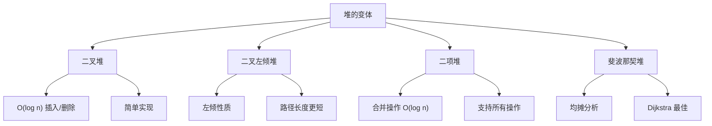

### 7.2 使用堆的经典算法

```java
/**
 * 使用堆的经典算法
 */
public class HeapAlgorithms {

    /**
     * 算法1：找到第 k 大元素
     * 使用大小为 k 的最小堆
     * 时间复杂度：O(n log k)
     */
    public static int findKthLargest(int[] arr, int k) {
        MinHeap minHeap = new MinHeap(k);

        for (int num : arr) {
            if (minHeap.size() < k) {
                minHeap.insert(num);
            } else if (num > minHeap.peek()) {
                minHeap.extractMin();
                minHeap.insert(num);
            }
        }

        return minHeap.peek();
    }

    /**
     * 算法2：实现 Stack 的 getMin 功能
     * 使用辅助栈
     */
    public static class MinStack {
        private java.util.Stack<Integer> stack;
        private java.util.Stack<Integer> minStack;

        public MinStack() {
            stack = new java.util.Stack<>();
            minStack = new java.util.Stack<>();
        }

        public void push(int val) {
            stack.push(val);
            if (minStack.isEmpty() || val <= minStack.peek()) {
                minStack.push(val);
            }
        }

        public void pop() {
            if (stack.pop().equals(minStack.peek())) {
                minStack.pop();
            }
        }

        public int top() {
            return stack.peek();
        }

        public int getMin() {
            return minStack.peek();
        }
    }

    /**
     * 算法3：滑动窗口最大值
     * 使用双端队列（单调队列）
     */
    public static int[] slidingWindowMax(int[] arr, int k) {
        if (arr.length == 0) return new int[0];

        java.util.Deque<Integer> deque = new java.util.ArrayDeque<>();
        int[] result = new int[arr.length - k + 1];

        for (int i = 0; i < arr.length; i++) {
            // 移除窗口外的元素
            if (!deque.isEmpty() && deque.peekFirst() <= i - k) {
                deque.pollFirst();
            }

            // 保持队列递减
            while (!deque.isEmpty() && arr[deque.peekLast()] <= arr[i]) {
                deque.pollLast();
            }
            deque.offerLast(i);

            // 记录结果
            if (i >= k - 1) {
                result[i - k + 1] = arr[deque.peekFirst()];
            }
        }

        return result;
    }

    /**
     * 算法4：合并 k 个有序数组
     * 使用最小堆
     */
    public static List<Integer> mergeKArrays(List<int[]> arrays) {
        java.util.List<Integer> result = new java.util.ArrayList<>();
        java.util.PriorityQueue<int[]> pq = new java.util.PriorityQueue<>(
            (a, b) -> Integer.compare(a[0], b[0])
        );

        // 将每个数组的第一个元素入队
        for (int i = 0; i < arrays.size(); i++) {
            int[] arr = arrays.get(i);
            if (arr.length > 0) {
                pq.offer(new int[]{arr[0], i, 0});  // value, arrayIndex, elementIndex
            }
        }

        while (!pq.isEmpty()) {
            int[] curr = pq.poll();
            result.add(curr[0]);

            int arrIdx = curr[1];
            int elemIdx = curr[2];
            int[] arr = arrays.get(arrIdx);

            if (elemIdx + 1 < arr.length) {
                pq.offer(new int[]{arr[elemIdx + 1], arrIdx, elemIdx + 1});
            }
        }

        return result;
    }
}
```

### 7.3 堆排序应用场景

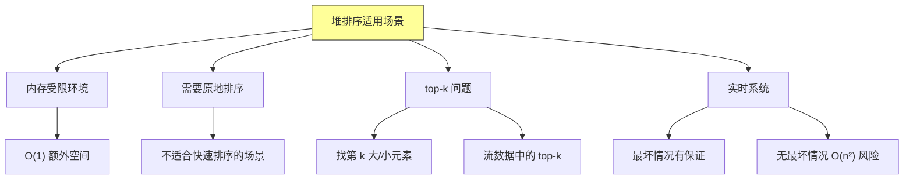

---

## 八、总结与要点

### 8.1 核心概念回顾

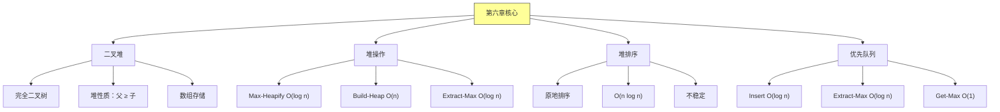

### 8.2 操作复杂度总结

| 操作 | 二叉堆 | 二项堆 | 斐波那契堆 |
|-----|-------|-------|-----------|
| Insert | O(log n) | O(log n) | O(1) 均摊 |
| Extract-Max | O(log n) | O(log n) | O(log n) 均摊 |
| Merge | O(n) | O(log n) | O(1) 均摊 |
| Get-Max | O(1) | O(1) | O(1) |

### 8.3 堆排序特点

**优点**：
- 最坏情况 O(n log n)
- O(1) 额外空间（原地排序）
- 不需要递归（可实现为迭代）

**缺点**：
- 不稳定排序
- 缓存不友好（访问不连续）
- 常数因子较大（比快速排序慢）

---

## 九、举一反三

### 9.1 相关 LeetCode 题目

| 题目 | 难度 | 核心考点 |
|-----|------|---------|
| [215. 数组中的第 K 个最大元素](https://leetcode.cn/problems/kth-largest-element-in-an-array/) | 中等 | 快速选择 / 堆 |
| [347. 前 K 个高频元素](https://leetcode.cn/problems/top-k-frequent-elements/) | 中等 | 堆 + 哈希表 |
| [295. 数据流的中位数](https://leetcode.cn/problems/find-median-from-data-stream/) | 困难 | 双堆技巧 |
| [703. 数据流中的第 K 大元素](https://leetcode.cn/problems/kth-largest-element-in-a-stream/) | 简单 | 最小堆 |
| [973. 最接近原点的 K 个点](https://leetcode.cn/problems/k-closest-points-to-origin/) | 中等 | 最大堆 |
| [378. 有序矩阵中第 K 小的元素](https://leetcode.cn/problems/kth-smallest-element-in-a-sorted-matrix/) | 中等 | 堆 / 二分查找 |
| [692. 前 K 个高频单词](https://leetcode.cn/problems/top-k-frequent-words/) | 中等 | 堆 + 字典序 |
| [373. 查找和最小的 K 对数字](https://leetcode.cn/problems/find-k-pairs-with-smallest-sums/) | 中等 | 双指针 + 堆 |

### 9.2 经典题目解析

#### 题目：215. 数组中的第 K 个最大元素

**题目描述**：给定整数数组 nums 和整数 k，返回数组中第 k 个最大的元素。

**解题思路**：

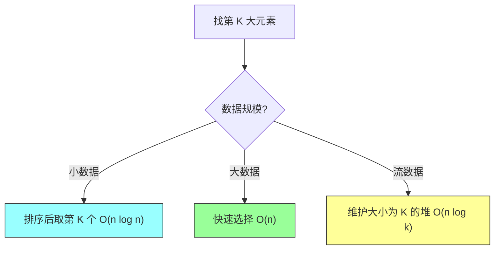

**Java 实现（堆方法）**：
```java
class Solution {
    public int findKthLargest(int[] nums, int k) {
        // 最小堆，堆顶是第 K 大的元素
        PriorityQueue<Integer> minHeap = new PriorityQueue<>();

        for (int num : nums) {
            minHeap.offer(num);
            if (minHeap.size() > k) {
                minHeap.poll();  // 移除最小的，保持堆大小为 K
            }
        }

        return minHeap.peek();  // 堆顶就是第 K 大元素
    }
}
```

**复杂度分析**：
| 方法 | 时间复杂度 | 空间复杂度 | 适用场景 |
|-----|-----------|-----------|---------|
| 排序 | O(n log n) | O(1) | 数据量小 |
| 快速选择 | O(n) | O(log n) | 需要最优平均性能 |
| 最小堆 | O(n log k) | O(k) | 数据量大，k 较小 |

---

### 9.3 变形题目

1. **top-k 问题变体**：
   - 动态数据流中的 top-k（维护堆大小）
   - 带权重的时间衰减 top-k
   - 多维度排序的 top-k

2. **中位数问题**：
   - 数据流中动态维护中位数（双堆法）
   - 带插入和删除的中位数维护

3. **堆的变体应用**：
   - 斐波那契堆用于 Dijkstra 算法优化
   - 二项堆用于高效合并

### 9.4 核心思想迁移

| 思想 | 迁移应用 |
|-----|---------|
| 堆的性质 | 优先级调度、任务队列 |
| 建堆 O(n) | 批量初始化、一次性构建 |
| 原地排序 | 内存受限环境的排序 |
| top-k 技巧 | 推荐系统、监控系统 |
| 双堆技巧 | 中位数、流式统计 |

### 9.5 思考题答案

**题目 1**：堆排序的时间复杂度分析
- 建堆：O(n)
- 排序：O(n log n)
- 总计：O(n log n)

**题目 2**：最小堆操作时间复杂度
| 操作 | 时间复杂度 |
|-----|-----------|
| Insert | O(log n) |
| Delete-Min | O(log n) |
| Decrease-Key | O(log n) |
| Get-Min | O(1) |

**题目 3**：数据流找第 k 大元素
- 使用大小为 k 的最小堆
- 遍历数据流，维护堆大小为 k
- 堆顶即为第 k 大元素
- 时间复杂度：O(n log k)，空间复杂度：O(k)

**题目 4**：堆排序 vs 快速排序对比
| 特性 | 堆排序 | 快速排序 |
|-----|-------|---------|
| 最坏时间 | O(n log n) | O(n²) |
| 平均时间 | O(n log n) | O(n log n) |
| 空间 | O(1) | O(log n) |
| 稳定性 | 不稳定 | 不稳定 |
| 缓存友好 | 差 | 好 |
| 适用场景 | 内存受限、有最坏情况要求 | 通用排序 |

---

*本章精读笔记完成*
