# 第七章：快速排序

## 一、快速排序概述

### 1.1 算法思想

**快速排序**是一种分治排序算法，由 Tony Hoare 于 1959 年发明。它的核心思想是：

1. **选择 pivot（基准元素）**
2. **分区（Partition）**：将数组划分为两部分，左边 ≤ pivot，右边 ≥ pivot
3. **递归排序**：对左右子数组递归排序

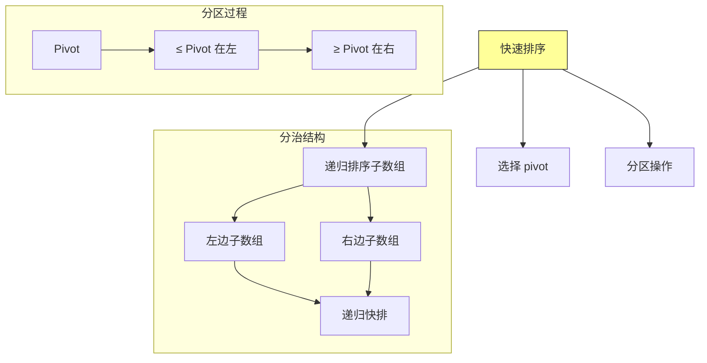

### 1.2 快速排序 vs 归并排序

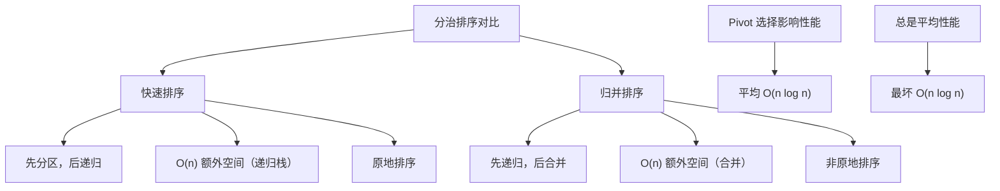

| 特性 | 快速排序 | 归并排序 |
|-----|---------|---------|
| 时间复杂度（平均） | O(n log n) | O(n log n) |
| 时间复杂度（最坏） | O(n²) | O(n log n) |
| 空间复杂度 | O(log n)（递归栈） | O(n)（合并） |
| 稳定性 | 不稳定 | 稳定 |
| 原地排序 | 是 | 否 |

---

## 二、Partition 分区操作

### 2.1 Lomuto 分区方案

**Lomuto 分区**是简单的分区方案，将最后一个元素作为 pivot。

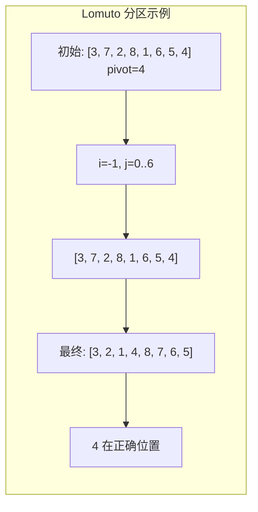

### 2.2 Lomuto 分区实现

```java
/**
 * Lomuto 分区方案
 */
public class QuickSortLomuto {

    /**
     * Lomuto 分区
     * 将 arr[right] 作为 pivot，将数组分为三部分：
     * - arr[0..i] ≤ pivot
     * - arr[i+1..right-1] > pivot
     * - arr[right] = pivot
     *
     * @param arr 数组
     * @param left 左边界
     * @param right 右边界
     * @return pivot 的最终位置
     */
    public static int partition(int[] arr, int left, int right) {
        int pivot = arr[right];  // 选择最后一个元素作为 pivot
        int i = left - 1;        // 小于 pivot 的区域边界

        for (int j = left; j < right; j++) {
            if (arr[j] <= pivot) {
                i++;
                swap(arr, i, j);
            }
        }

        // 将 pivot 放到正确位置
        swap(arr, i + 1, right);
        return i + 1;
    }

    /**
     * 快速排序
     */
    public static void sort(int[] arr, int left, int right) {
        if (left < right) {
            int pivotIndex = partition(arr, left, right);
            sort(arr, left, pivotIndex - 1);   // 排序左子数组
            sort(arr, pivotIndex + 1, right);  // 排序右子数组
        }
    }

    private static void swap(int[] arr, int i, int j) {
        int temp = arr[i];
        arr[i] = arr[j];
        arr[j] = temp;
    }
}
```

### 2.3 Hoare 分区方案

**Hoare 分区**是原始的分区方案，通常效率更高（交换次数更少）。

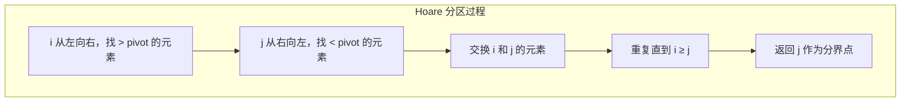

### 2.4 Hoare 分区实现

```java
/**
 * Hoare 分区方案（原始快排）
 */
public class QuickSortHoare {

    /**
     * Hoare 分区
     * 使用 arr[left] 作为 pivot
     *
     * @param arr 数组
     * @param left 左边界
     * @param right 右边界
     * @return 分界点索引
     */
    public static int partition(int[] arr, int left, int right) {
        int pivot = arr[left];  // 选择第一个元素作为 pivot
        int i = left - 1;       // 从左向右扫描
        int j = right + 1;      // 从右向左扫描

        while (true) {
            // i 向右移动，找到大于 pivot 的元素
            do {
                i++;
            } while (arr[i] < pivot);

            // j 向左移动，找到小于 pivot 的元素
            do {
                j--;
            } while (arr[j] > pivot);

            // 检查是否交叉
            if (i >= j) {
                return j;  // 分区完成
            }

            // 交换
            swap(arr, i, j);
        }
    }

    /**
     * 快速排序（Hoare 分区版）
     */
    public static void sort(int[] arr, int left, int right) {
        if (left < right) {
            int pivotIndex = partition(arr, left, right);
            sort(arr, left, pivotIndex);      // 注意：Hoare 返回的索引可能需要特殊处理
            sort(arr, pivotIndex + 1, right);
        }
    }

    private static void swap(int[] arr, int i, int j) {
        int temp = arr[i];
        arr[i] = arr[j];
        arr[j] = temp;
    }

    /**
     * Hoare 分区的变体（使用中点作为 pivot）
     */
    public static int partitionMid(int[] arr, int left, int right) {
        int pivot = arr[(left + right) / 2];
        int i = left - 1;
        int j = right + 1;

        while (true) {
            do { i++; } while (arr[i] < pivot);
            do { j--; } while (arr[j] > pivot);

            if (i >= j) return j;
            swap(arr, i, j);
        }
    }
}
```

### 2.5 两种分区方案对比

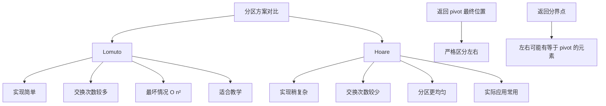

---

## 三、快速排序完整实现

### 3.1 基础实现

```java
import java.util.Random;

/**
 * 快速排序完整实现
 */
public class QuickSort {

    /**
     * 快速排序入口
     */
    public static void sort(int[] arr) {
        if (arr == null || arr.length <= 1) {
            return;
        }
        quickSort(arr, 0, arr.length - 1);
    }

    /**
     * 递归快速排序
     */
    private static void quickSort(int[] arr, int left, int right) {
        if (left < right) {
            int pivotIndex = partition(arr, left, right);
            quickSort(arr, left, pivotIndex - 1);
            quickSort(arr, pivotIndex + 1, right);
        }
    }

    /**
     * Lomuto 分区
     */
    private static int partition(int[] arr, int left, int right) {
        int pivot = arr[right];
        int i = left - 1;

        for (int j = left; j < right; j++) {
            if (arr[j] <= pivot) {
                i++;
                swap(arr, i, j);
            }
        }
        swap(arr, i + 1, right);
        return i + 1;
    }

    private static void swap(int[] arr, int i, int j) {
        int temp = arr[i];
        arr[i] = arr[j];
        arr[j] = temp;
    }
}
```

### 3.2 详细注释版

```java
/**
 * 快速排序详细注释版（教学用）
 */
public class QuickSortEducational {

    /**
     * 快速排序主方法
     *
     * 时间复杂度：
     * - 最好情况：O(n log n)
     * - 平均情况：O(n log n)
     * - 最坏情况：O(n²)
     *
     * 空间复杂度：O(log n)（递归栈）
     */
    public static void quickSort(int[] arr, int left, int right) {
        // ==========================================
        // 基准情况：如果子数组只有一个或零个元素，无需排序
        // ==========================================
        if (left >= right) {
            return;
        }

        // ==========================================
        // 步骤1：分区
        // 选择 pivot，并将数组分为两部分
        // 左半部分 ≤ pivot，右半部分 ≥ pivot
        // ==========================================
        int pivotIndex = partition(arr, left, right);

        // ==========================================
        // 步骤2：递归排序左右子数组
        // pivotIndex 位置的元素已经在正确位置
        // ==========================================
        // 排序左半部分：[left, pivotIndex - 1]
        quickSort(arr, left, pivotIndex - 1);

        // 排序右半部分：[pivotIndex + 1, right]
        quickSort(arr, pivotIndex + 1, right);
    }

    /**
     * Lomuto 分区实现
     *
     * 执行过程：
     * 1. 选择 arr[right] 作为 pivot
     * 2. i 指向小于 pivot 区域的末尾（初始为 left-1）
     * 3. j 从 left 遍历到 right-1
     * 4. 如果 arr[j] ≤ pivot，则将 arr[j] 交换到 i+1 的位置
     * 5. 最后将 pivot 交换到正确位置
     *
     * @param arr 待分区数组
     * @param left 左边界索引
     * @param right 右边界索引
     * @return pivot 的最终位置
     */
    private static int partition(int[] arr, int left, int right) {
        // 步骤1：选择 pivot（右端点）
        int pivot = arr[right];
        System.out.printf("分区范围: [%d, %d], pivot = %d, 子数组: ", left, right, pivot);
        printSubArray(arr, left, right);

        // 步骤2：初始化指针
        int i = left - 1;  // i 指向 ≤ pivot 区域的末尾

        // 步骤3：遍历数组
        for (int j = left; j < right; j++) {
            // 如果当前元素 ≤ pivot，扩展 ≤ 区域
            if (arr[j] <= pivot) {
                i++;
                // 将元素交换到 ≤ 区域的末尾
                if (i != j) {
                    System.out.printf("  交换 arr[%d]=%d 和 arr[%d]=%d\n", i, arr[i], j, arr[j]);
                    swap(arr, i, j);
                }
            }
        }

        // 步骤4：将 pivot 放到正确位置
        int pivotFinalPos = i + 1;
        System.out.printf("  将 pivot %d 放到位置 %d\n", pivot, pivotFinalPos);
        swap(arr, pivotFinalPos, right);

        System.out.println("  分区后: " + java.util.Arrays.toString(arr));
        System.out.println();

        return pivotFinalPos;
    }

    /**
     * 打印子数组（用于调试）
     */
    private static void printSubArray(int[] arr, int left, int right) {
        StringBuilder sb = new StringBuilder("[");
        for (int i = left; i <= right; i++) {
            sb.append(arr[i]);
            if (i < right) sb.append(", ");
        }
        sb.append("]");
        System.out.println(sb.toString());
    }

    private static void swap(int[] arr, int i, int j) {
        int temp = arr[i];
        arr[i] = arr[j];
        arr[j] = temp;
    }

    /**
     * 演示运行
     */
    public static void main(String[] args) {
        int[] arr = {3, 7, 2, 8, 1, 6, 5, 4};
        System.out.println("原始数组: " + java.util.Arrays.toString(arr));
        System.out.println("=".repeat(60));

        quickSort(arr, 0, arr.length - 1);

        System.out.println("=".repeat(60));
        System.out.println("排序结果: " + java.util.Arrays.toString(arr));
    }
}
```

### 3.3 运行过程示例

```
原始数组: [3, 7, 2, 8, 1, 6, 5, 4]
============================================================
分区范围: [0, 7], pivot = 4, 子数组: [3, 7, 2, 8, 1, 6, 5, 4]
  交换 arr[0]=3 和 arr[0]=3
  交换 arr[1]=3 和 arr[2]=2
  交换 arr[2]=3 和 arr[4]=1
  将 pivot 4 放到位置 3
  分区后: [3, 2, 1, 4, 8, 7, 6, 5]
...
```

---

## 四、快速排序的随机化

### 4.1 为什么需要随机化

**问题**：如果输入已经有序或接近有序，快速排序会退化为 O(n²)。

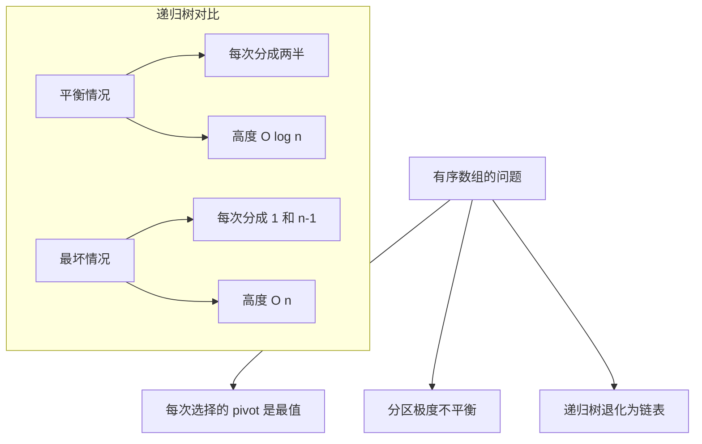

### 4.2 随机化快速排序实现

```java
import java.util.Random;

/**
 * 随机化快速排序
 * 通过随机选择 pivot 保证期望 O(n log n) 性能
 */
public class RandomizedQuickSort {

    private static final Random random = new Random();

    /**
     * 随机化快速排序
     *
     * 改进：随机选择 pivot，而非使用固定位置
     */
    public static void sort(int[] arr) {
        if (arr == null || arr.length <= 1) {
            return;
        }
        quickSort(arr, 0, arr.length - 1);
    }

    private static void quickSort(int[] arr, int left, int right) {
        if (left < right) {
            // 关键改进：随机选择 pivot 索引
            int pivotIndex = randomPartition(arr, left, right);
            quickSort(arr, left, pivotIndex - 1);
            quickSort(arr, pivotIndex + 1, right);
        }
    }

    /**
     * 随机分区：在 left 和 right 之间随机选择 pivot
     */
    private static int randomPartition(int[] arr, int left, int right) {
        // 1. 随机选择 pivot 索引
        int randomIndex = left + random.nextInt(right - left + 1);

        // 2. 将随机选择的 pivot 交换到 right 位置
        // 这样就可以使用 Lomuto 分区逻辑
        swap(arr, randomIndex, right);

        // 3. 使用 Lomuto 分区
        return partition(arr, left, right);
    }

    /**
     * Lomuto 分区（复用之前的实现）
     */
    private static int partition(int[] arr, int left, int right) {
        int pivot = arr[right];
        int i = left - 1;

        for (int j = left; j < right; j++) {
            if (arr[j] <= pivot) {
                i++;
                swap(arr, i, j);
            }
        }
        swap(arr, i + 1, right);
        return i + 1;
    }

    private static void swap(int[] arr, int i, int j) {
        int temp = arr[i];
        arr[i] = arr[j];
        arr[j] = temp;
    }

    /**
     * 带有详细统计的版本
     */
    public static class WithStatistics {
        private static long comparisonCount = 0;
        private static long swapCount = 0;

        public static void sort(int[] arr) {
            comparisonCount = 0;
            swapCount = 0;
            quickSort(arr, 0, arr.length - 1);
        }

        private static void quickSort(int[] arr, int left, int right) {
            if (left < right) {
                int pivotIndex = randomPartition(arr, left, right);
                quickSort(arr, left, pivotIndex - 1);
                quickSort(arr, pivotIndex + 1, right);
            }
        }

        private static int randomPartition(int[] arr, int left, int right) {
            int randomIndex = left + random.nextInt(right - left + 1);
            swap(arr, randomIndex, right);
            swapCount++;
            return partition(arr, left, right);
        }

        private static int partition(int[] arr, int left, int right) {
            int pivot = arr[right];
            int i = left - 1;

            for (int j = left; j < right; j++) {
                comparisonCount++;  // 计数比较
                if (arr[j] <= pivot) {
                    i++;
                    swap(arr, i, j);
                    swapCount++;
                }
            }
            swap(arr, i + 1, right);
            swapCount++;
            return i + 1;
        }

        private static void swap(int[] arr, int i, int j) {
            int temp = arr[i];
            arr[i] = arr[j];
            arr[j] = temp;
        }

        public static long getComparisonCount() {
            return comparisonCount;
        }

        public static long getSwapCount() {
            return swapCount;
        }

        public static void reset() {
            comparisonCount = 0;
            swapCount = 0;
        }
    }
}
```

### 4.3 随机化分析

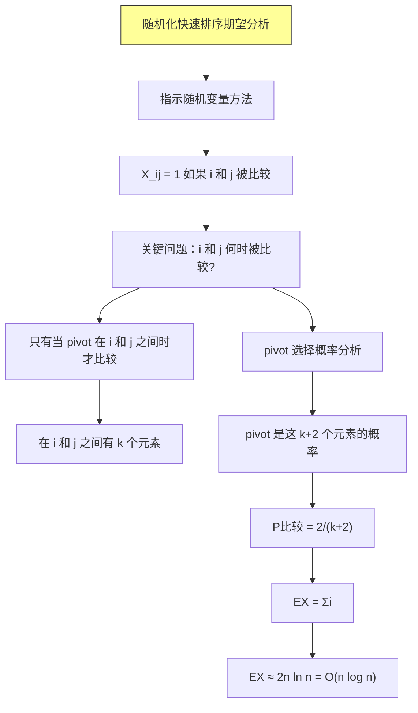

**期望比较次数推导**：
```
EX = Σi=1 to n-1 Σj=i+1 to n P(i 和 j 被比较)
   = Σi=1 to n-1 Σj=i+1 to n 2/(j-i+1)
   = 2 Σk=2 to n (n-k+1)/k
   ≈ 2n ln n
```

---

## 五、快速排序复杂度分析

### 5.1 最坏情况分析

**最坏情况**：每次分区都极度不平衡（1 : n-1）

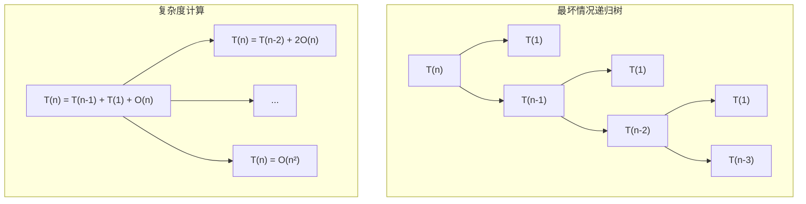

**递归式**：
$$T(n) = T(n-1) + T(1) + \Theta(n) = \Theta(n^2)$$

### 5.2 最好情况分析

**最好情况**：每次分区都平衡（n/2 : n/2）

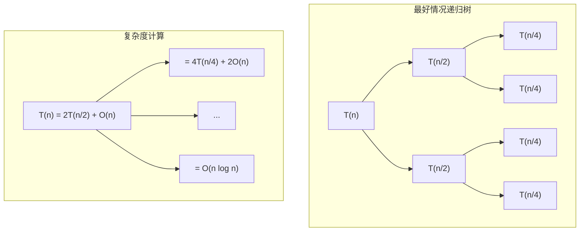

**递归式**：
$$T(n) = 2T(n/2) + \Theta(n) = \Theta(n \log n)$$

### 5.3 平均情况分析

**平均情况**：假设 pivot 的位置服从均匀分布

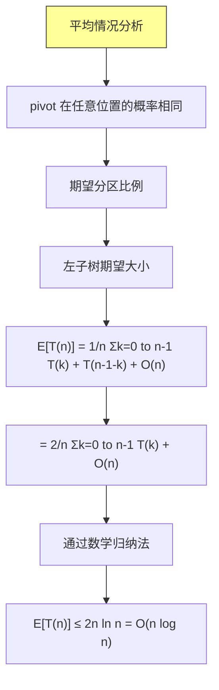

### 5.4 复杂度对比表

| 情况 | 时间复杂度 | 说明 |
|-----|-----------|------|
| 最好 | O(n log n) | 每次分区平衡 |
| 平均 | O(n log n) | 随机 pivot 的期望 |
| 最坏 | O(n²) | 每次分区极度不平衡 |
| 空间 | O(log n) | 递归栈深度 |

---

## 六、快速排序优化

### 6.1 三数取中法

**三数取中**：选择三个元素的中位数作为 pivot。

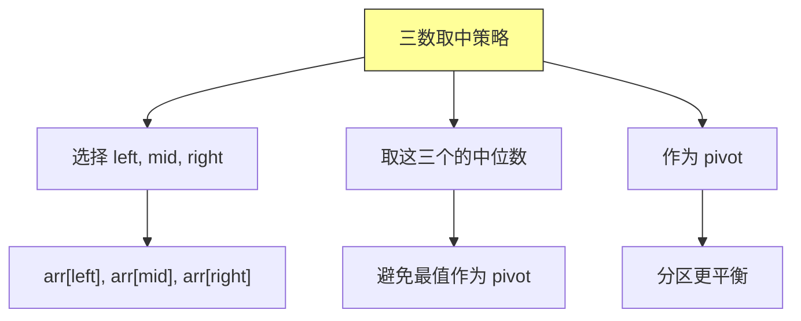

### 6.2 三数取中实现

```java
/**
 * 快速排序优化版：三数取中
 */
public class QuickSortMedianOfThree {

    /**
     * 三数取中：返回中位数的索引
     */
    private static int medianOfThree(int[] arr, int left, int right) {
        int mid = left + (right - left) / 2;

        // 对 left, mid, right 进行排序
        if (arr[left] > arr[mid]) {
            swap(arr, left, mid);
        }
        if (arr[left] > arr[right]) {
            swap(arr, left, right);
        }
        if (arr[mid] > arr[right]) {
            swap(arr, mid, right);
        }

        // 将中位数交换到 right-1 位置
        swap(arr, mid, right - 1);
        return right - 1;
    }

    /**
     * 优化版快速排序
     */
    public static void sort(int[] arr) {
        quickSort(arr, 0, arr.length - 1);
    }

    private static void quickSort(int[] arr, int left, int right) {
        if (left < right) {
            // 处理小区间：小数组使用插入排序
            if (right - left < 10) {
                insertionSort(arr, left, right);
                return;
            }

            // 三数取中选择 pivot
            int pivotIndex = medianOfThree(arr, left, right);
            int pivot = arr[pivotIndex];

            // Lomuto 分区（pivot 在 right-1）
            int i = left;
            int j = right - 1;

            while (true) {
                while (arr[++i] < pivot) {}
                while (arr[--j] > pivot) {}

                if (i < j) {
                    swap(arr, i, j);
                } else {
                    break;
                }
            }

            // 恢复 pivot 到正确位置
            swap(arr, i, right - 1);

            quickSort(arr, left, i - 1);
            quickSort(arr, i + 1, right);
        }
    }

    /**
     * 小数组使用插入排序
     */
    private static void insertionSort(int[] arr, int left, int right) {
        for (int i = left + 1; i <= right; i++) {
            int key = arr[i];
            int j = i - 1;
            while (j >= left && arr[j] > key) {
                arr[j + 1] = arr[j];
                j--;
            }
            arr[j + 1] = key;
        }
    }

    private static void swap(int[] arr, int i, int j) {
        int temp = arr[i];
        arr[i] = arr[j];
        arr[j] = temp;
    }
}
```

### 6.3 尾递归优化

```java
/**
 * 快速排序尾递归优化版
 */
public class QuickSortTailRecursion {

    /**
     * 尾递归优化
     * 先排序较小的子数组，较大的子数组使用尾递归
     * 减少递归栈深度
     */
    public static void sort(int[] arr) {
        quickSort(arr, 0, arr.length - 1);
    }

    private static void quickSort(int[] arr, int left, int right) {
        while (left < right) {
            int pivotIndex = partition(arr, left, right);

            // 先排序较小的子数组
            if (pivotIndex - left < right - pivotIndex) {
                quickSort(arr, left, pivotIndex - 1);
                left = pivotIndex + 1;  // 尾递归变循环
            } else {
                quickSort(arr, pivotIndex + 1, right);
                right = pivotIndex - 1;
            }
        }
    }

    private static int partition(int[] arr, int left, int right) {
        int pivot = arr[right];
        int i = left - 1;

        for (int j = left; j < right; j++) {
            if (arr[j] <= pivot) {
                i++;
                swap(arr, i, j);
            }
        }
        swap(arr, i + 1, right);
        return i + 1;
    }

    private static void swap(int[] arr, int i, int j) {
        int temp = arr[i];
        arr[i] = arr[j];
        arr[j] = temp;
    }
}
```

### 6.4 优化策略总结

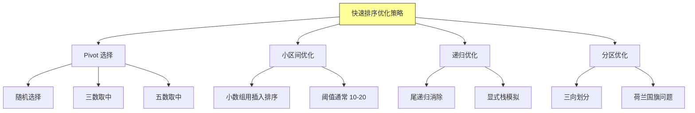

---

## 七、快速选择算法

### 7.1 问题描述

**快速选择**：在未排序的数组中找到第 k 小的元素。

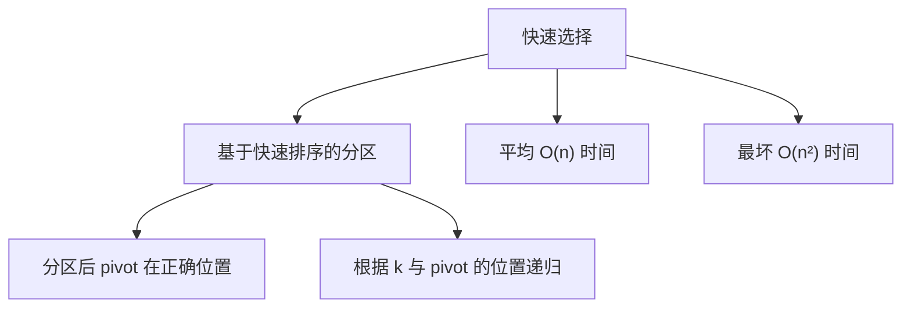

### 7.2 快速选择实现

```java
/**
 * 快速选择算法
 */
public class QuickSelect {

    /**
     * 找到第 k 小的元素（1-indexed）
     *
     * @param arr 数组
     * @param k 第 k 小，1 ≤ k ≤ n
     * @return 第 k 小的元素值
     */
    public static int select(int[] arr, int k) {
        return quickSelect(arr, 0, arr.length - 1, k - 1);  // 转为 0-indexed
    }

    /**
     * 快速选择核心实现
     */
    private static int quickSelect(int[] arr, int left, int right, int k) {
        if (left == right) {
            return arr[left];
        }

        // 分区，获取 pivot 位置
        int pivotIndex = partition(arr, left, right);

        if (k == pivotIndex) {
            return arr[k];  // 找到第 k 小
        } else if (k < pivotIndex) {
            return quickSelect(arr, left, pivotIndex - 1, k);  // 在左半部分查找
        } else {
            return quickSelect(arr, pivotIndex + 1, right, k);  // 在右半部分查找
        }
    }

    /**
     * Lomuto 分区
     */
    private static int partition(int[] arr, int left, int right) {
        int pivot = arr[right];
        int i = left - 1;

        for (int j = left; j < right; j++) {
            if (arr[j] <= pivot) {
                i++;
                swap(arr, i, j);
            }
        }
        swap(arr, i + 1, right);
        return i + 1;
    }

    private static void swap(int[] arr, int i, int j) {
        int temp = arr[i];
        arr[i] = arr[j];
        arr[j] = temp;
    }

    /**
     * 随机化快速选择
     */
    public static int selectRandomized(int[] arr, int k) {
        return quickSelectRandomized(arr, 0, arr.length - 1, k - 1);
    }

    private static int quickSelectRandomized(int[] arr, int left, int right, int k) {
        if (left == right) {
            return arr[left];
        }

        // 随机选择 pivot
        int randomIndex = left + (int) (Math.random() * (right - left + 1));
        swap(arr, randomIndex, right);

        int pivotIndex = partition(arr, left, right);

        if (k == pivotIndex) {
            return arr[k];
        } else if (k < pivotIndex) {
            return quickSelectRandomized(arr, left, pivotIndex - 1, k);
        } else {
            return quickSelectRandomized(arr, pivotIndex + 1, right, k);
        }
    }

    /**
     * 查找第 k 大的元素
     */
    public static int findKthLargest(int[] arr, int k) {
        return quickSelect(arr, 0, arr.length - 1, arr.length - k);
    }
}
```

### 7.3 复杂度分析

| 算法 | 平均时间 | 最坏时间 | 空间 |
|-----|---------|---------|------|
| 快速选择 | O(n) | O(n²) | O(log n) |
| 堆选择 | O(n log k) | O(n log k) | O(k) |
| 排序后选择 | O(n log n) | O(n log n) | O(1) |

---

## 八、三向划分快速排序

### 8.1 荷兰国旗问题

**荷兰国旗问题**：将数组划分为三个部分：小于 pivot、等于 pivot、大于 pivot。

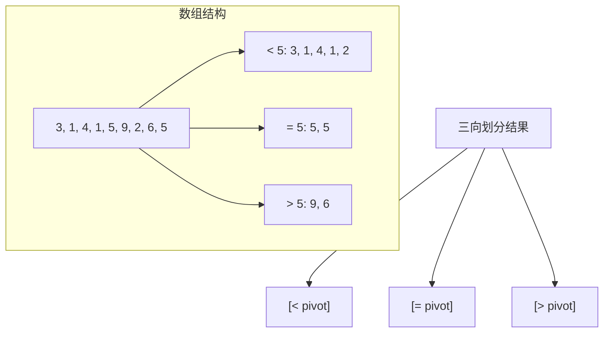

### 8.2 三向划分实现

```java
/**
 * 三向划分快速排序
 * 处理大量重复元素时效率更高
 */
public class QuickSortThreeWay {

    /**
     * 三向划分排序
     *
     * @param arr 待排序数组
     */
    public static void sort(int[] arr) {
        quickSort(arr, 0, arr.length - 1);
    }

    private static void quickSort(int[] arr, int left, int right) {
        if (left >= right) {
            return;
        }

        // 三向划分
        int[] pivotRange = threeWayPartition(arr, left, right);

        // 递归排序小于和大于的部分
        // 等于 pivot 的部分已经有序，无需排序
        quickSort(arr, left, pivotRange[0] - 1);
        quickSort(arr, pivotRange[1] + 1, right);
    }

    /**
     * 三向划分（Dijkstra 算法）
     *
     * 返回 [lt, gt]，表示等于 pivot 的范围 [lt, gt]
     *
     *  Invariant（不变量）：
     *  - arr[0..lt-1] < pivot
     *  - arr[lt..gt] = pivot
     *  - arr[gt+1..right] > pivot
     *  - arr[lt..i] 未处理
     */
    private static int[] threeWayPartition(int[] arr, int left, int right) {
        int pivot = arr[right];
        int lt = left;      // 小于 pivot 的末尾
        int gt = right - 1; // 大于 pivot 的开头
        int i = left;       // 扫描指针

        while (i <= gt) {
            if (arr[i] < pivot) {
                // arr[i] < pivot，交换到左边
                swap(arr, lt, i);
                lt++;
                i++;
            } else if (arr[i] > pivot) {
                // arr[i] > pivot，交换到右边
                swap(arr, i, gt);
                gt--;
                // 注意：i 不增加，因为交换过来的元素还未处理
            } else {
                // arr[i] = pivot，继续扫描
                i++;
            }
        }

        // 将 pivot 放到正确位置（与 gt+1 交换）
        swap(arr, gt + 1, right);

        return new int[]{lt, gt + 1};
    }

    private static void swap(int[] arr, int i, int j) {
        int temp = arr[i];
        arr[i] = arr[j];
        arr[j] = temp;
    }

    /**
     * Bentley-McIlroy 三向划分（更简洁）
     */
    public static void sortBentley(int[] arr) {
        quickSortBentley(arr, 0, arr.length - 1);
    }

    private static void quickSortBentley(int[] arr, int left, int right) {
        if (left >= right) return;

        int i = left, j = right;
        int pivot = arr[left + (right - left) / 2];

        while (i <= j) {
            while (arr[i] < pivot) i++;
            while (arr[j] > pivot) j--;

            if (i <= j) {
                swap(arr, i, j);
                i++;
                j--;
            }
        }

        if (left < j) quickSortBentley(arr, left, j);
        if (i < right) quickSortBentley(arr, i, right);
    }
}
```

### 8.3 三向划分分析

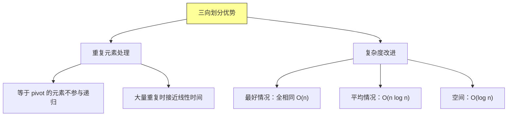

---

## 九、Java 实现

```java
import java.util.Random;

/**
 * 快速排序 Java 实现
 */
public class QuickSortJava {

    /**
     * 快速排序基础版
     */
    public static class Basic {
        public static void sort(int[] arr) {
            if (arr == null || arr.length <= 1) return;
            quickSort(arr, 0, arr.length - 1);
        }

        private static void quickSort(int[] arr, int left, int right) {
            if (left < right) {
                int pivotIdx = partition(arr, left, right);
                quickSort(arr, left, pivotIdx - 1);
                quickSort(arr, pivotIdx + 1, right);
            }
        }

        private static int partition(int[] arr, int left, int right) {
            int pivot = arr[right];
            int i = left - 1;

            for (int j = left; j < right; j++) {
                if (arr[j] <= pivot) {
                    i++;
                    swap(arr, i, j);
                }
            }
            swap(arr, i + 1, right);
            return i + 1;
        }

        private static void swap(int[] arr, int i, int j) {
            int temp = arr[i];
            arr[i] = arr[j];
            arr[j] = temp;
        }
    }

    /**
     * 随机化快速排序
     */
    public static class Randomized {
        private static final Random random = new Random();

        public static void sort(int[] arr) {
            if (arr == null || arr.length <= 1) return;
            quickSort(arr, 0, arr.length - 1);
        }

        private static void quickSort(int[] arr, int left, int right) {
            if (left < right) {
                int pivotIdx = randomPartition(arr, left, right);
                quickSort(arr, left, pivotIdx - 1);
                quickSort(arr, pivotIdx + 1, right);
            }
        }

        private static int randomPartition(int[] arr, int left, int right) {
            int pivotIdx = left + random.nextInt(right - left + 1);
            swap(arr, pivotIdx, right);
            return partition(arr, left, right);
        }

        private static int partition(int[] arr, int left, int right) {
            int pivot = arr[right];
            int i = left - 1;

            for (int j = left; j < right; j++) {
                if (arr[j] <= pivot) {
                    i++;
                    swap(arr, i, j);
                }
            }
            swap(arr, i + 1, right);
            return i + 1;
        }

        private static void swap(int[] arr, int i, int j) {
            int temp = arr[i];
            arr[i] = arr[j];
            arr[j] = temp;
        }
    }

    /**
     * 快速选择
     */
    public static class QuickSelect {
        public static int select(int[] arr, int k) {
            // k 从 1 开始
            return quickSelect(arr, 0, arr.length - 1, k - 1);
        }

        private static int quickSelect(int[] arr, int left, int right, int k) {
            if (left == right) return arr[left];

            int pivotIdx = partition(arr, left, right);

            if (k == pivotIdx) return arr[k];
            else if (k < pivotIdx) return quickSelect(arr, left, pivotIdx - 1, k);
            else return quickSelect(arr, pivotIdx + 1, right, k);
        }

        private static int partition(int[] arr, int left, int right) {
            int pivot = arr[right];
            int i = left - 1;

            for (int j = left; j < right; j++) {
                if (arr[j] <= pivot) {
                    i++;
                    swap(arr, i, j);
                }
            }
            swap(arr, i + 1, right);
            return i + 1;
        }

        private static void swap(int[] arr, int i, int j) {
            int temp = arr[i];
            arr[i] = arr[j];
            arr[j] = temp;
        }
    }

    /**
     * 三向划分快速排序
     */
    public static class ThreeWay {
        public static void sort(int[] arr) {
            if (arr == null || arr.length <= 1) return;
            quickSort(arr, 0, arr.length - 1);
        }

        private static void quickSort(int[] arr, int left, int right) {
            if (left >= right) return;

            int[] range = threeWayPartition(arr, left, right);
            quickSort(arr, left, range[0] - 1);
            quickSort(arr, range[1] + 1, right);
        }

        private static int[] threeWayPartition(int[] arr, int left, int right) {
            int pivot = arr[right];
            int lt = left;      // < pivot 的末尾
            int gt = right - 1; // > pivot 的开头
            int i = left;

            while (i <= gt) {
                if (arr[i] < pivot) {
                    swap(arr, lt, i);
                    lt++;
                    i++;
                } else if (arr[i] > pivot) {
                    swap(arr, i, gt);
                    gt--;
                } else {
                    i++;
                }
            }
            swap(arr, gt + 1, right);
            return new int[]{lt, gt + 1};
        }

        private static void swap(int[] arr, int i, int j) {
            int temp = arr[i];
            arr[i] = arr[j];
            arr[j] = temp;
        }
    }

    public static void main(String[] args) {
        int[] arr = {3, 7, 2, 8, 1, 6, 5, 4};

        // 测试基础快排
        int[] copy1 = arr.clone();
        Basic.sort(copy1);
        System.out.println("快速排序: " + java.util.Arrays.toString(copy1));

        // 测试随机快排
        int[] copy2 = arr.clone();
        Randomized.sort(copy2);
        System.out.println("随机快速排序: " + java.util.Arrays.toString(copy2));

        // 测试三向划分
        int[] copy3 = {3, 1, 4, 1, 5, 9, 2, 6, 5};
        ThreeWay.sort(copy3);
        System.out.println("三向划分排序: " + java.util.Arrays.toString(copy3));

        // 测试快速选择
        int[] copy4 = arr.clone();
        int kth = QuickSelect.select(copy4, 3);
        System.out.println("第3小元素: " + kth);
    }
}
```

---

## 十、总结与要点

### 10.1 核心概念回顾

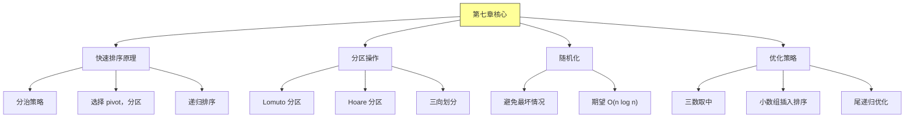

### 10.2 算法复杂度总结

| 算法 | 平均 | 最坏 | 空间 | 稳定性 |
|-----|------|------|------|--------|
| 基础快排 | O(n log n) | O(n²) | O(log n) | 不稳定 |
| 随机快排 | O(n log n) | O(n²) | O(log n) | 不稳定 |
| 三向划分 | O(n) 重复多 | O(n²) | O(log n) | 不稳定 |
| 快速选择 | O(n) | O(n²) | O(log n) | 不稳定 |

### 10.3 选择 pivot 的策略

| 策略 | 优点 | 缺点 |
|-----|------|------|
| 固定位置（左/右） | 简单 | 有序数组最坏 |
| 随机选择 | 避免特定最坏 | 需要随机数 |
| 三数取中 | 更平衡 | 稍复杂 |
| 五数取中 | 更稳定 | 更复杂 |

### 10.4 适用场景

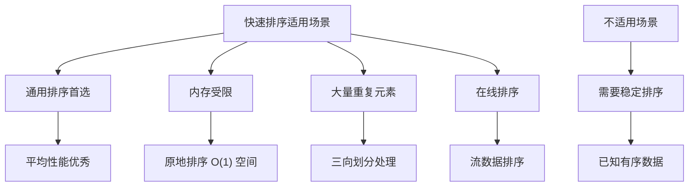

---

## 十一、举一反三

### 11.1 相关 LeetCode 题目

| 题目 | 难度 | 核心考点 |
|-----|------|---------|
| [912. 排序数组](https://leetcode.cn/problems/sort-an-array/) | 中等 | 快速排序实现 |
| [215. 数组中的第 K 个最大元素](https://leetcode.cn/problems/kth-largest-element-in-an-array/) | 中等 | 快速选择 |
| [347. 前 K 个高频元素](https://leetcode.cn/problems/top-k-frequent-elements/) | 中等 | 桶排序 + 快速排序 |
| [973. 最接近原点的 K 个点](https://leetcode.cn/problems/k-closest-points-to-origin/) | 中等 | 自定义排序 |
| [324. 摆动排序 II](https://leetcode.cn/problems/wiggle-sort-ii/) | 中等 | 三向划分 |
| [75. 颜色分类](https://leetcode.cn/problems/sort-colors/) | 中等 | 三向划分（荷兰国旗） |
| [4. 寻找两个正序数组的中位数](https://leetcode.cn/problems/median-of-two-sorted-arrays/) | 困难 | 二分查找 |
| [295. 数据流的中位数](https://leetcode.cn/problems/find-median-from-data-stream/) | 困难 | 双堆 |

### 11.2 经典题目解析

#### 题目：75. 颜色分类

**题目描述**：给定一个包含红色、白色和蓝色，共 n 个元素的数组 nums，对它们进行原地排序，使得相同颜色的元素相邻，红、白、蓝分别对应 0、1、2。

**解题思路**：

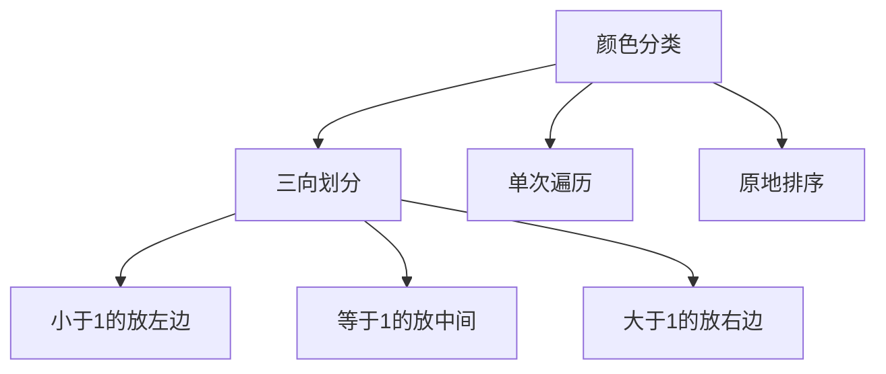

**Java 实现**：
```java
class Solution {
    public void sortColors(int[] nums) {
        int n = nums.length;
        int lt = 0;      // 0到lt-1: < 1
        int gt = n - 1;  // gt+1到n-1: > 1
        int i = 0;

        while (i <= gt) {
            if (nums[i] == 0) {
                swap(nums, lt, i);
                lt++;
                i++;
            } else if (nums[i] == 1) {
                i++;
            } else {
                swap(nums, i, gt);
                gt--;
            }
        }
    }

    private void swap(int[] nums, int i, int j) {
        int temp = nums[i];
        nums[i] = nums[j];
        nums[j] = temp;
    }
}
```

**复杂度分析**：
| 指标 | 值 |
|-----|-----|
| 时间 | O(n) |
| 空间 | O(1) |
| 遍历次数 | 1 次 |

---

### 11.3 变形题目

1. **变体排序问题**：
   - 摆动排序（奇数位大于等于相邻偶数位）
   - 按奇偶排序（奇数在前，偶数在后）
   - 荷兰国旗问题的各种变体

2. **选择问题**：
   - 第 K 小的元素
   - 第 K 大的元素
   - 中位数（奇偶长度）
   - TOP-K 问题

3. **优化问题**：
   - 非递归实现（栈模拟）
   - 尾递归优化
   - 小数组使用插入排序

### 11.4 核心思想迁移

| 思想 | 迁移应用 |
|-----|---------|
| 分区思想 | 快速选择、荷兰国旗问题 |
| 随机化 | 避免最坏情况、概率分析 |
| 三向划分 | 处理重复元素、颜色排序 |
| 分治策略 | 各类选择问题 |

### 11.5 思考题答案

**题目 1**：随机化快速排序的期望比较次数
- 使用指示随机变量 X_ij 分析
- 任意元素对 (i, j) 被比较的概率为 2/(j-i+1)
- 期望 E[X] = Σ 2/(j-i+1) ≈ 2n ln n = O(n log n)

**题目 2**：非递归快速排序
- 使用栈存储待排序子数组的边界
- 空间复杂度：O(log n)（平均），O(n)（最坏）
- 避免了递归栈溢出问题

**题目 3**：三向划分优于普通快排的情况
- 数组中存在大量重复元素时
- 时间复杂度从 O(n log n) 提升到接近 O(n)
- 适用于颜色分类、0-1 排序等场景

**题目 4**：O(n) 时间找中位数
- 使用快速选择算法
- 每次 partition 后只递归一侧
- 期望时间复杂度 O(n)，最坏 O(n²)

**题目 5**：快速排序 vs 堆排序对比
| 特性 | 快速排序 | 堆排序 |
|-----|---------|--------|
| 平均性能 | O(n log n) 更优 | O(n log n) |
| 最坏性能 | O(n²) | O(n log n) |
| 空间 | O(log n) | O(1) |
| 缓存友好 | 是 | 否 |
| 适用场景 | 通用排序 | 内存受限 |

---

*本章精读笔记完成*
