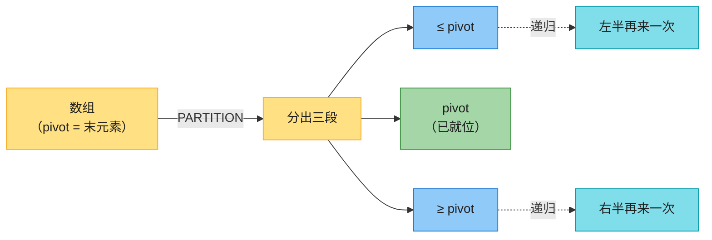
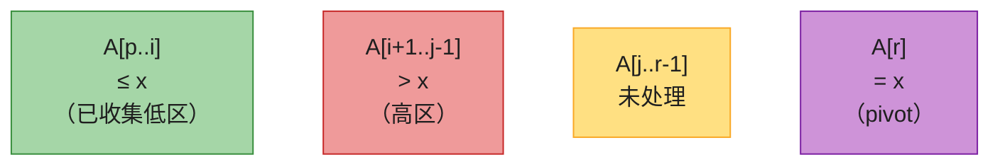
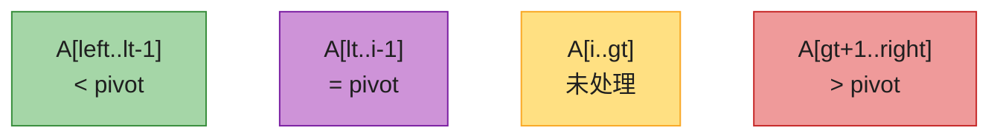

# 第七章：快速排序（Quicksort）

> **定位**：快速排序是分治排序的代表作，与第 2 章归并排序并称双子星，都是第 4 章分治策略的实例。它用**分区**替代归并的**合并**——把大问题切成两个独立子问题，递归求解后无需合并。
> 与归并 / 堆排序（最坏 Θ(n lg n)）相比，快排最坏 Θ(n²)，但**平均 Θ(n lg n) 且常数因子最小、原地排序、缓存友好**，是工程上最常用的内排序（`Arrays.sort` 对基本类型即用其变体）。
> 本章聚焦四件事，正好对应原书四节：**分区 → 随机化 → 性能分析 → 工程优化**。
> **后向指针**：分区的思想还催生了期望 O(n) 的 **quickselect**（找第 k 小）和**线性时间选择**——那是**第 9 章**的主题，本章只在分区处点一句，实现留到第 9 章。
>
> 对照第四版书页 181–204。

---

## 一、核心思想

一句话：**选一个基准（pivot），把数组切成「≤ pivot」和「≥ pivot」两半，对两半各自再来一次，直到每段只剩一个元素。**

「切」（分区）是全部工作；切完无需合并——pivot 已就位，左右各自独立。



对比归并：归并「**先递归后合并**」（合并需 Θ(n) 额外空间），快排「**先分区后递归**」（原地，递归栈 Θ(lg n)）。

| 特性 | 快速排序 | 归并排序 |
|------|---------|---------|
| 分治顺序 | 先分区，后递归 | 先递归，后合并 |
| 额外空间 | Θ(lg n)（递归栈） | Θ(n)（合并数组） |
| 最坏时间 | Θ(n²) | Θ(n lg n) |
| 平均时间 | Θ(n lg n) | Θ(n lg n) |
| 原地 | 是 | 否 |
| 稳定 | 否 | 是 |

---

## 二、分区（PARTITION）——全章的钥匙

### 2.1 直觉

取数组**最后一个元素 `A[r]`** 当 pivot。用扫描指针 `j` 从左到右走，指针 `i` 标记「已收集的 ≤ pivot 区」的右端：

- 遇到 `A[j] ≤ pivot`：收进 ≤ 区（`i++` 后与 `A[j]` 交换）；
- 遇到 `A[j] > pivot`：跳过。

扫到底，把 pivot 换到 `i+1`——它恰好把左右两区分开，且**从此待在最终排序位置上**（后续递归不再碰它）。

### 2.2 过程示例（CLRS Figure 7.1）

`A = [2, 8, 7, 1, 3, 5, 6, 4]`，pivot `x = A[r] = 4`（0-indexed，r = 7）。每一行是一个数组快照，**加粗**为该步发生交换的位置：

| 步骤 | A[0] | A[1] | A[2] | A[3] | A[4] | A[5] | A[6] | A[7]=pivot | 动作 |
|------|:----:|:----:|:----:|:----:|:----:|:----:|:----:|:----:|------|
| 初始 i=−1 | 2 | 8 | 7 | 1 | 3 | 5 | 6 | **4** | j 开始扫 |
| j=0：2≤4，i=0 | 2 | 8 | 7 | 1 | 3 | 5 | 6 | **4** | swap(0,0) |
| j=1：8>4 | 2 | 8 | 7 | 1 | 3 | 5 | 6 | **4** | 跳过 |
| j=2：7>4 | 2 | 8 | 7 | 1 | 3 | 5 | 6 | **4** | 跳过 |
| j=3：1≤4，i=1 | 2 | **1** | 7 | **8** | 3 | 5 | 6 | **4** | swap(1,3) |
| j=4：3≤4，i=2 | 2 | 1 | **3** | 8 | **7** | 5 | 6 | **4** | swap(2,4) |
| j=5：5>4 | 2 | 1 | 3 | 8 | 7 | 5 | 6 | **4** | 跳过 |
| j=6：6>4 | 2 | 1 | 3 | 8 | 7 | 5 | 6 | **4** | 跳过 |
| swap(3,7)：pivot 就位 | 2 | 1 | 3 | **4** | 7 | 5 | 6 | 8 | return 3 |

一轮分区后 `A = [2,1,3, **4**, 7,5,6,8]`，pivot 4 落在下标 3。左边 `[2,1,3]`、右边 `[7,5,6,8]` 仍未排好，交给下一轮递归。

### 2.3 循环不变量（理解正确性的核心）

每轮 `for` 循环开始时，数组被分成**四个区域**：



> **不变量**：① `A[p..i]` 中元素都 ≤ x；② `A[i+1..j-1]` 中元素都 > x；③ `A[r] = x`。

- **初始化**：`i = p−1`，低区和高区都空，只有 pivot 满足 ③。
- **保持**：`A[j] ≤ x` 时 `i++` 并交换 `A[i]↔A[j]`，新 `A[i]` ≤ x（满足①），被换到 `A[j-1]` 的旧低区元素... 实际是把 `A[j]` 纳入低区；`A[j] > x` 时跳过，自然落入高区。
- **终止**：`j = r`，未处理区空。最后 `swap(A[i+1], A[r])` 把 pivot 放到低区紧右侧——正好是它的最终位置。

### 2.4 伪代码（CLRS 第四版，1-indexed）

```
PARTITION(A, p, r)
1  x = A[r]                  // the pivot
2  i = p - 1                 // highest index into the low side
3  for j = p to r - 1        // process each element other than the pivot
4      if A[j] <= x          // does this element belong on the low side?
5          i = i + 1         // index of a new slot in the low side
6          exchange A[i] with A[j]
7  exchange A[i+1] with A[r] // pivot goes just to the right of the low side
8  return i + 1              // new index of the pivot
```

```
QUICKSORT(A, p, r)
1  if p < r
2      q = PARTITION(A, p, r)
3      QUICKSORT(A, p, q-1)   // recursively sort the low side
4      QUICKSORT(A, q+1, r)   // recursively sort the high side
```

> **下标记法**：CLRS 用 1-indexed（`p..r` 含两端）。可运行代码统一 **0-indexed**：`left ↔ p`、`right ↔ r`，PARTITION 取 `A[right]`，递归 `(left, q−1)` 与 `(q+1, right)`。换算与第 6 章堆一致：左右子区间靠下标范围决定，无固定公式。

PARTITION 本身 Θ(n)（扫描一遍）。QUICKSORT 的总复杂度**完全取决于分区有多平衡**。

---

## 三、性能分析

### 3.1 最坏情况：Θ(n²)

每次都分出 `1 : n−1`（典型触发：输入已有序 + 总取末元素为 pivot）。递归树退化为一条链，每层 Θ(n)，共 n 层：

```
T(n) = T(n-1) + T(0) + Θ(n) = Θ(n²)
```

### 3.2 最好 / 平衡情况：Θ(n lg n)

每次接近 `n/2 : n/2`：

```
T(n) = 2T(n/2) + Θ(n) = Θ(n lg n)      // 每层 Θ(n)，共 Θ(lg n) 层
```

> 即便**不是严格对半**，只要每层分出固定比例 `α : (1−α)`（0 < α < 1，常数），递归树深度仍是 Θ(lg n)，总时间仍是 Θ(n lg n)——快排对「差不多平衡」很宽容（习题 7.2-5/7.2-6）。

### 3.3 期望：Θ(n lg n)（随机化的关键结论）

随机选 pivot 后，**期望比较次数 E[X] = Θ(n lg n)**。推导只靠一个关键观察：

> **两元素何时被比较？** 把元素按排序后的位置记为 z₁ < z₂ < … < zₙ。zᵢ 与 zⱼ（i < j）被比较，**当且仅当** zᵢ、zⱼ 中有一个是集合 Zᵢⱼ = {zᵢ, …, zⱼ} 里**第一个被选为 pivot 的**。否则它们在某次更早的分区就被划到两侧，永不再见（且任意两元素**至多比较一次**）。

Zᵢⱼ 共 `j−i+1` 个元素，首个 pivot 恰好是 zᵢ 或 zⱼ 的概率 = **2 / (j−i+1)**。于是：

```
E[X] = Σ_{1≤i<j≤n} Pr{zᵢ 与 zⱼ 比较}
     = Σ_{i<j} 2/(j-i+1)
     = Σ_{k=2}^{n} (n-k+1) · 2/k        // 令 k = j-i+1 按距离分组
     ≈ 2n · Σ 1/k
     = Θ(n lg n)                          // 调和级数 ≈ ln n
```

一句话直觉：「任意两元素被比较的概率，反比于它们在排序序列中的距离；加总起来是 n lg n 量级。」这就是为什么随机化能把最坏 Θ(n²) 变成期望 Θ(n lg n)。

### 3.4 复杂度速查

| 情况 | 时间 | 触发条件 |
|------|------|---------|
| 最好 | Θ(n lg n) | 每次分区接近平衡 |
| 平均 / 期望 | Θ(n lg n) | 随机 pivot |
| 最坏 | Θ(n²) | 每次极不平衡（已排序输入 + 固定取末元素） |
| 空间 | Θ(lg n) 期望 / Θ(n) 最坏 | 递归栈；尾递归优化后最坏也 Θ(lg n) |

---

## 四、随机化（RANDOMIZED-QUICKSORT）

### 4.1 为什么

最坏 Θ(n²) 常被**特定输入**触发（已排序、近似排序）。随机选 pivot 把「最坏」从「某类输入」变成「极低概率事件」——**对任意输入都给 Θ(n lg n) 期望**。许多标准库（排序大数据集时）正是用随机化快排。

### 4.2 伪代码

```
RANDOMIZED-PARTITION(A, p, r)
1  i = RANDOM(p, r)
2  exchange A[r] with A[i]     // 随机选一个换到末尾
3  return PARTITION(A, p, r)   // 其余复用 PARTITION

RANDOMIZED-QUICKSORT(A, p, r)
1  if p < r
2      q = RANDOMIZED-PARTITION(A, p, r)
3      RANDOMIZED-QUICKSORT(A, p, q-1)
4      RANDOMIZED-QUICKSORT(A, q+1, r)
```

只比 PARTITION 多一步：随机选一个位置换到 `r`，其余原样复用——这是第四版相对朴素的「先整体随机洗牌」更轻量的做法。

---

## 五、工程优化

理论上的 Θ(n lg n) 期望，还要靠工程手段落地：

| 优化 | 解决什么 | 出处 |
|------|---------|------|
| **随机化 pivot** | 避免特定输入触发最坏 | §7.3 |
| **三数取中** | 比纯随机更稳，常数更小 | 思考题 7-6 |
| **小区间切插排** | n 很小时插排常数更小 | 习题 7.4-5 |
| **尾递归消除** | 把栈深从最坏 Θ(n) 压到 Θ(lg n) | 思考题 7-5 |
| **三向划分** | 大量重复元素时逼近 Θ(n) | 思考题 7-2 |

### 5.1 三数取中（median-of-3）

取 `A[left]`、`A[mid]`、`A[right]` 的中位数做 pivot。比纯随机更稳（得到差分区的概率更低，见习题 7.4-6 / 思考题 7-6 的概率分析），但**只改善常数因子，渐近仍是 Θ(n lg n)**。

### 5.2 小区间改用插入排序

递归到子数组长度 `< k`（典型 k = 10～16）时停止递归，改用插入排序（n 小时插排的比较/交换常数远小于快排的函数调用开销）。期望时间 `O(nk + n lg(n/k))`（习题 7.4-5）。实践中 k ≈ 10～16 是经验甜点。

### 5.3 尾递归消除（限制栈深）

QUICKSORT 有两个递归调用，**第二个是尾调用**，可改成循环：

```
TAIL-QUICKSORT(A, p, r)        // 思考题 7-5
1  while p < r
2      q = PARTITION(A, p, r)
3      TAIL-QUICKSORT(A, p, q-1)   // 只递归一侧
4      p = q + 1                   // 另一侧用循环
```

但只做这一步，**最坏栈深仍是 Θ(n)**（总先递归左侧，若左侧总是大的那段）。进一步：**每轮先递归较小的子数组、较大的子数组用循环**，则栈深严格 Θ(lg n)（思考题 7-5-c）——因为先处理的小段规模至多一半。

### 5.4 三向划分（Dijkstra 荷兰国旗法）

含大量重复元素时，普通 PARTITION 让重复元素反复进入子问题（习题 7.1-2：全相等时每次分出 `(n−1) : 0`，退化为 Θ(n²)）。**三向划分**把数组切成 `< pivot / = pivot / > pivot` 三段，等于段不再递归。全相等时直接 Θ(n)。这正是思考题 7-2 的 `PARTITION'`。



扫描指针 `i` 从左到右，遇到 `< pivot` 换到左段、`> pivot` 换到右段、`= pivot` 留中间。LeetCode **75 颜色分类**就是它的直接应用。

---

## 六、代码实现（Java + Python）

合并为一份干净代码：**随机化**（CLRS 主线）、**三向划分**（处理重复 / LC 75）、**工程版**（三数取中 + 小区间插排 + 尾递归）。同一操作只给一个版本，0-indexed。

### Java

```java
import java.util.Arrays;
import java.util.Random;

public class QuickSort {
    private static final Random rnd = new Random();
    private static final int CUTOFF = 16;   // 小区间阈值

    // ===== 1. 随机化快排（CLRS §7.3 主线）=====
    public static void sort(int[] a) {
        if (a != null && a.length > 1) sort(a, 0, a.length - 1);
    }
    private static void sort(int[] a, int lo, int hi) {
        if (lo >= hi) return;
        int p = randomizedPartition(a, lo, hi);
        sort(a, lo, p - 1);
        sort(a, p + 1, hi);
    }
    private static int randomizedPartition(int[] a, int lo, int hi) {
        int k = lo + rnd.nextInt(hi - lo + 1);
        swap(a, k, hi);                 // 随机元素换到末尾做 pivot
        return partition(a, lo, hi);
    }
    // Lomuto 分区：A[hi] 为 pivot，返回其最终下标
    private static int partition(int[] a, int lo, int hi) {
        int x = a[hi], i = lo - 1;
        for (int j = lo; j < hi; j++) {
            if (a[j] <= x) { i++; swap(a, i, j); }
        }
        swap(a, i + 1, hi);
        return i + 1;
    }

    // ===== 2. 三向划分（大量重复元素 / LC 75 荷兰国旗）=====
    public static void sort3way(int[] a) {
        if (a != null && a.length > 1) sort3way(a, 0, a.length - 1);
    }
    private static void sort3way(int[] a, int lo, int hi) {
        if (lo >= hi) return;
        int k = lo + rnd.nextInt(hi - lo + 1);
        swap(a, lo, k);                 // 随机 pivot 换到左端
        int pivot = a[lo], lt = lo, gt = hi, i = lo + 1;
        while (i <= gt) {
            if (a[i] < pivot)      { swap(a, lt++, i++); }
            else if (a[i] > pivot) { swap(a, i, gt--); }
            else                   { i++; }
        }
        sort3way(a, lo, lt - 1);       // 只递归 < 和 > 两段
        sort3way(a, gt + 1, hi);
    }

    // ===== 3. 工程版：三数取中 + 小区间插排 + 尾递归 =====
    public static void sortEngineered(int[] a) {
        if (a != null && a.length > 1) sortEng(a, 0, a.length - 1);
    }
    private static void sortEng(int[] a, int lo, int hi) {
        while (lo < hi) {
            if (hi - lo < CUTOFF) { insertionSort(a, lo, hi); return; }
            int p = median3Partition(a, lo, hi);
            if (p - lo < hi - p) {        // 先递归较小侧，较大侧走循环
                sortEng(a, lo, p - 1);
                lo = p + 1;
            } else {
                sortEng(a, p + 1, hi);
                hi = p - 1;
            }
        }
    }
    // 三数取中：把 left/mid/right 的中位数放到 hi 当 pivot
    private static int median3Partition(int[] a, int lo, int hi) {
        int mid = lo + (hi - lo) / 2;
        if (a[mid] < a[lo]) swap(a, lo, mid);
        if (a[hi]  < a[lo]) swap(a, lo, hi);
        if (a[hi]  < a[mid]) swap(a, mid, hi);
        swap(a, mid, hi);                // 中位数 → pivot 位
        return partition(a, lo, hi);
    }
    private static void insertionSort(int[] a, int lo, int hi) {
        for (int i = lo + 1; i <= hi; i++) {
            int key = a[i], j = i - 1;
            while (j >= lo && a[j] > key) { a[j + 1] = a[j]; j--; }
            a[j + 1] = key;
        }
    }

    private static void swap(int[] a, int i, int j) {
        int t = a[i]; a[i] = a[j]; a[j] = t;
    }

    public static void main(String[] args) {
        int[] a = {2, 8, 7, 1, 3, 5, 6, 4};
        int[] b = a.clone(); sort(b);
        System.out.println("随机化:   " + Arrays.toString(b));

        int[] c = {3, 1, 4, 1, 5, 9, 2, 6, 5, 3, 5};
        int[] d = c.clone(); sort3way(d);
        System.out.println("三向划分: " + Arrays.toString(d));

        int[] e = a.clone(); sortEngineered(e);
        System.out.println("工程版:   " + Arrays.toString(e));
    }
}
```

### Python

```python
import random

CUTOFF = 16

def sort(a):
    """随机化快排（CLRS §7.3 主线）。"""
    _sort(a, 0, len(a) - 1)

def _sort(a, lo, hi):
    if lo >= hi:
        return
    p = _randomized_partition(a, lo, hi)
    _sort(a, lo, p - 1)
    _sort(a, p + 1, hi)

def _randomized_partition(a, lo, hi):
    k = random.randint(lo, hi)
    a[k], a[hi] = a[hi], a[k]          # 随机元素换到末尾做 pivot
    return _partition(a, lo, hi)

def _partition(a, lo, hi):
    """Lomuto 分区：a[hi] 为 pivot，返回其最终下标。"""
    x, i = a[hi], lo - 1
    for j in range(lo, hi):
        if a[j] <= x:
            i += 1
            a[i], a[j] = a[j], a[i]
    a[i + 1], a[hi] = a[hi], a[i + 1]
    return i + 1

def sort_3way(a):
    """三向划分（大量重复元素 / LC 75 荷兰国旗）。"""
    _sort3(a, 0, len(a) - 1)

def _sort3(a, lo, hi):
    if lo >= hi:
        return
    k = random.randint(lo, hi)
    a[lo], a[k] = a[k], a[lo]          # 随机 pivot 换到左端
    pivot, lt, gt, i = a[lo], lo, hi, lo + 1
    while i <= gt:
        if a[i] < pivot:
            a[lt], a[i] = a[i], a[lt]; lt += 1; i += 1
        elif a[i] > pivot:
            a[i], a[gt] = a[gt], a[i]; gt -= 1
        else:
            i += 1
    _sort3(a, lo, lt - 1)
    _sort3(a, gt + 1, hi)

def sort_engineered(a):
    """工程版：三数取中 + 小区间插排 + 尾递归。"""
    _sort_eng(a, 0, len(a) - 1)

def _sort_eng(a, lo, hi):
    while lo < hi:
        if hi - lo < CUTOFF:
            _insertion_sort(a, lo, hi)
            return
        p = _median3_partition(a, lo, hi)
        if p - lo < hi - p:             # 先递归较小侧
            _sort_eng(a, lo, p - 1)
            lo = p + 1
        else:
            _sort_eng(a, p + 1, hi)
            hi = p - 1

def _median3_partition(a, lo, hi):
    mid = (lo + hi) // 2
    if a[mid] < a[lo]: a[lo], a[mid] = a[mid], a[lo]
    if a[hi]  < a[lo]: a[lo], a[hi]  = a[hi], a[lo]
    if a[hi]  < a[mid]: a[mid], a[hi] = a[hi], a[mid]
    a[mid], a[hi] = a[hi], a[mid]      # 中位数 → pivot 位
    return _partition(a, lo, hi)

def _insertion_sort(a, lo, hi):
    for i in range(lo + 1, hi + 1):
        key, j = a[i], i - 1
        while j >= lo and a[j] > key:
            a[j + 1] = a[j]; j -= 1
        a[j + 1] = key


if __name__ == "__main__":
    a = [2, 8, 7, 1, 3, 5, 6, 4]
    b = a[:]; sort(b);            print("随机化:  ", b)
    c = [3, 1, 4, 1, 5, 9, 2, 6, 5, 3, 5]
    d = c[:]; sort_3way(d);       print("三向划分:", d)
    e = a[:]; sort_engineered(e); print("工程版:  ", e)
```

> **验证**：Java `javac QuickSort.java && java QuickSort`、Python `python3` 直接运行均通过；并用随机对拍（多轮随机数组，对照 `Arrays.sort` / `sorted`）核验三种实现结果一致。

---

## 七、复杂度速查 + 易混点对比

### 7.1 复杂度速查

| 算法 | 平均 | 最坏 | 空间 | 稳定 |
|------|------|------|------|------|
| 随机化快排 | Θ(n lg n) | Θ(n²) | Θ(lg n)（尾递归后最坏也 Θ(lg n)） | 否 |
| 三向划分 | Θ(n)（重复多时）/ Θ(n lg n)（一般） | Θ(n²) | Θ(lg n) | 否 |
| 快排（固定末元素 pivot） | Θ(n lg n)（随机输入） | Θ(n²)（已排序输入） | Θ(lg n) | 否 |

### 7.2 易混点

- **「先分区后递归」vs「先递归后合并」**：快排分区是工作，归并合并是工作——方向相反。这是两者最本质区别，记反了所有性质都会跟着错。
- **Lomuto vs Hoare 分区**：
  - **Lomuto**（本章正文）：pivot 取末元素 `A[r]`，单指针 `i`/`j`，返回 pivot 最终位置，pivot 与两区**分离**。实现简单，是 CLRS 正文采用的版本。
  - **Hoare**（原始版，思考题 7-1）：双指针从两端夹向中间，pivot 取 `A[p]` 且**最终落进某一侧**（不分离），返回分界点 `j`。**全相等时大致对半分**（Θ(n lg n)），而 Lomuto 全相等退化为 Θ(n²)——这是 Hoare 的实用优势。
- **随机化 vs 三数取中**：都为避免最坏。随机化是**概率性**保证（任意输入期望 Θ(n lg n)）；三数取中是**确定性**启发式（常数更小，但理论上仍可构造最坏输入）。两者可叠加。
- **最坏 Θ(n²) 的触发**：不是「随机数运气差」这种伪原因，而是**固定 pivot 策略 + 特定输入**（已排序 / 近似排序）。随机化的意义正是消除「特定输入」这一条。
- **空间复杂度的「O(log n)」指递归栈**，不是额外数组——快排是原地排序。最坏（链式递归）栈深 Θ(n)，尾递归优化后压到 Θ(lg n)。
- **「pivot 就位」**：每轮 PARTITION 后，pivot 到达最终排序位置，后续递归不再移动它——这是快排「无需合并」的根因。

---

## 八、LeetCode 题单 + 习题 + 思考题

### 8.1 LeetCode 题单

| 题目 | 难度 | 考点 | 用本章什么 |
|------|------|------|-----------|
| [912. 排序数组](https://leetcode.cn/problems/sort-an-array/) | 中 | 手写快排 | 随机化快排（注意最坏用例要随机化或三向） |
| [75. 颜色分类](https://leetcode.cn/problems/sort-colors/) | 中 | 三向划分 | 三指针荷兰国旗（§5.4） |
| [324. 摆动排序 II](https://leetcode.cn/problems/wiggle-sort-ii/) | 中 | 三向划分 | 按中位数三向划分后交叉重排 |
| [215. 数组中的第 K 个最大元素](https://leetcode.cn/problems/kth-largest-element-in-an-array/) | 中 | **quickselect** | 分区思想，**实现见第 9 章** |
| [347. 前 K 个高频元素](https://leetcode.cn/problems/top-k-frequent-elements/) | 中 | quickselect / 桶排 | 分区思想找第 K（**第 9 章**） |
| [973. 最接近原点的 K 个点](https://leetcode.cn/problems/k-closest-points-to-origin/) | 中 | quickselect | 分区思想（**第 9 章**） |

> 215/347/973 本质是 **quickselect**（用分区找第 k 小），属第 9 章顺序统计量。本章练手写快排首选 **912**，练三向划分首选 **75**。

### 8.2 习题快问快答（第四版编号）

- **7.1-2**　所有元素相等时 PARTITION 返回什么？→ 返回 `r`（每个 `A[j] ≤ x`，`i` 一路加到 `r−1`，return `i+1 = r`），即分出 `(n−1) : 0`。这正是全相等时快排退化为 Θ(n²) 的根因，也是三向划分要解决的问题。
- **7.1-3**　PARTITION 的运行时间？→ Θ(n)，因为 `for` 循环恰好迭代 `r−p` 次。
- **7.2-2**　全相等元素时 QUICKSORT 的运行时间？→ Θ(n²)，由 7.1-2 直接推出（每轮只切下一个元素）。
- **7.2-4**　对几乎有序的输入，为什么插排（O(nk)）反而击败快排？→ 快排在近似有序输入上分区极度不平衡，接近 Θ(n²)；插排在近似有序时近 O(n)。
- **7.2-6**　对任意常数 0 < α ≤ 1/2，得到至少 `(1−α) : α` 这样「还不错」分区的概率约为 `1 − 2α`。例：α=0.1 时，约 80% 的分区是 9:1 或更优。
- **7.3-1**　为什么对随机化算法分析「期望」而非「最坏」？→ 它的最坏由**随机数**决定、与输入无关，对用户没有意义；期望反映在**任意输入**上的典型表现。
- **7.3-2**　RANDOM 被调用多少次？→ 每次分区调一次，调用次数 = 分区次数 = 递归树内部结点数，介于 `(n−1)/2` 与 `n−1` 之间，**最坏 Θ(n)、最好也是 Θ(n)**（无论平衡与否都要切 n 量级刀）。
- **7.4-2**　最好情况是 Ω(n lg n)（即 Θ(n lg n)）。
- **7.4-5**　小区间改插排后期望时间 `O(nk + n lg(n/k))`；理论上 k = O(lg n) 最优，实践取经验常数（10～16）。

### 8.3 思考题要点

- **7-1 Hoare 分区正确性**：Hoare 用 `A[p]` 做 pivot、双指针夹击、返回 `j`（满足 `p ≤ j < r`），pivot **不分离**（落进某一侧）。关键差异（b 问）：**全相等时 Hoare 大致对半分（Θ(n lg n)），而 Lomuto 退化为 Θ(n²)**——这是 Hoare 在含重复元素场景的实用优势。
- **7-2 等值元素**：(a) 全相等 → 随机化快排 Θ(n²)；(b) 设计 `PARTITION'` 返回 `(q, t)`，把数组切成 `< / = / > ` 三段（即三向划分，Θ(r−p) 时间）；(c) `QUICKSORT'` 只对非等值段递归；(d) 去掉「元素互异」假设后，期望仍是 Θ(n lg n)。
- **7-3 替代分析**：不数比较次数，而数每次递归调用的代价。`E[T(n)] = (2/n)·Σ_{q=1}^{n−1} E[T(q)] + Θ(n)`，代入法证 `E[T(n)] = O(n lg n)`。
- **7-4 Stooge 排序**：递归式 `T(n) = 3T(2n/3) + Θ(1)`，由主定理得 Θ(n^{log_{1.5} 3}) ≈ **Θ(n²·⁷¹)**，比插入排序还差——教授们不配终身教职 😄。
- **7-5 栈深度（尾递归）**：(a) `TAIL-QUICKSORT` 正确（把第二个递归改循环）；(b) 若**总先递归大侧**，栈深 Θ(n)；(c) **每轮先递归较小子数组**，则栈深严格 Θ(lg n)，且不改变 Θ(n lg n) 期望时间。
- **7-6 三数取中**：选中位数（`z_{(n+1)/2}`）的概率从普通版的 `1/n` 提升约 **6 倍**（极限比）；得到 good split（n/3 ≤ i ≤ 2n/3）的概率也显著提高；但渐近仍是 Θ(n lg n)，**只改善常数因子**。
- **7-7 Fuzzy 排序（第四版新增）**：每个数只知一个区间 `[aᵢ, bᵢ]`，要排成可相容顺序。利用区间重叠：按左端点快排，重叠的区间整体不分先后（像三向划分把「等值」推广为「相交」）。一般 Θ(n lg n)，所有区间有公共交点时 Θ(n)。

### 章末注记

快速排序由 **Tony Hoare** 于 1959 年发明（最初为翻译俄语排序单词），1961 年发表。它是最早体现「**随机化能消除最坏情况**」思想的实用算法之一。现代工程实现几乎都用 **Singleton（1969）/ Sedgewick** 的三数取中 + 小区间插排 + 三向划分组合（Sedgewick & Bentley 1970s–1990s 系列工作）；Java/DualPivot 是 Yaroslavskiy 2009 年的双轴快排。Hoare 分区虽是原始版，但因实现易错（边界条件多），多数教材与库改用 Lomuto 变体。
