# 第八章：线性时间排序

## 一、比较排序的下界

### 1.1 为什么需要下界分析

之前学习的排序算法（归并、快排、堆排序）都是**比较排序**，它们通过比较元素大小来决定顺序。比较排序有一个理论下界。

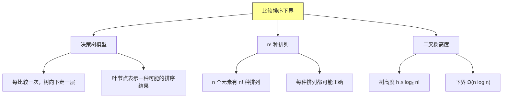

### 1.2 决策树分析

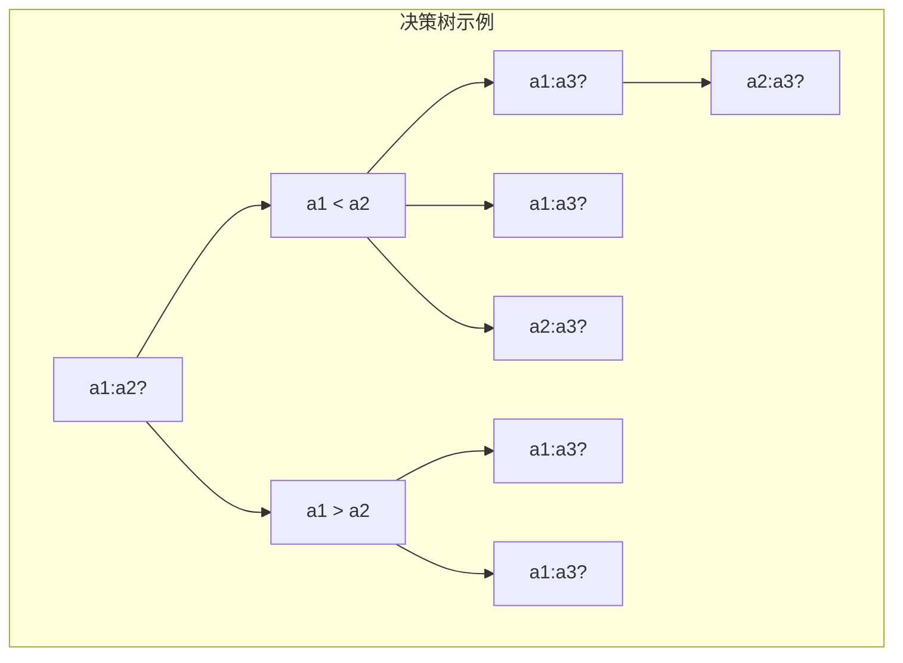

### 1.3 下界证明

**定理**：任何比较排序算法在最坏情况下都需要 Ω(n log n) 次比较。

**证明**：
1. 决策树有 $n!$ 个叶子节点（每种排列一个）
2. 二叉树高度为 $h$，则 $2^h \geq n!$
3. $h \geq \log_2(n!) = \Omega(n \log n)$
4. 每次比较是 O(1)，所以时间下界是 Ω(n log n)

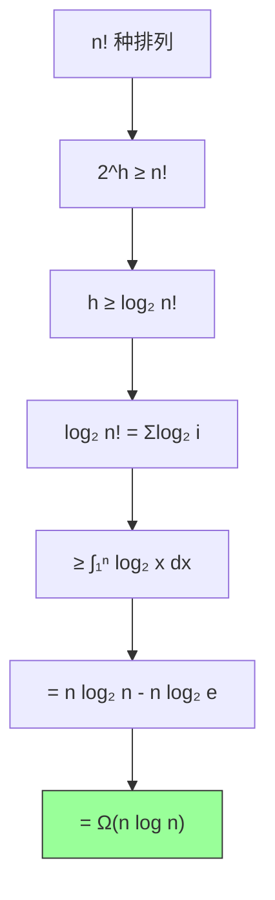

**斯特林公式近似**：
$$\ln n! = n \ln n - n + O(\log n)$$
$$\log_2 n! = n \log_2 n - n \log_2 e + O(\log n) = \Omega(n \log n)$$

---

## 二、计数排序

### 2.1 算法思想

**计数排序**是一种非比较排序算法，适用于**整数排序**或**已知范围**的数据。

核心思想：统计每个元素出现的次数，然后根据计数输出。

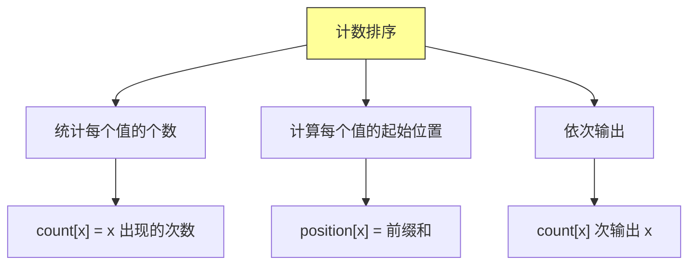

### 2.2 算法过程演示

```
输入: [2, 5, 3, 0, 2, 3, 6, 8, 0]
k = 8 (最大值)

步骤1: 统计计数
count = [2, 0, 2, 2, 0, 1, 1, 0, 1]
        0  1  2  3  4  5  6  7  8

步骤2: 计算累积和（起始位置）
position = [2, 2, 4, 6, 6, 7, 8, 8, 9]

步骤3: 输出
result = [0, 0, 2, 2, 3, 3, 5, 6, 8]
```

### 2.3 Java 实现

```java
import java.util.Arrays;

/**
 * 计数排序实现
 */
public class CountingSort {

    /**
     * 计数排序
     *
     * 前提：输入是范围 [0, k] 内的整数
     * 时间复杂度：O(n + k)
     * 空间复杂度：O(k)
     *
     * @param arr 待排序数组
     * @param k 元素的最大值
     * @return 排序后的新数组
     */
    public static int[] sort(int[] arr, int k) {
        int n = arr.length;

        // 步骤1：创建计数数组，大小为 k+1
        int[] count = new int[k + 1];

        // 统计每个元素出现的次数
        for (int i = 0; i < n; i++) {
            count[arr[i]]++;
        }

        System.out.println("计数数组: " + Arrays.toString(count));

        // 步骤2：计算累积和（确定每个元素的起始位置）
        for (int i = 1; i <= k; i++) {
            count[i] += count[i - 1];
        }

        System.out.println("累积和数组: " + Arrays.toString(count));

        // 步骤3：创建输出数组
        int[] result = new int[n];

        // 步骤4：从后向前遍历（稳定性保证）
        for (int i = n - 1; i >= 0; i--) {
            int value = arr[i];
            int position = count[value] - 1;  // 0-indexed 位置
            result[position] = value;
            count[value]--;  // 下一个相同元素的位置
        }

        return result;
    }

    /**
     * 原地计数排序（不稳定版本）
     */
    public static void sortInPlace(int[] arr, int k) {
        int n = arr.length;

        // 统计计数
        int[] count = new int[k + 1];
        for (int i = 0; i < n; i++) {
            count[arr[i]]++;
        }

        // 累积和变为前缀计数
        for (int i = 1; i <= k; i++) {
            count[i] += count[i - 1];
        }

        // 从后向前收集（稳定，但需要额外空间）
        // 注意：无法真正原地，需要额外 O(n) 空间
        int[] temp = new int[n];
        for (int i = n - 1; i >= 0; i--) {
            int value = arr[i];
            count[value]--;
            temp[count[value]] = value;
        }

        // 复制回原数组
        System.arraycopy(temp, 0, arr, 0, n);
    }

    /**
     * 带详细步骤的计数排序
     */
    public static class WithSteps {
        public static void sort(int[] arr, int k) {
            int n = arr.length;
            System.out.println("=== 计数排序过程 ===");
            System.out.println("输入: " + Arrays.toString(arr));
            System.out.println("k = " + k);

            int[] count = new int[k + 1];
            for (int i = 0; i < n; i++) {
                count[arr[i]]++;
            }
            System.out.println("步骤1 - 计数: " + Arrays.toString(count));

            for (int i = 1; i <= k; i++) {
                count[i] += count[i - 1];
            }
            System.out.println("步骤2 - 累积和: " + Arrays.toString(count));

            int[] result = new int[n];
            for (int i = n - 1; i >= 0; i--) {
                int value = arr[i];
                int pos = --count[value];
                result[pos] = value;
            }
            System.out.println("输出: " + Arrays.toString(result));
        }
    }
}
```

### 2.4 稳定性证明

**计数排序是稳定排序**，因为我们从后向前遍历原数组。

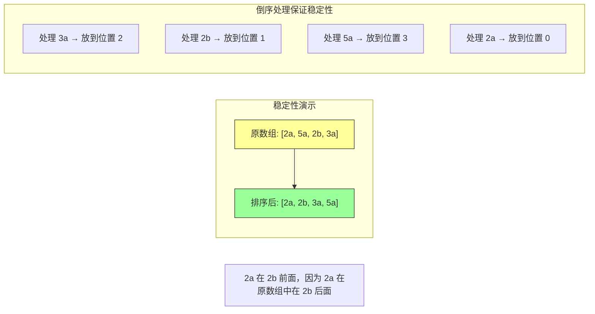

### 2.5 复杂度分析

| 指标 | 复杂度 | 说明 |
|-----|-------|------|
| 时间复杂度 | O(n + k) | n 是元素个数，k 是值域范围 |
| 空间复杂度 | O(k + n) | 计数数组 + 输出数组 |
| 稳定性 | 稳定 | 从后向前遍历 |

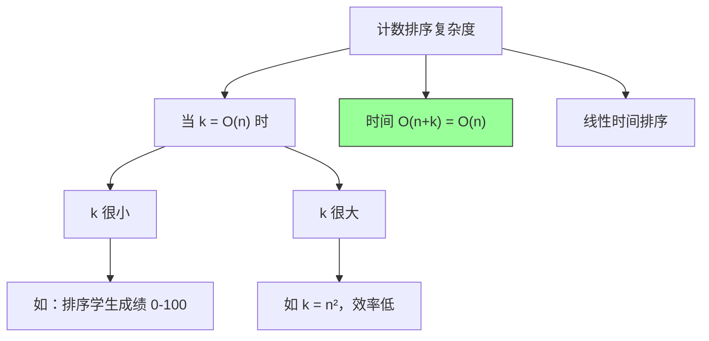

---

## 三、基数排序

### 3.1 算法思想

**基数排序**是一种**多关键字排序**，按位排序（从最低位到最高位）。

核心思想：先按个位排序，再按十位排序，依次类推。

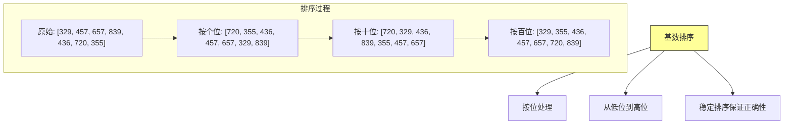

### 3.2 算法过程详解

```
数字: 329, 457, 657, 839, 436, 720, 355

第一轮（按个位，0-9）：
  0: 720
  5: 355
  6: 436
  7: 457
  9: 657, 329, 839
  结果: [720, 355, 436, 457, 657, 329, 839]

第二轮（按十位，0-9）：
  0: 720
  2: 329
  3: 436
  4: 839
  5: 355, 457
  6: 657
  结果: [720, 329, 436, 839, 355, 457, 657]

第三轮（按百位，0-9）：
  3: 329, 355
  4: 436, 457
  6: 657
  7: 720
  8: 839
  结果: [329, 355, 436, 457, 657, 720, 839]
```

### 3.3 Java 实现

```java
import java.util.*;

/**
 * 基数排序实现
 */
public class RadixSort {

    /**
     * 基数排序（使用计数排序作为子过程）
     *
     * 时间复杂度：O(d × (n + k))
     * 空间复杂度：O(n + k)
     *
     * @param arr 待排序数组（非负整数）
     * @param d 最大数字的位数
     * @return 排序后的数组
     */
    public static int[] sort(int[] arr, int d) {
        int n = arr.length;

        for (int digit = 0; digit < d; digit++) {
            // 按第 digit 位排序
            arr = countingSortByDigit(arr, digit);
            System.out.println("第 " + (digit + 1) + " 位排序后: " + Arrays.toString(arr));
        }

        return arr;
    }

    /**
     * 按指定位进行计数排序
     *
     * @param arr 输入数组
     * @param digit 第几位（0=个位，1=十位，...）
     * @return 排序后的数组
     */
    private static int[] countingSortByDigit(int[] arr, int digit) {
        int n = arr.length;
        int base = 10;  // 十进制

        // 计算当前位的权重
        int divisor = (int) Math.pow(base, digit);

        // 计数数组（0-9）
        int[] count = new int[base];
        int[] result = new int[n];

        // 统计每个数字在该位上的出现次数
        for (int i = 0; i < n; i++) {
            int digitValue = (arr[i] / divisor) % base;
            count[digitValue]++;
        }

        // 累积和
        for (int i = 1; i < base; i++) {
            count[i] += count[i - 1];
        }

        // 从后向前遍历（稳定性）
        for (int i = n - 1; i >= 0; i--) {
            int digitValue = (arr[i] / divisor) % base;
            int position = --count[digitValue];
            result[position] = arr[i];
        }

        return result;
    }

    /**
     * 自动检测最大数字的位数
     */
    public static int[] sort(int[] arr) {
        // 找到最大值
        int max = arr[0];
        for (int i = 1; i < arr.length; i++) {
            if (arr[i] > max) {
                max = arr[i];
            }
        }

        // 计算位数
        int d = 0;
        while (max > 0) {
            d++;
            max /= 10;
        }

        System.out.println("最大数字位数: " + d);
        return sort(arr, d);
    }

    /**
     * 处理负数的基数排序
     * 将负数和正数分开处理
     */
    public static int[] sortWithNegative(int[] arr) {
        // 分离正负数
        List<Integer> negative = new ArrayList<>();
        List<Integer> nonNegative = new ArrayList<>();

        for (int num : arr) {
            if (num < 0) {
                negative.add(-num);  // 取绝对值
            } else {
                nonNegative.add(num);
            }
        }

        // 转换为数组
        int[] negArr = negative.stream().mapToInt(i -> i).toArray();
        int[] posArr = nonNegative.stream().mapToInt(i -> i).toArray();

        // 分别排序
        if (negArr.length > 0) {
            negArr = sort(negArr);
        }
        if (posArr.length > 0) {
            posArr = sort(posArr);
        }

        // 合并结果（负数部分取反，并放在前面）
        int[] result = new int[arr.length];
        int idx = 0;
        for (int i = negArr.length - 1; i >= 0; i--) {
            result[idx++] = -negArr[i];
        }
        for (int num : posArr) {
            result[idx++] = num;
        }

        return result;
    }
}
```

### 3.4 复杂度分析

| 指标 | 复杂度 | 说明 |
|-----|-------|------|
| 时间复杂度 | O(d × (n + k)) | d 是位数，k 是基数（10） |
| 空间复杂度 | O(n + k) | 计数排序需要额外空间 |
| 稳定性 | 稳定 | 使用稳定排序作为子过程 |

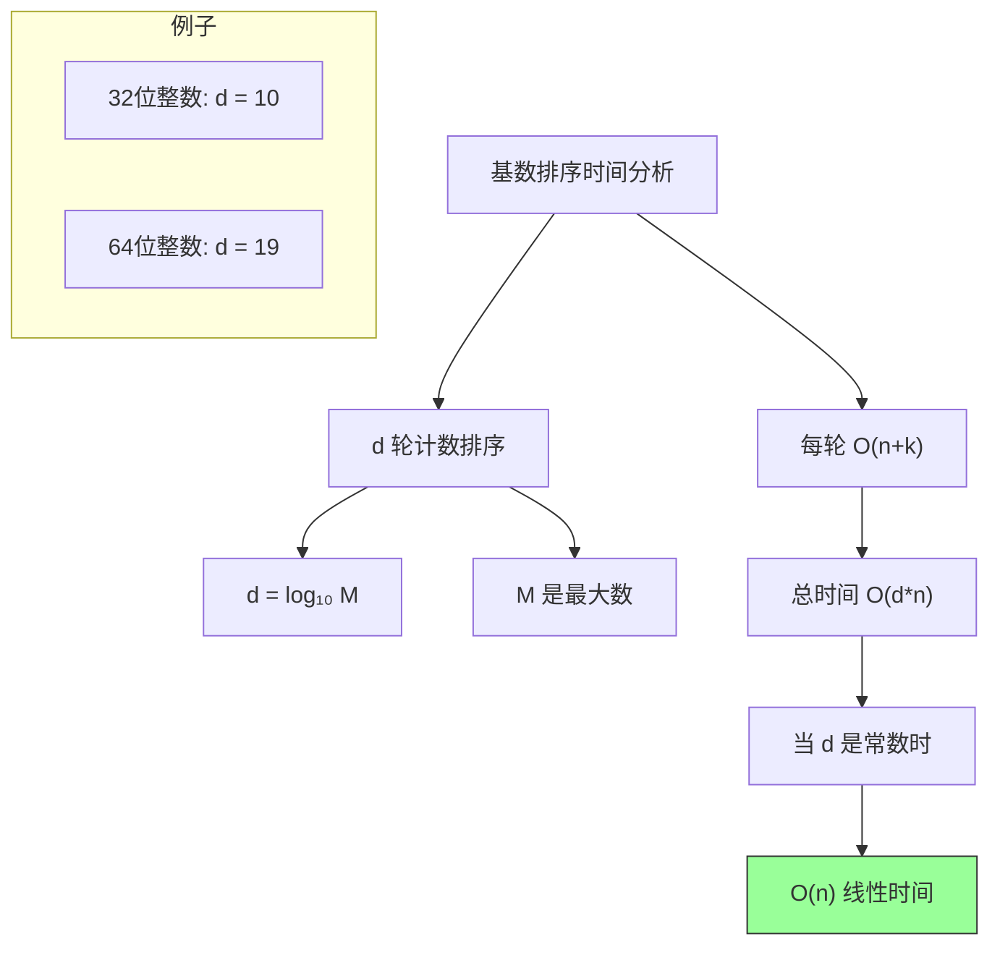

### 3.5 基数排序 vs 计数排序

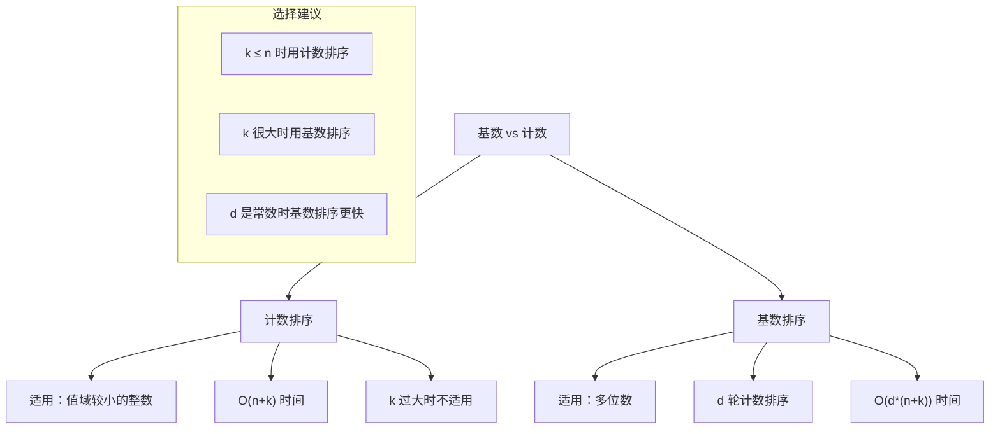

---

## 四、桶排序

### 4.1 算法思想

**桶排序**假设输入数据服从**均匀分布**，将数据分到有限数量的桶中，然后对每个桶分别排序，最后合并。

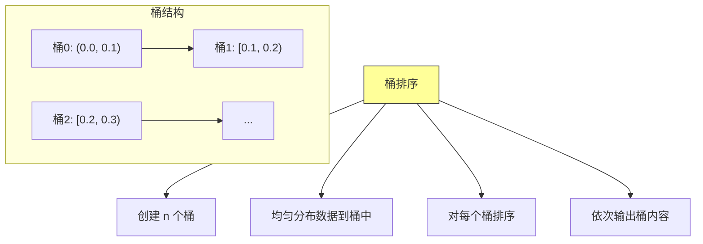

### 4.2 算法过程

```
输入: [0.78, 0.17, 0.39, 0.26, 0.72, 0.94, 0.21, 0.12, 0.23, 0.68]
n = 10 个元素

分桶过程:
桶0 [0.0, 0.1): 0.12
桶1 [0.1, 0.2): 0.17
桶2 [0.2, 0.3): 0.26, 0.21, 0.23
桶3 [0.3, 0.4): 0.39
桶4 [0.4, 0.5): (空)
桶5 [0.5, 0.6): (空)
桶6 [0.6, 0.7): 0.68
桶7 [0.7, 0.8): 0.78, 0.72
桶8 [0.8, 0.9): (空)
桶9 [0.9, 1.0): 0.94

对每个桶排序:
桶0: [0.12]
桶1: [0.17]
桶2: [0.21, 0.23, 0.26]
桶3: [0.39]
桶6: [0.68]
桶7: [0.72, 0.78]
桶9: [0.94]

输出: [0.12, 0.17, 0.21, 0.23, 0.26, 0.39, 0.68, 0.72, 0.78, 0.94]
```

### 4.3 Java 实现

```java
import java.util.*;

/**
 * 桶排序实现
 */
public class BucketSort {

    /**
     * 桶排序
     *
     * 前提：输入数据均匀分布在 [0, 1) 区间
     * 平均时间复杂度：O(n)
     * 最坏时间复杂度：O(n²)
     *
     * @param arr 待排序数组（0 ≤ arr[i] < 1）
     * @return 排序后的数组
     */
    public static double[] sort(double[] arr) {
        int n = arr.length;

        // 步骤1：创建 n 个桶
        @SuppressWarnings("unchecked")
        List<Double>[] buckets = new List[n];
        for (int i = 0; i < n; i++) {
            buckets[i] = new ArrayList<>();
        }

        // 步骤2：将数据均匀分布到桶中
        for (double num : arr) {
            // 映射到 [0, n) 区间
            int bucketIndex = (int) (n * num);
            // 处理 num = 1.0 的情况（理论上不应该有）
            if (bucketIndex >= n) {
                bucketIndex = n - 1;
            }
            buckets[bucketIndex].add(num);
        }

        System.out.println("分桶结果:");
        for (int i = 0; i < n; i++) {
            System.out.printf("桶%d: %s%n", i, buckets[i]);
        }

        // 步骤3：对每个桶排序（使用插入排序）
        for (int i = 0; i < n; i++) {
            if (!buckets[i].isEmpty()) {
                insertionSort(buckets[i]);
            }
        }

        System.out.println("桶内排序后:");
        for (int i = 0; i < n; i++) {
            System.out.printf("桶%d: %s%n", i, buckets[i]);
        }

        // 步骤4：依次输出桶内容
        double[] result = new double[n];
        int index = 0;
        for (int i = 0; i < n; i++) {
            for (double num : buckets[i]) {
                result[index++] = num;
            }
        }

        return result;
    }

    /**
     * 插入排序（适合小数据量）
     */
    private static void insertionSort(List<Double> bucket) {
        for (int i = 1; i < bucket.size(); i++) {
            double key = bucket.get(i);
            int j = i - 1;
            while (j >= 0 && bucket.get(j) > key) {
                bucket.set(j + 1, bucket.get(j));
                j--;
            }
            bucket.set(j + 1, key);
        }
    }

    /**
     * 桶排序（通用版本）
     * 适用于任意范围的浮点数
     */
    public static double[] sortGeneral(double[] arr, double min, double max) {
        int n = arr.length;
        double range = max - min;

        @SuppressWarnings("unchecked")
        List<Double>[] buckets = new List[n];
        for (int i = 0; i < n; i++) {
            buckets[i] = new ArrayList<>();
        }

        // 分桶
        for (double num : arr) {
            double normalized = (num - min) / range;
            int bucketIndex = (int) (n * normalized);
            bucketIndex = Math.min(bucketIndex, n - 1);  // 防止越界
            buckets[bucketIndex].add(num);
        }

        // 排序并合并
        double[] result = new double[n];
        int index = 0;
        for (int i = 0; i < n; i++) {
            if (!buckets[i].isEmpty()) {
                Collections.sort(buckets[i]);  // 使用内置排序
                for (double num : buckets[i]) {
                    result[index++] = num;
                }
            }
        }

        return result;
    }

    /**
     * 整数桶排序
     */
    public static int[] sortIntegers(int[] arr, int min, int max) {
        int n = arr.length;
        int range = max - min + 1;

        @SuppressWarnings("unchecked")
        List<Integer>[] buckets = new List[range];
        for (int i = 0; i < range; i++) {
            buckets[i] = new ArrayList<>();
        }

        // 分桶
        for (int num : arr) {
            int bucketIndex = num - min;
            buckets[bucketIndex].add(num);
        }

        // 合并（桶内已是有序的，因为插入顺序）
        int[] result = new int[n];
        int index = 0;
        for (int i = 0; i < range; i++) {
            for (int num : buckets[i]) {
                result[index++] = num;
            }
        }

        return result;
    }
}
```

### 4.4 复杂度分析

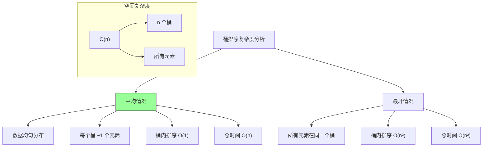

| 指标 | 平均情况 | 最坏情况 |
|-----|---------|---------|
| 时间复杂度 | O(n) | O(n²) |
| 空间复杂度 | O(n) | O(n) |
| 稳定性 | 稳定 | 取决于桶内排序 |

---

## 五、三种线性排序对比

### 5.1 算法特性对比

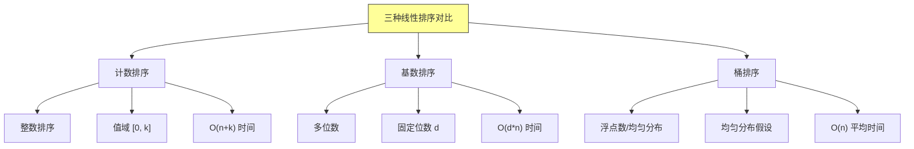

### 5.2 详细对比表

| 特性 | 计数排序 | 基数排序 | 桶排序 |
|-----|---------|---------|--------|
| **适用数据类型** | 整数（范围小） | 整数/字符串 | 浮点数（均匀分布） |
| **时间复杂度** | O(n + k) | O(d × (n + k)) | O(n) 平均 |
| **空间复杂度** | O(k + n) | O(n + k) | O(n) |
| **稳定性** | 稳定 | 稳定 | 稳定 |
| **额外假设** | 已知最大值 k | 固定位数 d | 均匀分布 |

### 5.3 选择指南

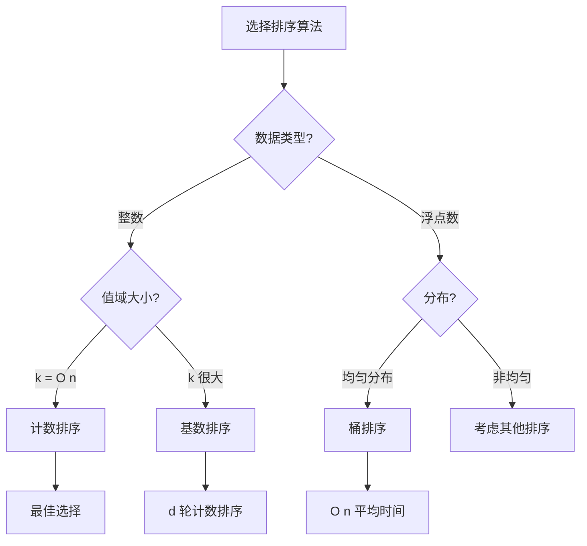

### 5.4 实际应用场景

```java
/**
 * 线性排序应用场景示例
 */
public class LinearSortApplications {

    /**
     * 应用1：学生成绩排序（0-100分）
     * 使用计数排序
     */
    public static int[] sortGrades(int[] grades) {
        // grades[i] ∈ [0, 100]
        return CountingSort.sort(grades, 100);
    }

    /**
     * 应用2：IP地址排序
     * 使用基数排序
     */
    public static int[] sortIPAddresses(int[] ips) {
        // 每个IP有4个字节，最多需要10位（十进制）
        // 或者使用4轮基数排序（每轮一个字节）
        return RadixSort.sort(ips, 10);
    }

    /**
     * 应用3：浮点数排序
     * 使用桶排序
     */
    public static double[] sortFloats(double[] floats) {
        return BucketSort.sort(floats);
    }

    /**
     * 应用4：百万级整数排序（值域未知）
     * 混合策略：先采样确定范围，再选择算法
     */
    public static int[] sortLargeIntegers(int[] arr) {
        // 1. 采样估计范围
        int[] sample = new int[Math.min(1000, arr.length)];
        System.arraycopy(arr, 0, sample, 0, sample.length);

        int max = Arrays.stream(sample).max().orElse(0);
        int min = Arrays.stream(sample).min().orElse(0);
        int range = max - min;

        // 2. 根据范围选择算法
        if (range <= arr.length) {
            // 值域不大，使用计数排序
            return CountingSort.sort(arr, max);
        } else {
            // 值域大，使用快速排序
            QuickSort.sort(arr);
            return arr;
        }
    }
}
```

---

## 六、Python 实现

```python
"""
线性时间排序 Python 实现
"""


class CountingSort:
    """计数排序"""

    @staticmethod
    def sort(arr, k):
        """计数排序，适用于 [0, k] 范围内的整数"""
        n = len(arr)
        count = [0] * (k + 1)

        # 统计计数
        for num in arr:
            count[num] += 1

        # 累积和
        for i in range(1, k + 1):
            count[i] += count[i - 1]

        # 输出（从后向前保证稳定性）
        result = [0] * n
        for i in range(n - 1, -1, -1):
            value = arr[i]
            count[value] -= 1
            result[count[value]] = value

        return result


class RadixSort:
    """基数排序"""

    @staticmethod
    def sort(arr, base=10):
        """基数排序"""
        if not arr:
            return arr

        # 找到最大值
        max_val = max(arr)

        # 按每一位排序
        digit = 0
        divisor = 1
        while max_val // divisor > 0:
            arr = RadixSort._counting_sort_by_digit(arr, divisor, base)
            digit += 1
            divisor *= base

        return arr

    @staticmethod
    def _counting_sort_by_digit(arr, divisor, base):
        """按指定位进行计数排序"""
        n = len(arr)
        count = [0] * base
        result = [0] * n

        # 统计计数
        for num in arr:
            digit = (num // divisor) % base
            count[digit] += 1

        # 累积和
        for i in range(1, base):
            count[i] += count[i - 1]

        # 从后向前输出
        for i in range(n - 1, -1, -1):
            digit = (arr[i] // divisor) % base
            count[digit] -= 1
            result[count[digit]] = arr[i]

        return result


class BucketSort:
    """桶排序"""

    @staticmethod
    def sort(arr, num_buckets=None):
        """桶排序，适用于 [0, 1) 范围内的浮点数"""
        n = len(arr)
        if num_buckets is None:
            num_buckets = n

        # 创建桶
        buckets = [[] for _ in range(num_buckets)]

        # 分桶
        for num in arr:
            # 映射到 [0, num_buckets)
            bucket_idx = int(num * num_buckets)
            bucket_idx = min(bucket_idx, num_buckets - 1)
            buckets[bucket_idx].append(num)

        # 每个桶内排序
        result = []
        for bucket in buckets:
            if bucket:
                bucket.sort()  # 使用 Python 内置排序
                result.extend(bucket)

        return result


if __name__ == "__main__":
    # 测试计数排序
    arr = [2, 5, 3, 0, 2, 3, 6, 8, 0]
    print("计数排序测试:")
    print("输入:", arr)
    result = CountingSort.sort(arr, 8)
    print("输出:", result)

    # 测试基数排序
    arr = [170, 45, 75, 90, 802, 24, 2, 66]
    print("\n基数排序测试:")
    print("输入:", arr)
    result = RadixSort.sort(arr)
    print("输出:", result)

    # 测试桶排序
    arr = [0.78, 0.17, 0.39, 0.26, 0.72, 0.94, 0.21, 0.12, 0.23, 0.68]
    print("\n桶排序测试:")
    print("输入:", arr)
    result = BucketSort.sort(arr)
    print("输出:", result)
```

---

## 七、排序算法全景图

### 7.1 排序算法分类

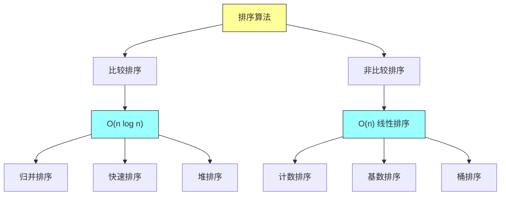

### 7.2 各排序算法复杂度总结

| 算法 | 平均 | 最坏 | 空间 | 稳定性 |
|-----|------|------|------|--------|
| 冒泡排序 | O(n²) | O(n²) | O(1) | 稳定 |
| 插入排序 | O(n²) | O(n²) | O(1) | 稳定 |
| 选择排序 | O(n²) | O(n²) | O(1) | 不稳定 |
| 归并排序 | O(n log n) | O(n log n) | O(n) | 稳定 |
| 堆排序 | O(n log n) | O(n log n) | O(1) | 不稳定 |
| 快速排序 | O(n log n) | O(n²) | O(log n) | 不稳定 |
| 计数排序 | O(n + k) | O(n + k) | O(k) | 稳定 |
| 基数排序 | O(dn) | O(dn) | O(n) | 稳定 |
| 桶排序 | O(n) | O(n²) | O(n) | 稳定 |

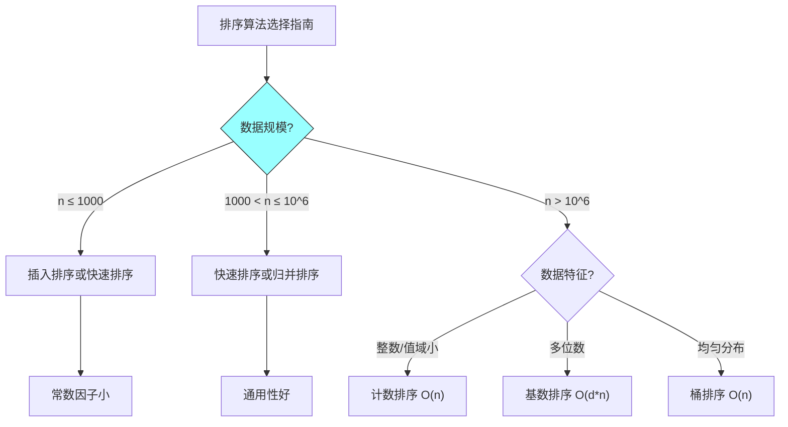

---

## 八、总结与要点

### 8.1 核心概念回顾

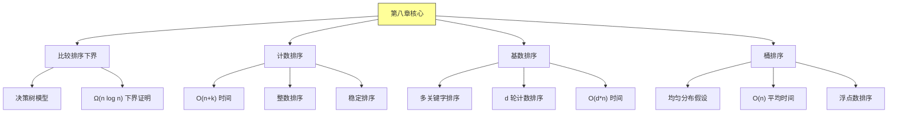

### 8.2 关键定理

**比较排序下界定理**：
任何基于比较的排序算法在最坏情况下都需要 Ω(n log n) 次比较。

**推论**：
- 计数、基数、桶排序突破了比较排序的下界
- 它们利用了数据的额外特性（值域范围、位数、分布）

### 8.3 线性排序的适用条件

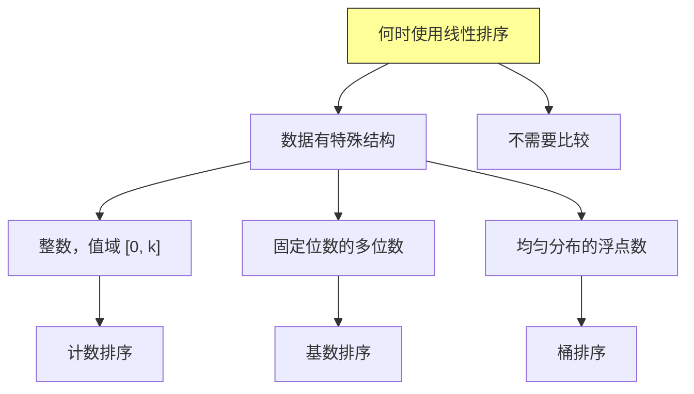

---

## 课后思考

### 思考题 1
证明：计数排序是稳定的。

### 思考题 2
假设我们要排序 n 个整数，每个整数在范围 [1, n³] 内。使用计数排序和基数排序，哪种方法更快？说明理由。

### 思考题 3
修改桶排序算法，使其能够处理负数。

### 思考题 4
设计一个算法，在 O(n) 时间内找出数组中的第 k 小元素（不能排序整个数组）。你能给出多种方法吗？

### 思考题 5
解释为什么基数排序需要使用稳定的子排序算法（如计数排序）？

---

*本章精读笔记完成*
