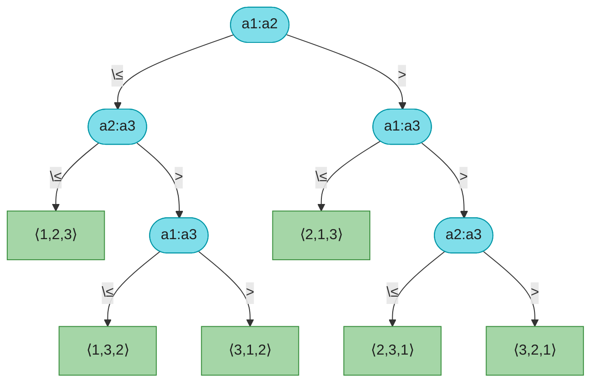

# 第八章：线性时间排序（Sorting in Linear Time）

> **定位**：前面几章的归并、堆、快排都是**比较排序**，最坏/平均都跑不出 Ω(n lg n)。本章先证明这个下界（§8.1 决策树模型），再介绍三种**突破下界**的线性排序——计数、基数、桶排序。它们能到 Θ(n)，是因为**利用了比较之外的信息**（值域范围、位数、数据分布）。
> **核心权衡**：线性排序**不是通用替代品**——它们各自要求输入满足特定条件（整数且值域小 / 固定位数 / 均匀分布），且通常**不原地、不稳定约束不同**。通用排序仍是比较排序的天下。
>
> 对照第四版书页 205–229。

---

## 一、比较排序的下界（§8.1）

### 1.1 决策树模型

比较排序的运行过程可以抽象成一棵**决策树**：每个内部节点是一次比较 `a_i : a_j`，左右分支对应比较结果，叶子是一种排列（排序结果）。

```
n 个元素有 n! 种合法排列 → 任何正确的比较排序，决策树至少要有 n! 个叶子
高度为 h 的二叉树最多 2^h 个叶子 → 2^h ≥ n!
→ 最坏比较次数 ≥ ⌈lg(n!)⌉ = Ω(n lg n)        （Stirling：lg(n!) ≈ n lg n − n lg e）
```

> **定理**：任何比较排序最坏需要 Ω(n lg n) 次比较。归并、堆排序是**最优**的比较排序（渐近达到下界）。

### 1.2 一个 3 元素决策树示意

3 个元素有 3!=6 种排列，决策树至少 6 叶子，高度 ≥ ⌈lg 6⌉ = 3：



> 习题 8.1-3 指出：即便只要求**部分**排列（如 n!/2、n!/n²）可区分，下界仍是 Ω(n lg n)——线性排序无法靠比较实现。

---

## 二、计数排序（§8.2）

### 2.1 思路

输入是 `[0, k]` 内的整数。统计每个值出现多少次，算前缀和得到每个值的**最终位置**，再从后往前把元素放进输出数组。

```
COUNTING-SORT(A, n, k)              // CLRS 第四版，1-indexed，输出到 B
1  let B[1..n] and C[0..k] be new arrays
2  for i = 0 to k
3      C[i] = 0
4  for j = 1 to n
5      C[A[j]] = C[A[j]] + 1        // C[i] = 值等于 i 的元素个数
6  for i = 1 to k
7      C[i] = C[i] + C[i-1]         // C[i] = 值 ≤ i 的元素个数 = i 的最后位置
8  for j = n downto 1               // 从后往前 → 稳定
9      B[C[A[j]]] = A[j]
10     C[A[j]] = C[A[j]] - 1
11 return B
```

### 2.2 过程示例（CLRS Figure 8.2）

`A = [2, 5, 3, 0, 2, 3, 0, 3]`，k = 5：

| 步骤 | C/B 状态 |
|------|---------|
| 计数（行 2-5） | C = `[2, 0, 2, 3, 0, 1]`（值 0 出现 2 次、3 出现 3 次…） |
| 前缀和（行 6-7） | C = `[2, 2, 4, 7, 7, 8]`（值 3 的最后位置是 7） |
| 输出（行 8-10，倒序） | B = `[0, 0, 2, 2, 3, 3, 3, 5]` |

### 2.3 复杂度与稳定性

- **时间 Θ(n + k)**；当 k = O(n) 时为 Θ(n)。
- **空间 Θ(n + k)**（输出数组 B + 计数数组 C）。
- **稳定**：因为第 8-10 行**从后往前**遍历 A，相等的元素保持原顺序（后出现的仍排在后）。这个稳定性是基数排序能工作的前提。

> 计数排序能突破 Ω(n lg n) 下界，正因为它**根本不做元素比较**——直接用值当下标。

---

## 三、基数排序（§8.3）

### 3.1 思路：LSD 逐位排序

对 d 位整数，从**最低位到最高位**，每位用一次**稳定**排序（通常计数排序）。关键：子排序必须稳定，否则高位排序会破坏低位已排好的顺序。

```
RADIX-SORT(A, d)
1  for i = 1 to d
2      use a stable sort to sort A on digit i      // 通常用计数排序（基数 r=10）
```

### 3.2 过程示例（CLRS Figure 8.3）

`[329, 457, 657, 839, 436, 720, 355]`，3 位数，从个位排到百位：

| 阶段 | 排序结果 |
|------|---------|
| 初始 | 329 457 657 839 436 720 355 |
| 按个位 | 720 355 436 457 657 329 839 |
| 按十位 | 720 329 436 839 355 457 657 |
| 按百位 | 329 355 436 457 657 720 839 |

### 3.3 复杂度（Lemma 8.3 / 8.4）

- **Lemma 8.3（正确性 + 时间）**：n 个 d 位数、每位最多 k 种取值，稳定子排序若 Θ(n+k)，则基数排序 **Θ(d(n+k))**。
- **Lemma 8.4（按比特切分）**：n 个 b 位数，每位取 r 比特（即 k = 2ʳ），需要 ⌈b/r⌉ 轮，每轮 Θ(n + 2ʳ)，总 **Θ((b/r)·(n+2ʳ))**。注意是 n+2ʳ 不是 n+r：r=8 时每位取值 0..255。

> 给定 n 个 b 位数，取 r = ⌊lg n⌋ 使每轮 Θ(n)，总 **Θ((b/lg n)·n)**。若 b = O(lg n)（如计算机字长内），就是 Θ(n)；b = Θ(lg² n) 时是 Θ(n lg n)，不再优于比较排序。

> **0-indexed 提醒**：CLRS 用 1-indexed；代码里位数从最低位 `div=1` 开始，`div *= r` 推进。

---

## 四、桶排序（§8.4）

### 4.1 思路

假设输入独立均匀分布于 `[0, 1)`。把 `[0,1)` 均分成 n 个桶，每个元素 `A[i]` 落入第 `⌊n·A[i]⌋` 个桶；桶内用插入排序；最后依桶顺序拼接。

```
BUCKET-SORT(A)                      // 输入 A[1..n] ⊂ [0,1)
1  create n buckets B[0..n-1]
2  for i = 1 to n
3      insert A[i] into B[⌊n·A[i]⌋]
4  for i = 0 to n-1
5      sort B[i] by insertion sort   // 桶内元素少，插排常数小
6  concatenate B[0], B[1], ..., B[n-1]
```

### 4.2 为什么期望 Θ(n)

均匀分布下，每个桶期望落 1 个元素。令 `n_i` = 桶 i 的元素数，插排耗时 Θ(n_i²)，总时间：

```
E[Σ n_i²] = Σ E[n_i²] = Σ (Var(n_i) + E[n_i]²) = Σ (1 − 1/n + 1²) = Θ(n)
```

（n_i 服从二项分布 B(n, 1/n)，期望 1、方差 1−1/n。）所以**期望 Θ(n)**。最坏 Θ(n²)（全部挤进一个桶）。

### 4.3 与计数排序的区分

| | 计数排序 | 桶排序 |
|---|---|---|
| 输入 | `[0,k]` 整数 | `[0,1)` 实数（均匀分布） |
| 「桶」 | 每个值一个桶（k+1 个） | 固定 n 个区间桶 |
| 桶内 | 无需排序（同值） | 需排序（桶内有多值） |
| 时间 | Θ(n+k) **最坏** | Θ(n) **期望**，最坏 Θ(n²) |

---

## 五、代码实现（Java + Python）

三个算法各一个干净版本，0-indexed。计数排序是基数排序的子过程。

### Java

```java
import java.util.*;

public class LinearSort {
    // 计数排序：输入 [0,k] 整数，返回新数组
    public static int[] countingSort(int[] a, int k) {
        int n = a.length;
        int[] c = new int[k + 1], out = new int[n];
        for (int x : a) c[x]++;
        for (int i = 1; i <= k; i++) c[i] += c[i - 1];
        for (int i = n - 1; i >= 0; i--) out[--c[a[i]]] = a[i];   // 倒序→稳定
        return out;
    }

    // 基数排序：非负整数，LSD，子过程用计数排序
    public static int[] radixSort(int[] a) {
        if (a.length == 0) return a;
        int max = 0;
        for (int x : a) max = Math.max(max, x);
        for (int div = 1; max / div > 0; div *= 10) a = byDigit(a, div);
        return a;
    }
    private static int[] byDigit(int[] a, int div) {
        int n = a.length;
        int[] c = new int[10], out = new int[n];
        for (int x : a) c[(x / div) % 10]++;
        for (int i = 1; i < 10; i++) c[i] += c[i - 1];
        for (int i = n - 1; i >= 0; i--) { int d = (a[i] / div) % 10; out[--c[d]] = a[i]; }
        return out;
    }

    // 桶排序：输入 [0,1) 均匀分布实数
    public static double[] bucketSort(double[] a) {
        int n = a.length;
        List<List<Double>> b = new ArrayList<>();
        for (int i = 0; i < n; i++) b.add(new ArrayList<>());
        for (double x : a) b.get(Math.min((int) (n * x), n - 1)).add(x);
        double[] out = new double[n];
        int idx = 0;
        for (List<Double> bucket : b) {
            Collections.sort(bucket);            // 桶内元素少，也可手写插排
            for (double x : bucket) out[idx++] = x;
        }
        return out;
    }

    public static void main(String[] args) {
        int[] c = {2, 5, 3, 0, 2, 3, 0, 3};
        System.out.println("计数: " + Arrays.toString(countingSort(c, 5)));
        int[] r = {329, 457, 657, 839, 436, 720, 355};
        System.out.println("基数: " + Arrays.toString(radixSort(r)));
        double[] b = {0.78, 0.17, 0.39, 0.26, 0.72, 0.94, 0.21, 0.12, 0.23, 0.68};
        System.out.println("桶:   " + Arrays.toString(bucketSort(b)));
    }
}
```

### Python

```python
def counting_sort(a, k):
    """计数排序：输入 [0,k] 整数，返回新列表。"""
    c = [0] * (k + 1)
    out = [0] * len(a)
    for x in a:
        c[x] += 1
    for i in range(1, k + 1):
        c[i] += c[i - 1]
    for x in reversed(a):          # 倒序→稳定
        c[x] -= 1
        out[c[x]] = x
    return out


def radix_sort(a):
    """基数排序：非负整数 LSD，子过程用计数排序。"""
    if not a:
        return a
    max_val = max(a)
    div = 1
    while max_val // div > 0:
        a = _by_digit(a, div)
        div *= 10
    return a

def _by_digit(a, div):
    c = [0] * 10
    out = [0] * len(a)
    for x in a:
        c[(x // div) % 10] += 1
    for i in range(1, 10):
        c[i] += c[i - 1]
    for x in reversed(a):
        d = (x // div) % 10
        c[d] -= 1
        out[c[d]] = x
    return out


def bucket_sort(a):
    """桶排序：输入 [0,1) 均匀分布实数。"""
    n = len(a)
    buckets = [[] for _ in range(n)]
    for x in a:
        buckets[min(int(n * x), n - 1)].append(x)
    out = []
    for b in buckets:
        b.sort()
        out.extend(b)
    return out


if __name__ == "__main__":
    print("计数:", counting_sort([2, 5, 3, 0, 2, 3, 0, 3], 5))
    print("基数:", radix_sort([329, 457, 657, 839, 436, 720, 355]))
    print("桶:  ", bucket_sort([0.78, 0.17, 0.39, 0.26, 0.72, 0.94, 0.21, 0.12, 0.23, 0.68]))
```

> **验证**：三例输出均与 CLRS Figure 8.2/8.3/8.4 一致；并用随机数组对照 `Arrays.sort` / `sorted` 对拍通过。

---

## 六、排序算法全景 + 易混点

### 6.1 全景速查

| 算法 | 平均 | 最坏 | 空间 | 稳定 | 类型 |
|------|------|------|------|------|------|
| 插入排序 | Θ(n²) | Θ(n²) | Θ(1) | ✅ | 比较 |
| 归并排序 | Θ(n lg n) | Θ(n lg n) | Θ(n) | ✅ | 比较 |
| 堆排序 | Θ(n lg n) | Θ(n lg n) | Θ(1) | ❌ | 比较 |
| 快速排序 | Θ(n lg n) | Θ(n²) | Θ(lg n) | ❌ | 比较 |
| 计数排序 | Θ(n+k) | Θ(n+k) | Θ(n+k) | ✅ | 非比较 |
| 基数排序 | Θ(d(n+r)) | Θ(d(n+r)) | Θ(n+r) | ✅ | 非比较 |
| 桶排序 | Θ(n) 期望 | Θ(n²) | Θ(n) | ✅ | 非比较 |

### 6.2 易混点

- **「线性」是有条件的**：计数排序要 k=O(n)，基数排序要 d=O(lg n)（字长内），桶排序要均匀分布。脱离条件它们可能比 Θ(n lg n) 还差。
- **稳定性不能想当然**：计数排序稳定靠**倒序遍历**；基数排序**必须**用稳定子排序，否则错（这是最常考的点）；快排、堆排**不**稳定。
- **计数 vs 桶**：计数是「每个值一个桶、桶内无需排序」；桶是「固定 n 个区间桶、桶内仍需排序」。别混。
- **下界 Ω(n lg n) 只针对比较排序**：它不限制计数/基数/桶——因为它们用了「值的算术」而非「两两比较」。
- **桶排序最坏 Θ(n²)**：所有元素挤进同一桶时退化为插排。别只记「O(n)」而忘了它只是**期望**。

---

## 七、LeetCode 关联 + 习题 + 思考题

### 7.1 LeetCode 关联

| 题目 | 难度 | 考点 | 用本章什么 |
|------|------|------|-----------|
| [75. 颜色分类](https://leetcode.cn/problems/sort-colors/) | 中 | 计数/三向划分 | 值域极小的计数思想 |
| [164. 最大间距](https://leetcode.cn/problems/maximum-gap/) | 困 | 桶排序 | 线性时间求排序后相邻最大差（桶思想） |
| [274. H 指数](https://leetcode.cn/problems/h-index/) | 中 | 计数排序 | 计数数组统计引用数 |
| [56. 合并区间](https://leetcode.cn/problems/merge-intervals/) | 中 | 排序+贪心 | 排序后线性扫描 |
| [220. 存在重复元素 III](https://leetcode.cn/problems/contains-duplicate-iii/) | 困 | 桶排序 | 按桶分组检测临近重复 |

### 7.2 习题快问快答（第四版编号）

- **8.1-1**　决策树最浅叶子的最小深度 = n−1（已排好序的输入也要比较 n−1 次确认）。
- **8.1-3**　即使只要区分 n!/2 或 n!/n² 种排列，下界仍是 Ω(n lg n)——线性项无法覆盖 lg(n!) 的量级。
- **8.2-3**　把 COUNTING-SORT 第 8 行改成 `for j = 1 to n`（正序）→ **不再稳定**（相等元素顺序反转），但仍正确。
- **8.2-6**　给定 [0,k] 内 n 个数，回答「区间 [a,b] 内有多少个元素」：计数数组 C 算前缀和后，O(1) 回答 `C[b] − C[a−1]`。
- **8.3-1**　用基数排序演示 `COW,DOG,SEA,RUG,ROW,MOB,BOX,TAB,BAR,EAR,TAR,DIG,BIG,TEA,NOW,FOX`：从最后一列字母逐列向前稳定排序。
- **8.3-3**　证明基数排序正确（归纳：排完 i 位后，前 i 位有序；稳定子排序保证高位不破坏低位）。
- **8.4-2**　桶排序最坏 Θ(n²)：全部元素落进同一桶，插排退化。改进：桶内改用 Θ(n lg n) 排序 → 最坏 Θ(n lg n)。

### 7.3 思考题要点

- **8-1 比较排序的平均情况**：证明比较排序的**平均**比较次数也是 Ω(n lg n)（决策树的外部路径长度 ≥ n! 个叶子的最优前缀编码长度）。
- **8-2 线性时间原址排序**：对 [0,k] 整数，计数排序能 Θ(n+k) 但**不原址**；要原址+线性+稳定三者兼得**不可能**（需舍弃其一）。
- **8-3 变长元素排序**：(a) n 个整数、各位数之和为 n，按位基数排序可 **O(n)**；(b) n 个字符串、字符总数为 n，先按长度分桶再对每位做稳定排序，也是 O(n)。不是「变位词分组」。
- **8-4 水壶问题**：n 个红壶、n 个蓝壶，体积一一对应，只能跨色比较。用类似快排的随机化：选一个红壶做 pivot 划分蓝壶，再递归。期望 O(n lg n)。

### 章末注记

计数排序是**桶排序**的离散特例；基数排序可追溯到 1887 年 Herman Hollerith 的打孔卡片制表机（用于美国人口普查）。桶排序的期望分析展示了「均匀分布 + 分桶」如何把 Θ(n lg n) 摊还到 Θ(n)。这三种算法共同说明：**突破下界靠的不是更聪明的比较，而是利用数据的额外结构**。
