# 第九章：中位数和顺序统计量

## 一、问题描述

### 1.1 什么是顺序统计量

**顺序统计量**（Order Statistic）是指在 n 个元素的集合中，按大小排序后第 i 小的元素。这是一个非常基础但非常重要的问题，在统计学、数据分析、算法设计等领域都有广泛应用。

例如，对于数组 `[3, 7, 2, 8, 1, 6, 5, 4]`，排序后为 `[1, 2, 3, 4, 5, 6, 7, 8]`：
- 第 1 小：1（最小值）
- 第 2 小：2
- 第 3 小：3
- 第 4 小：4（中位数）
- 第 5 小：5
- 第 6 小：6
- 第 7 小：7
- 第 8 小：8（最大值）

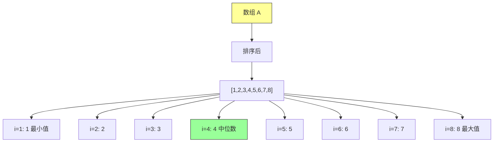

### 1.2 中位数定义

**中位数**（Median）是第 n/2 小的元素，是统计学的核心概念：

- **奇数个元素**：中位数是唯一的，例如 `[1,2,3,4,5]` 的中位数是第 3 个元素 = 3
- **偶数个元素**：有两个中位数，通常取平均值，例如 `[1,2,3,4]` 的中位数是 2.5

**为什么需要中位数？**
- 中位数比平均值更鲁棒，不受极端值影响
- 描述数据的"中心位置"
- 用于分位数计算、异常检测等

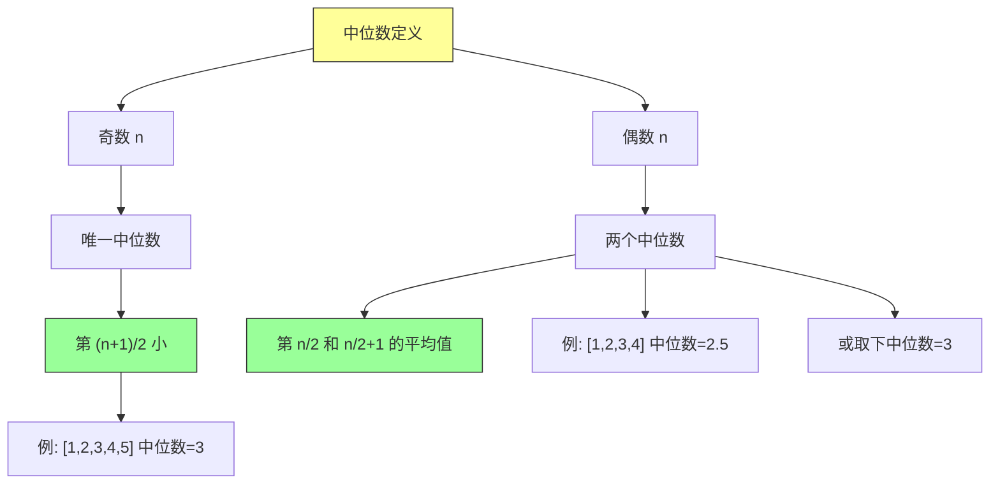

### 1.3 选择问题的形式化定义

**问题输入**：
- 数组 `A[1..n]`（包含 n 个互异的数字）
- 整数 `i`（1 ≤ i ≤ n）

**问题输出**：
- 数组 A 中第 i 小的元素，即恰好大于其他 i-1 个元素的 x

```java
/**
 * 顺序统计量接口
 */
public interface OrderStatisticSelector {

    /**
     * 找到第 k 小的元素（1-indexed）
     */
    int select(int[] A, int k);

    /**
     * 找到最小值
     */
    int minimum(int[] A);

    /**
     * 找到最大值
     */
    int maximum(int[] A);

    /**
     * 找到中位数
     */
    int median(int[] A);
}
```

### 1.4 LeetCode 相关题目

| 题目 | 描述 | 难度 |
|-----|------|------|
| 215 | 数组中的第 K 个最大元素 | 中等 |
| 347 | 前 K 个高频元素 | 中等 |
| 973 | 最接近原点的 K 个点 | 中等 |
| 658 | 找到 K 个最接近的元素 | 中等 |

---

## 二、暴力解法（入门）

### 2.1 方法一：排序后选择

**直观思路**：先对数组完全排序，然后直接取第 i 个元素。

这是最容易理解的方法，充分利用了现成的排序算法。

```java
import java.util.Arrays;

/**
 * 暴力解法：排序后选择
 * 时间复杂度：O(n log n)
 */
public class BruteForceSelect {

    /**
     * 找到第 k 小的元素（k 从 1 开始）
     */
    public static int select(int[] A, int k) {
        // 边界检查
        if (k < 1 || k > A.length) {
            throw new IllegalArgumentException("k 必须在 1 到 " + A.length + " 之间");
        }

        // 1. 复制数组（避免修改原数组）
        int[] sorted = A.clone();

        // 2. 对数组排序
        Arrays.sort(sorted);

        // 3. 返回第 k 小的元素
        return sorted[k - 1];
    }

    // ==================== 测试 ====================
    public static void main(String[] args) {
        int[] A = {3, 7, 2, 8, 1, 6, 5, 4};

        System.out.println("数组: " + Arrays.toString(A));
        System.out.println("第 1 小: " + select(A, 1)); // 1
        System.out.println("第 3 小: " + select(A, 3)); // 3
        System.out.println("第 4 select(A,  小: " +4)); // 4（中位数）
        System.out.println("第 5 小: " + select(A, 5)); // 5
    }
}
```

**运行结果**：
```
数组: [3, 7, 2, 8, 1, 6, 5, 4]
第 1 小: 1
第 3 小: 3
第 4 小: 4
第 5 小: 5
```

### 2.2 方法二：最小堆

**思路**：维护一个大小为 k 的最小堆，遍历数组，保持堆中只有前 k 小的元素。

```java
import java.util.PriorityQueue;
import java.util.Arrays;

/**
 * 暴力解法：最小堆
 * 时间复杂度：O(n log k)
 */
public class MinHeapSelect {

    public static int select(int[] A, int k) {
        if (k < 1 || k > A.length) {
            throw new IllegalArgumentException("k 无效");
        }

        // 最小堆，保存前 k 小的元素
        PriorityQueue<Integer> minHeap = new PriorityQueue<>();

        for (int num : A) {
            minHeap.offer(num);
            if (minHeap.size() > k) {
                // 堆大小超过 k 时，弹出最小的元素
                minHeap.poll();
            }
        }

        // 堆顶就是第 k 小的元素
        return minHeap.peek();
    }

    public static void main(String[] args) {
        int[] A = {3, 7, 2, 8, 1, 6, 5, 4};
        System.out.println("第 4 小: " + select(A, 4)); // 4
    }
}
```

### 2.3 复杂度分析

| 方法 | 时间复杂度 | 空间复杂度 | 优点 | 缺点 |
|-----|-----------|-----------|------|------|
| 排序后选择 | O(n log n) | O(n) | 代码简洁 | 排序全部元素 |
| 最小堆 | O(n log k) | O(k) | 适用于找 top-k | 需要堆结构 |
| 暴力遍历 | O(n) × k | O(1) | 空间最优 | 时间最差 |

### 2.4 核心瓶颈分析

**为什么需要优化？**

排序法的主要问题：**"杀鸡用牛刀"**

- 排序需要 O(n log n) 时间
- 但我们只需要第 i 小的元素，不需要完全排序
- 如果 i 很小（如找最小值），排序浪费了大量计算

**核心问题**：能否跳过不必要的排序，直接找到第 i 小的元素？

**答案**：可以！利用分区思想（快速排序的核心），每次只递归一半。

---

## 三、优化探索

### 3.1 观察问题特征

观察快速排序，我们发现一个关键性质：

**分区操作后，pivot 的位置是确定的**

```
分区前: [3, 7, 2, 8, 1, 6, 5, 4]
           ↑
         pivot = 6

分区后: [3, 2, 1, 5, 4, 6, 7, 8]
                    ↑
              pivot 在第 6 位
```

如果我们找第 4 小的元素：
- pivot 在第 6 位，说明第 4 小一定在左边
- 只需要在 `[3, 2, 1, 5, 4]` 中找第 4 小
- 右边的 `[7, 8]` 可以完全忽略！

### 3.2 快速排序 vs 快速选择

| 特征 | 快速排序 | 快速选择 |
|-----|---------|---------|
| 目标 | 完全排序 | 只找第 i 小 |
| 递归 | 左右两边都递归 | 只递归一边 |
| 时间 | O(n log n) | O(n) 平均 |
| 复杂度 | 确定性 | 期望 O(n) |

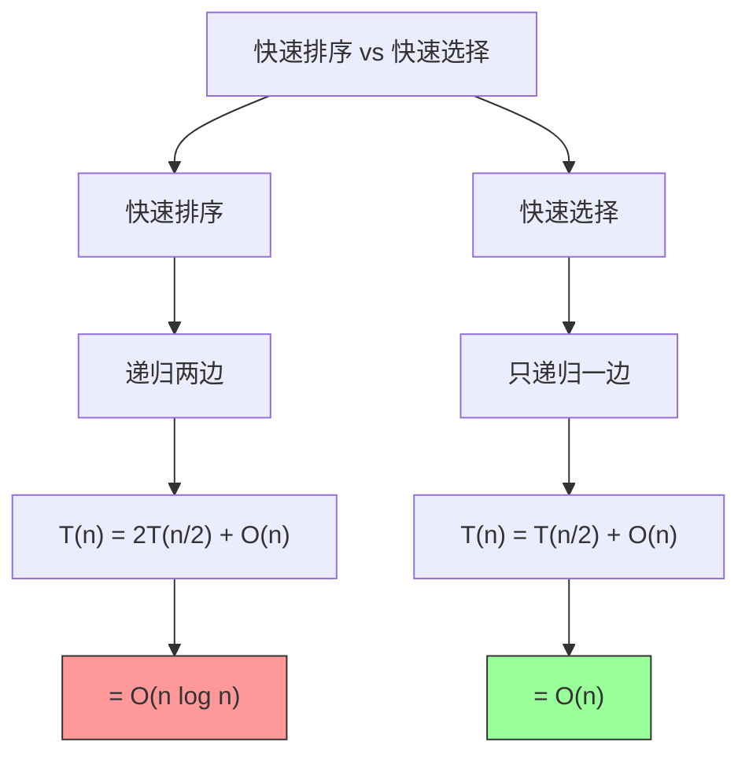

### 3.3 从 O(n log n) 到 O(n) 的推导

**几何级数的魔力**

如果每次递归规模减半：
```
T(n) = n + n/2 + n/4 + n/8 + ...
     < 2n
     = O(n)
```

这就是快速选择期望 O(n) 的数学原理。

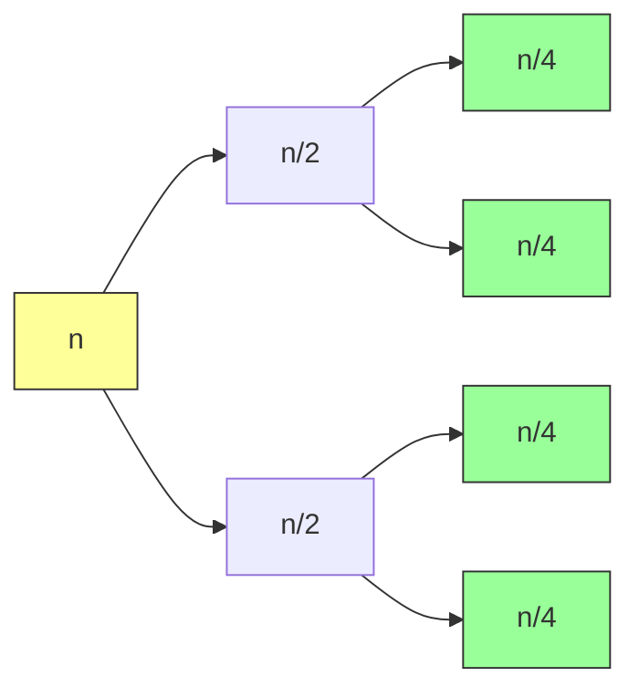

### 3.4 算法选择

| 算法 | 平均时间 | 最坏时间 | 适用场景 |
|-----|---------|---------|---------|
| 排序法 | O(n log n) | O(n log n) | 小数据量，简单场景 |
| 快速选择 | O(n) | O(n²) | 大数据量，平均性能重要 |
| 中位数的中位数 | O(n) | O(n) | 需要保证最坏情况 |

---

## 四、随机选择算法（QuickSelect）

### 4.1 算法思想

**快速选择**（QuickSelect）是快速排序的变体，核心思想：

1. **随机选择 pivot**：避免特定输入导致最坏情况
2. **分区数组**：将数组分为三部分
3. **判断位置**：根据 pivot 位置决定递归方向
4. **减治递归**：只递归包含目标元素的一半

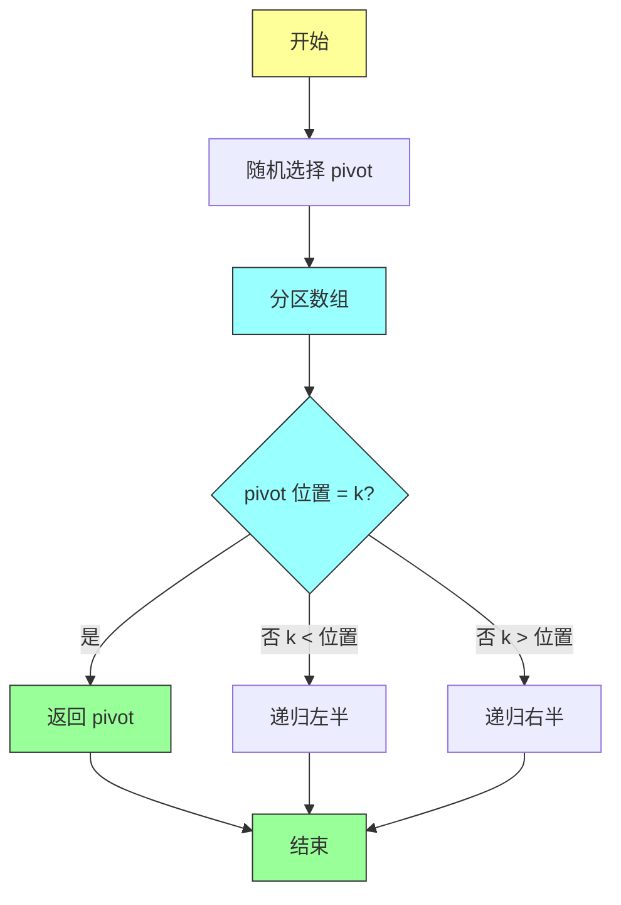

**分区结果**：
```
[小于 pivot] [pivot] [大于 pivot]
    左半       pivot    右半
   ≤ pivot            ≥ pivot
```

### 4.2 Java 实现

```java
import java.util.Random;
import java.util.Arrays;

/**
 * 随机选择算法（QuickSelect）
 *
 * 平均时间复杂度：O(n)
 * 最坏时间复杂度：O(n²)
 * 空间复杂度：O(log n) 递归栈
 *
 * 核心思想：随机选择 pivot，分区后只递归包含目标元素的一半
 */
public class RandomizedSelect {

    // 随机数生成器
    private static final Random random = new Random();

    /**
     * 找到第 k 小的元素（k 从 1 开始计数）
     *
     * @param A 输入数组
     * @param k 第 k 小，1 ≤ k ≤ A.length
     * @return 第 k 小的元素值
     */
    public static int select(int[] A, int k) {
        // 边界检查
        if (k < 1 || k > A.length) {
            throw new IllegalArgumentException("k 必须在 1 到 " + A.length + " 之间");
        }

        // 复制数组（避免修改原数组）
        int[] copy = A.clone();

        // 调用递归函数（使用 0-indexed）
        return randomizedSelect(copy, 0, copy.length - 1, k - 1);
    }

    /**
     * 递归选择函数
     *
     * 在子数组 A[left..right] 中找到第 k 小的元素
     *
     * @param A 数组
     * @param left 左边界（包含）
     * @param right 右边界（包含）
     * @param k 第 k 小（0-indexed）
     * @return 第 k 小的元素值
     */
    private static int randomizedSelect(int[] A, int left, int right, int k) {
        // ========== 基准情况 ==========
        // 只有一个元素时，它就是答案
        if (left == right) {
            return A[left];
        }

        // ========== 分区操作 ==========
        // 随机选择 pivot 并分区，返回 pivot 的最终位置
        int pivotIndex = randomizedPartition(A, left, right);

        // ========== 计算 pivot 左边元素数量 ==========
        // 左子数组包含 pivot 本身，所以要 +1
        int numLeft = pivotIndex - left + 1;

        // ========== 判断目标位置 ==========
        if (k == numLeft - 1) {
            // k 等于 pivot 在左边的位置（0-indexed）
            // 说明 pivot 本身就是第 k 小的元素
            return A[pivotIndex];
        } else if (k < numLeft - 1) {
            // 目标在 pivot 左边
            // 递归在左半部分查找
            return randomizedSelect(A, left, pivotIndex - 1, k);
        } else {
            // 目标在 pivot 右边
            // 需要调整 k（减去左边元素数量，包括 pivot）
            return randomizedSelect(A, pivotIndex + 1, right, k - numLeft);
        }
    }

    /**
     * 随机分区函数（Lomuto 分区方案）
     *
     * 将数组分为三部分：
     * - A[left..i-1]：小于等于 pivot
     * - A[i]：pivot
     * - A[i+1..right]：大于 pivot
     *
     * @param A 数组
     * @param left 左边界
     * @param right 右边界
     * @return pivot 的最终位置
     */
    private static int randomizedPartition(int[] A, int left, int right) {
        // ========== 随机选择 pivot ==========
        // 避免特定输入导致最坏情况
        int pivotIdx = left + random.nextInt(right - left + 1);

        // ========== 将 pivot 交换到 right 位置 ==========
        // Lomuto 分区约定 pivot 在 right 位置
        swap(A, pivotIdx, right);

        // ========== 分区过程 ==========
        int pivot = A[right];  // pivot 值
        int i = left - 1;      // 小于 pivot 区域的边界

        // 遍历 left 到 right-1
        for (int j = left; j < right; j++) {
            if (A[j] <= pivot) {
                // 当前元素小于等于 pivot，放入左边区域
                i++;
                swap(A, i, j);
            }
            // else: 当前元素大于 pivot，保持在右边
        }

        // ========== 放置 pivot ==========
        // 将 pivot 放到正确位置（左边区域的下一个）
        swap(A, i + 1, right);

        // 返回 pivot 的位置
        return i + 1;
    }

    /**
     * 交换数组中两个元素的位置
     */
    private static void swap(int[] A, int i, int j) {
        int temp = A[i];
        A[i] = A[j];
        A[j] = temp;
    }

    // ==================== 测试 ====================
    public static void main(String[] args) {
        int[] A = {3, 7, 2, 8, 1, 6, 5, 4};
        System.out.println("测试数组: " + Arrays.toString(A));
        System.out.println();

        // 测试所有位置
        for (int k = 1; k <= A.length; k++) {
            int result = select(A.clone(), k);
            System.out.println("第 " + k + " 小: " + result);
        }

        System.out.println();
        System.out.println("中位数: " + select(A.clone(), A.length / 2));
    }
}
```

**运行结果**：
```
测试数组: [3, 7, 2, 8, 1, 6, 5, 4]

第 1 小: 1
第 2 小: 2
第 3 小: 3
第 4 小: 4
第 5 小: 5
第 6 小: 6
第 7 小: 7
第 8 小: 8

中位数: 4
```

### 4.3 逐行解释关键代码

**分区函数的循环不变式**：

```
循环前: A[left..i] ≤ pivot, A[i+1..j-1] > pivot, A[j..right-1] 待处理
循环中: 维护不变式
循环后: A[left..i] ≤ pivot, A[i+1..right-1] > pivot, A[right] = pivot
```

**图解分区过程**（以 `[3, 7, 2, 8, 1, 6, 5, 4]`，pivot=4 为例）：

```
初始: [3, 7, 2, 8, 1, 6, 5, 4]
            ↑
           i=-1

j=0: 3 ≤ 4 → i=0, 交换 [3, 7, 2, 8, 1, 6, 5, 4]
j=1: 7 > 4 → 不变   [3, 7, 2, 8, 1, 6, 5, 4]
j=2: 2 ≤ 4 → i=1, 交换 [2, 7, 3, 8, 1, 6, 5, 4]
j=3: 8 > 4 → 不变   [2, 7, 3, 8, 1, 6, 5, 4]
j=4: 1 ≤ 4 → i=2, 交换 [2, 1, 3, 8, 7, 6, 5, 4]
j=5: 6 > 4 → 不变   [2, 1, 3, 8, 7, 6, 5, 4]
j=6: 5 > 4 → 不变   [2, 1, 3, 8, 7, 6, 5, 4]

放置 pivot: [2, 1, 3, 4, 8, 7, 6, 5]
           左边 ≤ 4   右边 ≥ 4
```

### 4.4 复杂度分析

| 情况 | 时间复杂度 | 概率 | 说明 |
|-----|-----------|------|------|
| 平均情况 | O(n) | 高 | pivot 均匀分布 |
| 最坏情况 | O(n²) | 低 | 每次都选最差 pivot |
| 期望时间 | O(n) | - | 随机化保证 |

**期望时间推导**：

1. **每次选 pivot 有 50% 概率落在"中间一半"**
2. **如果 pivot 在中间，至少排除 1/4 元素**
3. **递归式**：T(n) ≤ T(3n/4) + O(n)
4. **解**：T(n) = O(n)

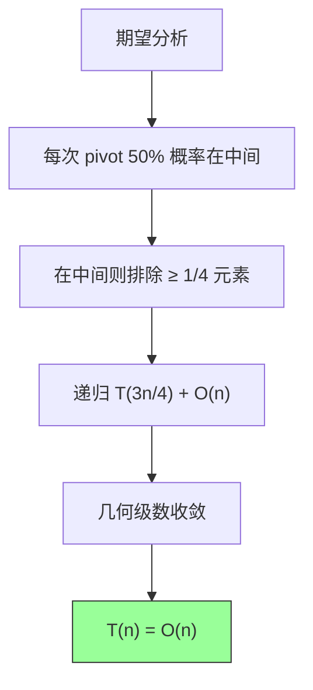

### 4.5 为什么随机化有效

**攻击场景**：
- 恶意输入：`[1, 2, 3, 4, 5, 6, 7, 8]`
- 如果总是选第一个元素作为 pivot
- 每次只能排除一个元素
- T(n) = T(n-1) + O(n) = O(n²)

**随机化解决**：
- 随机选择 pivot
- 没有特定的"最坏输入"
- 期望性能 O(n)

---

## 五、确定性选择算法（中位数的中位数）

### 5.1 为什么需要确定性算法

随机选择算法虽然平均 O(n)，但最坏情况是 O(n²)。在以下场景中可能出现问题：

1. **实时系统**：需要保证最坏情况响应时间
2. **安全敏感系统**：防止恶意输入攻击
3. **竞赛编程**：可能被卡数据

**中位数的中位数**（Median of Medians，BFPRT 算法）保证最坏情况 O(n)。

### 5.2 算法思想

核心思想：**保证 pivot 足够好**

```
步骤 1：将数组分成每组 5 个
步骤 2：对每组排序，取中位数
步骤 3：递归找所有中位数的中位数 M
步骤 4：用 M 作为 pivot 分区
步骤 5：递归
```

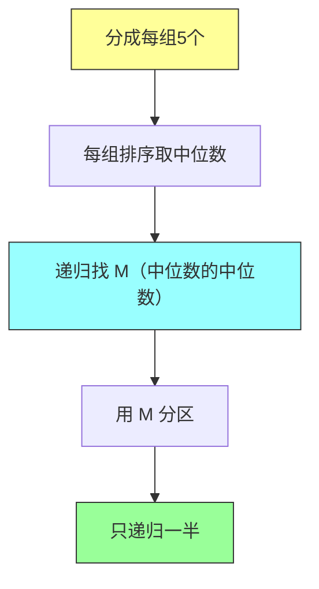

### 5.3 pivot 质量保证

**关键性质**：中位数的中位数 M 至少比 30% 的元素大，也至少比 30% 的元素小。

**证明**：
- 假设有 n 个元素，分为 n/5 组
- 每组有 5 个元素，找中位数
- 至少有一半组的中位数 ≥ M
- 每组有 3 个元素 ≥ 自己的中位数 ≥ M
- 所以 ≥ (n/5) × (1/2) × 3 = 3n/10 个元素 ≥ M

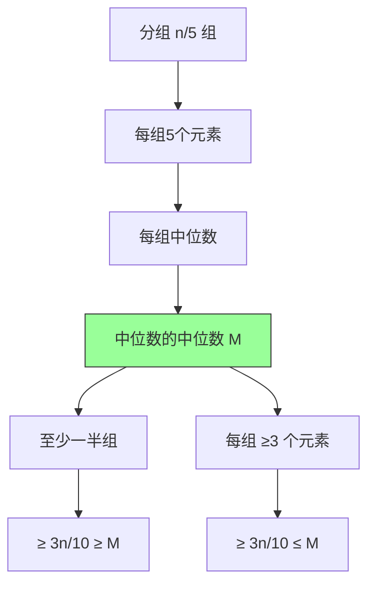

### 5.4 Java 实现

```java
import java.util.Arrays;

/**
 * 确定性选择算法（中位数的中位数 / BFPRT 算法）
 *
 * 最坏时间复杂度：O(n)
 * 平均时间复杂度：O(n)
 * 空间复杂度：O(log n) 递归栈
 *
 * 核心思想：通过中位数的中位数保证 pivot 质量，确保 O(n) 最坏情况
 */
public class DeterministicSelect {

    /**
     * 找到第 k 小的元素（k 从 1 开始计数）
     */
    public static int select(int[] A, int k) {
        if (k < 1 || k > A.length) {
            throw new IllegalArgumentException("k 无效");
        }

        // 复制数组（避免修改原数组）
        int[] copy = A.clone();

        // 调用递归函数
        return select(copy, 0, copy.length - 1, k - 1);
    }

    /**
     * 递归选择函数
     */
    private static int select(int[] A, int left, int right, int k) {
        // 基准情况
        if (left == right) {
            return A[left];
        }

        // 找到中位数的中位数作为 pivot
        int pivotIndex = medianOfMedians(A, left, right);

        // 用 pivot 分区
        int pivotNewIndex = partition(A, left, right, pivotIndex);

        // 左子数组大小（包含 pivot）
        int numLeft = pivotNewIndex - left + 1;

        if (k == numLeft - 1) {
            return A[pivotNewIndex];
        } else if (k < numLeft - 1) {
            return select(A, left, pivotNewIndex - 1, k);
        } else {
            return select(A, pivotNewIndex + 1, right, k - numLeft);
        }
    }

    /**
     * 找到中位数的中位数
     *
     * 步骤：
     * 1. 将数组分成每组 5 个
     * 2. 对每组排序，取中位数
     * 3. 递归找这些中位数的中位数
     */
    private static int medianOfMedians(int[] A, int left, int right) {
        int n = right - left + 1;

        // 元素少于 5 个，直接排序返回中位数
        if (n <= 5) {
            insertionSort(A, left, right);
            return left + n / 2;
        }

        // ========== 分成每组 5 个 ==========
        int numGroups = (n + 4) / 5;  // 向上取整

        // ========== 收集每组中位数的索引 ==========
        int[] medianIndices = new int[numGroups];

        for (int i = 0; i < numGroups; i++) {
            int groupStart = left + i * 5;
            int groupEnd = Math.min(groupStart + 4, right);

            // 对当前组排序
            insertionSort(A, groupStart, groupEnd);

            // 找到中位数索引
            int medianIndex = groupStart + (groupEnd - groupStart) / 2;
            medianIndices[i] = medianIndex;
        }

        // ========== 递归找中位数的中位数 ==========
        // 在中位数数组中找到第 (numGroups/2) 小的索引
        int medianOfMediansIndex = select(
            A, 0, numGroups - 1, numGroups / 2
        );

        // 返回原始数组中中位数的中位数的位置
        return medianIndices[medianOfMediansIndex];
    }

    /**
     * 插入排序（用于小数组）
     *
     * 时间复杂度：O(1)（因为组大小固定为 5）
     */
    private static void insertionSort(int[] A, int left, int right) {
        for (int i = left + 1; i <= right; i++) {
            int key = A[i];
            int j = i - 1;

            // 将大于 key 的元素向后移动
            while (j >= left && A[j] > key) {
                A[j + 1] = A[j];
                j--;
            }
            A[j + 1] = key;
        }
    }

    /**
     * 分区操作（Hoare 分区方案变体）
     */
    private static int partition(int[] A, int left, int right, int pivotIndex) {
        int pivotValue = A[pivotIndex];

        // 将 pivot 移到末尾
        swap(A, pivotIndex, right);

        int storeIndex = left;
        for (int i = left; i < right; i++) {
            if (A[i] < pivotValue) {
                swap(A, storeIndex, i);
                storeIndex++;
            }
        }

        // 将 pivot 放回正确位置
        swap(A, storeIndex, right);
        return storeIndex;
    }

    private static void swap(int[] A, int i, int j) {
        int temp = A[i];
        A[i] = A[j];
        A[j] = temp;
    }

    // ==================== 测试 ====================
    public static void main(String[] args) {
        int[] A = {3, 7, 2, 8, 1, 6, 5, 4};
        System.out.println("测试数组: " + Arrays.toString(A));
        System.out.println();

        for (int k = 1; k <= A.length; k++) {
            System.out.println("第 " + k + " 小: " + select(A.clone(), k));
        }

        System.out.println();
        System.out.println("中位数: " + select(A.clone(), A.length / 2));
    }
}
```

**运行结果**：
```
测试数组: [3, 7, 2, 8, 1, 6, 5, 4]

第 1 小: 1
第 2 小: 2
第 3 小: 3
第 4 小: 4
第 5 小: 5
第 6 小: 6
第 7 小: 7
第 8 小: 8

中位数: 4
```

### 5.5 最坏情况复杂度证明

**递归式**：
```
T(n) ≤ T(n/5) + T(7n/10) + O(n)
```

**解释**：
- T(n/5)：找中位数的中位数（递归）
- T(7n/10)：递归处理最多 7n/10 元素（因为 pivot 至少比 30% 大，也至少比 30% 小）
- O(n)：分组、排序、分区

**数学证明**（代入法）：

假设 T(n) ≤ cn（c 为常数）

```
T(n) ≤ c(n/5) + c(7n/10) + an
     = cn/5 + 7cn/10 + an
     = 9cn/10 + an

需要 cn ≥ 9cn/10 + an
    cn/10 ≥ an
    c ≥ 10a
```

令 c = 10a，则 T(n) ≤ cn = O(n)

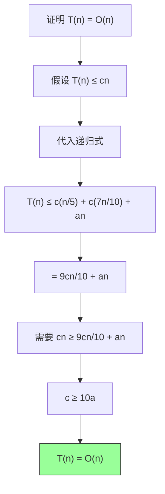

### 5.6 为什么选择 5 个一组

**分析不同分组大小**：

| 分组大小 | 递归式 | 是否收敛 |
|---------|-------|---------|
| 3 | T(n) ≤ T(n/3) + T(2n/3) + O(n) | 不收敛（和为 n） |
| 5 | T(n) ≤ T(n/5) + T(7n/10) + O(n) | 收敛（和小于 n） |
| 7 | T(n) ≤ T(n/7) + T(5n/7) + O(n) | 收敛 |

**结论**：5 是满足收敛的最小奇数，常数因子最优。

---

## 六、具体例子演示

### 6.1 QuickSelect 执行过程

数组：`[3, 7, 2, 8, 1, 6, 5, 4]`，找第 4 小（期望中位数）

**初始数组**：
```
[3, 7, 2, 8, 1, 6, 5, 4]
```

**Step 1**：随机选 pivot = 6，分区后
```
[3, 2, 1, 5, 4, 6, 7, 8]
            ↑
       pivot 在第 6 位
       （左半 5 个元素）

目标：第 4 小
pivot 是第 6 小
所以目标在左半（需要第 4 小）
```

**Step 2**：在 `[3, 2, 1, 5, 4]` 中找第 4 小
```
随机选 pivot = 2，分区后
[1, 2, 3, 5, 4]
       ↑
  pivot 在第 2 位

目标：第 4 小
pivot 是第 2 小
所以目标在右半（需要第 4-2=2 小）
```

**Step 3**：在 `[3, 5, 4]` 中找第 2 小
```
随机选 pivot = 4，分区后
[3, 4, 5]
    ↑
pivot 在第 2 位

目标：第 2 小
pivot 是第 2 小 → 找到！
```

**最终结果**：第 4 小 = 4

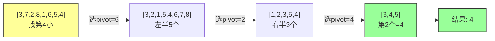

### 6.2 中位数的中位数执行过程

数组：`[3, 7, 2, 8, 1, 6, 5, 4, 9, 10]`

**Step 1**：分成每组 5 个
```
组1: [3, 7, 2, 8, 1] → 排序 [1, 2, 3, 7, 8] → 中位数=3
组2: [6, 5, 4, 9, 10] → 排序 [4, 5, 6, 9, 10] → 中位数=6
```

**Step 2**：找中位数的中位数
```
中位数数组: [3, 6]
中位数的中位数: 5（取第1个）
```

**Step 3**：用 5 作为 pivot 分区
```
[3, 2, 1, 4, 5, 6, 7, 8, 9, 10]
              ↑
         pivot=5 在第5位
```

**Step 4**：递归

### 6.3 成对找最小值和最大值

数组：`[3, 7, 2, 8, 1, 5]`，同时找最小值和最大值

**普通方法**：12 次比较（6 次找 min + 6 次找 max）

**成对比较法**：只需要 8 次比较

```
初始化: min = 3, max = 3

第1对 (7, 2):
  - 比较 7 和 2: 1 次
  - min 与 2 比较: 1 次
  - max 与 7 比较: 1 次
  - 结果: min=2, max=7

第2对 (8, 1):
  - 比较 8 和 1: 1 次
  - min 与 1 比较: 1 次
  - max 与 8 比较: 1 次
  - 结果: min=1, max=8

第3对 (5, 无配对):
  - min 与 5 比较: 1 次
  - max 与 5 比较: 1 次
  - 结果: min=1, max=8

总计: 3 + 3 + 2 = 8 次比较
```

**公式**：
- 奇数：3(n-1)/2 = 3n/2 - 1.5
- 偶数：3(n-2)/2 + 1 = 3n/2 - 2

---

## 七、复杂度分析

### 7.1 各算法对比

| 算法 | 平均时间 | 最坏时间 | 空间 | 稳定性 | 常数因子 |
|-----|---------|---------|------|--------|---------|
| 排序后选择 | O(n log n) | O(n log n) | O(n) | N/A | 小 |
| 随机选择 | O(n) | O(n²) | O(log n) | 不稳定 | 小 |
| 确定性选择 | O(n) | O(n) | O(log n) | 不稳定 | 大 |
| 堆选择 | O(n log k) | O(n log k) | O(k) | 不稳定 | 中 |

### 7.2 选择建议

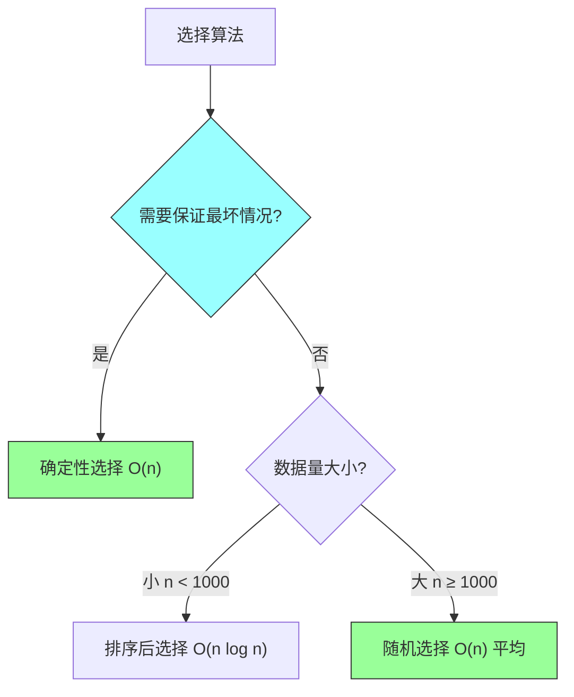

---

## 八、举一反三

### 8.1 变形题目 1：找第 k 大

**问题**：找第 k 大的元素

**思路**：第 k 大 = 第 n-k+1 小

```java
public static int findKthLargest(int[] A, int k) {
    // 第 k 大 = 第 n-k+1 小
    return RandomizedSelect.select(A, A.length - k + 1);
}
```

### 8.2 变形题目 2：找中位数

**问题**：找数组的中位数

**思路**：偶数长度取平均值，奇数长度直接取

```java
public static double findMedian(int[] A) {
    int n = A.length;
    if (n % 2 == 1) {
        return RandomizedSelect.select(A, n / 2 + 1);
    } else {
        int lower = RandomizedSelect.select(A, n / 2);
        int upper = RandomizedSelect.select(A, n / 2 + 1);
        return (lower + upper) / 2.0;
    }
}
```

### 8.3 变形题目 3：同时找第 k 小和第 m 小

**问题**：k < m，同时找第 k 小和第 m 小

**思路**：一次 QuickSelect 找到 pivot，再分别处理两边

```java
public static int[] findKthAndMth(int[] A, int k, int m) {
    int n = A.length;
    int pivot = RandomizedSelect.select(A.clone(), k);
    // ... 根据 pivot 位置继续查找
    return new int[]{/* 第 k 小 */, /* 第 m 小 */};
}
```

### 8.4 LeetCode 题目推荐

| 题目 | 描述 | 推荐解法 |
|-----|------|---------|
| 215 | 数组中的第 K 个最大元素 | QuickSelect |
| 347 | 前 K 个高频元素 | 堆 + QuickSelect |
| 973 | 最接近原点的 K 个点 | QuickSelect |
| 658 | 找到 K 个最接近的元素 | 双指针 + 二分 |

---

## 九、课后思考

### 思考题 1
证明：成对比较找最小值和最大值最多需要 3n/2 - 2 次比较。

### 思考题 2
在随机选择算法中，如果 pivot 总是恰好在第 n/2 小的位置，递归深度是多少？

### 思考题 3
为什么中位数的中位数算法选择 5 个一组而不是 3 个或 7 个一组？

### 思考题 4
设计一个算法，在 O(n) 时间内同时找到第 k 小和第 m 小的元素（k < m）。

### 思考题 5
比较随机选择和确定性选择的优缺点，在什么情况下应该选择哪种算法？

### 思考题 6
证明：快速选择算法的期望比较次数不超过 4n。

---

## 十、总结

### 核心概念

1. **顺序统计量**：第 i 小的元素
2. **中位数**：第 n/2 小的元素
3. **分区思想**：快速排序的核心
4. **减治策略**：只递归包含目标的一半
5. **随机化**：避免特定最坏输入

### 算法对比

```
排序法：    简单但低效，适合小数据量
            ├─ 优点：代码简洁，易实现
            └─ 缺点：O(n log n) 排序全部元素

随机选择：  实际首选，平均 O(n)
            ├─ 优点：平均性能好，常数因子小
            └─ 缺点：最坏情况 O(n²)，可能被攻击

中位数法：  理论最优，保证 O(n)
            ├─ 优点：最坏情况有保障
            └─ 缺点：常数因子大，实现复杂
```

### 学习建议

1. **理解分区**：这是快速选择的核心
2. **跟踪例子**：手动模拟执行过程
3. **分析复杂度**：理解期望和最坏的区别
4. **实践编码**：实现代码并测试各种情况

---

*本章精读笔记完成*
