# 第十章：基本数据结构

## 一、数据结构概述

### 1.1 什么是数据结构

**数据结构**是组织和存储数据的方式，使得数据可以被高效地访问和修改。

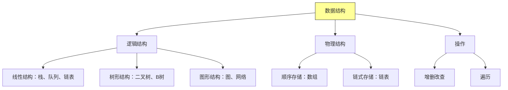

### 1.2 本章内容概览

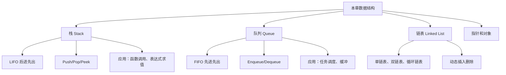

---

## 二、栈

### 2.1 栈的定义

**栈**是一种**后进先出**（LIFO, Last-In-First-Out）的数据结构。

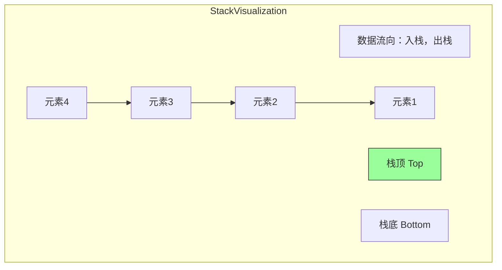

### 2.2 栈的操作

```java
/**
 * 栈接口
 */
public interface Stack<E> {
    /**
     * 入栈
     */
    void push(E element);

    /**
     * 出栈
     * @return 栈顶元素
     * @throws java.util.NoSuchElementException 如果栈为空
     */
    E pop();

    /**
     * 查看栈顶元素（不出栈）
     * @return 栈顶元素
     */
    E peek();

    /**
     * 判断栈是否为空
     */
    boolean isEmpty();

    /**
     * 返回栈中元素个数
     */
    int size();
}
```

### 2.3 数组实现

```java
import java.util.NoSuchElementException;

/**
 * 栈的数组实现
 */
public class ArrayStack<E> implements Stack<E> {
    private E[] data;       // 存储数据的数组
    private int size;       // 当前元素个数
    private int capacity;   // 数组容量

    public ArrayStack() {
        this.capacity = 16;
        this.data = (E[]) new Object[capacity];
        this.size = 0;
    }

    public ArrayStack(int capacity) {
        this.capacity = capacity;
        this.data = (E[]) new Object[capacity];
        this.size = 0;
    }

    /**
     * 入栈
     * 时间复杂度：均摊 O(1)
     */
    @Override
    public void push(E element) {
        if (size == capacity) {
            resize(capacity * 2);  // 动态扩容
        }
        data[size++] = element;
    }

    /**
     * 出栈
     * 时间复杂度：O(1)
     */
    @Override
    public E pop() {
        if (isEmpty()) {
            throw new NoSuchElementException("Stack is empty");
        }
        E element = data[--size];
        data[size] = null;  // 避免内存泄漏

        // 缩容（可选，防止内存浪费）
        if (size > 0 && size == capacity / 4) {
            resize(capacity / 2);
        }

        return element;
    }

    /**
     * 查看栈顶元素
     * 时间复杂度：O(1)
     */
    @Override
    public E peek() {
        if (isEmpty()) {
            throw new NoSuchElementException("Stack is empty");
        }
        return data[size - 1];
    }

    @Override
    public boolean isEmpty() {
        return size == 0;
    }

    @Override
    public int size() {
        return size;
    }

    /**
     * 动态扩容/缩容
     * 时间复杂度：均摊 O(1)
     */
    private void resize(int newCapacity) {
        E[] newData = (E[]) new Object[newCapacity];
        System.arraycopy(data, 0, newData, 0, size);
        data = newData;
        capacity = newCapacity;
    }

    @Override
    public String toString() {
        StringBuilder sb = new StringBuilder();
        sb.append("ArrayStack: [");
        for (int i = size - 1; i >= 0; i--) {
            sb.append(data[i]);
            if (i > 0) sb.append(", ");
        }
        sb.append("] (top)");
        return sb.toString();
    }
}
```

### 2.4 链表实现

```java
/**
 * 栈的链表实现
 */
public class LinkedStack<E> implements Stack<E> {
    private Node top;  // 栈顶节点
    private int size;  // 元素个数

    private class Node {
        E element;
        Node next;

        Node(E element) {
            this.element = element;
        }
    }

    public LinkedStack() {
        this.top = null;
        this.size = 0;
    }

    /**
     * 入栈：在链表头部插入
     * 时间复杂度：O(1)
     */
    @Override
    public void push(E element) {
        Node newNode = new Node(element);
        newNode.next = top;
        top = newNode;
        size++;
    }

    /**
     * 出栈：删除链表头部
     * 时间复杂度：O(1)
     */
    @Override
    public E pop() {
        if (isEmpty()) {
            throw new NoSuchElementException("Stack is empty");
        }
        E element = top.element;
        top = top.next;
        size--;
        return element;
    }

    /**
     * 查看栈顶元素
     * 时间复杂度：O(1)
     */
    @Override
    public E peek() {
        if (isEmpty()) {
            throw new NoSuchElementException("Stack is empty");
        }
        return top.element;
    }

    @Override
    public boolean isEmpty() {
        return top == null;
    }

    @Override
    public int size() {
        return size;
    }

    @Override
    public String toString() {
        StringBuilder sb = new StringBuilder();
        sb.append("LinkedStack: [");
        Node current = top;
        while (current != null) {
            sb.append(current.element);
            if (current.next != null) sb.append(", ");
            current = current.next;
        }
        sb.append("] (top)");
        return sb.toString();
    }
}
```

### 2.5 栈的应用

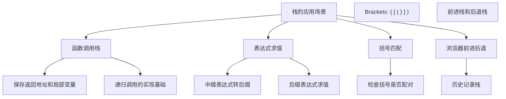

### 2.6 表达式求值示例

```java
/**
 * 表达式求值：后缀表达式计算器
 */
public class PostfixEvaluator {
    private Stack<Integer> stack;

    public PostfixEvaluator() {
        stack = new ArrayStack<>();
    }

    /**
     * 计算后缀表达式
     *
     * @param expr 后缀表达式，如 "5 3 + 8 *"
     * @return 计算结果
     */
    public int evaluate(String expr) {
        String[] tokens = expr.split("\\s+");

        for (String token : tokens) {
            if (isNumber(token)) {
                stack.push(Integer.parseInt(token));
            } else if (isOperator(token)) {
                int b = stack.pop();  // 注意：第二个操作数先出栈
                int a = stack.pop();
                int result = applyOperator(a, b, token);
                stack.push(result);
            }
        }

        if (stack.size() != 1) {
            throw new IllegalArgumentException("Invalid expression");
        }

        return stack.pop();
    }

    private boolean isNumber(String token) {
        try {
            Integer.parseInt(token);
            return true;
        } catch (NumberFormatException e) {
            return false;
        }
    }

    private boolean isOperator(String token) {
        return token.equals("+") || token.equals("-") ||
               token.equals("*") || token.equals("/");
    }

    private int applyOperator(int a, int b, String operator) {
        switch (operator) {
            case "+": return a + b;
            case "-": return a - b;
            case "*": return a * b;
            case "/":
                if (b == 0) throw new ArithmeticException("Division by zero");
                return a / b;
            default:
                throw new IllegalArgumentException("Unknown operator: " + operator);
        }
    }

    /**
     * 中缀表达式转后缀表达式
     */
    public static String infixToPostfix(String infix) {
        StringBuilder result = new StringBuilder();
        Stack<Character> stack = new ArrayStack<>();

        for (int i = 0; i < infix.length(); i++) {
            char c = infix.charAt(i);

            if (Character.isDigit(c) || Character.isLetter(c)) {
                // 操作数直接输出
                result.append(c).append(' ');
            } else if (c == '(') {
                stack.push(c);
            } else if (c == ')') {
                // 弹出直到遇到 '('
                while (!stack.isEmpty() && stack.peek() != '(') {
                    result.append(stack.pop()).append(' ');
                }
                if (!stack.isEmpty()) {
                    stack.pop();  // 弹出 '('
                }
            } else if (isOperator(c)) {
                // 处理运算符优先级
                while (!stack.isEmpty() && precedence(stack.peek()) >= precedence(c)) {
                    result.append(stack.pop()).append(' ');
                }
                stack.push(c);
            }
        }

        while (!stack.isEmpty()) {
            result.append(stack.pop()).append(' ');
        }

        return result.toString().trim();
    }

    private static int precedence(char op) {
        if (op == '+' || op == '-') return 1;
        if (op == '*' || op == '/') return 2;
        return 0;
    }

    public static void main(String[] args) {
        PostfixEvaluator evaluator = new PostfixEvaluator();

        // 计算后缀表达式
        System.out.println("5 3 + 8 * = " + evaluator.evaluate("5 3 + 8 *"));  // 64
        System.out.println("7 3 + = " + evaluator.evaluate("7 3 +"));  // 10

        // 中缀转后缀
        String infix = "A + B * C - D / E";
        String postfix = infixToPostfix(infix);
        System.out.println(infix + " -> " + postfix);  // A B C * + D E / -
    }
}
```

---

## 三、队列

### 3.1 队列的定义

**队列**是一种**先进先出**（FIFO, First-In-First-Out）的数据结构。

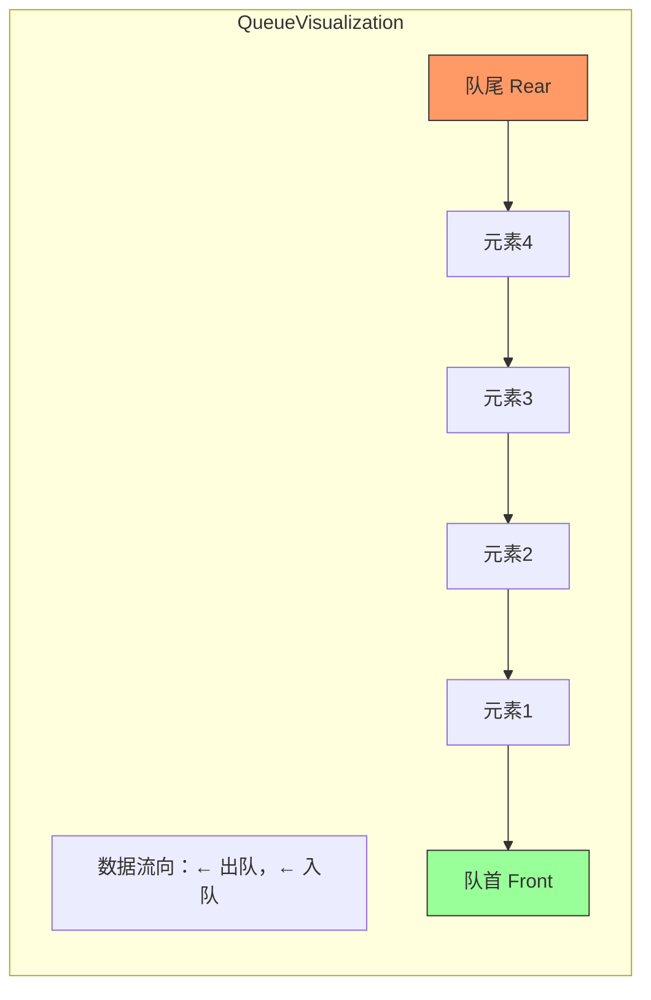

### 3.2 队列的操作

```java
/**
 * 队列接口
 */
public interface Queue<E> {
    /**
     * 入队
     */
    void enqueue(E element);

    /**
     * 出队
     * @return 队首元素
     */
    E dequeue();

    /**
     * 查看队首元素
     */
    E peek();

    /**
     * 判断队列是否为空
     */
    boolean isEmpty();

    /**
     * 返回队列中元素个数
     */
    int size();
}
```

### 3.3 循环队列实现

```java
/**
 * 循环队列实现
 * 使用数组，支持 O(1) 的入队和出队操作
 */
public class ArrayQueue<E> implements Queue<E> {
    private E[] data;      // 存储数据的数组
    private int front;     // 队首指针
    private int rear;      // 队尾指针
    private int size;      // 当前元素个数
    private int capacity;  // 队列容量

    @SuppressWarnings("unchecked")
    public ArrayQueue(int capacity) {
        this.capacity = capacity + 1;  // 多一个位置用于区分空/满
        this.data = (E[]) new Object[capacity + 1];
        this.front = 0;
        this.rear = 0;
        this.size = 0;
    }

    /**
     * 入队
     * 时间复杂度：O(1)
     */
    @Override
    public void enqueue(E element) {
        if (isFull()) {
            throw new IllegalStateException("Queue is full");
        }
        data[rear] = element;
        rear = (rear + 1) % capacity;
        size++;
    }

    /**
     * 出队
     * 时间复杂度：O(1)
     */
    @Override
    public E dequeue() {
        if (isEmpty()) {
            throw new NoSuchElementException("Queue is empty");
        }
        E element = data[front];
        front = (front + 1) % capacity;
        size--;
        return element;
    }

    /**
     * 查看队首元素
     * 时间复杂度：O(1)
     */
    @Override
    public E peek() {
        if (isEmpty()) {
            throw new NoSuchElementException("Queue is empty");
        }
        return data[front];
    }

    @Override
    public boolean isEmpty() {
        return front == rear && size == 0;
    }

    public boolean isFull() {
        return front == rear && size > 0;
    }

    @Override
    public int size() {
        return size;
    }

    @Override
    public String toString() {
        StringBuilder sb = new StringBuilder();
        sb.append("ArrayQueue: [");
        int current = front;
        for (int i = 0; i < size; i++) {
            sb.append(data[current]);
            if (i < size - 1) sb.append(", ");
            current = (current + 1) % capacity;
        }
        sb.append("] (front -> rear)");
        return sb.toString();
    }
}
```

### 3.4 链表实现

```java
/**
 * 队列的链表实现
 */
public class LinkedQueue<E> implements Queue<E> {
    private Node front;  // 队首节点
    private Node rear;   // 队尾节点
    private int size;    // 元素个数

    private class Node {
        E element;
        Node next;

        Node(E element) {
            this.element = element;
        }
    }

    public LinkedQueue() {
        this.front = null;
        this.rear = null;
        this.size = 0;
    }

    /**
     * 入队：在链表尾部添加
     * 时间复杂度：O(1)
     */
    @Override
    public void enqueue(E element) {
        Node newNode = new Node(element);
        if (isEmpty()) {
            front = newNode;
            rear = newNode;
        } else {
            rear.next = newNode;
            rear = newNode;
        }
        size++;
    }

    /**
     * 出队：删除链表头部
     * 时间复杂度：O(1)
     */
    @Override
    public E dequeue() {
        if (isEmpty()) {
            throw new NoSuchElementException("Queue is empty");
        }
        E element = front.element;
        front = front.next;
        size--;

        if (isEmpty()) {
            rear = null;  // 队列为空时重置 rear
        }

        return element;
    }

    /**
     * 查看队首元素
     * 时间复杂度：O(1)
     */
    @Override
    public E peek() {
        if (isEmpty()) {
            throw new NoSuchElementException("Queue is empty");
        }
        return front.element;
    }

    @Override
    public boolean isEmpty() {
        return front == null;
    }

    @Override
    public int size() {
        return size;
    }

    @Override
    public String toString() {
        StringBuilder sb = new StringBuilder();
        sb.append("LinkedQueue: [");
        Node current = front;
        while (current != null) {
            sb.append(current.element);
            if (current.next != null) sb.append(", ");
            current = current.next;
        }
        sb.append("] (front -> rear)");
        return sb.toString();
    }
}
```

### 3.5 双端队列（Deque）

```java
/**
 * 双端队列：可以在两端进行插入和删除
 */
public class Deque<E> {
    private final LinkedList<E> list = new LinkedList<>();

    /**
     * 从头部插入
     */
    public void addFirst(E element) {
        list.add(0, element);
    }

    /**
     * 从尾部插入
     */
    public void addLast(E element) {
        list.add(element);
    }

    /**
     * 从头部删除
     */
    public E removeFirst() {
        if (isEmpty()) throw new NoSuchElementException();
        return list.remove(0);
    }

    /**
     * 从尾部删除
     */
    public E removeLast() {
        if (isEmpty()) throw new NoSuchElementException();
        return list.remove(size() - 1);
    }

    /**
     * 查看头部元素
     */
    public E getFirst() {
        if (isEmpty()) throw new NoSuchElementException();
        return list.get(0);
    }

    /**
     * 查看尾部元素
     */
    public E getLast() {
        if (isEmpty()) throw new NoSuchElementException();
        return list.get(size() - 1);
    }

    public boolean isEmpty() {
        return list.isEmpty();
    }

    public int size() {
        return list.size();
    }
}
```

### 3.6 队列的应用

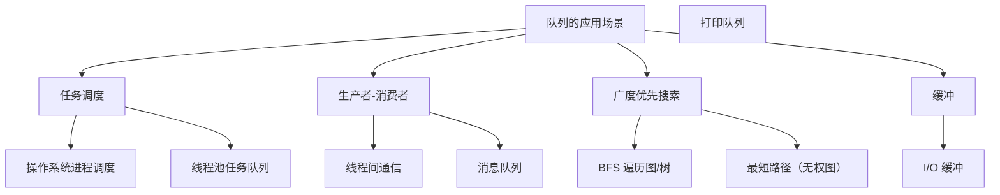

---

## 四、链表

### 4.1 链表的定义

**链表**是一种线性数据结构，通过指针将一系列节点连接起来。

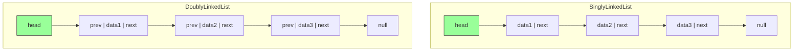

### 4.2 单链表实现

```java
/**
 * 单链表实现
 */
public class LinkedList<E> {
    private Node head;  // 头节点
    private int size;   // 元素个数

    private class Node {
        E element;
        Node next;

        Node(E element) {
            this.element = element;
        }
    }

    public LinkedList() {
        this.head = null;
        this.size = 0;
    }

    /**
     * 在链表头部插入
     * 时间复杂度：O(1)
     */
    public void addFirst(E element) {
        Node newNode = new Node(element);
        newNode.next = head;
        head = newNode;
        size++;
    }

    /**
     * 在链表尾部插入
     * 时间复杂度：O(n)
     */
    public void addLast(E element) {
        Node newNode = new Node(element);
        if (head == null) {
            head = newNode;
        } else {
            Node current = head;
            while (current.next != null) {
                current = current.next;
            }
            current.next = newNode;
        }
        size++;
    }

    /**
     * 在指定位置插入
     * 时间复杂度：O(n)
     */
    public void add(int index, E element) {
        if (index < 0 || index > size) {
            throw new IndexOutOfBoundsException("Index: " + index + ", Size: " + size);
        }

        if (index == 0) {
            addFirst(element);
            return;
        }

        Node prev = getNode(index - 1);
        Node newNode = new Node(element);
        newNode.next = prev.next;
        prev.next = newNode;
        size++;
    }

    /**
     * 删除头部元素
     * 时间复杂度：O(1)
     */
    public E removeFirst() {
        if (head == null) {
            throw new IndexOutOfBoundsException("List is empty");
        }
        E element = head.element;
        head = head.next;
        size--;
        return element;
    }

    /**
     * 删除指定位置的元素
     * 时间复杂度：O(n)
     */
    public E remove(int index) {
        if (index < 0 || index >= size) {
            throw new IndexOutOfBoundsException("Index: " + index + ", Size: " + size);
        }

        if (index == 0) {
            return removeFirst();
        }

        Node prev = getNode(index - 1);
        Node toRemove = prev.next;
        prev.next = toRemove.next;
        size--;
        return toRemove.element;
    }

    /**
     * 获取元素
     * 时间复杂度：O(n)
     */
    public E get(int index) {
        return getNode(index).element;
    }

    /**
     * 获取节点（辅助方法）
     */
    private Node getNode(int index) {
        if (index < 0 || index >= size) {
            throw new IndexOutOfBoundsException("Index: " + index + ", Size: " + size);
        }

        Node current = head;
        for (int i = 0; i < index; i++) {
            current = current.next;
        }
        return current;
    }

    /**
     * 查找元素索引
     * 时间复杂度：O(n)
     */
    public int indexOf(E element) {
        Node current = head;
        int index = 0;
        while (current != null) {
            if (element == null ? current.element == null :
                element.equals(current.element)) {
                return index;
            }
            current = current.next;
            index++;
        }
        return -1;
    }

    public boolean isEmpty() {
        return head == null;
    }

    public int size() {
        return size;
    }

    @Override
    public String toString() {
        StringBuilder sb = new StringBuilder();
        sb.append("[");
        Node current = head;
        while (current != null) {
            sb.append(current.element);
            if (current.next != null) sb.append(", ");
            current = current.next;
        }
        sb.append("]");
        return sb.toString();
    }
}
```

### 4.3 双链表实现

```java
/**
 * 双链表实现
 * 支持双向遍历
 */
public class DoublyLinkedList<E> {
    private Node head;  // 头节点
    private Node tail;  // 尾节点
    private int size;

    private class Node {
        E element;
        Node prev;
        Node next;

        Node(E element) {
            this.element = element;
        }
    }

    public DoublyLinkedList() {
        this.head = null;
        this.tail = null;
        this.size = 0;
    }

    /**
     * 在头部插入
     */
    public void addFirst(E element) {
        Node newNode = new Node(element);
        if (isEmpty()) {
            head = newNode;
            tail = newNode;
        } else {
            newNode.next = head;
            head.prev = newNode;
            head = newNode;
        }
        size++;
    }

    /**
     * 在尾部插入
     */
    public void addLast(E element) {
        Node newNode = new Node(element);
        if (isEmpty()) {
            head = newNode;
            tail = newNode;
        } else {
            newNode.prev = tail;
            tail.next = newNode;
            tail = newNode;
        }
        size++;
    }

    /**
     * 在指定位置插入
     */
    public void add(int index, E element) {
        if (index < 0 || index > size) {
            throw new IndexOutOfBoundsException();
        }

        if (index == 0) {
            addFirst(element);
        } else if (index == size) {
            addLast(element);
        } else {
            Node after = getNode(index);
            Node before = after.prev;
            Node newNode = new Node(element);

            newNode.next = after;
            newNode.prev = before;
            before.next = newNode;
            after.prev = newNode;
            size++;
        }
    }

    /**
     * 删除头部
     */
    public E removeFirst() {
        if (isEmpty()) throw new IndexOutOfBoundsException();
        E element = head.element;
        head = head.next;
        if (head != null) {
            head.prev = null;
        } else {
            tail = null;
        }
        size--;
        return element;
    }

    /**
     * 删除尾部
     */
    public E removeLast() {
        if (isEmpty()) throw new IndexOutOfBoundsException();
        E element = tail.element;
        tail = tail.prev;
        if (tail != null) {
            tail.next = null;
        } else {
            head = null;
        }
        size--;
        return element;
    }

    /**
     * 删除指定位置的元素
     */
    public E remove(int index) {
        if (index < 0 || index >= size) {
            throw new IndexOutOfBoundsException();
        }

        if (index == 0) return removeFirst();
        if (index == size - 1) return removeLast();

        Node toRemove = getNode(index);
        Node before = toRemove.prev;
        Node after = toRemove.next;

        before.next = after;
        after.prev = before;
        size--;

        return toRemove.element;
    }

    /**
     * 获取节点
     */
    private Node getNode(int index) {
        if (index < size / 2) {
            // 从前往后找
            Node current = head;
            for (int i = 0; i < index; i++) {
                current = current.next;
            }
            return current;
        } else {
            // 从后往前找
            Node current = tail;
            for (int i = size - 1; i > index; i--) {
                current = current.prev;
            }
            return current;
        }
    }

    public boolean isEmpty() {
        return head == null;
    }

    public int size() {
        return size;
    }
}
```

### 4.4 链表 vs 数组

| 操作 | 链表 | 数组 |
|-----|------|------|
| 随机访问 | O(n) | O(1) |
| 头部插入/删除 | O(1) | O(n) |
| 尾部插入/删除 | O(n)/O(1)* | O(1) |
| 中间插入/删除 | O(n) | O(n) |
| 空间开销 | O(n) 指针 | O(1) |

*带尾指针的链表可以实现 O(1) 尾部插入

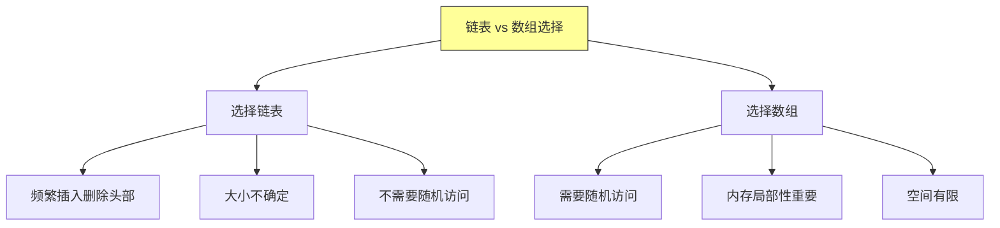

---

## 五、总结与要点

### 5.1 核心概念回顾

```mermaid
flowchart TD
    A["第十章核心"] --> B["栈 Stack"]
    A --> C["队列 Queue"]
    A --> D["链表 Linked List"]

    B --> B1["LIFO 后进先出"]
    B --> B2["push/pop/peek"]
    B --> B3["数组或链表实现"

    C --> C1["FIFO 先进先出"]
    C --> C2["enqueue/dequeue"]
    C --> C3["循环队列/链表队列"

    D --> D1["节点 + 指针"]
    D --> D2["单链表/双链表"]
    D --> D3["动态大小"]

    style A fill:#ff9,stroke:#333
```

### 5.2 操作复杂度总结

| 数据结构 | push | pop | peek | enqueue | dequeue |
|---------|------|-----|------|---------|---------|
| 栈（数组） | O(1)* | O(1) | O(1) | - | - |
| 栈（链表） | O(1) | O(1) | O(1) | - | - |
| 队列（循环） | O(1) | - | O(1) | O(1) | O(1) |
| 队列（链表） | O(1) | - | O(1) | O(1) | O(1) |
| 链表头部 | O(1) | O(1) | - | - | - |
| 链表尾部 | O(n) | - | - | O(n)** | - |

*均摊分析
**带尾指针可优化为 O(1)

### 5.3 应用场景总结

```
栈的应用：
├── 函数调用栈
├── 表达式求值
├── 括号匹配
└── 浏览器历史

队列的应用：
├── 任务调度
├── BFS 遍历
├── 消息队列
└── 缓冲器
```

---

## 六、LeetCode 练习题

### 6.1 栈相关题目

**题目 1：用栈实现队列**

| 属性 | 内容 |
|-----|------|
| 题目 | [232. 用栈实现队列](https://leetcode.cn/problems/implement-queue-using-stacks/) |
| 难度 | 简单 |
| 核心思路 | 使用两个栈，一个用于入队，一个用于出队 |

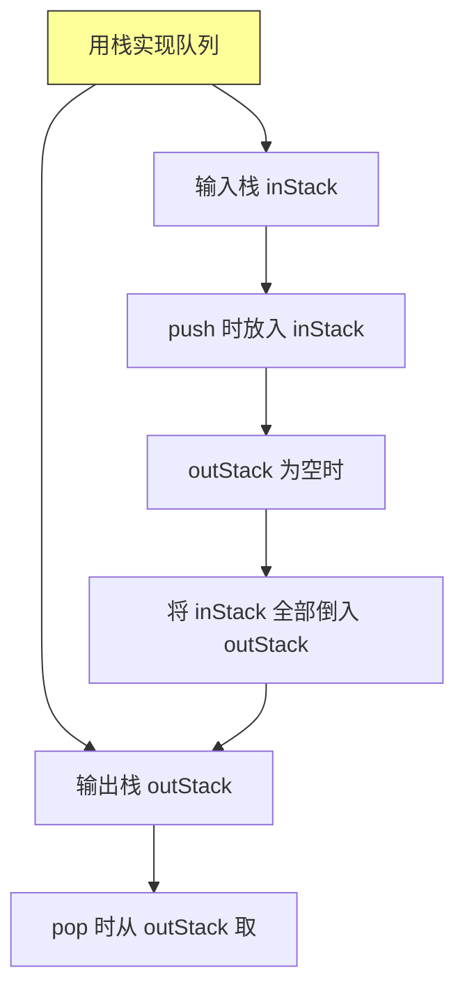

**题目 2：最小栈**

| 属性 | 内容 |
|-----|------|
| 题目 | [155. 最小栈](https://leetcode.cn/problems/min-stack/) |
| 难度 | 简单 |
| 核心思路 | 辅助栈同步存储当前最小值 |

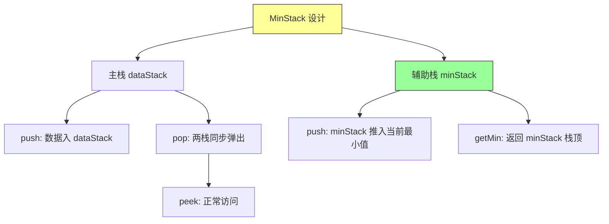

### 6.2 队列相关题目

**题目 3：设计循环队列**

| 属性 | 内容 |
|-----|------|
| 题目 | [622. 设计循环队列](https://leetcode.cn/problems/design-circular-queue/) |
| 难度 | 中等 |
| 核心思路 | 使用固定大小数组，通过模运算实现循环 |

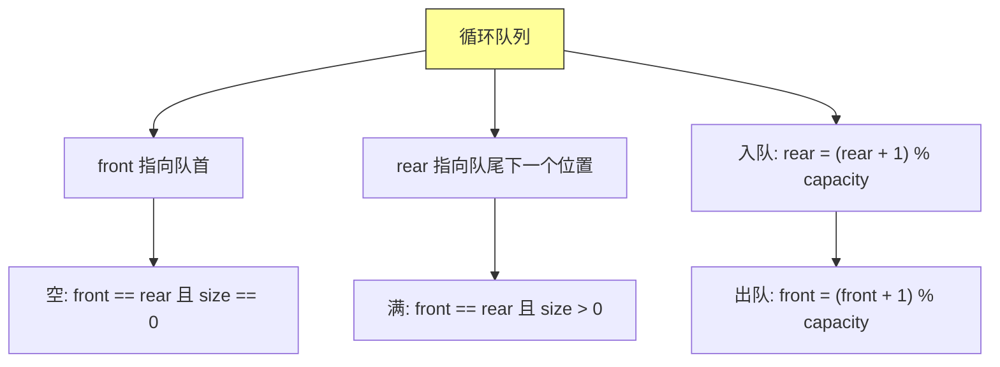

### 6.3 链表相关题目

**题目 4：删除链表中的节点**

| 属性 | 内容 |
|-----|------|
| 题目 | [237. 删除链表中的节点](https://leetcode.cn/problems/delete-node-in-a-linked-list/) |
| 难度 | 简单 |
| 核心思路 | 将下一个节点的值复制到当前节点，然后删除下一个节点 |

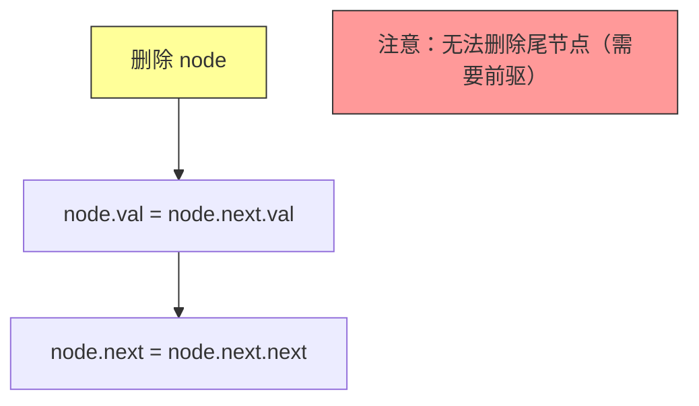

**题目 5：两数相加**

| 属性 | 内容 |
|-----|------|
| 题目 | [2. 两数相加](https://leetcode.cn/problems/add-two-numbers/) |
| 难度 | 中等 |
| 核心思路 | 逆序存储的数字链表，逐位相加处理进位 |

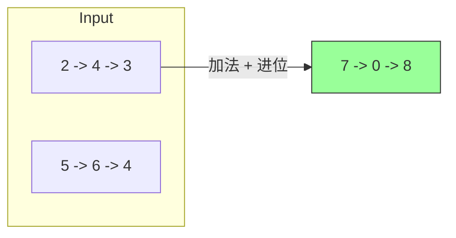

### 6.4 进阶题目

**题目 6：滑动窗口最大值**

| 属性 | 内容 |
|-----|------|
| 题目 | [239. 滑动窗口最大值](https://leetcode.cn/problems/sliding-window-maximum/) |
| 难度 | 困难 |
| 核心思路 | 单调递减队列 + 滑动窗口 |

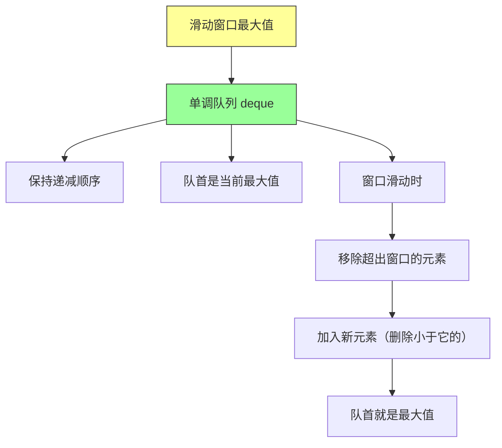

### 6.5 练习建议

| 阶段 | 推荐题目 | 知识点 |
|-----|---------|--------|
| 入门 | 232, 155, 237 | 栈、队列、链表基础操作 |
| 进阶 | 622, 2 | 循环队列、链表遍历 |
| 挑战 | 239 | 单调队列综合应用 |

---

*本章精读笔记完成*
