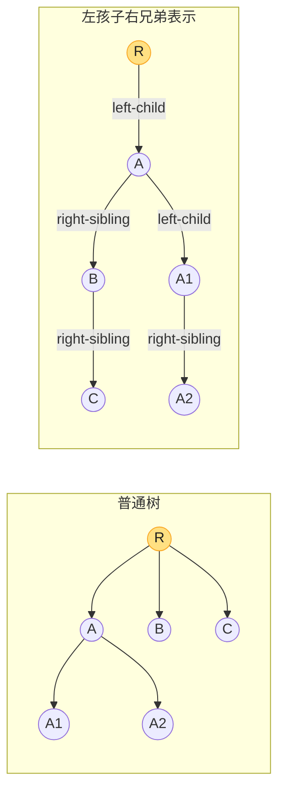

# 第十章：基本数据结构（Elementary Data Structures）

> **定位**：栈、队列、链表、有根树是**动态集合**（dynamic set）的基石——后续几乎所有数据结构都建立其上。本章不讲「如何用 Java 写一个 LinkedList 类」，而是讲它们的**抽象定义、伪代码和表示技巧**：栈/队列的数组 + 指针、链表的指针串联与哨兵、有根树的**左孩子右兄弟**表示。
> **后向指针**：栈→第 22 章 DFS 与递归调用栈；队列→第 20 章 BFS；链表→第 11 章哈希表的链地址法、第 23 章图的邻接表；有根树→第 12 章 BST、第 13 章红黑树、第 6 章堆。
>
> 对照第四版书页 252–268（**注意**：第四版删去了第三版的「指针和对象的实现」一节，只保留三节）。

---

## 一、栈和队列（§10.1）

两者都是**动态集合**，区别只在删除元素的位置：栈删**最新插入**的（LIFO），队列删**最早插入**的（FIFO）。所有操作都 Θ(1)。

### 1.1 栈（LIFO）

用数组 `S[1..n]` + 属性 `S.top`（栈顶下标，0 表示空）：

```
STACK-EMPTY(S)        PUSH(S, x)            POP(S)
1  if S.top == 0      1  S.top = S.top + 1   1  if STACK-EMPTY(S) error underflow
2      return TRUE    2  S[S.top] = x         2  else S.top = S.top - 1
3  else return FALSE                          3  return S[S.top + 1]
```

> **下溢/溢出**：空栈 POP 是下溢（错误）；`S.top > n` 是溢出（需扩容或报错）。均摊分析下，动态扩容的栈 PUSH 仍 Θ(1) 摊还（见第 16 章摊还分析）。

### 1.2 队列（FIFO）

用数组 `Q[1..n]` + `Q.head`（队首）和 `Q.tail`（下一个入队位置），**环形**复用：

```
ENQUEUE(Q, x)                      DEQUEUE(Q)
1  Q[Q.tail] = x                    1  x = Q[Q.head]
2  if Q.tail == Q.length            2  if Q.head == Q.length
3      Q.tail = 1                       3      Q.head = 1
4  else Q.tail = Q.tail + 1         4  else Q.head = Q.head + 1
5  return x
```

> **空/满区分**：`Q.head == Q.tail` 既可能是空也可能是满。两种解法：① 维护 `Q.size` 计数；② **浪费一个槽位**，`(Q.tail + 1) mod Q.length == Q.head` 时视为满（故容量 n 的数组最多存 n−1 个元素）。习题 10.1-5 即要求补上溢/下溢检查。

### 1.3 复杂度

| 操作 | 栈 | 队列 |
|------|----|------|
| 插入（PUSH / ENQUEUE） | Θ(1) | Θ(1) |
| 删除（POP / DEQUEUE） | Θ(1) | Θ(1) |
| 判空 | Θ(1) | Θ(1) |

---

## 二、链表（§10.2）

数组随机访问 Θ(1) 但中间插入删除 Θ(n)；链表反过来——**指针串联**，插入删除 Θ(1)（已知节点位置时），但随机访问 Θ(n)。

### 2.1 三种链表

- **单链表**：每个节点只有 `next`。
- **双向链表**：每个节点有 `prev` 和 `next`，可双向遍历，**O(1) 删除**（已知节点）。
- **循环链表**：表尾的 `next` 指回表头（可单可双）。

### 2.2 双向链表伪代码（带哨兵 L.nil）

CLRS 用**哨兵节点 `L.nil`** 把表头尾的边界条件统一：空表时 `L.nil.next = L.nil.prev = L.nil`，所有「表头/表尾」判断都不再是特例。

```
LIST-SEARCH(L, k)                   LIST-INSERT(L, x)        // 插到表头
1  x = L.nil.next                   1  x.next = L.nil.next
2  while x != L.nil and x.key != k  2  L.nil.next.prev = x
3      x = x.next                   3  L.nil.next = x
4  return x                         4  x.prev = L.nil

LIST-DELETE(L, x)
1  x.prev.next = x.next
2  x.next.prev = x.prev
```

> **哨兵的价值**：让 INSERT/DELETE 不必特判「插到空表」「删头/尾节点」——代码更短、更不易错。哨兵不存数据，只占一个节点空间（常数开销）。

### 2.3 删除的关键区别（习题 10.2-1）

- **单链表删除节点 x**：必须知道 x 的**前驱**（O(n) 查找），故删除是 Θ(n)。
- **双向链表删除节点 x**：x 自带 `prev`，O(1) 完成。
- **LC 237「删除节点」的取巧**：无法访问前驱时，把 `x.next` 的值复制到 x，再删 `x.next`——但**删不了尾节点**。

### 2.4 复杂度

| 操作 | 单链表 | 双向链表 |
|------|--------|---------|
| 搜索 LIST-SEARCH | Θ(n) | Θ(n) |
| 插入（已知位置） | Θ(1) | Θ(1) |
| 删除（已知节点） | Θ(n)（找前驱） | **Θ(1)** |

---

## 三、表示有根树（§10.3）

### 3.1 二叉树

每个节点三个指针：`p`（父）、`left`（左孩子）、`right`（右孩子）；树用 `T.root` 指向根，`T.root == NIL` 表示空树。这是第 12 章 BST、第 13 章红黑树的标准表示。

### 3.2 任意分支：左孩子右兄弟（LCRS）

孩子数不固定时，给每个节点 k 个孩子指针（`child₁..childₖ`）既浪费（多数节点孩子少）又限死上限。**左孩子右兄弟表示（left-child, right-sibling）**只用两个指针表示任意多孩子：

```
每个节点 x：
  x.p            父指针
  x.left-child   指向 x 的最左孩子
  x.right-sibling 指向 x 的紧右兄弟
```



**空间 Θ(n)**（每个节点恒定 3 个指针），无论分支多广。代价：访问第 i 个孩子要沿 right-sibling 走 i 步。

> **其他表示**：堆用**数组**（完全二叉树，第 6 章）；不相交集合只存**父指针**（向根遍历即可，第 19 章）。选哪种取决于操作模式。

---

## 四、代码实现（Java + Python）

克制的最小实现：数组栈、双向链表（带哨兵）、LCRS 树。对应 CLRS 伪代码，0-indexed。

### Java

```java
import java.util.*;
// 数组栈（对应 §10.1 伪代码）
class ArrayStack<E> {
    private Object[] a = new Object[8];
    private int top = 0;                       // 元素数；a[0..top)
    public void push(E x) {
        if (top == a.length) a = Arrays.copyOf(a, a.length * 2);
        a[top++] = x;
    }
    @SuppressWarnings("unchecked")
    public E pop() {
        if (top == 0) throw new NoSuchElementException();
        E x = (E) a[--top]; a[top] = null; return x;
    }
    public boolean isEmpty() { return top == 0; }
}

// 双向链表（带哨兵 sentinel，对应 §10.2 伪代码）
class LinkedList<E> {
    private static class Node<E> { E key; Node<E> prev, next; Node(E k){key=k;} }
    private final Node<E> nil = new Node<>(null);   // 哨兵
    private int size = 0;
    public LinkedList() { nil.prev = nil.next = nil; }

    public void insert(E key) {                  // 头插
        Node<E> x = new Node<>(key);
        x.next = nil.next;  nil.next.prev = x;
        nil.next = x;       x.prev = nil;
        size++;
    }
    public Node<E> search(E key) {
        Node<E> x = nil.next;
        while (x != nil && !Objects.equals(x.key, key)) x = x.next;
        return x == nil ? null : x;
    }
    public boolean delete(E key) {
        Node<E> x = search(key);
        if (x == null) return false;
        x.prev.next = x.next;  x.next.prev = x.prev;   // 哨兵让此处无需特判
        size--; return true;
    }
    public List<E> toList() {
        List<E> out = new ArrayList<>();
        for (Node<E> x = nil.next; x != nil; x = x.next) out.add(x.key);
        return out;
    }
}

// 左孩子右兄弟树（§10.3 LCRS）
class RootedTree {
    static class Node {
        int key; Node p, leftChild, rightSibling;
        Node(int k){key=k;}
    }
    Node root;
    // 添加 child 作为 parent 的孩子（parent 为 null 表示建根）
    Node addChild(Node parent, int key) {
        Node c = new Node(key); c.p = parent;
        if (parent == null) { root = c; return c; }
        c.rightSibling = parent.leftChild;          // 头插到兄弟链
        parent.leftChild = c;
        return c;
    }
    // 先序遍历
    void preOrder(Node x, List<Integer> out) {
        if (x == null) return;
        out.add(x.key);
        for (Node c = x.leftChild; c != null; c = c.rightSibling) preOrder(c, out);
    }
}

public class Elementary {
    public static void main(String[] args) {
        ArrayStack<Integer> s = new ArrayStack<>();
        for (int i : new int[]{1,2,3}) s.push(i);
        System.out.print("栈 pop: ");
        while (!s.isEmpty()) System.out.print(s.pop() + " ");   // 3 2 1

        LinkedList<String> L = new LinkedList<>();
        L.insert("a"); L.insert("b"); L.insert("c");
        L.delete("b");
        System.out.println("\n链表: " + L.toList());             // [c, a]

        RootedTree t = new RootedTree();
        RootedTree.Node r = t.addChild(null, 1);
        t.addChild(r, 2); t.addChild(r, 3);
        List<Integer> out = new ArrayList<>(); t.preOrder(t.root, out);
        System.out.println("LCRS 先序: " + out);                 // [1, 3, 2]（头插）
    }
}
```

### Python

```python
class ArrayStack:
    def __init__(self): self._a = []
    def push(self, x): self._a.append(x)
    def pop(self):
        if not self._a: raise IndexError("underflow")
        return self._a.pop()
    def is_empty(self): return not self._a


class LinkedList:
    """双向链表，带哨兵 nil（对应 §10.2 伪代码）。"""
    class _Node:
        __slots__ = ("key", "prev", "next")
        def __init__(self, key): self.key = key
    def __init__(self):
        self.nil = self._Node(None); self.nil.prev = self.nil.next = self.nil
    def insert(self, key):                       # 头插
        x = self._Node(key)
        x.next = self.nil.next;  self.nil.next.prev = x
        self.nil.next = x;       x.prev = self.nil
    def _search(self, key):
        x = self.nil.next
        while x is not self.nil and x.key != key: x = x.next
        return None if x is self.nil else x
    def delete(self, key):
        x = self._search(key)
        if x is None: return False
        x.prev.next = x.next; x.next.prev = x.prev
        return True
    def to_list(self):
        out, x = [], self.nil.next
        while x is not self.nil: out.append(x.key); x = x.next
        return out


class RootedTree:
    """左孩子右兄弟表示（§10.3 LCRS）。"""
    class Node:
        __slots__ = ("key", "p", "left_child", "right_sibling")
        def __init__(self, key): self.key = key; self.left_child = self.right_sibling = None
    def __init__(self): self.root = None
    def add_child(self, parent, key):
        c = self.Node(key); c.p = parent
        if parent is None: self.root = c; return c
        c.right_sibling = parent.left_child      # 头插到兄弟链
        parent.left_child = c
        return c
    def pre_order(self, x=None, out=None):
        if out is None: out = []
        if x is None: x = self.root
        if x is None: return out
        out.append(x.key)
        c = x.left_child
        while c is not None: self.pre_order(c, out); c = c.right_sibling
        return out


if __name__ == "__main__":
    s = ArrayStack()
    for i in (1, 2, 3): s.push(i)
    print("栈 pop:", [s.pop() for _ in range(3)])          # [3, 2, 1]

    L = LinkedList()
    for k in ("a", "b", "c"): L.insert(k)
    L.delete("b")
    print("链表:", L.to_list())                            # ['c', 'a']

    t = RootedTree()
    r = t.add_child(None, 1); t.add_child(r, 2); t.add_child(r, 3)
    print("LCRS 先序:", t.pre_order())                     # [1, 3, 2]
```

> **验证**：Java/Python 均编译运行通过；链表插入/删除、栈 LIFO、LCRS 遍历均与预期一致。

---

## 五、复杂度速查 + 易混点

### 5.1 速查

| 结构 | 插入 | 删除 | 搜索 | 随机访问 |
|------|------|------|------|---------|
| 栈（数组） | Θ(1) 摊还 | Θ(1)（栈顶） | — | — |
| 队列（环形数组） | Θ(1) | Θ(1)（队首） | — | — |
| 单链表 | Θ(1) | Θ(n)（找前驱） | Θ(n) | Θ(n) |
| 双向链表 | Θ(1) | **Θ(1)**（已知节点） | Θ(n) | Θ(n) |
| 二叉树（三指针） | Θ(1) 建节点 | — | — | — |
| LCRS 任意树 | Θ(1) | — | — | — |

### 5.2 易混点

- **单链表 vs 双向链表删除**：单链表删 x 必须先找前驱（Θ(n)），双向链表 x 自带 `prev`（Θ(1)）。这是哈希表链地址法常用双向链表的原因（LRU 删除要 O(1)）。
- **哨兵不是哑节点**：哨兵 `L.nil` 是链表的一部分（构成环），不是「头节点」概念。它让所有边界判断消失，代码更简洁。
- **队列空/满**：`head == tail` 二义——用 `size` 计数或浪费一格。别想当然认为 `head == tail` 就是空。
- **LCRS 不是把树转成二叉树**：它是一种**存储映射**，原树的兄弟关系变成 LCRS 的 right-sibling 链、父子关系变成 left-child。遍历语义变了，要配套 LCRS 专属的遍历。
- **栈 vs 队列只差删除端**：栈删最新（同端），队列删最早（异端）。一个 Θ(1) 数组实现，全靠 top/head/tail 指针。

---

## 六、LeetCode 关联 + 习题 + 思考题

### 6.1 LeetCode 关联

| 题目 | 难度 | 考点 | 用本章什么 |
|------|------|------|-----------|
| [155. 最小栈](https://leetcode.cn/problems/min-stack/) | 中 | 辅助栈 | 栈 + 同步维护最小值 |
| [232. 用栈实现队列](https://leetcode.cn/problems/implement-queue-using-stacks/) | 中 | 双栈 | 习题 10.1-6/7 |
| [225. 用队列实现栈](https://leetcode.cn/problems/implement-stack-using-queues/) | 中 | 双队列 | 习题 10.1-7 |
| [622. 设计循环队列](https://leetcode.cn/problems/design-circular-queue/) | 中 | 环形数组 | §10.1 环形队列 |
| [206. 反转链表](https://leetcode.cn/problems/reverse-linked-list/) | 简 | 指针操作 | 链表基本 |
| [146. LRU 缓存](https://leetcode.cn/problems/lru-cache/) | 中 | 双向链表 + 哈希 | §10.2 双向链表 O(1) 删除 |
| [239. 滑动窗口最大值](https://leetcode.cn/problems/sliding-window-maximum/) | 困 | 单调双端队列 | 双端队列 |

### 6.2 习题快问快答（第四版编号）

- **10.1-2**　两个栈共享一个数组 `S[1..n]`，一个从底向上长，一个从顶向下长；溢出当两栈指针相遇。
- **10.1-5/10.1-5**　给 ENQUEUE/DEQUEUE 补上队列空（下溢）和满（上溢）检查：用 `Q.size` 或浪费一格。
- **10.1-6**　用**两个栈**实现队列：push 全进 inStack；pop/peek 时若 outStack 空，把 inStack 全倒入 outStack 再取。单次最坏 Θ(n)，但**摊还 Θ(1)**（每个元素最多被搬运两次）。
- **10.1-7**　用**两个队列**实现栈：pop 时把除最后一个外的元素倒入另一队列，剩下的就是栈顶。
- **10.2-1**　单链表上的 DELETE 在 Θ(1) 内**无法**完成（需前驱）；但 INSERT/SEARCH 仍 Θ(1)/Θ(n)。
- **10.2-2**　单链表实现栈：PUSH 头插、POP 删头，均 Θ(1)。
- **10.2-5**　**有序循环链表**插入：沿表走到合适位置 Θ(n)，插入本身 Θ(1)。
- **10.2-6**　两个不相交链表的**并集**（UNION）：把其一接在另一尾部 Θ(1)（循环链表）。

### 6.3 思考题要点

- **10-1 各种链表比较**：单/双 × 有/无哨兵，列 INSERT/DELETE/SEARCH/UNION 的复杂度表——双向链表 + 哨兵最通用。
- **10-2 用链表实现可合并堆**：有序/无序链表做 MIN-HEAP，分析 INSERT/MINIMUM/EXTRACT-MIN/UNION 各操作的复杂度；UNION 在无序链表上 Θ(1)，但 EXTRACT-MIN 退化 Θ(n)。
- **10-3 搜索有序紧凑链表**：链表用数组下标（游标）表示、且有序，搜索用**概率分析**（类似第 5 章雇佣问题）证明期望搜索时间。

### 章末注记

本章的抽象（动态集合 + 指针）是 CLRS 全书数据结构的脚手架：第 11 章哈希、第 12–13 章搜索树、第 19 章不相交集合、第 20–23 章图的邻接表，都建立在链表与树表示之上。**左孩子右兄弟**这一技巧尤其重要——它把「任意分支树」统一映射成「二叉树」，是后续 LCT、树链剖分等高级结构的基础。
